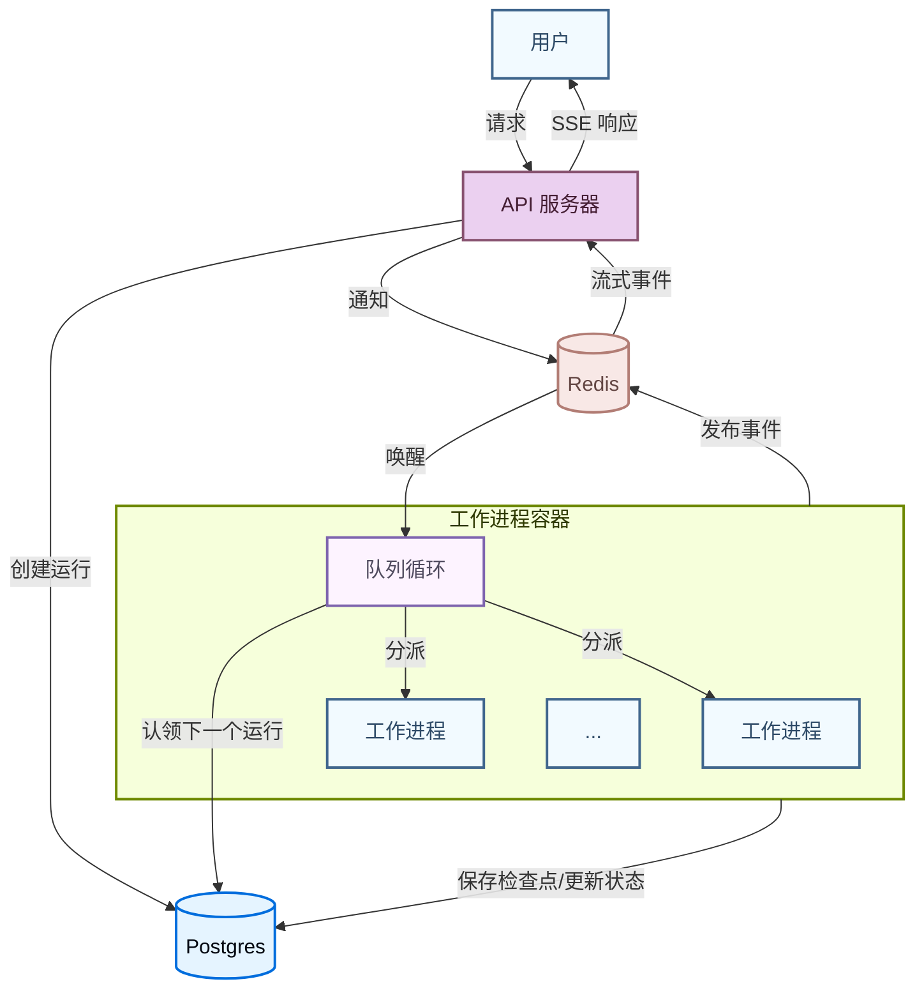

LangSmith 部署的 **Agent Server** 提供了一个用于创建和管理基于代理的应用程序的 API。它建立在 [助手](/langsmith/assistants) 的概念之上，这些助手是为特定任务配置的代理，并包含内置的 [持久化](/oss/python/langgraph/persistence#memory-store) 和一个 [**任务队列**](#task-queue)。这个多功能的 API 支持广泛的代理应用用例，从后台处理到实时交互。

使用 Agent Server 来创建和管理：

<CardGroup cols={4}>
  <Card title="助手" icon="robot" href="/langsmith/assistants" />
  <Card title="线程" icon="messages" href="/langsmith/use-threads" />
  <Card title="运行" icon="player-play" href="/langsmith/runs" />
  <Card title="定时任务" icon="clock" href="/langsmith/cron-jobs" />
</CardGroup>

<Tip>
**API 参考**  
有关 API 端点和数据模型的详细信息，请参阅 [Agent Server API 参考](/langsmith/server-api-ref)。
</Tip>

## 应用结构

要部署 Agent Server 应用，您需要指定要部署的图（graph），以及任何相关的配置设置，例如依赖项和环境变量。

阅读 [应用结构](/langsmith/application-structure) 指南，了解如何为部署构建您的 LangGraph 应用。

<Note>
[LangSmith 云](/langsmith/cloud) 为您管理数据库。如果您在 [自己的基础设施](/langsmith/self-hosted) 上部署，则需要自行设置。
</Note>

## 部署的组成部分

当您部署 Agent Server 时，您正在部署一个或多个 [图](#graphs)、一个用于 [持久化](/oss/python/langgraph/persistence) 的数据库和一个 [任务队列](#task-queue)。

### 图

当您使用 Agent Server 部署一个图时，您正在部署一个 [助手](/langsmith/assistants) 的“蓝图”。

图最常实现一个 [代理](/oss/python/langgraph/workflows-agents)，但它不必如此。例如，一个图可以实现一个简单的聊天机器人，仅支持来回对话，而无法影响任何应用程序控制流。实际上，随着应用程序变得越来越复杂，图通常会实现一个更复杂的流程，该流程可能使用 [多个代理](/oss/python/langchain/multi-agent) 协同工作。

图不必使用 LangGraph 编写。您也可以使用 LangGraph Functional API 部署使用其他框架（如 Strands 或 Google ADK）构建的代理。有关详细信息，请参阅 [部署其他框架](/langsmith/deploy-other-frameworks)。

#### 图的加载和编译

您的图如何以及何时被编译取决于您在 [应用结构](/langsmith/application-structure) 中注册它的方式：

1. **已编译的图**（推荐）：导出一个已编译的 `CompiledGraph` 实例。服务器在容器启动时加载一次，并在每次运行时重用它——没有每次请求的编译开销。
2. **工厂函数**：导出一个代理工厂函数，服务器在每次需要图时调用它。仅在您需要每次运行时自定义图（例如，根据助手配置选择不同的模型或工具）时使用此方法。保持工厂函数轻量级，因为它们在每次调用时运行。

<Tip>
除非您特别需要每次运行时的自定义，否则请使用已编译的图。工厂函数在每次调用时都会增加开销；已编译的图则不会。
</Tip>

在这两种情况下，服务器都会在运行时自动注入为该部署配置的检查点（checkpointer）和内存存储（memory store）。**不要在您的图代码中配置这些**，因为服务器需要管理它们以进行其他操作。

### 持久化

Agent Server 持久化三种类型的数据，默认都由 [PostgreSQL](https://www.postgresql.org/) 支持：

- **核心资源数据**：助手、线程、运行和定时任务。始终存储在 PostgreSQL 中。
- **检查点（短期记忆）**：在每个步骤写入的图执行状态快照。它们使运行持久化：如果工作进程被中断，运行可以从最后一个检查点恢复，而不是从头开始。持久性模式控制检查点频率——`async`（默认）在每个步骤后写入；`exit` 仅存储最终状态。LangSmith 默认将此存储在 PostgreSQL 中；但您可以切换到 [MongoDB](https://www.mongodb.com/) 或自定义实现。有关详细信息，请参阅 [配置检查点后端](/langsmith/configure-checkpointer)。
- **存储（长期记忆）**：跨线程持久化的记忆，使代理能够在不同的对话之间保留信息。默认存储在 PostgreSQL 中，但可以用自定义实现替换。有关详细信息，请参阅 [添加自定义存储](/langsmith/custom-store)。

### 任务队列

当客户端创建一个运行时，API 服务器将其入队，然后一个队列工作进程会拾取它进行执行。工作进程也可以被发出信号以取消正在进行的运行，并发布输出事件，这些事件会通过打开的 `/stream` 连接实时转发给客户端。

[Redis](https://redis.io/) 处理 API 服务器和队列工作进程之间的信号传递、取消和流式发布/订阅。它只存储临时数据——没有用户或运行数据持久化在 Redis 中。运行数据本身始终从 PostgreSQL 读取和写入。

有关如何设置和管理这些组件的更多信息，请查阅 [托管选项](/langsmith/platform-setup) 指南。

## 运行时架构

### 部署模式

Agent Server 支持三种运行时配置：

- **单主机**：API 服务器直接管理任务队列，没有单独的队列工作进程。这是自托管部署的默认设置，适用于开发和低流量用例。
- **分离 API 和队列**：专用的队列工作进程在与 API 服务器分离的主机上处理运行执行。对于自托管部署，通过在配置中设置 `queue.enabled: true` 来启用此功能。每个层独立扩展——API 服务器根据请求量扩展，队列工作进程根据待处理运行数量扩展。
- **分布式运行时**：API 和队列进程再次分离运行，但不是由单个队列进程处理图的编排和执行，分布式运行时使用一个进程进行编排，一个进程进行执行。将其用于具有高并发需求的大规模部署。

下面描述的容器架构和运行生命周期适用于单主机以及分离 API 和队列的配置。

### 容器架构

典型的部署由两种长期运行的容器组成，它们都构建自相同的 Docker 镜像（一个基础镜像，上面安装了您的项目代码）：

- **API 服务器**处理客户端请求（创建运行、读取线程状态、流式传输结果），但不执行代理代码本身。
- **队列工作进程**是执行引擎。它们监听持久任务队列，执行您的图代码，并写入检查点。

容器是**无状态**的，但具有持久性。任何时间都必须至少有 1 个队列工作进程监听任务队列，以确保没有运行被孤立。容器在其生命周期内可以服务许多运行。

API 服务器和队列工作进程是独立的容器池，并且 [独立扩展](/langsmith/data-plane#autoscaling)。

### 运行执行生命周期

当您调用一个运行时，请求会流经几个组件：

1. 客户端向 API 服务器发送请求，API 服务器在持久任务队列中创建一个待处理的运行。
2. 一个队列工作进程拾取该运行，获取其租约，加载相应的图，并开始执行。队列强制执行对于给定线程，一次最多只能执行 1 个运行。
3. 随着图的执行，工作进程将检查点写入持久化层（频率取决于 [持久性模式](/oss/python/langgraph/durable-execution#durability-modes)），并通过配置的 pubsub 提供者广播流式事件。
4. 如果客户端打开了 `/stream` 连接，API 服务器会订阅 pubsub 频道，并通过服务器发送事件实时将事件转发给客户端。
5. 当执行完成时，工作进程更新运行状态并释放其槽位以供下一个运行使用。

每个工作进程最多并发处理 [`N_JOBS_PER_WORKER`](/langsmith/env-var#n_jobs_per_worker) 个运行（默认：10），因此单个工作进程容器可以并行服务许多运行。有关调整指南，请参阅 [配置 Agent Server 以实现扩展](/langsmith/agent-server-scale)。

## 了解更多

- [应用结构](/langsmith/application-structure) 指南解释了如何为部署构建您的应用。
- [API 参考](https://docs.langchain.com/langsmith/server-api-ref) 提供了有关 API 端点和数据模型的详细信息。

---

<Callout icon="terminal-2">
    [将这些文档](/use-these-docs) 通过 MCP 连接到 Claude、VSCode 等，以获取实时答案。
</Callout>
<Callout icon="edit">
    [在 GitHub 上编辑此页面](https://github.com/langchain-ai/docs/edit/main/src/langsmith/agent-server.mdx) 或 [提交问题](https://github.com/langchain-ai/docs/issues/new/choose)。
</Callout>

