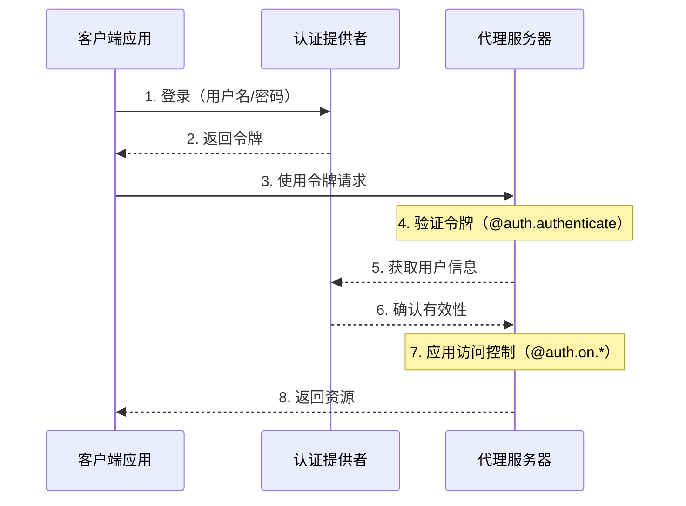
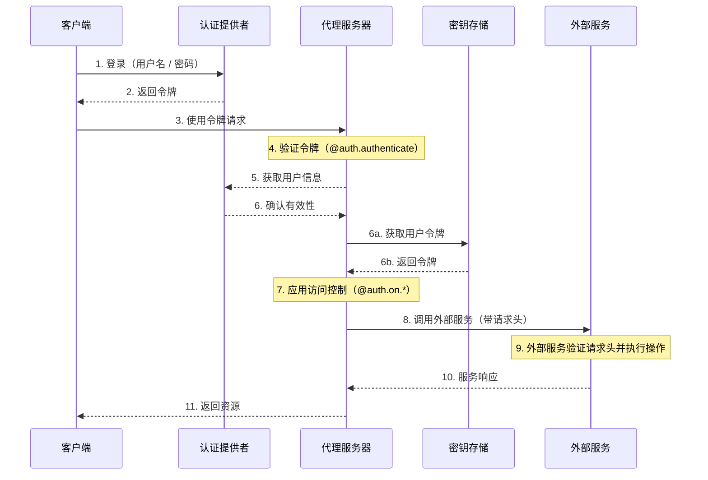

LangSmith 提供了一个灵活的认证和授权系统，可以与大多数认证方案集成。

## 核心概念

### 认证 vs 授权

虽然这两个术语经常互换使用，但它们代表了不同的安全概念：

* [**认证**](#认证)（"AuthN"）验证 _你是谁_。这作为每个请求的中间件运行。
* [**授权**](#授权)（"AuthZ"）确定 _你能做什么_。这基于每个资源验证用户的权限和角色。

在 LangSmith 中，认证由你的 [`@auth.authenticate`](https://reference.langchain.com/python/langgraph-sdk/auth/Auth/authenticate) 处理器处理，授权由你的 [`@auth.on`](https://reference.langchain.com/python/langgraph-sdk/auth/Auth/on) 处理器处理。

## 默认安全模型

LangSmith 提供不同的安全默认值：

### LangSmith

* 默认使用 LangSmith API 密钥
* 需要在 `x-api-key` 头中提供有效的 API 密钥
* 可以使用你的认证处理器进行自定义

<Note>
**自定义认证**
LangSmith 的所有计划都**支持**自定义认证。
</Note>

### 自托管

* 没有默认认证
* 完全灵活地实现你的安全模型
* 你控制认证和授权的所有方面


## 系统架构

典型的认证设置涉及三个主要组件：

1. **认证提供者**（身份提供者/IdP）
   * 一个管理用户身份和凭证的专用服务
   * 处理用户注册、登录、密码重置等
   * 在成功认证后颁发令牌（JWT、会话令牌等）
   * 示例：Auth0、Supabase Auth、Okta 或你自己的认证服务器
2. **代理服务器**（资源服务器）
   * 你的代理或 LangGraph 应用程序，包含业务逻辑和受保护资源
   * 与认证提供者验证令牌
   * 基于用户身份和权限强制执行访问控制
   * 不直接存储用户凭证
3. **客户端应用程序**（前端）
   * Web 应用、移动应用或 API 客户端
   * 收集时效性用户凭证并发送给认证提供者
   * 从认证提供者接收令牌
   * 在向代理服务器发出的请求中包含这些令牌

以下是这些组件通常的交互方式：



你在 LangGraph 中的 [`@auth.authenticate`](https://reference.langchain.com/python/langgraph-sdk/auth/Auth/authenticate) 处理器处理步骤 4-6，而你的 [`@auth.on`](https://reference.langchain.com/python/langgraph-sdk/auth/Auth/on) 处理器实现步骤 7。

## 认证

LangGraph 中的认证作为每个请求的中间件运行。你的 [`@auth.authenticate`](https://reference.langchain.com/python/langgraph-sdk/auth/Auth/authenticate) 处理器接收请求信息，并应：

1. 验证凭证
2. 如果有效，返回包含用户身份和用户信息的[用户信息](https://reference.langchain.com/python/langgraph-sdk/auth/types/MinimalUserDict)
3. 如果无效，引发 [HTTP 异常](https://reference.langchain.com/python/langgraph-sdk/auth/exceptions/HTTPException) 或 AssertionError

```python
from langgraph_sdk import Auth

auth = Auth()

@auth.authenticate
async def authenticate(headers: dict) -> Auth.types.MinimalUserDict:
    # 验证凭证（例如，API 密钥、JWT 令牌）
    api_key = headers.get(b"x-api-key")
    if not api_key or not is_valid_key(api_key):
        raise Auth.exceptions.HTTPException(
            status_code=401,
            detail="Invalid API key"
        )

    # 返回用户信息 - 只需要身份和 is_authenticated
    # 添加任何你需要用于授权的额外字段
    return {
        "identity": "user-123",        # 必需：唯一用户标识符
        "is_authenticated": True,      # 可选：默认为 True
        "permissions": ["read", "write"], # 可选：用于基于权限的认证
        # 如果你想实现其他认证模式，可以添加更多自定义字段
        "role": "admin",
        "org_id": "org-456"

    }
```

返回的用户信息可用于：

* 通过 [`ctx.user`](https://reference.langchain.com/python/langgraph-sdk/auth/types/AuthContext) 提供给你的授权处理器
* 在你的应用程序中通过 `config["configuration"]["langgraph_auth_user"]` 访问

<Accordion title="支持的参数">
  [`@auth.authenticate`](https://reference.langchain.com/python/langgraph-sdk/auth/Auth/authenticate) 处理器可以按名称接受以下任何参数：

  * request (Request)：原始 ASGI 请求对象
  * path (str)：请求路径，例如 `"/threads/abcd-1234-abcd-1234/runs/abcd-1234-abcd-1234/stream"`
  * method (str)：HTTP 方法，例如 `"GET"`
  * path_params (dict[str, str])：URL 路径参数，例如 `{"thread_id": "abcd-1234-abcd-1234", "run_id": "abcd-1234-abcd-1234"}`
  * query_params (dict[str, str])：URL 查询参数，例如 `{"stream": "true"}`
  * headers (dict[bytes, bytes])：请求头
  * authorization (str | None)：Authorization 头的值（例如 `"Bearer <token>"`）

  在我们的许多教程中，为了简洁，我们只展示 "authorization" 参数，但你可以根据需要选择接受更多信息来实现你的自定义认证方案。
</Accordion>

### 代理认证

自定义认证允许委托访问。你在 `@auth.authenticate` 中返回的值会添加到运行上下文中，为代理提供用户范围的凭证，使它们能够代表用户访问资源。



认证后，平台会创建一个特殊的配置对象，通过可配置上下文传递给你的图和所有节点。
此对象包含有关当前用户的信息，包括你从 [`@auth.authenticate`](https://reference.langchain.com/python/langgraph-sdk/auth/Auth/authenticate) 处理器返回的任何自定义字段。

要使代理能够代表用户操作，请使用[自定义认证中间件](/langsmith/custom-auth)。这将允许代理代表用户与外部系统（如 MCP 服务器、外部数据库甚至其他代理）进行交互。

更多信息，请参阅[使用自定义认证](/langsmith/custom-auth#enable-agent-authentication)指南。

### 使用 MCP 的代理认证

有关如何向 MCP 服务器认证代理的信息，请参阅 [MCP 概念指南](/oss/python/langchain/mcp)。

## 授权

认证后，LangGraph 调用你的 [`@auth.on`](https://reference.langchain.com/python/langgraph-sdk/auth/Auth) 处理器来控制对特定资源（例如，线程、助手、定时任务）的访问。这些处理器可以：

1. 通过直接修改 `value["metadata"]` 字典，在资源创建时添加要保存的元数据。有关每个操作的值可以采用的类型列表，请参阅[支持的操作表](#支持的操作)。
2. 在搜索/列表或读取操作期间，通过返回[过滤器字典](#过滤器操作)按元数据过滤资源。
3. 如果访问被拒绝，则引发 HTTP 异常。

如果你想实现简单的用户范围访问控制，可以为所有资源和操作使用单个 [`@auth.on`](https://reference.langchain.com/python/langgraph-sdk/auth/Auth) 处理器。如果你想根据资源和操作进行不同的控制，可以使用[特定于资源的处理器](#特定于资源的处理器)。有关支持访问控制的资源的完整列表，请参阅[支持的资源](#支持的资源)部分。

```python
@auth.on
async def add_owner(
    ctx: Auth.types.AuthContext,
    value: dict  # 发送到此访问方法的有效负载
) -> dict:  # 返回一个过滤器字典，用于限制对资源的访问
    """授权对线程、运行、定时任务和助手的所有访问。

    此处理器做两件事：
        - 向资源元数据添加一个值（与资源一起持久化，以便稍后可以过滤）
        - 返回一个过滤器（用于限制对现有资源的访问）

    参数：
        ctx：包含用户信息、权限、路径的认证上下文
        value：发送到端点的请求有效负载。对于创建操作，这包含资源参数。对于读取操作，这包含正在访问的资源。

    返回：
        LangGraph 用于限制资源访问的过滤器字典。
        有关支持的运算符，请参阅[过滤器操作](#过滤器操作)。
    """
    # 创建过滤器以将访问限制为仅此用户的资源
    filters = {"owner": ctx.user.identity}

    # 获取或创建有效负载中的元数据字典
    # 这是我们存储资源持久信息的地方
    metadata = value.setdefault("metadata", {})

    # 将所有者添加到元数据 - 如果这是创建或更新操作，
    # 此信息将与资源一起保存
    # 这样我们稍后可以在读取操作中按它进行过滤
    metadata.update(filters)

    # 返回过滤器以限制访问
    # 这些过滤器应用于所有操作（创建、读取、更新、搜索等）
    # 以确保用户只能访问自己的资源
    return filters
```

<a id="特定于资源的处理器"></a>
### 特定于资源的处理器

你可以通过将资源和操作名称与 [`@auth.on`](https://reference.langchain.com/python/langgraph-sdk/auth/Auth) 装饰器链接在一起来注册特定资源和操作的处理器。
当发出请求时，将调用与该资源和操作匹配的最具体的处理器。以下是注册特定资源和操作处理器的示例。对于以下设置：

1. 认证用户可以创建线程、读取线程以及在线程上创建运行
2. 只有具有 "assistants:create" 权限的用户才允许创建新的助手
3. 所有其他端点（例如，删除助手、定时任务、存储）对所有用户都禁用。

<Tip>
**支持的处理器**
有关支持的资源和操作的完整列表，请参阅下面的[支持的资源](#支持的资源)部分。
</Tip>

```python
# 通用/全局处理器捕获未被更具体处理器处理的调用
@auth.on
async def reject_unhandled_requests(ctx: Auth.types.AuthContext, value: Any) -> False:
    print(f"Request to {ctx.path} by {ctx.user.identity}")
    raise Auth.exceptions.HTTPException(
        status_code=403,
        detail="Forbidden"
    )

# 匹配 "thread" 资源和所有操作 - 创建、读取、更新、删除、搜索
# 由于这比通用的 @auth.on 处理器**更具体**，它将优先于通用处理器处理 "threads" 资源的所有操作
@auth.on.threads
async def on_thread(
    ctx: Auth.types.AuthContext,
    value: Auth.types.threads.create.value
):
    # 在正在创建的线程上设置元数据
    # 将确保资源包含 "owner" 字段
    # 然后每当用户尝试访问此线程或线程内的运行时，
    # 我们可以按所有者进行过滤
    metadata = value.setdefault("metadata", {})
    metadata["owner"] = ctx.user.identity
    return {"owner": ctx.user.identity}


# 线程创建。这将仅匹配线程创建操作
# 由于这比通用的 @auth.on 处理器和 @auth.on.threads 处理器**更具体**，
# 它将优先于任何 "threads" 资源的 "create" 操作
@auth.on.threads.create
async def on_thread_create(
    ctx: Auth.types.AuthContext,
    value: Auth.types.threads.create.value
):
    # 如果用户没有写入权限则拒绝
    if "write" not in ctx.permissions:
        raise Auth.exceptions.HTTPException(
            status_code=403,
            detail="User lacks the required permissions."
        )
    # 在正在创建的线程上设置元数据
    # 将确保资源包含 "owner" 字段
    # 然后每当用户尝试访问此线程或线程内的运行时，
    # 我们可以按所有者进行过滤
    metadata = value.setdefault("metadata", {})
    metadata["owner"] = ctx.user.identity
    return {"owner": ctx.user.identity}

# 读取线程。由于这也比通用的 @auth.on 处理器和 @auth.on.threads 处理器更具体，
# 它将优先于任何 "threads" 资源的 "read" 操作
@auth.on.threads.read
async def on_thread_read(
    ctx: Auth.types.AuthContext,
    value: Auth.types.threads.read.value
):
    # 由于我们正在读取（而不是创建）线程，
    # 我们不需要设置元数据。我们只需要
    # 返回一个过滤器以确保用户只能看到自己的线程
    return {"owner": ctx.user.identity}

# 运行创建、流式传输、更新等。
# 这优先于通用的 @auth.on 处理器和 @auth.on.threads 处理器
@auth.on.threads.create_run
async def on_run_create(
    ctx: Auth.types.AuthContext,
    value: Auth.types.threads.create_run.value
):
    metadata = value.setdefault("metadata", {})
    metadata["owner"] = ctx.user.identity
    # 继承线程的访问控制
    return {"owner": ctx.user.identity}

# 助手创建
@auth.on.assistants.create
async def on_assistant_create(
    ctx: Auth.types.AuthContext,
    value: Auth.types.assistants.create.value
):
    if "assistants:create" not in ctx.permissions:
        raise Auth.exceptions.HTTPException(
            status_code=403,
            detail="User lacks the required permissions."
        )
```

请注意，在上面的示例中，我们混合了全局和特定于资源的处理器。由于每个请求都由最具体的处理器处理，创建 `thread` 的请求将匹配 `on_thread_create` 处理器，但不会匹配 `reject_unhandled_requests` 处理器。然而，`update` 线程的请求将由全局处理器处理，因为我们没有针对该资源和操作的更具体的处理器。

<a id="过滤器操作"></a>
### 过滤器操作

授权处理器可以返回 `None`、布尔值或过滤器字典。

* `None` 和 `True` 表示 "授权访问所有下属资源"
* `False` 表示 "拒绝访问所有下属资源（引发 403 异常）"
* 元数据过滤器字典将限制对资源的访问

过滤器字典是一个键与资源元数据匹配的字典。它支持三种运算符：

* 默认值是精确匹配或下面的 "$eq" 的简写。例如，`{"owner": user_id}` 将仅包含元数据中包含 `{"owner": user_id}` 的资源
* `$eq`：精确匹配（例如，`{"owner": {"$eq": user_id}}`）- 这等同于上面的简写 `{"owner": user_id}`
* `$contains`：列表成员资格（例如，`{"allowed_users": {"$contains": user_id}}`）或列表包含（例如，`{"allowed_users": {"$contains": [user_id_1, user_id_2]}}`）。这里的值必须分别是列表的元素或列表元素的子集。存储资源中的元数据必须是列表/容器类型。

具有多个键的字典使用逻辑 `AND` 过滤器处理。例如，`{"owner": org_id, "allowed_users": {"$contains": user_id}}` 将仅匹配元数据中 "owner" 为 `org_id` 且 "allowed_users" 列表包含 `user_id` 的资源。
有关更多信息，请参阅参考 [`Auth`](https://reference.langchain.com/python/langgraph-sdk/auth/Auth)(Auth)。

## 常见访问模式

以下是一些典型的授权模式：

### 单所有者资源

这种常见模式允许你将所有线程、助手、定时任务和运行限定到单个用户。它适用于常见的单用户用例，如常规聊天机器人风格的应用程序。

```python
@auth.on
async def owner_only(ctx: Auth.types.AuthContext, value: dict):
    metadata = value.setdefault("metadata", {})
    metadata["owner"] = ctx.user.identity
    return {"owner": ctx.user.identity}
```

### 基于权限的访问

这种模式允许你基于**权限**控制访问。如果你想让某些角色对资源具有更广泛或更受限的访问权限，这很有用。

```python
# 在你的认证处理器中：
@auth.authenticate
async def authenticate(headers: dict) -> Auth.types.MinimalUserDict:
    ...
    return {
        "identity": "user-123",
        "is_authenticated": True,
        "permissions": ["threads:write", "threads:read"]  # 在认证中定义权限
    }

def _default(ctx: Auth.types.AuthContext, value: dict):
    metadata = value.setdefault("metadata", {})
    metadata["owner"] = ctx.user.identity
    return {"owner": ctx.user.identity}

@auth.on.threads.create
async def create_thread(ctx: Auth.types.AuthContext, value: dict):
    if "threads:write" not in ctx.permissions:
        raise Auth.exceptions.HTTPException(
            status_code=403,
            detail="Unauthorized"
        )
    return _default(ctx, value)


@auth.on.threads.read
async def rbac_create(ctx: Auth.types.AuthContext, value: dict):
    if "threads:read" not in ctx.permissions and "threads:write" not in ctx.permissions:
        raise Auth.exceptions.HTTPException(
            status_code=403,
            detail="Unauthorized"
        )
    return _default(ctx, value)
```

## 支持的资源

LangGraph 提供三个级别的授权处理器，从最通用到最具体：

1. **全局处理器**（`@auth.on`）：匹配所有资源和操作
2. **资源处理器**（例如，`@auth.on.threads`、`@auth.on.assistants`、`@auth.on.crons`）：匹配特定资源的所有操作
3. **操作处理器**（例如，`@auth.on.threads.create`、`@auth.on.threads.read`）：匹配特定资源上的特定操作

将使用最具体的匹配处理器。例如，对于线程创建，`@auth.on.threads.create` 优先于 `@auth.on.threads`。
如果注册了更具体的处理器，则不会为该资源和操作调用更通用的处理器。

<Tip>
"类型安全"
每个处理器在其 `value` 参数的 `Auth.types.on.<resource>.<action>.value` 处都有可用的类型提示。例如：

```python
@auth.on.threads.create
async def on_thread_create(
ctx: Auth.types.AuthContext,
value: Auth.types.on.threads.create.value  # 线程创建的特定类型
):
...

@auth.on.threads
async def on_threads(
ctx: Auth.types.AuthContext,
value: Auth.types.on.threads.value  # 所有线程操作的联合类型
):
...

@auth.on
async def on_all(
ctx: Auth.types.AuthContext,
value: dict  # 所有可能操作的联合类型
):
...
```

更具体的处理器提供更好的类型提示，因为它们处理的操作类型更少。
</Tip>

<a id="支持的操作"></a>
#### 支持的操作和类型

以下是所有支持的操作处理器：

| 资源 | 处理器 | 描述 | 值类型 |
|----------|---------|-------------|------------|
| **线程** | `@auth.on.threads.create` | 线程创建 | [`ThreadsCreate`](https://reference.langchain.com/python/langgraph-sdk/auth/types/ThreadsCreate) |
| | `@auth.on.threads.read` | 线程检索 | [`ThreadsRead`](https://reference.langchain.com/python/langgraph-sdk/auth/types/ThreadsRead) |
| | `@auth.on.threads.update` | 线程更新 | [`ThreadsUpdate`](https://reference.langchain.com/python/langgraph-sdk/auth/types/ThreadsUpdate) |
| | `@auth.on.threads.delete` | 线程删除 | [`ThreadsDelete`](https://reference.langchain.com/python/langgraph-sdk/auth/types/ThreadsDelete) |
| | `@auth.on.threads.search` | 列出线程 | [`ThreadsSearch`](https://reference.langchain.com/python/langgraph-sdk/auth/types/ThreadsSearch) |
| | `@auth.on.threads.create_run` | 创建或更新运行 | [`RunsCreate`](https://reference.langchain.com/python/langgraph-sdk/auth/types/RunsCreate) |
| **助手** | `@auth.on.assistants.create` | 助手创建 | [`AssistantsCreate`](https://reference.langchain.com/python/langgraph-sdk/auth/types/AssistantsCreate) |
| | `@auth.on.assistants.read` | 助手检索 | [`AssistantsRead`](https://reference.langchain.com/python/langgraph-sdk/auth/types/AssistantsRead) |
| | `@auth.on.assistants.update` | 助手更新 | [`AssistantsUpdate`](https://reference.langchain.com/python/langgraph-sdk/auth/types/AssistantsUpdate) |
| | `@auth.on.assistants.delete` | 助手删除 | [`AssistantsDelete`](https://reference.langchain.com/python/langgraph-sdk/auth/types/AssistantsDelete) |
| | `@auth.on.assistants.search` | 列出助手 | [`AssistantsSearch`](https://reference.langchain.com/python/langgraph-sdk/auth/types/AssistantsSearch) |
| **定时任务** | `@auth.on.crons.create` | 定时任务创建 | [`CronsCreate`](https://reference.langchain.com/python/langgraph-sdk/auth/types/CronsCreate) |
| | `@auth.on.crons.read` | 定时任务检索 | [`CronsRead`](https://reference.langchain.com/python/langgraph-sdk/auth/types/CronsRead) |
| | `@auth.on.crons.update` | 定时任务更新 | [`CronsUpdate`](https://reference.langchain.com/python/langgraph-sdk/auth/types/CronsUpdate) |
| | `@auth.on.crons.delete` | 定时任务删除 | [`CronsDelete`](https://reference.langchain.com/python/langgraph-sdk/auth/types/CronsDelete) |
| | `@auth.on.crons.search` | 列出定时任务 | [`CronsSearch`](https://reference.langchain.com/python/langgraph-sdk/auth/types/CronsSearch) |

<Note>
"关于运行"

运行的访问控制范围限定为其父线程。这意味着权限通常从线程继承，反映了数据模型的对话性质。除创建外的所有运行操作（读取、列表）都由线程的处理器控制。
有一个特定的 `create_run` 处理器用于创建新运行，因为它有更多参数，你可以在处理器中查看。
</Note>

## 后续步骤

有关实现细节：

* 查看关于[设置认证](/langsmith/set-up-custom-auth)的入门教程
* 查看关于实现[自定义认证处理器](/langsmith/custom-auth)的操作指南

---

<div className="source-links">
<Callout icon="terminal-2">
    [将这些文档连接](/use-these-docs)到 Claude、VSCode 等，通过 MCP 获取实时答案。
</Callout>
<Callout icon="edit">
    [在 GitHub 上编辑此页面](https://github.com/langchain-ai/docs/edit/main/src/langsmith/auth.mdx) 或 [提交问题](https://github.com/langchain-ai/docs/issues/new/choose)。
</Callout>
</div>