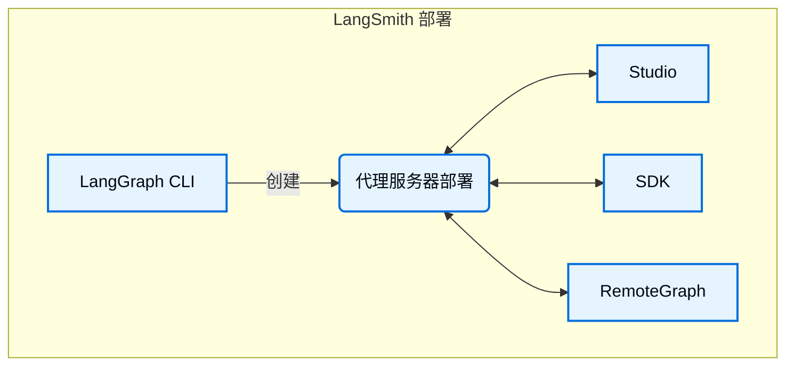

当运行自托管的 [LangSmith 部署](/langsmith/deploy-self-hosted-full-platform) 时，您的安装包含几个关键组件。这些工具和服务共同提供了一个完整的解决方案，用于在您自己的基础设施中构建、部署和管理图（包括代理应用程序）：

- [代理服务器](/langsmith/agent-server)：定义了一个用于部署图和代理的特定风格的 API 和运行时。处理执行、状态管理和持久化，使您可以专注于构建逻辑，而不是服务器基础设施。
- [LangGraph CLI](/langsmith/cli)：一个命令行界面，用于在本地构建、打包和与图交互，并为部署做准备。
- [Studio](/langsmith/studio)：一个专门的 IDE，用于可视化、交互和调试。连接到本地代理服务器，以开发和测试您的图。
- [Python/JS SDK](/langsmith/reference)：Python/JS SDK 提供了一种编程方式，用于从您的应用程序与已部署的图和代理进行交互。
- [RemoteGraph](/langsmith/use-remote-graph)：允许您与已部署的图进行交互，就像它在本地运行一样。
- [控制平面](/langsmith/control-plane)：用于创建、更新和管理代理服务器部署的 UI 和 API。
- [数据平面](/langsmith/data-plane)：执行您的图的运行时层，包括代理服务器、其支持服务（PostgreSQL、Redis 等）以及从控制平面协调状态的监听器。

---

<Callout icon="terminal-2">
    [将这些文档连接](/use-these-docs)到 Claude、VSCode 等，通过 MCP 获取实时答案。
</Callout>
<Callout icon="edit">
    [在 GitHub 上编辑此页面](https://github.com/langchain-ai/docs/edit/main/src/langsmith/components.mdx) 或 [提交问题](https://github.com/langchain-ai/docs/issues/new/choose)。
</Callout>

