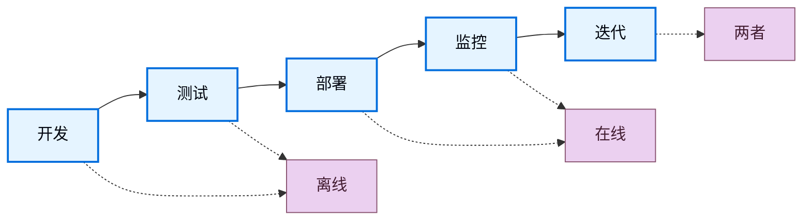

LLM 的输出是非确定性的，这使得响应质量难以评估。评估（evals）是一种分解“好”的定义并对其进行衡量的方法。LangSmith 评估提供了一个框架，用于在整个应用生命周期中衡量质量，从部署前测试到生产监控。

## 评估什么

在构建评估之前，请确定对你的应用重要的内容。将你的系统分解为关键组件——LLM 调用、检索步骤、工具调用、输出格式化——并为每个组件确定质量标准。

**从手动策划的示例开始。** 为每个关键组件创建 5-10 个“好”的示例。这些示例作为你的基准真相，并指导你使用哪种评估方法。例如：
- **RAG 系统**：良好检索（相关文档）和良好答案（准确、完整）的示例。
- **Agent**：正确工具选择和适当参数格式化或 Agent 所采取轨迹的示例。
- **聊天机器人**：有帮助、符合品牌且能解决用户意图的响应示例。

一旦你通过示例定义了“好”，你就可以衡量你的系统产生类似质量输出的频率。

## 离线评估与在线评估

LangSmith 支持两种类型的评估，它们在你的开发工作流中服务于不同的目的：

### 离线评估

<Icon icon="flask" iconType="solid" /> 使用离线评估进行**部署前测试**：
- **基准测试**：比较多个版本以找到最佳性能者。
- **回归测试**：确保新版本不会降低质量。
- **单元测试**：验证单个组件的正确性。
- **回测**：使用历史数据测试新版本。

离线评估针对来自[_数据集_](#datasets)的[_示例_](#examples)：包含参考输出的策划测试用例，定义了“好”的样子。

### 在线评估

<Icon icon="radar" iconType="solid" /> 使用在线评估进行**生产监控**：
- **实时监控**：在实时流量上持续跟踪质量。
- **异常检测**：标记异常模式或边缘情况。
- **生产反馈**：识别问题以添加到离线数据集中。

在线评估针对来自[追踪](/langsmith/observability-quickstart)的[_运行_](#runs)和[_线程_](#threads)：没有参考输出的真实生产跟踪。

这种目标上的差异决定了你可以评估什么：离线评估可以根据预期答案检查正确性，而在线评估则关注质量模式、安全性和真实世界行为。

## 评估生命周期

随着你开发和[部署你的应用](/langsmith/deployment)，你的评估策略从部署前测试演变为生产监控。在开发和测试期间，离线评估根据策划的数据集验证功能。部署后，在线评估在实时流量上监控生产行为。随着应用成熟，两种评估类型在迭代反馈循环中协同工作，持续改进质量。

### 1. 使用离线评估进行开发

在生产部署之前，使用离线评估来验证功能、对不同方法进行基准测试并建立信心。

按照[快速入门](/langsmith/evaluation-quickstart)运行你的第一次离线评估。

### 2. 使用在线评估进行初始部署

部署后，使用在线评估来监控生产质量、检测意外问题并收集真实世界数据。

了解如何为生产监控[配置在线评估](/langsmith/online-evaluations-llm-as-judge)。

### 3. 持续改进

在迭代反馈循环中结合使用两种评估类型。在线评估发现的问题成为离线测试用例，离线评估验证修复，而在线评估确认生产改进。

## 核心评估目标

评估根据是离线还是在线，在不同的目标上运行。

### 离线评估的目标

离线评估在数据集和示例上运行。参考输出的存在使得预期结果和实际结果之间的比较成为可能。

#### 数据集

数据集是用于评估应用的_示例集合_。示例是一个测试输入、参考输出对。

#### 示例

每个示例包含：

- **输入**：传递给你的应用的输入变量字典。
- **参考输出**（可选）：参考输出字典。这些不会传递给你的应用，仅在评估器中使用。
- **元数据**（可选）：可用于创建数据集筛选视图的附加信息字典。

了解更多关于[管理数据集](/langsmith/manage-datasets)的信息。

#### 实验

一个_实验_代表在数据集上评估特定应用版本的结果。每个实验捕获数据集中每个示例的输出、评估器分数和执行跟踪。

通常会在给定数据集上运行多个实验，以测试不同的应用配置（例如，不同的提示或 LLM）。LangSmith 显示与数据集关联的所有实验，并支持[并排比较多个实验](/langsmith/compare-experiment-results)。

了解[如何分析实验结果](/langsmith/analyze-an-experiment)。

### 在线评估的目标

在线评估在来自生产流量的运行和线程上运行。没有参考输出，评估器专注于实时检测问题、异常和质量下降。

#### 运行

一个_运行_是来自你的[已部署应用](/langsmith/deployment)的单个执行跟踪。每个运行包含：
- **输入**：你的应用实际收到的用户输入。
- **输出**：你的应用实际返回的内容。
- **中间步骤**：所有子运行（工具调用、LLM 调用等）。
- **元数据**：标签、用户反馈、延迟指标等。

与数据集中的示例不同，运行不包括参考输出。在线评估器必须在不知道“正确”答案应该是什么的情况下评估质量，而是依赖质量启发式方法、安全检查和无参考评估技术。

了解更多关于[可观测性概念中的运行和跟踪](/langsmith/observability-concepts#runs)的信息。

#### 线程

_线程_是代表多轮对话的相关运行的集合。在线评估器可以在线程级别运行，以评估整个对话而不是单个轮次。这使得能够评估对话级别的属性，如跨轮次的连贯性、主题维护以及整个交互过程中的用户满意度。

## 评估器

_评估器_是工作区级别的资源，用于对应用性能进行评分。它们为离线和在线评估提供测量层，并根据可用数据调整其输入。因为评估器的作用域是工作区，所以你可以将单个评估器附加到多个追踪项目和数据集，而无需每次都重新创建它。

使用以下任何方式运行评估器：

- [评估器](/langsmith/evaluators)页面，将其附加到追踪项目或数据集
- [Playground](/langsmith/prompt-engineering-concepts#playground)
- LangSmith SDK（[Python](https://docs.smith.langchain.com/reference/python/reference) 和 [TypeScript](https://docs.smith.langchain.com/reference/js)）
- [规则](/langsmith/rules)，在追踪项目或数据集上自动运行它们

### 评估器输入

评估器输入因评估类型而异：

**离线评估器**接收：
- [示例](#examples)：来自你的[数据集](#datasets)的示例，包含输入、参考输出和元数据。
- [运行](/langsmith/observability-concepts#runs)：在示例输入上运行应用的实际输出和中间步骤。

**在线评估器**接收：
- [运行](/langsmith/observability-concepts#runs)：包含输入、输出和中间步骤的生产跟踪（没有参考输出可用）。

### 评估器输出

评估器返回**反馈**，即评估的分数。反馈是一个字典或字典列表。每个字典包含：

- `key`：指标名称。
- `score` | `value`：指标值（`score` 用于数值指标，`value` 用于分类指标）。
- `comment`（可选）：分数的附加推理或解释。

### 评估技术

LangSmith 支持多种评估方法：

- [人工](#human)
- [代码](#code)
- [LLM 作为裁判](#llm-as-judge)
- [成对比较](#pairwise)

#### 人工

_人工评估_涉及对应用输出和执行跟踪的手动审查。这种方法[通常是评估的有效起点](https://hamel.dev/blog/posts/evals/#looking-at-your-traces)。LangSmith 提供工具来审查应用输出和跟踪（所有中间步骤）。

**标注队列**

[标注队列](/langsmith/annotation-queues)简化了对运行进行结构化人工反馈收集的过程。它们通过提供具有规定评分标准、团队协作功能和进度跟踪的有组织工作流，补充了[内联标注](/langsmith/annotate-traces-inline)。

LangSmith 支持两种队列类型：

- **单运行队列**：根据自定义评分标准一次审查一个运行。对于分类问题或从生产跟踪构建数据集很有用。
- **成对队列**：并排比较两个运行以判断哪个更好。专为实验之间的快速 A/B 比较而设计。

关键功能包括为每个运行配置多个审查员、启用预留以防止冲突，以及将标注的运行直接导出到数据集以供未来评估。

#### 代码

_代码评估器_是确定性的、基于规则的函数。它们适用于诸如验证聊天机器人响应的结构不为空、生成的代码可编译或分类完全匹配等检查。

#### LLM 作为裁判

_LLM 作为裁判评估器_使用 LLM 对应用输出进行评分。评分规则和标准通常编码在 LLM 提示中。这些评估器可以是：

- **无参考**：检查输出是否包含冒犯性内容或是否符合特定标准。
- **基于参考**：将输出与参考进行比较（例如，检查相对于参考的事实准确性）。

LLM 作为裁判评估器需要仔细审查分数和提示调整。少样本评估器（在评分器提示中包含输入、输出和预期等级的示例）通常可以提高性能。

了解[如何定义 LLM 作为裁判评估器](/langsmith/llm-as-judge)。

#### 成对比较

_成对比较评估器_使用启发式方法（例如，哪个响应更长）、LLM（使用成对提示）或人工审查员比较两个应用版本的输出。

当直接对输出评分很困难但比较两个输出很简单时，成对比较评估效果很好。例如，在摘要任务中，选择两个摘要中信息量更大的那个通常比为单个摘要分配绝对分数更容易。

了解[如何运行成对比较评估](/langsmith/evaluate-pairwise)。

### 无参考与基于参考的评估器

了解评估器是否需要参考输出对于确定何时可以使用它至关重要。

**无参考评估器**在不与预期输出比较的情况下评估质量。这些适用于离线和在线评估：
- **安全检查**：毒性检测、PII 检测、内容策略违规
- **格式验证**：JSON 结构、必需字段、模式合规性
- **质量启发式**：响应长度、延迟、特定关键词
- **无参考 LLM 作为裁判**：清晰度、连贯性、有用性、语气

**基于参考的评估器**需要参考输出，仅适用于离线评估：
- **正确性**：与参考答案的语义相似性
- **事实准确性**：根据基准真相进行事实核查
- **精确匹配**：具有已知标签的分类任务
- **基于参考的 LLM 作为裁判**：将输出质量与参考进行比较

在设计评估策略时，无参考评估器在离线测试和在线监控中提供一致性，而基于参考的评估器在开发期间能够进行更精确的正确性检查。

## 评估类型

LangSmith 支持针对开发和部署不同阶段的各种评估方法。了解何时使用每种类型有助于构建全面的评估策略。

离线和在线评估服务于不同的目的：
- **离线评估类型**在具有参考输出的策划数据集上进行部署前测试
- **在线评估类型**在没有参考输出的实时流量上监控生产行为

了解更多关于[评估类型以及何时使用每种类型](/langsmith/evaluation-types)的信息。

## 最佳实践

### 构建数据集

构建数据集有多种策略：

**手动策划的示例**

这是推荐的起点。创建 10-20 个高质量示例，涵盖常见场景和边缘情况。这些示例定义了你的应用“好”的样子。

**历史跟踪**

一旦投入生产，将真实跟踪转换为示例。对于高流量应用：
- **用户反馈**：添加收到负面反馈的运行以进行测试。
- **启发式方法**：识别有趣的运行（例如，长延迟、错误）。
- **LLM 反馈**：使用 LLM 检测值得注意的对话。

**合成数据**

从现有示例生成额外的示例。当以几个高质量、手工制作的示例作为模板开始时效果最佳。

### 数据集组织

**分割**

分割是数据集的命名子集，用于将示例分成不同的组。常见模式包括：

- **机器学习风格的分割**：将示例分为训练集、验证集和测试集，以避免过拟合（模型在训练数据上表现良好但在未见过的数据上表现不佳）。
- **基于类别的分割**：当数据集跨越多个任务类别时，分别评估不同的输入类型。
- **分阶段推出**：在准备好将探索性示例包含在主评估集中之前，将其隔离。

分割与元数据不同：使用分割进行评估的高级组织分组，使用元数据进行每个示例的信息，如标签和来源。

在机器学习中，最佳实践是每个示例恰好属于一个分割。LangSmith 允许示例属于多个分割，当一个示例适合多个评估类别时很有用。

了解如何[创建和管理数据集分割](/langsmith/manage-datasets-in-application#create-and-manage-dataset-splits)。

**版本**

LangSmith 在示例更改时自动创建数据集[版本](/langsmith/manage-datasets#version-a-dataset)。[标记版本](/langsmith/manage-datasets#tag-a-version)以标记重要里程碑。在 CI 管道中针对特定版本，以确保数据集更新不会破坏工作流。

### 人工反馈收集

人工反馈通常提供最有价值的评估，特别是在主观质量维度上。

**标注队列**

[标注队列](/langsmith/annotation-queues)支持结构化的人工反馈收集。标记特定运行进行审查，在简化的界面中收集标注，并将标注的运行传输到数据集以供未来评估。

标注队列通过提供额外功能来补充[内联标注](/langsmith/annotate-traces-inline)：分组运行、指定标准以及配置审查员权限。

### 评估与测试

测试和评估是相似但不同的概念。

**评估根据指标衡量性能。** 指标可以是模糊的或主观的，并且在相对意义上更有用。它们通常将系统相互比较。

**测试断言正确性。** 系统只有通过所有测试才能部署。

评估指标可以转换为测试。例如，回归测试可以断言新版本在相关指标上必须优于基线版本。当系统运行成本高昂时，一起运行测试和评估以提高效率。

评估可以使用标准测试工具编写，如 [pytest](/langsmith/pytest) 或 [Vitest/Jest](/langsmith/vitest-jest)。

## 快速参考：离线评估与在线评估

下表总结了离线评估和在线评估之间的主要区别：

| | **离线评估** | **在线评估** |
|---|---|---|
| **运行于** | 数据集（示例） | 追踪项目（运行/线程） |
| **数据访问** | 输入、输出、参考输出 | 仅输入、输出 |
| **何时使用** | 部署前，开发期间 | 生产环境，部署后 |
| **主要用例** | 基准测试、单元测试、回归测试、回测 | 实时监控、生产反馈、异常检测 |
| **评估时机** | 在策划的测试集上进行批处理 | 在实时流量上实时或近实时进行 |
| **设置位置** | 评估选项卡（SDK、UI、Playground） | [可观测性选项卡](/langsmith/online-evaluations-llm-as-judge)（自动规则） |
| **数据要求** | 需要数据集策划 | 不需要数据集，评估实时跟踪 |

---

<Callout icon="terminal-2">
    [将这些文档连接](/use-these-docs)到 Claude、VSCode 等，通过 MCP 获取实时答案。
</Callout>
<Callout icon="edit">
    [在 GitHub 上编辑此页面](https://github.com/langchain-ai/docs/edit/main/src/langsmith/evaluation-concepts.mdx) 或 [提交问题](https://github.com/langchain-ai/docs/issues/new/choose)。
</Callout>

