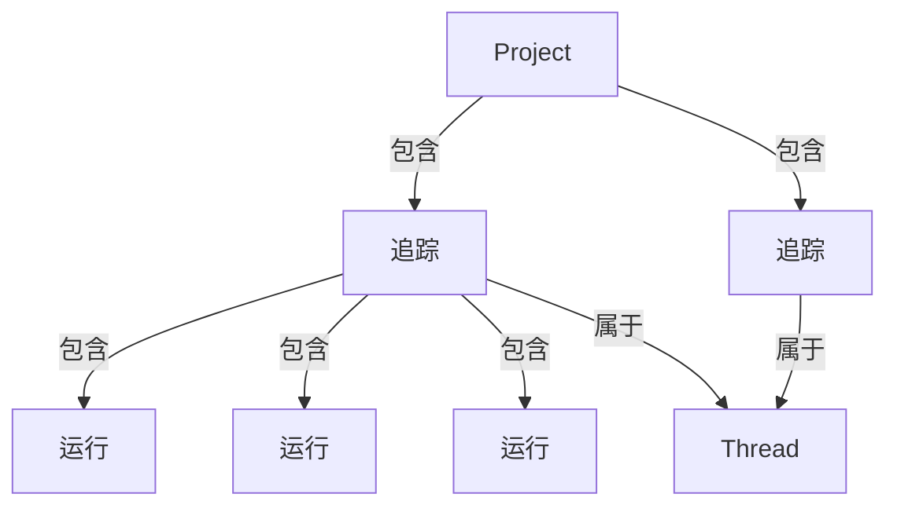

import MaxRunsPerTrace from '/snippets/langsmith/max-runs-per-trace.mdx';

LangSmith 可观测性功能允许您记录、检查和分析 LLM 应用程序的每一个步骤。本页解释了 LangSmith 中数据的组织结构以及如何发送追踪。

## LangSmith 如何组织数据

LangSmith 在一个[_项目_](#projects)中分组多个[_追踪_](#traces)。每个追踪记录了应用程序单次操作所采取的步骤序列，这些步骤由独立的[_运行_](#runs)组成。您可以将多轮对话中的追踪链接为一个[_会话_](#threads)。

### 项目

一个_项目_是与单个应用程序或服务相关的所有追踪的容器。

[将追踪记录到项目](/langsmith/log-traces-to-project)。

### 追踪

一个_追踪_是单次操作的运行集合。例如，如果用户请求触发了一个调用 LLM 然后调用输出解析器的链，所有这些运行都属于同一个追踪。运行通过唯一的追踪 ID 绑定到追踪。如果您熟悉 [OpenTelemetry](https://opentelemetry.io/)，可以将 LangSmith 追踪视为一组 span 的集合。

<Note><MaxRunsPerTrace /></Note>

### 运行

一个_运行_是代表 LLM 应用程序中单个工作单元的 span：对 LLM 的调用、提示格式化步骤、检索调用或任何其他离散操作。如果您熟悉 [OpenTelemetry](https://opentelemetry.io/)，可以将运行视为一个 span。

### 会话

一个_会话_是代表单次对话的追踪序列。多轮对话中的每一回合都是其自己的追踪，但追踪通过共享标识符链接。要将追踪分组为会话，请传递一个具有唯一值的特殊元数据键（`session_id`、`thread_id` 或 `conversation_id`）。

[了解如何配置会话](/langsmith/threads)。

<Callout type="info" icon="feather">
使用 **[Polly](/langsmith/polly)** 分析追踪、运行和会话。Polly 帮助您理解代理性能、调试问题，并从对话会话中获取洞察，无需手动挖掘数据。
</Callout>

## 追踪增强

### 反馈

_反馈_允许您根据特定标准对单个运行进行评分。每个反馈条目由一个标签和一个分数组成，并通过唯一的运行 ID 绑定到运行。反馈可以是连续的或离散的（分类的），标签可以在组织内的运行中重复使用。

有关反馈如何存储的更多信息，请参阅[反馈数据格式指南](/langsmith/feedback-data-format)。

### 标签

_标签_是您可以附加到运行上的字符串，用于在 LangSmith UI 中对运行进行分类、筛选和分组。

[了解如何将标签附加到您的追踪](/langsmith/add-metadata-tags)。

### 元数据

_元数据_是您可以附加到运行上的键值对集合。例如，应用程序版本、环境或任何其他上下文信息。与标签类似，您可以使用元数据来筛选和分组运行。

[了解如何向您的追踪添加元数据](/langsmith/add-metadata-tags)。

## 发送追踪

有两种方式将追踪数据发送到 LangSmith。

### 集成

LangSmith _集成_为流行的 LLM 提供商和代理框架提供自动追踪（相当于通用可观测性中的自动检测）。当您使用受支持的框架（如 LangChain、LangGraph、OpenAI、Anthropic 或 CrewAI）时，集成会捕获输入、输出和元数据，无需手动更改代码。

[浏览所有集成](/langsmith/integrations)。

### 手动检测

_手动检测_允许您向任何代码添加追踪，无论使用何种框架。当您不使用受支持的集成或需要对追踪内容进行精细控制时，请使用它。LangSmith 提供三种机制：

- `@traceable` / `traceable`：用于追踪任何函数的装饰器
- `trace` 上下文管理器（Python）：包装特定代码块
- `RunTree` API：低级、显式的追踪构建

[了解如何添加手动检测](/langsmith/annotate-code)。

## 数据保留

LangSmith (SaaS) 从数据摄入起保留追踪数据 400 天。之后，追踪将被永久删除，仅保留有限的元数据用于使用统计。有关保留层级和定价的详细信息，请参阅[使用和计费：数据保留](/langsmith/administration-overview#data-retention)。

<Note>
要将数据保留超过保留期，请将其添加到[数据集](/langsmith/manage-datasets)。数据集会无限期保留，即使源追踪被删除后也是如此。
</Note>

要在到期前删除追踪，请参阅[管理追踪](/langsmith/manage-trace#delete-a-trace)。

---

<Callout icon="terminal-2">
    [连接这些文档](/use-these-docs)到 Claude、VSCode 等，通过 MCP 获取实时答案。
</Callout>
<Callout icon="edit">
    [在 GitHub 上编辑此页面](https://github.com/langchain-ai/docs/edit/main/src/langsmith/observability-concepts.mdx) 或 [提交问题](https://github.com/langchain-ai/docs/issues/new/choose)。
</Callout>

