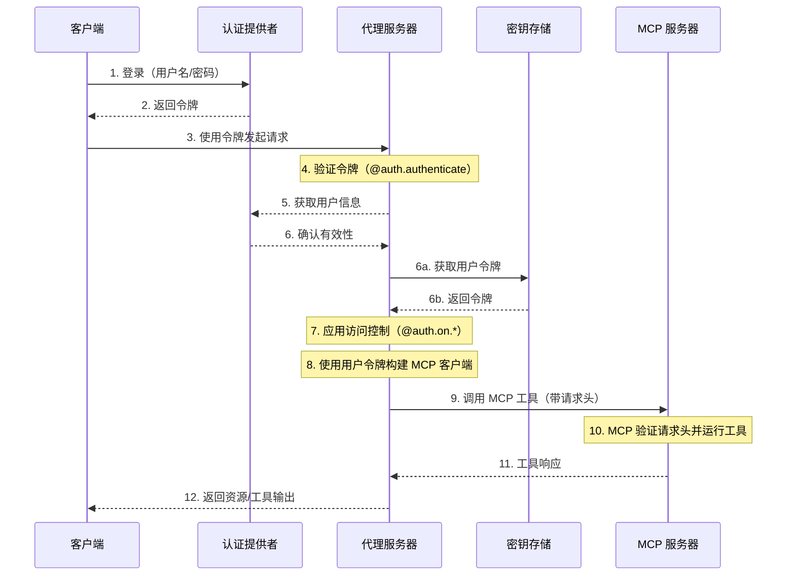

模型上下文协议（MCP）是一种开放协议，用于以模型无关的格式描述工具和数据源，使大语言模型能够通过结构化的 API 发现并使用它们。

[代理服务器](/langsmith/agent-server) 使用 [可流式传输的 HTTP 传输](https://spec.modelcontextprotocol.io/specification/2025-03-26/basic/transports/#streamable-http) 实现了 MCP。这使得 LangGraph **代理** 可以作为 **MCP 工具** 暴露出来，从而可以被任何支持可流式传输 HTTP 的 MCP 兼容客户端使用。

MCP 端点在 [代理服务器](/langsmith/agent-server) 上的路径为 `/mcp`。

你可以设置 [自定义认证中间件](/langsmith/custom-auth)，以通过 MCP 服务器对用户进行身份验证，从而获取对 LangSmith 部署中用户作用域工具的访问权限。

此流程的示例架构：



## 要求

要使用 MCP，请确保已安装以下依赖项：

* `langgraph-api >= 0.2.3`
* `langgraph-sdk >= 0.1.61`

使用以下命令安装：

<CodeGroup>
```bash pip
pip install "langgraph-api>=0.2.3" "langgraph-sdk>=0.1.61"
```

```bash uv
uv add "langgraph-api>=0.2.3" "langgraph-sdk>=0.1.61"
```
</CodeGroup>

## 使用概览

要启用 MCP：

* 升级到使用 langgraph-api>=0.2.3。如果你正在部署 LangSmith，创建新修订版时会自动完成此操作。
* MCP 工具（代理）将自动暴露。
* 使用任何支持可流式传输 HTTP 的 MCP 兼容客户端进行连接。

### 客户端

使用 MCP 兼容客户端连接到代理服务器。以下示例展示了如何使用不同的编程语言进行连接。

<Tabs>
    <Tab title="JavaScript/TypeScript">
    ```bash
    npm install @modelcontextprotocol/sdk
    ```

        > **注意**
        > 将 `serverUrl` 替换为你的代理服务器 URL，并根据需要配置认证头。

    ```js
    import { Client } from "@modelcontextprotocol/sdk/client/index.js";
    import { StreamableHTTPClientTransport } from "@modelcontextprotocol/sdk/client/streamableHttp.js";

    // 连接到 LangGraph MCP 端点
    async function connectClient(url) {
        const baseUrl = new URL(url);
        const client = new Client({
            name: 'streamable-http-client',
            version: '1.0.0'
        });

        const transport = new StreamableHTTPClientTransport(baseUrl);
        await client.connect(transport);

        console.log("使用可流式传输 HTTP 传输连接成功");
        console.log(JSON.stringify(await client.listTools(), null, 2));
        return client;
    }

    const serverUrl = "http://localhost:2024/mcp";

    connectClient(serverUrl)
        .then(() => {
            console.log("客户端连接成功");
        })
        .catch(error => {
            console.error("客户端连接失败:", error);
        });
    ```
    </Tab>
    <Tab title="Python">
    使用以下命令安装适配器：

    ```bash
    pip install langchain-mcp-adapters
    ```

    以下是如何连接到远程 MCP 端点并将代理用作工具的示例：

    ```python
    # 为 stdio 连接创建服务器参数
    from mcp import ClientSession
    from mcp.client.streamable_http import streamablehttp_client
    import asyncio

    from langchain_mcp_adapters.tools import load_mcp_tools
    from langchain.agents import create_agent


    server_params = {
        "url": "https://mcp-finance-agent.xxx.us.langgraph.app/mcp",
        "headers": {
            "X-Api-Key":"lsv2_pt_your_api_key"
        }
    }

    async def main():
        async with streamablehttp_client(**server_params) as (read, write, _):
            async with ClientSession(read, write) as session:
                # 初始化连接
                await session.initialize()

                # 将远程图作为工具加载
                tools = await load_mcp_tools(session)

                # 使用这些工具创建并运行一个 ReAct 代理
                agent = create_agent("gpt-5.4", tools)

                # 使用消息调用代理
                agent_response = await agent.ainvoke({"messages": "金融代理能为我做什么？"})
                print(agent_response)

    if __name__ == "__main__":
        asyncio.run(main())
    ```
    </Tab>
</Tabs>

## 将代理暴露为 MCP 工具

部署后，你的代理将作为工具出现在 MCP 端点中，具有以下配置：

* **工具名称**：代理的名称。
* **工具描述**：代理的描述。
* **工具输入模式**：代理的输入模式。

### 设置名称和描述

你可以在 `langgraph.json` 中设置代理的名称和描述：

```json
{
    "graphs": {
        "my_agent": {
            "path": "./my_agent/agent.py:graph",
            "description": "代理功能的描述"
        }
    },
    "env": ".env"
}
```

部署后，你可以使用 LangGraph SDK 更新名称和描述。

### 模式

定义清晰、最小化的输入和输出模式，以避免向大语言模型暴露不必要的内部复杂性。

默认的 [MessagesState](/oss/python/langgraph/graph-api#messagesstate) 使用 `AnyMessage`，它支持多种消息类型，但对于直接的大语言模型暴露来说过于通用。

相反，定义使用明确类型化输入和输出结构的 **自定义代理或工作流**。

例如，一个回答文档问题的工作流可能如下所示：

```python
from langgraph.graph import StateGraph, START, END
from typing_extensions import TypedDict

# 定义输入模式
class InputState(TypedDict):
    question: str

# 定义输出模式
class OutputState(TypedDict):
    answer: str

# 组合输入和输出
class OverallState(InputState, OutputState):
    pass

# 定义处理节点
def answer_node(state: InputState):
    # 替换为实际逻辑并执行有用操作
    return {"answer": "再见", "question": state["question"]}

# 使用显式模式构建图
builder = StateGraph(OverallState, input_schema=InputState, output_schema=OutputState)
builder.add_node(answer_node)
builder.add_edge(START, "answer_node")
builder.add_edge("answer_node", END)
graph = builder.compile()

# 运行图
print(graph.invoke({"question": "你好"}))
```

更多详情，请参阅 [底层概念指南](/oss/python/langgraph/graph-api#state)。

## 在你的部署中使用用户作用域的 MCP 工具

<Tip>
**前提条件**
你已添加了自己的 [自定义认证中间件](/langsmith/custom-auth)，该中间件填充了 `langgraph_auth_user` 对象，使其可通过可配置上下文在图中的每个节点访问。
</Tip>

要使用户作用域的工具在你的 LangSmith 部署中可用，请从实现如下代码片段开始：

```python
from langchain_mcp_adapters.client import MultiServerMCPClient

def mcp_tools_node(state, config):
    user = config["configurable"].get("langgraph_auth_user")
         , user["github_token"], user["email"], 等等。

    client = MultiServerMCPClient({
        "github": {
            "transport": "streamable_http", # (1)
            "url": "https://my-github-mcp-server/mcp", # (2)
            "headers": {
                "Authorization": f"Bearer {user['github_token']}"
            }
        }
    })
    tools = await client.get_tools() # (3)

    # 你的工具调用逻辑在这里

    tool_messages = ...
    return {"messages": tool_messages}
```

1. MCP 仅支持向使用 `streamable_http` 和 `sse` `transport` 的服务器发出的请求添加请求头。
2. 你的 MCP 服务器 URL。
3. 从你的 MCP 服务器获取可用工具。

_这也可以通过 [在运行时重建你的图](/langsmith/graph-rebuild) 来为新的运行设置不同的配置来完成_

## 会话行为

当前的 LangGraph MCP 实现不支持会话。每个 `/mcp` 请求都是无状态且独立的。

## 认证

`/mcp` 端点使用与 LangGraph API 其余部分相同的认证。有关设置详情，请参阅 [认证指南](/langsmith/auth)。

## 禁用 MCP

要禁用 MCP 端点，请在你的 `langgraph.json` 配置文件中将 `disable_mcp` 设置为 `true`：

```json
{
  "$schema": "https://langgra.ph/schema.json",
  "http": {
    "disable_mcp": true
  }
}
```

这将阻止服务器暴露 `/mcp` 端点。

---

<div className="source-links">
<Callout icon="terminal-2">
    [将这些文档](/use-these-docs) 通过 MCP 连接到 Claude、VSCode 等，以获取实时答案。
</Callout>
<Callout icon="edit">
    [在 GitHub 上编辑此页面](https://github.com/langchain-ai/docs/edit/main/src/langsmith/server-mcp.mdx) 或 [提交问题](https://github.com/langchain-ai/docs/issues/new/choose)。
</Callout>
</div>