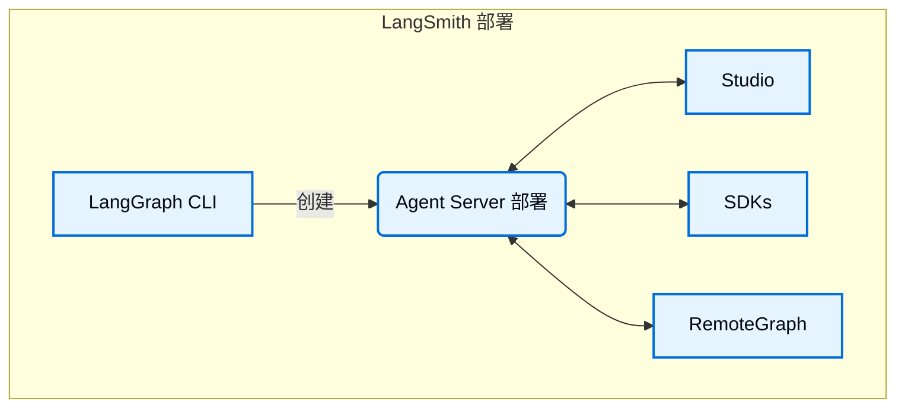

<Info>
**前提条件**
* [LangSmith](/langsmith/home)
* [Agent Server](/langsmith/agent-server)
* [LangGraph CLI](/langsmith/cli)
</Info>

Studio 是一个专用的智能体 IDE，可用于可视化、交互和调试实现了 Agent Server API 协议的智能体系统。Studio 还集成了[追踪](/langsmith/observability-concepts)、[评估](/langsmith/evaluation)和[提示词工程](/langsmith/prompt-engineering)功能。

## 功能特性

Studio 的主要功能：

* 可视化您的图架构
* [运行并与您的智能体交互](/langsmith/use-studio#run-application)
* [管理助手](/langsmith/use-studio#manage-assistants)
* [管理线程](/langsmith/use-studio#manage-threads)
* [迭代提示词](/langsmith/observability-studio)
* [在数据集上运行实验](/langsmith/observability-studio#run-experiments-over-a-dataset)
* 管理[长期记忆](/oss/python/concepts/memory)
* 通过[时间旅行](/oss/python/langgraph/use-time-travel)调试智能体状态

Studio 适用于部署在 [LangSmith](/langsmith/deployment-quickstart) 上的图，也适用于通过 [Agent Server](/langsmith/local-dev-testing) 在本地运行的图。

Studio 支持两种模式：

### 图模式

图模式提供完整的功能集，当您希望获取关于智能体执行的尽可能多的细节（包括遍历的节点、中间状态以及 LangSmith 集成，例如添加到数据集和 Playground）时，此模式非常有用。

### 聊天模式

聊天模式是一个更简单的 UI，用于迭代和测试特定于聊天的智能体。它适用于业务用户以及希望测试智能体整体行为的用户。聊天模式仅支持状态包含或扩展了 [`MessagesState`](/oss/python/langgraph/use-graph-api#messagesstate) 的图。

## 了解更多

* 参阅此指南了解如何[开始使用](/langsmith/quick-start-studio) Studio。

## 视频指南
<iframe
  className="w-full aspect-video rounded-xl"
  src="https://www.youtube.com/embed/Mi1gSlHwZLM?si=oWCeHQ640zPHoLwn"
  title="YouTube 视频播放器"
  frameBorder="0"
  allow="accelerometer; autoplay; clipboard-write; encrypted-media; gyroscope; picture-in-picture"
  allowFullScreen
></iframe>

---

<Callout icon="terminal-2">
    [连接这些文档](/use-these-docs)到 Claude、VSCode 等，通过 MCP 获取实时答案。
</Callout>
<Callout icon="edit">
    [在 GitHub 上编辑此页面](https://github.com/langchain-ai/docs/edit/main/src/langsmith/studio.mdx) 或 [提交问题](https://github.com/langchain-ai/docs/issues/new/choose)。
</Callout>

