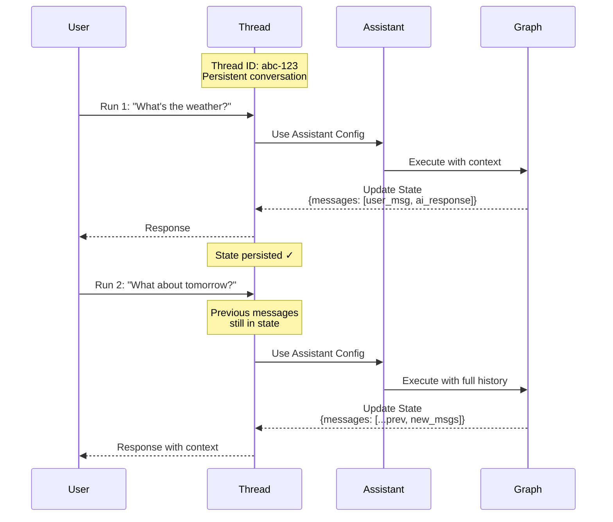

本指南向你展示如何创建、查看和检查 _线程_。线程与[助手](/langsmith/assistants)配合使用，以实现对[已部署图](/langsmith/deployment)的[有状态](/oss/python/langgraph/persistence)执行。

## 理解线程

线程是一个持久化的对话容器，它在多次运行之间维护状态。每次在线程上执行运行时，图会使用线程的当前状态处理输入，并用新信息更新该状态。

线程通过在运行之间保留对话历史和上下文来实现有状态交互。没有线程，每次运行都将是无状态的，没有对先前交互的记忆。线程特别适用于：

- 助手需要记住讨论内容的多轮对话。
- 需要跨多个步骤维护上下文的长时间运行任务。
- 每个用户都有自己对话历史的用户特定状态管理。

下图说明了线程如何在两次运行之间维护状态。第二次运行可以访问第一次运行的消息，使助手能够理解“那明天呢？”的上下文指的是第一次运行中的天气查询：



- 线程通过唯一的线程 ID 维护持久化对话。
- 每次运行都将助手的配置应用于图执行。
- 状态在每次运行后更新，并为后续运行持久化。
- 后续运行可以访问完整的对话历史。

<Note>
- **[助手](/langsmith/assistants)** 定义了图执行的配置（模型、提示词、工具）。创建运行时，你可以指定一个 **图 ID**（例如 `"agent"`）以使用默认助手，或指定一个 **助手 ID**（UUID）以使用特定配置。
- **线程** 维护状态和对话历史。
- **运行** 结合助手和线程，以特定配置和状态执行你的图。
</Note>

<Tip>
最佳实践：在线程（对话）中跟踪运行时，确保在所有运行（包括父运行和子运行）上都设置了 `thread_id`。这是线程过滤、令牌计数和线程级评估正常工作所必需的。
</Tip>

## 创建线程

要使用状态持久化运行你的图，必须首先创建一个线程：

<Tabs>
<Tab title="SDK">

### 空线程

要创建一个新线程，使用以下方法之一：

<CodeGroup>
```python Python
from langgraph_sdk import get_client

# 使用你的部署 URL 初始化客户端
client = get_client(url=<DEPLOYMENT_URL>)

# 创建一个空线程
# 这将创建一个没有初始状态的新线程
thread = await client.threads.create()

print(thread)
```

```javascript JavaScript
import { Client } from "@langchain/langgraph-sdk";

// 使用你的部署 URL 初始化客户端
const client = new Client({ apiUrl: <DEPLOYMENT_URL> });

// 创建一个空线程
// 这将创建一个没有初始状态的新线程
const thread = await client.threads.create();

console.log(thread);
```

```bash cURL
curl --request POST \
    --url <DEPLOYMENT_URL>/threads \
    --header 'Content-Type: application/json' \
    --data '{}'
```
</CodeGroup>

更多信息，请参阅 [Python](https://reference.langchain.com/python/langsmith/deployment/sdk/#langgraph_sdk.client.ThreadsClient.create) 和 [JS](https://reference.langchain.com/python/langsmith/deployment/sdk/#langgraph_sdk.client.ThreadsClient.create) SDK 文档，或 [REST API](/langsmith/agent-server-api/threads/create-thread) 参考。

输出：

```json
{
  "thread_id": "123e4567-e89b-12d3-a456-426614174000",
  "created_at": "2025-05-12T14:04:08.268Z",
  "updated_at": "2025-05-12T14:04:08.268Z",
  "metadata": {},
  "status": "idle",
  "values": {}
}
```

### 复制线程

或者，如果你的应用程序中已有一个线程，你想复制其状态，可以使用 `copy` 方法。这将创建一个独立的线程，其历史记录在操作时与原始线程完全相同：

<CodeGroup>
```python Python
# 复制一个现有线程
# 新线程在复制时将具有与原始线程相同的状态
copied_thread = await client.threads.copy(thread["thread_id"])
```

```javascript JavaScript
// 复制一个现有线程
// 新线程在复制时将具有与原始线程相同的状态
const copiedThread = await client.threads.copy(thread["thread_id"]);
```

```bash cURL
curl --request POST --url <DEPLOYMENT_URL>/threads/thread["thread_id"]/copy \
--header 'Content-Type: application/json'
```
</CodeGroup>

更多信息，请参阅 [Python](https://reference.langchain.com/python/langsmith/deployment/sdk/#langgraph_sdk.client.ThreadsClient.copy) 和 [JS](https://reference.langchain.com/python/langsmith/deployment/sdk/#langgraph_sdk.client.ThreadsClient.copy) SDK 文档，或 [REST API](/langsmith/agent-server-api/threads/copy-thread) 参考。

### 预填充状态

你可以通过向 `create` 方法提供一个 `supersteps` 列表来创建一个具有任意预定义状态的线程。`supersteps` 描述了一系列状态更新，用于建立线程的初始状态。当你想要以下操作时，这很有用：

- 创建一个具有现有对话历史的线程。
- 从另一个系统迁移对话。
- 设置具有特定初始状态的测试场景。
- 从之前的会话恢复对话。

有关检查点和状态管理的更多信息，请参阅 [LangGraph 持久化文档](/oss/python/langgraph/persistence)。

<CodeGroup>
```python Python
from langgraph_sdk import get_client

# 初始化客户端
client = get_client(url=<DEPLOYMENT_URL>)

# 创建一个具有预填充对话历史的线程
# supersteps 定义了一系列状态更新，用于构建初始状态
thread = await client.threads.create(
  graph_id="agent",  # 指定此线程用于哪个图
  supersteps=[
    {
      updates: [
        {
          values: {},
          as_node: '__input__',  # 初始输入节点
        },
      ],
    },
    {
      updates: [
        {
          values: {
            messages: [
              {
                type: 'human',
                content: 'hello',
              },
            ],
          },
          as_node: '__start__',  # 用户的第一条消息
        },
      ],
    },
    {
      updates: [
        {
          values: {
            messages: [
              {
                content: 'Hello! How can I assist you today?',
                type: 'ai',
              },
            ],
          },
          as_node: 'call_model',  # 助手的响应
        },
      ],
    },
  ])

print(thread)
```

```javascript JavaScript
import { Client } from "@langchain/langgraph-sdk";

// 初始化客户端
const client = new Client({ apiUrl: <DEPLOYMENT_URL> });

// 创建一个具有预填充对话历史的线程
// supersteps 定义了一系列状态更新，用于构建初始状态
const thread = await client.threads.create({
    graphId: 'agent',  // 指定此线程用于哪个图
    supersteps: [
    {
      updates: [
        {
          values: {},
          asNode: '__input__',  // 初始输入节点
        },
      ],
    },
    {
      updates: [
        {
          values: {
            messages: [
              {
                type: 'human',
                content: 'hello',
              },
            ],
          },
          asNode: '__start__',  // 用户的第一条消息
        },
      ],
    },
    {
      updates: [
        {
          values: {
            messages: [
              {
                content: 'Hello! How can I assist you today?',
                type: 'ai',
              },
            ],
          },
          asNode: 'call_model',  // 助手的响应
        },
      ],
    },
  ],
});

console.log(thread);
```

```bash cURL
curl --request POST \
    --url <DEPLOYMENT_URL>/threads \
    --header 'Content-Type: application/json' \
    --data '{"metadata":{"graph_id":"agent"},"supersteps":[{"updates":[{"values":{},"as_node":"__input__"}]},{"updates":[{"values":{"messages":[{"type":"human","content":"hello"}]},"as_node":"__start__"}]},{"updates":[{"values":{"messages":[{"content":"Hello\u0021 How can I assist you today?","type":"ai"}]},"as_node":"call_model"}]}]}'
```
</CodeGroup>

输出：

```json
{
  "thread_id": "f15d70a1-27d4-4793-a897-de5609920b7d",
  "created_at": "2025-05-12T15:37:08.935038+00:00",
  "updated_at": "2025-05-12T15:37:08.935046+00:00",
  "metadata": {
    "graph_id": "agent"
  },
  "status": "idle",
  "config": {},
  "values": {
    "messages": [
      {
        "content": "hello",
        "additional_kwargs": {},
        "response_metadata": {},
        "type": "human",
        "name": null,
        "id": "8701f3be-959c-4b7c-852f-c2160699b4ab",
        "example": false
      },
      {
        "content": "Hello! How can I assist you today?",
        "additional_kwargs": {},
        "response_metadata": {},
        "type": "ai",
        "name": null,
        "id": "4d8ea561-7ca1-409a-99f7-6b67af3e1aa3",
        "example": false,
        "tool_calls": [],
        "invalid_tool_calls": [],
        "usage_metadata": null
      }
    ]
  }
}
```

</Tab>
<Tab title="UI">

你也可以直接从 [LangSmith UI](https://smith.langchain.com) 创建线程：

1. 导航到你的[部署](/langsmith/deployment)。
2. 选择 **线程** 选项卡。
3. 点击 **+ 新建线程**。
4. 可选地为线程提供元数据或初始状态。
5. 点击 **创建线程**。

新创建的线程将出现在线程表中，并可立即用于运行。

</Tab>
</Tabs>

## 列出线程

<Tabs>
<Tab title="SDK">

要列出线程，请使用 `search` 方法。这将列出应用程序中与提供的过滤器匹配的线程：

### 按线程状态过滤

使用 `status` 字段根据线程状态进行过滤。支持的值为 `idle`、`busy`、`interrupted` 和 `error`。例如，要查看 `idle` 线程：

<CodeGroup>
```python Python
# 搜索空闲线程
# status 过滤器接受：idle, busy, interrupted, error
print(await client.threads.search(status="idle", limit=1))
```

```javascript JavaScript
// 搜索空闲线程
// status 过滤器接受：idle, busy, interrupted, error
console.log(await client.threads.search({ status: "idle", limit: 1 }));
```

```bash cURL
curl --request POST \
--url <DEPLOYMENT_URL>/threads/search \
--header 'Content-Type: application/json' \
--data '{"status": "idle", "limit": 1}'
```
</CodeGroup>

更多信息，请参阅 [Python](https://reference.langchain.com/python/langsmith/deployment/sdk/#langgraph_sdk.client.ThreadsClient.search) 和 [JS](https://reference.langchain.com/python/langsmith/deployment/sdk/#langgraph_sdk.client.ThreadsClient.search) SDK 文档，或 [REST API](/langsmith/agent-server-api/threads/search-threads) 参考。

输出：

```json
[
  {
    "thread_id": "cacf79bb-4248-4d01-aabc-938dbd60ed2c",
    "created_at": "2024-08-14T17:36:38.921660+00:00",
    "updated_at": "2024-08-14T17:36:38.921660+00:00",
    "metadata": {
      "graph_id": "agent"
    },
    "status": "idle",
    "config": {
      "configurable": {}
    }
  }
]
```

### 按元数据过滤

`search` 方法允许你按元数据进行过滤。这对于查找与特定图、用户或你添加到线程的自定义元数据相关的线程非常有用。

你可以过滤的常见元数据字段包括：

| 元数据键 | 描述 |
|---|---|
| `graph_id` | 线程所属的图（部署）。 |
| `assistant_id` | 用于在线程上创建运行的[助手](/langsmith/assistants)。 |
| `langgraph_auth_user_id` | 拥有该线程的已认证用户（使用[自定义认证](/langsmith/custom-auth)时自动设置）。 |
| `cron_id` | 在线程上创建运行的[定时任务](/langsmith/cron-jobs)。 |

你也可以过滤在创建或更新线程时附加的任何自定义元数据。

#### 按图过滤

<CodeGroup>
```python Python
print(await client.threads.search(metadata={"graph_id": "agent"}, limit=1))
```

```javascript JavaScript
console.log(await client.threads.search({ metadata: { "graph_id": "agent" }, limit: 1 }));
```

```bash cURL
curl --request POST \
--url <DEPLOYMENT_URL>/threads/search \
--header 'Content-Type: application/json' \
--data '{"metadata": {"graph_id": "agent"}, "limit": 1}'
```
</CodeGroup>

输出：

```json
[
  {
    "thread_id": "cacf79bb-4248-4d01-aabc-938dbd60ed2c",
    "created_at": "2024-08-14T17:36:38.921660+00:00",
    "updated_at": "2024-08-14T17:36:38.921660+00:00",
    "metadata": {
      "graph_id": "agent"
    },
    "status": "idle",
    "config": {
      "configurable": {}
    }
  }
]
```

#### 按助手过滤

<CodeGroup>
```python Python
print(await client.threads.search(
    metadata={"assistant_id": "fe096781-5601-53d2-b2f6-0d3403f7e9ca"},
    limit=1,
))
```

```javascript JavaScript
console.log(await client.threads.search({
  metadata: { "assistant_id": "fe096781-5601-53d2-b2f6-0d3403f7e9ca" },
  limit: 1,
}));
```

```bash cURL
curl --request POST \
--url <DEPLOYMENT_URL>/threads/search \
--header 'Content-Type: application/json' \
--data '{"metadata": {"assistant_id": "fe096781-5601-53d2-b2f6-0d3403f7e9ca"}, "limit": 1}'
```
</CodeGroup>

#### 按定时任务过滤

<CodeGroup>
```python Python
print(await client.threads.search(
    metadata={"cron_id": "8b98a268-e49a-4228-a0d3-1a354e3a54d0"},
    limit=10,
))
```

```javascript JavaScript
console.log(await client.threads.search({
  metadata: { "cron_id": "8b98a268-e49a-4228-a0d3-1a354e3a54d0" },
  limit: 10,
}));
```

```bash cURL
curl --request POST \
--url <DEPLOYMENT_URL>/threads/search \
--header 'Content-Type: application/json' \
--data '{"metadata": {"cron_id": "8b98a268-e49a-4228-a0d3-1a354e3a54d0"}, "limit": 10}'
```
</CodeGroup>

### 排序

SDK 还支持使用 `sort_by` 和 `sort_order` 参数按 `thread_id`、`status`、`created_at` 和 `updated_at` 对线程进行排序。

</Tab>
<Tab title="UI">

你也可以通过 [LangSmith UI](https://smith.langchain.com) 查看和管理部署中的线程：

1. 导航到你的[部署](/langsmith/deployment)。
2. 选择 **线程** 选项卡。

这将加载部署中所有线程的表格。

**按线程状态过滤：** 在顶部栏中选择一个状态，以按 `idle`、`busy`、`interrupted` 或 `error` 过滤线程。

**线程排序：** 点击任何列标题的箭头图标，按该属性（`thread_id`、`status`、`created_at` 或 `updated_at`）排序。

</Tab>
</Tabs>

## 检查线程

<Tabs>
<Tab title="SDK">

### 获取线程

要查看给定 `thread_id` 的特定线程，请使用 [`get`](https://reference.langchain.com/python/langsmith/deployment/sdk/#langgraph_sdk.client.ThreadsClient.get) 方法：

<CodeGroup>
```python Python
# 通过 ID 检索特定线程
# 返回线程元数据，包括状态、创建时间和元数据
print((await client.threads.get(thread["thread_id"])))
```

```javascript JavaScript
// 通过 ID 检索特定线程
// 返回线程元数据，包括状态、创建时间和元数据
console.log((await client.threads.get(thread["thread_id"])));
```

```bash cURL
curl --request GET \
--url <DEPLOYMENT_URL>/threads/thread["thread_id"] \
--header 'Content-Type: application/json'
```
</CodeGroup>

输出：

```json
{
  "thread_id": "cacf79bb-4248-4d01-aabc-938dbd60ed2c",
  "created_at": "2024-08-14T17:36:38.921660+00:00",
  "updated_at": "2024-08-14T17:36:38.921660+00:00",
  "metadata": {
    "graph_id": "agent"
  },
  "status": "idle",
  "config": {
    "configurable": {}
  }
}
```

更多信息，请参阅 [Python](https://reference.langchain.com/python/langsmith/deployment/sdk/#langgraph_sdk.client.ThreadsClient.get) 和 [JS](https://reference.langchain.com/python/langsmith/deployment/sdk/#langgraph_sdk.client.ThreadsClient.get) SDK 文档，或 [REST API](/langsmith/agent-server-api/threads/get-thread) 参考。

### 检查线程状态

要查看给定线程的当前状态，请使用 [`get_state`](https://reference.langchain.com/python/langsmith/deployment/sdk/#langgraph_sdk.client.ThreadsClient.get_state) 方法。这将返回当前值、要执行的下一个节点以及检查点信息：

<CodeGroup>
```python Python
# 获取线程的当前状态
# 返回值、下一个节点、任务、检查点信息和元数据
print((await client.threads.get_state(thread["thread_id"])))
```

```javascript JavaScript
// 获取线程的当前状态
// 返回值、下一个节点、任务、检查点信息和元数据
console.log((await client.threads.getState(thread["thread_id"])));
```

```bash cURL
curl --request GET \
--url <DEPLOYMENT_URL>/threads/thread["thread_id"]/state \
--header 'Content-Type: application/json'
```
</CodeGroup>

输出：

```json
{
  "values": {
    "messages": [
      {
        "content": "hello",
        "additional_kwargs": {},
        "response_metadata": {},
        "type": "human",
        "name": null,
        "id": "8701f3be-959c-4b7c-852f-c2160699b4ab",
        "example": false
      },
      {
        "content": "Hello! How can I assist you today?",
        "additional_kwargs": {},
        "response_metadata": {},
        "type": "ai",
        "name": null,
        "id": "4d8ea561-7ca1-409a-99f7-6b67af3e1aa3",
        "example": false,
        "tool_calls": [],
        "invalid_tool_calls": [],
        "usage_metadata": null
      }
    ]
  },
  "next": [],
  "tasks": [],
  "metadata": {
    "thread_id": "f15d70a1-27d4-4793-a897-de5609920b7d",
    "checkpoint_id": "1f02f46f-7308-616c-8000-1b158a9a6955",
    "graph_id": "agent_with_quite_a_long_name",
    "source": "update",
    "step": 1,
    "writes": {
      "call_model": {
        "messages": [
          {
            "content": "Hello! How can I assist you today?",
            "type": "ai"
          }
        ]
      }
    },
    "parents": {}
  },
  "created_at": "2025-05-12T15:37:09.008055+00:00",
  "checkpoint": {
    "checkpoint_id": "1f02f46f-733f-6b58-8001-ea90dcabb1bd",
    "thread_id": "f15d70a1-27d4-4793-a897-de5609920b7d",
    "checkpoint_ns": ""
  },
  "parent_checkpoint": {
    "checkpoint_id": "1f02f46f-7308-616c-8000-1b158a9a6955",
    "thread_id": "f15d70a1-27d4-4793-a897-de5609920b7d",
    "checkpoint_ns": ""
  },
  "checkpoint_id": "1f02f46f-733f-6b58-8001-ea90dcabb1bd",
  "parent_checkpoint_id": "1f02f46f-7308-616c-8000-1b158a9a6955"
}
```

更多信息，请参阅 [Python](https://reference.langchain.com/python/langsmith/deployment/sdk/#langgraph_sdk.client.ThreadsClient.get_state) 和 [JS](https://reference.langchain.com/python/langsmith/deployment/sdk/#langgraph_sdk.client.ThreadsClient.get_state) SDK 文档，或 [REST API](/langsmith/agent-server-api/threads/get-thread-state) 参考。

可选地，要查看线程在给定检查点的状态，请传入检查点 ID。这对于检查线程在其执行历史中特定点的状态非常有用。

首先，从线程历史中获取检查点 ID：

<CodeGroup>
```python Python
# 获取线程历史以查找检查点 ID
history = await client.threads.get_history(thread_id=thread["thread_id"])
checkpoint_id = history[0]["checkpoint_id"]  # 获取最近的检查点
```

```javascript JavaScript
// 获取线程历史以查找检查点 ID
const history = await client.threads.getHistory(thread["thread_id"]);
const checkpointId = history[0].checkpoint_id;  // 获取最近的检查点
```

```bash cURL
# 获取线程历史以查找检查点 ID
curl --request POST \
--url <DEPLOYMENT_URL>/threads/thread["thread_id"]/history \
--header 'Content-Type: application/json' \
--data '{"limit": 1}'
```
</CodeGroup>

然后使用检查点 ID 获取该特定点的状态：

<CodeGroup>
```python Python
# 获取特定检查点的线程状态
# 对于检查历史状态或调试非常有用
thread_state = await client.threads.get_state(
  thread_id=thread["thread_id"],
  checkpoint_id=checkpoint_id
)
```

```javascript JavaScript
// 获取特定检查点的线程状态
// 对于检查历史状态或调试非常有用
const threadState = await client.threads.getState(thread["thread_id"], checkpointId);
```

```bash cURL
curl --request GET \
--url <DEPLOYMENT_URL>/threads/thread["thread_id"]/state/<CHECKPOINT_ID> \
--header 'Content-Type: application/json'
```
</CodeGroup>

### 检查完整线程历史

要查看线程的历史记录，请使用 [`get_history`](https://reference.langchain.com/python/langsmith/deployment/sdk/#langgraph_sdk.client.ThreadsClient.get_history) 方法。这将返回线程经历的每个状态的列表，允许你跟踪完整的执行路径：

<CodeGroup>
```python Python
# 获取线程的完整历史记录
# 返回线程执行过程中所有状态快照的列表
history = await client.threads.get_history(
  thread_id=thread["thread_id"],
  limit=10  # 可选：限制返回的状态数量
)

for state in history:
    print(f"Checkpoint: {state['checkpoint_id']}")
    print(f"Step: {state['metadata']['step']}")
```

```javascript JavaScript
// 获取线程的完整历史记录
// 返回线程执行过程中所有状态快照的列表
const history = await client.threads.getHistory(
  thread["thread_id"],
  {
    limit: 10  // 可选：限制返回的状态数量
  }
);

for (const state of history) {
  console.log(`Checkpoint: ${state.checkpoint_id}`);
  console.log(`Step: ${state.metadata.step}`);
}
```

```bash cURL
curl --request POST \
--url <DEPLOYMENT_URL>/threads/thread["thread_id"]/history \
--header 'Content-Type: application/json' \
--data '{"limit": 10}'
```
</CodeGroup>

此方法特别适用于：
- 通过查看状态如何演变来调试执行流程。
- 理解图执行中的决策点。
- 审计对话历史和状态更改。
- 重放或分析过去的交互。

更多信息，请参阅 [Python](https://reference.langchain.com/python/langsmith/deployment/sdk/#langgraph_sdk.client.ThreadsClient.get_history) 和 [JS](https://reference.langchain.com/python/langsmith/deployment/sdk/#langgraph_sdk.client.ThreadsClient.get_history) SDK 文档，或 [REST API](/langsmith/agent-server-api/threads/get-thread-history) 参考。

</Tab>
<Tab title="UI">

你也可以在 [LangSmith UI](https://smith.langchain.com) 中查看和检查线程：

1. 导航到你的[部署](/langsmith/deployment)。
2. 选择 **线程** 选项卡以查看所有线程。
3. 点击一个线程以检查其当前状态。

要查看完整的线程历史并进行详细调试，请点击 **在 Studio 中打开** 以在 [Studio](/langsmith/studio) 中打开该线程。Studio 提供了一个可视化界面，用于探索线程的执行历史、状态更改和检查点详细信息。

</Tab>
</Tabs>

---

<div className="source-links">
<Callout icon="terminal-2">
    [将这些文档连接](/use-these-docs)到 Claude、VSCode 等，通过 MCP 获取实时答案。
</Callout>
<Callout icon="edit">
    [在 GitHub 上编辑此页面](https://github.com/langchain-ai/docs/edit/main/src/langsmith/use-threads.mdx) 或 [提交问题](https://github.com/langchain-ai/docs/issues/new/choose)。
</Callout>
</div>