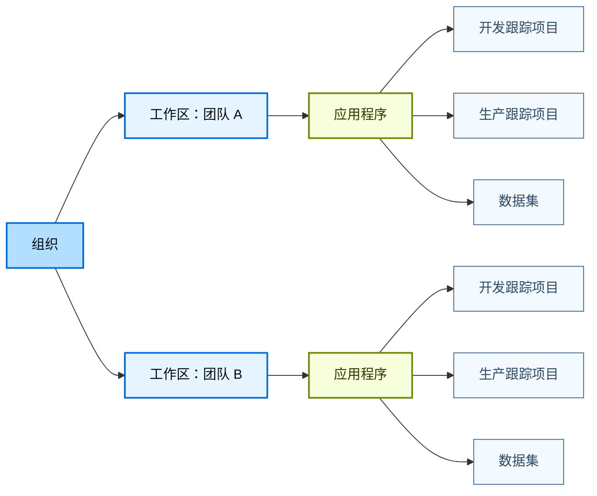
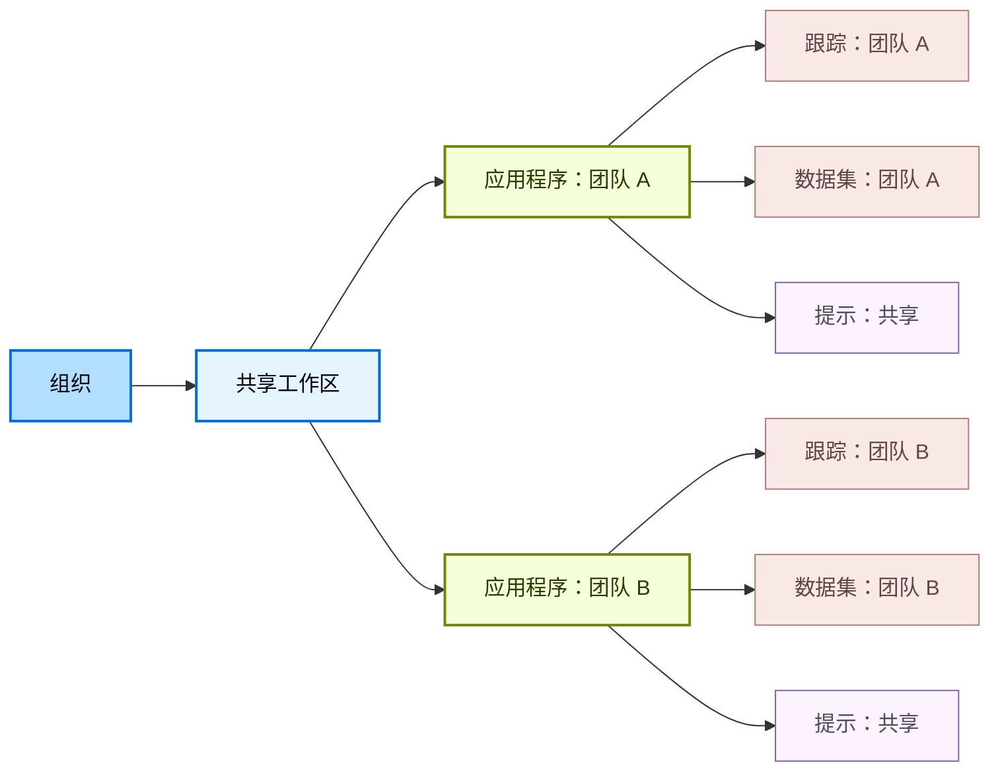
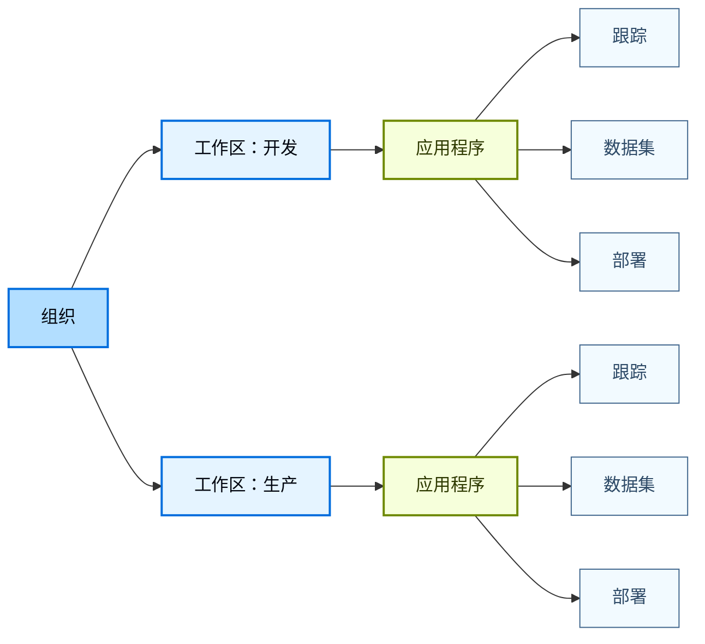

LangSmith 使用分层结构来组织您的工作：[_组织_](/langsmith/administration-overview#organizations)、[_工作区_](/langsmith/administration-overview#workspaces)、[_应用程序_](/langsmith/administration-overview#applications) 和 [_资源_](/langsmith/administration-overview#resources)。这种结构让您能够在协作与访问控制之间取得平衡，从而为团队需求选择合适的隔离级别。

LangSmith 的权限系统建立在此层次结构之上。通过[基于角色的访问控制 (RBAC)](/langsmith/rbac)，用户[权限](/langsmith/organization-workspace-operations)被限定在一个或多个工作区范围内，从而强制执行工作区之间的隔离。通过更细粒度的[基于属性的访问控制](/langsmith/organization-workspace-operations#access-policies) (ABAC)，访问可以进一步基于工作区内的标签或应用程序等属性进行限制或授予（例如，允许用户仅访问开发资源或仅访问与特定应用程序关联的资源）。

本页根据团队的隔离需求，介绍了三种常见的工作区组织方式：

- [以团队为中心的工作区](#team-centric-workspaces)：每个团队一个工作区（推荐给大多数客户）
- [协作工作区](#collaborative-workspaces)：每个工作区包含多个团队
- [项目隔离的工作区](#project-isolated-workspaces)：每个团队多个工作区（适用于严格的隔离要求）

<Tip>
有关设置组织和工作区的详细信息，请参阅[设置层次结构](/langsmith/set-up-hierarchy)。
</Tip>

## 以团队为中心的工作区

<Warning>
这是默认模型，也是大多数客户的推荐选择。
</Warning>

此模型（每个团队一个工作区）使用单个组织作为顶层边界。在组织内部，使用多个工作区来隔离不同的团队或业务单元。每个工作区代表特定团队的逻辑边界，并控制该团队可以访问哪些数据和资源。在工作区内，团队使用多个应用程序将支持同一代理的资源分组在一起。一个应用程序也可能包含不同的资源，例如用于开发和生产环境的独立跟踪项目。

- **优点：** 单个工作区允许共享所有团队资源，使团队内的协作和迭代变得简单直接。它还简化了从开发到生产的推广过程。例如，同一个[提示](/langsmith/prompt-engineering)可以使用标签进行版本控制并推广到生产环境，无需复制或重复。
- **缺点：** 主要的权衡是同一团队环境之间的隔离有限。开发、测试和生产资源共存于同一个应用程序中，因此团队必须依赖标签和约定来避免意外影响生产环境。[RBAC](/langsmith/rbac) 的作用范围是工作区级别。[ABAC](/langsmith/organization-workspace-operations#access-policies) 通过基于资源属性（例如，允许用户仅访问开发资源）限制访问，在工作区内提供更细粒度的权限。

## 协作工作区

在此模型（每个工作区包含多个团队）中，多个团队共享组织内的单个工作区，并使用应用程序和 [ABAC](/langsmith/organization-workspace-operations#access-policies) 来分隔资源并管理访问。因此，诸如[提示](/langsmith/prompt-engineering)和[部署](/langsmith/deployment)之类的共享资源可以在团队之间重复使用，而对[跟踪](/langsmith/observability-concepts#traces)和[数据集](/langsmith/evaluation-concepts#datasets)等敏感资源的访问则仅限于所属团队。

- **优点：** 提示和部署等公共资源可以在团队之间共享和重复使用，从而提高协作效率并减少重复工作。与以团队为中心的工作区模型不同，协作不仅限于单个团队，可以跨越工作区内的所有团队。
- **缺点：** 团队和环境之间的隔离比多工作区模型弱，并且依赖于正确使用 ABAC。配置错误的标签或策略可能会将敏感的[跟踪](/langsmith/observability-concepts#traces)或[数据集](/langsmith/evaluation-concepts#datasets)暴露给其他团队，并且跨多个团队管理权限会增加操作复杂性。

## 项目隔离的工作区

<Callout icon="check" iconType="solid" color="#C7D2FE">
仅在需要严格隔离时才应使用此方法。
</Callout>

在此模型（每个团队多个工作区）中，通过为单个团队创建多个工作区来增强隔离。工作区可以按项目或环境组织，例如单独的开发和生产工作区。每个工作区完全隔离，拥有自己的用户、数据和资源，并且访问严格限定在该工作区内。

- **优点：** 团队、项目和环境之间具有强隔离性。仅具有开发工作区访问权限的用户无法查看或访问生产数据或任何生产资源，从而降低了意外更改或跨环境误用的风险。
- **缺点：** 资源无法跨工作区共享。即使将代理从开发推广到生产，重复使用[提示](/langsmith/prompt-engineering)、[数据集](/langsmith/evaluation-concepts#datasets)或[实验](/langsmith/evaluation-concepts#experiment)也需要在工作区之间手动复制，这会带来摩擦和重复。

---

<Callout icon="terminal-2">
    [将这些文档](/use-these-docs)通过 MCP 连接到 Claude、VSCode 等，以获取实时答案。
</Callout>
<Callout icon="edit">
    [在 GitHub 上编辑此页面](https://github.com/langchain-ai/docs/edit/main/src/langsmith/workload-isolation.mdx) 或 [提交问题](https://github.com/langchain-ai/docs/issues/new/choose)。
</Callout>

