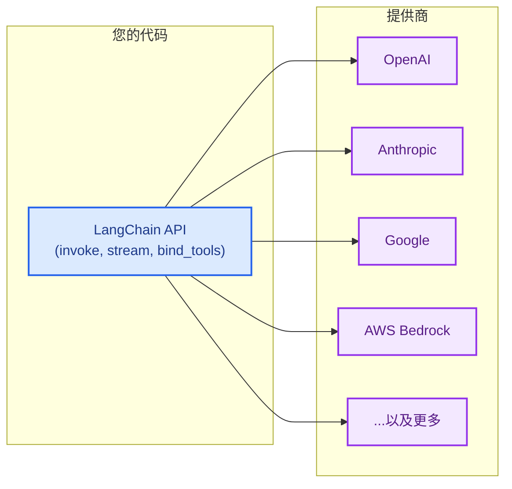

LangChain 为您提供一个单一、统一的 API 来处理来自任何提供商的模型。安装提供商软件包，选择一个模型名称，然后开始构建——无论您使用 OpenAI、Anthropic、Google 还是任何其他受支持的提供商，相同的代码都适用。



## 适用于任何模型的单一 API

每个 LangChain 聊天模型，无论提供商如何，都实现相同的接口。这意味着您可以：

- **更换提供商**而无需重写应用程序逻辑
- **使用相同的代码**并排比较模型
- **使用高级功能**，如[工具调用](/oss/javascript/langchain/tools)、[结构化输出](/oss/javascript/langchain/structured-output)和[流式传输](/oss/javascript/langchain/streaming)，适用于所有提供商

```typescript
import { initChatModel } from "langchain/chat_models/universal";

const openaiModel = await initChatModel("openai:gpt-5.4");
const anthropicModel = await initChatModel("anthropic:claude-opus-4-6");
const googleModel = await initChatModel("google-genai:gemini-3.1-pro-preview");

for (const model of [openaiModel, anthropicModel, googleModel]) {
    const response = await model.invoke("Explain quantum computing in one sentence.");
    console.log(response.text);
}
```

## 什么是提供商？

**提供商**是托管 AI 模型并通过 API 公开它们的公司或平台。示例包括 OpenAI、Anthropic、Google 和 AWS Bedrock。

在 LangChain 中，每个提供商都有一个专用的**集成软件包**（例如 `langchain-openai`、`langchain-anthropic`），该软件包为该提供商的模型实现标准的 LangChain 接口。这意味着：

- 每个提供商都有**专用软件包**，具有适当的版本控制和依赖管理
- 当您需要时，可以使用**提供商特定功能**（例如 OpenAI 的 Responses API、Anthropic 的扩展思维）
- 通过环境变量**自动处理 API 密钥**

```bash
npm install @langchain/openai       # 用于 OpenAI 模型
npm install @langchain/anthropic    # 用于 Anthropic 模型
npm install @langchain/google-genai # 用于 Google 模型
```

有关提供商软件包的完整列表，请参阅[集成页面](/oss/javascript/integrations/providers/overview)。

## 查找模型名称

每个提供商都支持特定的模型名称，您在初始化聊天模型时传递这些名称。有两种方法可以指定模型：

    <CodeGroup>
    ```typescript 提供商前缀格式
    import { initChatModel } from "langchain/chat_models/universal";

    const model = await initChatModel("openai:gpt-5.4");
    ```

    ```typescript 直接类实例化
    import { ChatOpenAI } from "@langchain/openai";

    const model = new ChatOpenAI({ model: "gpt-5.4" });
    ```
    </CodeGroup>

当使用 [`init_chat_model`](https://reference.langchain.com/javascript/langchain/chat_models/universal/initChatModel) 和 `provider:model` 格式时，LangChain 会自动解析提供商并加载正确的集成软件包。如果模型名称是明确的（例如，`"gpt-5.4"` 解析为 OpenAI），您也可以省略提供商前缀。

要查找提供商的可用模型名称，请参阅提供商自己的文档。以下是一些流行的提供商：

| 提供商 | 查找模型名称的位置 |
| :--- | :--- |
| [OpenAI](/oss/javascript/integrations/providers/openai) | [OpenAI 模型页面](https://platform.openai.com/docs/models) |
| [Anthropic](/oss/javascript/integrations/providers/anthropic) | [Anthropic 模型页面](https://docs.anthropic.com/en/docs/about-claude/models) |
| [Google](/oss/javascript/integrations/providers/google) | [Google AI 模型页面](https://ai.google.dev/gemini-api/docs/models) |
| [AWS Bedrock](/oss/javascript/integrations/providers/aws) | [Bedrock 支持的模型](https://docs.aws.amazon.com/bedrock/latest/userguide/models-supported.html) |

## 立即使用新模型

因为 LangChain 提供商软件包将模型名称直接传递给提供商的 API，所以您可以在提供商发布新模型的那一刻立即使用它们——无需更新 LangChain。只需传递新的模型名称：

```typescript
const model = await initChatModel("anthropic:claude-mythos");
```

只要您的提供商软件包版本支持模型所需的 API 版本，新的模型名称就可以立即使用。在大多数情况下，模型发布是向后兼容的，不需要软件包更新。

## 模型功能

不同的提供商和模型支持不同的功能。
有关聊天模型集成及其功能的列表，请参阅[聊天模型集成页面](/oss/javascript/integrations/chat)。

## 路由器和代理

**路由器**（也称为代理或网关）使您能够通过单一 API 和凭据访问来自多个提供商的模型。它们可以简化计费，让您在不更改集成的情况下在模型之间切换，并提供自动故障转移和负载均衡等功能。

| 提供商 | 集成 | 描述 |
| :------- | :---------- | :---------- |
| [OpenRouter](https://openrouter.ai/) | [`ChatOpenRouter`](/oss/javascript/integrations/chat/openrouter) | 统一访问来自 OpenAI、Anthropic、Google、Meta 等的模型 |

当您想要时，路由器非常有用：

- 使用**单一 API 密钥和计费账户**访问多个提供商
- **动态切换模型**而无需管理多个提供商凭据
- **使用故障转移模型**，如果主模型失败，会自动使用不同的模型重试

```typescript
import { initChatModel } from "langchain/chat_models/universal";

const model = await initChatModel("openrouter:anthropic/claude-sonnet-4-6");
const response = await model.invoke("Hello!");
```

## OpenAI 兼容端点

许多提供商提供与 OpenAI 的[聊天补全 API](https://platform.openai.com/docs/api-reference/chat) 兼容的端点。您可以使用 [`ChatOpenAI`](/oss/javascript/integrations/chat/openai) 和自定义 `base_url` 连接到这些端点：

```typescript
import { ChatOpenAI } from "@langchain/openai";

const model = new ChatOpenAI({
    configuration: { baseURL: "https://your-provider.com/v1" },
    apiKey: "your-api-key",
    model: "provider-model-name",
});
```

<Warning>
    `ChatOpenAI` 仅针对[官方 OpenAI API 规范](https://github.com/openai/openai-openapi)。来自第三方提供商的非标准响应字段不会被提取或保留。当您需要访问非标准功能时，请使用专用的提供商软件包或路由器。
</Warning>

## 下一步

<CardGroup cols={2}>
    <Card title="模型指南" icon="cpu" href="/oss/javascript/langchain/models">
        学习如何使用模型：调用、流式传输、批处理、工具调用等。
    </Card>
    <Card title="聊天模型集成" icon="message" href="/oss/javascript/integrations/chat">
        浏览所有聊天模型集成及其功能。
    </Card>
    <Card title="所有提供商" icon="grid-dots" href="/oss/javascript/integrations/providers/overview">
        查看提供商软件包和集成的完整列表。
    </Card>
    <Card title="代理" icon="robot" href="/oss/javascript/langchain/agents">
        构建使用模型作为其推理引擎的代理。
    </Card>
</CardGroup>

---

<div className="source-links">
<Callout icon="edit">
    [在 GitHub 上编辑此页面](https://github.com/langchain-ai/docs/edit/main/src/oss/concepts/providers-and-models.mdx) 或[提交问题](https://github.com/langchain-ai/docs/issues/new/choose)。
</Callout>
<Callout icon="terminal-2">
    [通过 MCP 将这些文档连接到 Claude、VSCode 等](/use-these-docs) 以获取实时答案。
</Callout>
</div>