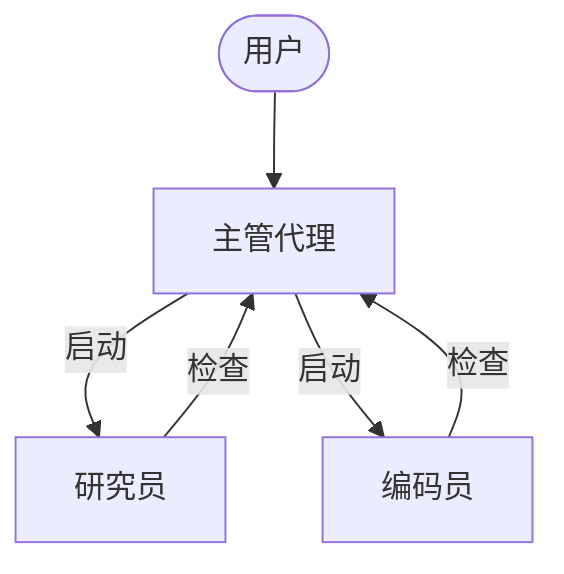
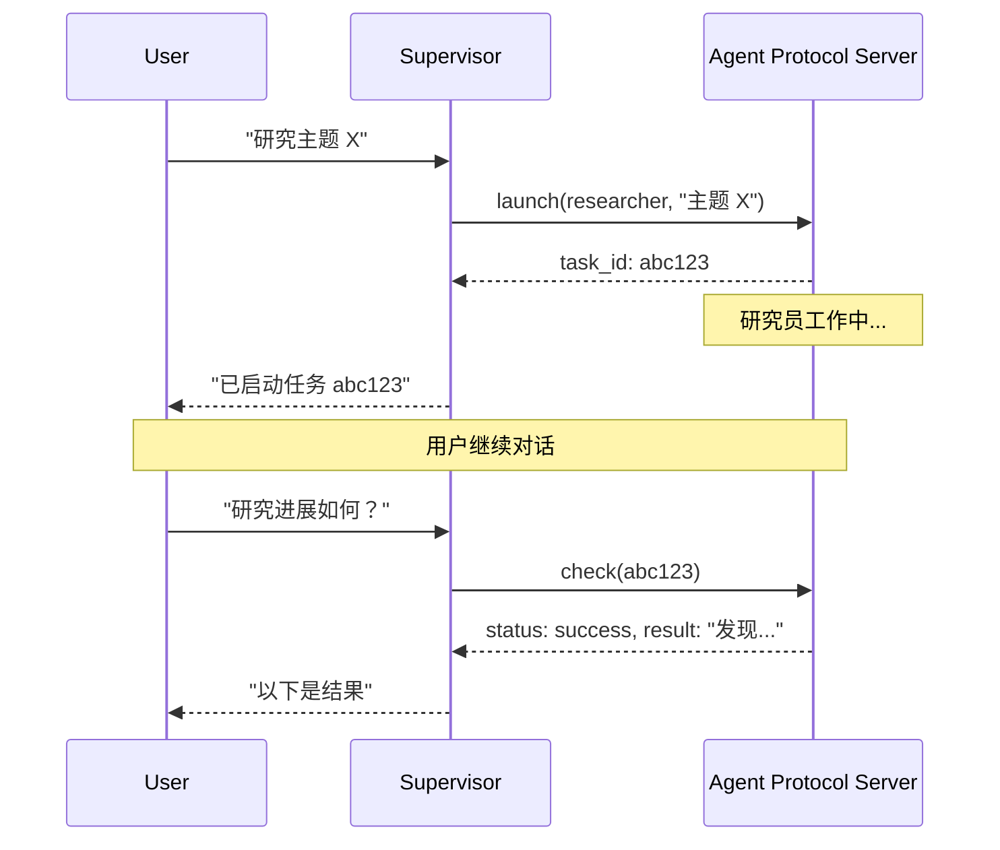

异步子代理允许主管代理启动立即返回的后台任务，这样主管代理可以在子代理并发工作的同时继续与用户交互。主管代理可以随时检查进度、发送后续指令或取消任务。

这建立在[子代理](/oss/javascript/deepagents/subagents)的基础上，后者是同步运行的，并会阻塞主管代理直到完成。当任务是长时间运行、可并行化或需要中途引导时，请使用异步子代理。

<Note>

异步子代理是 `deepagents` 1.9.0 中的预览功能。预览功能正在积极开发中，API 可能会发生变化。

</Note>



<Note>
异步子代理可与任何实现[代理协议](https://github.com/langchain-ai/agent-protocol)的服务器通信。您可以使用[LangSmith 部署](/langsmith/deployment)，或自行托管任何兼容代理协议的服务器。每个子代理独立于主管代理运行，主管代理通过 SDK 控制它们以启动、检查、更新和取消。
</Note>

## 何时使用异步子代理

| 维度 | 同步子代理 | 异步子代理 |
|------|------------|------------|
| **执行模型** | 主管代理阻塞，直到子代理完成 | 立即返回作业 ID；主管代理继续运行 |
| **并发性** | 并行但阻塞 | 并行且非阻塞 |
| **任务中更新** | 不可能 | 通过 `update_async_task` 发送后续指令 |
| **取消** | 不可能 | 通过 `cancel_async_task` 取消正在运行的任务 |
| **有状态性** | 无状态——调用之间无持久状态 | 有状态——在交互过程中通过自己的线程维护状态 |
| **最佳适用场景** | 代理应在继续之前等待结果的任务 | 长时间运行、复杂的任务，可在聊天中交互式管理 |

## 配置异步子代理

将异步子代理定义为 [`AsyncSubAgent`](https://reference.langchain.com/javascript/deepagents/agent/createDeepAgent) 规范列表，每个规范指向一个代理协议服务器：

```typescript
import { createDeepAgent, AsyncSubAgent } from "deepagents";

const asyncSubagents: AsyncSubAgent[] = [
  {
    name: "researcher",
    description: "用于信息收集和综合的研究代理",
    graphId: "researcher",
    // 无 url → ASGI 传输（在同一部署中共同部署）
  },
  {
    name: "coder",
    description: "用于代码生成和审查的编码代理",
    graphId: "coder",
    // url: "https://coder-deployment.langsmith.dev"  // 可选：用于远程的 HTTP 传输
  },
];

const agent = createDeepAgent({
  model: "google_genai:gemini-3.1-pro-preview",
  subagents: [...asyncSubagents],
});
```

| 字段 | 类型 | 描述 |
|-------|------|-------------|
| `name` | `string` | 必需。唯一标识符。主管代理在启动任务时使用此名称。 |
| `description` | `string` | 必需。此子代理的功能。主管代理使用此描述来决定委托给哪个代理。 |
| `graphId` | `string` | 必需。代理协议服务器上的图 ID（或助手 ID）。对于基于 LangGraph 的部署，此 ID 必须与 `langgraph.json` 中注册的图匹配。 |
| `url` | `string` | 可选。省略时，使用 ASGI 传输（进程内）。设置时，使用 HTTP 传输连接到远程代理协议服务器。 |
| `headers` | `Record<string, string>` | 可选。向远程服务器发送请求时的附加标头。用于自托管代理协议服务器的自定义身份验证。 |

对于基于 LangGraph 的部署，在共同部署设置中，将所有图注册到同一个 `langgraph.json`：

```json
{
  "graphs": {
    "supervisor": "./src/supervisor.py:graph",
    "researcher": "./src/researcher.py:graph",
    "coder": "./src/coder.py:graph"
  }
}
```

## 使用异步子代理工具

[`AsyncSubAgentMiddleware`](https://reference.langchain.com/javascript/deepagents/agent/createDeepAgent) 为主管代理提供五个工具：

| 工具 | 用途 | 返回值 |
|------|------|---------|
| `start_async_task` | 启动新的后台任务 | 任务 ID（立即返回） |
| `check_async_task` | 获取任务的当前状态和结果 | 状态 + 结果（如果完成） |
| `update_async_task` | 向正在运行的任务发送新指令 | 确认 + 更新后的状态 |
| `cancel_async_task` | 停止正在运行的任务 | 确认 |
| `list_async_tasks` | 列出所有跟踪的任务及其实时状态 | 所有任务的摘要 |

主管代理的 LLM 像调用任何其他工具一样调用这些工具。中间件自动处理线程创建、运行管理和状态持久化。

### 理解生命周期

典型的交互遵循以下顺序：



- **启动**：在服务器上创建新线程，以任务描述作为输入启动运行，并返回线程 ID 作为任务 ID。主管代理向用户报告此 ID，不轮询完成情况。
- **检查**：获取当前运行状态。如果运行成功，则检索线程状态以提取子代理的最终输出。如果仍在运行，则向用户报告。
- **更新**：在同一线程上创建新运行，采用中断多任务策略。之前的运行被中断，子代理使用完整的对话历史记录和新指令重新启动。任务 ID 保持不变。
- **取消**：在服务器上调用 `runs.cancel()` 并将任务标记为 `"cancelled"`。
- **列出**：遍历所有跟踪的任务。对于非终止任务，并行从服务器获取实时状态。终止状态（`success`、`error`、`cancelled`）从缓存返回。

## 理解状态管理

任务元数据存储在主管代理图上的专用状态通道 (`asyncTasks`) 中，与消息历史记录分开。这至关重要，因为深度代理在上下文窗口填满时会[压缩其消息历史记录](/oss/javascript/deepagents/context-engineering#summarization)。如果任务 ID 仅存在于工具消息中，它们将在压缩过程中丢失。专用通道确保主管代理始终可以通过 `list_async_tasks` 回忆其任务，即使在多轮摘要之后。

每个跟踪的任务记录任务 ID、代理名称、线程 ID、运行 ID、状态和时间戳（`createdAt`、`checkedAt`、`updatedAt`）。

## 选择传输方式

### ASGI 传输（共同部署）

当子代理规范省略 `url` 字段时，LangGraph SDK 使用 ASGI 传输——SDK 调用通过进程内函数调用路由，而不是 HTTP。对于基于 LangGraph 的部署，这要求两个图都注册在同一个 `langgraph.json` 中。

ASGI 传输消除了网络延迟，并且不需要额外的身份验证配置。子代理仍作为具有自己状态的独立线程运行。这是推荐的默认设置。

### HTTP 传输（远程）

添加 `url` 字段以切换到 HTTP 传输，其中 SDK 调用通过网络传输到远程代理协议服务器：

```typescript
{
  name: "researcher",
  description: "研究代理",
  graphId: "researcher",
  url: "https://my-research-deployment.langsmith.dev",
}
```

对于 LangGraph 部署，身份验证由 LangGraph SDK 使用环境变量中的 `LANGSMITH_API_KEY`（或 `LANGGRAPH_API_KEY`）处理。自托管代理协议服务器可能使用不同的身份验证机制。

当子代理需要独立扩展、不同的资源配置文件或由不同团队维护时，请使用 HTTP 传输。

## 选择部署拓扑

### 单一部署

单一部署意味着所有代理使用 ASGI 传输共同部署在同一服务器上。对于基于 LangGraph 的部署，将所有图注册在一个 `langgraph.json` 中。这是推荐的起点——一个服务器进行管理，代理之间零网络延迟。

### 拆分部署

主管代理在一个服务器上，子代理通过 HTTP 传输在另一个服务器上。当子代理需要不同的计算配置文件或独立扩展时使用。

### 混合部署

在混合部署中，一些子代理通过 ASGI 共同部署，其他子代理通过 HTTP 远程部署：

```typescript
const asyncSubagents: AsyncSubAgent[] = [
  {
    name: "researcher",
    description: "研究代理",
    graphId: "researcher",
    // 无 url → ASGI（共同部署）
  },
  {
    name: "coder",
    description: "编码代理",
    graphId: "coder",
    url: "https://coder-deployment.langsmith.dev",
    // 存在 url → HTTP（远程）
  },
];
```

## 最佳实践

### 为本地开发调整工作池大小

使用 `langgraph dev` 在本地运行时，增加工作池以适应并发子代理运行。每个活动运行占用一个工作槽。具有 3 个并发子代理任务的主管代理需要 4 个槽（1 个主管 + 3 个子代理）。资源不足会导致启动排队。

```bash
langgraph dev --n-jobs-per-worker 10
```

### 编写清晰的子代理描述

主管代理使用描述来决定启动哪个子代理。要具体且以行动为导向：

```typescript
// 好
{
  name: "researcher",
  description: "使用网络搜索进行深入研究。用于需要多次搜索和综合的问题。",
  graphId: "researcher",
}

// 差
{
  name: "helper",
  description: "帮助处理事务",
  graphId: "helper",
}
```

### 使用线程 ID 进行跟踪

使用基于 LangGraph 的部署时，每个异步子代理运行都是标准的 LangGraph 运行，在 LangSmith 中完全可见。主管代理的跟踪显示 `launch`、`check`、`update`、`cancel` 和 `list` 的工具调用。每个子代理运行显示为单独的跟踪，通过线程 ID 链接。使用线程 ID（任务 ID）将主管编排跟踪与子代理执行跟踪关联起来。

## 故障排除

### 主管代理在启动后立即轮询

**问题**：主管代理在启动后立即循环调用 `check`，将异步执行变为阻塞。

**解决方案**：中间件注入系统提示规则以防止此情况。如果轮询持续存在，请在主管代理的系统提示中强化此行为：

```typescript
const agent = createDeepAgent({
  model: "google_genai:gemini-3.1-pro-preview",
  systemPrompt: `...您的指令...

    启动异步子代理后，始终将控制权交还给用户。
    切勿在启动后立即调用 check_async_task。`,
  subagents: [...asyncSubagents],
});
```

### 主管代理报告过时状态

**问题**：主管代理引用对话历史中较早的任务状态，而不是进行新的 `check` 调用。

**解决方案**：中间件提示指示模型“对话历史中的任务状态总是过时的”。如果仍然发生，请添加明确的指令，在报告状态之前始终调用 `check` 或 `list`。

### 任务 ID 查找失败

**问题**：主管代理截断或重新格式化任务 ID，导致 `check` 或 `cancel` 失败。

**解决方案**：中间件提示指示模型始终使用完整的任务 ID。如果截断持续存在，这通常是模型特定的问题——尝试不同的模型，或在系统提示中添加“始终显示完整的 task_id，从不截断或缩写”。

### 子代理启动排队而不是运行

**问题**：启动子代理挂起或需要很长时间才能开始。

**解决方案**：工作池可能已耗尽。使用 `--n-jobs-per-worker` 增加池大小。请参阅[调整工作池大小](#size-the-worker-pool-for-local-development)。

## 参考实现

[async-deep-agents](https://github.com/langchain-ai/async-deep-agents) 仓库包含 Python 和 TypeScript 的工作示例，可部署到 LangSmith 部署。它演示了具有研究员和编码员子代理的主管代理作为后台任务运行。

---

<div className="source-links">
<Callout icon="edit">
    [在 GitHub 上编辑此页面](https://github.com/langchain-ai/docs/edit/main/src/oss/deepagents/async-subagents.mdx) 或[提交问题](https://github.com/langchain-ai/docs/issues/new/choose)。
</Callout>
<Callout icon="terminal-2">
    [通过 MCP 将这些文档连接](/use-these-docs)到 Claude、VSCode 等，以获取实时答案。
</Callout>
</div>