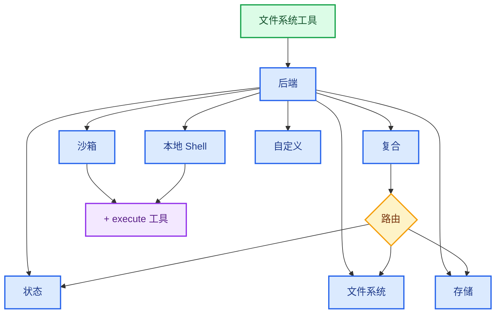

import BackendStatePy from '/snippets/backend-state-py.mdx';
import BackendStateJs from '/snippets/backend-state-js.mdx';
import BackendFilesystemPy from '/snippets/backend-filesystem-py.mdx';
import BackendFilesystemJs from '/snippets/backend-filesystem-js.mdx';
import BackendLocalShellPy from '/snippets/backend-local-shell-py.mdx';
import BackendLocalShellJs from '/snippets/backend-local-shell-js.mdx';
import BackendStorePy from '/snippets/backend-store-py.mdx';
import BackendStoreJs from '/snippets/backend-store-js.mdx';
import BackendCompositePy from '/snippets/backend-composite-py.mdx';
import BackendCompositeJs from '/snippets/backend-composite-js.mdx';

Deep Agents 通过 `ls`、`read_file`、`write_file`、`edit_file`、`glob` 和 `grep` 等工具向代理暴露文件系统表面。这些工具通过可插拔的后端运行。`read_file` 工具原生支持所有后端中的图像文件（`.png`、`.jpg`、`.jpeg`、`.gif`、`.webp`），并将其作为多模态内容块返回。

`read_file` 工具原生支持所有后端中的二进制文件（图像、PDF、音频、视频），并返回带有类型化 `content` 和 `mimeType` 的 `ReadResult`。

沙箱和 [`LocalShellBackend`](https://reference.langchain.com/javascript/deepagents/backends/LocalShellBackend) 还提供 `execute` 工具。
本页说明如何：

- [选择后端](#specify-a-backend),
- [将不同路径路由到不同后端](#route-to-different-backends),
- [实现您自己的虚拟文件系统](#use-a-virtual-filesystem)（例如 S3 或 Postgres）,
- [设置文件系统访问权限](#permissions),
- [添加策略钩子](#add-policy-hooks),
- [处理二进制和多模态文件](#multimodal-and-binary-files),
- [遵守后端协议](#protocol-reference),
- 以及 [将现有后端更新至 v2](#update-existing-backends-to-v2)。

## 快速入门

以下是几个预构建的文件系统后端，您可以快速与您的 Deep Agent 一起使用：

| 内置后端 | 描述 |
|---|---|
| [默认](#statebackend-ephemeral) | `agent = create_deep_agent(model="google_genai:gemini-3.1-pro-preview")` <br></br> 状态中临时存储。代理的默认文件系统后端存储在 `langgraph` 状态中。请注意，此文件系统仅在单个线程中持久化。 |
| [本地文件系统持久化](#filesystembackend-local-disk) | `agent = create_deep_agent(model="google_genai:gemini-3.1-pro-preview", backend=FilesystemBackend(root_dir="/Users/nh/Desktop/"))` <br></br> 这使 Deep Agent 能够访问您本地机器的文件系统。您可以指定代理有权访问的根目录。请注意，任何提供的 `root_dir` 必须是绝对路径。 |
| [持久化存储（LangGraph 存储）](#storebackend-langgraph-store) | `agent = create_deep_agent(model="google_genai:gemini-3.1-pro-preview", backend=StoreBackend())` <br></br> 这使代理能够访问跨线程持久化的长期存储。这对于存储长期记忆或适用于代理多次执行的指令非常有用。 |
| [沙箱](/oss/javascript/deepagents/sandboxes) | `agent = create_deep_agent(model="google_genai:gemini-3.1-pro-preview", backend=sandbox)` <br></br> 在隔离环境中执行代码。沙箱提供文件系统工具以及用于运行 shell 命令的 `execute` 工具。可从 Modal、Daytona、Deno 或本地 VFS 中选择。 |
| [本地 shell](#localshellbackend-local-shell) | `agent = create_deep_agent(model="google_genai:gemini-3.1-pro-preview", backend=LocalShellBackend(root_dir=".", env={"PATH": "/usr/bin:/bin"}))` <br></br> 直接在主机上进行文件系统和 shell 执行。无隔离——仅在受控开发环境中使用。请参阅下面的[安全注意事项](#localshellbackend-local-shell)。 |
| [复合](#compositebackend-router) | 默认情况下是临时的，`/memories/` 持久化。复合后端具有最大的灵活性。您可以在文件系统中指定不同的路由以指向不同的后端。请参阅下面的复合路由以获取可直接复制粘贴的示例。 |



## 内置后端

### StateBackend（临时）


<BackendStateJs />


**工作原理：**
- 通过 [`StateBackend`](https://reference.langchain.com/javascript/deepagents/backends/StateBackend) 将文件存储在当前线程的 LangGraph 代理状态中。
- 通过检查点在同一线程上的多个代理轮次中持久化。

**最佳适用于：**
- 代理用于编写中间结果的临时草稿本。
- 自动清除大型工具输出，代理随后可以逐块读回。

请注意，此后端在主管代理和子代理之间共享，子代理编写的任何文件在子代理执行完成后仍保留在 LangGraph 代理状态中。这些文件将继续可供主管代理和其他子代理使用。

### FilesystemBackend（本地磁盘）

[`FilesystemBackend`](https://reference.langchain.com/javascript/deepagents/backends/FilesystemBackend) 在可配置的根目录下读写真实文件。

<Warning>
此后端授予代理直接的文件系统读写访问权限。
请谨慎使用，仅在适当的环境中使用。

**适当的用例：**
- 本地开发 CLI（编码助手、开发工具）
- CI/CD 管道（请参阅下面的安全注意事项）

**不适当的用例：**
- Web 服务器或 HTTP API - 请改用 `StateBackend`、`StoreBackend` 或[沙箱后端](/oss/javascript/deepagents/sandboxes)

**安全风险：**
- 代理可以读取任何可访问的文件，包括秘密（API 密钥、凭据、`.env` 文件）
- 结合网络工具，秘密可能通过 SSRF 攻击被窃取
- 文件修改是永久且不可逆的

**推荐的安全措施：**
1. 启用[人机回环 (HITL) 中间件](/oss/javascript/deepagents/human-in-the-loop)以审查敏感操作。
2. 从可访问的文件系统路径中排除秘密（尤其是在 CI/CD 中）。
3. 对于需要文件系统交互的生产环境，请使用[沙箱后端](/oss/javascript/deepagents/sandboxes)。
4. **始终**将 `virtual_mode=True` 与 `root_dir` 一起使用，以启用基于路径的访问限制（阻止 `..`、`~` 和根目录外的绝对路径）。
   请注意，默认情况下（`virtual_mode=False`）即使设置了 `root_dir` 也不提供任何安全性。
</Warning>


<BackendFilesystemJs />


**工作原理：**
- 在可配置的 `root_dir` 下读写真实文件。
- 您可以选择性地设置 `virtual_mode=True` 以在 `root_dir` 下对路径进行沙箱化和规范化。
- 使用安全的路径解析，尽可能防止不安全的符号链接遍历，可以使用 ripgrep 进行快速 `grep`。

**最佳适用于：**
- 您机器上的本地项目
- CI 沙箱
- 挂载的持久卷

### LocalShellBackend（本地 shell）

<Warning>
此后端授予代理直接的文件系统读写访问权限**以及**在您的主机上不受限制的 shell 执行权限。
请极其谨慎地使用，仅在适当的环境中使用。

**适当的用例：**
- 本地开发 CLI（编码助手、开发工具）
- 您信任代理代码的个人开发环境
- 具有适当秘密管理的 CI/CD 管道

**不适当的用例：**
- 生产环境（例如 Web 服务器、API、多租户系统）
- 处理不受信任的用户输入或执行不受信任的代码

**安全风险：**
- 代理可以使用您的用户权限执行**任意 shell 命令**
- 代理可以读取任何可访问的文件，包括秘密（API 密钥、凭据、`.env` 文件）
- 秘密可能被暴露
- 文件修改和命令执行是**永久且不可逆的**
- 命令直接在您的主机系统上运行
- 命令可以消耗无限的 CPU、内存、磁盘

**推荐的安全措施：**
1. 启用[人机回环 (HITL) 中间件](/oss/javascript/deepagents/human-in-the-loop)以在执行前审查和批准操作。**强烈推荐**。
2. 仅在专用开发环境中运行。切勿在共享或生产系统上使用。
3. 对于需要 shell 执行的生产环境，请使用[沙箱后端](/oss/javascript/deepagents/sandboxes)。

**注意：** 启用 shell 访问时，`virtual_mode=True` 不提供任何安全性，因为命令可以访问系统上的任何路径。
</Warning>


<BackendLocalShellJs />


**工作原理：**
- 扩展 `FilesystemBackend`，添加 `execute` 工具以在主机上运行 shell 命令。
- 命令直接在您的机器上使用 `subprocess.run(shell=True)` 运行，无沙箱化。
- 支持 `timeout`（默认 120 秒）、`max_output_bytes`（默认 100,000）、`env` 和 `inherit_env` 用于环境变量。
- Shell 命令使用 `root_dir` 作为工作目录，但可以访问系统上的任何路径。

**最佳适用于：**
- 本地编码助手和开发工具
- 在您信任代理时进行快速迭代开发

### StoreBackend（LangGraph 存储）


<BackendStoreJs />


<Tip>
    `namespace` 参数控制数据隔离。对于多用户部署，请始终设置[命名空间工厂](/oss/javascript/deepagents/backends#namespace-factories)以按用户或租户隔离数据。
</Tip>

**工作原理：**
- [`StoreBackend`](https://reference.langchain.com/javascript/deepagents/backends/StoreBackend) 将文件存储在运行时提供的 LangGraph [`BaseStore`](https://reference.langchain.com/javascript/langchain-core/stores/BaseStore) 中，实现跨线程的持久化存储。

**最佳适用于：**
- 当您已经运行配置了 LangGraph 存储时（例如，Redis、Postgres 或 [`BaseStore`](https://reference.langchain.com/javascript/langchain-core/stores/BaseStore) 背后的云实现）。
- 当您通过 [LangSmith 部署](/langsmith/deployment) 部署代理时（会自动为您的代理预配存储）。

#### 命名空间工厂

命名空间工厂控制 `StoreBackend` 读写数据的位置。它接收一个 LangGraph [`Runtime`](https://reference.langchain.com/javascript/langchain/index/Runtime) 并返回一个用作存储命名空间的字符串元组。使用命名空间工厂在用户、租户或助手之间隔离数据。

在构造 `StoreBackend` 时将命名空间工厂传递给 `namespace` 参数：

```python
NamespaceFactory = Callable[[Runtime], tuple[str, ...]]
```

`Runtime` 提供：
- `rt.context` — 通过 LangGraph 的[上下文模式](https://langchain-ai.github.io/langgraph/concepts/runtime/)传递的用户提供的上下文（例如 `user_id`）
- `rt.serverInfo` — 在 LangGraph Server 上运行时的服务器特定元数据（助手 ID、图 ID、身份验证用户）
- `rt.executionInfo` — 执行身份信息（线程 ID、运行 ID、检查点 ID）


<Note>
`Runtime` 参数在 `deepagents>=1.9.1` 中可用。早期的 1.9.x 版本传递 `BackendContext` — 请参阅下面的[从 `BackendContext` 迁移](#migrating-from-backendcontext)。`rt.serverInfo` 和 `rt.executionInfo` 需要 `deepagents>=1.9.0`。
</Note>


**常见的命名空间模式：**


```typescript
import { StoreBackend } from "deepagents";

// 按用户：每个用户获得自己的隔离存储
const backend = new StoreBackend({
  namespace: (rt) => [rt.serverInfo.user.identity],  // [!code highlight]
});

// 按助手：同一助手的所有用户共享存储
const backend = new StoreBackend({
  namespace: (rt) => [rt.serverInfo.assistantId],  // [!code highlight]
});

// 按线程：存储范围限定到单个对话
const backend = new StoreBackend({
  namespace: (rt) => [rt.executionInfo.threadId],  // [!code highlight]
});
```


您可以组合多个组件以创建更具体的范围 — 例如，`(user_id, thread_id)` 用于按用户按对话隔离，或附加后缀如 `"filesystem"` 以在相同范围使用多个存储命名空间时消除歧义。

命名空间组件必须仅包含字母数字字符、连字符、下划线、点、`@`、`+`、冒号和波浪号。拒绝通配符（`*`、`?`）以防止 glob 注入。


<Warning>
    `namespace` 参数在 v1.9.0 中将是**必需的**。对于新代码，请始终显式设置它。
</Warning>


<Note>
    当未提供命名空间工厂时，旧版默认使用 LangGraph 配置元数据中的 `assistant_id`。这意味着同一[助手](/langsmith/assistants)的所有用户共享相同的存储。对于多用户[投入生产](/oss/javascript/deepagents/going-to-production)，请始终提供命名空间工厂。
</Note>

### CompositeBackend（路由器）


<BackendCompositeJs />


**工作原理：**
- [`CompositeBackend`](https://reference.langchain.com/javascript/deepagents/backends/CompositeBackend) 根据路径前缀将文件操作路由到不同的后端。
- 在列表和搜索结果中保留原始路径前缀。

**最佳适用于：**
- 当您想为代理提供临时和跨线程存储时，`CompositeBackend` 允许您同时提供 `StateBackend` 和 `StoreBackend`
- 当您有多个信息源，希望将其作为单个文件系统的一部分提供给您的代理时。
    - 例如，您在某个存储下的 `/memories/` 中存储了长期记忆，并且您还有一个自定义后端，可在 /docs/ 处访问文档。

## 指定后端


- 将后端实例传递给 `createDeepAgent({ backend: ... })`。文件系统中间件将其用于所有工具。
- 后端必须实现 `AnyBackendProtocol`（`BackendProtocolV1` 或 `BackendProtocolV2`）— 例如，`new StateBackend()`、`new FilesystemBackend({ rootDir: "." })`、`new StoreBackend()`。
- 如果省略，默认为 `new StateBackend()`。

<Note>
在 1.9.0 版本之前，仅支持 `BackendProtocol`，现在称为 `BackendProtocolV1`。V1 后端在运行时通过 `adaptBackendProtocol()` 自动适配为 V2。无需更改代码即可继续使用现有的 V1 后端。要更新到 v2，请参阅[将现有后端更新至 v2](#update-existing-backends-to-v2)。
</Note>


## 路由到不同后端

将命名空间的部分路由到不同的后端。通常用于持久化 `/memories/*` 并保持其他所有内容临时。


```typescript
import { createDeepAgent, CompositeBackend, FilesystemBackend, StateBackend } from "deepagents";

const agent = createDeepAgent({
  backend: new CompositeBackend(
    new StateBackend(),
    {
      "/memories/": new FilesystemBackend({ rootDir: "/deepagents/myagent", virtualMode: true }),
    },
  ),
});
```


行为：
- `/workspace/plan.md` → `StateBackend`（临时）
- `/memories/agent.md` → `FilesystemBackend`，位于 `/deepagents/myagent` 下
- `ls`、`glob`、`grep` 聚合结果并显示原始路径前缀。

注意：
- 更长的前缀优先（例如，路由 `"/memories/projects/"` 可以覆盖 `"/memories/"`）。
- 对于 StoreBackend 路由，请确保通过 `create_deep_agent(model=..., store=...)` 提供存储，或由平台预配。

## 使用虚拟文件系统

构建自定义后端以将远程或数据库文件系统（例如 S3 或 Postgres）投影到工具命名空间中。

设计指南：

- 路径是绝对的（`/x/y.txt`）。决定如何将它们映射到您的存储键/行。
- 高效实现 `ls` 和 `glob`（在可用时进行服务器端过滤，否则进行本地过滤）。
- 对于外部持久化（S3、Postgres 等），在写入/编辑结果中返回 `files_update=None`（Python）或省略 `filesUpdate`（JS）— 仅内存状态后端需要返回文件更新字典。


- 使用 `ls` 和 `glob` 作为方法名。
- 所有查询方法（`ls`、`read`、`readRaw`、`grep`、`glob`）必须返回结构化的 Result 对象（例如 `LsResult`、`ReadResult`），并带有可选的 `error` 字段。
- 在 `read()` 中支持二进制文件，返回带有适当 `mimeType` 的 `Uint8Array` 内容。


S3 风格大纲：


```typescript
import {
  type BackendProtocolV2,
  type LsResult,
  type ReadResult,
  type ReadRawResult,
  type GrepResult,
  type GlobResult,
  type WriteResult,
  type EditResult,
} from "deepagents";

class S3Backend implements BackendProtocolV2 {
  constructor(private bucket: string, private prefix: string = "") {
    this.prefix = prefix.replace(/\/$/, "");
  }

  private key(path: string): string {
    return `${this.prefix}${path}`;
  }

  async ls(path: string): Promise<LsResult> {
    // 列出 key(path) 下的对象；返回 { files: [...] }
    ...
  }

  async read(filePath: string, offset?: number, limit?: number): Promise<ReadResult> {
    // 获取对象；返回 { content, mimeType }
    // 对于二进制文件，返回 Uint8Array 内容
    ...
  }

  async readRaw(filePath: string): Promise<ReadRawResult> {
    // 返回 { data: FileData }
    ...
  }

  async grep(pattern: string, path?: string | null, glob?: string | null): Promise<GrepResult> {
    // 搜索文本文件；跳过二进制文件；返回 { matches: [...] }
    ...
  }

  async glob(pattern: string, path = "/"): Promise<GlobResult> {
    // 相对于 path 应用 glob；返回 { files: [...] }
    ...
  }

  async write(filePath: string, content: string): Promise<WriteResult> {
    // 强制执行仅创建语义；返回 { path: filePath, filesUpdate: null }
    ...
  }

  async edit(filePath: string, oldString: string, newString: string, replaceAll?: boolean): Promise<EditResult> {
    // 读取 → 替换 → 写入 → 返回 { path, occurrences }
    ...
  }
}
```


Postgres 风格大纲：


- 表 `files(path text primary key, content text, mime_type text, created_at timestamptz, modified_at timestamptz)`
- 将工具操作映射到 SQL：
  - `ls` 使用 `WHERE path LIKE $1 || '%'` → 返回 `LsResult`
  - `glob` 在 SQL 中过滤或获取后在本地应用 glob → 返回 `GlobResult`
  - `grep` 可以通过扩展名或最后修改时间获取候选行，然后扫描行（跳过 `mime_type` 为二进制的行）→ 返回 `GrepResult`


## 权限

使用[权限](/oss/javascript/deepagents/permissions)以声明方式控制代理可以读取或写入哪些文件和目录。权限适用于内置文件系统工具，并在调用后端之前进行评估。


有关完整选项集，包括规则排序、子代理权限和复合后端交互，请参阅[权限指南](/oss/javascript/deepagents/permissions)。

## 添加策略钩子

对于超出基于路径的允许/拒绝规则（速率限制、审计日志、内容检查）的自定义验证逻辑，通过子类化或包装后端来强制执行企业规则。

阻止在选定前缀下写入/编辑（子类化）：


```typescript
import { FilesystemBackend, type WriteResult, type EditResult } from "deepagents";

class GuardedBackend extends FilesystemBackend {
  private denyPrefixes: string[];

  constructor({ denyPrefixes, ...options }: { denyPrefixes: string[]; rootDir?: string }) {
    super(options);
    this.denyPrefixes = denyPrefixes.map(p => p.endsWith("/") ? p : p + "/");
  }

  async write(filePath: string, content: string): Promise<WriteResult> {
    if (this.denyPrefixes.some(p => filePath.startsWith(p))) {
      return { error: `Writes are not allowed under ${filePath}` };
    }
    return super.write(filePath, content);
  }

  async edit(filePath: string, oldString: string, newString: string, replaceAll = false): Promise<EditResult> {
    if (this.denyPrefixes.some(p => filePath.startsWith(p))) {
      return { error: `Edits are not allowed under ${filePath}` };
    }
    return super.edit(filePath, oldString, newString, replaceAll);
  }
}
```


通用包装器（适用于任何后端）：


```typescript
import {
  type BackendProtocolV2,
  type LsResult,
  type ReadResult,
  type ReadRawResult,
  type GrepResult,
  type GlobResult,
  type WriteResult,
  type EditResult,
} from "deepagents";

class PolicyWrapper implements BackendProtocolV2 {
  private denyPrefixes: string[];

  constructor(private inner: BackendProtocolV2, denyPrefixes: string[] = []) {
    this.denyPrefixes = denyPrefixes.map(p => p.endsWith("/") ? p : p + "/");
  }

  private isDenied(path: string): boolean {
    return this.denyPrefixes.some(p => path.startsWith(p));
  }

  ls(path: string): Promise<LsResult> { return this.inner.ls(path); }
  read(filePath: string, offset?: number, limit?: number): Promise<ReadResult> { return this.inner.read(filePath, offset, limit); }
  readRaw(filePath: string): Promise<ReadRawResult> { return this.inner.readRaw(filePath); }
  grep(pattern: string, path?: string | null, glob?: string | null): Promise<GrepResult> { return this.inner.grep(pattern, path, glob); }
  glob(pattern: string, path?: string): Promise<GlobResult> { return this.inner.glob(pattern, path); }

  async write(filePath: string, content: string): Promise<WriteResult> {
    if (this.isDenied(filePath)) return { error: `Writes are not allowed under ${filePath}` };
    return this.inner.write(filePath, content);
  }

  async edit(filePath: string, oldString: string, newString: string, replaceAll = false): Promise<EditResult> {
    if (this.isDenied(filePath)) return { error: `Edits are not allowed under ${filePath}` };
    return this.inner.edit(filePath, oldString, newString, replaceAll);
  }
}
```


## 多模态和二进制文件

<Note>
多模态文件支持（PDF、音频、视频）需要 `deepagents>=1.9.0`。
</Note>

V2 后端原生支持二进制文件。当 `read()` 遇到二进制文件（由文件扩展名的 MIME 类型确定）时，它会返回一个带有 `Uint8Array` 内容和相应 `mimeType` 的 `ReadResult`。文本文件返回 `string` 内容。

### 支持的 MIME 类型

| 类别 | 扩展名 | MIME 类型 |
|----------|-----------|------------|
| 图像 | `.png`、`.jpg`/`.jpeg`、`.gif`、`.webp`、`.svg`、`.heic`、`.heif` | `image/png`、`image/jpeg`、`image/gif`、`image/webp`、`image/svg+xml`、`image/heic`、`image/heif` |
| 音频 | `.mp3`、`.wav`、`.aiff`、`.aac`、`.ogg`、`.flac` | `audio/mpeg`、`audio/wav`、`audio/aiff`、`audio/aac`、`audio/ogg`、`audio/flac` |
| 视频 | `.mp4`、`.webm`、`.mpeg`/`.mpg`、`.mov`、`.avi`、`.flv`、`.wmv`、`.3gpp` | `video/mp4`、`video/webm`、`video/mpeg`、`video/quicktime`、`video/x-msvideo`、`video/x-flv`、`video/x-ms-wmv`、`video/3gpp` |
| 文档 | `.pdf`、`.ppt`、`.pptx` | `application/pdf`、`application/vnd.ms-powerpoint`、`application/vnd.openxmlformats-officedocument.presentationml.presentation` |
| 文本 | `.txt`、`.html`、`.json`、`.js`、`.ts`、`.py` 等 | `text/plain`、`text/html`、`application/json` 等 |

### 读取二进制文件

```typescript
const result = await backend.read("/workspace/screenshot.png");

if (result.error) {
  console.error(result.error);
} else if (result.content instanceof Uint8Array) {
  // 二进制文件 — 内容是 Uint8Array，mimeType 已设置
  console.log(`Binary file: ${result.mimeType}`); // "image/png"
} else {
  // 文本文件 — 内容是字符串
  console.log(`Text file: ${result.mimeType}`); // "text/plain"
}
```

### FileData 格式

`FileData` 是用于在状态和存储后端中存储文件内容的类型。

```typescript
type FileData =
  // 当前格式 (v2)
  | {
      content: string | Uint8Array; // 文本为 string，二进制为 Uint8Array
      mimeType: string;             // 例如 "text/plain", "image/png"
      created_at: string;           // ISO 8601 时间戳
      modified_at: string;          // ISO 8601 时间戳
    }
  // 旧版格式 (v1)
  | {
      content: string[];            // 行数组
      created_at: string;           // ISO 8601 时间戳
      modified_at: string;          // ISO 8601 时间戳
    };
```


后端在从状态或存储读取时可能会遇到任一格式。框架会透明地处理这两种格式。新写入默认使用 v2 格式。在滚动部署期间，如果较旧的读取器需要旧版格式，请将 `fileFormat: "v1"` 传递给后端构造函数（例如 `new StoreBackend({ fileFormat: "v1" })`）。

## 从后端工厂迁移

<Warning>

后端工厂模式自 `deepagents` 1.9.0 起已**弃用**。请直接传递预构造的后端实例，而不是工厂函数。

</Warning>

以前，像 `StateBackend` 和 `StoreBackend` 这样的后端需要一个接收运行时对象的工厂函数，因为它们需要运行时上下文（状态、存储）来操作。后端现在通过 LangGraph 的 `get_config()`、`get_store()` 和 `get_runtime()` 助手在内部解析此上下文，因此您可以直接传递实例。

### 变化内容

| 之前（已弃用） | 之后 |
|---|---|
| `backend=lambda rt: StateBackend(rt)` | `backend=StateBackend()` |
| `backend=lambda rt: StoreBackend(rt)` | `backend=StoreBackend()` |
| `backend=lambda rt: CompositeBackend(default=StateBackend(rt), ...)` | `backend=CompositeBackend(default=StateBackend(), ...)` |
| `backend: (config) => new StateBackend(config)` | `backend: new StateBackend()` |
| `backend: (config) => new StoreBackend(config)` | `backend: new StoreBackend()` |

### 已弃用的 API


| 已弃用 | 替代方案 |
|---|---|
| `BackendFactory` 类型 | 直接传递后端实例 |
| `BackendRuntime` 接口 | 后端在内部解析上下文 |
| `StateBackend(runtime, options?)` 构造函数重载 | `new StateBackend(options?)` |
| `StoreBackend(stateAndStore, options?)` 构造函数重载 | `new StoreBackend(options?)` |
| `WriteResult` 和 `EditResult` 上的 `filesUpdate` 字段 | 状态写入现在由后端在内部处理 |


<Note>
工厂模式在运行时仍然有效，并发出弃用警告。请在下一个主要版本之前更新您的代码以使用直接实例。
</Note>

### 迁移示例


```typescript
// 之前（已弃用）
import { createDeepAgent, CompositeBackend, StateBackend, StoreBackend } from "deepagents";

const agent = createDeepAgent({
  backend: (config) => new CompositeBackend(
    new StateBackend(config),
    { "/memories/": new StoreBackend(config, {
      namespace: (rt) => [rt.serverInfo.user.identity],
    }) },
  ),
});

// 之后
const agent = createDeepAgent({
  backend: new CompositeBackend(
    new StateBackend(),
    { "/memories/": new StoreBackend({
      namespace: (rt) => [rt.serverInfo.user.identity],
    }) },
  ),
});
```


### 从 `BackendContext` 迁移

在 `deepagents>=0.5.2`（Python）和 `deepagents>=1.9.1`（TypeScript）中，命名空间工厂直接接收 LangGraph [`Runtime`](https://reference.langchain.com/javascript/langchain/index/Runtime)，而不是 `BackendContext` 包装器。旧的 `BackendContext` 形式仍然通过向后兼容的 `.runtime` 和 `.state` 访问器工作，但这些访问器会发出弃用警告，并将在 `deepagents>=0.7` 中移除。

**变化内容：**

- 工厂参数现在是 `Runtime`，而不是 `BackendContext`。
- 删除 `.runtime` 访问器 — 例如，`ctx.runtime.context.user_id` 变为 `rt.server_info.user.identity`。
- 没有 `ctx.state` 的直接替代品。命名空间信息应该是只读的，并且在运行的生命周期内稳定，而状态是可变的，并且会逐步更改—从中派生命名空间可能会导致数据最终位于不一致的键下。如果您有需要读取代理状态的用例，请[提出问题](https://github.com/langchain-ai/deepagents/issues)。


```typescript
// 之前（已弃用，在 v0.7 中移除）
new StoreBackend({
  namespace: (ctx) => [ctx.runtime.context.userId],  // [!code --]
});

// 之后
new StoreBackend({
  namespace: (rt) => [rt.serverInfo.user.identity],  // [!code ++]
});
```


## 协议参考

后端必须实现 [`BackendProtocol`](https://reference.langchain.com/javascript/deepagents/backends/BackendProtocol)。

必需方法：
- `ls(path: str) -> LsResult`
  - 返回至少包含 `path` 的条目。在可用时包含 `is_dir`、`size`、`modified_at`。按 `path` 排序以获得确定性输出。
- `read(file_path: str, offset: int = 0, limit: int = 2000) -> ReadResult`
  - 成功时返回文件数据。文件缺失时，返回 `ReadResult(error="Error: File '/x' not found")`。
- `grep(pattern: str, path: Optional[str] = None, glob: Optional[str] = None) -> GrepResult`
  - 返回结构化匹配项。错误时，返回 `GrepResult(error="...")`（不要引发）。
- `glob(pattern: str, path: str = "/") -> GlobResult`
  - 返回匹配的文件作为 `FileInfo` 条目（如果没有则为空列表）。
- `write(file_path: str, content: str) -> WriteResult`
  - 仅创建。冲突时，返回 `WriteResult(error=...)`。成功时，设置 `path`，对于状态后端设置 `files_update={...}`；外部后端应使用 `files_update=None`。
- `edit(file_path: str, old_string: str, new_string: str, replace_all: bool = False) -> EditResult`
  - 强制执行 `old_string` 的唯一性，除非 `replace_all=True`。如果未找到，则返回错误。成功时包含 `occurrences`。

支持类型：
- `LsResult(error, entries)` — 成功时 `entries` 为 `list[FileInfo]`，失败时为 `None`。
- `ReadResult(error, file_data)` — 成功时 `file_data` 为 `FileData` 字典，失败时为 `None`。
- `GrepResult(error, matches)` — 成功时 `matches` 为 `list[GrepMatch]`，失败时为 `None`。
- `GlobResult(error, matches)` — 成功时 `matches` 为 `list[FileInfo]`，失败时为 `None`。
- `WriteResult(error, path, files_update)`
- `EditResult(error, path, files_update, occurrences)`
- `FileInfo` 包含字段：`path`（必需），可选 `is_dir`、`size`、`modified_at`。
- `GrepMatch` 包含字段：`path`、`line`、`text`。
- `FileData` 包含字段：`content`（str）、`encoding`（`"utf-8"` 或 `"base64"`）、`created_at`、`modified_at`。
:::

后端实现 `BackendProtocolV2`。所有查询方法返回结构化的 Result 对象，包含 `{ error?: string, ...data }`。

### 必需方法

- **`ls(path: string) → LsResult`**
  - 列出指定目录中的文件和目录（非递归）。目录的路径带有尾随 `/`，且 `is_dir=true`。在可用时包含 `is_dir`、`size`、`modified_at`。

- **`read(filePath: string, offset?: number, limit?: number) → ReadResult`**
  - 读取文件内容。对于文本文件，内容按行偏移/限制分页（默认偏移 0，限制 500）。对于二进制文件，返回完整的原始 `Uint8Array` 内容，并设置 `mimeType` 字段。文件缺失时，返回 `{ error: "File '/x' not found" }`。

- **`readRaw(filePath: string) → ReadRawResult`**
  - 读取文件内容作为原始 `FileData`。返回完整的文件数据，包括时间戳。

- **`grep(pattern: string, path?: string | null, glob?: string | null) → GrepResult`**
  - 在文件内容中搜索字面文本模式。跳过二进制文件（由 MIME 类型确定）。失败时，返回 `{ error: "..." }`。

- **`glob(pattern: string, path?: string) → GlobResult`**
  - 返回匹配 glob 模式的文件作为 `FileInfo` 条目。

- **`write(filePath: string, content: string) → WriteResult`**
  - 仅创建语义。冲突时，返回 `{ error: "..." }`。成功时，设置 `path`，对于状态后端设置 `filesUpdate={...}`；外部后端应使用 `filesUpdate=null`。

- **`edit(filePath: string, oldString: string, newString: string, replaceAll?: boolean) → EditResult`**
  - 强制执行 `oldString` 的唯一性，除非 `replaceAll=true`。如果未找到，则返回错误。成功时包含 `occurrences`。

### 可选方法

- **`uploadFiles(files: Array<[string, Uint8Array]>) → FileUploadResponse[]`** — 上传多个文件（用于沙箱后端）。
- **`downloadFiles(paths: string[]) → FileDownloadResponse[]`** — 下载多个文件（用于沙箱后端）。

### 结果类型

| 类型 | 成功字段 | 错误字段 |
|------|----------------|-------------|
| `ReadResult` | `content?: string \| Uint8Array`, `mimeType?: string` | `error` |
| `ReadRawResult` | `data?: FileData` | `error` |
| `LsResult` | `files?: FileInfo[]` | `error` |
| `GlobResult` | `files?: FileInfo[]` | `error` |
| `GrepResult` | `matches?: GrepMatch[]` | `error` |
| `WriteResult` | `path?: string` | `error` |
| `EditResult` | `path?: string`, `occurrences?: number` | `error` |

### 支持类型

- **`FileInfo`** — `path`（必需），可选 `is_dir`、`size`、`modified_at`。
- **`GrepMatch`** — `path`、`line`（从 1 开始索引）、`text`。
- **`FileData`** — 带时间戳的文件内容。请参阅 [FileData 格式](#filedata-format)。

### 沙箱扩展

`SandboxBackendProtocolV2` 扩展了 `BackendProtocolV2`，包含：

- **`execute(command: string) → ExecuteResponse`** — 在沙箱中运行 shell 命令。
- **`readonly id: string`** — 沙箱实例的唯一标识符。


## 将现有后端更新至 V2

<Accordion title="迁移指南">

### 方法重命名

| V1 方法 | V2 方法 | 返回类型更改 |
|-----------|-----------|-------------------|
| `lsInfo(path)` | `ls(path)` | `FileInfo[]` → `LsResult` |
| `read(filePath, offset, limit)` | `read(filePath, offset, limit)` | `string` → `ReadResult` |
| `readRaw(filePath)` | `readRaw(filePath)` | `FileData` → `ReadRawResult` |
| `grepRaw(pattern, path, glob)` | `grep(pattern, path, glob)` | `GrepMatch[] \| string` → `GrepResult` |
| `globInfo(pattern, path)` | `glob(pattern, path)` | `FileInfo[]` → `GlobResult` |
| `write(...)` | `write(...)` | 未更改 (`WriteResult`) |
| `edit(...)` | `edit(...)` | 未更改 (`EditResult`) |

### 类型重命名

| V1 类型 | V2 类型 |
|---------|---------|
| `BackendProtocol` | `BackendProtocolV2` |
| `SandboxBackendProtocol` | `SandboxBackendProtocolV2` |

### 适配实用程序

如果您有需要与仅 V2 代码一起使用的现有 V1 后端，请使用适配函数：

```typescript
import { adaptBackendProtocol, adaptSandboxProtocol } from "deepagents";

// 将 V1 后端适配为 V2
const v2Backend = adaptBackendProtocol(v1Backend);

// 将 V1 沙箱适配为 V2
const v2Sandbox = adaptSandboxProtocol(v1Sandbox);
```

<Note>
框架会自动适配传递给 `createDeepAgent()` 的 V1 后端。仅在直接调用协议方法时才需要手动适配。
</Note>

</Accordion>

---

<div className="source-links">
<Callout icon="edit">
    [在 GitHub 上编辑此页面](https://github.com/langchain-ai/docs/edit/main/src/oss/deepagents/backends.mdx) 或[提出问题](https://github.com/langchain-ai/docs/issues/new/choose)。
</Callout>
<Callout icon="terminal-2">
    [通过 MCP 将这些文档连接到 Claude、VSCode 等](/use-these-docs) 以获取实时答案。
</Callout>
</div>