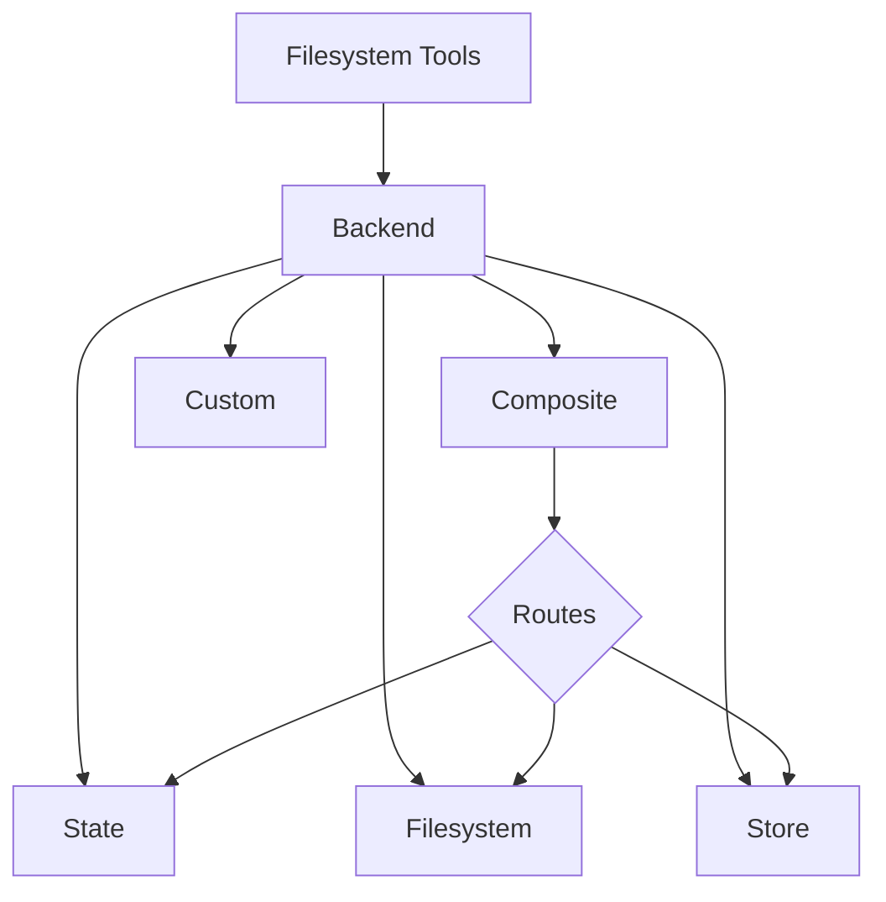

Deep agents 通过 `ls`、`read_file`、`write_file`、`edit_file`、`glob` 和 `grep` 等工具向 agent 公开文件系统接口。这些工具通过可插拔的后端运行。



本页面解释如何[选择后端](#specify-a-backend)、[将不同路径路由到不同后端](#route-to-different-backends)、[实现你自己的虚拟文件系统](#use-a-virtual-filesystem)（例如 S3 或 Postgres）、[添加策略钩子](#add-policy-hooks)，以及[遵守后端协议](#protocol-reference)。

## 快速开始

以下是一些预构建的文件系统后端，你可以快速用于你的 deep agent：

| 内置后端 | 描述 |
|---|---|
| [默认](#statebackend-ephemeral) | `agent = create_deep_agent()` <br></br> 在状态中临时存储。agent 的默认文件系统后端存储在 `langgraph` 状态中。请注意，此文件系统仅在_单个线程_中持久存在。 |
| [本地文件系统持久化](#filesystembackend-local-disk) | `agent = create_deep_agent(backend=FilesystemBackend(root_dir="/Users/nh/Desktop/"))` <br></br>这使 deep agent 能够访问你本地机器的文件系统。你可以指定 agent 有权访问的根目录。请注意，任何提供的 `root_dir` 必须是绝对路径。 |
| [持久化存储 (LangGraph store)](#storebackend-langgraph-store) | `agent = create_deep_agent(backend=lambda rt: StoreBackend(rt))` <br></br>这使 agent 能够访问_跨线程持久化_的长期存储。这非常适合存储适用于多次执行的 agent 的长期记忆或指令。 |
| [组合](#compositebackend-router) | 默认临时存储，`/memories/` 持久化。Composite 后端具有最大的灵活性。你可以指定文件系统中的不同路由指向不同的后端。请参阅下面的 Composite 路由以获取可直接使用的示例。 |


## 内置后端

### StateBackend（临时）


```typescript
import { createDeepAgent, StateBackend } from "deepagents";

// By default we provide a StateBackend
const agent = createDeepAgent();

// Under the hood, it looks like
const agent2 = createDeepAgent({
  backend: (rt) => new StateBackend(rt),   // Note that the tools access State through the runtime.state
});
```


**工作原理：**
- 将文件存储在当前线程的 LangGraph agent 状态中。
- 通过检查点在同一线程的多个 agent 轮次中持久存在。

**最适合：**
- agent 用来写入中间结果的草稿板。
- 自动驱逐大型工具输出，agent 可以随后逐片读回。

请注意，此后端在主管 agent 和子 agent 之间共享，子 agent 写入的任何文件即使在该子 agent 执行完成后也会保留在 LangGraph agent 状态中。这些文件将继续对主管 agent 和其他子 agent 可用。

### FilesystemBackend（本地磁盘）

<Warning>
此后端授予 agent 直接的文件系统读/写访问权限。
请谨慎使用，仅在适当的环境中使用。

**适当的用例：**
- 本地开发 CLI（编码助手、开发工具）
- CI/CD 管道（请参阅下面的安全注意事项）

**不适当的用例：**
- Web 服务器或 HTTP API - 改用 `StateBackend`、`StoreBackend` 或 `SandboxBackend`

**安全风险：**
- Agent 可以读取任何可访问的文件，包括秘密（API 密钥、凭证、`.env` 文件）
- 结合网络工具，秘密可能通过 SSRF 攻击被泄露
- 文件修改是永久性且不可逆的

**建议的保护措施：**
1. 启用[人机协作 (HITL) 中间件](/oss/javascript/deepagents/human-in-the-loop)来审查敏感操作。
1. 从可访问的文件系统路径中排除秘密（尤其是在 CI/CD 中）。
1. 对需要文件系统交互的生产环境使用 `SandboxBackend`。
1. **始终**将 `virtual_mode=True` 与 `root_dir` 一起使用，以启用基于路径的访问限制（阻止 `..`、`~` 和根目录外的绝对路径）。
   请注意，默认值（`virtual_mode=False`）即使设置了 `root_dir` 也不提供任何安全性。
</Warning>


```typescript
import { createDeepAgent, FilesystemBackend } from "deepagents";

const agent = createDeepAgent({
  backend: new FilesystemBackend({ rootDir: ".", virtualMode: true }),
});
```


**工作原理：**
- 在可配置的 `root_dir` 下读/写真实文件。
- 你可以选择设置 `virtual_mode=True` 来沙箱化和规范化 `root_dir` 下的路径。
- 使用安全的路径解析，在可能的情况下防止不安全的符号链接遍历，可以使用 ripgrep 进行快速 `grep`。

**最适合：**
- 你机器上的本地项目
- CI 沙箱
- 挂载的持久卷

### StoreBackend（LangGraph store）


```typescript
import { createDeepAgent, StoreBackend } from "deepagents";
import { InMemoryStore } from "@langchain/langgraph";

const store = new InMemoryStore()
const agent = createDeepAgent({
  backend: (rt) => new StoreBackend(rt),
  store
});
```


**工作原理：**
- 将文件存储在运行时提供的 LangGraph [`BaseStore`](https://reference.langchain.com/javascript/classes/_langchain_langgraph-checkpoint.BaseStore.html) 中，实现跨线程的持久存储。

**最适合：**
- 当你已经使用配置好的 LangGraph store 运行时（例如，Redis、Postgres 或 [`BaseStore`](https://reference.langchain.com/javascript/classes/_langchain_langgraph-checkpoint.BaseStore.html) 背后的云实现）。
- 当你通过 LangSmith Deployment 部署 agent 时（会自动为你的 agent 配置一个 store）。


### CompositeBackend（路由器）


```typescript
import { createDeepAgent, CompositeBackend, StateBackend, StoreBackend } from "deepagents";
import { InMemoryStore } from "@langchain/langgraph";

const compositeBackend = (rt) => new CompositeBackend(
  new StateBackend(rt),
  {
    "/memories/": new StoreBackend(rt),
  }
);

const store = new InMemoryStore()
const agent = createDeepAgent({ backend: compositeBackend, store });
```


**工作原理：**
- 根据路径前缀将文件操作路由到不同的后端。
- 在列表和搜索结果中保留原始路径前缀。

**最适合：**
- 当你想给你的 agent 提供临时和跨线程存储时，`CompositeBackend` 允许你同时提供 `StateBackend` 和 `StoreBackend`
- 当你有多个信息源想要作为单个文件系统的一部分提供给你的 agent 时。
    - 例如，你在一个 Store 的 `/memories/` 下存储了长期记忆，同时你还有一个自定义后端，在 /docs/ 下提供可访问的文档。

## 指定后端

- 将后端传递给 `create_deep_agent(backend=...)`。文件系统中间件将其用于所有工具。
- 你可以传递：
    - 实现 `BackendProtocol` 的实例（例如 `FilesystemBackend(root_dir=".")`），或
    - 工厂函数 `BackendFactory = Callable[[ToolRuntime], BackendProtocol]`（用于需要运行时的后端，如 `StateBackend` 或 `StoreBackend`）。
- 如果省略，默认值为 `lambda rt: StateBackend(rt)`。


## 路由到不同后端

将命名空间的部分路由到不同的后端。常用于持久化 `/memories/*` 并保持其他所有内容为临时的。


```typescript
import { createDeepAgent, CompositeBackend, FilesystemBackend, StateBackend } from "deepagents";

const compositeBackend = (rt) => new CompositeBackend(
  new StateBackend(rt),
  {
    "/memories/": new FilesystemBackend({ rootDir: "/deepagents/myagent", virtualMode: true }),
  },
);

const agent = createDeepAgent({ backend: compositeBackend });
```


行为：
- `/workspace/plan.md` → `StateBackend`（临时）
- `/memories/agent.md` → `/deepagents/myagent` 下的 `FilesystemBackend`
- `ls`、`glob`、`grep` 聚合结果并显示原始路径前缀。

注意：
- 较长的前缀优先（例如，路由 `"/memories/projects/"` 可以覆盖 `"/memories/"`）。
- 对于 StoreBackend 路由，确保 agent 运行时提供 store（`runtime.store`）。

## 使用虚拟文件系统

构建自定义后端将远程或数据库文件系统（例如 S3 或 Postgres）投影到工具命名空间中。

设计指南：

- 路径是绝对的（`/x/y.txt`）。决定如何将它们映射到你的存储键/行。
- 高效实现 `ls_info` 和 `glob_info`（在可用的情况下进行服务器端列表，否则进行本地过滤）。
- 对于缺失的文件或无效的正则表达式模式，返回用户可读的错误字符串。
- 对于外部持久化，在结果中设置 `files_update=None`；只有状态内后端应该返回 `files_update` 字典。

S3 风格大纲：


Postgres 风格大纲：

- 表 `files(path text primary key, content text, created_at timestamptz, modified_at timestamptz)`
- 将工具操作映射到 SQL：
  - `ls_info` 使用 `WHERE path LIKE $1 || '%'`
  - `glob_info` 在 SQL 中过滤或先获取然后在 Python 中应用 glob
  - `grep_raw` 可以按扩展名或最后修改时间获取候选行，然后扫描行

## 添加策略钩子

通过子类化或包装后端来强制执行企业规则。

阻止在选定前缀下的写入/编辑（子类）：


通用包装器（适用于任何后端）：


## 协议参考

后端必须实现 `BackendProtocol`。

必需的端点：
- `ls_info(path: str) -> list[FileInfo]`
  - 返回至少包含 `path` 的条目。在可用时包含 `is_dir`、`size`、`modified_at`。按 `path` 排序以获得确定性输出。
- `read(file_path: str, offset: int = 0, limit: int = 2000) -> str`
  - 返回带编号的内容。对于缺失的文件，返回 `"Error: File '/x' not found"`。
- `grep_raw(pattern: str, path: Optional[str] = None, glob: Optional[str] = None) -> list[GrepMatch] | str`
  - 返回结构化匹配。对于无效的正则表达式，返回类似 `"Invalid regex pattern: ..."` 的字符串（不要抛出异常）。
- `glob_info(pattern: str, path: str = "/") -> list[FileInfo]`
  - 将匹配的文件作为 `FileInfo` 条目返回（如果没有则返回空列表）。
- `write(file_path: str, content: str) -> WriteResult`
  - 仅创建。在冲突时，返回 `WriteResult(error=...)`。成功时，设置 `path`，对于状态后端设置 `files_update={...}`；外部后端应使用 `files_update=None`。
- `edit(file_path: str, old_string: str, new_string: str, replace_all: bool = False) -> EditResult`
  - 强制 `old_string` 的唯一性，除非 `replace_all=True`。如果未找到，返回错误。成功时包含 `occurrences`。

支持类型：
- `WriteResult(error, path, files_update)`
- `EditResult(error, path, files_update, occurrences)`
- `FileInfo` 包含字段：`path`（必需），可选 `is_dir`、`size`、`modified_at`。
- `GrepMatch` 包含字段：`path`、`line`、`text`。

---

<Callout icon="pen-to-square" iconType="regular">
    [Edit this page on GitHub](https://github.com/langchain-ai/docs/edit/main/src/oss/deepagents/backends.mdx) or [file an issue](https://github.com/langchain-ai/docs/issues/new/choose).
</Callout>
<Tip icon="terminal" iconType="regular">
    [Connect these docs](/use-these-docs) to Claude, VSCode, and more via MCP for real-time answers.
</Tip>
<div class='fixed right-2 bg-white bottom-2'></div>