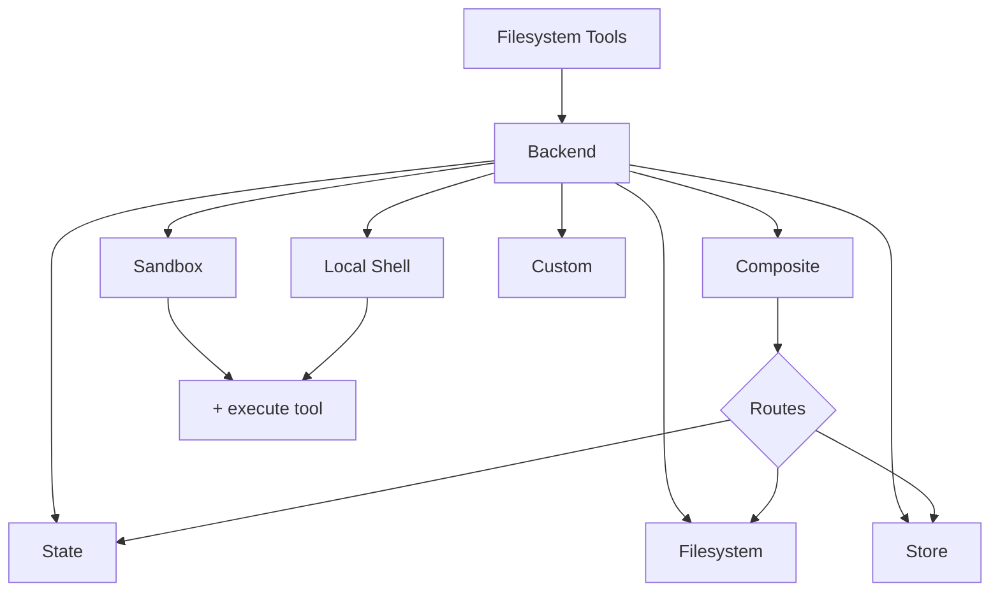

import BackendState from '/snippets/backend-state.mdx';
import BackendFilesystem from '/snippets/backend-filesystem.mdx';
import BackendLocalShell from '/snippets/backend-local-shell.mdx';
import BackendStore from '/snippets/backend-store.mdx';
import BackendComposite from '/snippets/backend-composite.mdx';

Deep agents 通过 `ls`、`read_file`、`write_file`、`edit_file`、`glob` 和 `grep` 等工具向 agent 暴露文件系统表面。这些工具通过可插拔的后端运行。`read_file` 工具原生支持所有后端上的图像文件（`.png`、`.jpg`、`.jpeg`、`.gif`、`.webp`），将其作为多模态内容块返回。

沙盒和 `LocalShellBackend` 还提供 `execute` 工具。



本页面介绍了如何 [选择后端](#specify-a-backend)、[将不同路径路由到不同后端](#route-to-different-backends)、[实现自己的虚拟文件系统](#use-a-virtual-filesystem)（例如 S3 或 Postgres）、[添加策略钩子](#add-policy-hooks) 以及 [遵守后端协议](#protocol-reference)。

## 快速开始

以下是一些预构建的文件系统后端，您可以快速将其与 deep agent 一起使用：

| 内置后端 | 描述 |
|---|---|
| [默认](#statebackend-ephemeral) | `agent = create_deep_agent()` <br></br> 状态是临时的。agent 的默认文件系统后端存储在 `langgraph` 状态中。请注意，此文件系统仅 _在单个线程中_ 持久化。 |
| [本地文件系统持久化](#filesystembackend-local-disk) | `agent = create_deep_agent(backend=FilesystemBackend(root_dir="/Users/nh/Desktop/"))` <br></br>这使 deep agent 可以访问您本地机器的文件系统。您可以指定 agent 有权访问的根目录。请注意，提供的任何 `root_dir` 必须是绝对路径。 |
| [持久存储 (LangGraph store)](#storebackend-langgraph-store) | `agent = create_deep_agent(backend=lambda rt: StoreBackend(rt))` <br></br>这使 agent 可以访问 _跨线程持久化_ 的长期存储。这非常适合存储适用于 agent 多次执行的长期记忆或指令。 |
| [沙盒](/oss/javascript/deepagents/sandboxes) | `agent = create_deep_agent(backend=sandbox)` <br></br>在隔离环境中执行代码。沙盒提供文件系统工具以及用于运行 shell 命令的 `execute` 工具。可选择 Modal、Daytona、Deno 或本地 VFS。 |
| [本地 Shell](#localshellbackend-local-shell) | `agent = create_deep_agent(backend=LocalShellBackend(root_dir=".", env={"PATH": "/usr/bin:/bin"}))` <br></br>直接在主机上进行文件系统和 shell 执行。无隔离——仅在受控开发环境中使用。请参阅下面的 [安全注意事项](#local-shell)。 |
| [复合后端](#compositebackend-router) | 默认为临时，`/memories/` 持久化。复合后端最为灵活。您可以指定文件系统中的不同路由指向不同的后端。请参阅下面的复合路由以获取可粘贴的示例。 |


## 内置后端

### StateBackend (临时)

<BackendState />

**工作原理：**
- 将当前线程的文件存储在 LangGraph agent 状态中。
- 通过检查点在同一线程上的多个 agent 轮次中持久化。

**最适合：**
- 作为 agent 编写中间结果的暂存板。
- 自动驱逐大型工具输出，agent 随后可以逐块读取这些输出。

请注意，此后端在主管 agent 和子 agent 之间共享，子 agent 写入的任何文件都将保留在 LangGraph agent 状态中，即使在该子 agent 执行完成后也是如此。这些文件将继续可供主管 agent 和其他子 agent 使用。

### FilesystemBackend (本地磁盘)

<Warning>
此后端授予 agent 直接的文件系统读/写访问权限。
请仅在适当的环境中谨慎使用。

**适当的用例：**
- 本地开发 CLI（编码助手、开发工具）
- CI/CD 管道（请参阅下面的安全注意事项）

**不适当的用例：**
- Web 服务器或 HTTP API - 请改用 `StateBackend`、`StoreBackend` 或 [沙盒后端](/oss/javascript/deepagents/sandboxes)

**安全风险：**
- Agent 可以读取任何可访问的文件，包括机密（API 密钥、凭据、`.env` 文件）
- 结合网络工具，机密可能会通过 SSRF 攻击泄露
- 文件修改是永久且不可逆的

**建议的保障措施：**
1. 启用 [人机交互 (HITL) 中间件](/oss/javascript/deepagents/human-in-the-loop) 以审查敏感操作。
1. 从可访问的文件系统路径中排除机密（尤其是在 CI/CD 中）。
1. 对需要文件系统交互的生产环境使用 [沙盒后端](/oss/javascript/deepagents/sandboxes)。
1. **始终** 将 `virtual_mode=True` 与 `root_dir` 一起使用，以启用基于路径的访问限制（阻止 `..`、`~` 和根目录之外的绝对路径）。
   请注意，默认情况下（`virtual_mode=False`），即使设置了 `root_dir` 也不提供任何安全性。
</Warning>

<BackendFilesystem />

**工作原理：**
- 读取/写入可配置 `root_dir` 下的真实文件。
- 您可以选择设置 `virtual_mode=True` 以沙盒化并规范化 `root_dir` 下的路径。
- 使用安全路径解析，在可能的情况下防止不安全的符号链接遍历，可以使用 ripgrep 进行快速 `grep`。

**最适合：**
- 本地机器上的本地项目
- CI 沙盒
- 挂载的持久卷

### LocalShellBackend (本地 Shell)

<Warning>
此后端授予 agent 直接的文件系统读/写访问权限 **以及** 主机上不受限制的 shell 执行权限。
请仅在适当的环境中极其谨慎地使用。

**适当的用例：**
- 本地开发 CLI（编码助手、开发工具）
- 您信任 agent 代码的个人开发环境
- 具有适当机密管理的 CI/CD 管道

**不适当的用例：**
- 生产环境（例如 Web 服务器、API、多租户系统）
- 处理不受信任的用户输入或执行不受信任的代码

**安全风险：**
- Agent 可以使用您用户的权限执行 **任意 shell 命令**
- Agent 可以读取任何可访问的文件，包括机密（API 密钥、凭据、`.env` 文件）
- 机密可能会暴露
- 文件修改和命令执行是 **永久且不可逆的**
- 命令直接在您的主机系统上运行
- 命令可能会消耗无限的 CPU、内存、磁盘

**建议的保障措施：**
1. 启用 [人机交互 (HITL) 中间件](/oss/javascript/deepagents/human-in-the-loop) 以在执行前审查并批准操作。这被 **强烈推荐**。
2. 仅在专用开发环境中运行。切勿在共享或生产系统上使用。
3. 对需要 shell 执行的生产环境使用 [沙盒后端](/oss/javascript/deepagents/sandboxes)。

**注意：** `virtual_mode=True` 在启用 shell 访问时无法提供安全性，因为命令可以访问系统上的任何路径。
</Warning>

<BackendLocalShell />

**工作原理：**
- 使用 `execute` 工具扩展 `FilesystemBackend`，以便在主机上运行 shell 命令。
- 使用 `subprocess.run(shell=True)` 直接在您的机器上运行命令，没有沙盒。
- 支持 `timeout`（默认 120s）、`max_output_bytes`（默认 100,000）、`env` 和用于环境变量的 `inherit_env`。
- Shell 命令使用 `root_dir` 作为工作目录，但可以访问系统上的任何路径。

**最适合：**
- 本地编码助手和开发工具
- 开发期间的快速迭代（当您信任 agent 时）

### StoreBackend (LangGraph store)

<BackendStore />

**工作原理：**
- 将文件存储在运行时提供的 LangGraph [`BaseStore`](https://reference.langchain.com/javascript/langchain-core/stores/BaseStore) 中，实现跨线程持久存储。

**最适合：**
- 当您已经在配置了 LangGraph store 的情况下运行（例如 Redis、Postgres 或 [`BaseStore`](https://reference.langchain.com/javascript/langchain-core/stores/BaseStore) 之后的云实现）。
- 当您通过 LangSmith Deployment 部署 agent 时（会自动为您的 agent 配置 store）。


### CompositeBackend (路由器)

<BackendComposite />

**工作原理：**
- 根据路径前缀将文件操作路由到不同的后端。
- 在列表和搜索结果中保留原始路径前缀。

**最适合：**
- 当您想同时为 agent 提供临时和跨线程存储时，`CompositeBackend` 允许您同时提供 `StateBackend` 和 `StoreBackend`
- 当您有多个信息源想作为单个文件系统提供给 agent 时。
    - 例如，您在一个 Store 中的 `/memories/` 下存储了长期记忆，并且您还有一个自定义后端，可以通过 /docs/ 访问文档。

## 指定后端

- 将后端传递给 `create_deep_agent(backend=...)`。文件系统中间件将其用于所有工具。
- 您可以传递：
    - 实现 `BackendProtocol` 的实例（例如 `FilesystemBackend(root_dir=".")`），或
    - 一个工厂 `BackendFactory = Callable[[ToolRuntime], BackendProtocol]`（用于需要运行时的后端，如 `StateBackend` 或 `StoreBackend`）。
- 如果省略，默认为 `lambda rt: StateBackend(rt)`。


## 路由到不同的后端

将命名空间的部分路由到不同的后端。通常用于持久化 `/memories/*` 并保持其他所有内容为临时状态。


```typescript
import { createDeepAgent, CompositeBackend, FilesystemBackend, StateBackend } from "deepagents";

const compositeBackend = (rt) => new CompositeBackend(
  new StateBackend(rt),
  {
    "/memories/": new FilesystemBackend({ rootDir: "/deepagents/myagent", virtualMode: true }),
  },
);

const agent = createDeepAgent({ backend: compositeBackend });
```


行为：
- `/workspace/plan.md` → `StateBackend` (临时)
- `/memories/agent.md` → `FilesystemBackend` 位于 `/deepagents/myagent` 下
- `ls`、`glob`、`grep` 聚合结果并显示原始路径前缀。

注意：
- 较长的前缀优先（例如，路由 `"/memories/projects/"` 可以覆盖 `"/memories/"`）。
- 对于 StoreBackend 路由，确保存储运行时提供 store (`runtime.store`)。

## 使用虚拟文件系统

构建自定义后端以将远程或数据库文件系统（例如 S3 或 Postgres）投影到工具命名空间中。

设计指南：

- 路径是绝对路径 (`/x/y.txt`)。决定如何将其映射到您的存储键/行。
- 高效实现 `ls_info` 和 `glob_info`（在可用的情况下进行服务端列表，否则进行本地过滤）。
- 对丢失的文件或无效的正则表达式模式返回用户可读的错误字符串。
- 对于外部持久化，在结果中设置 `files_update=None`；只有状态内后端才应返回 `files_update` 字典。

S3 风格大纲：


Postgres 风格大纲：

- 表 `files(path text primary key, content text, created_at timestamptz, modified_at timestamptz)`
- 将工具操作映射到 SQL：
  - `ls_info` 使用 `WHERE path LIKE $1 || '%'`
  - `glob_info` 在 SQL 中过滤或获取后在 Python 中应用 glob
  - `grep_raw` 可以通过扩展名或最后修改时间获取候选行，然后扫描行

## 添加策略钩子

通过子类化或包装后端来强制执行企业规则。

阻止所选前缀下的写入/编辑（子类化）：


通用包装器（适用于任何后端）：


## 协议参考

后端必须实现 `BackendProtocol`。

必需的端点：
- `ls_info(path: str) -> list[FileInfo]`
  - 返回至少包含 `path` 的条目。可用时包括 `is_dir`、`size`、`modified_at`。按 `path` 排序以获得确定性输出。
- `read(file_path: str, offset: int = 0, limit: int = 2000) -> str`
  - 返回带编号的内容。文件丢失时，返回 `"Error: File '/x' not found"`。
- `grep_raw(pattern: str, path: Optional[str] = None, glob: Optional[str] = None) -> list[GrepMatch] | str`
  - 返回结构化匹配项。对于无效的正则表达式，返回类似 `"Invalid regex pattern: ..."` 的字符串（不要引发异常）。
- `glob_info(pattern: str, path: str = "/") -> list[FileInfo]`
  - 将匹配的文件作为 `FileInfo` 条目返回（如果无则为空列表）。
- `write(file_path: str, content: str) -> WriteResult`
  - 仅创建。发生冲突时，返回 `WriteResult(error=...)`。成功时，设置 `path`，对于状态后端设置 `files_update={...}`；外部后端应使用 `files_update=None`。
- `edit(file_path: str, old_string: str, new_string: str, replace_all: bool = False) -> EditResult`
  - 除非 `replace_all=True`，否则强制 `old_string` 的唯一性。如果未找到，返回错误。成功时包括 `occurrences`。

支持类型：
- `WriteResult(error, path, files_update)`
- `EditResult(error, path, files_update, occurrences)`
- `FileInfo` 包含字段：`path`（必需），可选 `is_dir`、`size`、`modified_at`。
- `GrepMatch` 包含字段：`path`、`line`、`text`。

---

<div className="source-links">
<Callout icon="edit">
    [在 GitHub 上编辑此页面](https://github.com/langchain-ai/docs/edit/main/src/oss/deepagents/backends.mdx) 或 [提交 issue](https://github.com/langchain-ai/docs/issues/new/choose).
</Callout>
<Callout icon="terminal-2">
    [将这些文档连接](/use-these-docs) 到 Claude、VSCode 以及更多通过 MCP 获取实时答案的工具。
</Callout>
</div>
