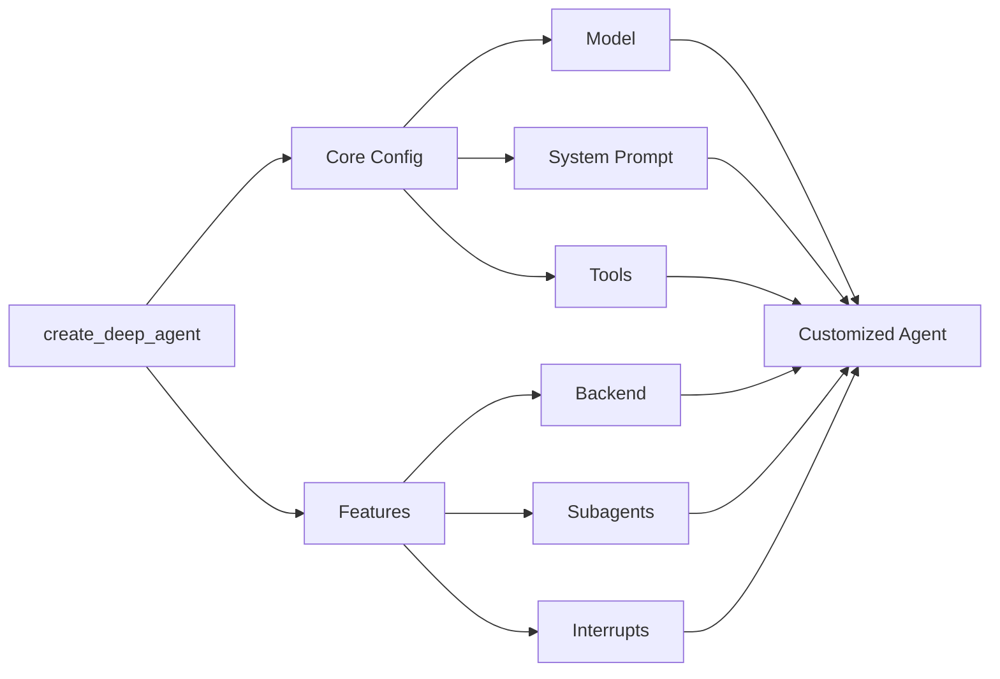

## 模型

默认情况下，`deepagents` 使用 [`claude-sonnet-4-5-20250929`](https://platform.claude.com/docs/en/about-claude/models/overview)。你可以通过传递任何支持的<Tooltip tip="遵循 `provider:model` 格式的字符串（例如 openai:gpt-5）" cta="查看映射" href="https://reference.langchain.com/python/langchain/models/#langchain.chat_models.init_chat_model(model)">模型标识符字符串</Tooltip>或 [LangChain 模型对象](/oss/javascript/integrations/chat)来自定义使用的模型。

<Tip>
    使用 `provider:model` 格式（例如 `openai:gpt-5`）在模型之间快速切换。
</Tip>


```typescript
import { ChatAnthropic } from "@langchain/anthropic";
import { ChatOpenAI } from "@langchain/openai";
import { createDeepAgent } from "deepagents";

// Using Anthropic
const agent = createDeepAgent({
  model: new ChatAnthropic({
    model: "claude-sonnet-4-20250514",
    temperature: 0,
  }),
});

// Using OpenAI
const agent2 = createDeepAgent({
  model: new ChatOpenAI({
    model: "gpt-5",
    temperature: 0,
  }),
});
```


## 系统提示

Deep agents 配备了一个受 Claude Code 系统提示启发的内置系统提示。默认系统提示包含使用内置规划工具、文件系统工具和子 agent 的详细指令。

针对特定用例定制的每个 deep agent 都应包含针对该用例的自定义系统提示。


```typescript
import { createDeepAgent } from "deepagents";

const researchInstructions = `You are an expert researcher. Your job is to conduct thorough research, and then write a polished report.`;

const agent = createDeepAgent({
  systemPrompt: researchInstructions,
});
```


## 工具

除了你提供的自定义工具外，deep agents 还包括用于规划、文件管理和子 agent 生成的[内置工具](/oss/javascript/deepagents/overview#core-capabilities)。


```typescript
import { tool } from "langchain";
import { TavilySearch } from "@langchain/tavily";
import { createDeepAgent } from "deepagents";
import { z } from "zod";

const internetSearch = tool(
  async ({
    query,
    maxResults = 5,
    topic = "general",
    includeRawContent = false,
  }: {
    query: string;
    maxResults?: number;
    topic?: "general" | "news" | "finance";
    includeRawContent?: boolean;
  }) => {
    const tavilySearch = new TavilySearch({
      maxResults,
      tavilyApiKey: process.env.TAVILY_API_KEY,
      includeRawContent,
      topic,
    });
    return await tavilySearch._call({ query });
  },
  {
    name: "internet_search",
    description: "Run a web search",
    schema: z.object({
      query: z.string().describe("The search query"),
      maxResults: z.number().optional().default(5),
      topic: z
        .enum(["general", "news", "finance"])
        .optional()
        .default("general"),
      includeRawContent: z.boolean().optional().default(false),
    }),
  },
);

const agent = createDeepAgent({
  tools: [internetSearch],
});
```


## 技能

你可以使用[技能](/oss/javascript/deepagents/overview)为你的 deep agent 提供新的能力和专业知识。
虽然[工具](/oss/javascript/deepagents/customization#tools)倾向于涵盖较低级别的功能，如原生文件系统操作或规划，但技能可以包含有关如何完成任务的详细指令、参考信息和其他资源，如模板。
这些文件仅在 agent 确定该技能对当前提示有用时才会加载。
这种渐进式披露减少了 agent 在启动时需要考虑的 token 和上下文的数量。

有关示例技能，请参阅 [Deep Agent 示例技能](https://github.com/langchain-ai/deepagentsjs/tree/main/examples/skills)。

要向你的 deep agent 添加技能，请将它们作为参数传递给 `create_deep_agent`：


<Tabs>
  <Tab title="StateBackend">

    ```typescript
    import { createDeepAgent, type FileData } from "deepagents";
    import { MemorySaver, Command } from "@langchain/langgraph";
    import { createInterface } from "node:readline/promises";
    import { stdin as input, stdout as output } from "node:process";

    const checkpointer = new MemorySaver();

    function createFileData(content: string): FileData {
    const now = new Date().toISOString();
    return {
        content: content.split("\n"),
        created_at: now,
        modified_at: now,
    };
    }

    const skillsFiles: Record<string, FileData> = {};

    const skillUrl =
    "https://raw.githubusercontent.com/langchain-ai/deepagentsjs/refs/heads/main/examples/skills/langgraph-docs/SKILL.md";
    const response = await fetch(skillUrl);
    const skillContent = await response.text();

    skillsFiles["/skills/langgraph-docs/SKILL.md"] = createFileData(skillContent);

    const agent = await createDeepAgent({
    checkpointer,
    // IMPORTANT: deepagents skill source paths are virtual (POSIX) paths relative to the backend root.
    skills: ["/skills/"],
    });

    const config = {
    configurable: {
        thread_id: `thread-${Date.now()}`,
    },
    };

    let result = await agent.invoke(
    {
        messages: [
        {
            role: "user",
            content: "what is langraph? Use the langgraph-docs skill if available.",
        },
        ],
        files: skillsFiles,
    } as any,
    config
    );
    ```

  </Tab>
  <Tab title="StoreBackend">

    ```typescript
    import { createDeepAgent, StoreBackend, type FileData } from "deepagents";
    import {
    InMemoryStore,
    MemorySaver,
    type BaseStore,
    } from "@langchain/langgraph";

    const checkpointer = new MemorySaver();
    const store = new InMemoryStore();

    function createFileData(content: string): FileData {
    const now = new Date().toISOString();
    return {
        content: content.split("\n"),
        created_at: now,
        modified_at: now,
    };
    }

    const skillUrl =
    "https://raw.githubusercontent.com/langchain-ai/deepagentsjs/refs/heads/main/examples/skills/langgraph-docs/SKILL.md";

    const response = await fetch(skillUrl);
    const skillContent = await response.text();
    const fileData = createFileData(skillContent);

    await store.put(["filesystem"], "/skills/langgraph-docs/SKILL.md", fileData);

    const backendFactory = (config: { state: unknown; store?: BaseStore }) => {
    return new StoreBackend({
        state: config.state,
        store: config.store ?? store,
    });
    };

    const agent = await createDeepAgent({
    backend: backendFactory,
    store: store,
    checkpointer,
    // IMPORTANT: deepagents skill source paths are virtual (POSIX) paths relative to the backend root.
    skills: ["/skills/"],
    });

    const config = {
    configurable: {
        thread_id: `thread-${Date.now()}`,
    },
    };

    let result = await agent.invoke(
    {
        messages: [
        {
            role: "user",
            content: "what is langraph? Use the langgraph-docs skill if available.",
        },
        ],
    },
    config
    );
    ```

  </Tab>
  <Tab title="FilesystemBackend">

    ```typescript
    import {
    createDeepAgent,
    createSkillsMiddleware,
    createSettings,
    FilesystemBackend,
    } from "deepagents";
    import { MemorySaver } from "@langchain/langgraph";

    const settings = createSettings({
    });

    const agent = await createDeepAgent({
    backend: (config) =>
        new FilesystemBackend({ rootDir: "/Users/user/{project}" }),
    skills: [path.join(process.cwd(), ".deepagents/skills")],
    interruptOn: {
        read_file: true,
        write_file: true,
        delete_file: true,
    },
    checkpointer, // Required!
    });

    const config = {
    configurable: {
        thread_id: `thread-${Date.now()}`,
    },
    };

    let result = await agent.invoke(
    {
        messages: [
        {
            role: "user",
            content: "what is langraph? Use the langgraph-docs skill if available.",
        },
        ]
    } as any,
    config
    );
    ```

  </Tab>
</Tabs>


## 记忆

使用 [`AGENTS.md` 文件](https://agents.md/)为你的 deep agent 提供额外的上下文。

在创建 deep agent 时，你可以将一个或多个文件路径传递给 `memory` 参数：


<Tabs>
  <Tab title="StateBackend">
    ```typescript
    import { createDeepAgent, type FileData } from "deepagents";
    import { MemorySaver } from "@langchain/langgraph";

    const AGENTS_MD_URL =
    "https://raw.githubusercontent.com/langchain-ai/deepagents/refs/heads/master/examples/text-to-sql-agent/AGENTS.md";

    async function fetchText(url: string): Promise<string> {
    const res = await fetch(url);
    if (!res.ok) {
        throw new Error(`Failed to fetch ${url}: ${res.status} ${res.statusText}`);
    }
    return await res.text();
    }

    const agentsMd = await fetchText(AGENTS_MD_URL);
    const checkpointer = new MemorySaver();

    function createFileData(content: string): FileData {
    const now = new Date().toISOString();
    return {
        content: content.split("\n"),
        created_at: now,
        modified_at: now,
    };
    }

    const agent = await createDeepAgent({
    memory: ["/AGENTS.md"],
    checkpointer: checkpointer,
    });

    const result = await agent.invoke(
    {
        messages: [
        {
            role: "user",
            content: "Please tell me what's in your memory files.",
        },
        ],
        // Seed the default StateBackend's in-state filesystem (virtual paths must start with "/").
        files: { "/AGENTS.md": createFileData(agentsMd) },
    } as any,
    { configurable: { thread_id: "12345" } }
    );
    ```
  </Tab>
  <Tab title="StoreBackend">
    ```typescript
    import { createDeepAgent, StoreBackend, type FileData } from "deepagents";
    import {
    InMemoryStore,
    MemorySaver,
    type BaseStore,
    } from "@langchain/langgraph";

    const AGENTS_MD_URL =
    "https://raw.githubusercontent.com/langchain-ai/deepagents/refs/heads/master/examples/text-to-sql-agent/AGENTS.md";

    async function fetchText(url: string): Promise<string> {
    const res = await fetch(url);
    if (!res.ok) {
        throw new Error(`Failed to fetch ${url}: ${res.status} ${res.statusText}`);
    }
    return await res.text();
    }

    const agentsMd = await fetchText(AGENTS_MD_URL);

    function createFileData(content: string): FileData {
    const now = new Date().toISOString();
    return {
        content: content.split("\n"),
        created_at: now,
        modified_at: now,
    };
    }

    const store = new InMemoryStore();
    const fileData = createFileData(agentsMd);
    await store.put(["filesystem"], "/AGENTS.md", fileData);

    const checkpointer = new MemorySaver();

    const backendFactory = (config: { state: unknown; store?: BaseStore }) => {
    return new StoreBackend({
        state: config.state,
        store: config.store ?? store,
    });
    };

    const agent = await createDeepAgent({
    backend: backendFactory,
    store: store,
    checkpointer: checkpointer,
    memory: ["/AGENTS.md"],
    });

    const result = await agent.invoke(
    {
        messages: [
        {
            role: "user",
            content: "Please tell me what's in your memory files.",
        },
        ],
    },
    { configurable: { thread_id: "12345" } }
    );
    ```
  </Tab>
  <Tab title="Filesystem">
    ```typescript
    import { createDeepAgent, FilesystemBackend } from "deepagents";
    import { MemorySaver } from "@langchain/langgraph";

    // Checkpointer is REQUIRED for human-in-the-loop
    const checkpointer = new MemorySaver();

    const agent = await createDeepAgent({
    backend: (config) =>
        new FilesystemBackend({ rootDir: "/Users/user/{project}" }),
    memory: ["./AGENTS.md", "./.deepagents/AGENTS.md"],
    interruptOn: {
        read_file: true,
        write_file: true,
        delete_file: true,
    },
    checkpointer, // Required!
    });
    ```
  </Tab>
</Tabs>

---

<Callout icon="pen-to-square" iconType="regular">
    [Edit this page on GitHub](https://github.com/langchain-ai/docs/edit/main/src/oss/deepagents/customization.mdx) or [file an issue](https://github.com/langchain-ai/docs/issues/new/choose).
</Callout>
<Tip icon="terminal" iconType="regular">
    [Connect these docs](/use-these-docs) to Claude, VSCode, and more via MCP for real-time answers.
</Tip>
<div class='fixed right-2 bg-white bottom-2'></div>