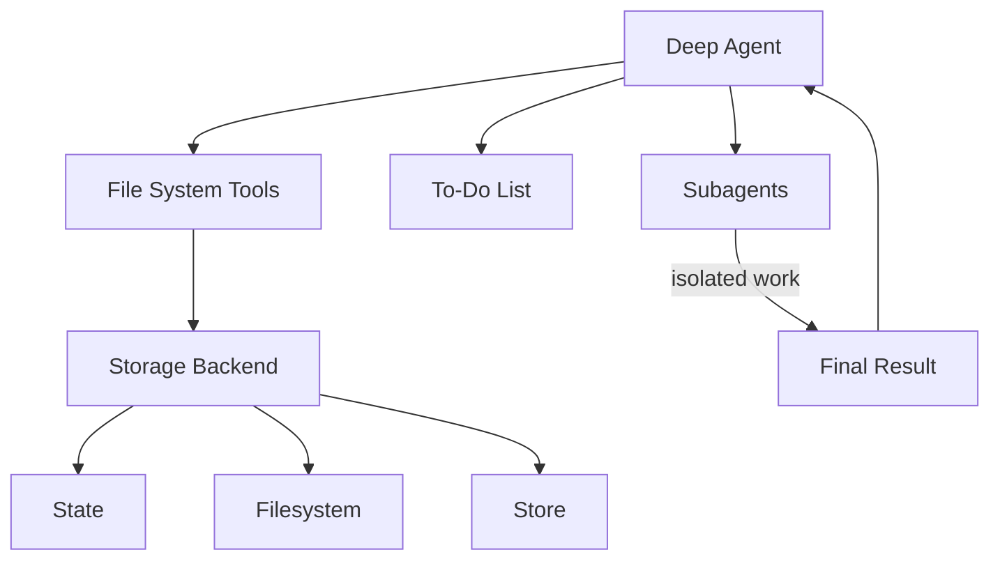

我们将 `deepagents` 视为["agent harness"](/oss/javascript/concepts/products#agent-harnesses-like-the-deep-agents-sdk)。它与其他 agent 框架具有相同的核心工具调用循环，但具有内置工具和能力。

本页面列出了组成 agent harness 的组件。

## 文件系统访问

harness 提供六个文件系统操作工具，使文件成为 agent 环境中的一等公民：

| 工具 | 描述 |
|---|---|
| `ls` | 列出目录中的文件及元数据（大小、修改时间） |
| `read_file` | 读取带行号的文件内容，支持大文件的 offset/limit |
| `write_file` | 创建新文件 |
| `edit_file` | 在文件中执行精确的字符串替换（支持全局替换模式） |
| `glob` | 查找匹配模式的文件（例如 `**/*.py`） |
| `grep` | 使用多种输出模式搜索文件内容（仅文件、带上下文的内容或计数） |

## 大型工具结果驱逐

[`FilesystemMiddleware`](/oss/javascript/deepagents/middleware) 在工具结果超过 token 阈值时自动将其驱逐到文件系统，防止上下文窗口饱和。

**工作原理：**

- 监控工具调用结果的大小（默认阈值：20,000 token，可通过 `tool_token_limit_before_evict` 配置）
- 当超过阈值时，使用配置的后端写入结果
- 用截断的预览和文件引用替换工具结果
- Agent 可以根据需要从文件系统读取完整结果

## 可插拔存储后端

harness 通过协议抽象文件系统操作，允许针对不同用例使用不同的存储策略。

**可用后端：**

1. **`StateBackend`** - 临时内存存储
    - 文件存在于 agent 的状态中（与对话一起检查点）
    - 在线程内持久存在但不跨线程
    - 适用于临时工作文件

2. **`FilesystemBackend`** - 真实文件系统访问
    - 从实际磁盘读/写
    - 支持虚拟模式（沙箱化到根目录）
    - 与系统工具集成（用于 grep 的 ripgrep）
    - 安全功能：路径验证、大小限制、符号链接防护

3. **`StoreBackend`** - 持久化跨对话存储
    - 使用 LangGraph 的 BaseStore 实现持久性
    - 按 `assistant_id` 命名空间
    - 文件跨对话持久存在
    - 适用于长期记忆或知识库

4. **`CompositeBackend`** - 将不同路径路由到不同后端
    - 示例：`/` → StateBackend，`/memories/` → StoreBackend
    - 最长前缀匹配用于路由
    - 启用混合存储策略

有关配置详情和示例，请参阅[后端](/oss/javascript/deepagents/backends)。

## 任务委托（子 agent）

harness 允许主 agent 为隔离的多步骤任务创建临时"子 agent"。

**为什么有用：**
- **上下文隔离** - 子 agent 的工作不会使主 agent 的上下文混乱
- **并行执行** - 多个子 agent 可以并发运行
- **专业化** - 子 agent 可以有不同的工具/配置
- **Token 效率** - 大型子任务上下文被压缩成单个结果

**工作原理：**
- 主 agent 有一个 `task` 工具
- 调用时，创建一个具有自己上下文的新 agent 实例
- 子 agent 自主执行直到完成
- 向主 agent 返回单个最终报告
- 子 agent 是无状态的（不能发送多条消息）

**默认子 agent：**
- "通用"子 agent 自动可用
- 默认具有文件系统工具
- 可以使用额外的工具/中间件进行自定义

**自定义子 agent：**
- 使用特定工具定义专门的子 agent
- 示例：代码审查器、网络研究员、测试运行器
- 通过 `subagents` 参数配置

## 对话历史摘要

harness 在 token 使用量过多时自动压缩旧的对话历史。

**配置：**
- 在模型 [model profile](/oss/javascript/langchain/models#model-profiles) 的 `max_input_tokens` 的 85% 时触发
- 保留 10% 的 token 作为最近上下文
- 如果模型配置文件不可用，则回退到 170,000 token 触发 / 保留 6 条消息
- 较旧的消息由模型摘要

**为什么有用：**
- 允许非常长的对话而不会达到上下文限制
- 在压缩历史记录的同时保留最近的上下文
- 对 agent 透明（显示为特殊系统消息）

## 悬空工具调用修复

harness 在工具调用在收到结果之前被中断或取消时修复消息历史。

**问题：**
- Agent 请求工具调用："请运行 X"
- 工具调用被中断（用户取消、错误等）
- Agent 在 `AIMessage` 中看到 `tool_call` 但没有对应的 `ToolMessage`
- 这创建了无效的消息序列

**解决方案：**
- 检测具有没有结果的 `tool_calls` 的 `AIMessage` 对象
- 创建合成的 `ToolMessage` 响应，指示调用已取消
- 在 agent 执行之前修复消息历史

**为什么有用：**
- 防止 agent 因不完整的消息链而混淆
- 优雅地处理中断和错误
- 保持对话连贯性

## 待办事项列表跟踪

harness 提供了一个 `write_todos` 工具，agent 可以用来维护结构化的任务列表。

**功能：**
- 使用状态（`'pending'`、`'in_progress'`、`'completed'`）跟踪多个任务
- 在 agent 状态中持久化
- 帮助 agent 组织复杂的多步骤工作
- 适用于长时间运行的任务和规划

## 人机协作

harness 可以在指定的工具调用处暂停 agent 执行，以允许人工批准或修改。此功能通过 `interrupt_on` 参数选择启用。

**配置：**
- 将 `interrupt_on` 传递给 `create_deep_agent`，并提供工具名称到中断配置的映射
- 示例：`interrupt_on={"edit_file": True}` 在每次编辑前暂停
- 可以提供批准消息或修改工具输入

**为什么有用：**
- 破坏性操作的安全门
- 在昂贵的 API 调用之前进行用户验证
- 交互式调试和指导

## 提示缓存（Anthropic）

harness 启用 Anthropic 的提示缓存功能，以减少冗余的 token 处理。

**工作原理：**
- 缓存跨轮次重复的提示部分
- 显著降低长系统提示的延迟和成本
- 非 Anthropic 模型自动跳过

**为什么有用：**
- 系统提示（尤其是带有文件系统文档的）可能超过 5k token
- 没有缓存时每轮都会重复
- 缓存提供约 10 倍的加速和成本降低

## 流式传输

harness 具有内置的流式传输功能，用于 agent 执行的实时更新。

**工作原理：**
- 使用 LangGraph 的流式传输系统来展示更新
- 从主 agent 和子 agent 进行流式传输
- 工具调用、工具结果和 LLM 响应在发生时流式传输

**为什么有用：**

- 逐步显示输出
- 审查和调试 agent 和子 agent 的工作

---

<Callout icon="pen-to-square" iconType="regular">
    [Edit this page on GitHub](https://github.com/langchain-ai/docs/edit/main/src/oss/deepagents/harness.mdx) or [file an issue](https://github.com/langchain-ai/docs/issues/new/choose).
</Callout>
<Tip icon="terminal" iconType="regular">
    [Connect these docs](/use-these-docs) to Claude, VSCode, and more via MCP for real-time answers.
</Tip>

