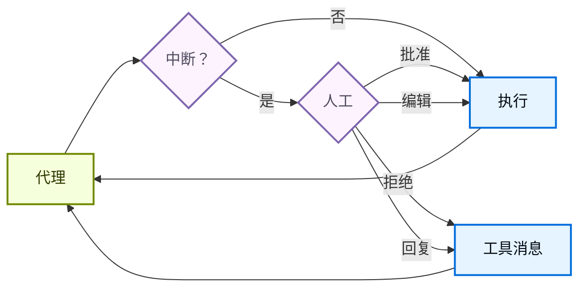

import HitlBasicConfigPy from "/snippets/hitl-basic-config-py.mdx";
import HitlBasicConfigJs from "/snippets/hitl-basic-config-js.mdx";

某些工具操作可能很敏感，需要在执行前获得人工批准。Deep Agents 通过 LangGraph 的中断功能支持Human in the Loop工作流。你可以使用 `interrupt_on` 参数配置哪些工具需要审批。


```mermaid
graph LR
    Agent[代理] --> Check{中断？}
    Check --> |否| Execute[执行]
    Check --> |是| Human{人工}

    Human --> |批准| Execute
    Human --> |编辑| Execute
    Human --> |拒绝| ToolMessage[工具消息]
    Human --> |回复| ToolMessage

    Execute --> Agent
    ToolMessage --> Agent

    classDef trigger fill:#F6FFDB,stroke:#6E8900,stroke-width:2px,color:#2E3900
    classDef process fill:#E5F4FF,stroke:#006DDD,stroke-width:2px,color:#030710
    classDef decision fill:#FDF3FF,stroke:#7E65AE,stroke-width:2px,color:#504B5F
    classDef alert fill:#F8E8E6,stroke:#B27D75,stroke-width:2px,color:#634643

    class Agent trigger
    class Check,Human decision
    class Execute process
    class ToolMessage process
```

## 基本配置

`interrupt_on` 参数接受一个字典，将工具名称映射到中断配置。每个工具可以配置为：

- **`True`**：启用中断，使用默认行为（允许批准、编辑、拒绝、回复）
- **`False`**：禁用此工具的中断
- **`{"allowed_decisions": [...]}`**：自定义配置，指定允许的决策

<HitlBasicConfigJs />

## 决策类型

`allowed_decisions` 列表控制人工在审查工具调用时可以采取的操作：

- **`"approve"`**：使用代理提出的原始参数执行工具
- **`"edit"`**：在执行前修改工具参数
- **`"reject"`**：完全跳过执行此工具调用
- **`"respond"`**：将人工的消息直接作为工具结果返回，跳过执行——适用于“询问用户”风格的工具

你可以自定义每个工具可用的决策：

```typescript
const interruptOn = {
  // 敏感操作：允许所有选项
  delete_file: { allowedDecisions: ["approve", "edit", "reject"] },

  // 中等风险：仅允许批准或拒绝
  write_file: { allowedDecisions: ["approve", "reject"] },

  // 必须批准（不允许拒绝）
  critical_operation: { allowedDecisions: ["approve"] },
};
```

## 处理中断

当中断被触发时，代理会暂停执行并返回控制权。检查结果中的中断并相应处理。

```typescript
import { v7 as uuid7 } from "uuid";
import { Command } from "@langchain/langgraph";

// 创建带有 thread_id 的配置以持久化状态
const config = { configurable: { thread_id: uuid7() } };

// 调用代理
let result = await agent.invoke(
  {
    messages: [{ role: "user", content: "删除文件 temp.txt" }],
  },
  config,
);

// 检查执行是否被中断
if (result.__interrupt__) {
  // 提取中断信息
  const interrupts = result.__interrupt__[0].value;
  const actionRequests = interrupts.actionRequests;
  const reviewConfigs = interrupts.reviewConfigs;

  // 创建从工具名称到审查配置的查找映射
  const configMap = Object.fromEntries(
    reviewConfigs.map((cfg) => [cfg.actionName, cfg]),
  );

  // 向用户显示待处理的操作
  for (const action of actionRequests) {
    const reviewConfig = configMap[action.name];
    console.log(`工具: ${action.name}`);
    console.log(`参数: ${JSON.stringify(action.args)}`);
    console.log(`允许的决策: ${reviewConfig.allowedDecisions}`);
  }

  // 获取用户决策（每个 actionRequest 一个，按顺序）
  const decisions = [
    { type: "approve" }, // 用户批准了删除
  ];

  // 使用决策恢复执行
  result = await agent.invoke(
    new Command({ resume: { decisions } }),
    config, // 必须使用相同的配置！
  );
}

// 处理最终结果
console.log(result.messages[result.messages.length - 1].content);
```

## 多个工具调用

当代理调用多个需要审批的工具时，所有中断会批量包含在单个中断中。你必须按顺序为每个中断提供决策。

```typescript
const config = { configurable: { thread_id: uuid7() } };

let result = await agent.invoke(
  {
    messages: [
      {
        role: "user",
        content: "删除 temp.txt 并向 admin@example.com 发送电子邮件",
      },
    ],
  },
  config,
);

if (result.__interrupt__) {
  const interrupts = result.__interrupt__[0].value;
  const actionRequests = interrupts.actionRequests;

  // 两个工具需要审批
  console.assert(actionRequests.length === 2);

  // 按与 actionRequests 相同的顺序提供决策
  const decisions = [
    { type: "approve" }, // 第一个工具：delete_file
    { type: "reject" }, // 第二个工具：send_email
  ];

  result = await agent.invoke(new Command({ resume: { decisions } }), config);
}
```

## 编辑工具参数

当 `"edit"` 在允许的决策中时，你可以在执行前修改工具参数：

```typescript
if (result.__interrupt__) {
  const interrupts = result.__interrupt__[0].value;
  const actionRequest = interrupts.actionRequests[0];

  // 来自代理的原始参数
  console.log(actionRequest.args); // { to: "everyone@company.com", ... }

  // 用户决定编辑收件人
  const decisions = [
    {
      type: "edit",
      editedAction: {
        name: actionRequest.name, // 必须包含工具名称
        args: { to: "team@company.com", subject: "...", body: "..." },
      },
    },
  ];

  result = await agent.invoke(new Command({ resume: { decisions } }), config);
}
```

## 子代理中断

使用子代理时，你可以使用[工具调用上的中断](#工具调用上的中断)和[工具调用内的中断](#工具调用内的中断)。

### 工具调用上的中断

每个子代理可以有自己的 `interrupt_on` 配置，覆盖主代理的设置：

```typescript
const agent = createDeepAgent({
  tools: [deleteFile, readFile],
  interruptOn: {
    delete_file: true,
    read_file: false,
  },
  subagents: [
    {
      name: "file-manager",
      description: "管理文件操作",
      systemPrompt: "你是一个文件管理助手。",
      tools: [deleteFile, readFile],
      interruptOn: {
        // 覆盖：在此子代理中要求读取操作需要审批
        delete_file: true,
        read_file: true, // 与主代理不同！
      },
    },
  ],
  checkpointer,
});
```

当子代理触发中断时，处理方式相同——检查结果中的 `interrupts` 并使用 `Command` 恢复。

### 工具调用内的中断

子代理工具可以直接调用 `interrupt()` 来暂停执行并等待审批：

```typescript
import { createAgent, tool } from "langchain";
import { ChatOpenAI } from "@langchain/openai";
import { HumanMessage } from "@langchain/core/messages";
import { MemorySaver, Command, interrupt } from "@langchain/langgraph";
import { createDeepAgent } from "deepagents";
import { z } from "zod";

const requestApproval = tool(
  async ({ actionDescription }: { actionDescription: string }) => {
    const approval = interrupt({
      type: "approval_request",
      action: actionDescription,
      message: `请批准或拒绝: ${actionDescription}`,
    }) as { approved?: boolean; reason?: string };

    if (approval.approved) {
      return `操作 '${actionDescription}' 已被批准。继续执行...`;
    } else {
      return `操作 '${actionDescription}' 已被拒绝。原因: ${
        approval.reason || "未提供原因"
      }`;
    }
  },
  {
    name: "request_approval",
    description: "在继续操作前请求人工批准。",
    schema: z.object({
      actionDescription: z.string().describe("需要批准的操作"),
    }),
  },
);

async function main() {
  const checkpointer = new MemorySaver();
  const model = new ChatOpenAI({
    model: "gpt-4o-mini",
    maxTokens: 4096,
  });

  const compiledSubagent = createAgent({
    model: model,
    tools: [requestApproval],
    name: "approval-agent",
  });

  const parentAgent = await createDeepAgent({
    checkpointer: checkpointer,
    subagents: [
      {
        name: "approval-agent",
        description: "一个可以请求批准的代理",
        runnable: compiledSubagent as any,
      },
    ],
  });

  const threadId = "test_interrupt_directly";
  const config = { configurable: { thread_id: threadId } };

  console.log("调用代理 - 子代理将使用 request_approval 工具...");

  let result = await parentAgent.invoke(
    {
      messages: [
        new HumanMessage({
          content:
            "使用 task 工具启动 approval-agent 子代理。" +
            "告诉它使用 request_approval 工具请求批准 '部署到生产环境'。",
        }),
      ],
    },
    config,
  );

  if (result.__interrupt__) {
    const interruptValue = result.__interrupt__[0].value as {
      type?: string;
      action?: string;
      message?: string;
    };
    console.log("\n收到中断！");
    console.log(`  类型: ${interruptValue.type}`);
    console.log(`  操作: ${interruptValue.action}`);
    console.log(`  消息: ${interruptValue.message}`);

    console.log("\n使用 Command(resume={'approved': true}) 恢复...");
    const result2 = await parentAgent.invoke(
      new Command({ resume: { approved: true } }),
      config,
    );

    if (!result2.__interrupt__) {
      console.log("\n执行完成！");
      // 查找工具响应
      const toolMsgs = result2.messages?.filter((m) => m.type === "tool") || [];
      if (toolMsgs.length > 0) {
        const lastToolMsg = toolMsgs[toolMsgs.length - 1];
        console.log(`  工具结果: ${lastToolMsg.content}`);
      }
    } else {
      console.log("\n发生了另一个中断");
    }
  } else {
    console.log("\n  没有中断 - 模型可能没有调用 request_approval");
  }
}

main().catch(console.error);
```

运行时，这会产生以下输出：

```typescript
调用代理 - 子代理将使用 request_approval 工具...

收到中断！
  类型: approval_request
  操作: 部署到生产环境
  消息: 请批准或拒绝: 部署到生产环境

使用 Command(resume={'approved': true}) 恢复...

执行完成！
  工具结果: "部署到生产环境"的批准已授予。您可以继续进行部署。
```

## 最佳实践

### 始终使用检查点

Human in the Loop需要检查点来在中断和恢复之间持久化代理状态：

### 使用相同的线程 ID

恢复时，你必须使用具有相同 `thread_id` 的相同配置：

### 匹配决策顺序与操作

决策列表必须与 `action_requests` 的顺序匹配：

### 根据风险定制配置

根据工具的风险级别配置不同的工具：

---

<div className="source-links">
  <Callout icon="terminal-2">
    [将这些文档连接](/use-these-docs)到 Claude、VSCode 等，通过 MCP
    获取实时答案。
  </Callout>
  <Callout icon="edit">
    [在 GitHub
    上编辑此页面](https://github.com/langchain-ai/docs/edit/main/src/oss/deepagents/human-in-the-loop.mdx)
    或 [提交问题](https://github.com/langchain-ai/docs/issues/new/choose)。
  </Callout>
</div>
