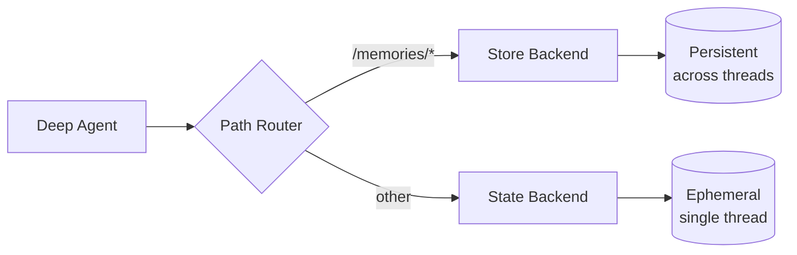

Deep agents 配备了本地文件系统来卸载记忆。默认情况下，此文件系统存储在 agent 状态中，并且对于 **单个线程是临时的** —— 当对话结束时文件将丢失。

您可以通过使用 `CompositeBackend` 将特定路径路由到持久存储来扩展 deep agents 的 **长期记忆**。这实现了混合存储，其中一些文件跨线程持久化，而其他文件保持临时状态。



## 设置

通过使用 `CompositeBackend` 将 `/memories/` 路径路由到 `StoreBackend` 来配置长期记忆：


```typescript
import { createDeepAgent } from "deepagents";
import { CompositeBackend, StateBackend, StoreBackend } from "deepagents";
import { InMemoryStore } from "@langchain/langgraph-checkpoint";

const agent = createDeepAgent({
  store: new InMemoryStore(),  // Good for local dev; omit for LangSmith Deployment
  backend: (config) => new CompositeBackend(
    new StateBackend(config),  // Ephemeral storage
    { "/memories/": new StoreBackend(config) }  // Persistent storage
  ),
});
```


## 工作原理

当使用 `CompositeBackend` 时，deep agents 维护 **两个独立的文件系统**：

### 1. 短期（临时）文件系统
- 存储在 agent 的状态中（通过 `StateBackend`）
- 仅在单个线程内持久化
- 线程结束时文件丢失
- 通过标准路径访问：`/notes.txt`, `/workspace/draft.md`

### 2. 长期（持久）文件系统
- 存储在 LangGraph Store 中（通过 `StoreBackend`）
- 跨所有线程和对话持久化
- 在 agent 重启后仍然存在
- 通过以 `/memories/` 为前缀的路径访问：`/memories/preferences.txt`

### 路径路由

`CompositeBackend` 根据路径前缀路由文件操作：
- 以 `/memories/` 开头的路径的文件存储在 Store 中（持久化）
- 没有此前缀的文件保持在临时状态
- 所有文件系统工具（`ls`、`read_file`、`write_file`、`edit_file`）都适用于两者

<Note>
    `CompositeBackend` 在存储之前会剥离路由前缀。例如，`/memories/preferences.txt` 在 `StoreBackend` 中存储为 `/preferences.txt`。Agent 始终使用完整路径。有关详情，请参阅 [CompositeBackend](/oss/javascript/deepagents/backends#compositebackend-router)。
</Note>


```typescript
// Transient file (lost after thread ends)
await agent.invoke({
  messages: [{ role: "user", content: "Write draft to /draft.txt" }],
});

// Persistent file (survives across threads)
await agent.invoke({
  messages: [{ role: "user", content: "Save final report to /memories/report.txt" }],
});
```


## 跨线程持久化

`/memories/` 中的文件可以从任何线程访问：


```typescript
import { v4 as uuidv4 } from "uuid";

// Thread 1: Write to long-term memory
const config1 = { configurable: { thread_id: uuidv4() } };
await agent.invoke({
  messages: [{ role: "user", content: "Save my preferences to /memories/preferences.txt" }],
}, config1);

// Thread 2: Read from long-term memory (different conversation!)
const config2 = { configurable: { thread_id: uuidv4() } };
await agent.invoke({
  messages: [{ role: "user", content: "What are my preferences?" }],
}, config2);
// Agent can read /memories/preferences.txt from the first thread
```


## 从外部代码访问记忆 (LangSmith)

如果在 LangSmith 上部署您的 agent，您可以使用 [Store API](/langsmith/agent-server-api/store) 从服务端代码（agent 外部）读取或写入记忆。`StoreBackend` 使用命名空间 `(assistant_id, "filesystem")` 存储文件。


```typescript
import { Client } from "@langchain/langgraph-sdk";

const client = new Client({ apiUrl: "<DEPLOYMENT_URL>" });

// Read a memory file (path without /memories/ prefix)
const item = await client.store.getItem(
  [assistantId, "filesystem"],
  "/preferences.txt"
);

// Write a memory file
await client.store.putItem(
  [assistantId, "filesystem"],
  "/preferences.txt",
  {
    content: ["line 1", "line 2"],
    created_at: "2024-01-15T10:30:00Z",
    modified_at: "2024-01-15T10:30:00Z"
  }
);

// Search for items
const items = await client.store.searchItems([assistantId, "filesystem"]);
```


<Note>
    键不包含 `/memories/` 前缀，因为 `CompositeBackend` 在存储之前会剥离它。有关详情，请参阅 [路径路由](#path-routing)。
</Note>

有关更多信息，请参阅 [Store API 参考](/langsmith/agent-server-api/store)。

## 用例

### 用户偏好

存储跨会话持久化的用户偏好：


```typescript
const agent = createDeepAgent({
  store: new InMemoryStore(),
  backend: (config) => new CompositeBackend(
    new StateBackend(config),
    { "/memories/": new StoreBackend(config) }
  ),
  systemPrompt: `When users tell you their preferences, save them to /memories/user_preferences.txt so you remember them in future conversations.`,
});
```


### 自我改进指令

Agent 可以根据反馈更新自己的指令：


```typescript
const agent = createDeepAgent({
  store: new InMemoryStore(),
  backend: (config) => new CompositeBackend(
    new StateBackend(config),
    { "/memories/": new StoreBackend(config) }
  ),
  systemPrompt: `You have a file at /memories/instructions.txt with additional instructions and preferences.

  Read this file at the start of conversations to understand user preferences.

  When users provide feedback like "please always do X" or "I prefer Y", update /memories/instructions.txt using the edit_file tool.`,
});
```


随着时间的推移，指令文件会积累用户偏好，帮助 agent 改进。

### 知识库

通过多次对话建立知识：


```typescript
// Conversation 1: Learn about a project
await agent.invoke({
  messages: [{ role: "user", content: "We're building a web app with React. Save project notes." }],
});

// Conversation 2: Use that knowledge
await agent.invoke({
  messages: [{ role: "user", content: "What framework are we using?" }],
});
// Agent reads /memories/project_notes.txt from previous conversation
```


### 研究项目

跨会话维护研究状态：


```typescript
const researchAgent = createDeepAgent({
  store: new InMemoryStore(),
  backend: (config) => new CompositeBackend(
    new StateBackend(config),
    { "/memories/": new StoreBackend(config) }
  ),
  systemPrompt: `You are a research assistant.

  Save your research progress to /memories/research/:
  - /memories/research/sources.txt - List of sources found
  - /memories/research/notes.txt - Key findings and notes
  - /memories/research/report.md - Final report draft

  This allows research to continue across multiple sessions.`,
});
```


## Store 实现

任何 LangGraph `BaseStore` 实现均可工作：

### InMemoryStore (开发)

适合测试和开发，但数据会在重启时丢失：


```typescript
import { InMemoryStore } from "@langchain/langgraph-checkpoint";
import { createDeepAgent, CompositeBackend, StateBackend, StoreBackend } from "deepagents";

const store = new InMemoryStore();
const agent = createDeepAgent({
  store,
  backend: (config) => new CompositeBackend(
    new StateBackend(config),
    { "/memories/": new StoreBackend(config) }
  ),
});
```


### PostgresStore (生产)

对于生产环境，使用持久存储：


```typescript
import { PostgresStore } from "@langchain/langgraph-checkpoint-postgres";
import { createDeepAgent, CompositeBackend, StateBackend, StoreBackend } from "deepagents";

const store = new PostgresStore({
  connectionString: process.env.DATABASE_URL,
});
const agent = createDeepAgent({
  store,
  backend: (config) => new CompositeBackend(
    new StateBackend(config),
    { "/memories/": new StoreBackend(config) }
  ),
});
```


## FileData 模式 (Schema)

通过 `StoreBackend` 存储的文件使用以下模式：

```python
{
    "content": ["line 1", "line 2", "line 3"],  # List of strings (one per line)
    "created_at": "2024-01-15T10:30:00Z",       # ISO 8601 timestamp
    "modified_at": "2024-01-15T11:45:00Z"       # ISO 8601 timestamp
}
```

您可以使用 `create_file_data` 助手来创建格式正确的文件数据：


```typescript
import { createFileData } from "deepagents";

const fileData = createFileData("Hello\nWorld");
// { content: ['Hello', 'World'], created_at: '...', modified_at: '...' }
```


有关后端协议的更多详细信息，请参阅 [后端](/oss/javascript/deepagents/backends#protocol-reference)。

## 最佳实践

### 使用描述性路径

使用清晰的路径组织持久文件：

```
/memories/user_preferences.txt
/memories/research/topic_a/sources.txt
/memories/research/topic_a/notes.txt
/memories/project/requirements.md
```

### 记录记忆结构

在您的系统提示中告诉 agent 什么存储在何处：

```
Your persistent memory structure:
- /memories/preferences.txt: User preferences and settings
- /memories/context/: Long-term context about the user
- /memories/knowledge/: Facts and information learned over time
```

### 清理旧数据

定期清理过时的持久文件，以保持存储的可管理性。

### 选择正确的存储

- **开发**：使用 `InMemoryStore` 进行快速迭代
- **生产**：使用 `PostgresStore` 或其他持久存储
- **多租户**：考虑在您的 store 中使用基于 `assistant_id` 的命名空间

---

<div className="source-links">
<Callout icon="edit">
    [在 GitHub 上编辑此页面](https://github.com/langchain-ai/docs/edit/main/src/oss/deepagents/long-term-memory.mdx) 或 [提交 issue](https://github.com/langchain-ai/docs/issues/new/choose).
</Callout>
<Callout icon="terminal-2">
    [将这些文档连接](/use-these-docs) 到 Claude、VSCode 以及更多通过 MCP 获取实时答案的工具。
</Callout>
</div>
