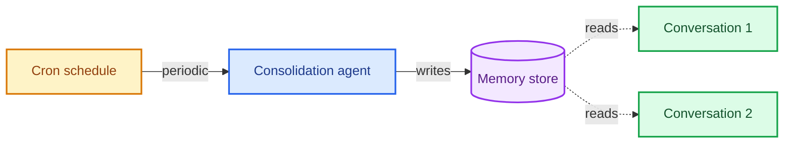

内存让您的代理能够在对话中学习和改进。Deep Agents 通过基于文件系统的内存使内存成为一等公民：代理将内存作为文件读写，您可以使用[后端](/oss/javascript/deepagents/backends)控制这些文件的存储位置。

<Note>
本页涵盖**长期内存**：跨对话持久化的内存。关于短期内存（单个会话内的对话历史和临时文件），请参阅[上下文工程](/oss/javascript/deepagents/context-engineering)指南。短期内存作为代理[状态](/oss/javascript/langgraph/graph-api#state)的一部分自动管理。
</Note>

## 内存工作原理

1. **将代理指向内存文件。** 在创建代理时通过 `memory=` 传递文件路径。您还可以通过 `skills=` 传递[技能](/oss/javascript/deepagents/skills)以实现过程性内存（可重用的指令，告诉代理*如何*执行任务）。[后端](/oss/javascript/deepagents/backends)控制文件的存储位置和访问权限。
2. **代理读取内存。** 代理可以在启动时将内存文件加载到系统提示中，或在对话期间按需读取。例如，[技能](/oss/javascript/deepagents/skills)使用按需加载：代理在启动时仅读取技能描述，然后仅在匹配任务时读取完整的技能文件。这保持了上下文的精简，直到需要该能力。
3. **代理更新内存（可选）。** 当代理学习到新信息时，它可以使用内置的 `edit_file` 工具更新内存文件。更新可以在对话期间（默认）或通过[后台合并](#background-consolidation)在对话之间后台进行。更改会被持久化并在下一次对话中可用。并非所有内存都是可写的：开发者定义的[技能](/oss/javascript/deepagents/skills)和[组织策略](#organization-level-memory)通常是只读的。有关详细信息，请参阅[只读与可写内存](#read-only-vs-writable-memory)。

两种最常见的模式是[代理范围内存](#agent-scoped-memory)（所有用户共享）和[用户范围内存](#user-scoped-memory)（每个用户隔离）。

## 范围内存

代理内存可以设置范围，以便所有使用该代理的用户都可以访问相同的内存文件，或者内存文件可以为每个用户单独设置。

### 代理范围内存

为代理提供其自己的持久身份，并随时间演变。代理范围内存跨所有用户共享，因此代理通过每次对话建立自己的角色、积累的知识和学习的偏好。随着与用户的互动，它发展专业知识、完善方法并记住有效的方法。当具有写入权限时，它还可以学习和更新[技能](/oss/javascript/deepagents/skills)。

关键是后端命名空间：将其设置为 `(assistant_id,)` 意味着此代理的每次对话都读写到相同的内存文件。

<Note>
访问 `rt.serverInfo` 需要 `deepagents>=1.9.0`。在旧版本中，请从 `getConfig().metadata.assistantId` 读取助理 ID。
</Note>

```typescript
import { createDeepAgent, CompositeBackend, StateBackend, StoreBackend } from "deepagents";

const agent = createDeepAgent({
  memory: ["/memories/AGENTS.md"],
  skills: ["/skills/"],
  backend: new CompositeBackend(
    new StateBackend(),
    {
      "/memories/": new StoreBackend({
        namespace: (rt) => [rt.serverInfo.assistantId],  // [!code highlight]
      }),
      "/skills/": new StoreBackend({
        namespace: (rt) => [rt.serverInfo.assistantId],  // [!code highlight]
      }),
    },
  ),
});
```

<Accordion title="完整示例：种子内存和调用">

用初始内存填充存储，然后在两个线程上调用代理，以查看它记住并更新所学内容。

```typescript
import { v4 as uuidv4 } from "uuid";
import { createDeepAgent, CompositeBackend, StateBackend, StoreBackend, createFileData } from "deepagents";
import { InMemoryStore } from "@langchain/langgraph";

const store = new InMemoryStore();  // 部署到 LangSmith 时使用平台存储

// 种子内存文件
await store.put(
  ["my-agent"],
  "/memories/AGENTS.md",
  createFileData(`## Response style
- Keep responses concise
- Use code examples where possible
`),
);

// 种子技能
await store.put(
  ["my-agent"],
  "/skills/langgraph-docs/SKILL.md",
  createFileData(`---
name: langgraph-docs
description: Fetch relevant LangGraph documentation to provide accurate guidance.
---

# langgraph-docs

Use the fetch_url tool to read https://docs.langchain.com/llms.txt, then fetch relevant pages.
`),
);

const agent = createDeepAgent({
  memory: ["/memories/AGENTS.md"],
  skills: ["/skills/"],
  backend: (rt) => new CompositeBackend(
    new StateBackend(rt),
    {
      "/memories/": new StoreBackend(rt, {
        namespace: (rt) => ["my-agent"],
      }),
      "/skills/": new StoreBackend(rt, {
        namespace: (rt) => ["my-agent"],
      }),
    },
  ),
  store,
});

// 线程 1：代理学习新偏好并保存到内存
const config1 = { configurable: { thread_id: uuidv4() } };
await agent.invoke({
  messages: [{ role: "user", content: "I prefer detailed explanations. Remember that." }],
}, config1);

// 线程 2：代理读取内存并应用偏好
const config2 = { configurable: { thread_id: uuidv4() } };
await agent.invoke({
  messages: [{ role: "user", content: "Explain how transformers work." }],
}, config2);
```

</Accordion>

### 用户范围内存

为每个用户提供自己的内存文件。代理记住每个用户的偏好、上下文和历史，而核心代理指令保持固定。如果存储在用户范围的后端中，用户也可以拥有每个用户的[技能](/oss/javascript/deepagents/skills)。

命名空间使用 `(user_id,)`，因此每个用户获得内存文件的隔离副本。用户 A 的偏好永远不会泄露到用户 B 的对话中。

```typescript
import { createDeepAgent, CompositeBackend, StateBackend, StoreBackend } from "deepagents";

const agent = createDeepAgent({
  memory: ["/memories/preferences.md"],
  skills: ["/skills/"],
  backend: new CompositeBackend(
    new StateBackend(),
    {
      "/memories/": new StoreBackend({
        namespace: (rt) => [rt.serverInfo.user.identity],
      }),
      "/skills/": new StoreBackend({
        namespace: (rt) => [rt.serverInfo.user.identity],
      }),
    },
  ),
});
```

<Accordion title="完整示例：跨用户的隔离内存">

种子每个用户的内存，并以两个不同用户的身份调用代理。每个用户只能看到自己的偏好。

```typescript
import { v4 as uuidv4 } from "uuid";
import { createDeepAgent, CompositeBackend, StateBackend, StoreBackend, createFileData } from "deepagents";
import { InMemoryStore } from "@langchain/langgraph";

const store = new InMemoryStore();  // 部署到 LangSmith 时使用平台存储

// 为两个用户种子偏好
await store.put(
  ["user-alice"],
  "/memories/preferences.md",
  createFileData(`## Preferences
- Likes concise bullet points
- Prefers Python examples
`),
);
await store.put(
  ["user-bob"],
  "/memories/preferences.md",
  createFileData(`## Preferences
- Likes detailed explanations
- Prefers TypeScript examples
`),
);

// 为 Alice 种子技能
await store.put(
  ["user-alice"],
  "/skills/langgraph-docs/SKILL.md",
  createFileData(`---
name: langgraph-docs
description: Fetch relevant LangGraph documentation to provide accurate guidance.
---

# langgraph-docs

Use the fetch_url tool to read https://docs.langchain.com/llms.txt, then fetch relevant pages.
`),
);

const agent = createDeepAgent({
  memory: ["/memories/preferences.md"],
  skills: ["/skills/"],
  backend: (rt) => new CompositeBackend(
    new StateBackend(rt),
    {
      "/memories/": new StoreBackend(rt, {
        namespace: (rt) => [rt.serverInfo.user.identity],
      }),
      "/skills/": new StoreBackend(rt, {
        namespace: (rt) => [rt.serverInfo.user.identity],
      }),
    },
  ),
  store,
});

// 部署时，每个经过身份验证的请求都会解析
// `rt.serverInfo.user.identity` 为调用用户，因此 Alice 和 Bob
// 自动只看到自己的偏好。
await agent.invoke(
  { messages: [{ role: "user", content: "How do I read a CSV file?" }] },
  { configurable: { thread_id: uuidv4() } },
);
```

</Accordion>

## 高级用法

除了内存路径和范围的基本配置选项外，您还可以为内存配置更多高级参数：

| 维度 | 回答的问题 | 选项 |
|---|---|---|
| **持续时间** | 持续多久？ | [短期](/oss/javascript/deepagents/context-engineering)（单次对话）或[长期](#scoped-memory)（跨对话） |
| **信息类型** | 是什么类型的信息？ | [情节性](#episodic-memory)（过去的经验）、[过程性](/oss/javascript/deepagents/skills)（指令和技能）或[语义性](/oss/javascript/concepts/memory#semantic-memory)（事实） |
| **范围** | 谁可以查看和修改？ | [用户](#user-scoped-memory)、[代理](#agent-scoped-memory)或[组织](#organization-level-memory) |
| **更新策略** | 何时写入内存？ | 对话期间（默认）或[对话之间](#background-consolidation) |
| **检索** | 如何读取内存？ | 加载到提示中（默认）或按需（例如[技能](/oss/javascript/deepagents/skills)） |
| **代理权限** | 代理可以写入内存吗？ | [读写](#read-only-vs-writable-memory)（默认）或[只读](#read-only-vs-writable-memory)（用于共享策略） |

### 情节性内存

情节性内存存储过去经验的记录：发生了什么、顺序如何以及结果是什么。与语义内存（存储在 `AGENTS.md` 等文件中的事实和偏好）不同，情节性内存保留完整的对话上下文，以便代理可以回忆*如何*解决问题，而不仅仅是从中学到了*什么*。

Deep Agents 已经使用[检查点](/oss/javascript/langgraph/persistence#checkpoints)，这是支持情节性内存的机制：每次对话都作为检查点线程持久化。

为了使过去的对话可搜索，将线程搜索包装在工具中。`user_id` 从运行时上下文中提取，而不是作为参数传递：

```typescript
import { Client } from "@langchain/langgraph-sdk";
import { tool } from "@langchain/core/tools";

const client = new Client({ apiUrl: "<DEPLOYMENT_URL>" });

const searchPastConversations = tool(
  async ({ query }, runtime) => {
    const userId = runtime.serverInfo.user.identity;  // [!code highlight]
    const threads = await client.threads.search({
      metadata: { userId },
      limit: 5,
    });
    const results = [];
    for (const thread of threads) {
      const history = await client.threads.getHistory(thread.threadId);
      results.push(history);
    }
    return JSON.stringify(results);
  },
  {
    name: "search_past_conversations",
    description: "Search past conversations for relevant context.",
  }
);
```

您可以通过调整元数据过滤器按用户或组织限定线程搜索范围：

```typescript
// 搜索特定用户的对话
const userThreads = await client.threads.search({
  metadata: { userId },
  limit: 5,
});

// 搜索整个组织的对话
const orgThreads = await client.threads.search({
  metadata: { orgId },
  limit: 5,
});
```

这对于执行复杂、多步骤任务的代理非常有用。例如，编码代理可以回顾过去的调试会话，并直接跳到可能的根本原因。

### 组织级内存

组织级内存遵循与用户范围内存相同的模式，但使用组织范围的命名空间而不是每个用户的命名空间。用于应在组织内所有用户和代理中应用的策略或知识。

组织内存通常是**只读**的，以防止通过共享状态进行提示注入。有关详细信息，请参阅[只读与可写内存](#read-only-vs-writable-memory)。

```typescript
import { createDeepAgent, CompositeBackend, StateBackend, StoreBackend } from "deepagents";

const agent = createDeepAgent({
  memory: [
    "/memories/preferences.md",
    "/policies/compliance.md",
  ],
  backend: new CompositeBackend(
    new StateBackend(),
    {
      "/memories/": new StoreBackend({
        namespace: (rt) => [rt.serverInfo.user.identity],
      }),
      "/policies/": new StoreBackend({
        namespace: (rt) => [rt.context.orgId],
      }),
    },
  ),
});
```

从您的应用程序代码填充组织内存：

```typescript
import { Client } from "@langchain/langgraph-sdk";
import { createFileData } from "deepagents";

const client = new Client({ apiUrl: "<DEPLOYMENT_URL>" });

await client.store.putItem(
  [orgId],
  "/compliance.md",
  createFileData(`## Compliance policies
- Never disclose internal pricing
- Always include disclaimers on financial advice
`),
);
```

使用[权限](/oss/javascript/deepagents/permissions)强制组织级内存为只读，或使用[策略钩子](/oss/javascript/deepagents/backends#add-policy-hooks)进行自定义验证逻辑。

### 后台合并

默认情况下，代理在对话期间写入内存（热路径）。另一种方法是在对话之间作为后台任务处理内存，有时称为**睡眠时间计算**。一个单独的深代理审查最近的对话，提取关键事实，并将其与现有内存合并。

| 方法 | 优点 | 缺点 |
|---|---|---|
| **热路径**（对话期间） | 内存立即可用，对用户透明 | 增加延迟，代理必须多任务处理 |
| **后台**（对话之间） | 无用户感知延迟，可跨多个对话合成 | 内存直到下一次对话才可用，需要第二个代理 |

对于大多数应用程序，热路径就足够了。当您需要减少延迟或提高跨多个对话的内存质量时，添加后台合并。

推荐的模式是部署一个**合并代理**与您的主代理一起——一个深代理，读取最近的对话历史，提取关键事实，并将其合并到内存存储中——并按[cron 计划](#cron)触发它。选择一个反映用户实际与代理互动频率的节奏：具有稳定每日流量的聊天产品可能每几小时合并一次，而每周仅使用几次的工具只需要每晚或每周运行一次。比用户对话更频繁地合并只会浪费令牌进行无操作运行。

#### 合并代理

合并代理读取最近的对话历史，并将关键事实合并到内存存储中。在 `langgraph.json` 中与您的主代理一起注册它：

```typescript src/consolidation-agent.ts
import { createDeepAgent } from "deepagents";
import { Client } from "@langchain/langgraph-sdk";
import { tool } from "@langchain/core/tools";

const sdkClient = new Client({ apiUrl: "<DEPLOYMENT_URL>" });

const searchRecentConversations = tool(
  async ({ query }, runtime) => {
    const userId = runtime.serverInfo.user.identity;  // [!code highlight]

    const since = new Date(Date.now() - 6 * 60 * 60 * 1000).toISOString();
    const threads = await sdkClient.threads.search({
      metadata: { userId },
      updatedAfter: since,
      limit: 20,
    });
    const conversations = [];
    for (const thread of threads) {
      const history = await sdkClient.threads.getHistory(thread.threadId);
      conversations.push(history.values.messages);
    }
    return JSON.stringify(conversations);
  },
  {
    name: "search_recent_conversations",
    description: "Search this user's conversations updated in the last 6 hours.",
  }
);

const agent = createDeepAgent({
  model: "google_genai:gemini-3.1-pro-preview",
  systemPrompt: `Review recent conversations and update the user's memory file.
Merge new facts, remove outdated information, and keep it concise.`,
  tools: [searchRecentConversations],
});

export { agent };
```

```json langgraph.json
{
  "dependencies": ["."],
  "graphs": {
    "agent": "./src/agent.ts:agent",
    "consolidation_agent": "./src/consolidation-agent.ts:agent"
  },
  "env": ".env"
}
```

#### Cron

[cron 作业](/langsmith/cron-jobs)在固定计划上运行合并代理。代理搜索最近的对话并将其合成为内存。匹配计划以符合您的使用模式，以便合并运行大致跟踪真实活动。



使用 cron 作业安排合并代理：

```typescript
import { Client } from "@langchain/langgraph-sdk";

const client = new Client({ apiUrl: "<DEPLOYMENT_URL>" });

const cronJob = await client.crons.create(
  "consolidation_agent",
  {
    schedule: "0 */6 * * *",
    input: { messages: [{ role: "user", content: "Consolidate recent memories." }] },
  },
);
```

<Note>
所有 cron 计划均按**UTC**时间解释。有关管理和删除 cron 作业的详细信息，请参阅[cron 作业](/langsmith/cron-jobs)。
</Note>

<Warning>
cron 间隔必须与合并代理内的回顾窗口匹配。上面的示例每 6 小时运行一次（`0 */6 * * *`），代理的 `search_recent_conversations` 工具回顾 `timedelta(hours=6)`——请保持同步。如果 cron 运行频率高于回顾窗口，您将重新处理相同的对话；如果运行频率较低，您将丢失窗口之外的内存。
</Warning>

有关使用后台进程部署代理的更多信息，请参阅[投入生产](/oss/javascript/deepagents/going-to-production)。

### 只读与可写内存

默认情况下，代理可以读写内存文件。对于共享状态（如组织策略或合规规则），您可能希望使内存**只读**，以便代理可以引用它但不能修改它。这可以防止通过共享内存进行提示注入，并确保只有您的应用程序代码控制文件中的内容。

| 权限 | 用例 | 工作原理 |
|---|---|---|
| **读写**（默认） | 用户偏好、代理自我改进、学习的[技能](/oss/javascript/deepagents/skills) | 代理通过 `edit_file` 工具更新文件 |
| **只读** | 组织策略、合规规则、共享知识库、开发者定义的[技能](/oss/javascript/deepagents/skills) | 通过应用程序代码或[Store API](/langsmith/custom-store)填充。使用[权限](/oss/javascript/deepagents/permissions)拒绝写入特定路径，或使用[策略钩子](/oss/javascript/deepagents/backends#add-policy-hooks)进行自定义验证逻辑。 |

**安全考虑：** 如果一个用户可以写入另一个用户读取的内存，恶意用户可能会将指令注入共享状态。为了缓解此问题：

- **默认使用用户范围** `(user_id)`，除非有特定原因需要共享
- 对共享策略使用**只读内存**（通过应用程序代码填充，而不是代理）
- 在代理写入共享内存之前添加**人工介入**验证。使用[中断](/oss/javascript/langgraph/interrupts)要求对敏感路径的写入进行人工批准。

要强制只读内存，请使用[权限](/oss/javascript/deepagents/permissions)以声明方式拒绝写入特定路径。对于自定义验证逻辑（速率限制、审计日志、内容检查），请使用[后端策略钩子](/oss/javascript/deepagents/backends#add-policy-hooks)。

### 并发写入

多个线程可以并行写入内存，但对**同一文件**的并发写入可能导致最后写入获胜冲突。对于用户范围的内存，这种情况很少见，因为用户通常一次只有一个活动对话。对于代理范围或组织范围的内存，请考虑使用[后台合并](#background-consolidation)来序列化写入，或将内存结构化为每个主题的单独文件以减少争用。

在实践中，如果写入因冲突而失败，LLM 通常足够智能以重试或优雅恢复，因此单个丢失的写入不是灾难性的。

### 同一部署中的多个代理

要在共享部署中为每个代理提供自己的内存，请将 `assistant_id` 添加到命名空间：

```typescript
new StoreBackend({
  namespace: (rt) => [
    rt.serverInfo.assistantId,  // [!code highlight]
    rt.serverInfo.user.identity,
  ],
})
```

如果只需要每个代理的隔离而不需要每个用户的范围，请单独使用 `assistant_id`。

<Tip>
使用[LangSmith 追踪](/langsmith/trace-with-langgraph)审核代理写入内存的内容。每次文件写入都会在追踪中显示为工具调用。
</Tip>

---

<div className="source-links">
<Callout icon="edit">
    [在 GitHub 上编辑此页面](https://github.com/langchain-ai/docs/edit/main/src/oss/deepagents/memory.mdx) 或[提交问题](https://github.com/langchain-ai/docs/issues/new/choose)。
</Callout>
<Callout icon="terminal-2">
    [通过 MCP 将这些文档](/use-these-docs)连接到 Claude、VSCode 等，以获取实时答案。
</Callout>
</div>