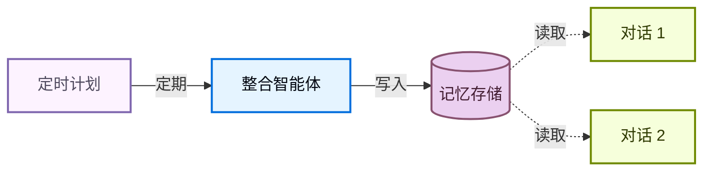

记忆让你的智能体能够跨对话学习和改进。Deep Agents 通过文件系统支持的记忆将记忆作为一等公民：智能体将记忆作为文件进行读写，你可以使用[后端](/oss/javascript/deepagents/backends)来控制这些文件的存储位置。

<Note>
本页介绍**长期记忆**：跨对话持久化的记忆。关于短期记忆（单次会话内的对话历史和临时文件），请参阅[上下文工程](/oss/javascript/deepagents/context-engineering)指南。短期记忆作为智能体[状态](/oss/javascript/langgraph/graph-api#state)的一部分自动管理。


</Note>

## 记忆的工作原理

1. **将智能体指向记忆文件。** 创建智能体时通过 `memory=` 传递文件路径。你也可以通过 `skills=` 传递[技能](/oss/javascript/deepagents/skills)作为程序性记忆（告诉智能体*如何*执行任务的可重用指令）。[后端](/oss/javascript/deepagents/backends)控制文件的存储位置和访问权限。
2. **智能体读取记忆。** 智能体可以在启动时将记忆文件加载到系统提示中，或在对话过程中按需读取。例如，[技能](/oss/javascript/deepagents/skills)使用按需加载：智能体在启动时只读取技能描述，仅在匹配任务时才读取完整的技能文件。这使上下文保持精简，直到需要特定能力。
3. **智能体更新记忆（可选）。** 当智能体学到新信息时，可以使用内置的 `edit_file` 工具更新记忆文件。更新可以在对话过程中（默认）或通过[后台整合](#background-consolidation)在对话之间后台进行。更改会被持久化并在下次对话中可用。并非所有记忆都是可写的：开发者定义的[技能](/oss/javascript/deepagents/skills)和[组织策略](#organization-level-memory)通常是只读的。详情请参阅[只读与可写记忆](#read-only-vs-writable-memory)。

最常见的两种模式是[智能体范围记忆](#agent-scoped-memory)（所有用户共享）和[用户范围记忆](#user-scoped-memory)（每个用户隔离）。

## 范围记忆

智能体记忆可以设置范围，使相同的记忆文件可被所有使用该智能体的用户访问，或者记忆文件可以为每个用户单独设置。

### 智能体范围记忆

赋予智能体一个随时间演进的持久身份。智能体范围记忆在所有用户间共享，因此智能体通过每次对话积累自己的人格、知识和学习到的偏好。在与用户交互时，它会发展专业知识、完善方法并记住有效的方式。当拥有写入权限时，它还可以学习和更新[技能](/oss/javascript/deepagents/skills)。

关键是后端命名空间：将其设置为 `(assistant_id,)` 意味着该智能体的每次对话都读写相同的记忆文件。

<Note>
访问 `rt.serverInfo` 需要 `deepagents>=1.9.0`。在旧版本中，请从 `getConfig().metadata.assistantId` 读取助手 ID。
</Note>

```typescript
import { createDeepAgent, CompositeBackend, StateBackend, StoreBackend } from "deepagents";

const agent = createDeepAgent({
  memory: ["/memories/AGENTS.md"],
  skills: ["/skills/"],
  backend: new CompositeBackend(
    new StateBackend(),
    {
      "/memories/": new StoreBackend({
        namespace: (rt) => [rt.serverInfo.assistantId],  // [!code highlight]
      }),
      "/skills/": new StoreBackend({
        namespace: (rt) => [rt.serverInfo.assistantId],  // [!code highlight]
      }),
    },
  ),
});
```

<Accordion title="完整示例：种子记忆和调用">

用初始记忆填充存储，然后在两个线程中调用智能体，观察它如何记住并更新所学内容。

```typescript
import { v4 as uuidv4 } from "uuid";
import { createDeepAgent, CompositeBackend, StateBackend, StoreBackend, createFileData } from "deepagents";
import { InMemoryStore } from "@langchain/langgraph";

const store = new InMemoryStore();  // 部署到 LangSmith 时使用平台存储

// 种子记忆文件
await store.put(
  ["my-agent"],
  "/memories/AGENTS.md",
  createFileData(`## 回复风格
- 保持回复简洁
- 尽可能使用代码示例
`),
);

// 种子技能
await store.put(
  ["my-agent"],
  "/skills/langgraph-docs/SKILL.md",
  createFileData(`---
name: langgraph-docs
description: 获取相关 LangGraph 文档以提供准确指导。
---

# langgraph-docs

使用 fetch_url 工具读取 https://docs.langchain.com/llms.txt，然后获取相关页面。
`),
);

const agent = createDeepAgent({
  memory: ["/memories/AGENTS.md"],
  skills: ["/skills/"],
  backend: (rt) => new CompositeBackend(
    new StateBackend(rt),
    {
      "/memories/": new StoreBackend(rt, {
        namespace: (rt) => ["my-agent"],
      }),
      "/skills/": new StoreBackend(rt, {
        namespace: (rt) => ["my-agent"],
      }),
    },
  ),
  store,
});

// 线程 1：智能体学习新偏好并保存到记忆
const config1 = { configurable: { thread_id: uuidv4() } };
await agent.invoke({
  messages: [{ role: "user", content: "我更喜欢详细的解释。请记住这一点。" }],
}, config1);

// 线程 2：智能体读取记忆并应用偏好
const config2 = { configurable: { thread_id: uuidv4() } };
await agent.invoke({
  messages: [{ role: "user", content: "解释一下变压器是如何工作的。" }],
}, config2);
```

</Accordion>

### 用户范围记忆

为每个用户提供自己的记忆文件。智能体记住每个用户的偏好、上下文和历史记录，同时核心智能体指令保持固定。如果存储在用户范围的后端中，用户也可以拥有各自的[技能](/oss/javascript/deepagents/skills)。

命名空间使用 `(user_id,)`，因此每个用户获得记忆文件的隔离副本。用户 A 的偏好永远不会泄露到用户 B 的对话中。

```typescript
import { createDeepAgent, CompositeBackend, StateBackend, StoreBackend } from "deepagents";

const agent = createDeepAgent({
  memory: ["/memories/preferences.md"],
  skills: ["/skills/"],
  backend: new CompositeBackend(
    new StateBackend(),
    {
      "/memories/": new StoreBackend({
        namespace: (rt) => [rt.serverInfo.user.identity],
      }),
      "/skills/": new StoreBackend({
        namespace: (rt) => [rt.serverInfo.user.identity],
      }),
    },
  ),
});
```

<Accordion title="完整示例：跨用户的隔离记忆">

为每个用户设置种子记忆，并以两个不同用户身份调用智能体。每个用户只能看到自己的偏好。

```typescript
import { v4 as uuidv4 } from "uuid";
import { createDeepAgent, CompositeBackend, StateBackend, StoreBackend, createFileData } from "deepagents";
import { InMemoryStore } from "@langchain/langgraph";

const store = new InMemoryStore();  // 部署到 LangSmith 时使用平台存储

// 为两个用户设置种子偏好
await store.put(
  ["user-alice"],
  "/memories/preferences.md",
  createFileData(`## 偏好
- 喜欢简洁的要点
- 偏好 Python 示例
`),
);
await store.put(
  ["user-bob"],
  "/memories/preferences.md",
  createFileData(`## 偏好
- 喜欢详细的解释
- 偏好 TypeScript 示例
`),
);

// 为 Alice 设置种子技能
await store.put(
  ["user-alice"],
  "/skills/langgraph-docs/SKILL.md",
  createFileData(`---
name: langgraph-docs
description: 获取相关 LangGraph 文档以提供准确指导。
---

# langgraph-docs

使用 fetch_url 工具读取 https://docs.langchain.com/llms.txt，然后获取相关页面。
`),
);

const agent = createDeepAgent({
  memory: ["/memories/preferences.md"],
  skills: ["/skills/"],
  backend: (rt) => new CompositeBackend(
    new StateBackend(rt),
    {
      "/memories/": new StoreBackend(rt, {
        namespace: (rt) => [rt.serverInfo.user.identity],
      }),
      "/skills/": new StoreBackend(rt, {
        namespace: (rt) => [rt.serverInfo.user.identity],
      }),
    },
  ),
  store,
});

// 部署后，每个经过身份验证的请求会将
// `rt.serverInfo.user.identity` 解析为调用用户，因此 Alice 和 Bob
// 自动只能看到自己的偏好。
await agent.invoke(
  { messages: [{ role: "user", content: "我如何读取 CSV 文件？" }] },
  { configurable: { thread_id: uuidv4() } },
);
```

</Accordion>

## 高级用法

除了记忆路径和范围的基本配置选项外，你还可以为记忆配置更高级的参数：

| 维度 | 它回答的问题 | 选项 |
|---|---|---|
| **持续时间** | 它持续多久？ | [短期](/oss/javascript/deepagents/context-engineering)（单次对话）或[长期](#scoped-memory)（跨对话） |
| **信息类型** | 它是什么类型的信息？ | [情景性](#episodic-memory)（过去的经历）、[程序性](/oss/javascript/deepagents/skills)（指令和技能）或[语义性](/oss/javascript/concepts/memory#semantic-memory)（事实） |
| **范围** | 谁可以查看和修改它？ | [用户](#user-scoped-memory)、[智能体](#agent-scoped-memory)或[组织](#organization-level-memory) |
| **更新策略** | 何时写入记忆？ | 对话期间（默认）或[对话之间](#background-consolidation) |
| **检索** | 如何读取记忆？ | 加载到提示中（默认）或按需（例如[技能](/oss/javascript/deepagents/skills)） |
| **智能体权限** | 智能体可以写入记忆吗？ | [读写](#read-only-vs-writable-memory)（默认）或[只读](#read-only-vs-writable-memory)（用于共享策略） |

### 情景性记忆

情景性记忆存储过去经历的记录：发生了什么、按什么顺序发生以及结果如何。与语义性记忆（存储在 `AGENTS.md` 等文件中的事实和偏好）不同，情景性记忆保留完整的对话上下文，使智能体能够回忆起问题*如何*被解决，而不仅仅是*学到了什么*。

Deep Agents 已经使用[检查点](/oss/javascript/langgraph/persistence#checkpoints)，这是支持情景性记忆的机制：每次对话都作为检查点线程持久化。

为了使过去的对话可搜索，将线程搜索包装在一个工具中。`user_id` 从运行时上下文获取，而不是作为参数传递：

```typescript
import { Client } from "@langchain/langgraph-sdk";
import { tool } from "@langchain/core/tools";

const client = new Client({ apiUrl: "<DEPLOYMENT_URL>" });

const searchPastConversations = tool(
  async ({ query }, runtime) => {
    const userId = runtime.serverInfo.user.identity;  // [!code highlight]
    const threads = await client.threads.search({
      metadata: { userId },
      limit: 5,
    });
    const results = [];
    for (const thread of threads) {
      const history = await client.threads.getHistory(thread.threadId);
      results.push(history);
    }
    return JSON.stringify(results);
  },
  {
    name: "search_past_conversations",
    description: "搜索过去的对话以获取相关上下文。",
  }
);
```

你可以通过调整元数据过滤器按用户或组织限定线程搜索范围：

```typescript
// 搜索特定用户的对话
const userThreads = await client.threads.search({
  metadata: { userId },
  limit: 5,
});

// 搜索整个组织的对话
const orgThreads = await client.threads.search({
  metadata: { orgId },
  limit: 5,
});
```

这对于执行复杂多步骤任务的智能体很有用。例如，编码智能体可以回顾过去的调试会话，直接跳到可能的根本原因。

### 组织级记忆

组织级记忆遵循与用户范围记忆相同的模式，但使用组织范围的命名空间而不是每个用户的命名空间。用于应适用于组织中所有用户和智能体的策略或知识。

组织记忆通常是**只读的**，以防止通过共享状态进行提示注入。详情请参阅[只读与可写记忆](#read-only-vs-writable-memory)。

```typescript
import { createDeepAgent, CompositeBackend, StateBackend, StoreBackend } from "deepagents";

const agent = createDeepAgent({
  memory: [
    "/memories/preferences.md",
    "/policies/compliance.md",
  ],
  backend: new CompositeBackend(
    new StateBackend(),
    {
      "/memories/": new StoreBackend({
        namespace: (rt) => [rt.serverInfo.user.identity],
      }),
      "/policies/": new StoreBackend({
        namespace: (rt) => [rt.context.orgId],
      }),
    },
  ),
});
```

从应用程序代码填充组织记忆：

```typescript
import { Client } from "@langchain/langgraph-sdk";
import { createFileData } from "deepagents";

const client = new Client({ apiUrl: "<DEPLOYMENT_URL>" });

await client.store.putItem(
  [orgId],
  "/compliance.md",
  createFileData(`## 合规策略
- 永远不要泄露内部定价
- 在财务建议中始终包含免责声明
`),
);
```

使用[权限](/oss/javascript/deepagents/permissions)来强制组织级记忆为只读，或使用[策略钩子](/oss/javascript/deepagents/backends#add-policy-hooks)进行自定义验证逻辑。

### 后台整合

默认情况下，智能体在对话期间写入记忆（热路径）。另一种选择是在**对话之间**作为后台任务处理记忆，有时称为**睡眠时间计算**。一个单独的深度智能体审查最近的对话，提取关键事实，并将其与现有记忆合并。

| 方法 | 优点 | 缺点 |
|---|---|---|
| **热路径**（对话期间） | 记忆立即可用，对用户透明 | 增加延迟，智能体必须多任务处理 |
| **后台**（对话之间） | 无用户感知延迟，可以跨多个对话综合 | 记忆在下次对话前不可用，需要第二个智能体 |

对于大多数应用程序，热路径就足够了。当你需要减少延迟或提高跨多个对话的记忆质量时，添加后台整合。

推荐的模式是在主智能体旁边部署一个**整合智能体**——一个读取最近对话历史、提取关键事实并将其合并到记忆存储中的深度智能体——并按[定时计划](#cron)触发它。选择一个反映用户实际与智能体交互频率的节奏：具有稳定日常流量的聊天产品可能每几小时整合一次，而每周只使用几次的工具只需要每晚或每周运行一次。比用户对话频率高得多的整合只会浪费令牌在无操作运行上。

#### 整合智能体

整合智能体读取最近的对话历史，并将关键事实合并到记忆存储中。在 `langgraph.json` 中将其与主智能体一起注册：

```typescript src/consolidation-agent.ts
import { createDeepAgent } from "deepagents";
import { Client } from "@langchain/langgraph-sdk";
import { tool } from "@langchain/core/tools";

const sdkClient = new Client({ apiUrl: "<DEPLOYMENT_URL>" });

const searchRecentConversations = tool(
  async ({ query }, runtime) => {
    const userId = runtime.serverInfo.user.identity;  // [!code highlight]

    const since = new Date(Date.now() - 6 * 60 * 60 * 1000).toISOString();
    const threads = await sdkClient.threads.search({
      metadata: { userId },
      updatedAfter: since,
      limit: 20,
    });
    const conversations = [];
    for (const thread of threads) {
      const history = await sdkClient.threads.getHistory(thread.threadId);
      conversations.push(history.values.messages);
    }
    return JSON.stringify(conversations);
  },
  {
    name: "search_recent_conversations",
    description: "搜索此用户最近 6 小时内更新的对话。",
  }
);

const agent = createDeepAgent({
  model: "google_genai:gemini-3.1-pro-preview",
  systemPrompt: `审查最近的对话并更新用户的记忆文件。
合并新事实，删除过时信息，并保持简洁。`,
  tools: [searchRecentConversations],
});

export { agent };
```

```json langgraph.json
{
  "dependencies": ["."],
  "graphs": {
    "agent": "./src/agent.ts:agent",
    "consolidation_agent": "./src/consolidation-agent.ts:agent"
  },
  "env": ".env"
}
```

#### 定时任务

[定时任务](/langsmith/cron-jobs)按固定计划运行整合智能体。智能体搜索最近的对话并将其综合到记忆中。使计划与使用模式匹配，以便整合运行大致跟踪实际活动。


```mermaid
graph LR
    Store[(记忆存储)] -.->|读取| Conv1[对话 1]
    Store -.->|读取| Conv2[对话 2]
    Cron[定时计划] -->|定期| Agent[整合智能体]
    Agent -->|写入| Store

    classDef trigger fill:#F6FFDB,stroke:#6E8900,stroke-width:2px,color:#2E3900
    classDef process fill:#E5F4FF,stroke:#006DDD,stroke-width:2px,color:#030710
    classDef output fill:#EBD0F0,stroke:#885270,stroke-width:2px,color:#441E33
    classDef schedule fill:#FDF3FF,stroke:#7E65AE,stroke-width:2px,color:#504B5F

    class Conv1,Conv2 trigger
    class Agent process
    class Store output
    class Cron schedule
```

使用定时任务安排整合智能体：

```typescript
import { Client } from "@langchain/langgraph-sdk";

const client = new Client({ apiUrl: "<DEPLOYMENT_URL>" });

const cronJob = await client.crons.create(
  "consolidation_agent",
  {
    schedule: "0 */6 * * *",
    input: { messages: [{ role: "user", content: "整合最近的记忆。" }] },
  },
);
```

<Note>
所有定时计划均以 **UTC** 时间解释。有关管理和删除定时任务的详细信息，请参阅[定时任务](/langsmith/cron-jobs)。
</Note>

<Warning>
定时间隔必须与整合智能体内的回溯窗口匹配。上面的示例每 6 小时运行一次（`0 */6 * * *`），智能体的 `search_recent_conversations` 工具回溯 `timedelta(hours=6)` ——保持这些同步。如果定时任务运行频率高于回溯窗口，你将重新处理相同的对话；如果运行频率较低，你将丢失窗口之外的记忆。
</Warning>

有关使用后台进程部署智能体的更多信息，请参阅[投入生产](/oss/javascript/deepagents/going-to-production)。

### 只读与可写记忆

默认情况下，智能体可以读写记忆文件。对于组织策略或合规规则等共享状态，你可能希望使记忆**只读**，以便智能体可以引用但不能修改它。这可以防止通过共享记忆进行提示注入，并确保只有你的应用程序代码控制文件中的内容。

| 权限 | 用例 | 工作原理 |
|---|---|---|
| **读写**（默认） | 用户偏好、智能体自我改进、学习到的[技能](/oss/javascript/deepagents/skills) | 智能体通过 `edit_file` 工具更新文件 |
| **只读** | 组织策略、合规规则、共享知识库、开发者定义的[技能](/oss/javascript/deepagents/skills) | 通过应用程序代码或 [Store API](/langsmith/custom-store) 填充。使用[权限](/oss/javascript/deepagents/permissions)拒绝写入特定路径，或使用[策略钩子](/oss/javascript/deepagents/backends#add-policy-hooks)进行自定义验证逻辑。 |

**安全考虑：** 如果一个用户可以写入另一个用户读取的记忆，恶意用户可能会将指令注入共享状态。为缓解此问题：

- **默认使用用户范围** `(user_id)`，除非你有特定原因需要共享
- 对共享策略使用**只读记忆**（通过应用程序代码填充，而不是智能体）
- 在智能体写入共享记忆之前添加**人在回路中**验证。使用[中断](/oss/javascript/langgraph/interrupts)要求对敏感路径的写入进行人工批准。

要强制只读记忆，请使用[权限](/oss/javascript/deepagents/permissions)声明式拒绝写入特定路径。对于自定义验证逻辑（速率限制、审计日志、内容检查），请使用[后端策略钩子](/oss/javascript/deepagents/backends#add-policy-hooks)。

### 并发写入

多个线程可以并行写入记忆，但对**同一文件**的并发写入可能导致最后写入者获胜的冲突。对于用户范围记忆，这种情况很少见，因为用户通常一次只有一个活动对话。对于智能体范围或组织范围记忆，考虑使用[后台整合](#background-consolidation)来序列化写入，或将记忆结构化为每个主题的单独文件以减少争用。

实际上，如果写入因冲突而失败，LLM 通常足够智能可以重试或优雅恢复，因此单个丢失的写入不是灾难性的。

### 同一部署中的多个智能体

要在共享部署中为每个智能体提供自己的记忆，请将 `assistant_id` 添加到命名空间：

```typescript
new StoreBackend({
  namespace: (rt) => [
    rt.serverInfo.assistantId,  // [!code highlight]
    rt.serverInfo.user.identity,
  ],
})
```

如果只需要每个智能体的隔离而不需要每个用户的范围，则单独使用 `assistant_id`。

<Tip>
使用 [LangSmith 追踪](/langsmith/trace-with-langgraph)来审计智能体写入记忆的内容。每次文件写入都会在追踪中显示为工具调用。
</Tip>

---

<div className="source-links">
<Callout icon="terminal-2">
    [将这些文档连接](/use-these-docs)到 Claude、VSCode 等，通过 MCP 获取实时答案。
</Callout>
<Callout icon="edit">
    [在 GitHub 上编辑此页面](https://github.com/langchain-ai/docs/edit/main/src/oss/deepagents/memory.mdx) 或 [提交问题](https://github.com/langchain-ai/docs/issues/new/choose)。
</Callout>
</div>