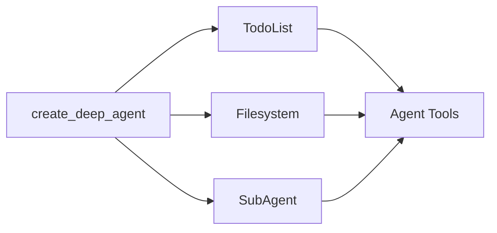

Deep agents 采用模块化中间件架构构建。Deep agents 可以访问：

1. 规划工具
2. 用于存储上下文和长期记忆的文件系统
3. 生成子 agent 的能力

每个功能都作为单独的中间件实现。当你使用 `create_deep_agent` 创建 deep agent 时，我们会自动将 `TodoListMiddleware`、`FilesystemMiddleware` 和 `SubAgentMiddleware` 附加到你的 agent。



中间件是可组合的——你可以根据需要向 agent 添加任意数量的中间件。你可以独立使用任何中间件。

以下部分解释每个中间件提供的功能。

## 待办事项列表中间件

规划对于解决复杂问题至关重要。如果你最近使用过 Claude Code，你会注意到它在处理复杂的多部分任务之前会写出待办事项列表。你还会注意到它可以在收到更多信息时即时调整和更新此待办事项列表。

`TodoListMiddleware` 为你的 agent 提供了一个专门用于更新此待办事项列表的工具。在执行多部分任务之前和期间，会提示 agent 使用 `write_todos` 工具来跟踪它正在做什么以及还需要做什么。


```typescript
import { createAgent, todoListMiddleware } from "langchain";

// todoListMiddleware is included by default in createDeepAgent
// You can customize it if building a custom agent
const agent = createAgent({
  model: "claude-sonnet-4-5-20250929",
  middleware: [
    todoListMiddleware({
      // Optional: Custom addition to the system prompt
      systemPrompt: "Use the write_todos tool to...",
    }),
  ],
});
```


## 文件系统中间件

上下文工程是构建有效 agent 的主要挑战。当使用返回可变长度结果的工具时（例如 `web_search` 和 RAG），这尤其困难，因为长工具结果可能会迅速填满你的上下文窗口。

`FilesystemMiddleware` 提供四个工具用于与短期和长期记忆交互：

- `ls`：列出文件系统中的文件
- `read_file`：读取整个文件或文件中的特定行数
- `write_file`：向文件系统写入新文件
- `edit_file`：编辑文件系统中的现有文件


```typescript
import { createAgent } from "langchain";
import { createFilesystemMiddleware } from "deepagents";

// FilesystemMiddleware is included by default in createDeepAgent
// You can customize it if building a custom agent
const agent = createAgent({
  model: "claude-sonnet-4-5-20250929",
  middleware: [
    createFilesystemMiddleware({
      backend: undefined,  // Optional: custom backend (defaults to StateBackend)
      systemPrompt: "Write to the filesystem when...",  // Optional custom system prompt override
      customToolDescriptions: {
        ls: "Use the ls tool when...",
        read_file: "Use the read_file tool to...",
      },  // Optional: Custom descriptions for filesystem tools
    }),
  ],
});
```


### 短期与长期文件系统

默认情况下，这些工具写入图状态中的本地"文件系统"。要启用跨线程的持久存储，请配置将特定路径（如 `/memories/`）路由到 `StoreBackend` 的 `CompositeBackend`。


```typescript
import { createAgent } from "langchain";
import { createFilesystemMiddleware, CompositeBackend, StateBackend, StoreBackend } from "deepagents";
import { InMemoryStore } from "@langchain/langgraph-checkpoint";

const store = new InMemoryStore();

const agent = createAgent({
  model: "claude-sonnet-4-5-20250929",
  store,
  middleware: [
    createFilesystemMiddleware({
      backend: (config) => new CompositeBackend(
        new StateBackend(config),
        { "/memories/": new StoreBackend(config) }
      ),
      systemPrompt: "Write to the filesystem when...", // Optional custom system prompt override
      customToolDescriptions: {
        ls: "Use the ls tool when...",
        read_file: "Use the read_file tool to...",
      }, // Optional: Custom descriptions for filesystem tools
    }),
  ],
});
```


当你为 `/memories/` 配置带有 `StoreBackend` 的 `CompositeBackend` 时，任何以 **/memories/** 为前缀的文件都会保存到持久存储中，并在不同线程之间存活。没有此前缀的文件保留在临时状态存储中。

## 子 agent 中间件

将任务交给子 agent 可以隔离上下文，保持主（管理者）agent 的上下文窗口清洁，同时仍能深入处理任务。

子 agent 中间件允许你通过 `task` 工具提供子 agent。


```typescript
import { tool } from "langchain";
import { createAgent } from "langchain";
import { createSubAgentMiddleware } from "deepagents";
import { z } from "zod";

const getWeather = tool(
  async ({ city }: { city: string }) => {
    return `The weather in ${city} is sunny.`;
  },
  {
    name: "get_weather",
    description: "Get the weather in a city.",
    schema: z.object({
      city: z.string(),
    }),
  },
);

const agent = createAgent({
  model: "claude-sonnet-4-5-20250929",
  middleware: [
    createSubAgentMiddleware({
      defaultModel: "claude-sonnet-4-5-20250929",
      defaultTools: [],
      subagents: [
        {
          name: "weather",
          description: "This subagent can get weather in cities.",
          systemPrompt: "Use the get_weather tool to get the weather in a city.",
          tools: [getWeather],
          model: "gpt-4o",
          middleware: [],
        },
      ],
    }),
  ],
});
```


子 agent 使用**名称**、**描述**、**系统提示**和**工具**定义。你还可以为子 agent 提供自定义**模型**或额外的**中间件**。当你想给子 agent 一个额外的状态键与主 agent 共享时，这特别有用。

对于更复杂的用例，你还可以提供自己预构建的 LangGraph 图作为子 agent。


```typescript
import { tool, createAgent } from "langchain";
import { createSubAgentMiddleware, type SubAgent } from "deepagents";
import { z } from "zod";

const getWeather = tool(
  async ({ city }: { city: string }) => {
    return `The weather in ${city} is sunny.`;
  },
  {
    name: "get_weather",
    description: "Get the weather in a city.",
    schema: z.object({
      city: z.string(),
    }),
  },
);

const weatherSubagent: SubAgent = {
  name: "weather",
  description: "This subagent can get weather in cities.",
  systemPrompt: "Use the get_weather tool to get the weather in a city.",
  tools: [getWeather],
  model: "gpt-4o",
  middleware: [],
};

const agent = createAgent({
  model: "claude-sonnet-4-5-20250929",
  middleware: [
    createSubAgentMiddleware({
      defaultModel: "claude-sonnet-4-5-20250929",
      defaultTools: [],
      subagents: [weatherSubagent],
    }),
  ],
});
```


除了任何用户定义的子 agent 外，主 agent 始终可以访问一个 `general-purpose` 子 agent。这个子 agent 具有与主 agent 相同的指令和它可以访问的所有工具。`general-purpose` 子 agent 的主要目的是上下文隔离——主 agent 可以将复杂任务委托给这个子 agent，并获得简洁的答案，而不会因中间工具调用而膨胀。

---

<Callout icon="pen-to-square" iconType="regular">
    [Edit this page on GitHub](https://github.com/langchain-ai/docs/edit/main/src/oss/deepagents/middleware.mdx) or [file an issue](https://github.com/langchain-ai/docs/issues/new/choose).
</Callout>
<Tip icon="terminal" iconType="regular">
    [Connect these docs](/use-these-docs) to Claude, VSCode, and more via MCP for real-time answers.
</Tip>
<div class='fixed right-2 bg-white bottom-2'></div>