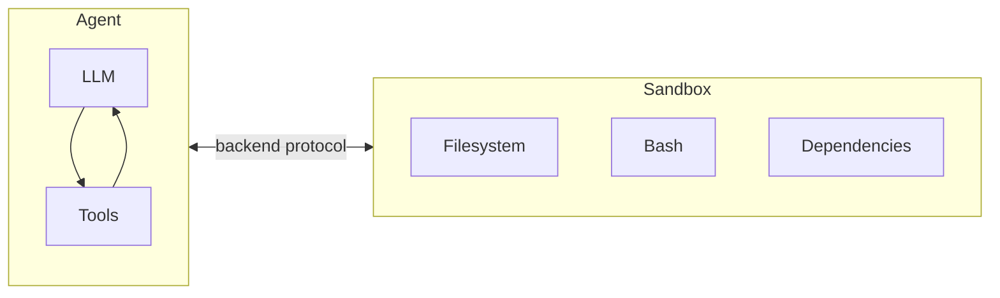
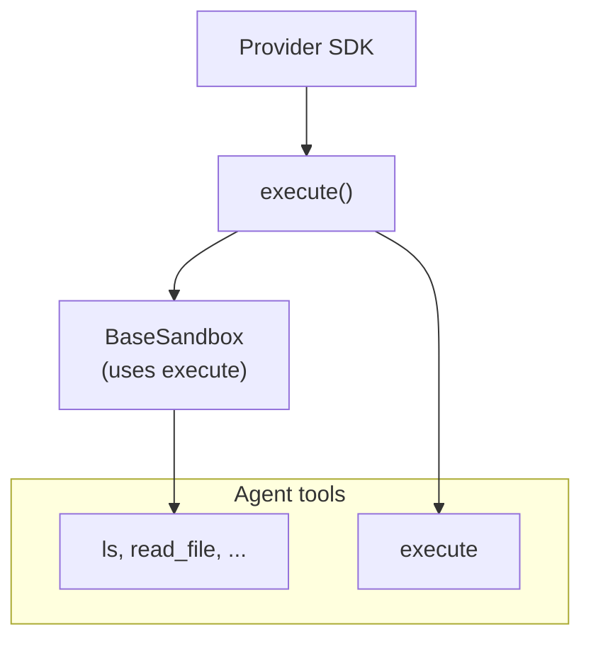
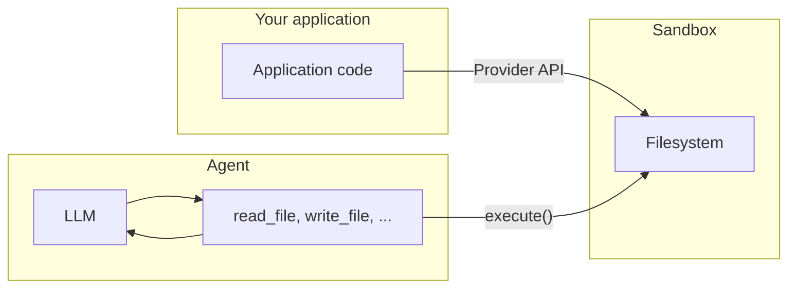

import SandboxBasicPy from '/snippets/deepagents-sandbox-basic-py.mdx';
import SandboxBasicJs from '/snippets/deepagents-sandbox-basic-js.mdx';

Agent 生成代码、与文件系统交互并运行 shell 命令。因为我们无法预测 Agent 可能会做什么，所以将其环境隔离非常重要，这样它就无法访问凭据、文件或网络。沙盒通过在 Agent 的执行环境和主机系统之间创建边界来提供这种隔离。

在 Deep Agents 中，**沙盒是定义 Agent 运行环境的 [后端](/oss/javascript/deepagents/backends)**。与其他仅暴露文件操作的后端（State、Filesystem、Store）不同，沙盒后端还为 Agent 提供了一个用于运行 shell 命令的 `execute` 工具。配置沙盒后端时，Agent 将获得：

- 所有标准文件系统工具（`ls`、`read_file`、`write_file`、`edit_file`、`glob`、`grep`）
- 用于在沙盒中运行任意 shell 命令的 `execute` 工具
- 保护主机系统的安全边界



## 为什么使用沙盒？

沙盒用于安全目的。
它们允许 Agent 执行任意代码、访问文件和使用网络，而不会危及您的凭据、本地文件或主机系统。
当 Agent 自主运行时，这种隔离至关重要。

沙盒特别适用于：

- 编码 Agent：自主运行的 Agent 可以使用 shell、git、克隆仓库（许多提供商提供原生 git API，例如 [Daytona 的 git 操作](https://www.daytona.io/docs/en/git-operations/)），并运行 Docker-in-Docker 进行构建和测试管道
- 数据分析 Agent：在安全、隔离的环境中加载文件、安装数据分析库（pandas、numpy 等）、运行统计计算并创建 PowerPoint 演示文稿等输出

## 集成模式

基于 Agent 运行的位置，有两种将 Agent 与沙盒集成的架构模式。

### Agent 在沙盒中模式

Agent 在沙盒内运行，您通过网络与其通信。您构建一个预装了 Agent 框架的 Docker 或 VM 镜像，在沙盒内运行它，并从外部连接以发送消息。

优点：

- ✅ 紧密反映本地开发环境。
- ✅ Agent 与环境紧密耦合。

权衡：

- 🔴 API 密钥必须存在于沙盒内（安全风险）。
- 🔴 更新需要重建镜像。
- 🔴 需要通信基础设施（WebSocket 或 HTTP 层）。

要在沙盒中运行 Agent，请构建镜像并在其上安装 deepagents。

```dockerfile
FROM python:3.11
RUN pip install deepagents-cli
```

然后在沙盒内运行 Agent。
要在沙盒内使用 Agent，您必须添加额外的基础设施来处理应用程序与沙盒内 Agent 之间的通信。

### 沙盒作为工具模式

Agent 在您的机器或服务器上运行。当它需要执行代码时，它会调用沙盒工具（如 `execute`、`read_file` 或 `write_file`），这些工具会调用提供商的 API 以在远程沙盒中运行操作。

优点：

- ✅ 即时更新 Agent 代码，无需重建镜像。
- ✅ Agent 状态与执行更清晰地分离。
    - API 密钥保留在沙盒外部。
    - 沙盒故障不会丢失 Agent 状态。
    - 可以选择并行在多个沙盒中运行任务。
- ✅ 仅为执行时间付费。

权衡：

- 🔴 每次执行调用都有网络延迟。

示例：

```typescript
import "dotenv/config";
import { DaytonaSandbox } from "@langchain/daytona";
import { createDeepAgent } from "deepagents";

// 也可以使用 E2B, Runloop, Modal 实现
const sandbox = await DaytonaSandbox.create();

const agent = createDeepAgent({
  backend: sandbox,
  systemPrompt:
    "You are a coding assistant with sandbox access. You can create and run code in the sandbox.",
});

try {
  const result = await agent.invoke({
    messages: [
      {
        role: "user",
        content: "Create a hello world Python script and run it",
      },
    ],
  });
  const lastMessage = result.messages[result.messages.length - 1];
  console.log(
    typeof lastMessage.content === "string"
      ? lastMessage.content
      : String(lastMessage.content),
  );
} finally {
  // 可选：当 Agent 完成时主动删除沙盒
  await sandbox.close();
  throw err;
}
```

本文档中的示例使用沙盒作为工具模式。
当您的提供商 SDK 处理通信层且您希望生产环境反映本地开发环境时，请选择 Agent 在沙盒中模式。
当您需要快速迭代 Agent 逻辑、将 API 密钥保留在沙盒外部或更喜欢更清晰的关注点分离时，请选择沙盒作为工具模式。

## 可用提供商

有关提供商特定的设置、身份验证和生命周期详细信息，请参阅提供商集成页面：

<CardGroup cols={2}>
    <Card title="Modal" icon="/images/providers/modal-icon.svg" href="/oss/javascript/integrations/providers/modal">
        ML/AI 工作负载，GPU 访问，Python。
    </Card>
    <Card title="Daytona" icon="/images/providers/daytona-icon.svg" href="/oss/javascript/integrations/providers/daytona">
        TypeScript/Python 开发，快速冷启动。
    </Card>
    <Card title="Deno" icon="/images/providers/deno-icon.svg" href="/oss/javascript/integrations/providers/deno">
        Deno/JavaScript 工作负载，microVM。
    </Card>
    <Card title="Node VFS" icon="/images/providers/nodejs-icon.svg" href="/oss/javascript/integrations/providers/node-vfs">
        本地开发，测试，无需云。
    </Card>
</CardGroup>

如果您提供沙盒平台并希望贡献集成，请参阅 [贡献沙盒集成](/oss/javascript/contributing/integrations-langchain)。

## 基本用法

<SandboxBasicJs />

## 沙盒如何工作

### 隔离边界

所有沙盒提供商都保护您的主机系统免受 Agent 的文件系统和 shell 操作的影响。Agent 无法读取您的本地文件、访问机器上的环境变量或干扰其他进程。但是，仅靠沙盒**不能**防止：

- **上下文注入** — 控制 Agent 部分输入的攻击者可以指示其在沙盒内运行任意命令。沙盒是隔离的，但 Agent 在其中拥有完全控制权。
- **网络泄露** — 除非阻止网络访问，否则被上下文注入的 Agent 可以通过 HTTP 或 DNS 将数据发送出沙盒。一些提供商支持阻止网络访问（例如，Modal 上的 `blockNetwork: true`）。

请参阅 [安全注意事项](#security-considerations) 了解如何处理机密信息并减轻这些风险。

### `execute` 方法

沙盒后端具有简单的架构：提供商必须实现的唯一方法是 `execute()`，它运行 shell 命令并返回其输出。所有其他文件系统操作 — `read`、`write`、`edit`、`ls`、`glob`、`grep` — 都是由 `BaseSandbox` 基类构建在 `execute()` 之上的，该基类构造脚本并通过 `execute()` 在沙盒内运行它们。



这种设计意味着：
- **添加新提供商很简单。** 实现 `execute()` — 基类处理其他所有事情。
- **`execute` 工具是有条件可用的。** 在每次模型调用中，Harness 都会检查后端是否实现了 `SandboxBackendProtocol`。如果没有，该工具将被过滤掉，Agent 永远看不到它。

当 Agent 调用 `execute` 工具时，它提供一个 `command` 字符串，并获得合并的 stdout/stderr、退出代码以及如果输出太大时的截断通知。

您也可以在应用程序代码中直接调用后端 `execute()` 方法。

例如：

```
4
[Command succeeded with exit code 0]
```

```
bash: foobar: command not found
[Command failed with exit code 127]
```

如果命令产生非常大的输出，结果将自动保存到文件中，并指示 Agent 使用 `read_file` 增量访问它。这可以防止上下文窗口溢出。

### 两种文件访问层面

文件进出沙盒有两种不同的方式，了解何时使用每种方式非常重要：

**Agent 文件系统工具** — `read_file`、`write_file`、`edit_file`、`ls`、`glob`、`grep` 和 `execute` 是 LLM 在执行期间调用的工具。这些工具通过沙盒内的 `execute()` 运行。Agent 使用它们来读取代码、写入文件和运行命令，作为其任务的一部分。

**文件传输 API** — 您的应用程序代码调用的 `uploadFiles()` 和 `downloadFiles()` 方法。这些使用提供商的原生文件传输 API（不是 shell 命令），旨在在您的主机环境和沙盒之间移动文件。使用这些来：
- 在 Agent 运行之前，使用源代码、配置或数据 **播种沙盒**
- 在 Agent 完成后 **检索工件**（生成的代码、构建输出、报告）
- **预填充** Agent 可能需要的 **依赖项**



## 使用文件

### 播种沙盒

在 Agent 运行之前，使用 `uploadFiles()` 填充沙盒。文件内容以 `Uint8Array` 形式提供：

```typescript
const encoder = new TextEncoder();
const responses = await sandbox.uploadFiles([
  ["src/index.js", encoder.encode("console.log('Hello')")],
  ["package.json", encoder.encode('{"name": "my-app"}')],
]);

// 每个响应指示成功或失败
for (const res of responses) {
  if (res.error) {
    console.error(`Failed to upload ${res.path}: ${res.error}`);
  }
}
```

### 检索工件

在 Agent 完成后，使用 `downloadFiles()` 从沙盒中检索文件：

```typescript
const results = await sandbox.downloadFiles(["src/index.js", "output.txt"]);

const decoder = new TextDecoder();
for (const result of results) {
  if (result.content) {
    console.log(`${result.path}: ${decoder.decode(result.content)}`);
  } else {
    console.error(`Failed to download ${result.path}: ${result.error}`);
  }
}
```

<Note>
在沙盒内部，Agent 使用其自己的文件系统工具（`read_file`、`write_file`） — 而不是 `uploadFiles` 或 `downloadFiles`。这些方法用于您的应用程序代码在主机和沙盒之间的边界移动文件。
</Note>

## 生命周期和清理

沙盒在关闭之前会消耗资源并产生费用。
为避免为不再需要的资源付费，请记住在应用程序不再需要沙盒时立即将其关闭。

<Tip>
**聊天应用程序的 TTL。** 当用户可以在空闲时间后重新参与时，您通常不知道他们是否或何时会返回。在沙盒上配置生存时间 (TTL) — 例如，归档 TTL 或删除 TTL — 以便提供商自动清理空闲的沙盒。许多沙盒提供商都支持此功能。
</Tip>

### 基本生命周期

```typescript
// 创建并初始化
const sandbox = await ModalSandbox.create(options);

// 使用沙盒（直接或通过 Agent）
const result = await sandbox.execute("echo hello");

// 完成后清理
await sandbox.close();
```

### 每次对话的生命周期

在聊天应用程序中，对话通常由 `thread_id` 表示。
通常，每个 `thread_id` 应使用其自己唯一的沙盒。

将沙盒 ID 和 `thread_id` 之间的映射存储在您的应用程序中，如果沙盒提供商允许将元数据附加到沙盒，则存储在沙盒中。

```typescript
import "dotenv/config";
import { randomUUID } from "node:crypto";
import { Daytona } from "@daytonaio/sdk";
import type { CreateSandboxFromSnapshotParams } from "@daytonaio/sdk";
import { DaytonaSandbox } from "@langchain/daytona";
import { createDeepAgent } from "deepagents";

const client = new Daytona();
const threadId = randomUUID();

// 通过 thread_id 获取或创建沙盒
let sandbox;
try {
    sandbox = await client.findOne({ labels: { thread_id: threadId } });
} catch {
    const params: CreateSandboxFromSnapshotParams = {
        labels: { thread_id: threadId },
        // 添加 TTL，以便沙盒在空闲时被清理（分钟）
        autoDeleteInterval: 3600,
    };
sandbox = await client.create(params);
}

const backend = await DaytonaSandbox.fromId(sandbox.id);
const agent = createDeepAgent({
    backend,
    systemPrompt:
        "You are a coding assistant with sandbox access. You can create and run code in the sandbox.",
});

try {
    const result = await agent.invoke(
        {
            messages: [
                {
                role: "user",
                content: "Create a hello world Python script and run it",
                },
            ],
        },
        {
            configurable: {
                thread_id: threadId,
            },
        },
    );
    const lastMessage = result.messages[result.messages.length - 1];
    console.log(
        typeof lastMessage.content === "string"
        ? lastMessage.content
        : String(lastMessage.content),
    );
} catch (err) {
    // 可选：发生异常时主动删除沙盒
    await client.delete(sandbox);
    throw err;
}
```

## 安全注意事项

沙盒将代码执行与主机系统隔离，但它们不能防止 **上下文注入**。控制 Agent 部分输入的攻击者可以指示其读取文件、运行命令或从沙盒中窃取数据。这使得沙盒内的凭据特别危险。

<Warning>
**切勿将机密信息放入沙盒中。** 注入到沙盒中（通过环境变量、挂载文件或 `secrets` 选项）的 API 密钥、令牌、数据库凭据和其他机密信息可能会被上下文注入的 Agent 读取和窃取。这甚至适用于短期或范围受限的凭据 — 如果 Agent 可以访问它们，攻击者也可以。
</Warning>

### 安全处理机密信息

如果您的 Agent 需要调用经过身份验证的 API 或访问受保护的资源，您有两种选择：

1. **将机密信息保留在沙盒外的工具中。** 定义在您的主机环境中（而不是在沙盒内）运行的工具并在那里处理身份验证。Agent 按名称调用这些工具，但从未看到凭据。这是推荐的方法。

2. **使用注入凭据的网络代理。** 一些沙盒提供商支持代理，拦截来自沙盒的传出 HTTP 请求并在转发之前附加凭据（例如，`Authorization` 标头）。Agent 永远看不到机密信息 — 它只是向 URL 发出普通请求。这种方法在提供商中尚未广泛使用。

<Warning>
如果您必须将机密信息注入沙盒（不推荐），请采取以下预防措施：

- 为 **所有** 工具调用启用 [人机交互](/oss/javascript/deepagents/human-in-the-loop) 批准，而不仅仅是敏感调用
- 阻止或限制来自沙盒的网络访问，以限制泄露路径
- 使用尽可能窄的凭据范围和尽可能短的生命周期
- 监控沙盒网络流量以查找意外的出站请求

即使采取了这些保障措施，这仍然是一种不安全的解决方法。足够有创意的上下文注入攻击可以绕过输出过滤和 HITL 审查。
</Warning>

### 一般最佳实践

- 在应用程序中对沙盒输出采取行动之前对其进行审查
- 不需要时阻止沙盒网络访问
- 使用 [中间件](/oss/javascript/langchain/middleware) 过滤或编校工具输出中的敏感模式
- 将沙盒内产生的所有内容视为不受信任的输入

---

<div className="source-links">
<Callout icon="edit">
    [在 GitHub 上编辑此页面](https://github.com/langchain-ai/docs/edit/main/src/oss/deepagents/sandboxes.mdx) 或 [提交问题](https://github.com/langchain-ai/docs/issues/new/choose)。
</Callout>
<Callout icon="terminal-2">
    通过 MCP 将 [这些文档](/use-these-docs) 连接到 Claude、VSCode 等，以获取实时解答。
</Callout>
</div>
