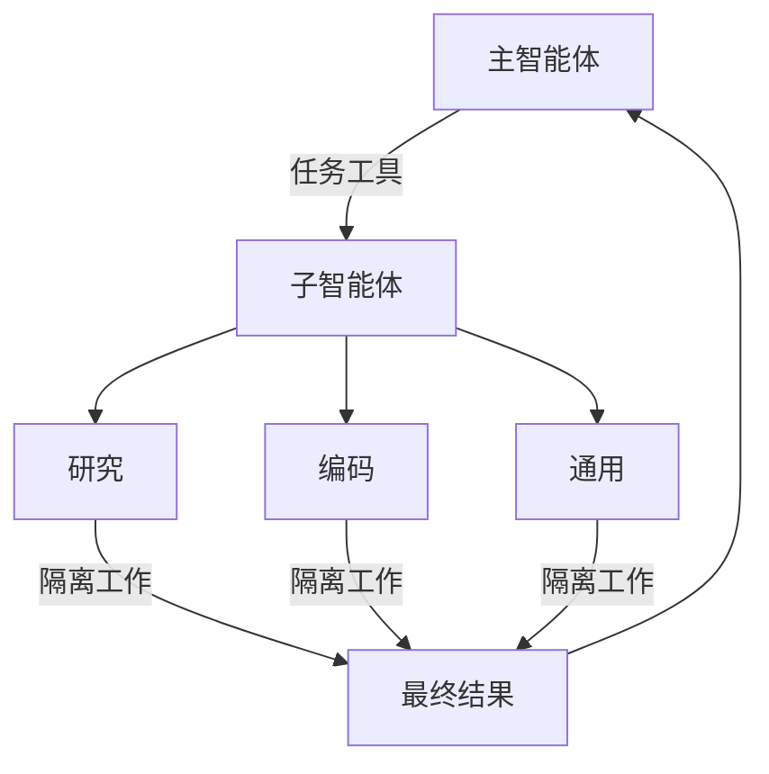

import SubagentBasic from '/snippets/subagent-basic.mdx';

Deep agents 可以创建子智能体（subagents）来委托工作。你可以在 `subagents` 参数中指定自定义子智能体。子智能体对于 [上下文隔离（context quarantine）](https://www.dbreunig.com/2025/06/26/how-to-fix-your-context.html#context-quarantine)（保持主智能体的上下文整洁）和提供专门的指令非常有用。



## 为什么要使用子智能体？

子智能体解决了 **上下文膨胀问题**。当智能体使用输出量大的工具（网络搜索、文件读取、数据库查询）时，上下文窗口会迅速被中间结果填满。子智能体隔离了这些详细的工作——主智能体只接收最终结果，而不是产生该结果的数十次工具调用。

**何时使用子智能体：**
- ✅ 会使主智能体上下文混乱的多步骤任务
- ✅ 需要自定义指令或工具的专业领域
- ✅ 需要不同模型能力的任务
- ✅ 当你想让主智能体专注于高层协调时

**何时不使用子智能体：**
- ❌ 简单的单步任务
- ❌ 当你需要保留中间上下文时
- ❌ 当开销超过收益时

## 配置

`subagents` 应该是一个字典列表或 `CompiledSubAgent` 对象列表。有两种类型：

### SubAgent（基于字典）

对于大多数用例，将子智能体定义为具有以下字段的字典：

| 字段 | 类型 | 描述 |
|-------|------|-------------|
| `name` | `str` | 必填。子智能体的唯一标识符。主智能体在调用 `task()` 工具时使用此名称。子智能体名称成为 `AIMessage` 和流式传输的元数据，有助于区分不同的智能体。 |
| `description` | `str` | 必填。描述此子智能体做什么。具体且以行动为导向。主智能体使用此描述来决定何时委托。 |
| `system_prompt` | `str` | 必填。子智能体的指令。自定义子智能体必须定义自己的指令。包括工具使用指南和输出格式要求。<br></br>不从主智能体继承。 |
| `tools` | `list[Callable]` | 必填。子智能体可以使用的工具。自定义子智能体指定自己的工具。保持最小化，仅包含所需的工具。<br></br>不从主智能体继承。 |
| `model` | `str` \| `BaseChatModel` | 可选。覆盖主智能体的模型。省略以使用主智能体的模型。<br></br>默认从主智能体继承。你可以传递像 `'openai:gpt-5'` 这样的模型标识符字符串（使用 `'provider:model'` 格式）或 LangChain 聊天模型对象（`await initChatModel("gpt-5")` 或 `new ChatOpenAI({ model: "gpt-5" })`）。 |
| `middleware` | `list[Middleware]` | 可选。用于自定义行为、日志记录或速率限制的附加中间件。<br></br>不从主智能体继承。 |
| `interrupt_on` | `dict[str, bool]` | 可选。为特定工具配置 [人机交互（human-in-the-loop）](/oss/javascript/deepagents/human-in-the-loop)。子智能体的值覆盖主智能体。需要检查点（checkpointer）。<br></br>默认从主智能体继承。子智能体的值覆盖默认值。 |
| `skills` | `list[str]` | 可选。[技能（Skills）](/oss/javascript/deepagents/skills) 源路径。指定后，子智能体将从这些目录加载技能（例如 `["/skills/research/", "/skills/web-search/"]`）。这允许子智能体拥有与主智能体不同的技能集。<br></br>不从主智能体继承。只有通用子智能体继承主智能体的技能。当子智能体拥有技能时，它运行自己独立的 `SkillsMiddleware` 实例。技能状态是完全隔离的——子智能体加载的技能对父级不可见，反之亦然。 |

### CompiledSubAgent

对于复杂的工作流，使用预构建的 LangGraph 图：

| 字段 | 类型 | 描述 |
|-------|------|-------------|
| `name` | `str` | 必填。子智能体的唯一标识符。子智能体名称成为 `AIMessage` 和流式传输的元数据，有助于区分不同的智能体。 |
| `description` | `str` | 必填。此子智能体做什么。 |
| `runnable` | `Runnable` | 必填。已编译的 LangGraph 图（必须先调用 `.compile()`）。 |

## 使用 SubAgent

<SubagentBasic />

## 使用 CompiledSubAgent

对于更复杂的用例，你可以提供自定义子智能体。
你可以使用 LangChain 的 `create_agent` 创建自定义子智能体，或者使用 [图 API](/oss/javascript/langgraph/graph-api) 制作自定义 LangGraph 图。

如果你正在创建一个自定义 LangGraph 图，请确保该图有一个 [名为 `"messages"` 的状态键](/oss/javascript/langgraph/quickstart#2-define-state)：

```typescript
import { createDeepAgent, CompiledSubAgent } from "deepagents";
import { createAgent } from "langchain";

// 创建自定义智能体图
const customGraph = createAgent({
  model: yourModel,
  tools: specializedTools,
  prompt: "You are a specialized agent for data analysis...",
});

// 将其用作自定义子智能体
const customSubagent: CompiledSubAgent = {
  name: "data-analyzer",
  description: "Specialized agent for complex data analysis tasks",
  runnable: customGraph,
};

const subagents = [customSubagent];

const agent = createDeepAgent({
  model: "claude-sonnet-4-6",
  tools: [internetSearch],
  systemPrompt: researchInstructions,
  subagents: subagents,
});
```

## 流式传输

当流式传输追踪信息时，智能体名称作为 `lc_agent_name` 在元数据中可用。
在查看追踪信息时，你可以使用此元数据来区分数据来自哪个智能体。

以下示例创建了一个名为 `main-agent` 的 deep agent 和一个名为 `research-agent` 的子智能体：

```python
import os
from typing import Literal
from tavily import TavilyClient
from deepagents import create_deep_agent

tavily_client = TavilyClient(api_key=os.environ["TAVILY_API_KEY"])

def internet_search(
    query: str,
    max_results: int = 5,
    topic: Literal["general", "news", "finance"] = "general",
    include_raw_content: bool = False,
):
    """运行网络搜索"""
    return tavily_client.search(
        query,
        max_results=max_results,
        include_raw_content=include_raw_content,
        topic=topic,
    )

research_subagent = {
    "name": "research-agent",
    "description": "用于研究更深入的问题",
    "system_prompt": "你是一位出色的研究员",
    "tools": [internet_search],
    "model": "claude-sonnet-4-6",  # 可选覆盖，默认为主智能体模型
}
subagents = [research_subagent]

agent = create_deep_agent(
    model="claude-sonnet-4-6",
    subagents=subagents,
    name="main-agent"
)
```

当你提示你的 deep agents 时，所有由子智能体或 deep agent 执行的智能体运行都将在其元数据中包含智能体名称。
在这种情况下，名为 `"research-agent"` 的子智能体将在任何关联的智能体运行元数据中包含 `{'lc_agent_name': 'research-agent'}`：


## 结构化输出

所有子智能体都支持 [结构化输出](/oss/javascript/langchain/structured-output)，你可以使用它来验证子智能体的输出。

你可以通过将所需的结构化输出模式作为 `responseFormat` 参数传递给 `createAgent()` 调用来设置它。
当模型生成结构化数据时，它会被捕获并验证。结构化对象本身不会返回给父智能体。
当在子智能体中使用结构化输出时，请将结构化数据包含在 `ToolMessage` 中。

有关更多信息，请参阅 [响应格式](/oss/javascript/langchain/structured-output#response-format).

## 通用子智能体

除了任何用户定义的子智能体外，deep agents 还可以随时访问 `general-purpose`（通用）子智能体。此子智能体：

- 具有与主智能体相同的系统提示
- 可以访问所有相同的工具
- 使用相同的模型（除非被覆盖）
- 从主智能体继承技能（当配置了技能时）

### 覆盖通用子智能体

在你的 `subagents` 列表中包含一个 `name: "general-purpose"` 的子智能体以替换默认值。使用它来为通用子智能体配置不同的模型、工具或系统提示：

```typescript
import { createDeepAgent } from "deepagents";

// 主智能体使用 Claude；通用子智能体使用 GPT
const agent = await createDeepAgent({
  model: "claude-sonnet-4-6",
  tools: [internetSearch],
  subagents: [
    {
      name: "general-purpose",
      description: "General-purpose agent for research and multi-step tasks",
      systemPrompt: "You are a general-purpose assistant.",
      tools: [internetSearch],
      model: "openai:gpt-4o",  // 委托任务的不同模型
    },
  ],
});
```

当你提供具有通用名称的子智能体时，不会添加默认的通用子智能体。你的规范完全替换了它。

### 何时使用它

通用子智能体非常适合没有专门行为的上下文隔离。主智能体可以将复杂的多步骤任务委托给此子智能体，并获得简洁的结果，而不会因中间工具调用而导致膨胀。

<Card title="示例">
    主智能体不再进行 10 次网络搜索并用结果填充其上下文，而是委托给通用子智能体：`task(name="general-purpose", task="Research quantum computing trends")`。子智能体在内部执行所有搜索，只返回摘要。
</Card>

### 技能继承

当使用 `create_deep_agent` 配置 [技能](/oss/javascript/deepagents/skills) 时：

- **通用子智能体**：自动从主智能体继承技能
- **自定义子智能体**：默认不继承技能——使用 `skills` 参数给它们自己的技能

<Note>
    只有配置了技能的子智能体才会获得 `SkillsMiddleware` 实例——没有 `skills` 参数的自定义子智能体不会获得。当存在时，技能状态在两个方向上都是完全隔离的：父级的技能对子级不可见，子级的技能也不会传播回父级。
</Note>

```typescript
import { createDeepAgent, SubAgent } from "deepagents";

// 具有自己技能的研究子智能体
const researchSubagent: SubAgent = {
  name: "researcher",
  description: "Research assistant with specialized skills",
  systemPrompt: "You are a researcher.",
  tools: [webSearch],
  skills: ["/skills/research/", "/skills/web-search/"],  // 子智能体特定技能
};

const agent = createDeepAgent({
  model: "claude-sonnet-4-6",
  skills: ["/skills/main/"],  // 主智能体和通用子智能体获得这些
  subagents: [researchSubagent],  // 仅获得 /skills/research/ 和 /skills/web-search/
});
```

## 最佳实践

### 编写清晰的描述

主智能体使用描述来决定调用哪个子智能体。要具体：

✅ **好：** `"Analyzes financial data and generates investment insights with confidence scores"`

❌ **坏：** `"Does finance stuff"`

### 保持系统提示详细

包括关于如何使用工具和格式化输出的具体指导：

```typescript
const researchSubagent = {
  name: "research-agent",
  description: "使用网络搜索对特定主题进行深入研究并综合发现",
  systemPrompt: `你是一个彻底的研究员。你的工作是：

  1. 将研究问题分解为可搜索的查询
  2. 使用 internet_search 查找相关信息
  3. 将发现综合成全面但简洁的摘要
  4. 在提出主张时引用来源

  输出格式：
  - 摘要（2-3 段）
  - 关键发现（要点）
  - 来源（带 URL）

  将回复保持在 500 字以内以保持上下文整洁。`,
  tools: [internetSearch],
};
```

### 最小化工具集

只给子智能体它们需要的工具。这提高了专注度和安全性：

```typescript
// ✅ 好：专注的工具集
const emailAgent = {
  name: "email-sender",
  tools: [sendEmail, validateEmail],  // 仅限电子邮件相关
};

// ❌ 坏：工具太多
const emailAgentBad = {
  name: "email-sender",
  tools: [sendEmail, webSearch, databaseQuery, fileUpload],  // 不专注
};
```

### 根据任务选择模型

不同的模型擅长不同的任务：

```typescript
const subagents = [
  {
    name: "contract-reviewer",
    description: "Reviews legal documents and contracts",
    systemPrompt: "You are an expert legal reviewer...",
    tools: [readDocument, analyzeContract],
    model: "claude-sonnet-4-6",  // 长文档的大上下文
  },
  {
    name: "financial-analyst",
    description: "Analyzes financial data and market trends",
    systemPrompt: "You are an expert financial analyst...",
    tools: [getStockPrice, analyzeFundamentals],
    model: "gpt-5",  // 更适合数值分析
  },
];
```

### 返回简洁的结果

指示子智能体返回摘要，而不是原始数据：

```typescript
const dataAnalyst = {
  systemPrompt: `分析数据并返回：
  1. 关键见解（3-5 个要点）
  2. 总体置信度分数
  3. 建议的后续行动

  不要包含：
  - 原始数据
  - 中间计算
  - 详细的工具输出

  将回复保持在 300 字以内。`,
};
```

## 常见模式

### 多个专用子智能体

为不同领域创建专用子智能体：

```typescript
import { createDeepAgent } from "deepagents";

const subagents = [
  {
    name: "data-collector",
    description: "从各种来源收集原始数据",
    systemPrompt: "收集关于该主题的全面数据",
    tools: [webSearch, apiCall, databaseQuery],
  },
  {
    name: "data-analyzer",
    description: "分析收集的数据以获取见解",
    systemPrompt: "分析数据并提取关键见解",
    tools: [statisticalAnalysis],
  },
  {
    name: "report-writer",
    description: "根据分析撰写精美的报告",
    systemPrompt: "根据见解创建专业报告",
    tools: [formatDocument],
  },
];

const agent = createDeepAgent({
  model: "claude-sonnet-4-6",
  systemPrompt: "你协调数据分析和报告。使用子智能体执行专门任务。",
  subagents: subagents,
});
```

**工作流：**
1. 主智能体制定高层计划
2. 将数据收集委托给 data-collector
3. 将结果传递给 data-analyzer
4. 将见解发送给 report-writer
5. 编译最终输出

每个子智能体都在仅专注于其任务的干净上下文中工作。

## 上下文管理

当使用 [运行时上下文](/oss/javascript/langchain/runtime) 调用父智能体时，该上下文会自动传播到所有子智能体。父级的完整 `config`——包括 `context`——会在内部传递给每个子智能体调用。

这意味着在任何子智能体内部运行的工具都可以访问你提供给父级的相同上下文值：

```typescript
import { createDeepAgent } from "deepagents";
import { tool } from "langchain";
import { z } from "zod";

const getUserData = tool(
  (input, config) => {
    const userId = config.context?.userId;
    return `Data for user ${userId}: ${input.query}`;
  },
  {
    name: "get_user_data",
    description: "获取当前用户的数据",
    schema: z.object({ query: z.string() }),
  }
);

const researchSubagent = {
  name: "researcher",
  description: "为当前用户进行研究",
  systemPrompt: "你是一个研究助理。",
  tools: [getUserData],
};

const contextSchema = z.object({
  userId: z.string(),
  sessionId: z.string(),
});

const agent = createDeepAgent({
  model: "claude-sonnet-4-6",
  subagents: [researchSubagent],
  contextSchema,
});

// 上下文自动流向 researcher 子智能体及其工具
const result = await agent.invoke(
  { messages: [new HumanMessage("查询我最近的活动")] },
  { context: { userId: "user-123", sessionId: "abc" } },
);
```

### 每个子智能体的上下文

所有子智能体都接收相同的父级上下文。要传递特定于某个子智能体的配置，请使用 **命名空间键**——在上下文键前加上子智能体的名称：

```typescript
const result = await agent.invoke(
  { messages: [new HumanMessage("研究这个并验证主张")] },
  {
    context: {
      userId: "user-123",                        // 所有智能体共享
      "researcher:maxDepth": 3,                  // 仅用于 researcher
      "fact-checker:strictMode": true,           // 仅用于 fact-checker
    },
  },
);
```

然后在工具内部读取相关键：

```typescript
const verifyClaim = tool(
  (input, config) => {
    const strictMode = config.context?.["fact-checker:strictMode"] ?? false;
    if (strictMode) {
      return strictVerification(input.claim);
    }
    return basicVerification(input.claim);
  },
  {
    name: "verify_claim",
    description: "验证事实主张",
    schema: z.object({ claim: z.string() }),
  }
);
```

### 识别哪个子智能体调用了工具

当同一个工具在父智能体和多个子智能体之间共享时，你可以使用 `lc_agent_name` 元数据（与 [流式传输](#streaming) 中使用的值相同）来确定哪个智能体发起了调用：

```typescript
const sharedLookup = tool(
  (input, config) => {
    const agentName = config.metadata?.lc_agent_name;
    if (agentName === "fact-checker") {
      return strictLookup(input.query);
    }
    return generalLookup(input.query);
  },
  {
    name: "shared_lookup",
    description: "从各种来源查找信息",
    schema: z.object({ query: z.string() }),
  }
);
```

你可以结合这两种模式——使用命名空间上下文进行特定于智能体的配置，并使用 `lc_agent_name` 元数据进行分支工具行为：

```typescript
const flexibleSearch = tool(
  (input, config) => {
    const agentName = config.metadata?.lc_agent_name ?? "unknown";
    const ctx = config.context ?? {};

    const maxResults = ctx[`${agentName}:maxResults`] ?? 5;
    const includeRaw = ctx[`${agentName}:includeRaw`] ?? false;

    return performSearch(input.query, { maxResults, includeRaw });
  },
  {
    name: "flexible_search",
    description: "使用特定于智能体的设置进行搜索",
    schema: z.object({ query: z.string() }),
  }
);
```

## 故障排除

### 子智能体未被调用

**问题**：主智能体尝试自己做工作而不是委托。

**解决方案**：

1. **使描述更具体：**

   ```typescript
   // ✅ 好
   { name: "research-specialist", description: "使用网络搜索对特定主题进行深入研究。当你需要需要多次搜索的详细信息时使用。" }

   // ❌ 坏
   { name: "helper", description: "帮忙做事" }
   ```

2. **指示主智能体委托：**

   ```typescript
   const agent = createDeepAgent({
     systemPrompt: `...你的指令...

     重要：对于复杂任务，使用 task() 工具委托给你的子智能体。
     这可以保持你的上下文整洁并改善结果。`,
     subagents: [...]
   });
   ```

### 上下文仍然膨胀

**问题**：尽管使用了子智能体，上下文仍然填满。

**解决方案**：

1. **指示子智能体返回简洁的结果：**

   ```typescript
   systemPrompt: `...

   重要：仅返回基本摘要。
   不要包含原始数据、中间搜索结果或详细的工具输出。
   你的回复应在 500 字以内。`
   ```

2. **对大数据使用文件系统：**

   ```typescript
   systemPrompt: `当你收集大量数据时：
   1. 将原始数据保存到 /data/raw_results.txt
   2. 处理并分析数据
   3. 仅返回分析摘要

   这可以保持上下文整洁。`
   ```

### 选择了错误的子智能体

**问题**：主智能体为任务调用了不合适的子智能体。

**解决方案**：在描述中清楚地区分子智能体：

```typescript
const subagents = [
  {
    name: "quick-researcher",
    description: "用于需要 1-2 次搜索的简单、快速的研究问题。当你需要基本事实或定义时使用。",
  },
  {
    name: "deep-researcher",
    description: "用于需要多次搜索、综合和分析的复杂、深入研究。用于综合报告。",
  }
];
```

---

<div className="source-links">
<Callout icon="edit">
    [在 GitHub 上编辑此页面](https://github.com/langchain-ai/docs/edit/main/src/oss/deepagents/subagents.mdx) 或 [提交 issue](https://github.com/langchain-ai/docs/issues/new/choose)。
</Callout>
<Callout icon="terminal-2">
    通过 MCP 将 [这些文档](/use-these-docs) 连接到 Claude、VSCode 等，以获得实时解答。
</Callout>
</div>
