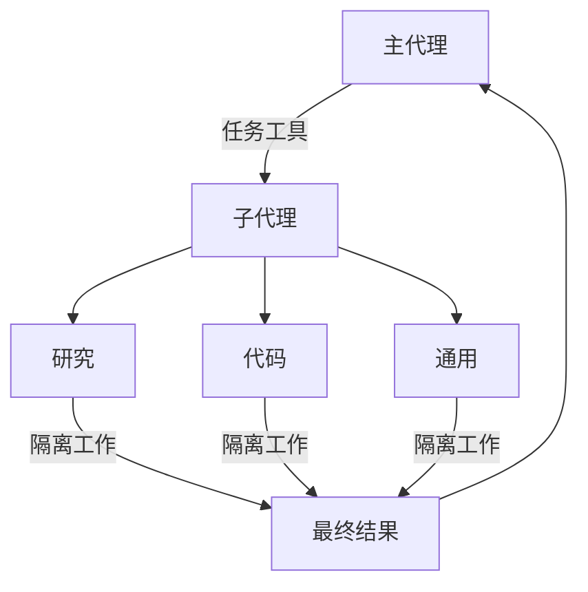

import SubagentBasicPy from '/snippets/subagent-basic-py.mdx';
import SubagentBasicJs from '/snippets/subagent-basic-js.mdx';

深度代理可以创建子代理来委派工作。您可以在 `subagents` 参数中指定自定义子代理。子代理对于[上下文隔离](https://www.dbreunig.com/2025/06/26/how-to-fix-your-context.html#context-quarantine)（保持主代理上下文清晰）以及提供专门指令非常有用。

本页涵盖**同步**子代理，其中主管会阻塞直到子代理完成。对于长时间运行的任务、并行工作流或需要中途引导和取消的情况，请参阅[异步子代理](/oss/javascript/deepagents/async-subagents)。



## 为什么使用子代理？

子代理解决了**上下文膨胀问题**。当代理使用具有大输出的工具（网络搜索、文件读取、数据库查询）时，上下文窗口会很快被中间结果填满。子代理隔离了这些详细工作——主代理只接收最终结果，而不是产生它的数十个工具调用。

**何时使用子代理：**
- ✅ 多步骤任务会弄乱主代理的上下文
- ✅ 需要自定义指令或工具的专业领域
- ✅ 需要不同模型能力的任务
- ✅ 当您希望主代理专注于高层协调时

**何时不使用子代理：**
- ❌ 简单的单步骤任务
- ❌ 当您需要维护中间上下文时
- ❌ 当开销大于收益时

## 配置

`subagents` 应该是一个字典列表或 [`CompiledSubAgent`](https://reference.langchain.com/javascript/deepagents/middleware/CompiledSubAgent) 对象。有两种类型：

### SubAgent（基于字典）

对于大多数用例，将子代理定义为匹配 [`SubAgent`](https://reference.langchain.com/javascript/deepagents/middleware/SubAgent) 规范的字典，包含以下字段：

| 字段 | 类型 | 描述 |
|-------|------|-------------|
| `name` | `str` | 必需。子代理的唯一标识符。主代理在调用 `task()` 工具时使用此名称。子代理名称成为 `AIMessage` 的元数据，用于流式传输，有助于区分代理。 |
| `description` | `str` | 必需。描述此子代理的功能。具体且以行动为导向。主代理使用此描述来决定何时委派。 |
| `system_prompt` | `str` | 必需。子代理的指令。自定义子代理必须定义自己的指令。包括工具使用指南和输出格式要求。<br></br>不继承自主代理。 |
| `tools` | `list[Callable]` | 可选。子代理可以使用的工具。保持最小化，仅包含所需内容。<br></br>默认继承自主代理。指定时，完全覆盖继承的工具。 |
| `model` | `str` \| `BaseChatModel` | 可选。覆盖主代理的模型。省略以使用主代理的模型。<br></br>默认继承自主代理。您可以传递模型标识符字符串（如 `'openai:gpt-5.4'`，使用 `'provider:model'` 格式）或 LangChain 聊天模型对象（`await initChatModel("gpt-5.4")` 或 `new ChatOpenAI({ model: "gpt-5.4" })`）。 |
| `middleware` | `list[Middleware]` | 可选。用于自定义行为、日志记录或速率限制的附加中间件。<br></br>不继承自主代理。 |
| `interrupt_on` | `dict[str, bool]` | 可选。为特定工具配置[人机回环](/oss/javascript/deepagents/human-in-the-loop)。子代理值覆盖主代理。需要检查点。<br></br>默认继承自主代理。子代理值覆盖默认值。 |
| `skills` | `list[str]` | 可选。[技能](/oss/javascript/deepagents/skills)源路径。指定时，子代理将从这些目录加载技能（例如 `["/skills/research/", "/skills/web-search/"]`）。这允许子代理拥有与主代理不同的技能集。<br></br>不继承自主代理。只有通用子代理继承主代理的技能。当子代理拥有技能时，它运行自己的独立 [`SkillsMiddleware`](https://reference.langchain.com/javascript/deepagents/middleware/createSkillsMiddleware) 实例。技能状态完全隔离——子代理加载的技能对父级不可见，反之亦然。 |
| `responseFormat` | `ResponseFormat` | 可选。子代理的[结构化输出](/oss/javascript/langchain/structured-output)模式。设置后，父级接收子代理的结果作为 JSON 而不是自由格式文本。接受 Zod 模式、JSON 模式对象、`toolStrategy(...)` 或 `providerStrategy(...)`。参见[结构化输出](#structured-output)。 |

<Tip>
    **CLI 用户：** 您也可以在磁盘上将子代理定义为 `AGENTS.md` 文件，而不是在代码中。`name`、`description` 和 `model` 字段映射到 YAML frontmatter，markdown 主体成为 `system_prompt`。参见[自定义子代理](/oss/javascript/deepagents/cli/overview#subagents)了解文件格式。

    **部署用户：** 在 `subagents/` 下定义子代理目录，每个目录有自己的 `deepagents.toml` 和 `AGENTS.md`。捆绑器会自动发现它们。参见[部署子代理](/oss/javascript/deepagents/deploy#subagents)了解完整配置参考。
</Tip>

### CompiledSubAgent

对于复杂工作流，使用预构建的 LangGraph 图作为 [`CompiledSubAgent`](https://reference.langchain.com/javascript/deepagents/middleware/CompiledSubAgent)：

| 字段 | 类型 | 描述 |
|-------|------|-------------|
| `name` | `str` | 必需。子代理的唯一标识符。子代理名称成为 `AIMessage` 的元数据，用于流式传输，有助于区分代理。 |
| `description` | `str` | 必需。此子代理的功能。 |
| `runnable` | `Runnable` | 必需。已编译的 LangGraph 图（必须先调用 `.compile()`）。 |

## 使用 SubAgent

<SubagentBasicJs />

## 使用 CompiledSubAgent

对于更复杂的用例，您可以使用 [`CompiledSubAgent`](https://reference.langchain.com/javascript/deepagents/middleware/CompiledSubAgent) 提供自定义子代理。
您可以使用 LangChain 的 [`create_agent`](https://reference.langchain.com/javascript/langchain/index/createAgent) 创建自定义子代理，或使用[图 API](/oss/javascript/langgraph/graph-api) 制作自定义 LangGraph 图。

如果您创建自定义 LangGraph 图，请确保图具有名为 `"messages"` 的[状态键](/oss/javascript/langgraph/quickstart#2-define-state)：

```typescript
import { createDeepAgent, CompiledSubAgent } from "deepagents";
import { createAgent } from "langchain";

// 创建自定义代理图
const customGraph = createAgent({
  model: yourModel,
  tools: specializedTools,
  prompt: "You are a specialized agent for data analysis...",
});

// 将其用作自定义子代理
const customSubagent: CompiledSubAgent = {
  name: "data-analyzer",
  description: "Specialized agent for complex data analysis tasks",
  runnable: customGraph,
};

const subagents = [customSubagent];

const agent = createDeepAgent({
  model: "google_genai:gemini-3.1-pro-preview",
  tools: [internetSearch],
  systemPrompt: researchInstructions,
  subagents: subagents,
});
```

## 流式传输

当流式传输跟踪信息时，代理名称在元数据中作为 `lc_agent_name` 可用。
在审查跟踪信息时，您可以使用此元数据来区分数据来自哪个代理。

以下示例创建一个名为 `main-agent` 的深度代理和一个名为 `research-agent` 的子代理：

```python
import os
from typing import Literal
from tavily import TavilyClient
from deepagents import create_deep_agent

tavily_client = TavilyClient(api_key=os.environ["TAVILY_API_KEY"])

def internet_search(
    query: str,
    max_results: int = 5,
    topic: Literal["general", "news", "finance"] = "general",
    include_raw_content: bool = False,
):
    """运行网络搜索"""
    return tavily_client.search(
        query,
        max_results=max_results,
        include_raw_content=include_raw_content,
        topic=topic,
    )

research_subagent = {
    "name": "research-agent",
    "description": "用于更深入地研究问题",
    "system_prompt": "你是一位优秀的研究员",
    "tools": [internet_search],
    "model": "google_genai:gemini-3.1-pro-preview",  # 可选覆盖，默认使用主代理模型
}
subagents = [research_subagent]

agent = create_deep_agent(
    model="google_genai:gemini-3.1-pro-preview",
    subagents=subagents,
    name="main-agent"
)
```

当您提示深度代理时，由子代理或深度代理执行的所有代理运行都会在其元数据中包含代理名称。
在这种情况下，名为 `"research-agent"` 的子代理将在任何关联的代理运行元数据中包含 `{'lc_agent_name': 'research-agent'}`：


## 结构化输出

子代理支持[结构化输出](/oss/javascript/langchain/structured-output)，因此父代理接收可预测、可解析的 JSON，而不是自由格式文本。

<Note>
子代理的结构化输出需要 `deepagents` 版本 1.8.4 或更高版本。
</Note>

在子代理配置上传递 `responseFormat`。当子代理完成时，其结构化响应被 JSON 序列化并作为 `ToolMessage` 内容返回给父代理。该模式接受 `createAgent` 支持的任何内容：Zod 模式、JSON 模式对象、`toolStrategy(...)` 或 `providerStrategy(...)`。

```typescript
import { z } from "zod";
import { createDeepAgent } from "deepagents";

const ResearchFindings = z.object({
  summary: z.string().describe("Summary of findings"),
  confidence: z.number().describe("Confidence score from 0 to 1"),
  sources: z.array(z.string()).describe("List of source URLs"),
});

const researchSubagent = {
  name: "researcher",
  description: "研究主题并返回结构化发现",
  systemPrompt: "彻底研究给定主题。返回您的发现。",
  tools: [webSearch],
  responseFormat: ResearchFindings,
};

const agent = createDeepAgent({
  model: "claude-sonnet-4-6",
  subagents: [researchSubagent],
});

const result = await agent.invoke({
  messages: [{ role: "user", content: "Research recent advances in quantum computing" }],
});

// 父级的 ToolMessage 包含 JSON 序列化的结构化数据：
// '{"summary": "...", "confidence": 0.87, "sources": ["https://..."]}'
```

如果没有 `response_format`，父级接收子代理的最后一条消息文本原样。有了它，父级总是获得匹配模式的有效 JSON，这在父级需要以编程方式处理结果或将其传递给下游工具时非常有用。

有关模式类型和策略（工具调用与提供者原生）的完整详细信息，请参阅[结构化输出](/oss/javascript/langchain/structured-output)。

## 通用子代理

除了任何用户定义的子代理外，深度代理始终可以访问一个 `general-purpose` 子代理。此子代理：

- 具有与主代理相同的系统提示
- 可以访问所有相同的工具
- 使用相同的模型（除非被覆盖）
- 继承自主代理的技能（当配置了技能时）

### 覆盖通用子代理

在您的 `subagents` 列表中包含一个 `name: "general-purpose"` 的子代理以替换默认值。使用此功能为通用子代理配置不同的模型、工具或系统提示：

```typescript
import { createDeepAgent } from "deepagents";

// 主代理使用 Gemini；通用子代理使用 GPT
const agent = await createDeepAgent({
  model: "google_genai:gemini-3.1-pro-preview",
  tools: [internetSearch],
  subagents: [
    {
      name: "general-purpose",
      description: "用于研究和多步骤任务的通用代理",
      systemPrompt: "You are a general-purpose assistant.",
      tools: [internetSearch],
      model: "openai:gpt-5.4",  // 委派任务使用不同的模型
    },
  ],
});
```

当您提供具有通用名称的子代理时，默认的通用子代理不会被添加。您的规范完全替换它。

### 何时使用它

通用子代理非常适合在没有专门行为的情况下进行上下文隔离。主代理可以将复杂的多步骤任务委派给此子代理，并获得简洁的结果，而不会因中间工具调用而膨胀。

<Card title="示例">
    主代理不进行 10 次网络搜索并用结果填充其上下文，而是委派给通用子代理：`task(name="general-purpose", task="Research quantum computing trends")`。子代理在内部执行所有搜索并仅返回摘要。
</Card>

### 技能继承

当使用 `create_deep_agent` 配置[技能](/oss/javascript/deepagents/skills)时：

- **通用子代理**：自动继承自主代理的技能
- **自定义子代理**：默认不继承技能——使用 `skills` 参数为它们提供自己的技能

<Note>
    只有配置了技能的子代理才会获得 `SkillsMiddleware` 实例——没有 `skills` 参数的自定义子代理不会。当存在时，技能状态在两个方向上完全隔离：父级的技能对子级不可见，子级的技能也不会传播回父级。
</Note>

```typescript
import { createDeepAgent, SubAgent } from "deepagents";

// 具有自己技能的研究子代理
const researchSubagent: SubAgent = {
  name: "researcher",
  description: "具有专门技能的研究助理",
  systemPrompt: "You are a researcher.",
  tools: [webSearch],
  skills: ["/skills/research/", "/skills/web-search/"],  // 子代理特定技能
};

const agent = createDeepAgent({
  model: "google_genai:gemini-3.1-pro-preview",
  skills: ["/skills/main/"],  // 主代理和 GP 子代理获得这些
  subagents: [researchSubagent],  // 仅获得 /skills/research/ 和 /skills/web-search/
});
```

## 最佳实践

### 编写清晰的描述

主代理使用描述来决定调用哪个子代理。要具体：

✅ **好：** `"分析财务数据并生成带有置信度分数的投资洞察"`

❌ **坏：** `"做财务相关的事情"`

### 保持系统提示详细

包括关于如何使用工具和格式化输出的具体指南：

```typescript
const researchSubagent = {
  name: "research-agent",
  description: "使用网络搜索进行深入研究并综合发现",
  systemPrompt: `你是一位彻底的研究员。你的工作是：

  1. 将研究问题分解为可搜索的查询
  2. 使用 internet_search 查找相关信息
  3. 将发现综合成全面但简洁的摘要
  4. 在提出主张时引用来源

  输出格式：
  - 摘要（2-3 段）
  - 关键发现（要点）
  - 来源（带 URL）

  保持回复在 500 字以下以保持上下文清晰。`,
  tools: [internetSearch],
};
```

### 最小化工具集

只给子代理它们需要的工具。这可以提高专注度和安全性：

```typescript
// ✅ 好：专注的工具集
const emailAgent = {
  name: "email-sender",
  tools: [sendEmail, validateEmail],  // 仅电子邮件相关
};

// ❌ 坏：工具太多
const emailAgentBad = {
  name: "email-sender",
  tools: [sendEmail, webSearch, databaseQuery, fileUpload],  // 不专注
};
```

### 按任务选择模型

不同的模型擅长不同的任务：

```typescript
const subagents = [
  {
    name: "contract-reviewer",
    description: "审查法律文件和合同",
    systemPrompt: "You are an expert legal reviewer...",
    tools: [readDocument, analyzeContract],
    model: "google_genai:gemini-3.1-pro-preview",  // 用于长文档的大上下文
  },
  {
    name: "financial-analyst",
    description: "分析财务数据和市场趋势",
    systemPrompt: "You are an expert financial analyst...",
    tools: [getStockPrice, analyzeFundamentals],
    model: "gpt-5.4",  // 更适合数值分析
  },
];
```

### 返回简洁的结果

指示子代理返回摘要，而不是原始数据：

```typescript
const dataAnalyst = {
  systemPrompt: `分析数据并返回：
  1. 关键洞察（3-5 个要点）
  2. 总体置信度分数
  3. 推荐的后续行动

  不要包括：
  - 原始数据
  - 中间计算
  - 详细的工具输出

  保持回复在 300 字以下。`,
};
```

## 常见模式

### 多个专门子代理

为不同领域创建专门子代理：

```typescript
import { createDeepAgent } from "deepagents";

const subagents = [
  {
    name: "data-collector",
    description: "从各种来源收集原始数据",
    systemPrompt: "收集关于该主题的全面数据",
    tools: [webSearch, apiCall, databaseQuery],
  },
  {
    name: "data-analyzer",
    description: "分析收集的数据以获取洞察",
    systemPrompt: "分析数据并提取关键洞察",
    tools: [statisticalAnalysis],
  },
  {
    name: "report-writer",
    description: "根据分析撰写精炼报告",
    systemPrompt: "根据洞察创建专业报告",
    tools: [formatDocument],
  },
];

const agent = createDeepAgent({
  model: "google_genai:gemini-3.1-pro-preview",
  systemPrompt: "您协调数据分析和报告。使用子代理处理专门任务。",
  subagents: subagents,
});
```

**工作流：**
1. 主代理创建高层计划
2. 将数据收集委派给 data-collector
3. 将结果传递给 data-analyzer
4. 将洞察发送给 report-writer
5. 编译最终输出

每个子代理在干净的上下文中工作，仅专注于其任务。

## 上下文管理

当您使用[运行时上下文](/oss/javascript/langchain/runtime)调用父代理时，该上下文会自动传播到所有子代理。每个子代理运行都会接收您在父级 `invoke` / `ainvoke` 调用上传递的相同运行时上下文。

这意味着在任何子代理内部运行的工具都可以访问您提供给父级的相同上下文值：

```typescript
import { createDeepAgent } from "deepagents";
import { tool } from "langchain";
import type { ToolRuntime } from "@langchain/core/tools";
import { z } from "zod";

const contextSchema = z.object({
  userId: z.string(),
  sessionId: z.string(),
});

const getUserData = tool(
  async (input, runtime: ToolRuntime<unknown, typeof contextSchema>) => {
    const userId = runtime.context?.userId;
    return `Data for user ${userId}: ${input.query}`;
  },
  {
    name: "get_user_data",
    description: "获取当前用户的数据",
    schema: z.object({ query: z.string() }),
  }
);

const researchSubagent = {
  name: "researcher",
  description: "为当前用户进行研究",
  systemPrompt: "You are a research assistant.",
  tools: [getUserData],
};

const agent = createDeepAgent({
  model: "google_genai:gemini-3.1-pro-preview",
  subagents: [researchSubagent],
  contextSchema,
});

// 上下文自动流向研究员子代理及其工具
const result = await agent.invoke(
  { messages: [new HumanMessage("Look up my recent activity")] },
  { context: { userId: "user-123", sessionId: "abc" } },
);
```

### 每个子代理的上下文

所有子代理都接收相同的父级上下文。要传递特定于特定子代理的配置，请使用**命名空间键**（在键前加上子代理名称，例如 `researcher:max_depth`）在扁平的 `context` 映射中，**或者**将这些设置建模为上下文类型上的单独字段：

```typescript
import { tool } from "langchain";
import type { ToolRuntime } from "@langchain/core/tools";
import { z } from "zod";

const contextSchema = z.object({
  userId: z.string(),
  researcherMaxDepth: z.number().optional(),
  factCheckerStrictMode: z.boolean().optional(),
});

const result = await agent.invoke(
  { messages: [new HumanMessage("Research this and verify the claims")] },
  {
    context: {
      userId: "user-123",                        // 所有代理共享
      "researcher:maxDepth": 3,                  // 仅用于研究员
      "fact-checker:strictMode": true,           // 仅用于事实检查器
    },
  },
);

const verifyClaim = tool(
  async (input, runtime: ToolRuntime<unknown, typeof contextSchema>) => {
    const strictMode = runtime.context?.factCheckerStrictMode ?? false;
    if (strictMode) {
      return strictVerification(input.claim);
    }
    return basicVerification(input.claim);
  },
  {
    name: "verify_claim",
    description: "验证事实主张",
    schema: z.object({ claim: z.string() }),
  }
);
```

### 识别哪个子代理调用了工具

当同一个工具在父级和多个子代理之间共享时，您可以使用 `lc_agent_name` 元数据（与[流式传输](#streaming）中使用的值相同）来确定哪个代理发起了调用：

```typescript
import { tool } from "langchain";
import type { ToolRuntime } from "@langchain/core/tools";

const sharedLookup = tool(
  async (input, runtime: ToolRuntime) => {
    const agentName = runtime.config?.metadata?.lc_agent_name;
    if (agentName === "fact-checker") {
      return strictLookup(input.query);
    }
    return generalLookup(input.query);
  },
  {
    name: "shared_lookup",
    description: "从各种来源查找信息",
    schema: z.object({ query: z.string() }),
  }
);
```

您可以结合两种模式——从 `runtime.context` 读取代理特定设置，并从 `runtime.config` 元数据读取 `lc_agent_name` 以分支工具行为。

```typescript
const flexibleSearch = tool(
  async (input, runtime: ToolRuntime<unknown, typeof contextSchema>) => {
    const agentName = runtime.config?.metadata?.lc_agent_name ?? "unknown";
    const ctx = runtime.context;
    const maxResults =
      agentName === "researcher" ? ctx?.researcherMaxDepth ?? 5 : 5;
    const includeRaw = false;

    return performSearch(input.query, { maxResults, includeRaw });
  },
  {
    name: "flexible_search",
    description: "使用代理特定设置进行搜索",
    schema: z.object({ query: z.string() }),
  }
);
```

## 故障排除

### 子代理未被调用

**问题**：主代理尝试自己完成工作，而不是委派。

**解决方案**：

1. **使描述更具体：**

   ```typescript
   // ✅ 好
   { name: "research-specialist", description: "使用网络搜索对特定主题进行深入研究。当您需要需要多次搜索的详细信息时使用。" }

   // ❌ 坏
   { name: "helper", description: "帮助处理事情" }
   ```

2. **指示主代理进行委派：**

   ```typescript
   const agent = createDeepAgent({
     systemPrompt: `...您的指令...

     重要提示：对于复杂任务，请使用 task() 工具委派给您的子代理。
     这可以保持您的上下文清晰并改善结果。`,
     subagents: [...]
   });
   ```

### 上下文仍然膨胀

**问题**：尽管使用了子代理，上下文仍然被填满。

**解决方案**：

1. **指示子代理返回简洁的结果：**

   ```typescript
   systemPrompt: `...

   重要提示：仅返回必要的摘要。
   不要包括原始数据、中间搜索结果或详细的工具输出。
   您的回复应在 500 字以下。`
   ```

2. **对大型数据使用文件系统：**

   ```typescript
   systemPrompt: `当您收集大量数据时：
   1. 将原始数据保存到 /data/raw_results.txt
   2. 处理和分析数据
   3. 仅返回分析摘要

   这可以保持上下文清晰。`
   ```

### 选择了错误的子代理

**问题**：主代理为任务调用了不适当的子代理。

**解决方案**：在描述中清晰地区分子代理：

```typescript
const subagents = [
  {
    name: "quick-researcher",
    description: "用于简单、快速的研究问题，需要 1-2 次搜索。当您需要基本事实或定义时使用。",
  },
  {
    name: "deep-researcher",
    description: "用于复杂、深入的研究，需要多次搜索、综合和分析。用于综合报告。",
  }
];
```

:::

---

<div className="source-links">
<Callout icon="edit">
    [在 GitHub 上编辑此页面](https://github.com/langchain-ai/docs/edit/main/src/oss/deepagents/subagents.mdx) 或[提交问题](https://github.com/langchain-ai/docs/issues/new/choose)。
</Callout>
<Callout icon="terminal-2">
    [通过 MCP 将这些文档连接到 Claude、VSCode 等](/use-these-docs) 以获取实时答案。
</Callout>
</div>