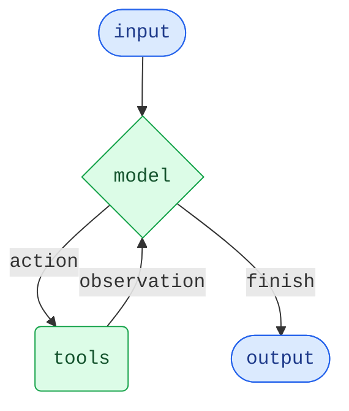

代理将语言模型与[工具](/oss/javascript/langchain/tools)相结合，创建能够推理任务、决定使用哪些工具并迭代工作以达成解决方案的系统。

`createAgent()` 提供了一个生产就绪的代理实现。

[一个 LLM 代理在循环中运行工具以实现目标](https://simonwillison.net/2025/Sep/18/agents/)。
代理会一直运行，直到满足停止条件——即当模型发出最终输出或达到迭代限制时。



<Info>

`createAgent()` 使用 [LangGraph](/oss/javascript/langgraph/overview) 构建一个基于**图**的代理运行时。图由节点（步骤）和边（连接）组成，定义了您的代理如何处理信息。代理通过此图移动，执行节点，例如模型节点（调用模型）、工具节点（执行工具）或中间件。

了解更多关于[图 API](/oss/javascript/langgraph/graph-api) 的信息。

</Info>

## 核心组件

### 模型

[模型](/oss/javascript/langchain/models) 是您代理的推理引擎。可以通过多种方式指定，支持静态和动态模型选择。

#### 静态模型

静态模型在创建代理时配置一次，并在整个执行过程中保持不变。这是最常见且最直接的方法。

要从 <Tooltip tip="遵循格式 `provider:model` 的字符串（例如 openai:gpt-5）" cta="查看映射" href="https://reference.langchain.com/python/langchain/models/#langchain.chat_models.init_chat_model(model)">模型标识符字符串</Tooltip> 初始化静态模型：

```ts wrap
import { createAgent } from "langchain";

const agent = createAgent({
  model: "openai:gpt-5",
  tools: []
});
```

模型标识符字符串使用格式 `provider:model`（例如 `"openai:gpt-5"`）。如果您需要对模型配置有更多控制，可以直接使用提供者包初始化模型实例：

```ts wrap
import { createAgent } from "langchain";
import { ChatOpenAI } from "@langchain/openai";

const model = new ChatOpenAI({
  model: "gpt-4.1",
  temperature: 0.1,
  maxTokens: 1000,
  timeout: 30
});

const agent = createAgent({
  model,
  tools: []
});
```

模型实例让您完全控制配置。当您需要设置特定参数（如 `temperature`、`max_tokens`、`timeouts`）或配置 API 密钥、`base_url` 和其他提供者特定设置时，请使用它们。请参阅 [API 参考](/oss/javascript/integrations/providers/) 以查看模型上可用的参数和方法。

#### 动态模型

动态模型在 <Tooltip tip="代理的执行环境，包含不可变配置和在整个代理执行过程中持续存在的上下文数据（例如，用户 ID、会话详细信息或应用程序特定配置）。">运行时</Tooltip> 根据当前 <Tooltip tip="流经代理执行的数据，包括消息、自定义字段以及在处理过程中需要跟踪和可能修改的任何信息（例如，用户偏好或工具使用统计）。">状态</Tooltip> 和上下文进行选择。这支持复杂的路由逻辑和成本优化。

要使用动态模型，请使用 `wrapModelCall` 创建一个中间件来修改请求中的模型：

```ts
import { ChatOpenAI } from "@langchain/openai";
import { createAgent, createMiddleware } from "langchain";

const basicModel = new ChatOpenAI({ model: "gpt-4.1-mini" });
const advancedModel = new ChatOpenAI({ model: "gpt-4.1" });

const dynamicModelSelection = createMiddleware({
  name: "DynamicModelSelection",
  wrapModelCall: (request, handler) => {
    // 根据对话复杂度选择模型
    const messageCount = request.messages.length;

    return handler({
        ...request,
        model: messageCount > 10 ? advancedModel : basicModel,
    });
  },
});

const agent = createAgent({
  model: "gpt-4.1-mini", // 基础模型（当 messageCount ≤ 10 时使用）
  tools,
  middleware: [dynamicModelSelection],
});
```

有关中间件和高级模式的更多详细信息，请参阅[中间件文档](/oss/javascript/langchain/middleware)。

<Tip>
有关模型配置的详细信息，请参阅[模型](/oss/javascript/langchain/models)。有关动态模型选择模式，请参阅[中间件中的动态模型](/oss/javascript/langchain/middleware#dynamic-model)。
</Tip>

### 工具

工具赋予代理采取行动的能力。代理通过促进以下功能，超越了简单的仅模型工具绑定：

- 按顺序进行多次工具调用（由单个提示触发）
- 在适当时进行并行工具调用
- 基于先前结果的动态工具选择
- 工具重试逻辑和错误处理
- 跨工具调用的状态持久化

更多信息，请参阅[工具](/oss/javascript/langchain/tools)。

#### 静态工具

静态工具在创建代理时定义，并在整个执行过程中保持不变。这是最常见且最直接的方法。

要定义具有静态工具的代理，请将工具列表传递给代理。

```ts wrap
import * as z from "zod";
import { createAgent, tool } from "langchain";

const search = tool(
  ({ query }) => `Results for: ${query}`,
  {
    name: "search",
    description: "Search for information",
    schema: z.object({
      query: z.string().describe("The query to search for"),
    }),
  }
);

const getWeather = tool(
  ({ location }) => `Weather in ${location}: Sunny, 72°F`,
  {
    name: "get_weather",
    description: "Get weather information for a location",
    schema: z.object({
      location: z.string().describe("The location to get weather for"),
    }),
  }
);

const agent = createAgent({
  model: "gpt-4.1",
  tools: [search, getWeather],
});
```

如果提供了空工具列表，代理将由一个没有工具调用能力的单个 LLM 节点组成。

#### 动态工具

使用动态工具时，代理可用的工具集在运行时修改，而不是全部预先定义。并非每个工具都适用于每种情况。工具太多可能会使模型不堪重负（上下文过载）并增加错误；工具太少会限制功能。动态工具选择支持根据身份验证状态、用户权限、功能标志或对话阶段调整可用工具集。

根据工具是否提前已知，有两种方法：

<Tabs>
  <Tab title="过滤预注册工具">

    当所有可能的工具在代理创建时已知时，您可以预先注册它们，并根据状态、权限或上下文动态过滤暴露给模型的工具。

    <Tabs>
      <Tab title="状态">
        仅在达到特定对话里程碑后启用高级工具：

        ```typescript
        import { createMiddleware, tool } from "langchain";
        import { createDeepAgent } from "deepagents";

        const stateBasedTools = createMiddleware({
            name: "StateBasedTools",
            wrapModelCall: (request, handler) => {
                // 从状态读取：检查身份验证和对话长度
                const state = request.state as typeof request.state & {
                    authenticated?: boolean;
                };
                const isAuthenticated = state.authenticated ?? false;
                const messageCount = state.messages.length;

                let filteredTools = request.tools;

                // 仅在身份验证后启用敏感工具
                if (!isAuthenticated) {
                    filteredTools = request.tools.filter(
                        (t: any) => typeof t.name === "string" && t.name.startsWith("public_"),
                    );
                } else if (messageCount < 5) {
                    filteredTools = request.tools.filter(
                        (t: any) => typeof t.name === "string" && t.name !== "advanced_search",
                    );
                }

                return handler({ ...request, tools: filteredTools });
            },
        });

        const agent = await createDeepAgent({
            model: "claude-sonnet-4-20250514",
            tools: tools,
            middleware: [stateBasedTools] as any,
        });
        ```

      </Tab>

      <Tab title="存储">
        根据用户偏好或存储中的功能标志过滤工具：

        ```typescript
        import { createMiddleware } from "langchain";
        import { createDeepAgent, StoreBackend } from "deepagents";
        import * as z from "zod";
        import { InMemoryStore } from "@langchain/langgraph";

        const contextSchema = z.object({
          userId: z.string(),
        });

        const storeBasedTools = createMiddleware({
          name: "StoreBasedTools",
          contextSchema,
          wrapModelCall: async (request, handler) => {
            const userId =
              (request.runtime?.context as { userId?: string } | undefined)?.userId ??
                "user-123";

            // 从存储读取：获取用户的启用功能
            const runtimeStore = request.runtime?.store as InMemoryStore | undefined;
            const rawFlags = (await runtimeStore?.get(
              ["features"],
              userId as string,
            )) as unknown;
            const featureFlags = rawFlags as FeatureFlags | undefined;

            let filteredTools = request.tools;

            if (featureFlags) {
              const enabledFeatures = featureFlags.enabledTools || [];
              filteredTools = request.tools.filter((t) =>
                enabledFeatures.includes(t.name as string)
              );
            }

            return handler({ ...request, tools: filteredTools });
          },
        });

        const agent = await createDeepAgent({
          model: "claude-sonnet-4-20250514",
          backend: new StoreBackend(),
          store,
          checkpointer,
          tools,
          middleware: [storeBasedTools] as any,
        });
        ```

      </Tab>

      <Tab title="运行时上下文">
        根据运行时上下文中的用户权限过滤工具：

        ```typescript
        import * as z from "zod";
        import { createMiddleware } from "langchain";
        import { createDeepAgent } from "deepagents";

        const contextSchema = z.object({
          userRole: z.string(),
        });

        const contextBasedTools = createMiddleware({
          name: "ContextBasedTools",
          contextSchema,
          wrapModelCall: (request, handler) => {
            // 从运行时上下文读取：获取用户角色
            const userRole = request.runtime.context.userRole;

            let filteredTools = request.tools;

            if (userRole === "admin") {
              // 管理员获得所有工具
            } else if (userRole === "editor") {
              filteredTools = request.tools.filter((t) => t.name !== "delete_data");
            } else {
              filteredTools = request.tools.filter(
                (t) => (t.name as string).startsWith("read_"),
              );
            }

            return handler({ ...request, tools: filteredTools });
          },
        });

        const agent = await createDeepAgent({
          model: "claude-sonnet-4-20250514",
          store,
          checkpointer,
          tools,
          middleware: [contextBasedTools] as any,
        });
        ```

      </Tab>
    </Tabs>

    此方法在以下情况下最佳：
    - 所有可能的工具在编译/启动时已知
    - 您希望基于权限、功能标志或对话状态进行过滤
    - 工具是静态的，但其可用性是动态的

    有关更多示例，请参阅[动态选择工具](/oss/javascript/langchain/middleware/custom#dynamically-selecting-tools)。

  </Tab>

  <Tab title="运行时工具注册">

    当工具在运行时发现或创建时（例如，从 MCP 服务器加载、基于用户数据生成或从远程注册表获取），您需要同时注册工具并动态处理其执行。

    这需要两个中间件钩子：
    1. `wrap_model_call` - 将动态工具添加到请求中
    2. `wrap_tool_call` - 处理动态添加工具的执行

    ```typescript
    import { createAgent, createMiddleware, tool } from "langchain";
    import * as z from "zod";

    // 一个将在运行时动态添加的工具
    const calculateTip = tool(
      ({ billAmount, tipPercentage = 20 }) => {
        const tip = billAmount * (tipPercentage / 100);
        return `Tip: $${tip.toFixed(2)}, Total: $${(billAmount + tip).toFixed(2)}`;
      },
      {
        name: "calculate_tip",
        description: "Calculate the tip amount for a bill",
        schema: z.object({
          billAmount: z.number().describe("The bill amount"),
          tipPercentage: z.number().default(20).describe("Tip percentage"),
        }),
      }
    );

    const dynamicToolMiddleware = createMiddleware({
      name: "DynamicToolMiddleware",
      wrapModelCall: (request, handler) => {
        // 将动态工具添加到请求中
        // 这可以从 MCP 服务器、数据库等加载
        return handler({
          ...request,
          tools: [...request.tools, calculateTip],
        });
      },
      wrapToolCall: (request, handler) => {
        // 处理动态工具的执行
        if (request.toolCall.name === "calculate_tip") {
          return handler({ ...request, tool: calculateTip });
        }
        return handler(request);
      },
    });

    const agent = createAgent({
      model: "gpt-4o",
      tools: [getWeather], // 仅在此处注册静态工具
      middleware: [dynamicToolMiddleware],
    });

    // 代理现在可以使用 getWeather 和 calculateTip
    const result = await agent.invoke({
      messages: [{ role: "user", content: "Calculate a 20% tip on $85" }],
    });
    ```

    此方法在以下情况下最佳：
    - 工具在运行时发现（例如，从 MCP 服务器）
    - 工具基于用户数据或配置动态生成
    - 您正在与外部工具注册表集成

    <Note>
    `wrap_tool_call` 钩子对于运行时注册的工具是必需的，因为代理需要知道如何执行不在原始工具列表中的工具。没有它，代理将不知道如何调用动态添加的工具。
    </Note>

  </Tab>
</Tabs>

<Tip>
要了解有关工具的更多信息，请参阅[工具](/oss/javascript/langchain/tools)。
</Tip>

#### 工具错误处理

要自定义工具错误的处理方式，请在自定义中间件中使用 `wrapToolCall` 钩子：

```ts wrap
import { createAgent, createMiddleware, ToolMessage } from "langchain";

const handleToolErrors = createMiddleware({
  name: "HandleToolErrors",
  wrapToolCall: async (request, handler) => {
    try {
      return await handler(request);
    } catch (error) {
      // 返回自定义错误消息给模型
      return new ToolMessage({
        content: `Tool error: Please check your input and try again. (${error})`,
        tool_call_id: request.toolCall.id!,
      });
    }
  },
});

const agent = createAgent({
  model: "gpt-4.1",
  tools: [
    /* ... */
  ],
  middleware: [handleToolErrors],
});
```

当工具失败时，代理将返回一个带有自定义错误消息的 [`ToolMessage`](https://reference.langchain.com/javascript/langchain-core/messages/ToolMessage)。

#### ReAct 循环中的工具使用

代理遵循 ReAct（“推理 + 行动”）模式，在简短的推理步骤和有针对性的工具调用之间交替进行，并将结果观察结果输入后续决策，直到可以提供最终答案。

<Accordion title="ReAct 循环示例">
**提示：** 识别当前最受欢迎的无线耳机并验证库存。

```
================================ Human Message =================================

Find the most popular wireless headphones right now and check if they're in stock
```

* **推理**：“流行度是时间敏感的，我需要使用提供的搜索工具。”
* **行动**：调用 `search_products("wireless headphones")`

```
================================== Ai Message ==================================
Tool Calls:
  search_products (call_abc123)
 Call ID: call_abc123
  Args:
    query: wireless headphones
```
```
================================= Tool Message =================================

Found 5 products matching "wireless headphones". Top 5 results: WH-1000XM5, ...
```

* **推理**：“我需要在回答之前确认排名靠前的项目的库存。”
* **行动**：调用 `check_inventory("WH-1000XM5")`

```
================================== Ai Message ==================================
Tool Calls:
  check_inventory (call_def456)
 Call ID: call_def456
  Args:
    product_id: WH-1000XM5
```
```
================================= Tool Message =================================

Product WH-1000XM5: 10 units in stock
```

* **推理**：“我有了最受欢迎的型号及其库存状态。我现在可以回答用户的问题了。”
* **行动**：生成最终答案

```
================================== Ai Message ==================================

I found wireless headphones (model WH-1000XM5) with 10 units in stock...
```
</Accordion>

### 系统提示

您可以通过提供提示来塑造代理处理任务的方式。`systemPrompt` 参数可以作为字符串提供：

```ts wrap
const agent = createAgent({
  model,
  tools,
  systemPrompt: "You are a helpful assistant. Be concise and accurate.",
});
```

当未提供 `systemPrompt` 时，代理将直接从消息中推断其任务。

`systemPrompt` 参数接受 `string` 或 `SystemMessage`。使用 `SystemMessage` 可让您更好地控制提示结构，这对于提供者特定功能（如 [Anthropic 的提示缓存](/oss/javascript/integrations/chat/anthropic#prompt-caching)）非常有用：

```ts wrap
import { createAgent } from "langchain";
import { SystemMessage, HumanMessage } from "@langchain/core/messages";

const literaryAgent = createAgent({
  model: "anthropic:claude-sonnet-4-5",
  systemPrompt: new SystemMessage({
    content: [
      {
        type: "text",
        text: "You are an AI assistant tasked with analyzing literary works.",
      },
      {
        type: "text",
        text: "<the entire contents of 'Pride and Prejudice'>",
        cache_control: { type: "ephemeral" }
      }
    ]
  })
});

const result = await literaryAgent.invoke({
  messages: [new HumanMessage("Analyze the major themes in 'Pride and Prejudice'.")]
});
```

带有 `{ type: "ephemeral" }` 的 `cache_control` 字段告诉 Anthropic 缓存该内容块，从而减少使用相同系统提示的重复请求的延迟和成本。

#### 动态系统提示

对于更高级的用例，您需要根据运行时上下文或代理状态修改系统提示，您可以使用[中间件](/oss/javascript/langchain/middleware)。

```typescript wrap
import * as z from "zod";
import { createAgent, dynamicSystemPromptMiddleware } from "langchain";

const contextSchema = z.object({
  userRole: z.enum(["expert", "beginner"]),
});

const agent = createAgent({
  model: "gpt-4.1",
  tools: [/* ... */],
  contextSchema,
  middleware: [
    dynamicSystemPromptMiddleware<z.infer<typeof contextSchema>>((state, runtime) => {
      const userRole = runtime.context.userRole || "user";
      const basePrompt = "You are a helpful assistant.";

      if (userRole === "expert") {
        return `${basePrompt} Provide detailed technical responses.`;
      } else if (userRole === "beginner") {
        return `${basePrompt} Explain concepts simply and avoid jargon.`;
      }
      return basePrompt;
    }),
  ],
});

// 系统提示将根据上下文动态设置
const result = await agent.invoke(
  { messages: [{ role: "user", content: "Explain machine learning" }] },
  { context: { userRole: "expert" } }
);
```

<Tip>
有关消息类型和格式的更多详细信息，请参阅[消息](/oss/javascript/langchain/messages)。有关全面的中间件文档，请参阅[中间件](/oss/javascript/langchain/middleware)。
</Tip>

### 名称

为代理设置一个可选的 `name`。当将代理作为子图添加到[多代理系统](/oss/javascript/langchain/multi-agent)时，这用作节点标识符：

```ts
const agent = createAgent({
  model,
  tools,
  name: "research_assistant",
});
```

<Warning>
    代理名称首选 `snake_case`（例如，`research_assistant` 而不是 `Research Assistant`）。某些模型提供商会因名称包含空格或特殊字符而拒绝并报错。仅使用字母数字字符、下划线和连字符可确保与所有提供者的兼容性。这同样适用于[工具名称](/oss/javascript/langchain/tools)。
</Warning>

## 调用

您可以通过向其 [`State`](/oss/javascript/langgraph/graph-api#state) 传递更新来调用代理。所有代理的状态中都包含一个[消息序列](/oss/javascript/langgraph/use-graph-api#messagesvalue)；要调用代理，请传递一条新消息：

```typescript
await agent.invoke({
  messages: [{ role: "user", content: "What's the weather in San Francisco?" }],
})
```

有关代理的流式传输步骤和/或令牌，请参阅[流式传输](/oss/javascript/langchain/streaming)指南。

否则，代理遵循 LangGraph [Graph API](/oss/javascript/langgraph/use-graph-api)，并支持所有相关方法，例如 `stream` 和 `invoke`。

<Tip>
使用 [LangSmith](/langsmith/home) 来跟踪、调试和评估您的代理。
</Tip>

## 高级概念

### 结构化输出

在某些情况下，您可能希望代理以特定格式返回输出。LangChain 提供了一种简单、通用的方法，使用 `responseFormat` 参数来实现这一点。

```ts wrap
import * as z from "zod";
import { createAgent } from "langchain";

const ContactInfo = z.object({
  name: z.string(),
  email: z.string(),
  phone: z.string(),
});

const agent = createAgent({
  model: "gpt-4.1",
  responseFormat: ContactInfo,
});

const result = await agent.invoke({
  messages: [
    {
      role: "user",
      content: "Extract contact info from: John Doe, john@example.com, (555) 123-4567",
    },
  ],
});

console.log(result.structuredResponse);
// {
//   name: 'John Doe',
//   email: 'john@example.com',
//   phone: '(555) 123-4567'
// }
```

<Tip>
    要了解结构化输出，请参阅[结构化输出](/oss/javascript/langchain/structured-output)。
</Tip>

### 内存

代理通过消息状态自动维护对话历史记录。您还可以配置代理使用自定义状态模式，以在对话期间记住附加信息。

存储在状态中的信息可以被认为是代理的[短期记忆](/oss/javascript/langchain/short-term-memory)：

```ts wrap
import { z } from "zod/v4";
import { StateSchema, MessagesValue } from "@langchain/langgraph";
import { createAgent } from "langchain";

const CustomAgentState = new StateSchema({
  messages: MessagesValue,
  userPreferences: z.record(z.string(), z.string()),
});

const customAgent = createAgent({
  model: "gpt-4.1",
  tools: [],
  stateSchema: CustomAgentState,
});
```

<Tip>
    要了解有关内存的更多信息，请参阅[内存](/oss/javascript/concepts/memory)。有关实现跨会话持久化的长期记忆的信息，请参阅[长期记忆](/oss/javascript/langchain/long-term-memory)。
</Tip>

### 流式传输

我们已经看到如何使用 `invoke` 调用代理以获取最终响应。如果代理执行多个步骤，这可能需要一段时间。为了显示中间进度，我们可以在消息发生时流式传回消息。

```ts
const stream = await agent.stream(
  {
    messages: [{
      role: "user",
      content: "Search for AI news and summarize the findings"
    }],
  },
  { streamMode: "values" }
);

for await (const chunk of stream) {
  // 每个块包含该时间点的完整状态
  const latestMessage = chunk.messages.at(-1);
  if (latestMessage?.content) {
    console.log(`Agent: ${latestMessage.content}`);
  } else if (latestMessage?.tool_calls) {
    const toolCallNames = latestMessage.tool_calls.map((tc) => tc.name);
    console.log(`Calling tools: ${toolCallNames.join(", ")}`);
  }
}
```

<Tip>
有关流式传输的更多详细信息，请参阅[流式传输](/oss/javascript/langchain/streaming)。
</Tip>

### 中间件

[中间件](/oss/javascript/langchain/middleware) 为在不同执行阶段自定义代理行为提供了强大的可扩展性。您可以使用中间件来：

- 在调用模型之前处理状态（例如，消息修剪、上下文注入）
- 修改或验证模型的响应（例如，护栏、内容过滤）
- 使用自定义逻辑处理工具执行错误
- 基于状态或上下文实现动态模型选择
- 添加自定义日志记录、监控或分析

中间件无缝集成到代理的执行中，允许您在关键点拦截和修改数据流，而无需更改核心代理逻辑。

<Tip>
有关中间件的全面文档，包括 `beforeModel`、`afterModel` 和 `wrapToolCall` 等钩子，请参阅[中间件](/oss/javascript/langchain/middleware)。
</Tip>

---

<div className="source-links">
<Callout icon="edit">
    [在 GitHub 上编辑此页面](https://github.com/langchain-ai/docs/edit/main/src/oss/langchain/agents.mdx) 或[提交问题](https://github.com/langchain-ai/docs/issues/new/choose)。
</Callout>
<Callout icon="terminal-2">
    [通过 MCP 将这些文档连接到 Claude、VSCode 等](/use-these-docs) 以获取实时答案。
</Callout>
</div>