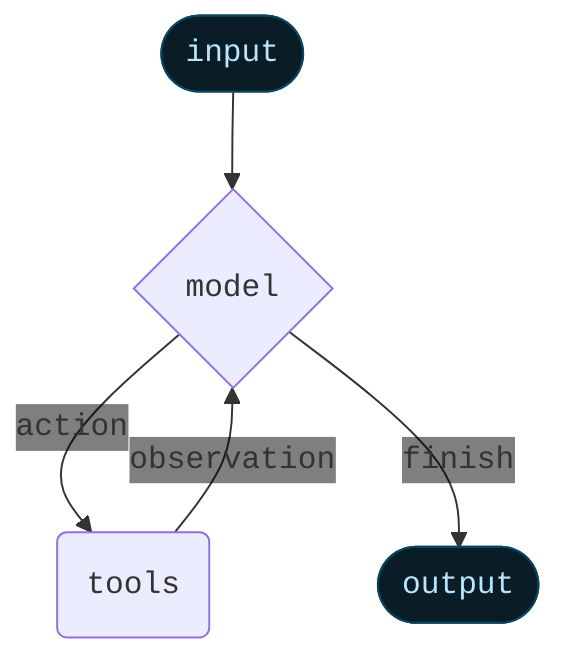

Agent 将语言模型与[工具](/oss/javascript/langchain/tools)结合起来，创建能够推理任务、决定使用哪些工具并迭代地朝着解决方案努力的系统。


`createAgent()` 提供了一个生产就绪的 Agent 实现。


[LLM Agent 在循环中运行工具以实现目标](https://simonwillison.net/2025/Sep/18/agents/)。
Agent 会一直运行直到满足停止条件——即当模型发出最终输出或达到迭代限制时。



<Info>


`createAgent()` 使用 [LangGraph](/oss/javascript/langgraph/overview) 构建基于**图**的 Agent 运行时。图由节点（步骤）和边（连接）组成，定义了 Agent 如何处理信息。Agent 在这个图中移动，执行诸如模型节点（调用模型）、工具节点（执行工具）或中间件等节点。


了解更多关于 [Graph API](/oss/javascript/langgraph/graph-api)。

</Info>

## 核心组件

### 模型

[模型](/oss/javascript/langchain/models)是 Agent 的推理引擎。它可以通过多种方式指定，支持静态和动态模型选择。

#### 静态模型

静态模型在创建 Agent 时配置一次，并在整个执行过程中保持不变。这是最常见和最直接的方法。

从<Tooltip tip="遵循 `provider:model` 格式的字符串（例如 openai:gpt-5）" cta="查看映射" href="https://reference.langchain.com/python/langchain/models/#langchain.chat_models.init_chat_model(model)">模型标识符字符串</Tooltip>初始化静态模型：


```ts wrap
import { createAgent } from "langchain";

const agent = createAgent({
  model: "openai:gpt-5",
  tools: []
});
```


模型标识符字符串使用 `provider:model` 格式（例如 `"openai:gpt-5"`）。你可能想要更好地控制模型配置，在这种情况下，你可以使用服务商包直接初始化模型实例：

```ts wrap
import { createAgent } from "langchain";
import { ChatOpenAI } from "@langchain/openai";

const model = new ChatOpenAI({
  model: "gpt-4o",
  temperature: 0.1,
  maxTokens: 1000,
  timeout: 30
});

const agent = createAgent({
  model,
  tools: []
});
```

模型实例让你完全控制配置。当你需要设置特定参数如 `temperature`、`max_tokens`、`timeouts`，或配置 API 密钥、`base_url` 和其他服务商特定设置时使用它们。参考 [API 参考文档](/oss/javascript/integrations/providers/)查看模型上可用的参数和方法。


#### 动态模型

动态模型在<Tooltip tip="Agent 的执行环境，包含在 Agent 执行期间持续存在的不可变配置和上下文数据（例如用户 ID、会话详情或应用程序特定配置）。">运行时</Tooltip>根据当前<Tooltip tip="流经 Agent 执行的数据，包括消息、自定义字段以及在处理过程中需要跟踪和可能修改的任何信息（例如用户偏好或工具使用统计）。">状态</Tooltip>和上下文选择。这支持复杂的路由逻辑和成本优化。


要使用动态模型，请使用 `wrapModelCall` 创建中间件来修改请求中的模型：

```ts
import { ChatOpenAI } from "@langchain/openai";
import { createAgent, createMiddleware } from "langchain";

const basicModel = new ChatOpenAI({ model: "gpt-4o-mini" });
const advancedModel = new ChatOpenAI({ model: "gpt-4o" });

const dynamicModelSelection = createMiddleware({
  name: "DynamicModelSelection",
  wrapModelCall: (request, handler) => {
    // Choose model based on conversation complexity
    const messageCount = request.messages.length;

    return handler({
        ...request,
        model: messageCount > 10 ? advancedModel : basicModel,
    });
  },
});

const agent = createAgent({
  model: "gpt-4o-mini", // Base model (used when messageCount ≤ 10)
  tools,
  middleware: [dynamicModelSelection],
});
```

有关中间件和高级模式的更多详细信息，请参阅[中间件文档](/oss/javascript/langchain/middleware)。


<Tip>
有关模型配置详细信息，请参阅[模型](/oss/javascript/langchain/models)。有关动态模型选择模式，请参阅[中间件中的动态模型](/oss/javascript/langchain/middleware#dynamic-model)。
</Tip>

### 工具

工具赋予 Agent 执行操作的能力。Agent 通过以下方式超越简单的仅模型工具绑定：

- 按顺序进行多个工具调用（由单个提示触发）
- 在适当时并行调用工具
- 基于先前结果动态选择工具
- 工具重试逻辑和错误处理
- 跨工具调用的状态持久化

有关更多信息，请参阅[工具](/oss/javascript/langchain/tools)。

#### 定义工具

向 Agent 传递工具列表。


```ts wrap
import * as z from "zod";
import { createAgent, tool } from "langchain";

const search = tool(
  ({ query }) => `Results for: ${query}`,
  {
    name: "search",
    description: "Search for information",
    schema: z.object({
      query: z.string().describe("The query to search for"),
    }),
  }
);

const getWeather = tool(
  ({ location }) => `Weather in ${location}: Sunny, 72°F`,
  {
    name: "get_weather",
    description: "Get weather information for a location",
    schema: z.object({
      location: z.string().describe("The location to get weather for"),
    }),
  }
);

const agent = createAgent({
  model: "gpt-4o",
  tools: [search, getWeather],
});
```


如果提供空的工具列表，Agent 将由一个没有工具调用能力的单一 LLM 节点组成。

#### 工具错误处理


要自定义工具错误的处理方式，请在自定义中间件中使用 `wrapToolCall` 钩子：

```ts wrap
import { createAgent, createMiddleware, ToolMessage } from "langchain";

const handleToolErrors = createMiddleware({
  name: "HandleToolErrors",
  wrapToolCall: async (request, handler) => {
    try {
      return await handler(request);
    } catch (error) {
      // Return a custom error message to the model
      return new ToolMessage({
        content: `Tool error: Please check your input and try again. (${error})`,
        tool_call_id: request.toolCall.id!,
      });
    }
  },
});

const agent = createAgent({
  model: "gpt-4o",
  tools: [
    /* ... */
  ],
  middleware: [handleToolErrors],
});
```

当工具失败时，Agent 将返回带有自定义错误消息的 [`ToolMessage`](https://reference.langchain.com/javascript/classes/_langchain_core.messages.ToolMessage.html)。


#### ReAct 循环中的工具使用

Agent 遵循 ReAct（"Reasoning + Acting"，即推理 + 行动）模式，在简短的推理步骤与有针对性的工具调用之间交替，并将结果观察反馈到后续决策中，直到它们能够提供最终答案。

<Accordion title="ReAct 循环示例">
**提示词：** 识别当前最流行的无线耳机并验证可用性。

```
================================ Human Message =================================

Find the most popular wireless headphones right now and check if they're in stock
```

* **推理**："流行度是时间敏感的，我需要使用提供的搜索工具。"
* **行动**：调用 `search_products("wireless headphones")`

```
================================== Ai Message ==================================
Tool Calls:
  search_products (call_abc123)
 Call ID: call_abc123
  Args:
    query: wireless headphones
```
```
================================= Tool Message =================================

Found 5 products matching "wireless headphones". Top 5 results: WH-1000XM5, ...
```

* **推理**："在回答之前，我需要确认排名第一的商品的可用性。"
* **行动**：调用 `check_inventory("WH-1000XM5")`

```
================================== Ai Message ==================================
Tool Calls:
  check_inventory (call_def456)
 Call ID: call_def456
  Args:
    product_id: WH-1000XM5
```
```
================================= Tool Message =================================

Product WH-1000XM5: 10 units in stock
```

* **推理**："我有最流行的型号及其库存状态。现在我可以回答用户的问题了。"
* **行动**：生成最终答案

```
================================== Ai Message ==================================

I found wireless headphones (model WH-1000XM5) with 10 units in stock...
```
</Accordion>

#### 动态工具

在某些场景中，你需要在运行时修改 Agent 可用的工具集，而不是预先定义所有工具。根据工具是否提前已知，有两种方法：

<Tabs>
  <Tab title="过滤预注册的工具">

    当所有可能的工具在 Agent 创建时已知时，你可以预注册它们，并根据状态、权限或上下文动态过滤哪些工具暴露给模型。


    ```typescript
    import { createAgent, createMiddleware } from "langchain";

    const filterTools = createMiddleware({
      name: "FilterTools",
      wrapModelCall: (request, handler) => {
        const userRole = request.runtime.context.userRole;

        let tools;
        if (userRole === "admin") {
          // Admins get all tools
          tools = request.tools;
        } else {
          // Regular users get read-only tools
          tools = request.tools.filter((t) => t.name.startsWith("read_"));
        }

        return handler({ ...request, tools });
      },
    });

    const agent = createAgent({
      model: "gpt-4o",
      tools: [readData, writeData, deleteData], // All tools pre-registered
      middleware: [filterTools],
    });
    ```


    此方法最适合以下情况：
    - 所有可能的工具在编译/启动时已知
    - 你想基于权限、功能标志或对话状态进行过滤
    - 工具是静态的，但其可用性是动态的

    有关更多示例，请参阅[动态选择工具](/oss/javascript/langchain/middleware/custom#dynamically-selecting-tools)。

  </Tab>

  <Tab title="运行时工具注册">

    当工具在运行时被发现或创建时（例如，从 MCP 服务器加载、基于用户数据生成或从远程注册表获取），你需要同时注册工具并动态处理它们的执行。

    这需要两个中间件钩子：
    1. `wrap_model_call` - 将动态工具添加到请求中
    2. `wrap_tool_call` - 处理动态添加工具的执行


    ```typescript
    import { createAgent, createMiddleware, tool } from "langchain";
    import * as z from "zod";

    // A tool that will be added dynamically at runtime
    const calculateTip = tool(
      ({ billAmount, tipPercentage = 20 }) => {
        const tip = billAmount * (tipPercentage / 100);
        return `Tip: $${tip.toFixed(2)}, Total: $${(billAmount + tip).toFixed(2)}`;
      },
      {
        name: "calculate_tip",
        description: "Calculate the tip amount for a bill",
        schema: z.object({
          billAmount: z.number().describe("The bill amount"),
          tipPercentage: z.number().default(20).describe("Tip percentage"),
        }),
      }
    );

    const dynamicToolMiddleware = createMiddleware({
      name: "DynamicToolMiddleware",
      wrapModelCall: (request, handler) => {
        // Add dynamic tool to the request
        // This could be loaded from an MCP server, database, etc.
        return handler({
          ...request,
          tools: [...request.tools, calculateTip],
        });
      },
      wrapToolCall: (request, handler) => {
        // Handle execution of the dynamic tool
        if (request.toolCall.name === "calculate_tip") {
          return handler({ ...request, tool: calculateTip });
        }
        return handler(request);
      },
    });

    const agent = createAgent({
      model: "gpt-4o",
      tools: [getWeather], // Only static tools registered here
      middleware: [dynamicToolMiddleware],
    });

    // The agent can now use both getWeather AND calculateTip
    const result = await agent.invoke({
      messages: [{ role: "user", content: "Calculate a 20% tip on $85" }],
    });
    ```


    此方法最适合以下情况：
    - 工具在运行时被发现（例如，从 MCP 服务器）
    - 工具基于用户数据或配置动态生成
    - 你正在与外部工具注册表集成

    <Note>
    运行时注册的工具需要 `wrap_tool_call` 钩子，因为 Agent 需要知道如何执行不在原始工具列表中的工具。没有它，Agent 将不知道如何调用动态添加的工具。
    </Note>

  </Tab>
</Tabs>

<Tip>
要了解更多关于工具的信息，请参阅[工具](/oss/javascript/langchain/tools)。
</Tip>

### 系统提示词


你可以通过提供提示词来塑造 Agent 处理任务的方式。`systemPrompt` 参数可以作为字符串提供：


```ts wrap
const agent = createAgent({
  model,
  tools,
  systemPrompt: "You are a helpful assistant. Be concise and accurate.",
});
```


当未提供 `systemPrompt` 时，Agent 将直接从消息中推断其任务。

`systemPrompt` 参数接受 `string` 或 `SystemMessage`。使用 `SystemMessage` 可以让你更好地控制提示词结构，这对于服务商特定功能如 [Anthropic 的提示词缓存](/oss/javascript/integrations/chat/anthropic#prompt-caching)很有用：

```ts wrap
import { createAgent } from "langchain";
import { SystemMessage, HumanMessage } from "@langchain/core/messages";

const literaryAgent = createAgent({
  model: "anthropic:claude-sonnet-4-5",
  systemPrompt: new SystemMessage({
    content: [
      {
        type: "text",
        text: "You are an AI assistant tasked with analyzing literary works.",
      },
      {
        type: "text",
        text: "<the entire contents of 'Pride and Prejudice'>",
        cache_control: { type: "ephemeral" }
      }
    ]
  })
});

const result = await literaryAgent.invoke({
  messages: [new HumanMessage("Analyze the major themes in 'Pride and Prejudice'.")]
});
```

带有 `{ type: "ephemeral" }` 的 `cache_control` 字段告诉 Anthropic 缓存该内容块，减少使用相同系统提示词的重复请求的延迟和成本。


#### 动态系统提示词

对于需要根据运行时上下文或 Agent 状态修改系统提示词的更高级用例，你可以使用[中间件](/oss/javascript/langchain/middleware)。


```typescript wrap
import * as z from "zod";
import { createAgent, dynamicSystemPromptMiddleware } from "langchain";

const contextSchema = z.object({
  userRole: z.enum(["expert", "beginner"]),
});

const agent = createAgent({
  model: "gpt-4o",
  tools: [/* ... */],
  contextSchema,
  middleware: [
    dynamicSystemPromptMiddleware<z.infer<typeof contextSchema>>((state, runtime) => {
      const userRole = runtime.context.userRole || "user";
      const basePrompt = "You are a helpful assistant.";

      if (userRole === "expert") {
        return `${basePrompt} Provide detailed technical responses.`;
      } else if (userRole === "beginner") {
        return `${basePrompt} Explain concepts simply and avoid jargon.`;
      }
      return basePrompt;
    }),
  ],
});

// The system prompt will be set dynamically based on context
const result = await agent.invoke(
  { messages: [{ role: "user", content: "Explain machine learning" }] },
  { context: { userRole: "expert" } }
);
```


<Tip>
有关消息类型和格式的更多详细信息，请参阅[消息](/oss/javascript/langchain/messages)。有关中间件的完整文档，请参阅[中间件](/oss/javascript/langchain/middleware)。
</Tip>

## 调用

你可以通过传递更新到 Agent 的 [`State`](/oss/javascript/langgraph/graph-api#state) 来调用 Agent。所有 Agent 在其状态中都包含一个[消息序列](/oss/javascript/langgraph/use-graph-api#messagesstate)；要调用 Agent，请传递一条新消息：


```typescript
await agent.invoke({
  messages: [{ role: "user", content: "What's the weather in San Francisco?" }],
})
```


有关从 Agent 流式传输步骤和/或 token 的信息，请参阅[流式传输](/oss/javascript/langchain/streaming)指南。

否则，Agent 遵循 LangGraph [Graph API](/oss/javascript/langgraph/use-graph-api) 并支持所有相关方法，如 `stream` 和 `invoke`。

## 高级概念

### 结构化输出


在某些情况下，你可能希望 Agent 以特定格式返回输出。LangChain 通过 `responseFormat` 参数提供了一种简单、通用的方式来实现这一点。

```ts wrap
import * as z from "zod";
import { createAgent } from "langchain";

const ContactInfo = z.object({
  name: z.string(),
  email: z.string(),
  phone: z.string(),
});

const agent = createAgent({
  model: "gpt-4o",
  responseFormat: ContactInfo,
});

const result = await agent.invoke({
  messages: [
    {
      role: "user",
      content: "Extract contact info from: John Doe, john@example.com, (555) 123-4567",
    },
  ],
});

console.log(result.structuredResponse);
// {
//   name: 'John Doe',
//   email: 'john@example.com',
//   phone: '(555) 123-4567'
// }
```

<Tip>
    要了解结构化输出，请参阅[结构化输出](/oss/javascript/langchain/structured-output)。
</Tip>

### 记忆

Agent 通过消息状态自动维护对话历史。你还可以配置 Agent 使用自定义状态模式来记住对话期间的额外信息。

存储在状态中的信息可以被视为 Agent 的[短期记忆](/oss/javascript/langchain/short-term-memory)：


```ts wrap
import { z } from "zod/v4";
import { StateSchema, MessagesValue } from "@langchain/langgraph";
import { createAgent } from "langchain";

const CustomAgentState = new StateSchema({
  messages: MessagesValue,
  userPreferences: z.record(z.string(), z.string()),
});

const customAgent = createAgent({
  model: "gpt-4o",
  tools: [],
  stateSchema: CustomAgentState,
});
```


<Tip>
    要了解更多关于记忆的信息，请参阅[记忆](/oss/javascript/concepts/memory)。有关实现跨会话持久化的长期记忆的信息，请参阅[长期记忆](/oss/javascript/langchain/long-term-memory)。
</Tip>

### 流式传输

我们已经看到如何使用 `invoke` 调用 Agent 来获取最终响应。如果 Agent 执行多个步骤，这可能需要一段时间。为了显示中间进度，我们可以在消息发生时流式传输它们。


```ts
const stream = await agent.stream(
  {
    messages: [{
      role: "user",
      content: "Search for AI news and summarize the findings"
    }],
  },
  { streamMode: "values" }
);

for await (const chunk of stream) {
  // Each chunk contains the full state at that point
  const latestMessage = chunk.messages.at(-1);
  if (latestMessage?.content) {
    console.log(`Agent: ${latestMessage.content}`);
  } else if (latestMessage?.tool_calls) {
    const toolCallNames = latestMessage.tool_calls.map((tc) => tc.name);
    console.log(`Calling tools: ${toolCallNames.join(", ")}`);
  }
}
```


<Tip>
有关流式传输的更多详细信息，请参阅[流式传输](/oss/javascript/langchain/streaming)。
</Tip>

### 中间件

[中间件](/oss/javascript/langchain/middleware)提供了强大的可扩展性，用于在执行的不同阶段自定义 Agent 行为。你可以使用中间件来：

- 在调用模型之前处理状态（例如，消息裁剪、上下文注入）
- 修改或验证模型的响应（例如，护栏、内容过滤）
- 使用自定义逻辑处理工具执行错误
- 基于状态或上下文实现动态模型选择
- 添加自定义日志记录、监控或分析

中间件无缝集成到 Agent 的执行中，允许你在关键点拦截和修改数据流，而无需更改核心 Agent 逻辑。


<Tip>
有关中间件的完整文档，包括 `beforeModel`、`afterModel` 和 `wrapToolCall` 等钩子，请参阅[中间件](/oss/javascript/langchain/middleware)。
</Tip>

---

<Callout icon="pen-to-square" iconType="regular">
    [Edit this page on GitHub](https://github.com/langchain-ai/docs/edit/main/src/oss/langchain/agents.mdx) or [file an issue](https://github.com/langchain-ai/docs/issues/new/choose).
</Callout>
<Tip icon="terminal" iconType="regular">
    [Connect these docs](/use-these-docs) to Claude, VSCode, and more via MCP for real-time answers.
</Tip>
<div class='fixed right-2 bg-white bottom-2'></div>