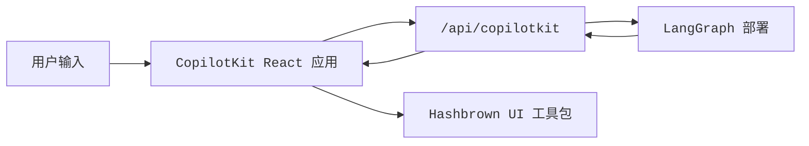

[CopilotKit](https://www.copilotkit.ai/) 提供了一个完整的 React 聊天运行时，当您希望代理返回**结构化 UI 有效负载**而非仅纯文本时，它与 LangGraph 配合得尤其出色。在此模式中，您的 LangGraph 部署同时提供图 API 和自定义 CopilotKit 端点，而前端则将助理消息解析为动态 React 组件。

当您需要以下功能时，此方法非常有用：

- 一个现成的聊天运行时，而无需自行连接 `stream.messages`
- 一个自定义服务器端点，可在已部署的图旁边添加特定于提供程序的行为
- 从受限组件注册表渲染的结构化生成式 UI

<Info>
  有关 CopilotKit 特定的 API、UI 模式和运行时配置，请参阅
  [CopilotKit 文档](https://docs.copilotkit.ai/langgraph)。
</Info>

import { ExampleEmbed } from "/snippets/example-embed.jsx"

<ExampleEmbed example="copilotkit" minHeight={700} />

## 工作原理

从高层次来看，CopilotKit 位于您的 React 应用和 LangGraph 部署之间。前端将对话状态发送到与图 API 一起挂载的自定义 `/api/copilotkit` 路由，该路由将请求转发给 LangGraph，响应则返回助理消息以及您的组件注册表可以渲染的任何结构化 UI 有效负载。

1. **像往常一样部署图**，使用 LangSmith 或 LangGraph 开发服务器。
2. **使用 HTTP 应用扩展部署**，该应用在图 API 旁边挂载 CopilotKit 路由。
3. **将前端包装在 `CopilotKit` 中**，并将其指向该自定义运行时 URL。
4. **注册动态 UI 组件**，并在渲染时将助理响应解析为这些组件。



## 安装

对于后端端点：

```bash
bun add @copilotkit/runtime hono
```

对于前端应用：

```bash
bun add @copilotkit/react-core @copilotkit/react-ui @hashbrownai/core @hashbrownai/react
```

## 使用自定义端点扩展 LangGraph 部署

关键思想是 LangGraph 部署不仅提供图。它还可以加载 HTTP 应用，这允许您在部署本身旁边挂载额外的路由。

在 `langgraph.json` 中，将 `http.app` 指向您的自定义应用入口点：

```json
{
  "graphs": {
    "copilotkit_shadify": "./src/agents/copilotkit-shadify.ts:agent"
  },
  "http": {
    "app": "./src/api/app.ts:app"
  }
}
```

然后创建 Hono 应用并注册 CopilotKit 路由：

```ts app.ts
import { Hono } from "hono";
import { registerCopilotKit } from "./copilotkit.js";

export const app = new Hono();

registerCopilotKit(app);
```

此自定义应用是重要的扩展点：它挂载了一个支持 CopilotKit 的运行时，而不会替换底层的 LangGraph 部署。

在该路由内部，创建一个 `CopilotRuntime`，并使用 `LangGraphAgent` 将其指回已部署的图：

```ts expandable copilotkit.ts
import { type Hono } from "hono";

import { createCopilotEndpointSingleRoute, CopilotRuntime } from "@copilotkit/runtime/v2";
import { LangGraphAgent } from "@copilotkit/runtime/langgraph";

const defaultAgentHost = process.env.LANGGRAPH_DEPLOYMENT_URL || "http://127.0.0.1:2024";
const agentUrl = defaultAgentHost.startsWith("http")
  ? defaultAgentHost
  : `http://${defaultAgentHost}`;

class BridgedLangGraphAgent extends LangGraphAgent {
  override prepareRunAgentInput(
    input: Parameters<LangGraphAgent["prepareRunAgentInput"]>[0],
  ): ReturnType<LangGraphAgent["prepareRunAgentInput"]> {
    const prepared = super.prepareRunAgentInput(input);

    return {
      ...prepared,
      context: normalizeCopilotContext(prepared.context) as ReturnType<
        LangGraphAgent["prepareRunAgentInput"]
      >["context"],
    };
  }

  override async getAssistant(): Promise<Awaited<ReturnType<LangGraphAgent["getAssistant"]>>> {
    const assistants = await this.client.assistants.search({
      graphId: this.graphId,
      limit: 100,
    });

    const assistant = assistants.find((candidate) => candidate.graph_id === this.graphId);
    if (assistant) {
      return assistant;
    }

    return super.getAssistant();
  }
}

export function registerCopilotKit(app: Hono) {
  const runtime = new CopilotRuntime({
    agents: {
      default: new BridgedLangGraphAgent({
        deploymentUrl: agentUrl,
        graphId: "copilotkit_shadify",
      }),
    },
  });

  const copilotApp = createCopilotEndpointSingleRoute({
    runtime,
    basePath: "/api/copilotkit",
  });

  app.route("/", copilotApp);
}

function normalizeCopilotContext(context: unknown): unknown {
  if (!Array.isArray(context)) {
    return context;
  }

  const normalizedEntries = context.flatMap((item) => {
    if (!item || typeof item !== "object") {
      return [];
    }

    const entry = item as { description?: unknown; value?: unknown };
    return typeof entry.description === "string" ? [[entry.description, entry.value] as const] : [];
  });

  return Object.fromEntries(normalizedEntries);
}
```

路由适配器只是 TypeScript 设置的一半。您的 LangChain 代理还需要中间件，该中间件读取转发的 `output_schema` 并将其转换为模型的结构化 `responseFormat`：

```ts expandable agent.ts
import { createAgent, createMiddleware, toolStrategy } from "langchain";
import { z } from "zod";

import { deepSearchTool, searchWebTool } from "../tools/index.js";

const contextSchema = z.object({
  output_schema: z.unknown().optional(),
});

const structuredOutputMiddleware = createMiddleware({
  name: "CopilotKitStructuredOutput",
  contextSchema,
  wrapModelCall: async (request, handler) => {
    const rawOutputSchema = getRuntimeOutputSchema(request.runtime);
    const schema = normalizeOutputSchema(rawOutputSchema);
    if (!schema) {
      return handler(request);
    }

    const responseFormat = toolStrategy(
      schema as unknown as Parameters<typeof toolStrategy>[0],
      {
        toolMessageContent: "Structured UI response generated.",
      },
    );

    return handler({
      ...request,
      responseFormat,
    });
  },
});

export const agent = createAgent({
  model: process.env.COPILOTKIT_MODEL ?? "anthropic:claude-haiku-4-5",
  contextSchema,
  middleware: [structuredOutputMiddleware],
  tools: [searchWebTool, deepSearchTool],
  systemPrompt: `You are a helpful UI assistant inspired by the CopilotKit Shadify example.

Build rich visual responses with the available UI components when they add value.
Only wrap actual UI layouts inside cards. Plain Markdown answers should stay as Markdown.
Use rows for side-by-side layouts with at most two columns.
Prefer simple, polished outputs over dense dashboards.
When using charts, make labels and values concise and easy to read.
When showing code, prefer the code_block component.
When researching topics, use the available search tools first and then present the result cleanly.`,
});

function normalizeOutputSchema(value: unknown): Record<string, unknown> | null {
  let schema = value;

  if (typeof schema === "string") {
    try {
      schema = JSON.parse(schema);
    } catch {
      return null;
    }
  }

  if (!schema || typeof schema !== "object" || Array.isArray(schema)) {
    return null;
  }

  const normalized = { ...(schema as Record<string, unknown>) };

  if (!normalized.title) {
    normalized.title = "CopilotKitStructuredOutput";
  }

  if (!normalized.description) {
    normalized.description = "Structured response schema for the CopilotKit preview.";
  }

  return normalized;
}

function getRuntimeOutputSchema(runtime: {
  context?: { output_schema?: unknown };
  configurable?: Record<string, unknown>;
}): unknown {
  if (runtime.context?.output_schema !== undefined) {
    return runtime.context.output_schema;
  }

  const configurable = runtime.configurable;
  if (!configurable || typeof configurable !== "object" || Array.isArray(configurable)) {
    return undefined;
  }

  return configurable.output_schema;
}
```

此中间件使得前端上的 `useAgentContext({ description: "output_schema", ... })` 变得有用。CopilotKit 运行时转发模式，而代理则将其转换为模型必须遵循的结构化输出约定。

结果是关注点的清晰分离：

- LangGraph 仍然拥有图执行和持久性
- CopilotKit 拥有面向聊天的运行时约定
- 您的自定义端点将它们粘合在一个部署中

## 构建前端应用结构

在前端，将您的应用包装在 `CopilotKit` 中，并将其指向自定义运行时 URL：

```tsx
import { CopilotKit } from "@copilotkit/react-core";
import { CopilotChat, useAgentContext } from "@copilotkit/react-core/v2";
import { s } from "@hashbrownai/core";

import { useChatKit } from "@/components/chat/chat-kit";
import { chatTheme } from "@/lib/chat-theme";

export function App() {
  return (
    <CopilotKit runtimeUrl={import.meta.env.VITE_RUNTIME_URL ?? "/api/copilotkit"}>
      <Page />
    </CopilotKit>
  );
}

function Page() {
  const chatKit = useChatKit();

  useAgentContext({
    description: "output_schema",
    value: s.toJsonSchema(chatKit.schema),
  });

  return <CopilotChat {...chatTheme} />;
}
```

这里有两部分很重要：

- `runtimeUrl="/api/copilotkit"` 将聊天发送到您的自定义后端路由，而不是直接发送到原始 LangGraph API
- `useAgentContext(...)` 将 UI 模式发送给代理，以便模型知道它应该产生什么结构化输出格式

## 注册动态组件

组件注册表位于 `useChatKit()` 中。这是您定义代理允许发出的组件集的地方，例如卡片、行、列、图表、代码块和按钮。

```tsx
import { s } from "@hashbrownai/core";
import { exposeComponent, exposeMarkdown, useUiKit } from "@hashbrownai/react";

import { Button } from "@/components/ui/button";
import { Card } from "@/components/ui/card";
import { CodeBlock } from "@/components/ui/code-block";
import { Row, Column } from "@/components/ui/layout";
import { SimpleChart } from "@/components/ui/simple-chart";

export function useChatKit() {
  return useUiKit({
    components: [
      exposeMarkdown(),
      exposeComponent(Card, {
        name: "card",
        description: "Card to wrap generative UI content.",
        children: "any",
      }),
      exposeComponent(Row, {
        name: "row",
        props: {
          gap: s.string("Tailwind gap size") as never,
        },
        children: "any",
      }),
      exposeComponent(Column, {
        name: "column",
        children: "any",
      }),
      exposeComponent(SimpleChart, {
        name: "chart",
        props: {
          labels: s.array("Category labels", s.string("A label")),
          values: s.array("Numeric values", s.number("A value")),
        },
        children: false,
      }),
      exposeComponent(CodeBlock, {
        name: "code_block",
        props: {
          code: s.streaming.string("The code to display"),
          language: s.string("Programming language") as never,
        },
        children: false,
      }),
      exposeComponent(Button, {
        name: "button",
        children: "text",
      }),
    ],
  });
}
```

此注册表成为代理和 UI 之间的契约。模型不会生成任意的 JSX。它生成必须根据您公开的组件和属性进行验证的结构化数据。

## 将助理消息渲染为动态 UI

助理响应到达后，自定义消息渲染器决定如何显示它。在此示例中：

- 助理消息根据 UI 工具包模式解析为结构化 JSON
- 有效的结构化输出被渲染为真实的 React 组件
- 用户消息被渲染为普通的聊天气泡

```tsx
import type { AssistantMessage } from "@ag-ui/core";
import type { RenderMessageProps } from "@copilotkit/react-ui";
import { useJsonParser } from "@hashbrownai/react";
import { memo } from "react";

import { useChatKit } from "@/components/chat/chat-kit";
import { Squircle } from "@/components/squircle";

const AssistantMessageRenderer = memo(function AssistantMessageRenderer({
  message,
}: {
  message: AssistantMessage;
}) {
  const kit = useChatKit();
  const { value } = useJsonParser(message.content ?? "", kit.schema);

  if (!value) return null;

  return (
    <div className="group/msg mt-2 flex w-full justify-start">
      <div className="magic-text-output w-full px-1 py-1">{kit.render(value)}</div>
    </div>
  );
});

export function CustomMessageRenderer({ message }: RenderMessageProps) {
  if (message.role === "assistant") {
    return <AssistantMessageRenderer message={message} />;
  }

  return (
    <div className="flex w-full justify-end">
      <Squircle className="w-full max-w-[64ch] px-4 py-3">
        <pre>{typeof message.content === "string" ? message.content : JSON.stringify(message.content, null, 2)}</pre>
      </Squircle>
    </div>
  );
}
```

此渲染器模式使集成感觉原生：

- CopilotKit 处理聊天状态和传输
- 自定义渲染器决定助理有效负载如何成为 UI
- [Hashbrown](https://hashbrown.dev/) 将经过验证的结构化数据转换为具体的 React 元素

## 最佳实践

- **保持自定义端点精简**：使用它来使 CopilotKit 适应您的图部署，而不是复制图中已有的业务逻辑
- **显式发送模式**：`useAgentContext` 应在每次页面挂载时描述 UI 契约
- **注册受限组件集**：仅公开您实际希望模型使用的组件和属性
- **将渲染视为解析步骤**：在渲染之前根据您的模式解析助理内容
- **保持用户消息为纯文本**：仅助理消息需要结构化渲染器；用户消息可以保持正常的聊天气泡

---

<div className="source-links">
<Callout icon="edit">
    [在 GitHub 上编辑此页面](https://github.com/langchain-ai/docs/edit/main/src/oss/langchain/frontend/integrations/copilotkit.mdx) 或 [提交问题](https://github.com/langchain-ai/docs/issues/new/choose)。
</Callout>
<Callout icon="terminal-2">
    [通过 MCP 将这些文档连接到 Claude、VSCode 等](/use-these-docs) 以获取实时答案。
</Callout>
</div>