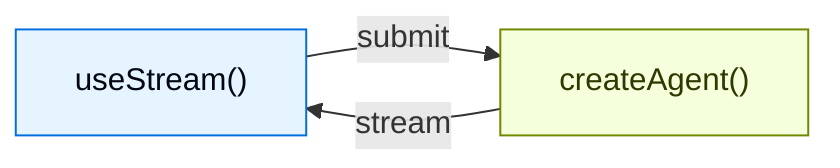

为使用 `createAgent` 创建的代理构建丰富、交互式的前端。这些模式涵盖了从基本消息渲染到高级工作流的所有内容，例如Human in the Loop审批和时间旅行调试。

## 架构

每个模式都遵循相同的架构：一个 `createAgent` 后端通过 `useStream` 钩子将状态流式传输到前端。



在后端，`createAgent` 生成一个编译后的 LangGraph 图，该图暴露一个流式 API。在前端，`useStream` 钩子连接到该 API 并提供响应式状态——消息、工具调用、中断、历史记录等——你可以使用任何框架来渲染它们。

<CodeGroup>

```ts agent.ts
import { createAgent } from "langchain";
import { MemorySaver } from "@langchain/langgraph";

const agent = createAgent({
  model: "openai:gpt-5.4",
  tools: [getWeather, searchWeb],
  checkpointer: new MemorySaver(),
});
```

```tsx Chat.tsx
import { useStream } from "@langchain/react";
import type { agent } from "./agent";

function Chat() {
  const stream = useStream<typeof agent>({
    apiUrl: "http://localhost:2024",
    assistantId: "agent",
  });

  return (
    <div>
      {stream.messages.map((msg) => (
        <Message key={msg.id} message={msg} />
      ))}
    </div>
  );
}
```

</CodeGroup>

`useStream` 可用于 React、Vue、Svelte 和 Angular：

```ts
import { useStream } from "@langchain/react"; // React
import { useStream } from "@langchain/vue"; // Vue
import { useStream } from "@langchain/svelte"; // Svelte
import { useStream } from "@langchain/angular"; // Angular
```

## 模式

### 渲染消息和输出

<CardGroup cols={3}>
  <Card
    title="Markdown 消息"
    icon="markdown"
    href="/oss/javascript/langchain/frontend/markdown-messages"
  >
    解析并渲染流式 Markdown，支持正确的格式和代码高亮。
  </Card>
  <Card
    title="结构化输出"
    icon="layout-grid"
    href="/oss/javascript/langchain/frontend/structured-output"
  >
    将类型化的代理响应渲染为自定义 UI 组件，而非纯文本。
  </Card>
  <Card
    title="推理令牌"
    icon="brain"
    href="/oss/javascript/langchain/frontend/reasoning-tokens"
  >
    在可折叠块中显示模型的思考过程。
  </Card>
  <Card
    title="生成式 UI"
    icon="wand"
    href="/oss/javascript/langchain/frontend/generative-ui"
  >
    使用 json-render 从自然语言提示渲染 AI 生成的用户界面。
  </Card>
</CardGroup>

### 显示代理操作

<CardGroup cols={3}>
  <Card
    title="工具调用"
    icon="tool"
    href="/oss/javascript/langchain/frontend/tool-calling"
  >
    将工具调用显示为丰富、类型安全的 UI 卡片，包含加载和错误状态。
  </Card>
  <Card
    title="Human in the Loop"
    icon="user-check"
    href="/oss/javascript/langchain/frontend/human-in-the-loop"
  >
    暂停代理以供人工审核，支持批准、拒绝和编辑工作流。
  </Card>
</CardGroup>

### 管理对话

<CardGroup cols={3}>
  <Card
    title="分支聊天"
    icon="git-branch"
    href="/oss/javascript/langchain/frontend/branching-chat"
  >
    编辑消息、重新生成响应并导航对话分支。
  </Card>
  <Card
    title="消息队列"
    icon="list-check"
    href="/oss/javascript/langchain/frontend/message-queues"
  >
    在代理顺序处理消息时，将多条消息加入队列。
  </Card>
</CardGroup>

### 高级流式传输

<CardGroup cols={3}>
  <Card
    title="连接与重连流"
    icon="plug-connected"
    href="/oss/javascript/langchain/frontend/join-rejoin"
  >
    断开并重新连接到正在运行的代理流，而不会丢失进度。
  </Card>
  <Card
    title="时间旅行"
    icon="clock"
    href="/oss/javascript/langchain/frontend/time-travel"
  >
    检查、导航并从对话历史记录中的任何检查点恢复。
  </Card>
</CardGroup>

## 集成

`useStream` 与 UI 无关。可将其用于任何组件库或生成式 UI 框架。

<CardGroup cols={3}>
  <Card
    title="AI Elements"
    icon="package"
    href="/oss/javascript/langchain/frontend/integrations/ai-elements"
  >
    用于 AI 聊天的可组合 shadcn/ui
    组件：`Conversation`、`Message`、`Tool`、`Reasoning`。
  </Card>
  <Card
    title="assistant-ui"
    icon="package"
    href="/oss/javascript/langchain/frontend/integrations/assistant-ui"
  >
    无头 React 框架，内置线程管理、分支和附件支持。
  </Card>
  <Card
    title="OpenUI"
    icon="package"
    href="/oss/javascript/langchain/frontend/integrations/openui"
  >
    用于数据丰富的报告和仪表板的生成式 UI 库，使用 openui-lang 组件 DSL。
  </Card>
</CardGroup>

---

<div className="source-links">
  <Callout icon="terminal-2">
    [连接这些文档](/use-these-docs) 到 Claude、VSCode 等，通过 MCP
    获取实时答案。
  </Callout>
  <Callout icon="edit">
    [在 GitHub
    上编辑此页面](https://github.com/langchain-ai/docs/edit/main/src/oss/langchain/frontend/overview.mdx)
    或 [提交问题](https://github.com/langchain-ai/docs/issues/new/choose)。
  </Callout>
</div>
