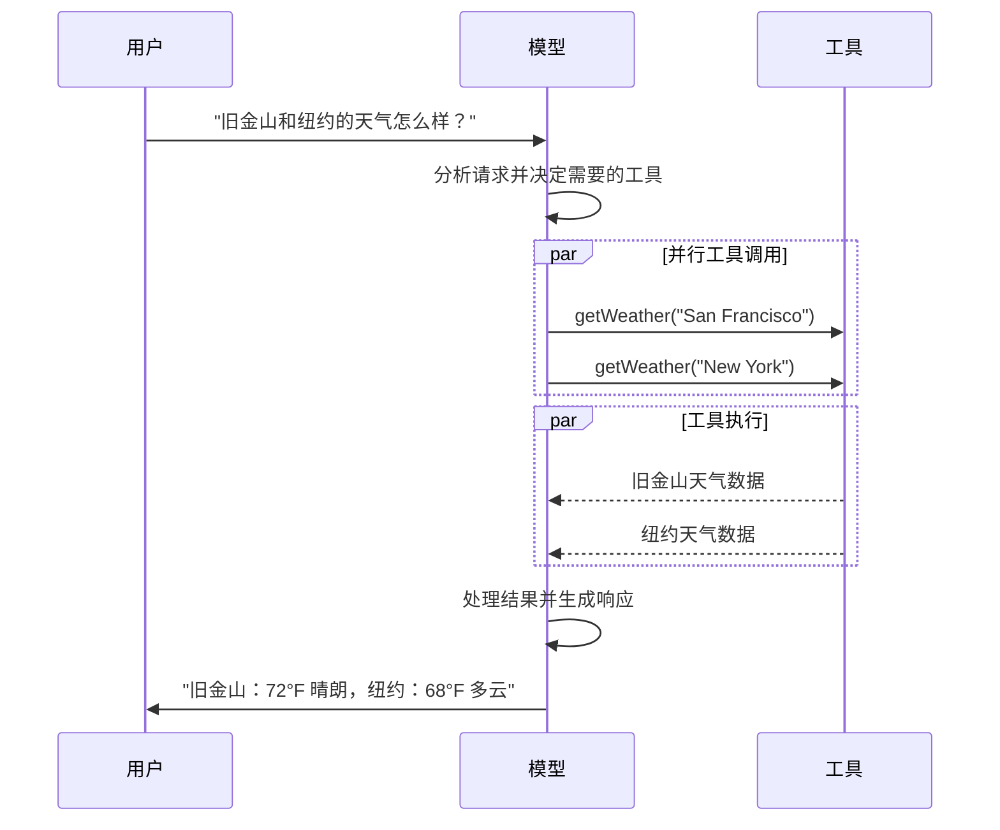

import ChatModelTabsPy from "/snippets/chat-model-tabs.mdx";
import ChatModelTabsJS from "/snippets/chat-model-tabs-js.mdx";

[LLMs](https://en.wikipedia.org/wiki/Large_language_model) 是强大的 AI 工具，可以像人类一样解释和生成文本。它们功能多样，可以撰写内容、翻译语言、总结和回答问题，而无需为每个任务进行专门的训练。

除了文本生成，许多模型还支持：

- <Icon icon="hammer" size={16} /> [工具调用](#tool-calling) -
  调用外部工具（如数据库查询或 API 调用）并在其响应中使用结果。
- <Icon icon="layout-grid" size={16} /> [结构化输出](#structured-output) -
  模型的响应被约束为遵循定义的格式。
- <Icon icon="photo" size={16} /> [多模态](#multimodal) -
  处理和返回文本以外的数据，如图像、音频和视频。
- <Icon icon="brain" size={16} /> [推理](#reasoning) -
  模型执行多步推理以得出结论。

模型是[智能体](/oss/javascript/langchain/agents)的推理引擎。它们驱动智能体的决策过程，决定调用哪些工具、如何解释结果以及何时提供最终答案。

您选择的模型的质量和能力直接影响您智能体的基线可靠性和性能。不同的模型擅长不同的任务——有些更擅长遵循复杂的指令，有些更擅长结构化推理，有些则支持更大的上下文窗口来处理更多信息。

LangChain 的标准模型接口让您能够访问许多不同的提供商集成，这使得在模型之间进行实验和切换变得容易，从而为您的用例找到最佳匹配。

<Info>
  有关特定提供商的集成信息和功能，请参阅提供商的[聊天模型页面](/oss/javascript/integrations/chat)。
</Info>

## 基本用法

模型可以通过两种方式使用：

1. **与智能体一起使用** - 在创建[智能体](/oss/javascript/langchain/agents#model)时可以动态指定模型。
2. **独立使用** - 可以直接调用模型（在智能体循环之外），用于文本生成、分类或提取等任务，而无需智能体框架。

相同的模型接口在两种上下文中都有效，这为您提供了灵活性，可以从简单开始，并根据需要扩展到更复杂的基于智能体的工作流。

### 初始化模型

在 LangChain 中开始使用独立模型的最简单方法是使用 `initChatModel` 从您选择的[聊天模型提供商](/oss/javascript/integrations/chat)初始化一个模型（示例如下）：

<ChatModelTabsJS />
```typescript const response = await model.invoke("为什么鹦鹉会说话？"); ```
有关更多详细信息，包括如何传递模型[参数](#parameters)的信息，请参阅
[`initChatModel`](https://reference.langchain.com/javascript/langchain/chat_models/universal/initChatModel)。

### 支持的提供商和模型

LangChain 通过专用的集成包支持所有主要的模型提供商。每个提供商包都实现了相同的标准接口，因此您可以在不重写应用程序逻辑的情况下交换提供商。新的模型名称可以立即使用——无需更新 LangChain——因为提供商包会将模型名称直接传递给提供商的 API。

浏览[支持的提供商完整列表](/oss/javascript/integrations/providers/overview)，或参阅[提供商和模型](/oss/javascript/concepts/providers-and-models)以获取关于提供商、包和模型名称如何在 LangChain 中协同工作的概念性概述。

### 关键方法

<Card title="调用" href="#调用-invoke" icon="send" arrow="true" horizontal>
  模型将消息作为输入，并在生成完整响应后输出消息。
</Card>
<Card
  title="流式传输"
  href="#流式处理-stream"
  icon="broadcast"
  arrow="true"
  horizontal
>
  调用模型，但实时流式传输输出。
</Card>
<Card
  title="批处理"
  href="#批处理-batch"
  icon="grip-vertical"
  arrow="true"
  horizontal
>
  以批处理方式向模型发送多个请求，以实现更高效的处理。
</Card>

<Info>
  除了聊天模型，LangChain
  还提供对其他相邻技术的支持，例如嵌入模型和向量存储。有关详细信息，请参阅[集成页面](/oss/javascript/integrations/providers/overview)。
</Info>

## 参数

聊天模型接受可用于配置其行为的参数。支持的完整参数集因模型和提供商而异，但标准参数包括：

<ParamField body="model" type="string" required>
  您希望与提供商一起使用的特定模型的名称或标识符。您也可以使用 '{model_provider}
  :{model}' 格式在单个参数中同时指定模型及其提供商，例如 'openai:o1'。
</ParamField>

<ParamField body="apiKey" type="string">
  用于向模型提供商进行身份验证所需的密钥。这通常在您注册访问模型时颁发。通常通过设置
  <Tooltip tip="一个值在程序外部设置的变量，通常通过操作系统或微服务内置的功能设置。">
    环境变量
  </Tooltip>
  来访问。
</ParamField>

<ParamField body="temperature" type="number">
  控制模型输出的随机性。较高的数字会使响应更具创造性；较低的数字则使其更具确定性。
</ParamField>

<ParamField body="maxTokens" type="number">
  限制响应中
  <Tooltip tip="模型读取和生成的基本单位。提供商可能以不同方式定义它们，但通常可以表示整个单词或部分单词。">
    令牌
  </Tooltip>
  的总数，从而有效控制输出的长度。
</ParamField>

<ParamField body="timeout" type="number">
  在取消请求之前等待模型响应的最长时间（以秒为单位）。
</ParamField>

<ParamField body="maxRetries" type="number" default="6">
  如果请求因网络超时或速率限制等问题失败，系统将重新发送请求的最大尝试次数。重试使用带有抖动的指数退避。网络错误、速率限制（429）和服务器错误（5xx）会自动重试。客户端错误（如
  401（未授权）或
  404）不会重试。对于在不可靠网络上运行的长时间[智能体](/oss/javascript/deepagents/overview)任务，建议将此值增加到
  10-15。
</ParamField>

使用 `initChatModel` 时，以内联参数的形式传递这些参数：

```typescript 使用模型参数初始化
const model = await initChatModel("claude-sonnet-4-6", {
  temperature: 0.7,
  timeout: 30,
  maxTokens: 1000,
  maxRetries: 6,
});
```

<Info>
    每个聊天模型集成可能都有额外的参数用于控制特定于提供商的功能。

    例如，[`ChatOpenAI`](https://reference.langchain.com/javascript/langchain-openai/ChatOpenAI) 有 `use_responses_api` 来决定是使用 OpenAI Responses API 还是 Completions API。

    要查找给定聊天模型支持的所有参数，请访问[聊天模型集成](/oss/javascript/integrations/chat)页面。

</Info>

---

## 调用

必须调用聊天模型才能生成输出。有三种主要的调用方法，每种方法适用于不同的用例。

### 调用

调用模型最直接的方法是使用 [`invoke()`](https://reference.langchain.com/javascript/classes/_langchain_core.language_models_chat_models.BaseChatModel.html#invoke) 并传递单个消息或消息列表。

```typescript 单条消息
const response = await model.invoke("为什么鹦鹉有彩色的羽毛？");
console.log(response);
```

可以向聊天模型提供消息列表以表示对话历史。每条消息都有一个角色，模型使用该角色来指示对话中谁发送了消息。

有关角色、类型和内容的更多详细信息，请参阅[消息](/oss/javascript/langchain/messages)指南。

```typescript 对象格式
const conversation = [
  { role: "system", content: "您是一个将英语翻译成法语的有用助手。" },
  { role: "user", content: "翻译：我喜欢编程。" },
  { role: "assistant", content: "J'adore la programmation." },
  { role: "user", content: "翻译：我喜欢构建应用程序。" },
];

const response = await model.invoke(conversation);
console.log(response); // AIMessage("J'adore créer des applications.")
```

```typescript 消息对象
import { HumanMessage, AIMessage, SystemMessage } from "langchain";

const conversation = [
  new SystemMessage("您是一个将英语翻译成法语的有用助手。"),
  new HumanMessage("翻译：我喜欢编程。"),
  new AIMessage("J'adore la programmation."),
  new HumanMessage("翻译：我喜欢构建应用程序。"),
];

const response = await model.invoke(conversation);
console.log(response); // AIMessage("J'adore créer des applications.")
```

<Info>
  如果您的调用返回类型是字符串，请确保您使用的是聊天模型而不是
  LLM。传统的文本完成 LLM 会直接返回字符串。LangChain 聊天模型以 "Chat"
  为前缀，例如
  [`ChatOpenAI`](https://reference.langchain.com/javascript/langchain-openai/ChatOpenAI)(/oss/integrations/chat/openai)。
</Info>

### 流式传输

大多数模型可以在生成输出内容时进行流式传输。通过逐步显示输出，流式传输可以显著改善用户体验，特别是对于较长的响应。

调用 [`stream()`](https://reference.langchain.com/javascript/classes/_langchain_core.language_models_chat_models.BaseChatModel.html#stream) 会返回一个<Tooltip tip="一个对象，按顺序逐步提供对集合中每个项目的访问。">迭代器</Tooltip>，该迭代器在生成输出块时产生它们。您可以使用循环实时处理每个块：

<CodeGroup>
    ```typescript 基本文本流式传输
    const stream = await model.stream("为什么鹦鹉有彩色的羽毛？");
    for await (const chunk of stream) {
      console.log(chunk.text)
    }
    ```

    ```typescript 流式传输工具调用、推理和其他内容
    const stream = await model.stream("天空是什么颜色？");
    for await (const chunk of stream) {
      for (const block of chunk.contentBlocks) {
        if (block.type === "reasoning") {
          console.log(`推理: ${block.reasoning}`);
        } else if (block.type === "tool_call_chunk") {
          console.log(`工具调用块: ${block}`);
        } else if (block.type === "text") {
          console.log(block.text);
        } else {
          ...
        }
      }
    }
    ```

</CodeGroup>

与 [`invoke()`](#invoke)（在模型完成生成完整响应后返回单个 [`AIMessage`](https://reference.langchain.com/javascript/langchain-core/messages/AIMessage)）不同，`stream()` 返回多个 [`AIMessageChunk`](https://reference.langchain.com/javascript/langchain-core/messages/AIMessageChunk) 对象，每个对象包含输出文本的一部分。重要的是，流中的每个块都设计为通过求和聚合为完整消息：

```typescript 构建 AIMessage
let full: AIMessageChunk | null = null;
for await (const chunk of stream) {
  full = full ? full.concat(chunk) : chunk;
  console.log(full.text);
}

// 天空
// 天空是
// 天空通常是
// 天空通常是蓝色的
// ...

console.log(full.contentBlocks);
// [{"type": "text", "text": "天空通常是蓝色的..."}]
```

生成的消息可以与使用 [`invoke()`](#invoke) 生成的消息相同对待——例如，它可以聚合到消息历史中并作为对话上下文传回模型。

<Warning>
  流式传输仅在程序的所有步骤都知道如何处理块流时才有效。例如，一个不具备流式传输能力的应用程序需要在内存中存储整个输出才能进行处理。
</Warning>

<Accordion title="高级流式传输主题">
    <Accordion title="流式传输事件">

        LangChain 聊天模型还可以使用 [`streamEvents()`][BaseChatModel.streamEvents] 流式传输语义事件。

        这简化了基于事件类型和其他元数据的过滤，并会在后台聚合完整消息。示例如下。

        ```typescript
        const stream = await model.streamEvents("Hello");
        for await (const event of stream) {
            if (event.event === "on_chat_model_start") {
                console.log(`输入: ${event.data.input}`);
            }
            if (event.event === "on_chat_model_stream") {
                console.log(`令牌: ${event.data.chunk.text}`);
            }
            if (event.event === "on_chat_model_end") {
                console.log(`完整消息: ${event.data.output.text}`);
            }
        }
        ```
        ```txt
        输入: Hello
        令牌: Hi
        令牌:  there
        令牌: !
        令牌:  How
        令牌:  can
        令牌:  I
        ...
        完整消息: Hi there! How can I help today?
        ```

        有关事件类型和其他详细信息，请参阅 [`streamEvents()`](https://reference.langchain.com/javascript/classes/_langchain_core.language_models_chat_models.BaseChatModel.html#streamEvents) 参考。

    </Accordion>
    <Accordion title='"自动流式传输" 聊天模型'>
        LangChain 通过自动启用流式传输模式来简化从聊天模型的流式传输，即使您没有显式调用流式传输方法。当您使用非流式调用方法但仍希望流式传输整个应用程序（包括来自聊天模型的中间结果）时，这尤其有用。

        在 [LangGraph 智能体](/oss/javascript/langchain/agents) 中，例如，您可以在节点内调用 `model.invoke()`，但如果在流式传输模式下运行，LangChain 会自动委托给流式传输。

        #### 工作原理

        当您 `invoke()` 一个聊天模型时，如果 LangChain 检测到您正在尝试流式传输整个应用程序，它会自动切换到内部流式传输模式。调用的结果对于使用调用的代码来说是相同的；但是，在聊天模型被流式传输时，LangChain 会负责在 LangChain 的回调系统中调用 [`on_llm_new_token`](https://reference.langchain.com/javascript/interfaces/_langchain_core.callbacks_base.BaseCallbackHandlerMethods.html#onLlmNewToken) 事件。

        回调事件允许 LangGraph `stream()` 和 `streamEvents()` 实时显示聊天模型的输出。

    </Accordion>

</Accordion>

### 批处理

将独立请求的集合批处理到模型可以显著提高性能并降低成本，因为处理可以并行完成：

```typescript 批处理
const responses = await model.batch([
  "为什么鹦鹉有彩色的羽毛？",
  "飞机如何飞行？",
  "什么是量子计算？",
  "为什么鹦鹉有彩色的羽毛？",
  "飞机如何飞行？",
  "什么是量子计算？",
]);
for (const response of responses) {
  console.log(response);
}
```

<Tip>
    使用 `batch()` 处理大量输入时，您可能希望控制最大并行调用数。这可以通过在 [`RunnableConfig`](https://reference.langchain.com/javascript/langchain-core/runnables/RunnableConfig) 字典中设置 `maxConcurrency` 属性来完成。

    ```typescript 带有最大并发数的批处理
    model.batch(
      listOfInputs,
      {
        maxConcurrency: 5,  // 限制为 5 个并行调用
      }
    )
    ```

    有关支持的属性的完整列表，请参阅 [`RunnableConfig`](https://reference.langchain.com/javascript/langchain-core/runnables/RunnableConfig) 参考。

</Tip>

有关批处理的更多详细信息，请参阅[参考](https://reference.langchain.com/javascript/classes/_langchain_core.language_models_chat_models.BaseChatModel.html#batch)。

---

## 工具调用

模型可以请求调用执行任务的工具，例如从数据库获取数据、搜索网络或运行代码。工具是以下内容的配对：

1. 一个模式，包括工具的名称、描述和/或参数定义（通常是一个 JSON 模式）
2. 一个函数或<Tooltip tip="一种可以暂停执行并在以后恢复的方法">协程</Tooltip>来执行。

<Note>您可能会听到“函数调用”这个术语。我们将其与“工具调用”互换使用。</Note>

以下是用户和模型之间的基本工具调用流程：



要使您定义的工具可供模型使用，必须使用 [`bindTools`](https://reference.langchain.com/javascript/classes/_langchain_core.language_models_chat_models.BaseChatModel.html#bindTools) 将它们绑定。在后续调用中，模型可以根据需要选择调用任何绑定的工具。

一些模型提供商提供<Tooltip tip="在服务器端执行的工具，例如网络搜索和代码解释器">内置工具</Tooltip>，可以通过模型或调用参数启用（例如 [`ChatOpenAI`](/oss/javascript/integrations/chat/openai), [`ChatAnthropic`](/oss/javascript/integrations/chat/anthropic)）。有关详细信息，请查看相应的[提供商参考](/oss/javascript/integrations/providers/overview)。

<Tip>
  有关创建工具的详细信息和其他选项，请参阅[工具指南](/oss/javascript/langchain/tools)。
</Tip>

```typescript 绑定用户工具
import { tool } from "langchain";
import * as z from "zod";
import { ChatOpenAI } from "@langchain/openai";

const getWeather = tool((input) => `在 ${input.location} 是晴天。`, {
  name: "get_weather",
  description: "获取某个位置的天气。",
  schema: z.object({
    location: z.string().describe("要获取天气的位置"),
  }),
});

const model = new ChatOpenAI({ model: "gpt-4.1" });
const modelWithTools = model.bindTools([getWeather]); // [!code highlight]

const response = await modelWithTools.invoke("波士顿的天气怎么样？");
const toolCalls = response.tool_calls || [];
for (const tool_call of toolCalls) {
  // 查看模型进行的工具调用
  console.log(`工具: ${tool_call.name}`);
  console.log(`参数: ${tool_call.args}`);
}
```

当绑定用户定义的工具时，模型的响应包含一个执行工具的**请求**。当在[智能体](/oss/javascript/langchain/agents)之外单独使用模型时，由您来执行请求的工具并将结果返回给模型以供后续推理使用。当使用[智能体](/oss/javascript/langchain/agents)时，智能体循环将为您处理工具执行循环。

下面，我们展示了一些使用工具调用的常见方法。

<AccordionGroup>
    <Accordion title="工具执行循环" icon="refresh">
        当模型返回工具调用时，您需要执行工具并将结果传回模型。这会创建一个对话循环，模型可以使用工具结果来生成其最终响应。LangChain 包括[智能体](/oss/javascript/langchain/agents)抽象来为您处理此编排。

        以下是执行此操作的简单示例：

        ```typescript 工具执行循环
        // 将（可能多个）工具绑定到模型
        const modelWithTools = model.bindTools([get_weather])

        // 步骤 1：模型生成工具调用
        const messages = [{"role": "user", "content": "波士顿的天气怎么样？"}]
        const ai_msg = await modelWithTools.invoke(messages)
        messages.push(ai_msg)

        // 步骤 2：执行工具并收集结果
        for (const tool_call of ai_msg.tool_calls) {
            // 使用生成的参数执行工具
            const tool_result = await get_weather.invoke(tool_call)
            messages.push(tool_result)
        }

        // 步骤 3：将结果传回模型以获取最终响应
        const final_response = await modelWithTools.invoke(messages)
        console.log(final_response.text)
        // "波士顿当前天气是 72°F 且晴朗。"
        ```

        工具返回的每个 [`ToolMessage`](https://reference.langchain.com/javascript/langchain-core/messages/ToolMessage) 都包含一个与原始工具调用匹配的 `tool_call_id`，帮助模型将结果与请求关联起来。
    </Accordion>
    <Accordion title="强制工具调用" icon="asterisk">
        默认情况下，模型可以自由选择使用哪个绑定工具，具体取决于用户的输入。但是，您可能希望强制选择一个工具，确保模型使用特定工具或给定列表中的**任何**工具：

        <CodeGroup>
            ```typescript 强制使用任何工具
            const modelWithTools = model.bindTools([tool_1], { toolChoice: "any" })
            ```
            ```typescript 强制使用特定工具
            const modelWithTools = model.bindTools([tool_1], { toolChoice: "tool_1" })
            ```
        </CodeGroup>

    </Accordion>
    <Accordion title="并行工具调用" icon="stack-2">
        许多模型支持在适当时并行调用多个工具。这允许模型同时从不同来源收集信息。

        ```typescript 并行工具调用
        const modelWithTools = model.bind_tools([get_weather])

        const response = await modelWithTools.invoke(
            "波士顿和东京的天气怎么样？"
        )


        // 模型可能生成多个工具调用
        console.log(response.tool_calls)
        // [
        //   { name: 'get_weather', args: { location: 'Boston' }, id: 'call_1' },
        //   { name: 'get_time', args: { location: 'Tokyo' }, id: 'call_2' }
        // ]


        // 执行所有工具（可以使用 async 并行完成）
        const results = []
        for (const tool_call of response.tool_calls || []) {
            if (tool_call.name === 'get_weather') {
                const result = await get_weather.invoke(tool_call)
                results.push(result)
            }
        }
        ```

        模型会根据请求操作的独立性智能地确定何时适合并行执行。

        <Tip>
        大多数支持工具调用的模型默认启用并行工具调用。有些（包括 [OpenAI](/oss/javascript/integrations/chat/openai) 和 [Anthropic](/oss/javascript/integrations/chat/anthropic)）允许您禁用此功能。为此，请设置 `parallel_tool_calls=False`：
        ```python
        model.bind_tools([get_weather], parallel_tool_calls=False)
        ```
        </Tip>
    </Accordion>
    <Accordion title="流式传输工具调用" icon="rss">
        当流式传输响应时，工具调用通过 [`ToolCallChunk`](https://reference.langchain.com/javascript/langchain-core/messages/ContentBlock/Tools/ToolCallChunk) 逐步构建。这允许您在工具调用生成时查看它们，而不是等待完整响应。

        ```typescript 流式传输工具调用
        const stream = await modelWithTools.stream(
            "波士顿和东京的天气怎么样？"
        )
        for await (const chunk of stream) {
            // 工具调用块逐步到达
            if (chunk.tool_call_chunks) {
                for (const tool_chunk of chunk.tool_call_chunks) {
                console.log(`工具: ${tool_chunk.get('name', '')}`)
                console.log(`参数: ${tool_chunk.get('args', '')}`)
                }
            }
        }

        // 输出:
        // 工具: get_weather
        // 参数:
        // 工具:
        // 参数: {"loc
        // 工具:
        // 参数: ation": "BOS"}
        // 工具: get_time
        // 参数:
        // 工具:
        // 参数: {"timezone": "Tokyo"}
        ```

        您可以累积块以构建完整的工具调用：

        ```typescript 累积工具调用
        let full: AIMessageChunk | null = null
        const stream = await modelWithTools.stream("波士顿的天气怎么样？")
        for await (const chunk of stream) {
            full = full ? full.concat(chunk) : chunk
            console.log(full.contentBlocks)
        }
        ```

    </Accordion>

</AccordionGroup>

---

## 结构化输出

可以请求模型以匹配给定模式的格式提供其响应。这对于确保输出可以轻松解析并在后续处理中使用非常有用。LangChain 支持多种模式类型和强制结构化输出的方法。

<Tip>
  要了解结构化输出，请参阅[结构化输出](/oss/javascript/langchain/structured-output)。
</Tip>

<Tabs>
    <Tab title="Zod">
        [zod 模式](https://zod.dev/) 是定义输出模式的首选方法。请注意，当提供 zod 模式时，模型输出也将使用 zod 的解析方法根据模式进行验证。

        ```typescript
        import * as z from "zod";

        const Movie = z.object({
          title: z.string().describe("电影标题"),
          year: z.number().describe("电影发行年份"),
          director: z.string().describe("电影导演"),
          rating: z.number().describe("电影评分（满分10分）"),
        });

        const modelWithStructure = model.withStructuredOutput(Movie);

        const response = await modelWithStructure.invoke("提供电影《盗梦空间》的详细信息");
        console.log(response);
        // {
        //   title: "Inception",
        //   year: 2010,
        //   director: "Christopher Nolan",
        //   rating: 8.8,
        // }
        ```
    </Tab>
    <Tab title="JSON Schema">
        为了获得最大控制权或互操作性，您可以提供原始 JSON Schema。

        ```typescript
        const jsonSchema = {
          "title": "Movie",
          "description": "一部包含详细信息的电影",
          "type": "object",
          "properties": {
            "title": {
              "type": "string",
              "description": "电影标题",
            },
            "year": {
              "type": "integer",
              "description": "电影发行年份",
            },
            "director": {
              "type": "string",
              "description": "电影导演",
            },
            "rating": {
              "type": "number",
              "description": "电影评分（满分10分）",
            },
          },
          "required": ["title", "year", "director", "rating"],
        }

        const modelWithStructure = model.withStructuredOutput(
          jsonSchema,
          { method: "jsonSchema" },
        )

        const response = await modelWithStructure.invoke("提供电影《盗梦空间》的详细信息")
        console.log(response)  // {'title': 'Inception', 'year': 2010, ...}
        ```
    </Tab>
    <Tab title="标准模式">
        任何实现[标准模式](https://standardschema.dev/)规范的库中的模式也受支持。标准模式对象在运行时通过模式的 `~standard.validate()` 方法进行验证。

        ```typescript
        import * as v from "valibot";
        import { toStandardJsonSchema } from "@valibot/to-json-schema";

        const Movie = toStandardJsonSchema(
          v.object({
            title: v.pipe(v.string(), v.description("电影标题")),
            year: v.pipe(v.number(), v.description("电影发行年份")),
            director: v.pipe(v.string(), v.description("电影导演")),
            rating: v.pipe(v.number(), v.description("电影评分（满分10分）")),
          })
        );

        const modelWithStructure = model.withStructuredOutput(Movie);

        const response = await modelWithStructure.invoke("提供电影《盗梦空间》的详细信息");
        console.log(response);
        // {
        //   title: "Inception",
        //   year: 2010,
        //   director: "Christopher Nolan",
        //   rating: 8.8,
        // }
        ```
    </Tab>

</Tabs>

<Note>
    **结构化输出的关键考虑因素：**

    - **方法参数**：一些提供商支持不同的方法（`'jsonSchema'`, `'functionCalling'`, `'jsonMode'`）
    - **包含原始数据**：使用 [`includeRaw: true`](https://reference.langchain.com/javascript/classes/_langchain_core.language_models_chat_models.BaseChatModel.html#withStructuredOutput) 以获取解析后的输出和原始的 [`AIMessage`](https://reference.langchain.com/javascript/langchain-core/messages/AIMessage)
    - **验证**：Zod 和标准模式对象提供自动验证，而 JSON Schema 需要手动验证
    - **标准模式**：任何实现[标准模式](https://standardschema.dev/)规范的模式库都受支持并在运行时验证

    有关支持的方法和配置选项，请参阅您的[提供商集成页面](/oss/javascript/integrations/providers/overview)。

</Note>

<Accordion title="示例：消息输出与解析结构一起返回">

返回原始的 [`AIMessage`](https://reference.langchain.com/javascript/langchain-core/messages/AIMessage) 对象以及解析后的表示形式可能很有用，以便访问响应元数据，例如[令牌计数](#token-usage)。为此，在调用 [`with_structured_output`](https://reference.langchain.com/javascript/classes/_langchain_core.language_models_chat_models.BaseChatModel.html#withStructuredOutput) 时设置 [`include_raw=True`](https://reference.langchain.com/javascript/classes/_langchain_core.language_models_chat_models.BaseChatModel.html#withStructuredOutput)：

    ```typescript
    import * as z from "zod";

    const Movie = z.object({
      title: z.string().describe("电影标题"),
      year: z.number().describe("电影发行年份"),
      director: z.string().describe("电影导演"),
      rating: z.number().describe("电影评分（满分10分）"),
      title: z.string().describe("电影标题"),
      year: z.number().describe("电影发行年份"),
      director: z.string().describe("电影导演"),  // [!code highlight]
      rating: z.number().describe("电影评分（满分10分）"),
    });

    const modelWithStructure = model.withStructuredOutput(Movie, { includeRaw: true });

    const response = await modelWithStructure.invoke("提供电影《盗梦空间》的详细信息");
    console.log(response);
    // {
    //   raw: AIMessage { ... },
    //   parsed: { title: "Inception", ... }
    // }
    ```

</Accordion>
<Accordion title="示例：嵌套结构">
    模式可以嵌套：

    ```typescript
    import * as z from "zod";

    const Actor = z.object({
      name: str
      role: z.string(),
    });

    const MovieDetails = z.object({
      title: z.string(),
      year: z.number(),
      cast: z.array(Actor),
      genres: z.array(z.string()),
      budget: z.number().nullable().describe("预算（百万美元）"),
    });

    const modelWithStructure = model.withStructuredOutput(MovieDetails);
    ```

</Accordion>

---

## 高级主题

### 模型配置文件

<Info>
    模型配置文件需要 `langchain>=1.1`。
</Info>

LangChain 聊天模型可以通过 `profile` 属性公开支持的功能和能力的字典：

```typescript
model.profile;
// {
//   maxInputTokens: 400000,
//   imageInputs: true,
//   reasoningOutput: true,
//   toolCalling: true,
//   ...
// }
```

请参阅 [API 参考](https://reference.langchain.com/javascript/langchain-core/language_models/profile/ModelProfile) 中的完整字段集。

许多模型配置文件数据由 [models.dev](https://github.com/sst/models.dev) 项目提供，这是一个提供模型能力数据的开源计划。这些数据使用 LangChain 的附加字段进行了增强。这些增强与上游项目的发展保持一致。

模型配置文件数据允许应用程序动态地处理模型能力。例如：

1. [摘要中间件](/oss/javascript/langchain/middleware/built-in#summarization) 可以根据模型的上下文窗口大小触发摘要。
2. `createAgent` 中的[结构化输出](/oss/javascript/langchain/structured-output)策略可以自动推断（例如，通过检查对原生结构化输出功能的支持）。
3. 模型输入可以根据支持的[模态](#multimodal)和最大输入令牌数进行限制。
4. [Deep Agents CLI](/oss/javascript/deepagents/cli) 过滤[交互式模型切换器](/oss/javascript/deepagents/cli/providers#which-models-appear-in-the-switcher) 以显示其配置文件报告支持 `tool_calling` 和文本 I/O 的模型，并在选择器详细视图中显示上下文窗口大小和功能标志。

<Accordion title="修改配置文件数据">
    如果模型配置文件数据缺失、过时或不正确，可以进行更改。

    **选项 1（快速修复）**

    您可以使用任何有效的配置文件实例化聊天模型：

    ```typescript
    const customProfile = {
    maxInputTokens: 100_000,
    toolCalling: true,
    structuredOutput: true,
    // ...
    };
    const model = initChatModel("...", { profile: customProfile });
    ```

    **选项 2（修复上游数据）**

    数据的主要来源是 [models.dev](https://models.dev/) 项目。这些数据与 LangChain [集成包](/oss/javascript/integrations/providers/overview) 中的附加字段和覆盖项合并，并随这些包一起发布。

    模型配置文件数据可以通过以下过程更新：

    1. （如果需要）通过向其 [GitHub 仓库](https://github.com/sst/models.dev) 提交拉取请求来更新 [models.dev](https://models.dev/) 的源数据。
    2. （如果需要）通过向 LangChain [集成包](/oss/javascript/integrations/providers/overview) 提交拉取请求来更新 `langchain-<package>/profiles.toml` 中的附加字段和覆盖项。

</Accordion>

<Warning>模型配置文件是测试版功能。配置文件的格式可能会更改。</Warning>

### 多模态

某些模型可以处理和返回非文本数据，如图像、音频和视频。您可以通过提供[内容块](/oss/javascript/langchain/messages#message-content)将非文本数据传递给模型。

<Tip>
    所有具有底层多模态功能的 LangChain 聊天模型都支持：

    1. 跨提供商标准格式的数据（请参阅[我们的消息指南](/oss/javascript/langchain/messages)）
    2. OpenAI [聊天补全](https://platform.openai.com/docs/api-reference/chat) 格式
    3. 特定于该提供商的任何原生格式（例如，Anthropic 模型接受 Anthropic 原生格式）

</Tip>

有关详细信息，请参阅消息指南的[多模态部分](/oss/javascript/langchain/messages#multimodal)。

<Tooltip
  tip="并非所有 LLM 都是平等的！"
  cta="参阅参考"
  href="https://models.dev/"
>
  某些模型
</Tooltip>
可以在其响应中返回多模态数据。如果被调用这样做，生成的
[`AIMessage`](https://reference.langchain.com/javascript/langchain-core/messages/AIMessage)
将包含具有多模态类型的内容块。

```typescript 多模态输出
const response = await model.invoke("创建一张猫的图片");
console.log(response.contentBlocks);
// [
//   { type: "text", text: "这是一张猫的图片" },
//   { type: "image", data: "...", mimeType: "image/jpeg" },
// ]
```

有关特定提供商的详细信息，请参阅[集成页面](/oss/javascript/integrations/providers/overview)。

### 推理

许多模型能够执行多步推理以得出结论。这涉及将复杂问题分解为更小、更易管理的步骤。

**如果底层模型支持，**您可以展示此推理过程，以更好地了解模型如何得出最终答案。

<CodeGroup>
    ```typescript 流式传输推理输出
    const stream = model.stream("为什么鹦鹉有彩色的羽毛？");
    for await (const chunk of stream) {
        const reasoningSteps = chunk.contentBlocks.filter(b => b.type === "reasoning");
        console.log(reasoningSteps.length > 0 ? reasoningSteps : chunk.text);
    }
    ```

    ```typescript 完整推理输出
    const response = await model.invoke("为什么鹦鹉有彩色的羽毛？");
    const reasoningSteps = response.contentBlocks.filter(b => b.type === "reasoning");
    console.log(reasoningSteps.map(step => step.reasoning).join(" "));
    ```

</CodeGroup>

根据模型的不同，您有时可以指定其应投入推理的力度。同样，您可以请求模型完全关闭推理。这可能采用分类的推理“层级”（例如 `'low'` 或 `'high'`）或整数令牌预算的形式。

有关详细信息，请参阅您的相应聊天模型的[集成页面](/oss/javascript/integrations/providers/overview)或[参考](https://reference.langchain.com/python/integrations/)。

### 本地模型

LangChain 支持在您自己的硬件上本地运行模型。这在数据隐私至关重要、您想调用自定义模型或希望避免使用基于云的模型时产生的成本等情况下非常有用。

[Ollama](/oss/javascript/integrations/chat/ollama) 是在本地运行聊天和嵌入模型的最简单方法之一。

{/* TODO: whenever we have a better integrations directory, x-ref to that page with a local query filter */}

### 提示缓存

许多提供商提供提示缓存功能，以减少对相同令牌重复处理的延迟和成本。这些功能可以是**隐式**或**显式**的：

- **隐式提示缓存**：如果请求命中缓存，提供商将自动传递成本节省。示例：[OpenAI](/oss/javascript/integrations/chat/openai) 和 [Gemini](/oss/javascript/integrations/chat/google_generative_ai)。
- **显式缓存**：提供商允许您手动指示缓存点以获得更大的控制权或保证成本节省。示例：
  - [`ChatOpenAI`](https://reference.langchain.com/javascript/langchain-openai/ChatOpenAI)（通过 `prompt_cache_key`）
  - Anthropic 的 [`AnthropicPromptCachingMiddleware`](/oss/javascript/integrations/chat/anthropic#prompt-caching)
  - [Gemini](https://reference.langchain.com/python/integrations/langchain_google_genai/)。
  - [AWS Bedrock](/oss/javascript/integrations/chat/bedrock)

<Warning>
  提示缓存通常仅在超过最小输入令牌阈值时才启用。有关详细信息，请参阅[提供商页面](/oss/javascript/integrations/chat)。
</Warning>

缓存使用情况将反映在模型响应的[使用元数据](/oss/javascript/langchain/messages#token-usage)中。

### 服务器端工具使用

一些提供商支持服务器端[工具调用](#tool-calling)循环：模型可以与网络搜索、代码解释器和其他工具交互，并在单个对话回合中分析结果。

如果模型在服务器端调用工具，响应消息的内容将包含表示工具调用和结果的内容。访问响应的[内容块](/oss/javascript/langchain/messages#standard-content-blocks)将返回服务器端工具调用和结果，格式与提供商无关：

```typescript
import { initChatModel } from "langchain";

const model = await initChatModel("gpt-4.1-mini");
const modelWithTools = model.bindTools([{ type: "web_search" }]);

const message = await modelWithTools.invoke("今天有什么积极的新闻故事？");
console.log(message.contentBlocks);
```

这代表一个对话回合；没有需要传入的关联 [ToolMessage](/oss/javascript/langchain/messages#tool-message) 对象，就像在客户端[工具调用](#tool-calling)中那样。

有关可用工具和使用详细信息，请参阅您给定提供商的[集成页面](/oss/javascript/integrations/chat)。

### 基础 URL 和代理设置

您可以为实现 OpenAI 聊天补全 API 的提供商配置自定义基础 URL。

<Warning>
    `model_provider="openai"`（或直接使用 `ChatOpenAI`）以官方 OpenAI API 规范为目标。来自路由器和代理的特定于提供商的字段可能无法提取或保留。

    对于 OpenRouter 和 LiteLLM，建议使用专用集成：
    - [OpenRouter 通过 `ChatOpenRouter`](/oss/javascript/integrations/chat/openrouter) (`langchain-openrouter`)
    - [LiteLLM 通过 `ChatLiteLLM` / `ChatLiteLLMRouter`](/oss/javascript/integrations/chat) (`langchain-litellm`)

</Warning>

<Accordion title="自定义基础 URL" icon="link">

    许多模型提供商提供与 OpenAI 兼容的 API（例如，[Together AI](https://www.together.ai/), [vLLM](https://github.com/vllm-project/vllm)）。您可以通过指定适当的 `base_url` 参数将 `initChatModel` 与这些提供商一起使用：

    ```python
    model = initChatModel(
        "MODEL_NAME",
        {
            modelProvider: "openai",
            baseUrl: "BASE_URL",
            apiKey: "YOUR_API_KEY",
        }
    )
    ```

    <Note>
        当使用直接聊天模型类实例化时，参数名称可能因提供商而异。请查看相应的[参考](/oss/javascript/integrations/providers/overview)以获取详细信息。
    </Note>

</Accordion>

### 对数概率

某些模型可以通过在初始化模型时设置 `logprobs` 参数来配置为返回令牌级别的对数概率，该概率表示给定令牌的可能性：

```typescript
const model = new ChatOpenAI({
  model: "gpt-4.1",
  logprobs: true,
});

const responseMessage = await model.invoke("为什么鹦鹉会说话？");

responseMessage.response_metadata.logprobs.content.slice(0, 5);
```

### 令牌使用情况

许多模型提供商在调用响应中返回令牌使用情况信息。如果可用，此信息将包含在相应模型生成的 [`AIMessage`](https://reference.langchain.com/javascript/langchain-core/messages/AIMessage) 对象上。有关更多详细信息，请参阅[消息](/oss/javascript/langchain/messages)指南。

### 调用配置

调用模型时，您可以使用 [`RunnableConfig`](https://reference.langchain.com/javascript/langchain-core/runnables/RunnableConfig) 对象通过 `config` 参数传递附加配置。这提供了对执行行为、回调和元数据跟踪的运行时控制。

常见的配置选项包括：

```typescript 带配置的调用
const response = await model.invoke("讲个笑话", {
  runName: "joke_generation", // 此运行的自定义名称
  tags: ["humor", "demo"], // 用于分类的标签
  metadata: { user_id: "123" }, // 自定义元数据
  callbacks: [my_callback_handler], // 回调处理程序
});
```

这些配置值在以下情况下特别有用：

- 使用 [LangSmith](/langsmith/home) 跟踪进行调试
- 实现自定义日志记录或监控
- 在生产中控制资源使用
- 跟踪复杂管道中的调用

<Accordion title="关键配置属性">
    <ParamField body="runName" type="string">
        在日志和跟踪中标识此特定调用。不会被子调用继承。
    </ParamField>

    <ParamField body="tags" type="string[]">
        由所有子调用继承的标签，用于调试工具中的过滤和组织。
    </ParamField>

    <ParamField body="metadata" type="object">
        用于跟踪附加上下文的自定义键值对，由所有子调用继承。
    </ParamField>

    <ParamField body="maxConcurrency" type="number">
        控制使用 `batch()` 时的最大并行调用数。
    </ParamField>

    <ParamField body="callbacks" type="CallbackHandler[]">
        用于监控和响应执行期间事件的处理程序。
    </ParamField>

    <ParamField body="recursion_limit" type="number">
        链的最大递归深度，以防止复杂管道中的无限循环。
    </ParamField>

</Accordion>

<Tip>
  有关所有支持的属性，请参阅完整的
  [`RunnableConfig`](https://reference.langchain.com/javascript/langchain-core/runnables/RunnableConfig)
  参考。
</Tip>

---

<div className="source-links">
  <Callout icon="edit">
    [在 GitHub
    上编辑此页面](https://github.com/langchain-ai/docs/edit/main/src/oss/langchain/models.mdx)
    或[提交问题](https://github.com/langchain-ai/docs/issues/new/choose)。
  </Callout>
  <Callout icon="terminal-2">
    [通过 MCP 将这些文档](/use-these-docs) 连接到 Claude、VSCode
    等，以获取实时答案。
  </Callout>
</div>
