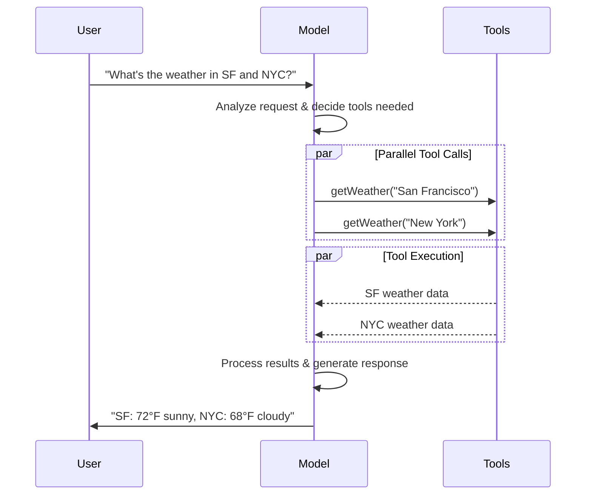

import ChatModelTabsPy from '/snippets/chat-model-tabs.mdx';
import ChatModelTabsJS from '/snippets/chat-model-tabs-js.mdx';

[LLM](https://en.wikipedia.org/wiki/Large_language_model) 是强大的 AI 工具，可以像人类一样解释和生成文本。它们足够通用，可以编写内容、翻译语言、总结和回答问题，而无需针对每个任务进行专门训练。

除了文本生成，许多模型还支持：

* <Icon icon="hammer" size={16} /> [工具调用](#tool-calling) - 调用外部工具（如数据库查询或 API 调用）并在响应中使用结果。
* <Icon icon="shapes" size={16} /> [结构化输出](#structured-output) - 模型的响应被约束为遵循定义的格式。
* <Icon icon="image" size={16} /> [多模态](#multimodal) - 处理和返回文本以外的数据，如图像、音频和视频。
* <Icon icon="brain" size={16} /> [推理](#reasoning) - 模型执行多步推理以得出结论。

模型是 [Agent](/oss/javascript/langchain/agents) 的推理引擎。它们驱动 Agent 的决策过程，决定调用哪些工具、如何解释结果以及何时提供最终答案。

你选择的模型的质量和能力直接影响 Agent 的基线可靠性和性能。不同的模型擅长不同的任务——有些更擅长遵循复杂指令，有些更擅长结构化推理，有些支持更大的上下文窗口来处理更多信息。

LangChain 的标准模型接口让你可以访问许多不同的服务商集成，这使得实验和切换模型以找到最适合你用例的模型变得容易。

<Info>
    有关服务商特定的集成信息和功能，请参阅服务商的[聊天模型页面](/oss/javascript/integrations/chat)。
</Info>

## 基本用法

模型可以通过两种方式使用：

1. **与 Agent 一起** - 在创建 [Agent](/oss/javascript/langchain/agents#model) 时可以动态指定模型。
2. **独立使用** - 模型可以直接调用（在 Agent 循环之外）用于文本生成、分类或提取等任务，而无需 Agent 框架。

相同的模型接口在两种上下文中都有效，这为你提供了灵活性，可以从简单开始，并根据需要扩展到更复杂的基于 Agent 的工作流。

### 初始化模型


The easiest way to get started with a standalone model in LangChain is to use `initChatModel` to initialize one from a [chat model provider](/oss/javascript/integrations/chat) of your choice (examples below):

<ChatModelTabsJS />
```typescript
const response = await model.invoke("Why do parrots talk?");
```
See [`initChatModel`](https://reference.langchain.com/javascript/functions/langchain.chat_models_universal.initChatModel.html) for more detail, including information on how to pass model [parameters](#parameters).


### 支持的模型

LangChain 支持所有主要的模型服务商，包括 OpenAI、Anthropic、Google、Azure、AWS Bedrock 等。每个服务商提供具有不同功能的各种模型。有关 LangChain 中支持的模型的完整列表，请参阅[集成页面](/oss/javascript/integrations/providers/overview)。

### 关键方法

<Card title="Invoke" href="#invoke" icon="paper-plane" arrow="true" horizontal>
    模型接收消息作为输入，并在生成完整响应后输出消息。
</Card>
<Card title="Stream" href="#stream" icon="tower-broadcast" arrow="true" horizontal>
    调用模型，但实时流式传输生成的输出。
</Card>
<Card title="Batch" href="#batch" icon="grip" arrow="true" horizontal>
    批量向模型发送多个请求以提高处理效率。
</Card>

<Info>
    除了聊天模型，LangChain 还支持其他相关技术，如嵌入模型和向量存储。有关详细信息，请参阅[集成页面](/oss/javascript/integrations/providers/overview)。
</Info>

## 参数

聊天模型接受可用于配置其行为的参数。支持的完整参数集因模型和服务商而异，但标准参数包括：

<ParamField body="model" type="string" required>
   你想要与服务商一起使用的特定模型的名称或标识符。你也可以使用 '{model_provider}:{model}' 格式在单个参数中同时指定模型及其服务商，例如 'openai:o1'。
</ParamField>


<ParamField body="apiKey" type="string">
    用于与模型服务商进行身份验证的密钥。这通常在你注册访问模型时颁发。通常通过设置<Tooltip tip="一个值在程序外部设置的变量，通常通过操作系统或微服务内置的功能。">环境变量</Tooltip>来访问。
</ParamField>


<ParamField body="temperature" type="number">
    控制模型输出的随机性。数值越高，响应越有创意；数值越低，响应越确定性。
</ParamField>


<ParamField body="maxTokens" type="number">
    限制响应中 <Tooltip tip="模型读取和生成的基本单位。服务商可能对其定义不同，但通常它们可以表示一个完整的词或词的一部分。">token</Tooltip> 的总数，有效控制输出的长度。
</ParamField>


<ParamField body="timeout" type="number">
    在取消请求之前等待模型响应的最长时间（以秒为单位）。
</ParamField>


<ParamField body="maxRetries" type="number">
    如果请求因网络超时或速率限制等问题而失败，系统将尝试重新发送请求的最大次数。
</ParamField>


Using `initChatModel`, pass these parameters as inline parameters:

```typescript Initialize using model parameters
const model = await initChatModel(
    "claude-sonnet-4-5-20250929",
    { temperature: 0.7, timeout: 30, max_tokens: 1000 }
)
```


<Info>
    每个聊天模型集成可能有额外的参数用于控制服务商特定的功能。

    例如，[`ChatOpenAI`](https://reference.langchain.com/javascript/classes/_langchain_openai.ChatOpenAI.html) 有 `use_responses_api` 来决定是否使用 OpenAI Responses 或 Completions API。

    要查找给定聊天模型支持的所有参数，请前往[聊天模型集成](/oss/javascript/integrations/chat)页面。
</Info>

---

## 调用

必须调用聊天模型才能生成输出。有三种主要的调用方法，每种都适合不同的用例。

### Invoke

调用模型最直接的方式是使用 [`invoke()`](https://reference.langchain.com/javascript/classes/_langchain_core.language_models_chat_models.BaseChatModel.html#invoke) 传入单个消息或消息列表。


```typescript Single message
const response = await model.invoke("Why do parrots have colorful feathers?");
console.log(response);
```


可以向聊天模型提供消息列表来表示对话历史。每条消息都有一个角色，模型使用该角色来指示对话中是谁发送了该消息。

有关角色、类型和内容的更多详细信息，请参阅[消息](/oss/javascript/langchain/messages)指南。


```typescript Object format
const conversation = [
  { role: "system", content: "You are a helpful assistant that translates English to French." },
  { role: "user", content: "Translate: I love programming." },
  { role: "assistant", content: "J'adore la programmation." },
  { role: "user", content: "Translate: I love building applications." },
];

const response = await model.invoke(conversation);
console.log(response);  // AIMessage("J'adore créer des applications.")
```
```typescript Message objects
import { HumanMessage, AIMessage, SystemMessage } from "langchain";

const conversation = [
  new SystemMessage("You are a helpful assistant that translates English to French."),
  new HumanMessage("Translate: I love programming."),
  new AIMessage("J'adore la programmation."),
  new HumanMessage("Translate: I love building applications."),
];

const response = await model.invoke(conversation);
console.log(response);  // AIMessage("J'adore créer des applications.")
```


<Info>
    如果你的调用返回类型是字符串，请确保你使用的是聊天模型而不是 LLM。传统的文本补全 LLM 直接返回字符串。LangChain 聊天模型以 "Chat" 为前缀，例如 [`ChatOpenAI`](https://reference.langchain.com/javascript/classes/_langchain_openai.ChatOpenAI.html)(/oss/integrations/chat/openai)。
</Info>

### Stream

大多数模型可以在生成输出内容时流式传输它。通过逐步显示输出，流式传输显著改善了用户体验，特别是对于较长的响应。

调用 [`stream()`](https://reference.langchain.com/javascript/classes/_langchain_core.language_models_chat_models.BaseChatModel.html#stream) 返回一个<Tooltip tip="一个按顺序逐步提供对集合中每个项目的访问的对象。">迭代器</Tooltip>，在产生输出块时生成它们。你可以使用循环实时处理每个块：


<CodeGroup>
    ```typescript Basic text streaming
    const stream = await model.stream("Why do parrots have colorful feathers?");
    for await (const chunk of stream) {
      console.log(chunk.text)
    }
    ```

    ```typescript Stream tool calls, reasoning, and other content
    const stream = await model.stream("What color is the sky?");
    for await (const chunk of stream) {
      for (const block of chunk.contentBlocks) {
        if (block.type === "reasoning") {
          console.log(`Reasoning: ${block.reasoning}`);
        } else if (block.type === "tool_call_chunk") {
          console.log(`Tool call chunk: ${block}`);
        } else if (block.type === "text") {
          console.log(block.text);
        } else {
          ...
        }
      }
    }
    ```
</CodeGroup>


与 [`invoke()`](#invoke) 不同（它在模型完成生成完整响应后返回单个 [`AIMessage`](https://reference.langchain.com/javascript/classes/_langchain_core.messages.AIMessage.html)），`stream()` 返回多个 [`AIMessageChunk`](https://reference.langchain.com/javascript/classes/_langchain_core.messages.AIMessageChunk.html) 对象，每个对象包含输出文本的一部分。重要的是，流中的每个块被设计为可以通过求和聚合成完整消息：


```typescript Construct AIMessage
let full: AIMessageChunk | null = null;
for await (const chunk of stream) {
  full = full ? full.concat(chunk) : chunk;
  console.log(full.text);
}

// The
// The sky
// The sky is
// The sky is typically
// The sky is typically blue
// ...

console.log(full.contentBlocks);
// [{"type": "text", "text": "The sky is typically blue..."}]
```


结果消息可以像使用 [`invoke()`](#invoke) 生成的消息一样处理——例如，它可以聚合到消息历史中并作为对话上下文传回模型。

<Warning>
    流式传输仅在程序中的所有步骤都知道如何处理块流时才有效。例如，一个不支持流式传输的应用程序是需要在处理之前将整个输出存储在内存中的应用程序。
</Warning>

<Accordion title="高级流式传输主题">
    <Accordion title="流式事件">


        LangChain chat models can also stream semantic events using
        [`streamEvents()`][BaseChatModel.streamEvents].

        This simplifies filtering based on event types and other metadata, and will aggregate the full message in the background. See below for an example.

        ```typescript
        const stream = await model.streamEvents("Hello");
        for await (const event of stream) {
            if (event.event === "on_chat_model_start") {
                console.log(`Input: ${event.data.input}`);
            }
            if (event.event === "on_chat_model_stream") {
                console.log(`Token: ${event.data.chunk.text}`);
            }
            if (event.event === "on_chat_model_end") {
                console.log(`Full message: ${event.data.output.text}`);
            }
        }
        ```
        ```txt
        Input: Hello
        Token: Hi
        Token:  there
        Token: !
        Token:  How
        Token:  can
        Token:  I
        ...
        Full message: Hi there! How can I help today?
        ```

        See the [`streamEvents()`](https://reference.langchain.com/javascript/classes/_langchain_core.language_models_chat_models.BaseChatModel.html#streamEvents) reference for event types and other details.

    </Accordion>
    <Accordion title='"自动流式传输"聊天模型'>
        LangChain 通过在某些情况下自动启用流式模式来简化聊天模型的流式传输，即使你没有显式调用流式方法。当你使用非流式 invoke 方法但仍想流式传输整个应用程序（包括聊天模型的中间结果）时，这特别有用。

        例如，在 [LangGraph Agent](/oss/javascript/langchain/agents) 中，你可以在节点内调用 `model.invoke()`，但如果在流式模式下运行，LangChain 将自动委托给流式传输。

        #### 工作原理

        当你 `invoke()` 聊天模型时，如果 LangChain 检测到你正在尝试流式传输整个应用程序，它将自动切换到内部流式模式。就使用 invoke 的代码而言，调用的结果将相同；然而，当聊天模型正在流式传输时，LangChain 将负责在 LangChain 的回调系统中调用 [`on_llm_new_token`](https://reference.langchain.com/javascript/interfaces/_langchain_core.callbacks_base.BaseCallbackHandlerMethods.html#onLlmNewToken) 事件。


        回调事件允许 LangGraph `stream()` 和 `streamEvents()` 实时展示聊天模型的输出。

    </Accordion>
</Accordion>

### Batch

将独立请求的集合批量发送到模型可以显著提高性能并降低成本，因为处理可以并行完成：


```typescript Batch
const responses = await model.batch([
  "Why do parrots have colorful feathers?",
  "How do airplanes fly?",
  "What is quantum computing?",
  "Why do parrots have colorful feathers?",
  "How do airplanes fly?",
  "What is quantum computing?",
]);
for (const response of responses) {
  console.log(response);
}
```

<Tip>
    When processing a large number of inputs using `batch()`, you may want to control the maximum number of parallel calls. This can be done by setting the `maxConcurrency` attribute in the [`RunnableConfig`](https://reference.langchain.com/javascript/interfaces/_langchain_core.runnables.RunnableConfig.html) dictionary.

    ```typescript Batch with max concurrency
    model.batch(
      listOfInputs,
      {
        maxConcurrency: 5,  // Limit to 5 parallel calls
      }
    )
    ```

    See the [`RunnableConfig`](https://reference.langchain.com/javascript/interfaces/_langchain_core.runnables.RunnableConfig.html) reference for a full list of supported attributes.
</Tip>

For more details on batching, see the [reference](https://reference.langchain.com/javascript/classes/_langchain_core.language_models_chat_models.BaseChatModel.html#batch).


---

## 工具调用

模型可以请求调用执行任务的工具，如从数据库获取数据、搜索网络或运行代码。工具由以下部分组成：

1. 一个模式，包括工具的名称、描述和/或参数定义（通常是 JSON schema）
2. 要执行的函数或<Tooltip tip="可以暂停执行并在稍后恢复的方法">协程</Tooltip>。

<Note>
    你可能会听到"函数调用"这个术语。我们将其与"工具调用"互换使用。
</Note>

以下是用户和模型之间的基本工具调用流程：





要使你定义的工具可供模型使用，你必须使用 [`bindTools`](https://reference.langchain.com/javascript/classes/_langchain_core.language_models_chat_models.BaseChatModel.html#bindTools) 绑定它们。在后续调用中，模型可以根据需要选择调用任何绑定的工具。


一些模型服务商提供可以通过模型或调用参数启用的<Tooltip tip="在服务器端执行的工具，如网络搜索和代码解释器">内置工具</Tooltip>（例如 [`ChatOpenAI`](/oss/javascript/integrations/chat/openai)、[`ChatAnthropic`](/oss/javascript/integrations/chat/anthropic)）。有关详细信息，请查看相应的[服务商参考](/oss/javascript/integrations/providers/overview)。

<Tip>
    有关创建工具的详细信息和其他选项，请参阅[工具指南](/oss/javascript/langchain/tools)。
</Tip>


```typescript Binding user tools
import { tool } from "langchain";
import * as z from "zod";
import { ChatOpenAI } from "@langchain/openai";

const getWeather = tool(
  (input) => `It's sunny in ${input.location}.`,
  {
    name: "get_weather",
    description: "Get the weather at a location.",
    schema: z.object({
      location: z.string().describe("The location to get the weather for"),
    }),
  },
);

const model = new ChatOpenAI({ model: "gpt-4o" });
const modelWithTools = model.bindTools([getWeather]);  // [!code highlight]

const response = await modelWithTools.invoke("What's the weather like in Boston?");
const toolCalls = response.tool_calls || [];
for (const tool_call of toolCalls) {
  // View tool calls made by the model
  console.log(`Tool: ${tool_call.name}`);
  console.log(`Args: ${tool_call.args}`);
}
```


当绑定用户定义的工具时，模型的响应包含执行工具的**请求**。当独立于 [Agent](/oss/javascript/langchain/agents) 使用模型时，由你执行请求的工具并将结果返回给模型以供后续推理使用。当使用 [Agent](/oss/javascript/langchain/agents) 时，Agent 循环将为你处理工具执行循环。

下面，我们展示一些使用工具调用的常见方式。

<AccordionGroup>
    <Accordion title="工具执行循环" icon="arrow-rotate-right">
        当模型返回工具调用时，你需要执行工具并将结果传回模型。这创建了一个对话循环，模型可以使用工具结果来生成其最终响应。LangChain 包含 [Agent](/oss/javascript/langchain/agents) 抽象来为你处理这种编排。

        以下是一个简单的示例：


        ```typescript Tool execution loop
        // Bind (potentially multiple) tools to the model
        const modelWithTools = model.bindTools([get_weather])

        // Step 1: Model generates tool calls
        const messages = [{"role": "user", "content": "What's the weather in Boston?"}]
        const ai_msg = await modelWithTools.invoke(messages)
        messages.push(ai_msg)

        // Step 2: Execute tools and collect results
        for (const tool_call of ai_msg.tool_calls) {
            // Execute the tool with the generated arguments
            const tool_result = await get_weather.invoke(tool_call)
            messages.push(tool_result)
        }

        // Step 3: Pass results back to model for final response
        const final_response = await modelWithTools.invoke(messages)
        console.log(final_response.text)
        // "The current weather in Boston is 72°F and sunny."
        ```


        工具返回的每个 [`ToolMessage`](https://reference.langchain.com/javascript/classes/_langchain_core.messages.ToolMessage.html) 包含一个与原始工具调用匹配的 `tool_call_id`，帮助模型将结果与请求关联起来。
    </Accordion>
    <Accordion title="强制工具调用" icon="asterisk">
        默认情况下，模型可以根据用户的输入自由选择使用哪个绑定的工具。但是，你可能想要强制选择一个工具，确保模型使用特定工具或给定列表中的**任何**工具：


        <CodeGroup>
            ```typescript Force use of any tool
            const modelWithTools = model.bindTools([tool_1], { toolChoice: "any" })
            ```
            ```typescript Force use of specific tools
            const modelWithTools = model.bindTools([tool_1], { toolChoice: "tool_1" })
            ```
        </CodeGroup>

    </Accordion>
    <Accordion title="并行工具调用" icon="layer-group">
        许多模型支持在适当时并行调用多个工具。这允许模型同时从不同来源收集信息。


        ```typescript Parallel tool calls
        const modelWithTools = model.bind_tools([get_weather])

        const response = await modelWithTools.invoke(
            "What's the weather in Boston and Tokyo?"
        )


        // The model may generate multiple tool calls
        console.log(response.tool_calls)
        // [
        //   { name: 'get_weather', args: { location: 'Boston' }, id: 'call_1' },
        //   { name: 'get_time', args: { location: 'Tokyo' }, id: 'call_2' }
        // ]


        // Execute all tools (can be done in parallel with async)
        const results = []
        for (const tool_call of response.tool_calls || []) {
            if (tool_call.name === 'get_weather') {
                const result = await get_weather.invoke(tool_call)
                results.push(result)
            }
        }
        ```


        模型根据请求操作的独立性智能确定何时适合并行执行。

        <Tip>
        大多数支持工具调用的模型默认启用并行工具调用。一些（包括 [OpenAI](/oss/javascript/integrations/chat/openai) 和 [Anthropic](/oss/javascript/integrations/chat/anthropic)）允许你禁用此功能。为此，设置 `parallel_tool_calls=False`：
        ```python
        model.bind_tools([get_weather], parallel_tool_calls=False)
        ```
        </Tip>
    </Accordion>
    <Accordion title="流式工具调用" icon="rss">
        在流式响应时，工具调用通过 [`ToolCallChunk`](https://reference.langchain.com/javascript/classes/_langchain_core.messages.ToolCallChunk.html) 逐步构建。这允许你在工具调用生成时查看它们，而不是等待完整的响应。


        ```typescript Streaming tool calls
        const stream = await modelWithTools.stream(
            "What's the weather in Boston and Tokyo?"
        )
        for await (const chunk of stream) {
            // Tool call chunks arrive progressively
            if (chunk.tool_call_chunks) {
                for (const tool_chunk of chunk.tool_call_chunks) {
                console.log(`Tool: ${tool_chunk.get('name', '')}`)
                console.log(`Args: ${tool_chunk.get('args', '')}`)
                }
            }
        }

        // Output:
        // Tool: get_weather
        // Args:
        // Tool:
        // Args: {"loc
        // Tool:
        // Args: ation": "BOS"}
        // Tool: get_time
        // Args:
        // Tool:
        // Args: {"timezone": "Tokyo"}
        ```

        You can accumulate chunks to build complete tool calls:

        ```typescript Accumulate tool calls
        let full: AIMessageChunk | null = null
        const stream = await modelWithTools.stream("What's the weather in Boston?")
        for await (const chunk of stream) {
            full = full ? full.concat(chunk) : chunk
            console.log(full.contentBlocks)
        }
        ```


    </Accordion>
</AccordionGroup>

---

## 结构化输出

可以请求模型以匹配给定模式的格式提供其响应。这对于确保输出可以轻松解析并在后续处理中使用很有用。LangChain 支持多种模式类型和强制结构化输出的方法。

<Tip>
    要了解结构化输出，请参阅[结构化输出](/oss/javascript/langchain/structured-output)。
</Tip>


<Tabs>
    <Tab title="Zod">
        A [zod schema](https://zod.dev/) is the preferred method of defining an output schema. Note that when a zod schema is provided, the model output will also be validated against the schema using zod's parse methods.

        ```typescript
        import * as z from "zod";

        const Movie = z.object({
          title: z.string().describe("The title of the movie"),
          year: z.number().describe("The year the movie was released"),
          director: z.string().describe("The director of the movie"),
          rating: z.number().describe("The movie's rating out of 10"),
        });

        const modelWithStructure = model.withStructuredOutput(Movie);

        const response = await modelWithStructure.invoke("Provide details about the movie Inception");
        console.log(response);
        // {
        //   title: "Inception",
        //   year: 2010,
        //   director: "Christopher Nolan",
        //   rating: 8.8,
        // }
        ```
    </Tab>
    <Tab title="JSON Schema">
        For maximum control or interoperability, you can provide a raw JSON Schema.

        ```typescript
        const jsonSchema = {
          "title": "Movie",
          "description": "A movie with details",
          "type": "object",
          "properties": {
            "title": {
              "type": "string",
              "description": "The title of the movie",
            },
            "year": {
              "type": "integer",
              "description": "The year the movie was released",
            },
            "director": {
              "type": "string",
              "description": "The director of the movie",
            },
            "rating": {
              "type": "number",
              "description": "The movie's rating out of 10",
            },
          },
          "required": ["title", "year", "director", "rating"],
        }

        const modelWithStructure = model.withStructuredOutput(
          jsonSchema,
          { method: "jsonSchema" },
        )

        const response = await modelWithStructure.invoke("Provide details about the movie Inception")
        console.log(response)  // {'title': 'Inception', 'year': 2010, ...}
        ```
    </Tab>
</Tabs>


<Note>
    **Key considerations for structured output:**

    - **Method parameter**: Some providers support different methods (`'jsonSchema'`, `'functionCalling'`, `'jsonMode'`)
    - **Include raw**: Use [`includeRaw: true`](https://reference.langchain.com/javascript/classes/_langchain_core.language_models_chat_models.BaseChatModel.html#withStructuredOutput) to get both the parsed output and the raw [`AIMessage`](https://reference.langchain.com/javascript/classes/_langchain_core.messages.AIMessage.html)
    - **Validation**: Zod models provide automatic validation, while JSON Schema requires manual validation

    See your [provider's integration page](/oss/javascript/integrations/providers/overview) for supported methods and configuration options.
</Note>


<Accordion title="Example: Message output alongside parsed structure">

It can be useful to return the raw [`AIMessage`](https://reference.langchain.com/javascript/classes/_langchain_core.messages.AIMessage.html) object alongside the parsed representation to access response metadata such as [token counts](#token-usage). To do this, set [`include_raw=True`](https://reference.langchain.com/javascript/classes/_langchain_core.language_models_chat_models.BaseChatModel.html#withStructuredOutput) when calling [`with_structured_output`](https://reference.langchain.com/javascript/classes/_langchain_core.language_models_chat_models.BaseChatModel.html#withStructuredOutput):


    ```typescript
    import * as z from "zod";

    const Movie = z.object({
      title: z.string().describe("The title of the movie"),
      year: z.number().describe("The year the movie was released"),
      director: z.string().describe("The director of the movie"),
      rating: z.number().describe("The movie's rating out of 10"),
      title: z.string().describe("The title of the movie"),
      year: z.number().describe("The year the movie was released"),
      director: z.string().describe("The director of the movie"),  // [!code highlight]
      rating: z.number().describe("The movie's rating out of 10"),
    });

    const modelWithStructure = model.withStructuredOutput(Movie, { includeRaw: true });

    const response = await modelWithStructure.invoke("Provide details about the movie Inception");
    console.log(response);
    // {
    //   raw: AIMessage { ... },
    //   parsed: { title: "Inception", ... }
    // }
    ```

</Accordion>
<Accordion title="Example: Nested structures">
    Schemas can be nested:


    ```typescript
    import * as z from "zod";

    const Actor = z.object({
      name: str
      role: z.string(),
    });

    const MovieDetails = z.object({
      title: z.string(),
      year: z.number(),
      cast: z.array(Actor),
      genres: z.array(z.string()),
      budget: z.number().nullable().describe("Budget in millions USD"),
    });

    const modelWithStructure = model.withStructuredOutput(MovieDetails);
    ```

</Accordion>

---

## 高级主题

### 模型配置文件

<Info>
    模型配置文件需要 `langchain>=1.1`。
</Info>


LangChain chat models can expose a dictionary of supported features and capabilities through a `.profile` property:

```typescript
model.profile;
// {
//   maxInputTokens: 400000,
//   imageInputs: true,
//   reasoningOutput: true,
//   toolCalling: true,
//   ...
// }
```

Refer to the full set of fields in the [API reference](https://reference.langchain.com/javascript/interfaces/_langchain_core.language_models_profile.ModelProfile.html).

Much of the model profile data is powered by the [models.dev](https://github.com/sst/models.dev) project, an open source initiative that provides model capability data. This data is augmented with additional fields for purposes of use with LangChain. These augmentations are kept aligned with the upstream project as it evolves.

Model profile data allow applications to work around model capabilities dynamically. For example:

1. [Summarization middleware](/oss/javascript/langchain/middleware/built-in#summarization) can trigger summarization based on a model's context window size.
2. [Structured output](/oss/javascript/langchain/structured-output) strategies in `createAgent` can be inferred automatically (e.g., by checking support for native structured output features).
3. Model inputs can be gated based on supported [modalities](#multimodal) and maximum input tokens.

<Accordion title="Modify profile data">
    Model profile data can be changed if it is missing, stale, or incorrect.

    **Option 1 (quick fix)**

    You can instantiate a chat model with any valid profile:

    ```typescript
    const customProfile = {
    maxInputTokens: 100_000,
    toolCalling: true,
    structuredOutput: true,
    // ...
    };
    const model = initChatModel("...", { profile: customProfile });
    ```

    **Option 2 (fix data upstream)**

    The primary source for the data is the [models.dev](https://models.dev/) project. These data are merged with additional fields and overrides in LangChain [integration packages](/oss/javascript/integrations/providers/overview) and are shipped with those packages.

    Model profile data can be updated through the following process:

    1. (If needed) update the source data at [models.dev](https://models.dev/) through a pull request to its [repository on GitHub](https://github.com/sst/models.dev).
    2. (If needed) update additional fields and overrides in `langchain-<package>/profiles.toml` through a pull request to the LangChain [integration package](/oss/javascript/integrations/providers/overview).
</Accordion>


<Warning>
    模型配置文件是一个测试版功能。配置文件的格式可能会发生变化。
</Warning>

### 多模态

某些模型可以处理和返回非文本数据，如图像、音频和视频。你可以通过提供[内容块](/oss/javascript/langchain/messages#message-content)向模型传递非文本数据。

<Tip>
    所有具有底层多模态能力的 LangChain 聊天模型支持：

    1. 跨服务商标准格式的数据（参见[我们的消息指南](/oss/javascript/langchain/messages)）
    2. OpenAI [chat completions](https://platform.openai.com/docs/api-reference/chat) 格式
    3. 特定服务商原生的任何格式（例如，Anthropic 模型接受 Anthropic 原生格式）
</Tip>

有关详细信息，请参阅消息指南的[多模态部分](/oss/javascript/langchain/messages#multimodal)。

<Tooltip tip="并非所有 LLM 都是相同的！" cta="查看参考" href="https://models.dev/">某些模型</Tooltip>可以在其响应中返回多模态数据。如果被调用这样做，生成的 [`AIMessage`](https://reference.langchain.com/javascript/classes/_langchain_core.messages.AIMessage.html) 将具有多模态类型的内容块。


```typescript Multimodal output
const response = await model.invoke("Create a picture of a cat");
console.log(response.contentBlocks);
// [
//   { type: "text", text: "Here's a picture of a cat" },
//   { type: "image", data: "...", mimeType: "image/jpeg" },
// ]
```


有关特定服务商的详细信息，请参阅[集成页面](/oss/javascript/integrations/providers/overview)。

### 推理

许多模型能够执行多步推理以得出结论。这涉及将复杂问题分解为更小、更易管理的步骤。

**如果底层模型支持，**你可以展示这个推理过程，以更好地理解模型是如何得出其最终答案的。


<CodeGroup>
    ```typescript Stream reasoning output
    const stream = model.stream("Why do parrots have colorful feathers?");
    for await (const chunk of stream) {
        const reasoningSteps = chunk.contentBlocks.filter(b => b.type === "reasoning");
        console.log(reasoningSteps.length > 0 ? reasoningSteps : chunk.text);
    }
    ```

    ```typescript Complete reasoning output
    const response = await model.invoke("Why do parrots have colorful feathers?");
    const reasoningSteps = response.contentBlocks.filter(b => b.type === "reasoning");
    console.log(reasoningSteps.map(step => step.reasoning).join(" "));
    ```
</CodeGroup>


根据模型的不同，你有时可以指定它应该在推理上投入的努力程度。同样，你可以请求模型完全关闭推理。这可能采用分类"层级"的推理形式（例如 `'low'` 或 `'high'`）或整数 token 预算。

有关详细信息，请参阅相应聊天模型的[集成页面](/oss/javascript/integrations/providers/overview)或[参考文档](https://reference.langchain.com/python/integrations/)。


### 本地模型

LangChain 支持在你自己的硬件上本地运行模型。这对于数据隐私至关重要、你想调用自定义模型或者你想避免使用云端模型产生的成本等场景很有用。

[Ollama](/oss/javascript/integrations/chat/ollama) 是本地运行聊天和嵌入模型最简单的方式之一。

{/* TODO: whenever we have a better integrations directory, x-ref to that page with a local query filter */}

### 提示词缓存

许多服务商提供提示词缓存功能，以减少重复处理相同 token 的延迟和成本。这些功能可以是**隐式**或**显式**的：

- **隐式提示词缓存：**如果请求命中缓存，服务商将自动传递成本节省。示例：[OpenAI](/oss/javascript/integrations/chat/openai) 和 [Gemini](/oss/javascript/integrations/chat/google_generative_ai)。
- **显式缓存：**服务商允许你手动指示缓存点以获得更大的控制或保证成本节省。示例：
    - [`ChatOpenAI`](https://reference.langchain.com/javascript/classes/_langchain_openai.ChatOpenAI.html)（通过 `prompt_cache_key`）
    - Anthropic 的 [`AnthropicPromptCachingMiddleware`](/oss/javascript/integrations/chat/anthropic#prompt-caching)
    - [Gemini](https://reference.langchain.com/python/integrations/langchain_google_genai/)
    - [AWS Bedrock](/oss/javascript/integrations/chat/bedrock#prompt-caching)

<Warning>
    提示词缓存通常仅在超过最小输入 token 阈值时才会启用。有关详细信息，请参阅[服务商页面](/oss/javascript/integrations/chat)。
</Warning>

缓存使用情况将反映在模型响应的[使用元数据](/oss/javascript/langchain/messages#token-usage)中。

### 服务器端工具使用

一些服务商支持服务器端[工具调用](#tool-calling)循环：模型可以与网络搜索、代码解释器和其他工具交互，并在单个对话轮次中分析结果。

如果模型在服务器端调用工具，响应消息的内容将包含表示工具调用和结果的内容。访问响应的[内容块](/oss/javascript/langchain/messages#standard-content-blocks)将以服务商无关的格式返回服务器端工具调用和结果：


```typescript
import { initChatModel } from "langchain";

const model = await initChatModel("gpt-4.1-mini");
const modelWithTools = model.bindTools([{ type: "web_search" }])

const message = await modelWithTools.invoke("What was a positive news story from today?");
console.log(message.contentBlocks);
```

这表示单个对话轮次；不需要像客户端[工具调用](#tool-calling)那样传入相关的 [ToolMessage](/oss/javascript/langchain/messages#tool-message) 对象。

有关可用工具和使用详情，请参阅给定服务商的[集成页面](/oss/javascript/integrations/chat)。


### 基础 URL 或代理

对于许多聊天模型集成，你可以配置 API 请求的基础 URL，这允许你使用具有 OpenAI 兼容 API 的模型服务商或使用代理服务器。

<Accordion title="Base URL" icon="link">


    Many model providers offer OpenAI-compatible APIs (e.g., [Together AI](https://www.together.ai/), [vLLM](https://github.com/vllm-project/vllm)). You can use `initChatModel` with these providers by specifying the appropriate `base_url` parameter:

    ```python
    model = initChatModel(
        "MODEL_NAME",
        {
            modelProvider: "openai",
            baseUrl: "BASE_URL",
            apiKey: "YOUR_API_KEY",
        }
    )
    ```


    <Note>
        When using direct chat model class instantiation, the parameter name may vary by provider. Check the respective [reference](/oss/javascript/integrations/providers/overview) for details.
    </Note>
</Accordion>


### 对数概率

某些模型可以配置为返回表示给定 token 可能性的 token 级对数概率，方法是在初始化模型时设置 `logprobs` 参数：


```typescript
const model = new ChatOpenAI({
    model: "gpt-4o",
    logprobs: true,
});

const responseMessage = await model.invoke("Why do parrots talk?");

responseMessage.response_metadata.logprobs.content.slice(0, 5);
```


### Token 使用量

许多模型服务商在调用响应中返回 token 使用信息。当可用时，此信息将包含在相应模型产生的 [`AIMessage`](https://reference.langchain.com/javascript/classes/_langchain_core.messages.AIMessage.html) 对象中。有关更多详细信息，请参阅[消息](/oss/javascript/langchain/messages)指南。

<Note>
    一些服务商 API，特别是 OpenAI 和 Azure OpenAI chat completions，要求用户选择加入以在流式上下文中接收 token 使用数据。有关详细信息，请参阅集成指南的[流式使用元数据](/oss/javascript/integrations/chat/openai#streaming-usage-metadata)部分。
</Note>


### 调用配置


调用模型时，你可以使用 [`RunnableConfig`](https://reference.langchain.com/javascript/interfaces/_langchain_core.runnables.RunnableConfig.html) 对象通过 `config` 参数传递额外的配置。这提供了对执行行为、回调和元数据跟踪的运行时控制。


常见的配置选项包括：


```typescript Invocation with config
const response = await model.invoke(
    "Tell me a joke",
    {
        runName: "joke_generation",      // Custom name for this run
        tags: ["humor", "demo"],          // Tags for categorization
        metadata: {"user_id": "123"},     // Custom metadata
        callbacks: [my_callback_handler], // Callback handlers
    }
)
```


这些配置值在以下情况下特别有用：
- 使用 [LangSmith](https://docs.langchain.com/langsmith/home) 追踪进行调试
- 实现自定义日志记录或监控
- 在生产环境中控制资源使用
- 跨复杂流水线跟踪调用


<Accordion title="Key configuration attributes">
    <ParamField body="runName" type="string">
        Identifies this specific invocation in logs and traces. Not inherited by sub-calls.
    </ParamField>

    <ParamField body="tags" type="string[]">
        Labels inherited by all sub-calls for filtering and organization in debugging tools.
    </ParamField>

    <ParamField body="metadata" type="object">
        Custom key-value pairs for tracking additional context, inherited by all sub-calls.
    </ParamField>

    <ParamField body="maxConcurrency" type="number">
        Controls the maximum number of parallel calls when using `batch()`.
    </ParamField>

    <ParamField body="callbacks" type="CallbackHandler[]">
        Handlers for monitoring and responding to events during execution.
    </ParamField>

    <ParamField body="recursion_limit" type="number">
        Maximum recursion depth for chains to prevent infinite loops in complex pipelines.
    </ParamField>
</Accordion>


<Tip>
    See full [`RunnableConfig`](https://reference.langchain.com/javascript/interfaces/_langchain_core.runnables.RunnableConfig.html) reference for all supported attributes.
</Tip>

---

<Callout icon="pen-to-square" iconType="regular">
    [Edit this page on GitHub](https://github.com/langchain-ai/docs/edit/main/src/oss/langchain/models.mdx) or [file an issue](https://github.com/langchain-ai/docs/issues/new/choose).
</Callout>
<Tip icon="terminal" iconType="regular">
    [Connect these docs](/use-these-docs) to Claude, VSCode, and more via MCP for real-time answers.
</Tip>
<div class='fixed right-2 bg-white bottom-2'></div>