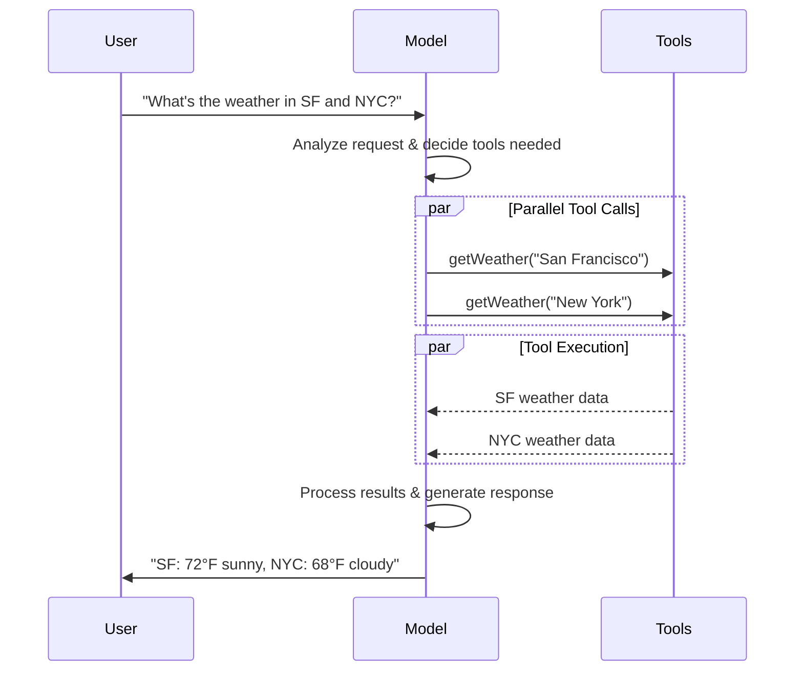

import ChatModelTabsPy from '/snippets/chat-model-tabs.mdx';
import ChatModelTabsJS from '/snippets/chat-model-tabs-js.mdx';

[LLM](https://en.wikipedia.org/wiki/Large_language_model) 是强大的 AI 工具，可以像人类一样解释和生成文本。它们足够灵活，可以编写内容、翻译语言、总结和回答问题，而无需针对每个任务进行专门培训。

除了文本生成之外，许多模型还支持：

* <Icon icon="hammer" size={16} /> [工具调用](#tool-calling) - 调用外部工具（如数据库查询或 API 调用）并在其响应中使用结果。
* <Icon icon="layout-grid" size={16} /> [结构化输出](#structured-output) - 模型的响应被限制为遵循定义的格式。
* <Icon icon="photo" size={16} /> [多模态](#multimodal) - 处理和返回除文本以外的数据，例如图像、音频和视频。
* <Icon icon="brain" size={16} /> [推理](#reasoning) - 模型执行多步推理以得出结论。

模型是 [代理](/oss/javascript/langchain/agents) 的推理引擎。它们驱动代理的决策过程，决定调用哪些工具、如何解释结果以及何时提供最终答案。

您选择的模型的质量和能力直接影响代理的基线可靠性和性能。不同的模型擅长不同的任务 - 有些更擅长遵循复杂的指令，有些更擅长结构化推理，有些支持更大的上下文窗口以处理更多信息。

LangChain 的标准模型接口允许您访问许多不同的提供商集成，这使得尝试和在模型之间切换变得容易，以找到最适合您的用例的模型。

<Info>
    有关特定于提供商的集成信息和功能，请参阅提供商的 [聊天模型页面](/oss/javascript/integrations/chat)。
</Info>

## 基本用法

可以通过两种方式使用模型：

1. **与代理一起使用** - 创建 [代理](/oss/javascript/langchain/agents#model) 时可以动态指定模型。
2. **独立使用** - 可以直接调用模型（在代理循环之外）执行文本生成、分类或提取等任务，而无需代理框架。

相同的模型接口在两种上下文中都适用，这为您提供了从简单开始并根据需要扩展到更复杂的基于代理的工作流的灵活性。

### 初始化模型

在 LangChain 中开始使用独立模型的最简单方法是使用 `initChatModel` 从您选择的 [聊天模型提供商](/oss/javascript/integrations/chat) 初始化一个（示例如下）：

<ChatModelTabsJS />
```typescript
const response = await model.invoke("Why do parrots talk?");
```
有关更多详细信息，包括有关如何传递模型 [参数](#parameters) 的信息，请参阅 [`initChatModel`](https://reference.langchain.com/javascript/langchain/chat_models/universal/initChatModel)。

### 支持的模型

LangChain 支持所有主要模型提供商，包括 OpenAI、Anthropic、Google、Azure、AWS Bedrock 等。每个提供商都提供各种具有不同功能的模型。有关 LangChain 中支持的模型的完整列表，请参阅 [集成页面](/oss/javascript/integrations/providers/overview)。

### 关键方法

<Card title="Invoke (调用)" href="#invoke" icon="send" arrow="true" horizontal>
    模型将消息作为输入，并在生成完整响应后输出消息。
</Card>
<Card title="Stream (流式传输)" href="#stream" icon="broadcast" arrow="true" horizontal>
    调用模型，但实时流式传输生成的输出。
</Card>
<Card title="Batch (批处理)" href="#batch" icon="grip-vertical" arrow="true" horizontal>
    批量向模型发送多个请求以进行更高效的处理。
</Card>

<Info>
    除了聊天模型外，LangChain 还支持其他相关技术，例如嵌入模型和向量存储。有关详细信息，请参阅 [集成页面](/oss/javascript/integrations/providers/overview)。
</Info>

## 参数

聊天模型接受可用于配置其行为的参数。支持的完整参数集因模型和提供商而异，但标准参数包括：

<ParamField body="model" type="string" required>
   您希望与提供商一起使用的特定模型的名称或标识符。您还可以使用 '{model_provider}:{model}' 格式在单个参数中指定模型及其提供商，例如 'openai:o1'。
</ParamField>


<ParamField body="apiKey" type="string">
    与模型提供商进行身份验证所需的密钥。这通常在您注册访问模型时颁发。通常通过设置 <Tooltip tip="程序外部设置值的变量，通常通过操作系统或微服务内置的功能。">环境变量</Tooltip> 来访问。
</ParamField>


<ParamField body="temperature" type="number">
    控制模型输出的随机性。较高的数字使响应更具创造性；较低的数字使它们更具确定性。
</ParamField>


<ParamField body="maxTokens" type="number">
    限制响应中的 <Tooltip tip="模型读取和生成的基本单位。提供商可能有不同的定义，但通常，它们可以表示整个或部分单词。">令牌</Tooltip> 总数，有效地控制输出的长度。
</ParamField>


<ParamField body="timeout" type="number">
    在取消请求之前等待模型响应的最长时间（以秒为单位）。
</ParamField>


<ParamField body="maxRetries" type="number" default="6">
    如果请求由于网络超时或速率限制等问题而失败，系统将尝试重新发送请求的最大次数。重试使用带有抖动的指数退避。网络错误、速率限制 (429) 和服务器错误 (5xx) 会自动重试。客户端错误（如 401（未授权）或 404）不会重试。对于不可靠网络上的长时间运行的 [代理](/oss/javascript/deepagents/overview) 任务，请考虑将其增加到 10–15。
</ParamField>


使用 `initChatModel`，将这些参数作为内联参数传递：

```typescript Initialize using model parameters
const model = await initChatModel(
    "claude-sonnet-4-6",
    { temperature: 0.7, timeout: 30, maxTokens: 1000, maxRetries: 6 }
)
```


<Info>
    每个聊天模型集成可能有额外的参数用于控制特定于提供商的功能。

    例如，[`ChatOpenAI`](https://reference.langchain.com/javascript/langchain-openai/ChatOpenAI) 有 `use_responses_api` 来指示是否使用 OpenAI Responses 或 Completions API。

    要查找给定聊天模型支持的所有参数，请前往 [聊天模型集成](/oss/javascript/integrations/chat) 页面。
</Info>

---

## 调用

必须调用聊天模型以生成输出。主要有三种调用方法，每种方法都适用于不同的用例。

### Invoke (调用)

调用模型最直接的方法是使用带有单个消息或消息列表的 [`invoke()`](https://reference.langchain.com/javascript/classes/_langchain_core.language_models_chat_models.BaseChatModel.html#invoke)。

```typescript Single message
const response = await model.invoke("Why do parrots have colorful feathers?");
console.log(response);
```

可以将消息列表提供给聊天模型以表示对话历史记录。每条消息都有一个角色，模型使用该角色来指示谁在对话中发送了消息。

有关角色、类型和内容的更多详细信息，请参阅 [消息](/oss/javascript/langchain/messages) 指南。

```typescript Object format
const conversation = [
  { role: "system", content: "You are a helpful assistant that translates English to French." },
  { role: "user", content: "Translate: I love programming." },
  { role: "assistant", content: "J'adore la programmation." },
  { role: "user", content: "Translate: I love building applications." },
];

const response = await model.invoke(conversation);
console.log(response);  // AIMessage("J'adore créer des applications.")
```
```typescript Message objects
import { HumanMessage, AIMessage, SystemMessage } from "langchain";

const conversation = [
  new SystemMessage("You are a helpful assistant that translates English to French."),
  new HumanMessage("Translate: I love programming."),
  new AIMessage("J'adore la programmation."),
  new HumanMessage("Translate: I love building applications."),
];

const response = await model.invoke(conversation);
console.log(response);  // AIMessage("J'adore créer des applications.")
```

<Info>
    如果调用的返回类型是字符串，请确保您使用的是聊天模型而不是 LLM。传统的文本补全 LLM 直接返回字符串。LangChain 聊天模型以 "Chat" 为前缀，例如 [`ChatOpenAI`](https://reference.langchain.com/javascript/langchain-openai/ChatOpenAI)(/oss/integrations/chat/openai)。
</Info>

### Stream (流式传输)

大多数模型可以在生成输出内容时流式传输其输出内容。通过逐步显示输出，流式传输显着改善了用户体验，特别是对于较长的响应。

调用 [`stream()`](https://reference.langchain.com/javascript/classes/_langchain_core.language_models_chat_models.BaseChatModel.html#stream) 返回一个 <Tooltip tip="按顺序逐步提供对集合中每个项目的访问的对象。">迭代器</Tooltip>，该迭代器产生输出块。您可以使用循环实时处理每个块：

<CodeGroup>
    ```typescript Basic text streaming
    const stream = await model.stream("Why do parrots have colorful feathers?");
    for await (const chunk of stream) {
      console.log(chunk.text)
    }
    ```

    ```typescript Stream tool calls, reasoning, and other content
    const stream = await model.stream("What color is the sky?");
    for await (const chunk of stream) {
      for (const block of chunk.contentBlocks) {
        if (block.type === "reasoning") {
          console.log(`Reasoning: ${block.reasoning}`);
        } else if (block.type === "tool_call_chunk") {
          console.log(`Tool call chunk: ${block}`);
        } else if (block.type === "text") {
          console.log(block.text);
        } else {
          ...
        }
      }
    }
    ```
</CodeGroup>

与 [`invoke()`](#invoke)（在模型完成生成其完整响应后返回单个 [`AIMessage`](https://reference.langchain.com/javascript/langchain-core/messages/AIMessage)）相反，`stream()` 返回多个 [`AIMessageChunk`](https://reference.langchain.com/javascript/langchain-core/messages/AIMessageChunk) 对象，每个对象包含输出文本的一部分。重要的是，流中的每个块都被设计为可以通过求和收集成完整的消息：

```typescript Construct AIMessage
let full: AIMessageChunk | null = null;
for await (const chunk of stream) {
  full = full ? full.concat(chunk) : chunk;
  console.log(full.text);
}

// The
// The sky
// The sky is
// The sky is typically
// The sky is typically blue
// ...

console.log(full.contentBlocks);
// [{"type": "text", "text": "The sky is typically blue..."}]
```

生成的消息可以像用 [`invoke()`](#invoke) 生成的消息一样处理——例如，它可以聚合到消息历史记录中并传回给模型作为对话上下文。

<Warning>
    流式传输仅在程序中的所有步骤都知道如何处理块流时才有效。例如，一个不支持流式传输的应用程序需要在处理之前将整个输出存储在内存中。
</Warning>

<Accordion title="高级流式传输主题">
    <Accordion title="流式传输事件">

        LangChain 聊天模型还可以使用 [`streamEvents()`]([BaseChatModel.streamEvents]) 流式传输语义事件。

        这简化了基于事件类型和其他元数据的过滤，并将在后台聚合完整消息。请参阅下面的示例。

        ```typescript
        const stream = await model.streamEvents("Hello");
        for await (const event of stream) {
            if (event.event === "on_chat_model_start") {
                console.log(`Input: ${event.data.input}`);
            }
            if (event.event === "on_chat_model_stream") {
                console.log(`Token: ${event.data.chunk.text}`);
            }
            if (event.event === "on_chat_model_end") {
                console.log(`Full message: ${event.data.output.text}`);
            }
        }
        ```
        ```txt
        Input: Hello
        Token: Hi
        Token:  there
        Token: !
        Token:  How
        Token:  can
        Token:  I
        ...
        Full message: Hi there! How can I help today?
        ```

        有关事件类型和其他详细信息，请参阅 [`streamEvents()`](https://reference.langchain.com/javascript/classes/_langchain_core.language_models_chat_models.BaseChatModel.html#streamEvents) 参考。

    </Accordion>
    <Accordion title='"自动流式传输" 聊天模型'>
        LangChain 通过在某些情况下自动启用流式传输模式来简化聊天模型的流式传输，即使您没有显式调用流式传输方法也是如此。当您使用非流式传输的 invoke 方法但仍希望流式传输整个应用程序（包括来自聊天模型的中间结果）时，这特别有用。

        例如，在 [LangGraph 代理](/oss/javascript/langchain/agents) 中，您可以在节点内调用 `model.invoke()`, 但如果在流式传输模式下运行，LangChain 将自动委托给流式传输。

        #### 工作原理

        当您 `invoke()` 一个聊天模型时，如果 LangChain 检测到您正在尝试流式传输整个应用程序，它将自动切换到内部流式传输模式。调用的结果对于使用 invoke 的代码而言将是相同的；但是，在流式传输聊天模型时，LangChain 将负责在 LangChain 的回调系统中调用 [`on_llm_new_token`](https://reference.langchain.com/javascript/interfaces/_langchain_core.callbacks_base.BaseCallbackHandlerMethods.html#onLlmNewToken) 事件。

        回调事件允许 LangGraph `stream()` 和 `streamEvents()` 实时显示聊天模型的输出。

    </Accordion>
</Accordion>

### Batch (批处理)

批量处理对模型的独立请求集合可以显着提高性能并降低成本，因为处理可以并行完成：

```typescript Batch
const responses = await model.batch([
  "Why do parrots have colorful feathers?",
  "How do airplanes fly?",
  "What is quantum computing?",
  "Why do parrots have colorful feathers?",
  "How do airplanes fly?",
  "What is quantum computing?",
]);
for (const response of responses) {
  console.log(response);
}
```

<Tip>
    当使用 `batch()` 处理大量输入时，您可能希望控制最大并行调用数。这可以通过在 [`RunnableConfig`](https://reference.langchain.com/javascript/langchain-core/runnables/RunnableConfig) 字典中设置 `maxConcurrency` 属性来实现。

    ```typescript Batch with max concurrency
    model.batch(
      listOfInputs,
      {
        maxConcurrency: 5,  // Limit to 5 parallel calls
      }
    )
    ```

    有关支持属性的完整列表，请参阅 [`RunnableConfig`](https://reference.langchain.com/javascript/langchain-core/runnables/RunnableConfig) 参考。
</Tip>

有关批处理的更多详细信息，请参阅 [参考](https://reference.langchain.com/javascript/classes/_langchain_core.language_models_chat_models.BaseChatModel.html#batch)。

---

## 工具调用

模型可以请求调用执行诸如从数据库获取数据、搜索网络或运行代码等任务的工具。工具是以下的配对：

1. 模式，包括工具的名称、描述和/或参数定义（通常是 JSON 模式）
2. 要执行的函数或 <Tooltip tip="可以暂停执行并在稍后恢复的方法">协程</Tooltip>。

<Note>
    您可能会听到术语“函数调用”。我们将其与“工具调用”互换使用。
</Note>

这是用户和模型之间的基本工具调用流程：



要使您定义的工具可供模型使用，您必须使用 [`bindTools`](https://reference.langchain.com/javascript/classes/_langchain_core.language_models_chat_models.BaseChatModel.html#bindTools) 绑定它们。在后续调用中，模型可以根据需要选择调用任何绑定的工具。

一些模型提供商提供 <Tooltip tip="在服务器端执行的工具，例如网络搜索和代码解释器">内置工具</Tooltip>，可以通过模型或调用参数启用（例如 [`ChatOpenAI`](/oss/javascript/integrations/chat/openai), [`ChatAnthropic`](/oss/javascript/integrations/chat/anthropic)）。有关详细信息，请查看相应的 [提供商参考](/oss/javascript/integrations/providers/overview)。

<Tip>
    有关创建工具的详细信息和其他选项，请参阅 [工具指南](/oss/javascript/langchain/tools)。
</Tip>

```typescript Binding user tools
import { tool } from "langchain";
import * as z from "zod";
import { ChatOpenAI } from "@langchain/openai";

const getWeather = tool(
  (input) => `It's sunny in ${input.location}.`,
  {
    name: "get_weather",
    description: "Get the weather at a location.",
    schema: z.object({
      location: z.string().describe("The location to get the weather for"),
    }),
  },
);

const model = new ChatOpenAI({ model: "gpt-4.1" });
const modelWithTools = model.bindTools([getWeather]);  // [!code highlight]

const response = await modelWithTools.invoke("What's the weather like in Boston?");
const toolCalls = response.tool_calls || [];
for (const tool_call of toolCalls) {
  // View tool calls made by the model
  console.log(`Tool: ${tool_call.name}`);
  console.log(`Args: ${tool_call.args}`);
}
```

绑定用户定义的工具时，模型的响应包含执行工具的 **请求**。当与 [代理](/oss/javascript/langchain/agents) 分开使用模型时，由您来执行请求的工具并将结果返回给模型以供后续推理使用。当使用 [代理](/oss/javascript/langchain/agents) 时，代理循环将为您处理工具执行循环。

下面，我们展示了一些使用工具调用的常见方式。

<AccordionGroup>
    <Accordion title="工具执行循环" icon="refresh">
        当模型返回工具调用时，您需要执行工具并将结果传回模型。这将创建一个对话循环，模型可以在其中使用工具结果生成最终响应。LangChain 包含为您处理此编排的 [代理](/oss/javascript/langchain/agents) 抽象。

        这是一个如何做到这一点的简单示例：

        ```typescript Tool execution loop
        // Bind (potentially multiple) tools to the model
        const modelWithTools = model.bindTools([get_weather])

        // Step 1: Model generates tool calls
        const messages = [{"role": "user", "content": "What's the weather in Boston?"}]
        const ai_msg = await modelWithTools.invoke(messages)
        messages.push(ai_msg)

        // Step 2: Execute tools and collect results
        for (const tool_call of ai_msg.tool_calls) {
            // Execute the tool with the generated arguments
            const tool_result = await get_weather.invoke(tool_call)
            messages.push(tool_result)
        }

        // Step 3: Pass results back to model for final response
        const final_response = await modelWithTools.invoke(messages)
        console.log(final_response.text)
        // "The current weather in Boston is 72°F and sunny."
        ```

        工具返回的每个 [`ToolMessage`](https://reference.langchain.com/javascript/langchain-core/messages/ToolMessage) 都包含一个与原始工具调用匹配的 `tool_call_id`，帮助模型将结果与请求相关联。
    </Accordion>
    <Accordion title="强制工具调用" icon="asterisk">
        默认情况下，模型可以自由选择根据用户的输入使用哪个绑定工具。但是，您可能希望强制选择一个工具，确保模型使用特定工具或给定列表中的 **任何** 工具：

        <CodeGroup>
            ```typescript Force use of any tool
            const modelWithTools = model.bindTools([tool_1], { toolChoice: "any" })
            ```
            ```typescript Force use of specific tools
            const modelWithTools = model.bindTools([tool_1], { toolChoice: "tool_1" })
            ```
        </CodeGroup>

    </Accordion>
    <Accordion title="并行工具调用" icon="stack-2">
        许多模型支持在适当时并行调用多个工具。这允许模型同时从不同来源收集信息。

        ```typescript Parallel tool calls
        const modelWithTools = model.bind_tools([get_weather])

        const response = await modelWithTools.invoke(
            "What's the weather in Boston and Tokyo?"
        )

        // The model may generate multiple tool calls
        console.log(response.tool_calls)
        // [
        //   { name: 'get_weather', args: { location: 'Boston' }, id: 'call_1' },
        //   { name: 'get_time', args: { location: 'Tokyo' }, id: 'call_2' }
        // ]

        // Execute all tools (can be done in parallel with async)
        const results = []
        for (const tool_call of response.tool_calls || []) {
            if (tool_call.name === 'get_weather') {
                const result = await get_weather.invoke(tool_call)
                results.push(result)
            }
        }
        ```

        模型根据请求操作的独立性智能地确定何时适合并行执行。

        <Tip>
        大多数支持工具调用的模型默认启用并行工具调用。一些（包括 [OpenAI](/oss/javascript/integrations/chat/openai) 和 [Anthropic](/oss/javascript/integrations/chat/anthropic)）允许您禁用此功能。为此，请设置 `parallel_tool_calls=False`：
        ```python
        model.bind_tools([get_weather], parallel_tool_calls=False)
        ```
        </Tip>
    </Accordion>
    <Accordion title="流式传输工具调用" icon="rss">
        流式传输响应时，工具调用通过 [`ToolCallChunk`](https://reference.langchain.com/javascript/langchain-core/messages/ContentBlock/Tools/ToolCallChunk) 逐步构建。这允许您在生成工具调用时看到它们，而不是等待完整的响应。

        ```typescript Streaming tool calls
        const stream = await modelWithTools.stream(
            "What's the weather in Boston and Tokyo?"
        )
        for await (const chunk of stream) {
            // Tool call chunks arrive progressively
            if (chunk.tool_call_chunks) {
                for (const tool_chunk of chunk.tool_call_chunks) {
                console.log(`Tool: ${tool_chunk.get('name', '')}`)
                console.log(`Args: ${tool_chunk.get('args', '')}`)
                }
            }
        }

        // Output:
        // Tool: get_weather
        // Args:
        // Tool:
        // Args: {"loc
        // Tool:
        // Args: ation": "BOS"}
        // Tool: get_time
        // Args:
        // Tool:
        // Args: {"timezone": "Tokyo"}
        ```

        您可以累积块以构建完整的工具调用：

        ```typescript Accumulate tool calls
        let full: AIMessageChunk | null = null
        const stream = await modelWithTools.stream("What's the weather in Boston?")
        for await (const chunk of stream) {
            full = full ? full.concat(chunk) : chunk
            console.log(full.contentBlocks)
        }
        ```

    </Accordion>
</AccordionGroup>

---

## 结构化输出

可以请求模型以匹配给定模式的格式提供响应。这对于确保可以轻松解析输出并将其用于后续处理非常有用。LangChain 支持多种模式类型和强制结构化输出的方法。

<Tip>
    要了解结构化输出，请参阅 [结构化输出](/oss/javascript/langchain/structured-output)。
</Tip>

<Tabs>
    <Tab title="Zod">
        [zod schema](https://zod.dev/) 是定义输出模式的首选方法。请注意，当提供 zod 模式时，模型输出也将使用 zod 的 parse 方法针对模式进行验证。

        ```typescript
        import * as z from "zod";

        const Movie = z.object({
          title: z.string().describe("The title of the movie"),
          year: z.number().describe("The year the movie was released"),
          director: z.string().describe("The director of the movie"),
          rating: z.number().describe("The movie's rating out of 10"),
        });

        const modelWithStructure = model.withStructuredOutput(Movie);

        const response = await modelWithStructure.invoke("Provide details about the movie Inception");
        console.log(response);
        // {
        //   title: "Inception",
        //   year: 2010,
        //   director: "Christopher Nolan",
        //   rating: 8.8,
        // }
        ```
    </Tab>
    <Tab title="JSON Schema">
        为了最大程度的控制或互操作性，您可以提供原始 JSON Schema。

        ```typescript
        const jsonSchema = {
          "title": "Movie",
          "description": "A movie with details",
          "type": "object",
          "properties": {
            "title": {
              "type": "string",
              "description": "The title of the movie",
            },
            "year": {
              "type": "integer",
              "description": "The year the movie was released",
            },
            "director": {
              "type": "string",
              "description": "The director of the movie",
            },
            "rating": {
              "type": "number",
              "description": "The movie's rating out of 10",
            },
          },
          "required": ["title", "year", "director", "rating"],
        }

        const modelWithStructure = model.withStructuredOutput(
          jsonSchema,
          { method: "jsonSchema" },
        )

        const response = await modelWithStructure.invoke("Provide details about the movie Inception")
        console.log(response)  // {'title': 'Inception', 'year': 2010, ...}
        ```
    </Tab>
</Tabs>

<Note>
    **结构化输出的关键注意事项：**

    - **方法参数**：一些提供商支持不同的方法（`'jsonSchema'`, `'functionCalling'`, `'jsonMode'`）
    - **包含原始数据**：使用 [`includeRaw: true`](https://reference.langchain.com/javascript/classes/_langchain_core.language_models_chat_models.BaseChatModel.html#withStructuredOutput) 以获取解析后的输出和原始 [`AIMessage`](https://reference.langchain.com/javascript/langchain-core/messages/AIMessage)
    - **验证**：Zod 模型提供自动验证，而 JSON Schema 需要手动验证

    有关支持的方法和配置选项，请参阅您的 [提供商的集成页面](/oss/javascript/integrations/providers/overview)。
</Note>

<Accordion title="示例：与解析结构一起输出消息">

将原始 [`AIMessage`](https://reference.langchain.com/javascript/langchain-core/messages/AIMessage) 对象与解析后的表示形式一起返回，以访问响应元数据（如 [令牌计数](#token-usage)），这很有用。为此，在调用 [`with_structured_output`](https://reference.langchain.com/javascript/classes/_langchain_core.language_models_chat_models.BaseChatModel.html#withStructuredOutput) 时设置 [`include_raw=True`](https://reference.langchain.com/javascript/classes/_langchain_core.language_models_chat_models.BaseChatModel.html#withStructuredOutput)：

    ```typescript
    import * as z from "zod";

    const Movie = z.object({
      title: z.string().describe("The title of the movie"),
      year: z.number().describe("The year the movie was released"),
      director: z.string().describe("The director of the movie"),
      rating: z.number().describe("The movie's rating out of 10"),
      title: z.string().describe("The title of the movie"),
      year: z.number().describe("The year the movie was released"),
      director: z.string().describe("The director of the movie"),  // [!code highlight]
      rating: z.number().describe("The movie's rating out of 10"),
    });

    const modelWithStructure = model.withStructuredOutput(Movie, { includeRaw: true });

    const response = await modelWithStructure.invoke("Provide details about the movie Inception");
    console.log(response);
    // {
    //   raw: AIMessage { ... },
    //   parsed: { title: "Inception", ... }
    // }
    ```

</Accordion>
<Accordion title="示例：嵌套结构">
    Schema 可以嵌套：

    ```typescript
    import * as z from "zod";

    const Actor = z.object({
      name: str
      role: z.string(),
    });

    const MovieDetails = z.object({
      title: z.string(),
      year: z.number(),
      cast: z.array(Actor),
      genres: z.array(z.string()),
      budget: z.number().nullable().describe("Budget in millions USD"),
    });

    const modelWithStructure = model.withStructuredOutput(MovieDetails);
    ```

</Accordion>

---

## 高级主题

### 模型配置文件

<Info>
    模型配置文件需要 `langchain>=1.1`。
</Info>

LangChain 聊天模型可以通过 `.profile` 属性公开支持的功能和能力字典：

```typescript
model.profile;
// {
//   maxInputTokens: 400000,
//   imageInputs: true,
//   reasoningOutput: true,
//   toolCalling: true,
//   ...
// }
```

请参阅 [API 参考](https://reference.langchain.com/javascript/interfaces/_langchain_core.language_models_profile.ModelProfile.html) 中的完整字段集。

大部分模型配置文件数据由 [models.dev](https://github.com/sst/models.dev) 项目提供支持，这是一个提供模型能力数据的开源计划。这些数据为了与 LangChain 一起使用而增加了额外的字段。随着上游项目的发展，这些增强功能将保持一致。

模型配置文件数据允许应用程序动态地绕过模型功能。例如：

1. [摘要中间件](/oss/javascript/langchain/middleware/built-in#summarization) 可以根据模型的上下文窗口大小触发摘要。
2. `createAgent` 中的 [结构化输出](/oss/javascript/langchain/structured-output) 策略可以自动推断（例如，通过检查是否支持本机结构化输出功能）。
3. 模型输入可以根据支持的 [模态](#multimodal) 和最大输入令牌进行门控。

<Accordion title="修改配置文件数据">
    如果模型配置文件数据丢失、过时或不正确，可以对其进行更改。

    **选项 1（快速修复）**

    您可以使用任何有效的配置文件实例化聊天模型：

    ```typescript
    const customProfile = {
    maxInputTokens: 100_000,
    toolCalling: true,
    structuredOutput: true,
    // ...
    };
    const model = initChatModel("...", { profile: customProfile });
    ```

    **选项 2（在上游修复数据）**

    数据的主要来源是 [models.dev](https://models.dev/) 项目。这些数据与 LangChain [集成包](/oss/javascript/integrations/providers/overview) 中的其他字段和覆盖合并，并随这些包一起发布。

    可以通过以下过程更新模型配置文件数据：

    1. （如果需要）通过对其 [GitHub 上的存储库](https://github.com/sst/models.dev) 发出拉取请求来更新 [models.dev](https://models.dev/) 上的源数据。
    2. （如果需要）通过对 LangChain [集成包](/oss/javascript/integrations/providers/overview) 发出拉取请求来更新 `langchain-<package>/profiles.toml` 中的其他字段和覆盖。
</Accordion>

<Warning>
    模型配置文件是一项测试功能。配置文件的格式可能会更改。
</Warning>

### 多模态

某些模型可以处理和返回非文本数据，例如图像、音频和视频。您可以通过提供 [内容块](/oss/javascript/langchain/messages#message-content) 将非文本数据传递给模型。

<Tip>
    所有具有底层多模态功能的 LangChain 聊天模型都支持：

    1. 跨提供商标准格式的数据（参见 [我们的消息指南](/oss/javascript/langchain/messages)）
    2. OpenAI [聊天完成](https://platform.openai.com/docs/api-reference/chat) 格式
    3. 特定于该特定提供商的任何格式（例如，Anthropic 模型接受 Anthropic 本机格式）
</Tip>

有关详细信息，请参阅消息指南的 [多模态部分](/oss/javascript/langchain/messages#multimodal)。

<Tooltip tip="并非所有 LLM 都是平等的！" cta="查看参考" href="https://models.dev/">一些模型</Tooltip> 可以作为其响应的一部分返回多模态数据。如果调用以执行此操作，生成的 [`AIMessage`](https://reference.langchain.com/javascript/langchain-core/messages/AIMessage) 将具有带有多模态类型的内容块。

```typescript Multimodal output
const response = await model.invoke("Create a picture of a cat");
console.log(response.contentBlocks);
// [
//   { type: "text", text: "Here's a picture of a cat" },
//   { type: "image", data: "...", mimeType: "image/jpeg" },
// ]
```

有关特定提供商的详细信息，请参阅 [集成页面](/oss/javascript/integrations/providers/overview)。

### 推理

许多模型能够执行多步推理以得出结论。这涉及将复杂问题分解为更小、更易于管理的步骤。

**如果底层模型支持，** 您可以展示此推理过程，以更好地了解模型如何得出最终答案。

<CodeGroup>
    ```typescript Stream reasoning output
    const stream = model.stream("Why do parrots have colorful feathers?");
    for await (const chunk of stream) {
        const reasoningSteps = chunk.contentBlocks.filter(b => b.type === "reasoning");
        console.log(reasoningSteps.length > 0 ? reasoningSteps : chunk.text);
    }
    ```

    ```typescript Complete reasoning output
    const response = await model.invoke("Why do parrots have colorful feathers?");
    const reasoningSteps = response.contentBlocks.filter(b => b.type === "reasoning");
    console.log(reasoningSteps.map(step => step.reasoning).join(" "));
    ```
</CodeGroup>

根据模型的不同，您有时可以指定它应该在推理上投入多少精力。同样，您可以请求模型完全关闭推理。这可能采取分类“层”推理（例如，`'low'` 或 `'high'`）或整数令牌预算的形式。

有关详细信息，请参阅您的相应聊天模型的 [集成页面](/oss/javascript/integrations/providers/overview) 或 [参考](https://reference.langchain.com/python/integrations/)。

### 本地模型

LangChain 支持在您自己的硬件上本地运行模型。这对于数据隐私至关重要、您想要调用自定义模型或想要避免使用基于云的模型时产生的成本的场景非常有用。

[Ollama](/oss/javascript/integrations/chat/ollama) 是在本地运行聊天和嵌入模型的最简单方法之一。

{/* TODO: whenever we have a better integrations directory, x-ref to that page with a local query filter */}

### 提示缓存

许多提供商提供提示缓存功能，以减少重复处理相同令牌的延迟和成本。这些功能可以是 **隐式** 或 **显式** 的：

- **隐式提示缓存：** 如果请求命中缓存，提供商将自动传递成本节省。示例：[OpenAI](/oss/javascript/integrations/chat/openai) 和 [Gemini](/oss/javascript/integrations/chat/google_generative_ai)。
- **显式缓存：** 提供商允许您手动指示缓存点，以获得更大的控制权或保证成本节省。示例：
    - [`ChatOpenAI`](https://reference.langchain.com/javascript/langchain-openai/ChatOpenAI)（通过 `prompt_cache_key`）
    - Anthropic 的 [`AnthropicPromptCachingMiddleware`](/oss/javascript/integrations/chat/anthropic#prompt-caching)
    - [Gemini](https://reference.langchain.com/python/integrations/langchain_google_genai/)。
    - [AWS Bedrock](/oss/javascript/integrations/chat/bedrock#prompt-caching)

<Warning>
    提示缓存通常仅在超过最小输入令牌阈值时才启用。有关详细信息，请参阅 [提供商页面](/oss/javascript/integrations/chat)。
</Warning>

缓存使用情况将反映在模型响应的 [使用元数据](/oss/javascript/langchain/messages#token-usage) 中。

### 服务器端工具使用

一些提供商支持服务器端 [工具调用](#tool-calling) 循环：模型可以与网络搜索、代码解释器和其他工具交互，并在单个对话回合中分析结果。

如果模型在服务器端调用工具，响应消息的内容将包含表示工具调用和结果的内容。访问响应的 [内容块](/oss/javascript/langchain/messages#standard-content-blocks) 将以与提供商无关的格式返回服务器端工具调用和结果：

```typescript
import { initChatModel } from "langchain";

const model = await initChatModel("gpt-4.1-mini");
const modelWithTools = model.bindTools([{ type: "web_search" }])

const message = await modelWithTools.invoke("What was a positive news story from today?");
console.log(message.contentBlocks);
```

这代表单个对话回合；不需要像在客户端 [工具调用](#tool-calling) 中那样传入关联的 [ToolMessage](/oss/javascript/langchain/messages#tool-message) 对象。

有关可用工具和使用详情，请参阅给定提供商的 [集成页面](/oss/javascript/integrations/chat)。

### 基本 URL 和代理设置

您可以为实现 OpenAI 聊天完成 API 的提供商配置自定义基本 URL。

<Warning>
    `model_provider="openai"`（或直接使用 `ChatOpenAI`）以官方 OpenAI API 规范为目标。来自路由器和代理的特定于提供商的字段可能无法提取或保留。

    对于 OpenRouter 和 LiteLLM，首选专用集成：
    - [通过 `ChatOpenRouter` 使用 OpenRouter](/oss/javascript/integrations/chat/openrouter) (`langchain-openrouter`)
    - [通过 `ChatLiteLLM` / `ChatLiteLLMRouter` 使用 LiteLLM](/oss/javascript/integrations/chat/litellm) (`langchain-litellm`)
</Warning>

<Accordion title="自定义基本 URL" icon="link">

    许多模型提供商提供与 OpenAI 兼容的 API（例如 [Together AI](https://www.together.ai/), [vLLM](https://github.com/vllm-project/vllm)）。您可以通过指定适当的 `base_url` 参数将 `initChatModel` 与这些提供商一起使用：

    ```python
    model = initChatModel(
        "MODEL_NAME",
        {
            modelProvider: "openai",
            baseUrl: "BASE_URL",
            apiKey: "YOUR_API_KEY",
        }
    )
    ```

    <Note>
        当使用直接聊天模型类实例化时，参数名称可能因提供商而异。查看相应的 [参考](/oss/javascript/integrations/providers/overview) 以获取详细信息。
    </Note>
</Accordion>

### 对数概率

某些模型可以配置为返回令牌级对数概率，表示给定令牌的可能性，方法是在初始化模型时设置 `logprobs` 参数：

```typescript
const model = new ChatOpenAI({
    model: "gpt-4.1",
    logprobs: true,
});

const responseMessage = await model.invoke("Why do parrots talk?");

responseMessage.response_metadata.logprobs.content.slice(0, 5);
```

### 令牌使用情况

许多模型提供商作为调用响应的一部分返回令牌使用信息。如果可用，此信息将包含在由相应模型生成的 [`AIMessage`](https://reference.langchain.com/javascript/langchain-core/messages/AIMessage) 对象上。有关更多详细信息，请参阅 [消息](/oss/javascript/langchain/messages) 指南。

<Note>
    一些提供商 API，尤其是 OpenAI 和 Azure OpenAI 聊天完成，要求用户选择在流式传输上下文中接收令牌使用数据。有关详细信息，请参阅集成指南的 [流式传输使用元数据](/oss/javascript/integrations/chat/openai#streaming-usage-metadata) 部分。
</Note>

### 调用配置

调用模型时，您可以使用 [`RunnableConfig`](https://reference.langchain.com/javascript/langchain-core/runnables/RunnableConfig) 对象通过 `config` 参数传递其他配置。这提供了对执行行为、回调和元数据跟踪的运行时控制。

常见的配置选项包括：

```typescript Invocation with config
const response = await model.invoke(
    "Tell me a joke",
    {
        runName: "joke_generation",      // Custom name for this run
        tags: ["humor", "demo"],          // Tags for categorization
        metadata: {"user_id": "123"},     // Custom metadata
        callbacks: [my_callback_handler], // Callback handlers
    }
)
```

这些配置值在以下情况下特别有用：
- 使用 [LangSmith](/langsmith/home) 跟踪进行调试
- 实现自定义日志记录或监控
- 控制生产中的资源使用
- 跨复杂管道跟踪调用

<Accordion title="关键配置属性">
    <ParamField body="runName" type="string">
        在日志和跟踪中标识此特定调用。不被子调用继承。
    </ParamField>

    <ParamField body="tags" type="string[]">
        所有子调用继承的标签，用于在调试工具中进行过滤和组织。
    </ParamField>

    <ParamField body="metadata" type="object">
        用于跟踪其他上下文的自定义键值对，由所有子调用继承。
    </ParamField>

    <ParamField body="maxConcurrency" type="number">
        使用 `batch()` 时控制最大并行调用数。
    </ParamField>

    <ParamField body="callbacks" type="CallbackHandler[]">
        用于在执行期间监控和响应事件的处理程序。
    </ParamField>

    <ParamField body="recursion_limit" type="number">
        链的最大递归深度，以防止复杂管道中的无限循环。
    </ParamField>
</Accordion>

<Tip>
    请参阅完整的 [`RunnableConfig`](https://reference.langchain.com/javascript/langchain-core/runnables/RunnableConfig) 参考以获取所有支持的属性。
</Tip>

---

<div className="source-links">
<Callout icon="edit">
    [在 GitHub 上编辑此页面](https://github.com/langchain-ai/docs/edit/main/src/oss/langchain/models.mdx) 或 [提交问题](https://github.com/langchain-ai/docs/issues/new/choose)。
</Callout>
<Callout icon="terminal-2">
    [将这些文档连接](/use-these-docs) 到 Claude、VSCode 等，通过 MCP 获取实时解答。
</Callout>
</div>
