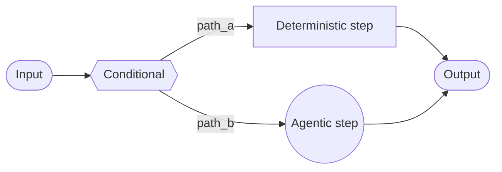
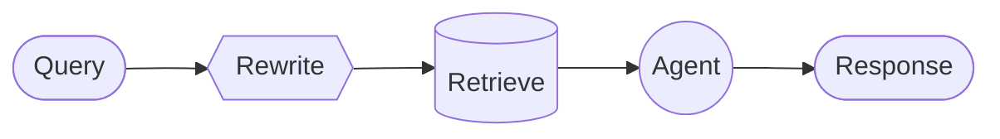

在 **custom workflow** 架构中，你使用 [LangGraph](/oss/javascript/langgraph/overview) 定义自己的定制执行流程。你对图结构拥有完全控制——包括顺序步骤、条件分支、循环和并行执行。



## 关键特性

* 完全控制图结构
* 将确定性逻辑与代理行为混合
* 支持顺序步骤、条件分支、循环和并行执行
* 将其他模式作为节点嵌入到你的工作流中

## 何时使用

当标准模式（subagents、skills 等）不符合你的需求、你需要将确定性逻辑与代理行为混合，或者你的用例需要复杂的路由或多阶段处理时，使用自定义工作流。

工作流中的每个节点可以是简单函数、LLM 调用，或带有 [tools](/oss/javascript/langchain/tools) 的完整 [agent](/oss/javascript/langchain/agents)。你还可以在自定义工作流中组合其他架构——例如，将多代理系统作为单个节点嵌入。

有关自定义工作流的完整示例，请参阅下面的教程。

<Card
    title="教程：构建带路由的多源知识库"
    icon="book"
    href="/oss/javascript/langchain/multi-agent/router-knowledge-base"
    arrow cta="了解更多"
>
    [router 模式](/oss/javascript/langchain/multi-agent/router) 是自定义工作流的一个示例。本教程介绍了构建一个并行查询 GitHub、Notion 和 Slack 的路由器，然后合成结果。
>
</Card>

## 基本实现

核心洞察是你可以在任何 LangGraph 节点内直接调用 LangChain 代理，将自定义工作流的灵活性与预构建代理的便利性结合起来：


```typescript
import { z } from "zod";
import { createAgent } from "langchain";
import { StateGraph, START, END, MessagesZodState } from "@langchain/langgraph";

const agent = createAgent({ model: "openai:gpt-4o", tools: [...] });
const State = MessagesZodState.extend({
  query: z.string(),
});

async function agentNode(state: z.infer<typeof State>) {
  // A LangGraph node that invokes a LangChain agent
  const result = await agent.invoke({
    messages: [{ role: "user", content: state.query }]
  });
  return { answer: result.messages.at(-1)?.content };
}

// Build a simple workflow
const workflow = new StateGraph(State)
  .addNode("agent", agentNode)
  .addEdge(START, "agent")
  .addEdge("agent", END)
  .compile();
```


## 示例：RAG 流水线

一个常见的用例是将 [retrieval](/oss/javascript/langchain/retrieval) 与代理结合。此示例构建一个 WNBA 统计助手，它从知识库中检索并可以获取实时新闻。

<Accordion title="自定义 RAG 工作流">

该工作流展示了三种类型的节点：

- **模型节点**（Rewrite）：使用 [structured output](/oss/javascript/langchain/structured-output) 重写用户查询以获得更好的检索。
- **确定性节点**（Retrieve）：执行向量相似性搜索——不涉及 LLM。
- **代理节点**（Agent）：对检索到的上下文进行推理，并可以通过工具获取额外信息。



<Tip>
你可以使用 LangGraph 状态在工作流步骤之间传递信息。这允许工作流的每个部分读取和更新结构化字段，使跨节点共享数据和上下文变得容易。
</Tip>


```typescript
import { StateGraph, Annotation, START, END } from "@langchain/langgraph";
import { createAgent, tool } from "langchain";
import { ChatOpenAI, OpenAIEmbeddings } from "@langchain/openai";
import { MemoryVectorStore } from "@langchain/classic/vectorstores/memory";
import * as z from "zod";

const State = Annotation.Root({
  question: Annotation<string>(),
  rewrittenQuery: Annotation<string>(),
  documents: Annotation<string[]>(),
  answer: Annotation<string>(),
});

// WNBA knowledge base with rosters, game results, and player stats
const embeddings = new OpenAIEmbeddings();
const vectorStore = await MemoryVectorStore.fromTexts(
  [
    // Rosters
    "New York Liberty 2024 roster: Breanna Stewart, Sabrina Ionescu, Jonquel Jones, Courtney Vandersloot.",
    "Las Vegas Aces 2024 roster: A'ja Wilson, Kelsey Plum, Jackie Young, Chelsea Gray.",
    "Indiana Fever 2024 roster: Caitlin Clark, Aliyah Boston, Kelsey Mitchell, NaLyssa Smith.",
    // Game results
    "2024 WNBA Finals: New York Liberty defeated Minnesota Lynx 3-2 to win the championship.",
    "June 15, 2024: Indiana Fever 85, Chicago Sky 79. Caitlin Clark had 23 points and 8 assists.",
    "August 20, 2024: Las Vegas Aces 92, Phoenix Mercury 84. A'ja Wilson scored 35 points.",
    // Player stats
    "A'ja Wilson 2024 season stats: 26.9 PPG, 11.9 RPG, 2.6 BPG. Won MVP award.",
    "Caitlin Clark 2024 rookie stats: 19.2 PPG, 8.4 APG, 5.7 RPG. Won Rookie of the Year.",
    "Breanna Stewart 2024 stats: 20.4 PPG, 8.5 RPG, 3.5 APG.",
  ],
  [{}, {}, {}, {}, {}, {}, {}, {}, {}],
  embeddings
);
const retriever = vectorStore.asRetriever({ k: 5 });

const getLatestNews = tool(
  async ({ query }) => {
    // Your news API here
    return "Latest: The WNBA announced expanded playoff format for 2025...";
  },
  {
    name: "get_latest_news",
    description: "Get the latest WNBA news and updates",
    schema: z.object({ query: z.string() }),
  }
);

const agent = createAgent({
  model: "openai:gpt-4o",
  tools: [getLatestNews],
});

const model = new ChatOpenAI({ model: "gpt-4o" });

const RewrittenQuery = z.object({ query: z.string() });

async function rewriteQuery(state: typeof State.State) {
  const systemPrompt = `Rewrite this query to retrieve relevant WNBA information.
The knowledge base contains: team rosters, game results with scores, and player statistics (PPG, RPG, APG).
Focus on specific player names, team names, or stat categories mentioned.`;
  const response = await model.withStructuredOutput(RewrittenQuery).invoke([
    { role: "system", content: systemPrompt },
    { role: "user", content: state.question },
  ]);
  return { rewrittenQuery: response.query };
}

async function retrieve(state: typeof State.State) {
  const docs = await retriever.invoke(state.rewrittenQuery);
  return { documents: docs.map((doc) => doc.pageContent) };
}

async function callAgent(state: typeof State.State) {
  const context = state.documents.join("\n\n");
  const prompt = `Context:\n${context}\n\nQuestion: ${state.question}`;
  const response = await agent.invoke({
    messages: [{ role: "user", content: prompt }],
  });
  return { answer: response.messages.at(-1)?.contentBlocks };
}

const workflow = new StateGraph(State)
  .addNode("rewrite", rewriteQuery)
  .addNode("retrieve", retrieve)
  .addNode("agent", callAgent)
  .addEdge(START, "rewrite")
  .addEdge("rewrite", "retrieve")
  .addEdge("retrieve", "agent")
  .addEdge("agent", END)
  .compile();

const result = await workflow.invoke({
  question: "Who won the 2024 WNBA Championship?",
});
console.log(result.answer);
```


</Accordion>

---

<Callout icon="pen-to-square" iconType="regular">
    [Edit this page on GitHub](https://github.com/langchain-ai/docs/edit/main/src/oss/langchain/multi-agent/custom-workflow.mdx) or [file an issue](https://github.com/langchain-ai/docs/issues/new/choose).
</Callout>
<Tip icon="terminal" iconType="regular">
    [Connect these docs](/use-these-docs) to Claude, VSCode, and more via MCP for real-time answers.
</Tip>
<div class='fixed right-2 bg-white bottom-2'></div>