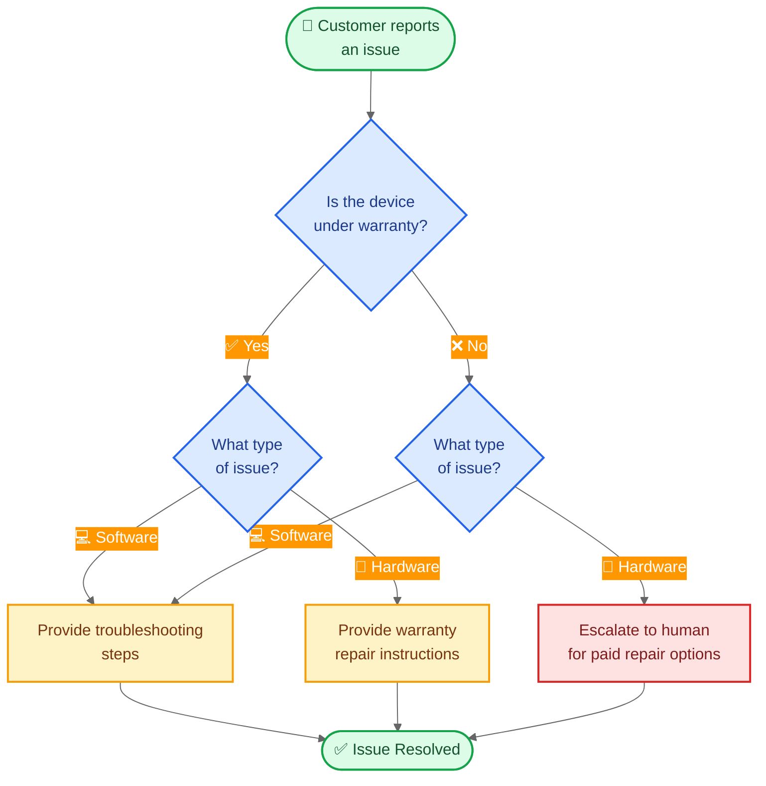

import ChatModelTabsPy from '/snippets/chat-model-tabs.mdx';
import ChatModelTabsJs from '/snippets/chat-model-tabs-js.mdx';

[状态机模式](/oss/javascript/langchain/multi-agent/handoffs) 描述了代理行为随着任务在不同状态间移动而变化的工作流。本教程展示如何通过使用工具调用来动态更改单个代理的配置——根据当前状态更新其可用工具和指令。状态可以从多个来源确定：代理的过去操作（工具调用）、外部状态（例如 API 调用结果），甚至初始用户输入（例如，通过运行分类器来确定用户意图）。

在本教程中，您将构建一个客户支持代理，该代理执行以下操作：

- 在继续之前收集保修信息。
- 将问题分类为硬件或软件。
- 提供解决方案或将问题升级给人类支持。
- 在多个对话轮次中维护对话状态。

与[子代理模式](/oss/javascript/langchain/multi-agent/subagents-personal-assistant)（其中子代理作为工具被调用）不同，**状态机模式**使用单个代理，其配置根据工作流进度而变化。每个“步骤”只是同一底层代理的不同配置（系统提示 + 工具），根据状态动态选择。

以下是我们将构建的工作流：



## 设置

### 安装

本教程需要 `langchain` 包：

<CodeGroup>
```bash npm
npm install langchain
```
```bash yarn
yarn add langchain
```
```bash pnpm
pnpm add langchain
```
</CodeGroup>

更多详情，请参阅我们的[安装指南](/oss/javascript/langchain/install)。

### LangSmith

设置 [LangSmith](https://smith.langchain.com) 以检查代理内部发生的情况。然后设置以下环境变量：

<CodeGroup>
```bash bash
export LANGSMITH_TRACING="true"
export LANGSMITH_API_KEY="..."
```
```typescript typescript
process.env.LANGSMITH_TRACING = "true";
process.env.LANGSMITH_API_KEY = "...";
```
</CodeGroup>

### 选择 LLM

从 LangChain 的集成套件中选择一个聊天模型：

<ChatModelTabsJs />

## 1. 定义自定义状态

首先，定义一个自定义状态模式，用于跟踪当前活动的步骤：

```typescript
import { StateSchema } from "@langchain/langgraph";
import { z } from "zod";

// Define the possible workflow steps
const SupportStepSchema = z.enum(["warranty_collector", "issue_classifier", "resolution_specialist"]);  // [!code highlight]
const WarrantyStatusSchema = z.enum(["in_warranty", "out_of_warranty"]);
const IssueTypeSchema = z.enum(["hardware", "software"]);

// State for customer support workflow
const SupportState = new StateSchema({  // [!code highlight]
  currentStep: SupportStepSchema.optional(),  // [!code highlight]
  warrantyStatus: WarrantyStatusSchema.optional(),
  issueType: IssueTypeSchema.optional(),
});
```

`current_step` 字段是状态机模式的核心——它决定了每轮加载哪个配置（提示 + 工具）。

## 2. 创建管理工作流状态的工具

创建更新工作流状态的工具。这些工具允许代理记录信息并转换到下一步。

关键是使用 `Command` 来更新状态，包括 `current_step` 字段：

```typescript
import { z } from "zod";
import { tool, ToolMessage, type ToolRuntime } from "langchain";
import { Command } from "@langchain/langgraph";

const recordWarrantyStatus = tool(
  async (input, config: ToolRuntime<typeof SupportState.State>) => {
    return new Command({ // [!code highlight]
      update: { // [!code highlight]
        messages: [
          new ToolMessage({
            content: `Warranty status recorded as: ${input.status}`,
            tool_call_id: config.toolCallId,
          }),
        ],
        warrantyStatus: input.status,
        currentStep: "issue_classifier", // [!code highlight]
      },
    });
  },
  {
    name: "record_warranty_status",
    description:
      "Record the customer's warranty status and transition to issue classification.",
    schema: z.object({
      status: WarrantyStatusSchema,
    }),
  }
);

const recordIssueType = tool(
  async (input, config: ToolRuntime<typeof SupportState.State>) => {
    return new Command({ // [!code highlight]
      update: { // [!code highlight]
        messages: [
          new ToolMessage({
            content: `Issue type recorded as: ${input.issueType}`,
            tool_call_id: config.toolCallId,
          }),
        ],
        issueType: input.issueType,
        currentStep: "resolution_specialist", // [!code highlight]
      },
    });
  },
  {
    name: "record_issue_type",
    description:
      "Record the type of issue and transition to resolution specialist.",
    schema: z.object({
      issueType: IssueTypeSchema,
    }),
  }
);

const escalateToHuman = tool(
  async (input) => {
    // In a real system, this would create a ticket, notify staff, etc.
    return `Escalating to human support. Reason: ${input.reason}`;
  },
  {
    name: "escalate_to_human",
    description: "Escalate the case to a human support specialist.",
    schema: z.object({
      reason: z.string(),
    }),
  }
);

const provideSolution = tool(
  async (input) => {
    return `Solution provided: ${input.solution}`;
  },
  {
    name: "provide_solution",
    description: "Provide a solution to the customer's issue.",
    schema: z.object({
      solution: z.string(),
    }),
  }
);
```

请注意 `record_warranty_status` 和 `record_issue_type` 如何返回 `Command` 对象，这些对象同时更新数据（`warranty_status`、`issue_type`）和 `current_step`。这就是状态机的工作原理——工具控制工作流的进展。

## 3. 定义步骤配置

为每个步骤定义提示和工具。首先，为每个步骤定义提示：

<Accordion title="查看完整的提示定义">

```typescript
// Define prompts as constants for easy reference
const WARRANTY_COLLECTOR_PROMPT = `You are a customer support agent helping with device issues.

CURRENT STAGE: Warranty verification

At this step, you need to:
1. Greet the customer warmly
2. Ask if their device is under warranty
3. Use record_warranty_status to record their response and move to the next step

Be conversational and friendly. Don't ask multiple questions at once.`;

const ISSUE_CLASSIFIER_PROMPT = `You are a customer support agent helping with device issues.

CURRENT STAGE: Issue classification
CUSTOMER INFO: Warranty status is {warranty_status}

At this step, you need to:
1. Ask the customer to describe their issue
2. Determine if it's a hardware issue (physical damage, broken parts) or software issue (app crashes, performance)
3. Use record_issue_type to record the classification and move to the next step

If unclear, ask clarifying questions before classifying.`;

const RESOLUTION_SPECIALIST_PROMPT = `You are a customer support agent helping with device issues.

CURRENT STAGE: Resolution
CUSTOMER INFO: Warranty status is {warranty_status}, issue type is {issue_type}

At this step, you need to:
1. For SOFTWARE issues: provide troubleshooting steps using provide_solution
2. For HARDWARE issues:
   - If IN WARRANTY: explain warranty repair process using provide_solution
   - If OUT OF WARRANTY: escalate_to_human for paid repair options

Be specific and helpful in your solutions.`;
```

</Accordion>

然后使用字典将步骤名称映射到其配置：

```typescript
// Step configuration: maps step name to (prompt, tools, required_state)
const STEP_CONFIG = {
  warranty_collector: {
    prompt: WARRANTY_COLLECTOR_PROMPT,
    tools: [recordWarrantyStatus],
    requires: [],
  },
  issue_classifier: {
    prompt: ISSUE_CLASSIFIER_PROMPT,
    tools: [recordIssueType],
    requires: ["warrantyStatus"],
  },
  resolution_specialist: {
    prompt: RESOLUTION_SPECIALIST_PROMPT,
    tools: [provideSolution, escalateToHuman],
    requires: ["warrantyStatus", "issueType"],
  },
} as const;
```

这种基于字典的配置使得以下操作变得容易：
- 一目了然地查看所有步骤
- 添加新步骤（只需添加另一个条目）
- 理解工作流依赖关系（`requires` 字段）
- 使用带有状态变量的提示模板（例如，`{warranty_status}`）

## 4. 创建基于步骤的中间件

创建从状态读取 `current_step` 并应用相应配置的中间件。我们将使用 `@wrap_model_call` 装饰器来实现简洁的实现：

```typescript
import { createMiddleware } from "langchain";

const applyStepMiddleware = createMiddleware({
  name: "applyStep",
  stateSchema: SupportState,
  wrapModelCall: async (request, handler) => {
    // Get current step (defaults to warranty_collector for first interaction)
    const currentStep = request.state.currentStep ?? "warranty_collector"; // [!code highlight]

    // Look up step configuration
    const stepConfig = STEP_CONFIG[currentStep]; // [!code highlight]

    // Validate required state exists
    for (const key of stepConfig.requires) {
      if (request.state[key] === undefined) {
        throw new Error(`${key} must be set before reaching ${currentStep}`);
      }
    }

    // Format prompt with state values (supports {warrantyStatus}, {issueType}, etc.)
    let systemPrompt: string = stepConfig.prompt;
    for (const [key, value] of Object.entries(request.state)) {
      systemPrompt = systemPrompt.replace(`{${key}}`, String(value ?? ""));
    }

    // Inject system prompt and step-specific tools
    return handler({
      ...request, // [!code highlight]
      systemPrompt, // [!code highlight]
      tools: [...stepConfig.tools], // [!code highlight]
    });
  },
});
```

此中间件：

1. **读取当前步骤**：从状态获取 `current_step`（默认为 "warranty_collector"）。
2. **查找配置**：在 `STEP_CONFIG` 中找到匹配的条目。
3. **验证依赖关系**：确保所需的字段存在。
4. **格式化提示**：将状态值注入提示模板。
5. **应用配置**：覆盖系统提示和可用工具。

`request.override()` 方法是关键——它允许我们根据状态动态更改代理的行为，而无需创建单独的代理实例。

## 5. 创建代理

现在使用基于步骤的中间件和用于状态持久化的检查点创建代理：

```typescript
import { createAgent } from "langchain";
import { MemorySaver } from "@langchain/langgraph";
import { ChatOpenAI } from "@langchain/openai";

// Collect all tools from all step configurations
const allTools = [
  recordWarrantyStatus,
  recordIssueType,
  provideSolution,
  escalateToHuman,
];

// Initialize the model
const model = new ChatOpenAI({
  model: "gpt-4.1-mini",
  temperature: 0.7,
});

// Create the agent with step-based configuration
const agent = createAgent({
  model,
  tools: allTools,
  stateSchema: SupportState,  // [!code highlight]
  middleware: [applyStepMiddleware],  // [!code highlight]
  checkpointer: new MemorySaver(),  // [!code highlight]
});
```

<Note>
**为什么需要检查点？** 检查点维护跨对话轮次的状态。如果没有它，`current_step` 状态将在用户消息之间丢失，从而破坏工作流。
</Note>

## 6. 测试工作流

测试完整的工作流：

```typescript
import { HumanMessage } from "@langchain/core/messages";
import { v7 as uuid7 } from "uuid";

// Configuration for this conversation thread
const threadId = uuid7();
const config = { configurable: { thread_id: threadId } };

// Turn 1: Initial message - starts with warranty_collector step
console.log("=== Turn 1: Warranty Collection ===");
let result = await agent.invoke(
  { messages: [new HumanMessage("Hi, my phone screen is cracked")] },
  config
);
for (const msg of result.messages) {
  console.log(msg.content);
}

// Turn 2: User responds about warranty
console.log("\n=== Turn 2: Warranty Response ===");
result = await agent.invoke(
  { messages: [new HumanMessage("Yes, it's still under warranty")] },
  config
);
for (const msg of result.messages) {
  console.log(msg.content);
}
console.log(`Current step: ${result.currentStep}`);

// Turn 3: User describes the issue
console.log("\n=== Turn 3: Issue Description ===");
result = await agent.invoke(
  { messages: [new HumanMessage("The screen is physically cracked from dropping it")] },
  config
);
for (const msg of result.messages) {
  console.log(msg.content);
}
console.log(`Current step: ${result.currentStep}`);

// Turn 4: Resolution
console.log("\n=== Turn 4: Resolution ===");
result = await agent.invoke(
  { messages: [new HumanMessage("What should I do?")] },
  config
);
for (const msg of result.messages) {
  console.log(msg.content);
}
```

预期流程：
1. **保修验证步骤**：询问保修状态
2. **问题分类步骤**：询问问题，确定是硬件问题
3. **解决步骤**：提供保修维修说明

## 7. 理解状态转换

让我们追踪每轮发生的情况：

### 第 1 轮：初始消息

```typescript
{
  messages: [new HumanMessage("Hi, my phone screen is cracked")],
  currentStep: "warranty_collector"  // Default value
}
```

中间件应用：
- 系统提示：`WARRANTY_COLLECTOR_PROMPT`
- 工具：`[record_warranty_status]`

### 第 2 轮：记录保修后

工具调用：`recordWarrantyStatus("in_warranty")` 返回：
```typescript
new Command({
  update: {
    warrantyStatus: "in_warranty",
    currentStep: "issue_classifier"  // State transition!
  }
})
```

下一轮，中间件应用：
- 系统提示：`ISSUE_CLASSIFIER_PROMPT`（格式化为 `warranty_status="in_warranty"`）
- 工具：`[record_issue_type]`

### 第 3 轮：问题分类后

工具调用：`recordIssueType("hardware")` 返回：
```typescript
new Command({
  update: {
    issueType: "hardware",
    currentStep: "resolution_specialist"  // State transition!
  }
})
```

下一轮，中间件应用：
- 系统提示：`RESOLUTION_SPECIALIST_PROMPT`（格式化为 `warranty_status` 和 `issue_type`）
- 工具：`[provide_solution, escalate_to_human]`

关键见解：**工具通过更新 `current_step` 来驱动工作流**，而**中间件通过在下一轮应用相应配置来响应**。

## 8. 管理消息历史

随着代理逐步推进，消息历史会增长。使用[总结中间件](/oss/javascript/langchain/short-term-memory#summarize-messages)来压缩早期消息，同时保留对话上下文：

```typescript
import { createAgent, SummarizationMiddleware } from "langchain";  // [!code highlight]
import { MemorySaver } from "@langchain/langgraph";

const agent = createAgent({
  model,
  tools: allTools,
  stateSchema: SupportState,
  middleware: [
    applyStepMiddleware,
    new SummarizationMiddleware({  // [!code highlight]
      model: "gpt-4.1-mini",
      trigger: { tokens: 4000 },
      keep: { messages: 10 },
    }),
  ],
  checkpointer: new MemorySaver(),
});
```

请参阅[短期记忆指南](/oss/javascript/langchain/short-term-memory)了解其他记忆管理技术。

## 9. 添加灵活性：返回

某些工作流需要允许用户返回到之前的步骤以更正信息（例如，更改保修状态或问题分类）。然而，并非所有转换都有意义——例如，一旦退款处理完毕，通常无法返回。对于此支持工作流，我们将添加工具以返回到保修验证和问题分类步骤。

<Tip>
如果您的工作流需要在大多数步骤之间进行任意转换，请考虑是否真的需要结构化工作流。当步骤遵循清晰的顺序进展，并偶尔进行向后转换以进行更正时，此模式效果最佳。
</Tip>

向解决步骤添加“返回”工具：

```typescript
import { tool } from "langchain";
import { Command } from "@langchain/langgraph";
import { z } from "zod";

const goBackToWarranty = tool(  // [!code highlight]
  async () => {
    return new Command({ update: { currentStep: "warranty_collector" } });  // [!code highlight]
  },
  {
    name: "go_back_to_warranty",
    description: "Go back to warranty verification step.",
    schema: z.object({}),
  }
);

const goBackToClassification = tool(  // [!code highlight]
  async () => {
    return new Command({ update: { currentStep: "issue_classifier" } });  // [!code highlight]
  },
  {
    name: "go_back_to_classification",
    description: "Go back to issue classification step.",
    schema: z.object({}),
  }
);

// Update the resolution_specialist configuration to include these tools
STEP_CONFIG.resolution_specialist.tools.push(
  goBackToWarranty,
  goBackToClassification
);
```

更新解决专家的提示以提及这些工具：

```typescript
const RESOLUTION_SPECIALIST_PROMPT = `You are a customer support agent helping with device issues.

CURRENT STAGE: Resolution
CUSTOMER INFO: Warranty status is {warrantyStatus}, issue type is {issueType}

At this step, you need to:
1. For SOFTWARE issues: provide troubleshooting steps using provide_solution
2. For HARDWARE issues:
   - If IN WARRANTY: explain warranty repair process using provide_solution
   - If OUT OF WARRANTY: escalate_to_human for paid repair options

If the customer indicates any information was wrong, use:
- go_back_to_warranty to correct warranty status
- go_back_to_classification to correct issue type

Be specific and helpful in your solutions.`;
```

现在代理可以处理更正：

```typescript
const result = await agent.invoke(
  { messages: [new HumanMessage("Actually, I made a mistake - my device is out of warranty")] },
  config
);
// Agent will call go_back_to_warranty and restart the warranty verification step
```

## 完整示例

以下是可运行脚本中的所有内容：

<Expandable title="完整代码" defaultOpen={false}>

```typescript
import { createMiddleware, createAgent } from "langchain";

import { z } from "zod";
import { v4 as uuidv4 } from "uuid";
import { tool, ToolMessage, type ToolRuntime, HumanMessage } from "langchain";
import { Command, MemorySaver, StateSchema } from "@langchain/langgraph";
import { ChatOpenAI } from "@langchain/openai";

// Define the possible workflow steps
const SupportStepSchema = z.enum([
  "warranty_collector",
  "issue_classifier",
  "resolution_specialist",
]);
const WarrantyStatusSchema = z.enum(["in_warranty", "out_of_warranty"]);
const IssueTypeSchema = z.enum(["hardware", "software"]);

// State for customer support workflow
const SupportState = new StateSchema({
  currentStep: SupportStepSchema.optional(),
  warrantyStatus: WarrantyStatusSchema.optional(),
  issueType: IssueTypeSchema.optional(),
});

const recordWarrantyStatus = tool(
  async (input, config: ToolRuntime<typeof SupportState.State>) => {
    return new Command({

      update: {

        messages: [
          new ToolMessage({
            content: `Warranty status recorded as: ${input.status}`,
            tool_call_id: config.toolCallId,
          }),
        ],
        warrantyStatus: input.status,
        currentStep: "issue_classifier",
      },
    });
  },
  {
    name: "record_warranty_status",
    description:
      "Record the customer's warranty status and transition to issue classification.",
    schema: z.object({
      status: WarrantyStatusSchema,
    }),
  }
);

const recordIssueType = tool(
  async (input, config: ToolRuntime<typeof SupportState.State>) => {
    return new Command({

      update: {

        messages: [
          new ToolMessage({
            content: `Issue type recorded as: ${input.issueType}`,
            tool_call_id: config.toolCallId,
          }),
        ],
        issueType: input.issueType,
        currentStep: "resolution_specialist",
      },
    });
  },
  {
    name: "record_issue_type",
    description:
      "Record the type of issue and transition to resolution specialist.",
    schema: z.object({
      issueType: IssueTypeSchema,
    }),
  }
);

const escalateToHuman = tool(
  async (input) => {
    // In a real system, this would create a ticket, notify staff, etc.
    return `Escalating to human support. Reason: ${input.reason}`;
  },
  {
    name: "escalate_to_human",
    description: "Escalate the case to a human support specialist.",
    schema: z.object({
      reason: z.string(),
    }),
  }
);

const provideSolution = tool(
  async (input) => {
    return `Solution provided: ${input.solution}`;
  },
  {
    name: "provide_solution",
    description: "Provide a solution to the customer's issue.",
    schema: z.object({
      solution: z.string(),
    }),
  }
);

// Define prompts as constants for easy reference
const WARRANTY_COLLECTOR_PROMPT = `You are a customer support agent helping with device issues.

CURRENT STAGE: Warranty verification

At this step, you need to:
1. Greet the customer warmly
2. Ask if their device is under warranty
3. Use record_warranty_status to record their response and move to the next step

Be conversational and friendly. Don't ask multiple questions at once.`;

const ISSUE_CLASSIFIER_PROMPT = `You are a customer support agent helping with device issues.

CURRENT STAGE: Issue classification
CUSTOMER INFO: Warranty status is {warranty_status}

At this step, you need to:
1. Ask the customer to describe their issue
2. Determine if it's a hardware issue (physical damage, broken parts) or software issue (app crashes, performance)
3. Use record_issue_type to record the classification and move to the next step

If unclear, ask clarifying questions before classifying.`;

const RESOLUTION_SPECIALIST_PROMPT = `You are a customer support agent helping with device issues.

CURRENT STAGE: Resolution
CUSTOMER INFO: Warranty status is {warranty_status}, issue type is {issue_type}

At this step, you need to:
1. For SOFTWARE issues: provide troubleshooting steps using provide_solution
2. For HARDWARE issues:
   - If IN WARRANTY: explain warranty repair process using provide_solution
   - If OUT OF WARRANTY: escalate_to_human for paid repair options

Be specific and helpful in your solutions.`;

// Step configuration: maps step name to (prompt, tools, required_state)
const STEP_CONFIG = {
  warranty_collector: {
    prompt: WARRANTY_COLLECTOR_PROMPT,
    tools: [recordWarrantyStatus],
    requires: [],
  },
  issue_classifier: {
    prompt: ISSUE_CLASSIFIER_PROMPT,
    tools: [recordIssueType],
    requires: ["warrantyStatus"],
  },
  resolution_specialist: {
    prompt: RESOLUTION_SPECIALIST_PROMPT,
    tools: [provideSolution, escalateToHuman],
    requires: ["warrantyStatus", "issueType"],
  },
} as const;

const applyStepMiddleware = createMiddleware({
  name: "applyStep",
  stateSchema: SupportState,
  wrapModelCall: async (request, handler) => {
    // Get current step (defaults to warranty_collector for first interaction)
    const currentStep = request.state.currentStep ?? "warranty_collector";

    // Look up step configuration
    const stepConfig = STEP_CONFIG[currentStep];

    // Validate required state exists
    for (const key of stepConfig.requires) {
      if (request.state[key] === undefined) {
        throw new Error(`${key} must be set before reaching ${currentStep}`);
      }
    }

    // Format prompt with state values (supports {warrantyStatus}, {issueType}, etc.)
    let systemPrompt: string = stepConfig.prompt;
    for (const [key, value] of Object.entries(request.state)) {
      systemPrompt = systemPrompt.replace(`{${key}}`, String(value ?? ""));
    }

    // Inject system prompt and step-specific tools
    return handler({
      ...request,
      systemPrompt,
      tools: [...stepConfig.tools],
    });
  },
});

// Collect all tools from all step configurations
const allTools = [
  recordWarrantyStatus,
  recordIssueType,
  provideSolution,
  escalateToHuman,
];

const model = new ChatOpenAI({
  model: "gpt-4.1-mini",
});

// Create the agent with step-based configuration
const agent = createAgent({
  model,
  tools: allTools,
  middleware: [applyStepMiddleware],
  checkpointer: new MemorySaver(),
});

// Configuration for this conversation thread
const threadId = uuidv4();
const config = { configurable: { thread_id: threadId } };

// Turn 1: Initial message - starts with warranty_collector step
console.log("=== Turn 1: Warranty Collection ===");
let result = await agent.invoke(
  { messages: [new HumanMessage("Hi, my phone screen is cracked")] },
  config
);
for (const msg of result.messages) {
  console.log(msg.content);
}

// Turn 2: User responds about warranty
console.log("\n=== Turn 2: Warranty Response ===");
result = await agent.invoke(
  { messages: [new HumanMessage("Yes, it's still under warranty")] },
  config
);
for (const msg of result.messages) {
  console.log(msg.content);
}
console.log(`Current step: ${result.currentStep}`);

// Turn 3: User describes the issue
console.log("\n=== Turn 3: Issue Description ===");
result = await agent.invoke(
  {
    messages: [
      new HumanMessage("The screen is physically cracked from dropping it"),
    ],
  },
  config
);
for (const msg of result.messages) {
  console.log(msg.content);
}
console.log(`Current step: ${result.currentStep}`);

// Turn 4: Resolution
console.log("\n=== Turn 4: Resolution ===");
result = await agent.invoke(
  { messages: [new HumanMessage("What should I do?")] },
  config
);
for (const msg of result.messages) {
  console.log(msg.content);
}
```

</Expandable>

## 后续步骤

- 了解用于集中式编排的[子代理模式](/oss/javascript/langchain/multi-agent/subagents-personal-assistant)
- 探索[中间件](/oss/javascript/langchain/middleware)以实现更动态的行为
- 阅读[多代理概述](/oss/javascript/langchain/multi-agent)以比较模式
- 使用 [LangSmith](https://smith.langchain.com) 调试和监控您的多代理系统

---

<div className="source-links">
<Callout icon="edit">
    [在 GitHub 上编辑此页面](https://github.com/langchain-ai/docs/edit/main/src/oss/langchain/multi-agent/handoffs-customer-support.mdx) 或[提交问题](https://github.com/langchain-ai/docs/issues/new/choose)。
</Callout>
<Callout icon="terminal-2">
    [通过 MCP 将这些文档连接到 Claude、VSCode 等](/use-these-docs) 以获取实时答案。
</Callout>
</div>