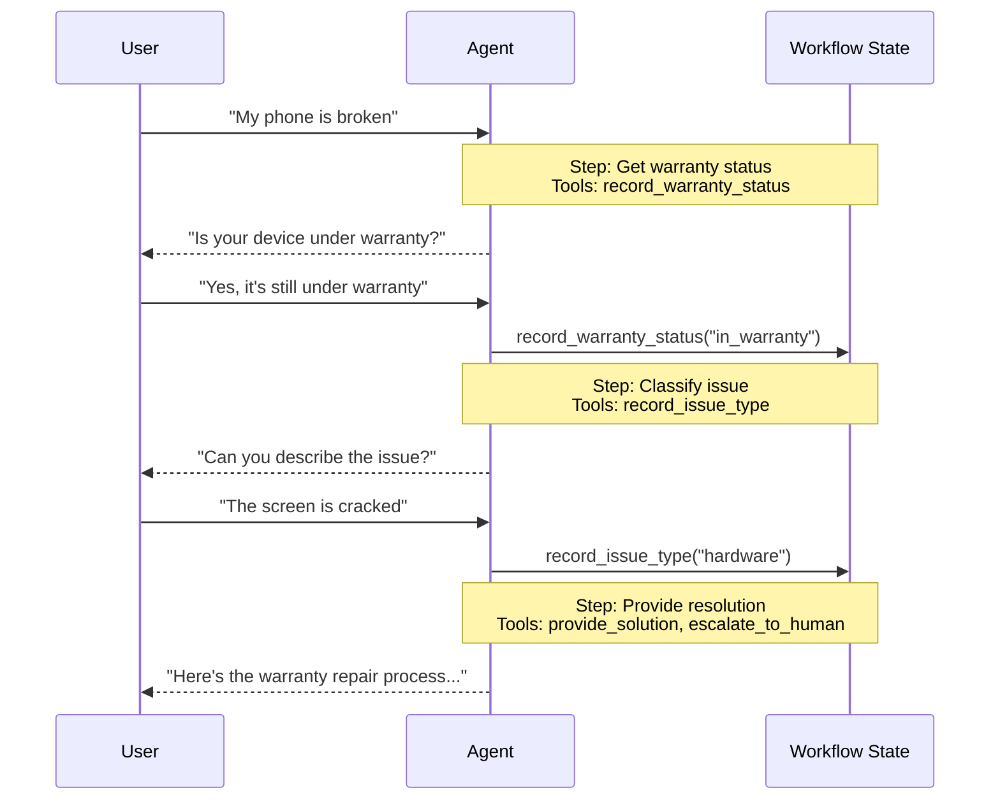

在 **handoffs** 架构中，行为根据状态动态变化。核心机制：[tools](/oss/javascript/langchain/tools) 更新一个在轮次之间持久化的状态变量（例如，`current_step` 或 `active_agent`），系统读取此变量来调整行为——要么应用不同的配置（系统提示、工具），要么路由到不同的 [agent](/oss/javascript/langchain/agents)。此模式支持不同代理之间的切换以及单个代理内的动态配置更改。

<Tip>
术语 **handoffs** 由 [OpenAI](https://openai.github.io/openai-agents-python/handoffs/) 提出，用于使用工具调用（例如，`transfer_to_sales_agent`）在代理或状态之间转移控制。
</Tip>



## 关键特性

* 状态驱动的行为：行为根据状态变量变化（例如，`current_step` 或 `active_agent`）
* 基于工具的转换：工具更新状态变量以在状态之间移动
* 直接用户交互：每个状态的配置直接处理用户消息
* 持久状态：状态在对话轮次之间保持

## 何时使用

当你需要强制执行顺序约束（仅在满足先决条件后解锁功能）、代理需要在不同状态下直接与用户对话，或者你正在构建多阶段对话流程时，使用 handoffs 模式。此模式对于需要按特定顺序收集信息的客户支持场景特别有价值——例如，在处理退款之前收集保修 ID。

## 基本实现

核心机制是一个 [tool](/oss/javascript/langchain/tools)，它返回一个 [`Command`](/oss/javascript/langgraph/graph-api#command) 来更新状态，触发到新步骤或代理的转换：


```typescript
import { tool, ToolMessage, type ToolRuntime } from "langchain";
import { Command } from "@langchain/langgraph";
import { z } from "zod";

const transferToSpecialist = tool(
  async (_, config: ToolRuntime<typeof StateSchema>) => {
    return new Command({
      update: {
        messages: [
          new ToolMessage({  // [!code highlight]
            content: "Transferred to specialist",
            tool_call_id: config.toolCallId  // [!code highlight]
          })
        ],
        currentStep: "specialist"  // Triggers behavior change
      }
    });
  },
  {
    name: "transfer_to_specialist",
    description: "Transfer to the specialist agent.",
    schema: z.object({})
  }
);
```


<Note>
**为什么要包含 `ToolMessage`？** 当 LLM 调用工具时，它期望得到响应。带有匹配 `tool_call_id` 的 `ToolMessage` 完成此请求-响应循环——没有它，对话历史将变得格式不正确。每当你的 handoff 工具更新消息时，这是必需的。
</Note>

有关完整实现，请参阅下面的教程。

<Card
    title="教程：使用 handoffs 构建客户支持"
    icon="people-arrows"
    href="/oss/javascript/langchain/multi-agent/handoffs-customer-support"
    arrow cta="了解更多"
>
    学习如何使用 handoffs 模式构建客户支持代理，其中单个代理在不同配置之间转换。
</Card>

## 实现方法

有两种实现 handoffs 的方法：**[单代理加中间件](#single-agent-with-middleware)**（一个代理具有动态配置）或 **[多代理子图](#multiple-agent-subgraphs)**（不同的代理作为图节点）。

### 单代理加中间件

单个代理根据状态改变其行为。中间件拦截每个模型调用并动态调整系统提示和可用工具。工具更新状态变量以触发转换：


```typescript
import { tool, ToolMessage, type ToolRuntime } from "langchain";
import { Command } from "@langchain/langgraph";
import { z } from "zod";

const recordWarrantyStatus = tool(
  async ({ status }, config: ToolRuntime<typeof StateSchema>) => {
    return new Command({
      update: {
        messages: [
          new ToolMessage({
            content: `Warranty status recorded: ${status}`,
            tool_call_id: config.toolCallId,
          }),
        ],
        warrantyStatus: status,
        currentStep: "specialist", // Update state to trigger transition
      },
    });
  },
  {
    name: "record_warranty_status",
    description: "Record warranty status and transition to next step.",
    schema: z.object({
      status: z.string(),
    }),
  }
);
```


<Accordion title="完整示例：使用中间件的客户支持">


```typescript
import {
  createAgent,
  createMiddleware,
  tool,
  ToolMessage,
  type ToolRuntime,
} from "langchain";
import { Command, MemorySaver } from "@langchain/langgraph";
import { z } from "zod";

// 1. Define state with current_step tracker
const SupportState = z.object({ // [!code highlight]
  currentStep: z.string().default("triage"), // [!code highlight]
  warrantyStatus: z.string().optional(),
});

// 2. Tools update currentStep via Command
const recordWarrantyStatus = tool(
  async ({ status }, config: ToolRuntime<typeof SupportState>) => {
    return new Command({ // [!code highlight]
      update: { // [!code highlight]
        messages: [ // [!code highlight]
          new ToolMessage({
            content: `Warranty status recorded: ${status}`,
            tool_call_id: config.toolCallId,
          }),
        ],
        warrantyStatus: status,
        // Transition to next step
        currentStep: "specialist", // [!code highlight]
      },
    });
  },
  {
    name: "record_warranty_status",
    description: "Record warranty status and transition",
    schema: z.object({ status: z.string() }),
  }
);

// 3. Middleware applies dynamic configuration based on currentStep
const applyStepConfig = createMiddleware({
  name: "applyStepConfig",
  stateSchema: SupportState, // [!code highlight]
  wrapModelCall: async (request, handler) => {
    const step = request.state.currentStep || "triage"; // [!code highlight]

    // Map steps to their configurations
    const configs = {
      triage: {
        prompt: "Collect warranty information...",
        tools: [recordWarrantyStatus],
      },
      specialist: {
        prompt: `Provide solutions based on warranty: ${request.state.warrantyStatus}`,
        tools: [provideSolution, escalate],
      },
    };

    const config = configs[step as keyof typeof configs];
    return handler({
      ...request,
      systemPrompt: config.prompt,
      tools: config.tools,
    });
  },
});

// 4. Create agent with middleware
const agent = createAgent({
  model,
  tools: [recordWarrantyStatus, provideSolution, escalate],
  middleware: [applyStepConfig], // [!code highlight]
  checkpointer: new MemorySaver(), // Persist state across turns  // [!code highlight]
});
```


</Accordion>

### 多代理子图

多个不同的代理作为图中的单独节点存在。Handoff 工具使用 `Command.PARENT` 在代理节点之间导航，以指定下一个要执行的节点。

<Warning>
子图 handoffs 需要仔细的 **[上下文工程](/oss/javascript/langchain/context-engineering)**。与单代理中间件（消息历史自然流动）不同，你必须明确决定代理之间传递什么消息。如果出错，代理将收到格式不正确的对话历史或膨胀的上下文。请参阅下面的 [上下文工程](#context-engineering)。
</Warning>


```typescript
import {
  tool,
  BaseMessage,
  ToolMessage,
  AIMessage,
  type ToolRuntime,
} from "langchain";
import { Command } from "@langchain/langgraph";
import { z } from "zod";

const stateSchema = z.object({
  messages: z.array(z.instanceof(BaseMessage)),
});

const transferToSales = tool(
  async (_, runtime: ToolRuntime<typeof stateSchema>) => {
    const lastAiMessage = runtime.state.messages // [!code highlight]
      .reverse() // [!code highlight]
      .find(AIMessage.isInstance); // [!code highlight]

    const transferMessage = new ToolMessage({ // [!code highlight]
      content: "Transferred to sales agent", // [!code highlight]
      tool_call_id: runtime.toolCallId, // [!code highlight]
    }); // [!code highlight]
    return new Command({
      goto: "sales_agent",
      update: {
        activeAgent: "sales_agent",
        messages: [lastAiMessage, transferMessage].filter(Boolean), // [!code highlight]
      },
      graph: Command.PARENT,
    });
  },
  {
    name: "transfer_to_sales",
    description: "Transfer to the sales agent.",
    schema: z.object({}),
  }
);
```


<Accordion title="完整示例：带 handoffs 的销售和支持">

此示例显示了一个具有单独销售和支持代理的多代理系统。每个代理是一个单独的图节点，handoff 工具允许代理将对话转移给彼此。


```typescript
import {
  StateGraph,
  START,
  END,
  MessagesZodState,
  Command,
} from "@langchain/langgraph";
import { createAgent, AIMessage, ToolMessage } from "langchain";
import { tool, ToolRuntime } from "@langchain/core/tools";
import { z } from "zod/v4";

// 1. Define state with active_agent tracker
const MultiAgentState = MessagesZodState.extend({
  activeAgent: z.string().optional(),
});

// 2. Create handoff tools
const transferToSales = tool(
  async (_, runtime: ToolRuntime<typeof MultiAgentState>) => {
    const lastAiMessage = [...runtime.state.messages] // [!code highlight]
      .reverse() // [!code highlight]
      .find(AIMessage.isInstance); // [!code highlight]
    const transferMessage = new ToolMessage({ // [!code highlight]
      content: "Transferred to sales agent from support agent", // [!code highlight]
      tool_call_id: runtime.toolCallId, // [!code highlight]
    }); // [!code highlight]
    return new Command({
      goto: "sales_agent",
      update: {
        activeAgent: "sales_agent",
        messages: [lastAiMessage, transferMessage].filter(Boolean), // [!code highlight]
      },
      graph: Command.PARENT,
    });
  },
  {
    name: "transfer_to_sales",
    description: "Transfer to the sales agent.",
    schema: z.object({}),
  }
);

const transferToSupport = tool(
  async (_, runtime: ToolRuntime<typeof MultiAgentState>) => {
    const lastAiMessage = [...runtime.state.messages] // [!code highlight]
      .reverse() // [!code highlight]
      .find(AIMessage.isInstance); // [!code highlight]
    const transferMessage = new ToolMessage({ // [!code highlight]
      content: "Transferred to support agent from sales agent", // [!code highlight]
      tool_call_id: runtime.toolCallId, // [!code highlight]
    }); // [!code highlight]
    return new Command({
      goto: "support_agent",
      update: {
        activeAgent: "support_agent",
        messages: [lastAiMessage, transferMessage].filter(Boolean), // [!code highlight]
      },
      graph: Command.PARENT,
    });
  },
  {
    name: "transfer_to_support",
    description: "Transfer to the support agent.",
    schema: z.object({}),
  }
);

// 3. Create agents with handoff tools
const salesAgent = createAgent({
  model: "anthropic:claude-sonnet-4-20250514",
  tools: [transferToSupport],
  systemPrompt:
    "You are a sales agent. Help with sales inquiries. If asked about technical issues or support, transfer to the support agent.",
});

const supportAgent = createAgent({
  model: "anthropic:claude-sonnet-4-20250514",
  tools: [transferToSales],
  systemPrompt:
    "You are a support agent. Help with technical issues. If asked about pricing or purchasing, transfer to the sales agent.",
});

// 4. Create agent nodes that invoke the agents
const callSalesAgent = async (
  state: z.infer<typeof MultiAgentState>
) => {
  const response = await salesAgent.invoke(state);
  return response;
};

const callSupportAgent = async (
  state: z.infer<typeof MultiAgentState>
) => {
  const response = await supportAgent.invoke(state);
  return response;
};

// 5. Create router that checks if we should end or continue
const routeAfterAgent = (
  state: z.infer<typeof MultiAgentState>
): "sales_agent" | "support_agent" | "__end__" => {
  const messages = state.messages ?? [];

  // Check the last message - if it's an AIMessage without tool calls, we're done
  if (messages.length > 0) {
    const lastMsg = messages[messages.length - 1];
    if (lastMsg instanceof AIMessage && !lastMsg.tool_calls?.length) { // [!code highlight]
      return "__end__"; // [!code highlight]
    } // [!code highlight]
  }

  // Otherwise route to the active agent
  const active = state.activeAgent ?? "sales_agent";
  return active as "sales_agent" | "support_agent";
};

const routeInitial = (
  state: z.infer<typeof MultiAgentState>
): "sales_agent" | "support_agent" => {
  // Route to the active agent based on state, default to sales agent
  return (state.activeAgent ?? "sales_agent") as
    | "sales_agent"
    | "support_agent";
};

// 6. Build the graph
const builder = new StateGraph(MultiAgentState)
  .addNode("sales_agent", callSalesAgent)
  .addNode("support_agent", callSupportAgent);
  // Start with conditional routing based on initial activeAgent
  .addConditionalEdges(START, routeInitial, [
    "sales_agent",
    "support_agent",
  ])
  // After each agent, check if we should end or route to another agent
  .addConditionalEdges("sales_agent", routeAfterAgent, [
    "sales_agent",
    "support_agent",
    END,
  ]);
  builder.addConditionalEdges("support_agent", routeAfterAgent, [
    "sales_agent",
    "support_agent",
    END,
  ]);

const graph = builder.compile();
const result = await graph.invoke({
  messages: [
    {
      role: "user",
      content: "Hi, I'm having trouble with my account login. Can you help?",
    },
  ],
});

for (const msg of result.messages) {
  console.log(msg.content);
}
```


</Accordion>

<Tip>
对于大多数 handoffs 用例，使用**单代理加中间件**——它更简单。仅当你需要定制的代理实现时才使用**多代理子图**（例如，一个本身是带有反思或检索步骤的复杂图的节点）。
</Tip>

#### 上下文工程

使用子图 handoffs，你可以精确控制代理之间流动的消息。这种精确性对于维护有效的对话历史和避免可能混淆下游代理的上下文膨胀至关重要。有关此主题的更多信息，请参阅 [上下文工程](/oss/javascript/langchain/context-engineering)。

**在 handoffs 期间处理上下文**

在代理之间切换时，你需要确保对话历史保持有效。LLM 期望工具调用与其响应配对，因此当使用 `Command.PARENT` 切换到另一个代理时，你必须包含两者：

1. **包含工具调用的 `AIMessage`**（触发 handoff 的消息）
2. **确认 handoff 的 `ToolMessage`**（对该工具调用的人工响应）

没有这种配对，接收代理将看到不完整的对话，并可能产生错误或意外行为。

下面的示例假设只调用了 handoff 工具（没有并行工具调用）：


```typescript
const transferToSales = tool(
  async (_, runtime: ToolRuntime<typeof MultiAgentState>) => {
    // Get the AI message that triggered this handoff
    const lastAiMessage = runtime.state.messages.at(-1);

    // Create an artificial tool response to complete the pair
    const transferMessage = new ToolMessage({
      content: "Transferred to sales agent",
      tool_call_id: runtime.toolCallId,
    });

    return new Command({
      goto: "sales_agent",
      update: {
        activeAgent: "sales_agent",
        // Pass only these two messages, not the full subagent history
        messages: [lastAiMessage, transferMessage],
      },
      graph: Command.PARENT,
    });
  },
  {
    name: "transfer_to_sales",
    description: "Transfer to the sales agent.",
    schema: z.object({}),
  }
);
```


<Note>
**为什么不传递所有子代理消息？** 虽然你可以在 handoff 中包含完整的子代理对话，但这通常会产生问题。接收代理可能会被无关的内部推理搞糊涂，并且 token 成本会不必要地增加。通过仅传递 handoff 对，你可以让父图的上下文集中在高层协调上。如果接收代理需要额外的上下文，考虑在 ToolMessage 内容中总结子代理的工作，而不是传递原始消息历史。
</Note>

**将控制权返回给用户**

当将控制权返回给用户（结束代理的轮次）时，确保最终消息是 `AIMessage`。这维护了有效的对话历史，并向用户界面发出代理已完成其工作的信号。

## 实现考虑

在设计你的多代理系统时，考虑：

* **上下文过滤策略**：每个代理将接收完整的对话历史、过滤的部分还是摘要？不同的代理可能根据其角色需要不同的上下文。
* **工具语义**：明确 handoff 工具是仅更新路由状态还是也执行副作用。例如，`transfer_to_sales()` 是否也应该创建支持工单，还是应该是单独的操作？
* **Token 效率**：在上下文完整性和 token 成本之间取得平衡。随着对话变长，摘要和选择性上下文传递变得更加重要。

---

<Callout icon="pen-to-square" iconType="regular">
    [Edit this page on GitHub](https://github.com/langchain-ai/docs/edit/main/src/oss/langchain/multi-agent/handoffs.mdx) or [file an issue](https://github.com/langchain-ai/docs/issues/new/choose).
</Callout>
<Tip icon="terminal" iconType="regular">
    [Connect these docs](/use-these-docs) to Claude, VSCode, and more via MCP for real-time answers.
</Tip>
<div class='fixed right-2 bg-white bottom-2'></div>