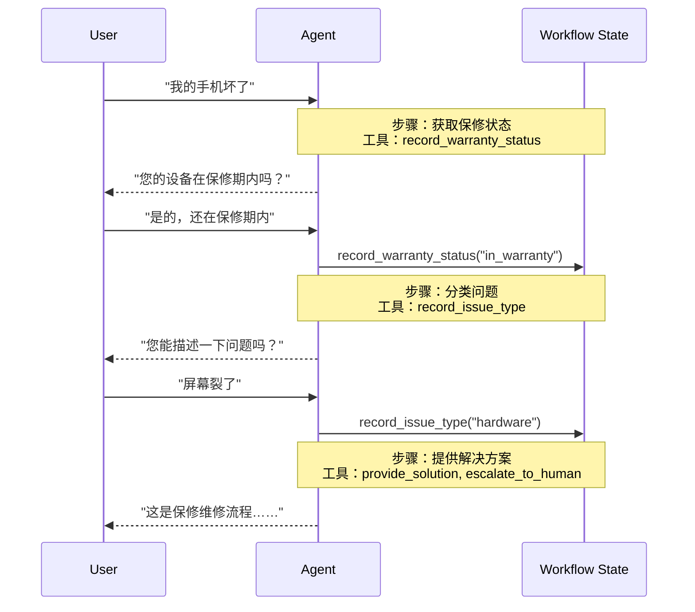

在**交接**架构中，行为根据状态动态变化。核心机制：[工具](/oss/javascript/langchain/tools)更新跨轮次持久化的状态变量（例如 `current_step` 或 `active_agent`），系统读取此变量以调整行为——应用不同的配置（系统提示、工具）或路由到不同的[代理](/oss/javascript/langchain/agents)。此模式支持不同代理之间的交接以及单个代理内的动态配置更改。

<Tip>
**交接**一词由 [OpenAI](https://openai.github.io/openai-agents-python/handoffs/) 创造，用于使用工具调用（例如 `transfer_to_sales_agent`）在代理或状态之间转移控制权。
</Tip>



## 主要特征

* 状态驱动的行为：行为根据状态变量（例如 `current_step` 或 `active_agent`）而变化
* 基于工具的转换：工具更新状态变量以在状态之间移动
* 直接用户交互：每个状态的配置直接处理用户消息
* 持久状态：状态在对话轮次中存活

## 何时使用

当您需要强制执行顺序约束（仅在满足先决条件后解锁能力），代理需要在不同状态下直接与用户交谈，或者您正在构建多阶段对话流时，请使用交接模式。此模式对于需要在特定序列中收集信息的客户支持场景特别有价值——例如，在处理退款之前收集保修 ID。

## 基本实现

核心机制是一个[工具](/oss/javascript/langchain/tools)，它返回一个 [`Command`](/oss/javascript/langgraph/graph-api#command) 以更新状态，触发向新步骤或代理的转换：


```typescript
import { tool, ToolMessage, type ToolRuntime } from "langchain";
import { Command } from "@langchain/langgraph";
import { z } from "zod";

const transferToSpecialist = tool(
  async (_, config: ToolRuntime<typeof StateSchema>) => {
    return new Command({
      update: {
        messages: [
          new ToolMessage({  // [!code highlight]
            content: "已转接给专家",
            tool_call_id: config.toolCallId  // [!code highlight]
          })
        ],
        currentStep: "specialist"  // 触发行为更改
      }
    });
  },
  {
    name: "transfer_to_specialist",
    description: "转接给专家代理。",
    schema: z.object({})
  }
);
```


<Note>
**为什么要包含 `ToolMessage`？** 当 LLM 调用工具时，它期望得到响应。具有匹配 `tool_call_id` 的 `ToolMessage` 完成此请求-响应周期——如果没有它，对话历史将变得畸形。每当您的交接工具更新消息时，这都是必需的。
</Note>

有关完整实现，请参阅下面的教程。

<Card
    title="教程：构建带交接的客户支持"
    icon="users"
    href="/oss/javascript/langchain/multi-agent/handoffs-customer-support"
    arrow cta="了解更多"
>
    了解如何使用交接模式构建客户支持代理，其中单个代理在不同配置之间转换。
</Card>

## 实现方法

实现交接有两种方式：**[带中间件的单代理](#single-agent-with-middleware)**（具有动态配置的一个代理）或**[多代理子图](#multiple-agent-subgraphs)**（作为图节点的独立代理）。

### 带中间件的单代理

单个代理根据状态更改其行为。中间件拦截每个模型调用并动态调整系统提示和可用工具。工具更新状态变量以触发转换：


```typescript
import { tool, ToolMessage, type ToolRuntime } from "langchain";
import { Command } from "@langchain/langgraph";
import { z } from "zod";

const recordWarrantyStatus = tool(
  async ({ status }, config: ToolRuntime<typeof StateSchema>) => {
    return new Command({
      update: {
        messages: [
          new ToolMessage({
            content: `保修状态已记录：${status}`,
            tool_call_id: config.toolCallId,
          }),
        ],
        warrantyStatus: status,
        currentStep: "specialist", // 更新状态以触发转换
      },
    });
  },
  {
    name: "record_warranty_status",
    description: "记录保修状态并转换到下一步。",
    schema: z.object({
      status: z.string(),
    }),
  }
);
```


<Accordion title="完整示例：带中间件的客户支持">


```typescript
import {
  createAgent,
  createMiddleware,
  tool,
  ToolMessage,
  type ToolRuntime,
} from "langchain";
import { Command, MemorySaver, StateSchema } from "@langchain/langgraph";
import { z } from "zod";

// 1. 定义带有 current_step 跟踪器的状态
const SupportState = new StateSchema({ // [!code highlight]
  currentStep: z.string().default("triage"), // [!code highlight]
  warrantyStatus: z.string().optional(),
});

// 2. 工具通过 Command 更新 currentStep
const recordWarrantyStatus = tool(
  async ({ status }, config: ToolRuntime<typeof SupportState.State>) => {
    return new Command({ // [!code highlight]
      update: { // [!code highlight]
        messages: [ // [!code highlight]
          new ToolMessage({
            content: `Warranty status recorded: ${status}`,
            tool_call_id: config.toolCallId,
          }),
        ],
        warrantyStatus: status,
        // 转换到下一步
        currentStep: "specialist", // [!code highlight]
      },
    });
  },
  {
    name: "record_warranty_status",
    description: "记录保修状态并转换",
    schema: z.object({ status: z.string() }),
  }
);

// 3. 中间件根据 currentStep 应用动态配置
const applyStepConfig = createMiddleware({
  name: "applyStepConfig",
  stateSchema: SupportState, // [!code highlight]
  wrapModelCall: async (request, handler) => {
    const step = request.state.currentStep || "triage"; // [!code highlight]

    // 将步骤映射到其配置
    const configs = {
      triage: {
        prompt: "收集保修信息...",
        tools: [recordWarrantyStatus],
      },
      specialist: {
        prompt: `根据保修提供解决方案：${request.state.warrantyStatus}`,
        tools: [provideSolution, escalate],
      },
    };

    const config = configs[step as keyof typeof configs];
    return handler({
      ...request,
      systemPrompt: config.prompt,
      tools: config.tools,
    });
  },
});

// 4. 创建带中间件的代理
const agent = createAgent({
  model,
  tools: [recordWarrantyStatus, provideSolution, escalate],
  middleware: [applyStepConfig], // [!code highlight]
  checkpointer: new MemorySaver(), // 跨轮次持久化状态  // [!code highlight]
});
```


</Accordion>

### 多代理子图

多个不同的代理作为图中的独立节点存在。交接工具使用 `Command.PARENT` 在代理节点之间导航，以指定下一个要执行的节点。

<Warning>
子图交接需要仔细的**[上下文工程](/oss/javascript/langchain/context-engineering)**。与单代理中间件（消息历史自然流动）不同，您必须显式决定在代理之间传递哪些消息。弄错了，代理就会收到畸形的对话历史或臃肿的上下文。请参阅下面的[上下文工程](#context-engineering)。
</Warning>


```typescript
import {
  tool,
  ToolMessage,
  AIMessage,
  type ToolRuntime,
} from "langchain";
import { Command, StateSchema, MessagesValue } from "@langchain/langgraph";

const CustomState = new StateSchema({
  messages: MessagesValue,
});

const transferToSales = tool(
  async (_, runtime: ToolRuntime<typeof CustomState.State>) => {
    const lastAiMessage = runtime.state.messages // [!code highlight]
      .reverse() // [!code highlight]
      .find(AIMessage.isInstance); // [!code highlight]

    const transferMessage = new ToolMessage({ // [!code highlight]
      content: "已转接给销售代理", // [!code highlight]
      tool_call_id: runtime.toolCallId, // [!code highlight]
    }); // [!code highlight]
    return new Command({
      goto: "sales_agent",
      update: {
        activeAgent: "sales_agent",
        messages: [lastAiMessage, transferMessage].filter(Boolean), // [!code highlight]
      },
      graph: Command.PARENT,
    });
  },
  {
    name: "transfer_to_sales",
    description: "转接给销售代理。",
    schema: z.object({}),
  }
);
```


<Accordion title="完整示例：带交接的销售和支持">

此示例显示了一个具有独立销售和支持代理的多代理系统。每个代理都是一个单独的图节点，交接工具允许代理相互转移对话。


```typescript
import {
  StateGraph,
  START,
  END,
  StateSchema,
  MessagesValue,
  Command,
  ConditionalEdgeRouter,
  GraphNode,
} from "@langchain/langgraph";
import { createAgent, AIMessage, ToolMessage } from "langchain";
import { tool, ToolRuntime } from "@langchain/core/tools";
import { z } from "zod/v4";

// 1. 定义带有 active_agent 跟踪器的状态
const MultiAgentState = new StateSchema({
  messages: MessagesValue,
  activeAgent: z.string().optional(),
});

// 2. 创建交接工具
const transferToSales = tool(
  async (_, runtime: ToolRuntime<typeof MultiAgentState.State>) => {
    const lastAiMessage = [...runtime.state.messages] // [!code highlight]
      .reverse() // [!code highlight]
      .find(AIMessage.isInstance); // [!code highlight]
    const transferMessage = new ToolMessage({ // [!code highlight]
      content: "已从支持代理转接给销售代理", // [!code highlight]
      tool_call_id: runtime.toolCallId, // [!code highlight]
    }); // [!code highlight]
    return new Command({
      goto: "sales_agent",
      update: {
        activeAgent: "sales_agent",
        messages: [lastAiMessage, transferMessage].filter(Boolean), // [!code highlight]
      },
      graph: Command.PARENT,
    });
  },
  {
    name: "transfer_to_sales",
    description: "转接给销售代理。",
    schema: z.object({}),
  }
);

const transferToSupport = tool(
  async (_, runtime: ToolRuntime<typeof MultiAgentState.State>) => {
    const lastAiMessage = [...runtime.state.messages] // [!code highlight]
      .reverse() // [!code highlight]
      .find(AIMessage.isInstance); // [!code highlight]
    const transferMessage = new ToolMessage({ // [!code highlight]
      content: "已从销售代理转接给支持代理", // [!code highlight]
      tool_call_id: runtime.toolCallId, // [!code highlight]
    }); // [!code highlight]
    return new Command({
      goto: "support_agent",
      update: {
        activeAgent: "support_agent",
        messages: [lastAiMessage, transferMessage].filter(Boolean), // [!code highlight]
      },
      graph: Command.PARENT,
    });
  },
  {
    name: "transfer_to_support",
    description: "转接给支持代理。",
    schema: z.object({}),
  }
);

// 3. 创建带交接工具的代理
const salesAgent = createAgent({
  model: "anthropic:claude-sonnet-4-20250514",
  tools: [transferToSupport],
  systemPrompt:
    "你是一个销售代理。帮助处理销售咨询。如果被问及技术问题或支持，请转接给支持代理。",
});

const supportAgent = createAgent({
  model: "anthropic:claude-sonnet-4-20250514",
  tools: [transferToSales],
  systemPrompt:
    "你是一个支持代理。帮助处理技术问题。如果被问及定价或购买，请转接给销售代理。",
});

// 4. 创建调用代理的代理节点
const callSalesAgent: GraphNode<typeof MultiAgentState.State> = async (state) => {
  const response = await salesAgent.invoke(state);
  return response;
};

const callSupportAgent: GraphNode<typeof MultiAgentState.State> = async (state) => {
  const response = await supportAgent.invoke(state);
  return response;
};

// 5. 创建检查是否应该结束或继续的路由器
const routeAfterAgent: ConditionalEdgeRouter<
  typeof MultiAgentState.State,
  "sales_agent" | "support_agent"
> = (state) => {
  const messages = state.messages ?? [];

  // 检查最后一条消息 - 如果是没有工具调用的 AIMessage，我们就完成了
  if (messages.length > 0) {
    const lastMsg = messages[messages.length - 1];
    if (lastMsg instanceof AIMessage && !lastMsg.tool_calls?.length) { // [!code highlight]
      return END; // [!code highlight]
    } // [!code highlight]
  }

  // 否则路由到活动代理
  const active = state.activeAgent ?? "sales_agent";
  return active as "sales_agent" | "support_agent";
};

const routeInitial: ConditionalEdgeRouter<
  typeof MultiAgentState.State,
  "sales_agent" | "support_agent"
> = (state) => {
  // 根据状态路由到活动代理，默认为销售代理
  return (state.activeAgent ?? "sales_agent") as
    | "sales_agent"
    | "support_agent";
};

// 6. 构建图
const builder = new StateGraph(MultiAgentState)
  .addNode("sales_agent", callSalesAgent)
  .addNode("support_agent", callSupportAgent);
  // 从基于初始 activeAgent 的条件路由开始
  .addConditionalEdges(START, routeInitial, [
    "sales_agent",
    "support_agent",
  ])
  // 在每个代理之后，检查是否应该结束或路由到另一个代理
  .addConditionalEdges("sales_agent", routeAfterAgent, [
    "sales_agent",
    "support_agent",
    END,
  ]);
  builder.addConditionalEdges("support_agent", routeAfterAgent, [
    "sales_agent",
    "support_agent",
    END,
  ]);

const graph = builder.compile();
const result = await graph.invoke({
  messages: [
    {
      role: "user",
      content: "嗨，我的帐户登录有问题。你能帮忙吗？",
    },
  ],
});

for (const msg of result.messages) {
  console.log(msg.content);
}
```


</Accordion>

<Tip>
对于大多数交接用例，请使用**带中间件的单代理**——它更简单。仅当您需要定制代理实现（例如，本身就是具有反射或检索步骤的复杂图的节点）时，才使用**多代理子图**。
</Tip>

#### 上下文工程

使用子图交接，您可以确切控制在代理之间流动的消息。这种精度对于维护有效的对话历史并避免可能混淆下游代理的上下文臃肿至关重要。有关此主题的更多信息，请参阅[上下文工程](/oss/javascript/langchain/context-engineering)。

**处理交接期间的上下文**

在代理之间交接时，您需要确保对话历史保持有效。LLM 期望工具调用与其响应配对，因此当使用 `Command.PARENT` 交接给另一个代理时，您必须同时包含两者：

1. **包含工具调用的 `AIMessage`**（触发交接的消息）
2. **确认交接的 `ToolMessage`**（对该工具调用的人工响应）

如果没有这种配对，接收代理将看到不完整的对话，并可能产生错误或意外行为。

下面的示例假设仅调用了交接工具（没有并行工具调用）：


```typescript
const transferToSales = tool(
  async (_, runtime: ToolRuntime<typeof MultiAgentState.State>) => {
    // 获取触发此交接的 AI 消息
    const lastAiMessage = runtime.state.messages.at(-1);

    // 创建人工工具响应以完成配对
    const transferMessage = new ToolMessage({
      content: "已转接给销售代理",
      tool_call_id: runtime.toolCallId,
    });

    return new Command({
      goto: "sales_agent",
      update: {
        activeAgent: "sales_agent",
        // 仅传递这两条消息，而不是完整的子代理历史
        messages: [lastAiMessage, transferMessage],
      },
      graph: Command.PARENT,
    });
  },
  {
    name: "transfer_to_sales",
    description: "转接给销售代理。",
    schema: z.object({}),
  }
);
```


<Note>
**为什么不传递所有子代理消息？** 虽然您可以在交接中包含完整的子代理对话，但这通常会产生问题。接收代理可能会被无关的内部推理弄糊涂，并且 Token 成本会不必要地增加。通过仅传递交接对，您可以使父图的上下文专注于高级协调。如果接收代理需要更多上下文，请考虑在 ToolMessage 内容中总结子代理的工作，而不是传递原始消息历史。
</Note>

**将控制权交还给用户**

当将控制权交还给用户（结束代理的轮次）时，请确保最后一条消息是 `AIMessage`。这维护了有效的对话历史，并向用户界面发出代理已完成工作的信号。

## 实现注意事项

在设计多代理系统时，请考虑：

* **上下文过滤策略**：每个代理将接收完整的对话历史、过滤的部分还是摘要？不同的代理根据其角色可能需要不同的上下文。
* **工具语义**：阐明交接工具是仅更新路由状态还是也执行副作用。例如，`transfer_to_sales()` 是否也应该创建支持工单，还是这应该是一个单独的操作？
* **Token 效率**：在上下文完整性与 Token 成本之间取得平衡。随着对话变长，摘要和选择性上下文传递变得更加重要。

---

<div className="source-links">
<Callout icon="edit">
    [在 GitHub 上编辑此页面](https://github.com/langchain-ai/docs/edit/main/src/oss/langchain/multi-agent/handoffs.mdx) 或 [提交问题](https://github.com/langchain-ai/docs/issues/new/choose).
</Callout>
<Callout icon="terminal-2">
    [通过 MCP 将这些文档连接](/use-these-docs) 到 Claude、VSCode 等，以获取实时答案。
</Callout>
</div>
