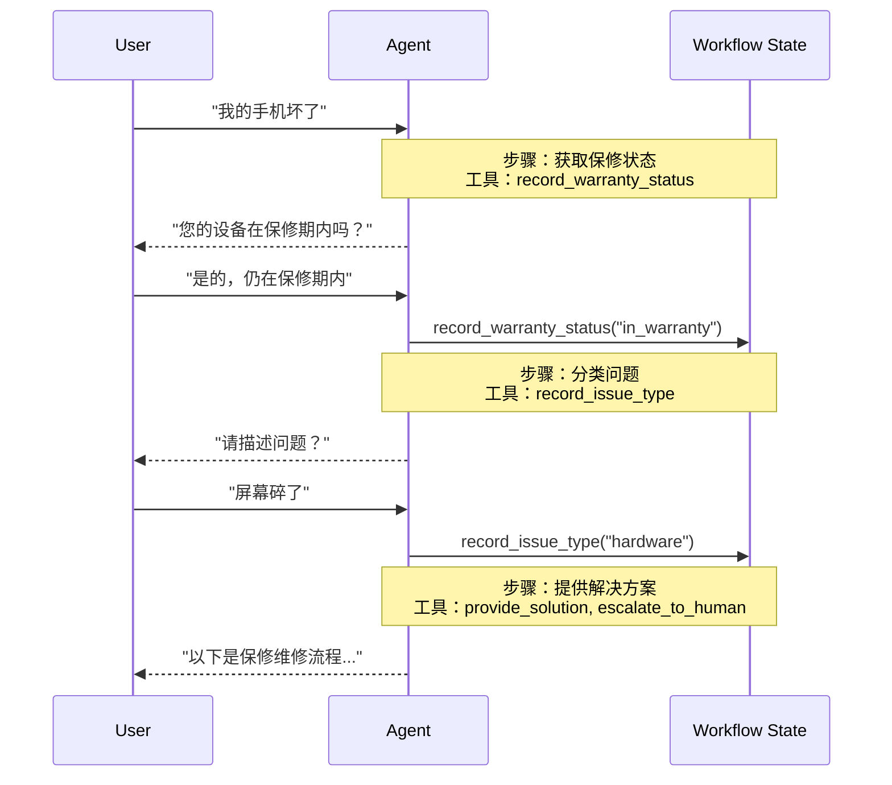

在**手动交接**架构中，行为会根据状态动态变化。其核心机制是：[工具](/oss/javascript/langchain/tools) 更新一个状态变量（例如 `current_step` 或 `active_agent`），该变量在多个回合中持久存在，系统读取此变量以调整行为——要么应用不同的配置（系统提示、工具），要么路由到不同的[代理](/oss/javascript/langchain/agents)。此模式支持不同代理之间的手动交接以及单个代理内的动态配置更改。

<Tip>
术语**手动交接**由 [OpenAI](https://openai.github.io/openai-agents-python/handoffs/) 创造，用于使用工具调用（例如 `transfer_to_sales_agent`）在代理或状态之间转移控制权。
</Tip>



## 关键特性

*   **状态驱动行为**：行为根据状态变量（例如 `current_step` 或 `active_agent`）而变化
*   **基于工具的转换**：工具更新状态变量以在状态之间移动
*   **直接用户交互**：每个状态的配置直接处理用户消息
*   **持久状态**：状态在对话回合之间持续存在

## 使用时机

当您需要强制执行顺序约束（仅在满足先决条件后解锁功能）、代理需要在不同状态下直接与用户对话，或者您正在构建多阶段对话流时，请使用手动交接模式。此模式对于客户支持场景特别有价值，例如在处理退款之前需要按特定顺序收集信息——例如，在处理退款之前收集保修 ID。

## 基本实现

核心机制是一个[工具](/oss/javascript/langchain/tools)，它返回一个 [`Command`](/oss/javascript/langgraph/graph-api#command) 来更新状态，从而触发向新步骤或代理的转换：

```typescript
import { tool, ToolMessage, type ToolRuntime } from "langchain";
import { Command } from "@langchain/langgraph";
import { z } from "zod";

const transferToSpecialist = tool(
  async (_, config: ToolRuntime<typeof StateSchema>) => {
    return new Command({
      update: {
        messages: [
          new ToolMessage({  // [!code highlight]
            content: "Transferred to specialist",
            tool_call_id: config.toolCallId  // [!code highlight]
          })
        ],
        currentStep: "specialist"  // Triggers behavior change
      }
    });
  },
  {
    name: "transfer_to_specialist",
    description: "Transfer to the specialist agent.",
    schema: z.object({})
  }
);
```

<Note>
**为什么包含 `ToolMessage`？** 当 LLM 调用工具时，它期望一个响应。具有匹配 `tool_call_id` 的 `ToolMessage` 完成了这个请求-响应循环——没有它，对话历史会变得不完整。每当您的交接工具更新消息时，这都是必需的。
</Note>

有关完整实现，请参阅下面的教程。

<Card
    title="教程：使用手动交接构建客户支持"
    icon="users"
    href="/oss/javascript/langchain/multi-agent/handoffs-customer-support"
    arrow cta="了解更多"
>
    了解如何使用手动交接模式构建客户支持代理，其中单个代理在不同配置之间转换。
</Card>

## 实现方法

有两种实现手动交接的方法：**[带中间件的单代理](#single-agent-with-middleware)**（具有动态配置的单个代理）或**[多代理子图](#multiple-agent-subgraphs)**（作为图节点的不同代理）。

### 带中间件的单代理

单个代理根据状态改变其行为。中间件拦截每个模型调用，并动态调整系统提示和可用工具。工具更新状态变量以触发转换：

```typescript
import { tool, ToolMessage, type ToolRuntime } from "langchain";
import { Command } from "@langchain/langgraph";
import { z } from "zod";

const recordWarrantyStatus = tool(
  async ({ status }, config: ToolRuntime<typeof StateSchema>) => {
    return new Command({
      update: {
        messages: [
          new ToolMessage({
            content: `Warranty status recorded: ${status}`,
            tool_call_id: config.toolCallId,
          }),
        ],
        warrantyStatus: status,
        currentStep: "specialist", // Update state to trigger transition
      },
    });
  },
  {
    name: "record_warranty_status",
    description: "Record warranty status and transition to next step.",
    schema: z.object({
      status: z.string(),
    }),
  }
);
```

<Accordion title="完整示例：带中间件的客户支持">

```typescript
import {
  createAgent,
  createMiddleware,
  tool,
  ToolMessage,
  type ToolRuntime,
} from "langchain";
import { Command, MemorySaver, StateSchema } from "@langchain/langgraph";
import { z } from "zod";

// 1. 定义带有 current_step 跟踪器的状态
const SupportState = new StateSchema({ // [!code highlight]
  currentStep: z.string().default("triage"), // [!code highlight]
  warrantyStatus: z.string().optional(),
});

// 2. 工具通过 Command 更新 currentStep
const recordWarrantyStatus = tool(
  async ({ status }, config: ToolRuntime<typeof SupportState.State>) => {
    return new Command({ // [!code highlight]
      update: { // [!code highlight]
        messages: [ // [!code highlight]
          new ToolMessage({
            content: `Warranty status recorded: ${status}`,
            tool_call_id: config.toolCallId,
          }),
        ],
        warrantyStatus: status,
        // Transition to next step
        currentStep: "specialist", // [!code highlight]
      },
    });
  },
  {
    name: "record_warranty_status",
    description: "Record warranty status and transition",
    schema: z.object({ status: z.string() }),
  }
);

// 3. 中间件根据 currentStep 应用动态配置
const applyStepConfig = createMiddleware({
  name: "applyStepConfig",
  stateSchema: SupportState, // [!code highlight]
  wrapModelCall: async (request, handler) => {
    const step = request.state.currentStep || "triage"; // [!code highlight]

    // 将步骤映射到其配置
    const configs = {
      triage: {
        prompt: "Collect warranty information...",
        tools: [recordWarrantyStatus],
      },
      specialist: {
        prompt: `Provide solutions based on warranty: ${request.state.warrantyStatus}`,
        tools: [provideSolution, escalate],
      },
    };

    const config = configs[step as keyof typeof configs];
    return handler({
      ...request,
      systemPrompt: config.prompt,
      tools: config.tools,
    });
  },
});

// 4. 创建带有中间件的代理
const agent = createAgent({
  model,
  tools: [recordWarrantyStatus, provideSolution, escalate],
  middleware: [applyStepConfig], // [!code highlight]
  checkpointer: new MemorySaver(), // Persist state across turns  // [!code highlight]
});
```

</Accordion>

### 多代理子图

多个不同的代理作为图中的单独节点存在。交接工具使用 `Command.PARENT` 在代理节点之间导航，以指定下一个要执行的节点。

<Warning>
子图交接需要仔细的**[上下文工程](/oss/javascript/langchain/context-engineering)**。与单代理中间件（消息历史自然流动）不同，您必须明确决定哪些消息在代理之间传递。如果出错，代理会收到不完整的对话历史或臃肿的上下文。请参阅下面的[上下文工程](#context-engineering)。
</Warning>

```typescript
import {
  tool,
  ToolMessage,
  AIMessage,
  type ToolRuntime,
} from "langchain";
import { Command, StateSchema, MessagesValue } from "@langchain/langgraph";

const CustomState = new StateSchema({
  messages: MessagesValue,
});

const transferToSales = tool(
  async (_, runtime: ToolRuntime<typeof CustomState.State>) => {
    const lastAiMessage = runtime.state.messages // [!code highlight]
      .reverse() // [!code highlight]
      .find(AIMessage.isInstance); // [!code highlight]

    const transferMessage = new ToolMessage({ // [!code highlight]
      content: "Transferred to sales agent", // [!code highlight]
      tool_call_id: runtime.toolCallId, // [!code highlight]
    }); // [!code highlight]
    return new Command({
      goto: "sales_agent",
      update: {
        activeAgent: "sales_agent",
        messages: [lastAiMessage, transferMessage].filter(Boolean), // [!code highlight]
      },
      graph: Command.PARENT,
    });
  },
  {
    name: "transfer_to_sales",
    description: "Transfer to the sales agent.",
    schema: z.object({}),
  }
);
```

<Accordion title="完整示例：使用手动交接的销售和支持">

此示例展示了一个具有独立销售和支持代理的多代理系统。每个代理都是一个单独的图节点，交接工具允许代理将对话相互转移。

```typescript
import {
  StateGraph,
  START,
  END,
  StateSchema,
  MessagesValue,
  Command,
  ConditionalEdgeRouter,
  GraphNode,
} from "@langchain/langgraph";
import { createAgent, AIMessage, ToolMessage } from "langchain";
import { tool, ToolRuntime } from "@langchain/core/tools";
import { z } from "zod/v4";

// 1. 定义带有 active_agent 跟踪器的状态
const MultiAgentState = new StateSchema({
  messages: MessagesValue,
  activeAgent: z.string().optional(),
});

// 2. 创建交接工具
const transferToSales = tool(
  async (_, runtime: ToolRuntime<typeof MultiAgentState.State>) => {
    const lastAiMessage = [...runtime.state.messages] // [!code highlight]
      .reverse() // [!code highlight]
      .find(AIMessage.isInstance); // [!code highlight]
    const transferMessage = new ToolMessage({ // [!code highlight]
      content: "Transferred to sales agent from support agent", // [!code highlight]
      tool_call_id: runtime.toolCallId, // [!code highlight]
    }); // [!code highlight]
    return new Command({
      goto: "sales_agent",
      update: {
        activeAgent: "sales_agent",
        messages: [lastAiMessage, transferMessage].filter(Boolean), // [!code highlight]
      },
      graph: Command.PARENT,
    });
  },
  {
    name: "transfer_to_sales",
    description: "Transfer to the sales agent.",
    schema: z.object({}),
  }
);

const transferToSupport = tool(
  async (_, runtime: ToolRuntime<typeof MultiAgentState.State>) => {
    const lastAiMessage = [...runtime.state.messages] // [!code highlight]
      .reverse() // [!code highlight]
      .find(AIMessage.isInstance); // [!code highlight]
    const transferMessage = new ToolMessage({ // [!code highlight]
      content: "Transferred to support agent from sales agent", // [!code highlight]
      tool_call_id: runtime.toolCallId, // [!code highlight]
    }); // [!code highlight]
    return new Command({
      goto: "support_agent",
      update: {
        activeAgent: "support_agent",
        messages: [lastAiMessage, transferMessage].filter(Boolean), // [!code highlight]
      },
      graph: Command.PARENT,
    });
  },
  {
    name: "transfer_to_support",
    description: "Transfer to the support agent.",
    schema: z.object({}),
  }
);

// 3. 创建带有交接工具的代理
const salesAgent = createAgent({
  model: "anthropic:claude-sonnet-4-20250514",
  tools: [transferToSupport],
  systemPrompt:
    "You are a sales agent. Help with sales inquiries. If asked about technical issues or support, transfer to the support agent.",
});

const supportAgent = createAgent({
  model: "anthropic:claude-sonnet-4-20250514",
  tools: [transferToSales],
  systemPrompt:
    "You are a support agent. Help with technical issues. If asked about pricing or purchasing, transfer to the sales agent.",
});

// 4. 创建调用代理的代理节点
const callSalesAgent: GraphNode<typeof MultiAgentState.State> = async (state) => {
  const response = await salesAgent.invoke(state);
  return response;
};

const callSupportAgent: GraphNode<typeof MultiAgentState.State> = async (state) => {
  const response = await supportAgent.invoke(state);
  return response;
};

// 5. 创建路由器，检查是否应结束或继续
const routeAfterAgent: ConditionalEdgeRouter<
  typeof MultiAgentState.State,
  "sales_agent" | "support_agent"
> = (state) => {
  const messages = state.messages ?? [];

  // 检查最后一条消息 - 如果是不带工具调用的 AIMessage，则完成
  if (messages.length > 0) {
    const lastMsg = messages[messages.length - 1];
    if (lastMsg instanceof AIMessage && !lastMsg.tool_calls?.length) { // [!code highlight]
      return END; // [!code highlight]
    } // [!code highlight]
  }

  // 否则路由到活动代理
  const active = state.activeAgent ?? "sales_agent";
  return active as "sales_agent" | "support_agent";
};

const routeInitial: ConditionalEdgeRouter<
  typeof MultiAgentState.State,
  "sales_agent" | "support_agent"
> = (state) => {
  // 根据状态路由到活动代理，默认为销售代理
  return (state.activeAgent ?? "sales_agent") as
    | "sales_agent"
    | "support_agent";
};

// 6. 构建图
const builder = new StateGraph(MultiAgentState)
  .addNode("sales_agent", callSalesAgent)
  .addNode("support_agent", callSupportAgent);
  // 根据初始 activeAgent 开始条件路由
  .addConditionalEdges(START, routeInitial, [
    "sales_agent",
    "support_agent",
  ])
  // 每个代理之后，检查是否应结束或路由到另一个代理
  .addConditionalEdges("sales_agent", routeAfterAgent, [
    "sales_agent",
    "support_agent",
    END,
  ]);
  builder.addConditionalEdges("support_agent", routeAfterAgent, [
    "sales_agent",
    "support_agent",
    END,
  ]);

const graph = builder.compile();
const result = await graph.invoke({
  messages: [
    {
      role: "user",
      content: "Hi, I'm having trouble with my account login. Can you help?",
    },
  ],
});

for (const msg of result.messages) {
  console.log(msg.content);
}
```

</Accordion>

<Tip>
对于大多数手动交接用例，请使用**带中间件的单代理**——它更简单。仅当您需要定制的代理实现（例如，一个本身是具有反思或检索步骤的复杂图的节点）时，才使用**多代理子图**。
</Tip>

#### 上下文工程

使用子图交接时，您可以精确控制代理之间流动的消息。这种精确性对于维护有效的对话历史和避免可能混淆下游代理的上下文膨胀至关重要。有关此主题的更多信息，请参阅[上下文工程](/oss/javascript/langchain/context-engineering)。

**在交接期间处理上下文**

在代理之间交接时，您需要确保对话历史保持有效。LLM 期望工具调用与其响应配对，因此当使用 `Command.PARENT` 交接给另一个代理时，您必须同时包含：

1.  **包含工具调用的 `AIMessage`**（触发交接的消息）
2.  **确认交接的 `ToolMessage`**（该工具调用的人工响应）

没有这种配对，接收代理将看到不完整的对话，并可能产生错误或意外行为。

下面的示例假设只调用了交接工具（没有并行工具调用）：

```typescript
const transferToSales = tool(
  async (_, runtime: ToolRuntime<typeof MultiAgentState.State>) => {
    // 获取触发此交接的 AI 消息
    const lastAiMessage = runtime.state.messages.at(-1);

    // 创建人工工具响应以完成配对
    const transferMessage = new ToolMessage({
      content: "Transferred to sales agent",
      tool_call_id: runtime.toolCallId,
    });

    return new Command({
      goto: "sales_agent",
      update: {
        activeAgent: "sales_agent",
        // 仅传递这两个消息，而不是完整的子代理历史
        messages: [lastAiMessage, transferMessage],
      },
      graph: Command.PARENT,
    });
  },
  {
    name: "transfer_to_sales",
    description: "Transfer to the sales agent.",
    schema: z.object({}),
  }
);
```

<Note>
**为什么不传递所有子代理消息？** 虽然您可以在交接中包含完整的子代理对话，但这通常会产生问题。接收代理可能会被无关的内部推理混淆，并且令牌成本会不必要地增加。通过仅传递交接对，您可以使父图的上下文专注于高层协调。如果接收代理需要额外的上下文，请考虑在 `ToolMessage` 内容中总结子代理的工作，而不是传递原始消息历史。
</Note>

**将控制权返回给用户**

当将控制权返回给用户（结束代理的回合）时，请确保最终消息是 `AIMessage`。这可以维护有效的对话历史，并向用户界面发出信号，表明代理已完成其工作。

## 实现注意事项

在设计多代理系统时，请考虑：

*   **上下文过滤策略**：每个代理是接收完整的对话历史、过滤的部分还是摘要？不同的代理可能根据其角色需要不同的上下文。
*   **工具语义**：澄清交接工具是仅更新路由状态还是也执行副作用。例如，`transfer_to_sales()` 是否还应创建支持票证，或者这应该是单独的操作？
*   **令牌效率**：在上下文完整性和令牌成本之间取得平衡。随着对话变长，摘要和选择性上下文传递变得更加重要。

---

<div className="source-links">
<Callout icon="edit">
    [在 GitHub 上编辑此页面](https://github.com/langchain-ai/docs/edit/main/src/oss/langchain/multi-agent/handoffs.mdx) 或[提交问题](https://github.com/langchain-ai/docs/issues/new/choose)。
</Callout>
<Callout icon="terminal-2">
    [通过 MCP 将这些文档连接到 Claude、VSCode 等](/use-these-docs) 以获取实时答案。
</Callout>
</div>