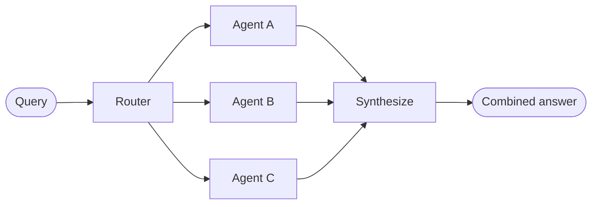

在 **router** 架构中，路由步骤对输入进行分类并将其定向到专门的 [agents](/oss/javascript/langchain/agents)。当你有不同的**垂直领域**——每个都需要自己的代理的独立知识域时，这很有用。



## 关键特性

* Router 分解查询
* 零个或多个专门代理并行调用
* 结果被合成为一个连贯的响应

## 何时使用

当你有不同的垂直领域（每个都需要自己的代理的独立知识域）、需要并行查询多个来源，并希望将结果合成为组合响应时，使用 router 模式。

## 基本实现

路由器对查询进行分类并将其定向到适当的代理。使用 [`Command`](/oss/javascript/langgraph/graph-api#command) 进行单代理路由或 [`Send`](/oss/javascript/langgraph/graph-api#send) 进行到多个代理的并行扇出。

<Tabs>
<Tab title="单代理">

使用 `Command` 路由到单个专门代理：


```typescript
import { z } from "zod";
import { Command } from "@langchain/langgraph";

const ClassificationResult = z.object({
  query: z.string(),
  agent: z.string(),
});

function classifyQuery(query: string): z.infer<typeof ClassificationResult> {
  // Use LLM to classify query and determine the appropriate agent
  // Classification logic here
  ...
}

function routeQuery(state: z.infer<typeof ClassificationResult>) {
  const classification = classifyQuery(state.query);

  // Route to the selected agent
  return new Command({ goto: classification.agent });
}
```


</Tab>
<Tab title="多代理（并行）">

使用 `Send` 并行扇出到多个专门代理：


```typescript
import { z } from "zod";
import { Command } from "@langchain/langgraph";

const ClassificationResult = z.object({
  query: z.string(),
  agent: z.string(),
});

function classifyQuery(query: string): z.infer<typeof ClassificationResult>[] {
  // Use LLM to classify query and determine the appropriate agent
  // Classification logic here
  ...
}

function routeQuery(state: typeof State.State) {
  const classifications = classifyQuery(state.query);

  // Fan out to selected agents in parallel
  return classifications.map(
    (c) => new Send(c.agent, { query: c.query })
  );
}
```


</Tab>
</Tabs>

有关完整实现，请参阅下面的教程。

<Card title="教程：构建带路由的多源知识库" icon="book" href="/oss/javascript/langchain/multi-agent/router-knowledge-base">
构建一个并行查询 GitHub、Notion 和 Slack 的路由器，然后将结果合成为连贯的答案。涵盖状态定义、专门代理、使用 `Send` 的并行执行和结果合成。
</Card>

## 无状态 vs. 有状态

两种方法：
* [**无状态路由器**](#stateless) 独立处理每个请求
* [**有状态路由器**](#stateful) 跨请求维护对话历史

## 无状态

每个请求独立路由——调用之间没有记忆。对于多轮对话，请参阅 [有状态路由器](#stateful)。

<Tip>
**Router vs. Subagents**：两种模式都可以将工作分派给多个代理，但它们在如何做出路由决策方面有所不同：

- **Router**：一个专门的路由步骤（通常是单个 LLM 调用或基于规则的逻辑），它对输入进行分类并分派给代理。路由器本身通常不维护对话历史或执行多轮编排——它是一个预处理步骤。
- **Subagents**：一个主 supervisor 代理动态决定在持续对话中调用哪些 [subagents](/oss/javascript/langchain/multi-agent/subagents)。主代理维护上下文，可以跨轮次调用多个子代理，并编排复杂的多步骤工作流。

当你有明确的输入类别并希望进行确定性或轻量级分类时，使用 **router**。当你需要灵活的、感知对话的编排，其中 LLM 根据不断演变的上下文决定下一步做什么时，使用 **supervisor**。
</Tip>


## 有状态

对于多轮对话，你需要跨调用维护上下文。

### 工具包装器

最简单的方法：将无状态路由器包装为对话代理可以调用的工具。对话代理处理记忆和上下文；路由器保持无状态。这避免了跨多个并行代理管理对话历史的复杂性。


```typescript
const searchDocs = tool(
  async ({ query }) => {
    const result = await workflow.invoke({ query }); // [!code highlight]
    return result.finalAnswer;
  },
  {
    name: "search_docs",
    description: "Search across multiple documentation sources",
    schema: z.object({
      query: z.string().describe("The search query"),
    }),
  }
);

// Conversational agent uses the router as a tool
const conversationalAgent = createAgent({
  model,
  tools: [searchDocs],
  systemPrompt: "You are a helpful assistant. Use search_docs to answer questions.",
});
```


### 完全持久化

如果你需要路由器本身维护状态，使用 [持久化](/oss/javascript/langchain/short-term-memory) 来存储消息历史。当路由到代理时，从状态中获取之前的消息并选择性地将它们包含在代理的上下文中——这是 [上下文工程](/oss/javascript/langchain/context-engineering) 的一个杠杆。

<Warning>
**有状态路由器需要自定义历史管理。** 如果路由器跨轮次在代理之间切换，当代理具有不同的语气或提示时，对话对最终用户来说可能感觉不流畅。使用并行调用时，你需要在路由器级别维护历史（输入和合成输出）并在路由逻辑中利用此历史。考虑改用 [handoffs 模式](/oss/javascript/langchain/multi-agent/handoffs) 或 [subagents 模式](/oss/javascript/langchain/multi-agent/subagents)——两者都为多轮对话提供了更清晰的语义。
</Warning>

---

<Callout icon="pen-to-square" iconType="regular">
    [Edit this page on GitHub](https://github.com/langchain-ai/docs/edit/main/src/oss/langchain/multi-agent/router.mdx) or [file an issue](https://github.com/langchain-ai/docs/issues/new/choose).
</Callout>
<Tip icon="terminal" iconType="regular">
    [Connect these docs](/use-these-docs) to Claude, VSCode, and more via MCP for real-time answers.
</Tip>
<div class='fixed right-2 bg-white bottom-2'></div>