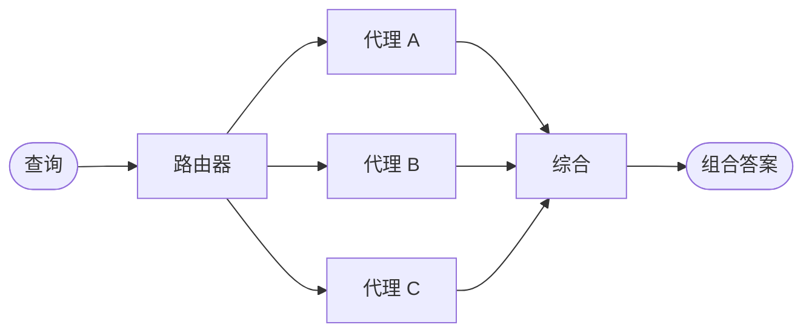

在**路由器**架构中，路由步骤对输入进行分类并将其定向到专门的[代理](/oss/javascript/langchain/agents)。当您有不同的**垂直领域**——每个都需要自己代理的独立知识领域时，这非常有用。



## 主要特征

* 路由器分解查询
* 并行调用零个或多个专门代理
* 结果被综合成一个连贯的响应

## 何时使用

当您有不同的垂直领域（每个都需要自己代理的独立知识领域），需要并行查询多个来源，并希望将结果综合成一个组合响应时，请使用路由器模式。

## 基本实现

路由器对查询进行分类并将其定向到适当的代理。使用 [`Command`](/oss/javascript/langgraph/graph-api#command) 进行单代理路由，或使用 [`Send`](/oss/javascript/langgraph/graph-api#send) 并行扇出到多个代理。

<Tabs>
<Tab title="单个代理">

使用 `Command` 路由到单个专门代理：


```typescript
import { z } from "zod";
import { Command } from "@langchain/langgraph";

const ClassificationResult = z.object({
  query: z.string(),
  agent: z.string(),
});

function classifyQuery(query: string): z.infer<typeof ClassificationResult> {
  // 使用 LLM 对查询进行分类并确定适当的代理
  // 分类逻辑在此
  ...
}

function routeQuery(state: z.infer<typeof ClassificationResult>) {
  const classification = classifyQuery(state.query);

  // 路由到选定的代理
  return new Command({ goto: classification.agent });
}
```


</Tab>
<Tab title="多个代理（并行）">

使用 `Send` 并行扇出到多个专门代理：


```typescript
import { z } from "zod";
import { Command } from "@langchain/langgraph";

const ClassificationResult = z.object({
  query: z.string(),
  agent: z.string(),
});

function classifyQuery(query: string): z.infer<typeof ClassificationResult>[] {
  // 使用 LLM 对查询进行分类并确定适当的代理
  // 分类逻辑在此
  ...
}

function routeQuery(state: typeof State.State) {
  const classifications = classifyQuery(state.query);

  // 并行扇出到选定的代理
  return classifications.map(
    (c) => new Send(c.agent, { query: c.query })
  );
}
```


</Tab>
</Tabs>

有关完整实现，请参阅下面的教程。

<Card title="教程：构建带路由的多源知识库" icon="book" href="/oss/javascript/langchain/multi-agent/router-knowledge-base">
构建一个并行查询 GitHub、Notion 和 Slack，然后将结果综合成连贯答案的路由器。涵盖状态定义、专门代理、使用 `Send` 的并行执行以及结果综合。
</Card>

## 无状态与有状态

两种方法：
* [**无状态路由器**](#stateless) 独立处理每个请求
* [**有状态路由器**](#stateful) 跨请求维护对话历史

## 无状态

每个请求都是独立路由的——调用之间没有记忆。对于多轮对话，请参阅[有状态路由器](#stateful)。

<Tip>
**路由器与子代理**：这两种模式都可以将工作分发给多个代理，但它们在做出路由决策的方式上有所不同：

- **路由器**：一个专用的路由步骤（通常是单个 LLM 调用或基于规则的逻辑），它对输入进行分类并分发给代理。路由器本身通常不维护对话历史或执行多轮编排——它是一个预处理步骤。
- **子代理**：一个主监督者代理动态决定在正在进行的对话中调用哪些[子代理](/oss/javascript/langchain/multi-agent/subagents)。主代理维护上下文，可以跨轮次调用多个子代理，并编排复杂的多步工作流。

当您有明确的输入类别并希望进行确定性或轻量级分类时，请使用**路由器**。当您需要灵活的、感知对话的编排，其中 LLM 根据不断变化的上下文决定下一步做什么时，请使用**监督者**。
</Tip>


## 有状态

对于多轮对话，您需要跨调用维护上下文。

### 工具包装器

最简单的方法：将无状态路由器包装为一个对话代理可以调用的工具。对话代理处理记忆和上下文；路由器保持无状态。这避免了在多个并行代理之间管理对话历史的复杂性。


```typescript
const searchDocs = tool(
  async ({ query }) => {
    const result = await workflow.invoke({ query }); // [!code highlight]
    return result.finalAnswer;
  },
  {
    name: "search_docs",
    description: "跨多个文档源搜索",
    schema: z.object({
      query: z.string().describe("搜索查询"),
    }),
  }
);

// 对话代理将路由器用作工具
const conversationalAgent = createAgent({
  model,
  tools: [searchDocs],
  systemPrompt: "你是一个乐于助人的助手。使用 search_docs 回答问题。",
});
```


### 完全持久化

如果您需要路由器本身维护状态，请使用[持久化](/oss/javascript/langchain/short-term-memory)来存储消息历史。路由到代理时，从状态中获取先前的消息并选择性地将它们包含在代理的上下文中——这是[上下文工程](/oss/javascript/langchain/context-engineering)的一个手段。

<Warning>
**有状态路由器需要自定义历史管理。** 如果路由器在轮次之间切换代理，当代理具有不同的语气或提示时，对话对最终用户来说可能感觉不流畅。对于并行调用，您需要在路由器级别（输入和综合输出）维护历史记录，并在路由逻辑中利用此历史记录。考虑改用[交接模式](/oss/javascript/langchain/multi-agent/handoffs)或[子代理模式](/oss/javascript/langchain/multi-agent/subagents)——两者都为多轮对话提供了更清晰的语义。
</Warning>

---

<div className="source-links">
<Callout icon="edit">
    [在 GitHub 上编辑此页面](https://github.com/langchain-ai/docs/edit/main/src/oss/langchain/multi-agent/router.mdx) 或 [提交问题](https://github.com/langchain-ai/docs/issues/new/choose).
</Callout>
<Callout icon="terminal-2">
    [通过 MCP 将这些文档连接](/use-these-docs) 到 Claude、VSCode 等，以获取实时答案。
</Callout>
</div>
