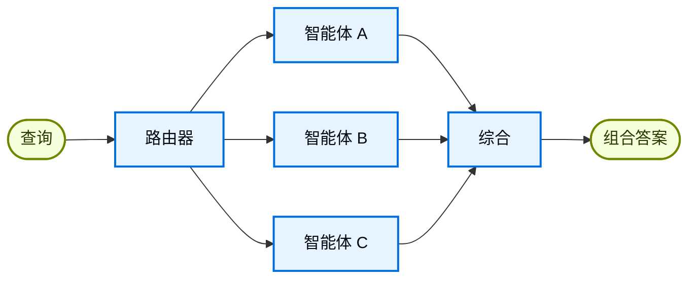

在**路由器**架构中，路由步骤会对输入进行分类，并将其定向到专门的[智能体](/oss/javascript/langchain/agents)。当您拥有不同的**垂直领域**（每个领域都需要自己的独立智能体）时，这种模式非常有用。


```mermaid
graph LR
    A([查询]) --> B[路由器]
    B --> C[智能体 A]
    B --> D[智能体 B]
    B --> E[智能体 C]
    C --> F[综合]
    D --> F
    E --> F
    F --> G([组合答案])

    classDef trigger fill:#F6FFDB,stroke:#6E8900,stroke-width:2px,color:#2E3900
    classDef process fill:#E5F4FF,stroke:#006DDD,stroke-width:2px,color:#030710

    class A,G trigger
    class B,C,D,E,F process
```

## 关键特性

* 路由器分解查询
* 并行调用零个或多个专门的智能体
* 将结果综合成连贯的响应

## 何时使用

当您拥有不同的垂直领域（每个领域都需要自己的独立智能体），需要并行查询多个来源，并希望将结果综合成组合响应时，请使用路由器模式。

## 基本实现

路由器对查询进行分类，并将其定向到适当的智能体。对于单智能体路由，请使用 [`Command`](/oss/javascript/langgraph/graph-api#command)；对于并行扇出到多个智能体，请使用 [`Send`](/oss/javascript/langgraph/graph-api#send)。

<Tabs>
<Tab title="单智能体">

使用 `Command` 路由到单个专门的智能体：


```typescript
import { z } from "zod";
import { Command } from "@langchain/langgraph";

const ClassificationResult = z.object({
  query: z.string(),
  agent: z.string(),
});

function classifyQuery(query: string): z.infer<typeof ClassificationResult> {
  // 使用 LLM 对查询进行分类并确定适当的智能体
  // 此处为分类逻辑
  ...
}

function routeQuery(state: z.infer<typeof ClassificationResult>) {
  const classification = classifyQuery(state.query);

  // 路由到选定的智能体
  return new Command({ goto: classification.agent });
}
```


</Tab>
<Tab title="多智能体（并行）">

使用 `Send` 并行扇出到多个专门的智能体：


```typescript
import { z } from "zod";
import { Command } from "@langchain/langgraph";

const ClassificationResult = z.object({
  query: z.string(),
  agent: z.string(),
});

function classifyQuery(query: string): z.infer<typeof ClassificationResult>[] {
  // 使用 LLM 对查询进行分类并确定适当的智能体
  // 此处为分类逻辑
  ...
}

function routeQuery(state: typeof State.State) {
  const classifications = classifyQuery(state.query);

  // 并行扇出到选定的智能体
  return classifications.map(
    (c) => new Send(c.agent, { query: c.query })
  );
}
```


</Tab>
</Tabs>

完整实现请参阅下方教程。

<Card title="教程：构建带路由的多源知识库" icon="book" href="/oss/javascript/langchain/multi-agent/router-knowledge-base">
构建一个路由器，并行查询 GitHub、Notion 和 Slack，然后将结果综合成连贯的答案。涵盖状态定义、专门的智能体、使用 `Send` 的并行执行以及结果综合。
</Card>

## 无状态与有状态

两种方法：
* [**无状态路由器**](#stateless) 独立处理每个请求
* [**有状态路由器**](#stateful) 在请求间维护对话历史

## 无状态

每个请求独立路由——调用之间没有记忆。对于多轮对话，请参阅[有状态路由器](#stateful)。

<Tip>
**路由器与子智能体**：两种模式都可以将工作分派给多个智能体，但它们在路由决策的制定方式上有所不同：

- **路由器**：一个专门的路由步骤（通常是一次 LLM 调用或基于规则的逻辑），用于对输入进行分类并分派给智能体。路由器本身通常不维护对话历史或执行多轮编排——它是一个预处理步骤。
- **子智能体**：一个主要的监督智能体在持续对话中动态决定调用哪些[子智能体](/oss/javascript/langchain/multi-agent/subagents)。主智能体维护上下文，可以在多个轮次中调用多个子智能体，并编排复杂的多步骤工作流。

当您有明确的输入类别并希望进行确定性或轻量级分类时，请使用**路由器**。当您需要灵活的、对话感知的编排，其中 LLM 根据不断变化的上下文决定下一步做什么时，请使用**监督者**。
</Tip>


## 有状态

对于多轮对话，您需要在调用间维护上下文。

### 工具包装器

最简单的方法：将无状态路由器包装为一个对话智能体可以调用的工具。对话智能体处理记忆和上下文；路由器保持无状态。这避免了在多个并行智能体之间管理对话历史的复杂性。


```typescript
const searchDocs = tool(
  async ({ query }) => {
    const result = await workflow.invoke({ query }); // [!code highlight]
    return result.finalAnswer;
  },
  {
    name: "search_docs",
    description: "Search across multiple documentation sources",
    schema: z.object({
      query: z.string().describe("The search query"),
    }),
  }
);

// 对话智能体将路由器用作工具
const conversationalAgent = createAgent({
  model,
  tools: [searchDocs],
  systemPrompt: "You are a helpful assistant. Use search_docs to answer questions.",
});
```


### 完全持久化

如果您需要路由器本身维护状态，请使用[持久化](/oss/javascript/langchain/short-term-memory)来存储消息历史。当路由到智能体时，从状态中获取之前的消息，并有选择地将其包含在智能体的上下文中——这是[上下文工程](/oss/javascript/langchain/context-engineering)的一个杠杆。

<Warning>
**有状态路由器需要自定义历史记录管理。** 如果路由器在轮次间切换智能体，当智能体具有不同的语气或提示时，对话对最终用户来说可能感觉不流畅。对于并行调用，您需要在路由器级别维护历史记录（输入和综合输出），并在路由逻辑中利用此历史记录。请考虑使用[交接模式](/oss/javascript/langchain/multi-agent/handoffs)或[子智能体模式](/oss/javascript/langchain/multi-agent/subagents)——两者都为多轮对话提供了更清晰的语义。
</Warning>

---

<div className="source-links">
<Callout icon="terminal-2">
    [将这些文档连接](/use-these-docs)到 Claude、VSCode 等，通过 MCP 获取实时答案。
</Callout>
<Callout icon="edit">
    [在 GitHub 上编辑此页面](https://github.com/langchain-ai/docs/edit/main/src/oss/langchain/multi-agent/router.mdx) 或 [提交问题](https://github.com/langchain-ai/docs/issues/new/choose)。
</Callout>
</div>