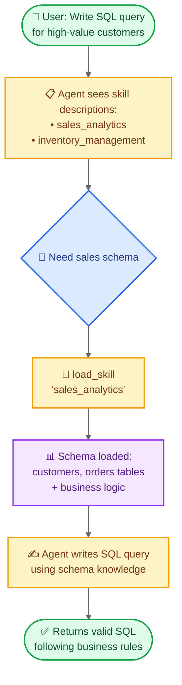

import ChatModelTabsPy from "/snippets/chat-model-tabs.mdx";
import ChatModelTabsJs from "/snippets/chat-model-tabs-js.mdx";

本教程演示了如何使用**渐进式披露**（一种上下文管理技术，其中代理按需加载信息而不是预先加载）来实现**技能**（专门的提示驱动指令）。代理通过工具调用加载技能，而不是动态更改系统提示，仅发现并加载每个任务所需的技能。

**用例：** 想象一下构建一个代理来帮助编写大型企业中不同业务垂直领域的 SQL 查询。您的组织可能每个垂直领域都有单独的数据存储，或者有一个包含数千个表的单一单体数据库。无论哪种方式，预先加载所有模式都会使上下文窗口不堪重负。渐进式披露通过仅在需要时加载相关模式来解决这个问题。这种架构还使不同的产品所有者和利益相关者能够独立贡献和维护其特定业务垂直领域的技能。

**您将构建什么：** 一个具有两个技能（销售分析和库存管理）的 SQL 查询助手。代理在其系统提示中看到轻量级的技能描述，然后仅当与用户查询相关时才通过工具调用加载完整的数据库模式和业务逻辑。

<Note>
  有关具有查询执行、错误纠正和验证的 SQL 代理的更完整示例，请参阅我们的 [SQL
  代理教程](/oss/javascript/langchain/sql-agent)。本教程侧重于可应用于任何领域的渐进式披露模式。
</Note>

<Tip>
  渐进式披露被 Anthropic
  推广为构建可扩展代理技能系统的技术。这种方法使用三层架构（元数据 → 核心内容 →
  详细资源），其中代理仅根据需要加载信息。有关此技术的更多信息，请参阅
  [Equipping agents for the real world with Agent
  Skills](https://www.anthropic.com/engineering/equipping-agents-for-the-real-world-with-agent-skills)。
</Tip>

## 它是如何工作的

以下是用户请求 SQL 查询时的流程：



**为什么使用渐进式披露：**

- **减少上下文使用** - 仅加载任务所需的 2-3 个技能，而不是所有可用技能
- **实现团队自主** - 不同的团队可以独立开发专门的技能（类似于其他多代理架构）
- **高效扩展** - 添加数十或数百个技能而不会使上下文不堪重负
- **简化对话历史** - 具有一个对话线程的单个代理

**什么是技能：** 正如 Claude Code 所推广的那样，技能主要是基于提示的：特定业务任务的自包含专门指令单元。在 Claude Code 中，技能作为文件系统上的目录公开，通过文件操作发现。技能通过提示指导行为，并可以提供有关工具使用的信息或包括供编码代理执行的示例代码。

<Tip>
  具有渐进式披露的技能可以被视为
  [RAG（检索增强生成）](/oss/javascript/langchain/rag)的一种形式，其中每个技能是一个检索单元——尽管不一定由嵌入或关键字搜索支持，而是由浏览内容的工具（如文件操作或本教程中的直接查找）支持。
</Tip>

**权衡：**

- **延迟**：按需加载技能需要额外的工具调用，这会增加需要每个技能的第一个请求的延迟
- **工作流控制**：基本实现依赖于提示来指导技能使用 - 如果没有自定义逻辑，您无法强制执行像“总是先尝试技能 A 再尝试技能 B”这样的硬约束

<Tip>
**实现您自己的技能系统**

在构建您自己的技能实现（就像我们在本教程中所做的那样）时，核心概念是渐进式披露 - 按需加载信息。除此之外，您在实现上拥有完全的灵活性：

- **存储**：数据库、S3、内存数据结构或任何后端
- **发现**：直接查找（本教程）、用于大型技能集合的 RAG、文件系统扫描或 API 调用
- **加载逻辑**：自定义延迟特性并添加逻辑以搜索技能内容或排名相关性
- **副作用**：定义加载技能时发生的情况，例如公开与该技能关联的工具（在第 8 节中介绍）

这种灵活性使您可以根据围绕性能、存储和工作流控制的特定要求进行优化。

</Tip>

## 设置

### 安装

本教程需要 `langchain` 包：

<CodeGroup>
  ```bash npm
  npm install langchain
  ```

```bash yarn
yarn add langchain
```

```bash pnpm
pnpm add langchain
```

</CodeGroup>

有关更多详细信息，请参阅我们的[安装指南](/oss/javascript/langchain/install)。

### LangSmith

设置 [LangSmith](https://smith.langchain.com) 以检查代理内部发生的情况。然后设置以下环境变量：

<CodeGroup>
  ```bash bash export LANGSMITH_TRACING="true" export LANGSMITH_API_KEY="..."
  ```

```
typescript typescript process.env.LANGSMITH_TRACING = "true";
process.env.LANGSMITH_API_KEY = "...";
```

</CodeGroup>

### 选择 LLM

从 LangChain 的集成套件中选择一个聊天模型：

<ChatModelTabsJs />

## 1. 定义技能

首先，定义技能的结构。每个技能都有一个名称、一个简短的描述（在系统提示中显示）和完整的内容（按需加载）：

```typescript
import { z } from "zod";

// A skill that can be progressively disclosed to the agent
const SkillSchema = z.object({
  // [!code highlight]
  name: z.string(), // Unique identifier for the skill
  description: z.string(), // 1-2 sentence description to show in system prompt
  content: z.string(), // Full skill content with detailed instructions
});

type Skill = z.infer<typeof SkillSchema>;
```

现在定义 SQL 查询助手的示例技能。这些技能设计为**描述轻量级**（预先显示给代理）但**内容详细**（仅在需要时加载）：

<Accordion title="查看完整技能定义">

```typescript
import { context } from "langchain";

const SKILLS: Skill[] = [
  {
    name: "sales_analytics",
    description:
      "Database schema and business logic for sales data analysis including customers, orders, and revenue.",
    content: context`
    # Sales Analytics Schema

    ## Tables

    ### customers
    - customer_id (PRIMARY KEY)
    - name
    - email
    - signup_date
    - status (active/inactive)
    - customer_tier (bronze/silver/gold/platinum)

    ### orders
    - order_id (PRIMARY KEY)
    - customer_id (FOREIGN KEY -> customers)
    - order_date
    - status (pending/completed/cancelled/refunded)
    - total_amount
    - sales_region (north/south/east/west)

    ### order_items
    - item_id (PRIMARY KEY)
    - order_id (FOREIGN KEY -> orders)
    - product_id
    - quantity
    - unit_price
    - discount_percent

    ## Business Logic

    **Active customers**:
    status = 'active' AND signup_date <= CURRENT_DATE - INTERVAL '90 days'

    **Revenue calculation**:
    Only count orders with status = 'completed'.
    Use total_amount from orders table, which already accounts for discounts.

    **Customer lifetime value (CLV)**:
    Sum of all completed order amounts for a customer.

    **High-value orders**:
    Orders with total_amount > 1000

    ## Example Query

    -- Get top 10 customers by revenue in the last quarter
    SELECT
        c.customer_id,
        c.name,
        c.customer_tier,
        SUM(o.total_amount) as total_revenue
    FROM customers c
    JOIN orders o ON c.customer_id = o.customer_id
    WHERE o.status = 'completed'
    AND o.order_date >= CURRENT_DATE - INTERVAL '3 months'
    GROUP BY c.customer_id, c.name, c.customer_tier
    ORDER BY total_revenue DESC
    LIMIT 10;`,
  },
  {
    name: "inventory_management",
    description:
      "Database schema and business logic for inventory tracking including products, warehouses, and stock levels.",
    content: context`
    # Inventory Management Schema

    ## Tables

    ### products
    - product_id (PRIMARY KEY)
    - product_name
    - sku
    - category
    - unit_cost
    - reorder_point (minimum stock level before reordering)
    - discontinued (boolean)

    ### warehouses
    - warehouse_id (PRIMARY KEY)
    - warehouse_name
    - location
    - capacity

    ### inventory
    - inventory_id (PRIMARY KEY)
    - product_id (FOREIGN KEY -> products)
    - warehouse_id (FOREIGN KEY -> warehouses)
    - quantity_on_hand
    - last_updated

    ### stock_movements
    - movement_id (PRIMARY KEY)
    - product_id (FOREIGN KEY -> products)
    - warehouse_id (FOREIGN KEY -> warehouses)
    - movement_type (inbound/outbound/transfer/adjustment)
    - quantity (positive for inbound, negative for outbound)
    - movement_date
    - reference_number

    ## Business Logic

    **Available stock**:
    quantity_on_hand from inventory table where quantity_on_hand > 0

    **Products needing reorder**:
    Products where total quantity_on_hand across all warehouses is less
    than or equal to the product's reorder_point

    **Active products only**:
    Exclude products where discontinued = true unless specifically analyzing discontinued items

    **Stock valuation**:
    quantity_on_hand * unit_cost for each product

    ## Example Query

    -- Find products below reorder point across all warehouses
    SELECT
        p.product_id,
        p.product_name,
        p.reorder_point,
        SUM(i.quantity_on_hand) as total_stock,
        p.unit_cost,
        (p.reorder_point - SUM(i.quantity_on_hand)) as units_to_reorder
    FROM products p
    JOIN inventory i ON p.product_id = i.product_id
    WHERE p.discontinued = false
    GROUP BY p.product_id, p.product_name, p.reorder_point, p.unit_cost
    HAVING SUM(i.quantity_on_hand) <= p.reorder_point
    ORDER BY units_to_reorder DESC;`,
  },
];
```

</Accordion>

## 2. 创建技能加载工具

创建一个按需加载完整技能内容的工具：

```typescript
import { tool } from "langchain";
import { z } from "zod";

const loadSkill = tool(
  // [!code highlight]
  async ({ skillName }) => {
    // Find and return the requested skill
    const skill = SKILLS.find((s) => s.name === skillName);
    if (skill) {
      return `Loaded skill: ${skillName}\n\n${skill.content}`; // [!code highlight]
    }

    // Skill not found
    const available = SKILLS.map((s) => s.name).join(", ");
    return `Skill '${skillName}' not found. Available skills: ${available}`;
  },
  {
    name: "load_skill",
    description: `Load the full content of a skill into the agent's context.

Use this when you need detailed information about how to handle a specific
type of request. This will provide you with comprehensive instructions,
policies, and guidelines for the skill area.`,
    schema: z.object({
      skillName: z.string().describe("The name of the skill to load"),
    }),
  },
);
```

`load_skill` 工具将完整的技能内容作为字符串返回，该字符串作为 ToolMessage 成为对话的一部分。有关创建和使用工具的更多详细信息，请参阅[工具指南](/oss/javascript/langchain/tools)。

## 3. 构建技能中间件

创建将技能描述注入系统提示的自定义中间件。此中间件使技能可被发现，而无需预先加载其完整内容。

<Note>
  本指南演示了创建自定义中间件。有关中间件概念和模式的综合指南，请参阅[自定义中间件文档](/oss/javascript/langchain/middleware/custom)。
</Note>

```typescript
import { createMiddleware } from "langchain";

// Build skills prompt from the SKILLS list
const skillsPrompt = SKILLS.map(
  (skill) => `- **${skill.name}**: ${skill.description}`,
).join("\n");

const skillMiddleware = createMiddleware({
  // [!code highlight]
  name: "skillMiddleware",
  tools: [loadSkill], // [!code highlight]
  wrapModelCall: async (request, handler) => {
    // Build the skills addendum
    const skillsAddendum = // [!code highlight]
      `\n\n## Available Skills\n\n${skillsPrompt}\n\n` + // [!code highlight]
      "Use the load_skill tool when you need detailed information " + // [!code highlight]
      "about handling a specific type of request."; // [!code highlight]

    // Append to system prompt
    const newSystemPrompt = request.systemPrompt + skillsAddendum;

    return handler({
      ...request,
      systemPrompt: newSystemPrompt,
    });
  },
});
```

中间件将技能描述附加到系统提示，使代理意识到可用技能，而无需加载其完整内容。`load_skill` 工具注册为类变量，使其可供代理使用。

<Note>
  **生产考虑**：本教程为了简单起见在 `__init__`
  中加载技能列表。在生产系统中，您可能希望改为在 `before_agent`
  钩子中加载技能，允许定期刷新它们以反映最新更改（例如，添加新技能或修改现有技能时）。有关详细信息，请参阅
  [before_agent
  钩子文档](/oss/javascript/langchain/middleware/custom#before_agent)。
</Note>

## 4. 创建支持技能的代理

现在创建带有技能中间件和用于状态持久性的检查点的代理：

```typescript
import { createAgent } from "langchain";
import { MemorySaver } from "@langchain/langgraph";

// Create the agent with skill support
const agent = createAgent({
  model,
  systemPrompt:
    "You are a SQL query assistant that helps users " +
    "write queries against business databases.",
  middleware: [skillMiddleware], // [!code highlight]
  checkpointer: new MemorySaver(),
});
```

代理现在可以在其系统提示中访问技能描述，并可以在需要时调用 `load_skill` 来检索完整的技能内容。检查点在轮次之间维护对话历史。

## 5. 测试渐进式披露

使用需要技能特定知识的问题测试代理：

```typescript
import { v4 as uuidv4 } from "uuid";

// Configuration for this conversation thread
const threadId = uuidv4();
const config = { configurable: { thread_id: threadId } };

// Ask for a SQL query
const result = await agent.invoke(
  // [!code highlight]
  {
    messages: [
      {
        role: "user",
        content:
          "Write a SQL query to find all customers " +
          "who made orders over 000 in the last month",
      },
    ],
  },
  config,
);

// Print the conversation
for (const message of result.messages) {
  console.log(`${message._getType()}: ${message.content}`);
}
```

预期输出：

````
================================ Human Message =================================

Write a SQL query to find all customers who made orders over 000 in the last month
================================== Ai Message ==================================
Tool Calls:
  load_skill (call_abc123)
 Call ID: call_abc123
  Args:
    skill_name: sales_analytics
================================= Tool Message =================================
Name: load_skill

Loaded skill: sales_analytics

# Sales Analytics Schema

## Tables

### customers
- customer_id (PRIMARY KEY)
- name
- email
- signup_date
- status (active/inactive)
- customer_tier (bronze/silver/gold/platinum)

### orders
- order_id (PRIMARY KEY)
- customer_id (FOREIGN KEY -> customers)
- order_date
- status (pending/completed/cancelled/refunded)
- total_amount
- sales_region (north/south/east/west)

[... rest of schema ...]

## Business Logic

**High-value orders**: Orders with `total_amount > 1000`
**Revenue calculation**: Only count orders with `status = 'completed'`

================================== Ai Message ==================================

Here's a SQL query to find all customers who made orders over 000 in the last month:

```sql
SELECT DISTINCT
    c.customer_id,
    c.name,
    c.email,
    c.customer_tier
FROM customers c
JOIN orders o ON c.customer_id = o.customer_id
WHERE o.total_amount > 1000
  AND o.status = 'completed'
  AND o.order_date >= CURRENT_DATE - INTERVAL '1 month'
ORDER BY c.customer_id;
````

This query:

- Joins customers with their orders
- Filters for high-value orders (>000) using the total_amount field
- Only includes completed orders (as per the business logic)
- Restricts to orders from the last month
- Returns distinct customers to avoid duplicates if they made multiple qualifying orders

````

代理在其系统提示中看到了轻量级的技能描述，识别出该问题需要销售数据库知识，调用 `load_skill("sales_analytics")` 获取完整的模式和业务逻辑，然后使用该信息编写符合数据库约定的正确查询。

## 6. 高级：使用自定义状态添加约束

<Accordion title="可选：跟踪加载的技能并强制执行工具约束">

您可以添加约束以强制某些工具仅在加载特定技能后才可用。这需要在自定义代理状态中跟踪哪些技能已加载。
</Accordion>
### 定义自定义状态

首先，扩展代理状态以跟踪加载的技能：

```typescript
import { StateSchema } from "@langchain/langgraph";
import { z } from "zod";

const CustomState = new StateSchema({
  skillsLoaded: z.array(z.string()).optional(),  // Track which skills have been loaded  // [!code highlight]
});
````

### 更新 load_skill 以修改状态

修改 `load_skill` 工具以在加载技能时更新状态：

```typescript
import { tool, ToolMessage, type ToolRuntime } from "langchain";
import { Command } from "@langchain/langgraph"; // [!code highlight]
import { z } from "zod";

const loadSkill = tool(
  // [!code highlight]
  async ({ skillName }, runtime: ToolRuntime<typeof CustomState.State>) => {
    // Find and return the requested skill
    const skill = SKILLS.find((s) => s.name === skillName);

    if (skill) {
      const skillContent = `Loaded skill: ${skillName}\n\n${skill.content}`;

      // Update state to track loaded skill
      return new Command({
        // [!code highlight]
        update: {
          // [!code highlight]
          messages: [
            // [!code highlight]
            new ToolMessage({
              // [!code highlight]
              content: skillContent, // [!code highlight]
              tool_call_id: runtime.toolCallId, // [!code highlight]
            }), // [!code highlight]
          ], // [!code highlight]
          skillsLoaded: [skillName], // [!code highlight]
        }, // [!code highlight]
      }); // [!code highlight]
    }

    // Skill not found
    const available = SKILLS.map((s) => s.name).join(", ");
    return new Command({
      update: {
        messages: [
          new ToolMessage({
            content: `Skill '${skillName}' not found. Available skills: ${available}`,
            tool_call_id: runtime.toolCallId,
          }),
        ],
      },
    });
  },
  {
    name: "load_skill",
    description: `Load the full content of a skill into the agent's context.`,
    schema: z.object({
      skillName: z.string().describe("The name of the skill to load"),
    }),
  },
);
```

### 创建受约束的工具

创建一个仅在加载特定技能后才可用的工具：

```typescript
const writeSqlQuery = tool(  // [!code highlight]
  async ({ query, vertical }, runtime: ToolRuntime<typeof CustomState.State>) => {
    // Check if the required skill has been loaded
    const skillsLoaded = runtime.state.skillsLoaded ?? [];  // [!code highlight]

      return (  // [!code highlight]
        `Error: You must load the '${vertical}' skill first ` +  // [!code highlight]
        `to understand the database schema before writing queries. ` +  // [!code highlight]
        `Use load_skill('${vertical}') to load the schema.`  // [!code highlight]
      );  // [!code highlight]
    }

    // Validate and format the query
    return (
      `SQL Query for ${vertical}:\n\n` +
      `\`\`\`sql\n${query}\n\`\`\`\n\n` +
      `✓ Query validated against ${vertical} schema\n` +
      `Ready to execute against the database.`
    );
  },
  {
    name: "write_sql_query",
    description: `Write and validate a SQL query for a specific business vertical.

This tool helps format and validate SQL queries. You must load the
appropriate skill first to understand the database schema.`,
    schema: z.object({
      query: z.string().describe("The SQL query to write"),
      vertical: z.string().describe("The business vertical (sales_analytics or inventory_management)"),
    }),
  }
);
```

### 更新中间件和代理

更新中间件以使用自定义状态架构：

```typescript
const skillMiddleware = createMiddleware({
  // [!code highlight]
  name: "skillMiddleware",
  stateSchema: CustomState, // [!code highlight]
  tools: [loadSkill, writeSqlQuery], // [!code highlight]
  // ... rest of the middleware implementation stays the same
});
```

创建使用注册了受约束工具的中间件的代理：

```typescript
const agent = createAgent({
  model,
  systemPrompt:
    "You are a SQL query assistant that helps users " +
    "write queries against business databases.",
  middleware: [skillMiddleware], // [!code highlight]
  checkpointer: new MemorySaver(),
});
```

现在，如果代理尝试在加载所需技能之前使用 `write_sql_query`，它将收到一条错误消息，提示它先加载适当的技能（例如，`sales_analytics` 或 `inventory_management`）。这确保代理在尝试验证查询之前具有必要的模式知识。

## 完整示例

<Accordion title="查看完整的可运行脚本">

这是一个结合本教程中所有部分的完整、可运行的实现：

```typescript
import {
  tool,
  createAgent,
  createMiddleware,
  ToolMessage,
  context,
  type ToolRuntime,
} from "langchain";
import { MemorySaver, Command } from "@langchain/langgraph";
import { ChatOpenAI } from "@langchain/openai";
import { v4 as uuidv4 } from "uuid";
import { z } from "zod";

// A skill that can be progressively disclosed to the agent
const SkillSchema = z.object({
  name: z.string(), // Unique identifier for the skill
  description: z.string(), // 1-2 sentence description to show in system prompt
  content: z.string(), // Full skill content with detailed instructions
});

type Skill = z.infer<typeof SkillSchema>;

const SKILLS: Skill[] = [
  {
    name: "sales_analytics",
    description:
      "Database schema and business logic for sales data analysis including customers, orders, and revenue.",
    content: context`
    # Sales Analytics Schema

    ## Tables

    ### customers
    - customer_id (PRIMARY KEY)
    - name
    - email
    - signup_date
    - status (active/inactive)
    - customer_tier (bronze/silver/gold/platinum)

    ### orders
    - order_id (PRIMARY KEY)
    - customer_id (FOREIGN KEY -> customers)
    - order_date
    - status (pending/completed/cancelled/refunded)
    - total_amount
    - sales_region (north/south/east/west)

    ### order_items
    - item_id (PRIMARY KEY)
    - order_id (FOREIGN KEY -> orders)
    - product_id
    - quantity
    - unit_price
    - discount_percent

    ## Business Logic

    **Active customers**: status = 'active' AND signup_date <= CURRENT_DATE - INTERVAL '90 days'

    **Revenue calculation**:
    Only count orders with status = 'completed'. Use total_amount from orders table,
    which already accounts for discounts.

    **Customer lifetime value (CLV)**:
    Sum of all completed order amounts for a customer.

    **High-value orders**:
    Orders with total_amount > 1000

    ## Example Query
    -- Get top 10 customers by revenue in the last quarter
    SELECT
        c.customer_id,
        c.name,
        c.customer_tier,
        SUM(o.total_amount) as total_revenue
    FROM customers c
    JOIN orders o ON c.customer_id = o.customer_id
    WHERE o.status = 'completed'
    AND o.order_date >= CURRENT_DATE - INTERVAL '3 months'
    GROUP BY c.customer_id, c.name, c.customer_tier
    ORDER BY total_revenue DESC
    LIMIT 10;`,
  },
  {
    name: "inventory_management",
    description:
      "Database schema and business logic for inventory tracking including products, warehouses, and stock levels.",
    content: context`
    # Inventory Management Schema

    ## Tables

    ### products
    - product_id (PRIMARY KEY)
    - product_name
    - sku
    - category
    - unit_cost
    - reorder_point (minimum stock level before reordering)
    - discontinued (boolean)

    ### warehouses
    - warehouse_id (PRIMARY KEY)
    - warehouse_name
    - location
    - capacity

    ### inventory
    - inventory_id (PRIMARY KEY)
    - product_id (FOREIGN KEY -> products)
    - warehouse_id (FOREIGN KEY -> warehouses)
    - quantity_on_hand
    - last_updated

    ### stock_movements
    - movement_id (PRIMARY KEY)
    - product_id (FOREIGN KEY -> products)
    - warehouse_id (FOREIGN KEY -> warehouses)
    - movement_type (inbound/outbound/transfer/adjustment)
    - quantity (positive for inbound, negative for outbound)
    - movement_date
    - reference_number

    ## Business Logic

    **Available stock**:
    quantity_on_hand from inventory table where quantity_on_hand > 0

    **Products needing reorder**:
    Products where total quantity_on_hand across all warehouses is
    less than or equal to the product's reorder_point

    **Active products only**:
    Exclude products where discontinued = true unless specifically
    analyzing discontinued items

    **Stock valuation**:
    quantity_on_hand * unit_cost for each product

    ## Example Query

    -- Find products below reorder point across all warehouses
    SELECT
        p.product_id,
        p.product_name,
        p.reorder_point,
        SUM(i.quantity_on_hand) as total_stock,
        p.unit_cost,
        (p.reorder_point - SUM(i.quantity_on_hand)) as units_to_reorder
    FROM products p
    JOIN inventory i ON p.product_id = i.product_id
    WHERE p.discontinued = false
    GROUP BY p.product_id, p.product_name, p.reorder_point, p.unit_cost
    HAVING SUM(i.quantity_on_hand) <= p.reorder_point
    ORDER BY units_to_reorder DESC;`,
  },
];

// const loadSkill = tool(
//   async ({ skillName }) => {
//     // Find and return the requested skill
//     const skill = SKILLS.find((s) => s.name === skillName);
//     if (skill) {
//       return `Loaded skill: ${skillName}\n\n${skill.content}`;
//     }

//     // Skill not found
//     const available = SKILLS.map((s) => s.name).join(", ");
//     return `Skill '${skillName}' not found. Available skills: ${available}`;
//   },
//   {
//     name: "load_skill",
//     description: `Load the full content of a skill into the agent's context.

// Use this when you need detailed information about how to handle a specific
// type of request. This will provide you with comprehensive instructions,
// policies, and guidelines for the skill area.`,
//     schema: z.object({
//       skillName: z.string().describe("The name of the skill to load"),
//     }),
//   }
// );

// Build skills prompt from the SKILLS list
const skillsPrompt = SKILLS.map(
  (skill) => `- **${skill.name}**: ${skill.description}`,
).join("\n");

const skillMiddleware = createMiddleware({
  name: "skillMiddleware",
  tools: [loadSkill],
  wrapModelCall: async (request, handler) => {
    // Build the skills addendum
    const skillsAddendum =
      `\n\n## Available Skills\n\n${skillsPrompt}\n\n` +
      "Use the load_skill tool when you need detailed information " +
      "about handling a specific type of request.";

    // Append to system prompt
    const newSystemPrompt = request.systemPrompt + skillsAddendum;

    return handler({
      ...request,
      systemPrompt: newSystemPrompt,
    });
  },
});

const model = new ChatOpenAI({
  model: "gpt-4.1-mini",
  temperature: 0,
});

// Create the agent with skill support
const agent = createAgent({
  model,
  systemPrompt:
    "You are a SQL query assistant that helps users " +
    "write queries against business databases.",
  middleware: [skillMiddleware],
  checkpointer: new MemorySaver(),
});

// Configuration for this conversation thread
const threadId = uuidv4();
const config = { configurable: { thread_id: threadId } };

// Ask for a SQL query
const result = await agent.invoke(
  {
    messages: [
      {
        role: "user",
        content:
          "Write a SQL query to find all customers " +
          "who made orders over 000 in the last month",
      },
    ],
  },
  config,
);

// Print the conversation
for (const message of result.messages) {
  console.log(`${message.type}: ${message.content}`);
}
```

这个完整的示例包括：

- 具有完整数据库模式的技能定义
- 用于按需加载的 `load_skill` 工具
- 将技能描述注入系统提示的 `SkillMiddleware`
- 带有中间件和检查点的代理创建
- 展示代理如何加载技能和编写 SQL 查询的示例用法

要运行此示例，您需要：

1. 安装所需的包：`pip install langchain langchain-openai langgraph`
2. 设置您的 API 密钥（例如，`export OPENAI_API_KEY=...`）
3. 将模型初始化替换为您首选的 LLM 提供商

</Accordion>

## 实现变体

<Accordion title="查看实现选项和权衡">

本教程将技能实现为通过工具调用加载的内存 Python 字典。但是，有多种方法可以使用技能实现渐进式披露：

**存储后端：**

- **内存**（本教程）：定义为 Python 数据结构的技能，访问速度快，无 I/O 开销
- **文件系统**（Claude Code 方法）：作为带有文件的目录的技能，通过 `read_file` 等文件操作发现
- **远程存储**：S3、数据库、Notion 或 API 中的技能，按需获取

**技能发现**（代理如何知道存在哪些技能）：

- **系统提示列表**：系统提示中的技能描述（本教程中使用）
- **基于文件**：通过扫描目录发现技能（Claude Code 方法）
- **基于注册表**：查询技能注册表服务或 API 以获取可用技能
- **动态查找**：通过工具调用列出可用技能

**渐进式披露策略**（如何加载技能内容）：

- **单次加载**：在一次工具调用中加载整个技能内容（本教程中使用）
- **分页**：分多个页面/块加载大型技能的内容
- **基于搜索**：在特定技能的内容中搜索相关部分（例如，使用 grep/read 操作技能文件）
- **分层**：先加载技能概述，然后深入特定子部分

**大小注意事项**（未校准的心理模型 - 针对您的系统进行优化）：

- **小技能**（< 1K tokens / ~750 个单词）：可以直接包含在系统提示中，并使用提示缓存来节省成本和加快响应速度
- **中等技能**（1-10K tokens / ~750-7.5K 个单词）：受益于按需加载以避免上下文开销（本教程）
- **大技能**（> 10K tokens / ~7.5K 个单词，或 > 5-10% 的上下文窗口）：应使用渐进式披露技术，如分页、基于搜索的加载或分层探索，以避免消耗过多上下文

选择取决于您的要求：内存最快，但需要重新部署以进行技能更新，而基于文件或远程存储支持动态技能管理而无需更改代码。

</Accordion>

## 渐进式披露和上下文工程

<Accordion title="结合少样本提示和其他技术">

渐进式披露从根本上说是一种**[上下文工程](/oss/javascript/langchain/context-engineering)技术** - 您正在管理代理可用的信息以及何时可用。本教程侧重于加载数据库模式，但相同的原则适用于其他类型的上下文。

### 结合少样本提示

对于 SQL 查询用例，您可以扩展渐进式披露以动态加载与用户查询匹配的**少样本示例**：

**示例方法：**

1. 用户问：“查找 6 个月内未订购的客户”
2. 代理加载 `sales_analytics` 模式（如本教程所示）
3. 代理还加载 2-3 个相关的示例查询（通过语义搜索或基于标签的查找）：
   - 查找非活跃客户的查询
   - 带有基于日期的过滤的查询
   - 连接客户和订单表的查询
4. 代理使用模式知识和示例模式编写查询

这种渐进式披露（按需加载模式）和动态少样本提示（加载相关示例）的结合创建了一个强大的上下文工程模式，可以扩展到大型知识库，同时提供高质量、有根据的输出。

</Accordion>

## 下一步

- 了解有关用于更动态代理行为的[中间件](/oss/javascript/langchain/middleware)
- 探索用于管理代理上下文的[上下文工程](/oss/javascript/langchain/context-engineering)技术
- 探索用于顺序工作流的[切换模式](/oss/javascript/langchain/multi-agent/handoffs-customer-support)
- 阅读用于并行任务路由的[子代理模式](/oss/javascript/langchain/multi-agent/subagents-personal-assistant)
- 查看[多代理模式](/oss/javascript/langchain/multi-agent)以了解专门代理的其他方法
- 使用 [LangSmith](https://smith.langchain.com) 调试和监控技能加载

---

<div className="source-links">
  <Callout icon="edit">
    [在 GitHub
    上编辑此页面](https://github.com/langchain-ai/docs/edit/main/src/oss/langchain/multi-agent/skills-sql-assistant.mdx)
    或 [提交问题](https://github.com/langchain-ai/docs/issues/new/choose).
  </Callout>
  <Callout icon="terminal-2">
    [通过 MCP 将这些文档连接](/use-these-docs) 到 Claude、VSCode
    等，以获取实时答案。
  </Callout>
</div>
