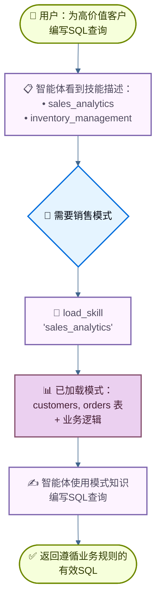

import ChatModelTabsPy from '/snippets/chat-model-tabs.mdx';
import ChatModelTabsJs from '/snippets/chat-model-tabs-js.mdx';

本教程展示如何使用**渐进式披露**——一种上下文管理技术，智能体按需加载信息而非预先加载——来实现**技能**（基于提示的专门指令）。智能体通过工具调用加载技能，而非动态更改系统提示，仅发现并加载每个任务所需的技能。

**用例：** 想象构建一个智能体，帮助在大型企业的不同业务垂直领域编写SQL查询。您的组织可能为每个垂直领域设有独立的数据存储，或是一个包含数千张表的单一整体数据库。无论哪种情况，预先加载所有模式都会使上下文窗口不堪重负。渐进式披露通过仅在需要时加载相关模式来解决此问题。这种架构还允许不同的产品负责人和利益相关者独立贡献和维护其特定业务垂直领域的技能。

**您将构建什么：** 一个具备两个技能（销售分析和库存管理）的SQL查询助手。智能体在其系统提示中看到轻量级的技能描述，然后仅在与用户查询相关时，通过工具调用加载完整的数据库模式和业务逻辑。

<Note>
有关具备查询执行、错误纠正和验证功能的完整SQL智能体示例，请参阅我们的[SQL智能体教程](/oss/javascript/langchain/sql-agent)。本教程重点介绍渐进式披露模式，该模式可应用于任何领域。
</Note>

<Tip>
渐进式披露由Anthropic推广，是一种构建可扩展智能体技能系统的技术。该方法使用三级架构（元数据 → 核心内容 → 详细资源），智能体仅按需加载信息。有关此技术的更多信息，请参阅[使用Agent Skills为现实世界装备智能体](https://www.anthropic.com/engineering/equipping-agents-for-the-real-world-with-agent-skills)。
</Tip>

## 工作原理

以下是用户请求SQL查询时的流程：


```mermaid
%%{init: {'theme':'base', 'themeVariables': { 'primaryColor':'#E5F4FF','primaryTextColor':'#030710','primaryBorderColor':'#006DDD','lineColor':'#40668D','secondaryColor':'#F6FFDB','tertiaryColor':'#FDF3FF','tertiaryBorderColor':'#7E65AE','tertiaryTextColor':'#504B5F'}}}%%
flowchart TD
    Start([💬 用户：为高价值客户<br/>编写SQL查询]) --> SystemPrompt[📋 智能体看到技能描述：<br/>• sales_analytics<br/>• inventory_management]

    SystemPrompt --> Decide{🤔 需要销售模式}

    Decide --> LoadSkill[🔧 load_skill<br/>'sales_analytics']

    LoadSkill --> Schema[📊 已加载模式：<br/>customers, orders 表<br/>+ 业务逻辑]

    Schema --> WriteQuery[✍️ 智能体使用模式知识<br/>编写SQL查询]

    WriteQuery --> Response([✅ 返回遵循业务规则的<br/>有效SQL])

    %% 用于浅色和深色模式的样式
    classDef startEnd fill:#F6FFDB,stroke:#6E8900,stroke-width:2px,color:#2E3900
    classDef process fill:#FDF3FF,stroke:#7E65AE,stroke-width:2px,color:#504B5F
    classDef decision fill:#E5F4FF,stroke:#006DDD,stroke-width:2px,color:#030710
    classDef enrichment fill:#EBD0F0,stroke:#885270,stroke-width:2px,color:#441E33

    class Start,Response startEnd
    class SystemPrompt,LoadSkill,WriteQuery process
    class Decide decision
    class Schema enrichment
```

**为什么使用渐进式披露：**
- **减少上下文使用** - 仅加载任务所需的2-3个技能，而非所有可用技能
- **实现团队自主性** - 不同团队可以独立开发专门技能（类似于其他多智能体架构）
- **高效扩展** - 添加数十或数百个技能而不会使上下文不堪重负
- **简化对话历史** - 单个智能体，单一对话线程

**什么是技能：** 技能，如Claude Code所推广的，主要是基于提示的：针对特定业务任务的自包含专门指令单元。在Claude Code中，技能以文件系统上的目录和文件形式暴露，通过文件操作发现。技能通过提示指导行为，并可提供有关工具使用的信息，或包含供编码智能体执行的示例代码。

<Tip>
具备渐进式披露的技能可视为一种[RAG（检索增强生成）](/oss/javascript/langchain/rag)形式，其中每个技能都是一个检索单元——尽管不一定由嵌入或关键词搜索支持，而是由浏览内容的工具支持（如文件操作，或在本教程中，直接查找）。
</Tip>

**权衡：**
- **延迟**：按需加载技能需要额外的工具调用，这会增加每个技能首次请求的延迟
- **工作流控制**：基本实现依赖提示来指导技能使用 - 无法在没有自定义逻辑的情况下强制执行硬约束，如“始终先尝试技能A再尝试技能B”

<Tip>
**实现您自己的技能系统**

构建自己的技能实现时（如本教程所示），核心概念是渐进式披露 - 按需加载信息。除此之外，您在实现上拥有完全的灵活性：

- **存储**：数据库、S3、内存数据结构或任何后端
- **发现**：直接查找（本教程）、大型技能集合的RAG、文件系统扫描或API调用
- **加载逻辑**：自定义延迟特性，并添加逻辑以搜索技能内容或对相关性进行排序
- **副作用**：定义技能加载时发生的情况，例如暴露与该技能关联的工具（在第8节中介绍）

这种灵活性使您可以针对性能、存储和工作流控制的特定要求进行优化。
</Tip>

## 设置

### 安装

本教程需要 `langchain` 包：

<CodeGroup>
```bash npm
npm install langchain
```
```bash yarn
yarn add langchain
```
```bash pnpm
pnpm add langchain
```
</CodeGroup>

更多详情，请参阅我们的[安装指南](/oss/javascript/langchain/install)。

### LangSmith

设置 [LangSmith](https://smith.langchain.com) 以检查智能体内部发生的情况。然后设置以下环境变量：

<CodeGroup>
```bash bash
export LANGSMITH_TRACING="true"
export LANGSMITH_API_KEY="..."
```
```typescript typescript
process.env.LANGSMITH_TRACING = "true";
process.env.LANGSMITH_API_KEY = "...";
```
</CodeGroup>

### 选择LLM

从LangChain的集成套件中选择一个聊天模型：

<ChatModelTabsJs />

## 1. 定义技能

首先，定义技能的结构。每个技能都有一个名称、一个简短描述（显示在系统提示中）和完整内容（按需加载）：

```typescript
import { z } from "zod";

// 可以渐进式披露给智能体的技能
const SkillSchema = z.object({  // [!code highlight]
  name: z.string(),  // 技能的唯一标识符
  description: z.string(),  // 显示在系统提示中的1-2句描述
  content: z.string(),  // 包含详细说明的完整技能内容
});

type Skill = z.infer<typeof SkillSchema>;
```

现在为SQL查询助手定义示例技能。这些技能设计为**描述轻量级**（预先显示给智能体）但**内容详细**（仅在需要时加载）：

<Accordion title="查看完整技能定义">

```typescript
import { context } from "langchain";

const SKILLS: Skill[] = [
  {
    name: "sales_analytics",
    description:
      "用于销售数据分析的数据库模式和业务逻辑，包括客户、订单和收入。",
    content: context`
    # 销售分析模式

    ## 表

    ### customers
    - customer_id (主键)
    - name
    - email
    - signup_date
    - status (active/inactive)
    - customer_tier (bronze/silver/gold/platinum)

    ### orders
    - order_id (主键)
    - customer_id (外键 -> customers)
    - order_date
    - status (pending/completed/cancelled/refunded)
    - total_amount
    - sales_region (north/south/east/west)

    ### order_items
    - item_id (主键)
    - order_id (外键 -> orders)
    - product_id
    - quantity
    - unit_price
    - discount_percent

    ## 业务逻辑

    **活跃客户**：
    status = 'active' AND signup_date <= CURRENT_DATE - INTERVAL '90 days'

    **收入计算**：
    仅计算状态为 'completed' 的订单。
    使用orders表中的total_amount，该字段已考虑折扣。

    **客户生命周期价值 (CLV)**：
    客户所有已完成订单金额的总和。

    **高价值订单**：
    total_amount > 1000 的订单

    ## 示例查询

    -- 获取上个季度收入前10的客户
    SELECT
        c.customer_id,
        c.name,
        c.customer_tier,
        SUM(o.total_amount) as total_revenue
    FROM customers c
    JOIN orders o ON c.customer_id = o.customer_id
    WHERE o.status = 'completed'
    AND o.order_date >= CURRENT_DATE - INTERVAL '3 months'
    GROUP BY c.customer_id, c.name, c.customer_tier
    ORDER BY total_revenue DESC
    LIMIT 10;`,
  },
  {
    name: "inventory_management",
    description:
      "用于库存跟踪的数据库模式和业务逻辑，包括产品、仓库和库存水平。",
    content: context`
    # 库存管理模式

    ## 表

    ### products
    - product_id (主键)
    - product_name
    - sku
    - category
    - unit_cost
    - reorder_point (重新订购前的最低库存水平)
    - discontinued (布尔值)

    ### warehouses
    - warehouse_id (主键)
    - warehouse_name
    - location
    - capacity

    ### inventory
    - inventory_id (主键)
    - product_id (外键 -> products)
    - warehouse_id (外键 -> warehouses)
    - quantity_on_hand
    - last_updated

    ### stock_movements
    - movement_id (主键)
    - product_id (外键 -> products)
    - warehouse_id (外键 -> warehouses)
    - movement_type (inbound/outbound/transfer/adjustment)
    - quantity (入库为正，出库为负)
    - movement_date
    - reference_number

    ## 业务逻辑

    **可用库存**：
    inventory表中 quantity_on_hand > 0 的 quantity_on_hand

    **需要重新订购的产品**：
    所有仓库中 quantity_on_hand 总和小于或等于产品 reorder_point 的产品

    **仅活跃产品**：
    除非专门分析已停产产品，否则排除 discontinued = true 的产品

    **库存估值**：
    每个产品的 quantity_on_hand * unit_cost

    ## 示例查询

    -- 查找所有仓库中低于重新订购点的产品
    SELECT
        p.product_id,
        p.product_name,
        p.reorder_point,
        SUM(i.quantity_on_hand) as total_stock,
        p.unit_cost,
        (p.reorder_point - SUM(i.quantity_on_hand)) as units_to_reorder
    FROM products p
    JOIN inventory i ON p.product_id = i.product_id
    WHERE p.discontinued = false
    GROUP BY p.product_id, p.product_name, p.reorder_point, p.unit_cost
    HAVING SUM(i.quantity_on_hand) <= p.reorder_point
    ORDER BY units_to_reorder DESC;`,
  },
];
```

</Accordion>

## 2. 创建技能加载工具

创建一个工具，用于按需加载完整的技能内容：

```typescript
import { tool } from "langchain";
import { z } from "zod";

const loadSkill = tool(  // [!code highlight]
  async ({ skillName }) => {
    // 查找并返回请求的技能
    const skill = SKILLS.find((s) => s.name === skillName);
    if (skill) {
      return `已加载技能: ${skillName}\n\n${skill.content}`;  // [!code highlight]
    }

    // 未找到技能
    const available = SKILLS.map((s) => s.name).join(", ");
    return `未找到技能 '${skillName}'。可用技能: ${available}`;
  },
  {
    name: "load_skill",
    description: `将技能的完整内容加载到智能体的上下文中。

当您需要关于如何处理特定类型请求的详细信息时使用此工具。
这将为您提供该技能领域的全面说明、策略和指南。`,
    schema: z.object({
      skillName: z.string().describe("要加载的技能名称"),
    }),
  }
);
```

`load_skill` 工具将完整的技能内容作为字符串返回，该字符串成为对话的一部分（作为ToolMessage）。有关创建和使用工具的更多详情，请参阅[工具指南](/oss/javascript/langchain/tools)。

## 3. 构建技能中间件

创建自定义中间件，将技能描述注入系统提示。此中间件使技能可被发现，而无需预先加载其完整内容。

<Note>
本指南演示了如何创建自定义中间件。有关中间件概念和模式的全面指南，请参阅[自定义中间件文档](/oss/javascript/langchain/middleware/custom)。
</Note>

```typescript
import { createMiddleware } from "langchain";

// 从SKILLS列表构建技能提示
const skillsPrompt = SKILLS.map(
  (skill) => `- **${skill.name}**: ${skill.description}`
).join("\n");

const skillMiddleware = createMiddleware({  // [!code highlight]
  name: "skillMiddleware",
  tools: [loadSkill],  // [!code highlight]
  wrapModelCall: async (request, handler) => {
    // 构建技能附录
    const skillsAddendum =  // [!code highlight]
      `\n\n## 可用技能\n\n${skillsPrompt}\n\n` +  // [!code highlight]
      "当您需要关于处理特定类型请求的详细信息时，" +  // [!code highlight]
      "请使用 load_skill 工具。";  // [!code highlight]

    // 追加到系统提示
    const newSystemPrompt = request.systemPrompt + skillsAddendum;

    return handler({
      ...request,
      systemPrompt: newSystemPrompt,
    });
  },
});
```

中间件将技能描述追加到系统提示，使智能体能够感知可用技能，而无需加载其完整内容。`load_skill` 工具注册为类变量，使其可供智能体使用。

<Note>
**生产环境考虑**：本教程为简单起见在 `__init__` 中加载技能列表。在生产系统中，您可能希望在 `before_agent` 钩子中加载技能，以便定期刷新以反映最新更改（例如，添加新技能或修改现有技能时）。详情请参阅[before_agent钩子文档](/oss/javascript/langchain/middleware/custom#node-style-hooks)。
</Note>

## 4. 创建支持技能的智能体

现在创建具备技能中间件和用于状态持久化的检查点的智能体：

```typescript
import { createAgent } from "langchain";
import { MemorySaver } from "@langchain/langgraph";

// 创建支持技能的智能体
const agent = createAgent({
  model,
  systemPrompt:
    "您是一个SQL查询助手，帮助用户" +
    "针对业务数据库编写查询。",
  middleware: [skillMiddleware],  // [!code highlight]
  checkpointer: new MemorySaver(),
});
```

智能体现在可以在其系统提示中访问技能描述，并可以在需要时调用 `load_skill` 来检索完整的技能内容。检查点维护跨轮次的对话历史。

## 5. 测试渐进式披露

使用需要特定技能知识的问题测试智能体：

```typescript
import { v4 as uuidv4 } from "uuid";

// 此对话线程的配置
const threadId = uuidv4();
const config = { configurable: { thread_id: threadId } };

// 请求SQL查询
const result = await agent.invoke(  // [!code highlight]
  {
    messages: [
      {
        role: "user",
        content:
          "编写一个SQL查询，查找上个月所有订单金额超过1000美元的客户",
      },
    ],
  },
  config
);

// 打印对话
for (const message of result.messages) {
  console.log(`${message._getType()}: ${message.content}`);
}
```

预期输出：

```
================================ Human Message =================================

编写一个SQL查询，查找上个月所有订单金额超过1000美元的客户
================================== Ai Message ==================================
Tool Calls:
  load_skill (call_abc123)
 Call ID: call_abc123
  Args:
    skill_name: sales_analytics
================================= Tool Message =================================
Name: load_skill

已加载技能: sales_analytics

# 销售分析模式

## 表

### customers
- customer_id (主键)
- name
- email
- signup_date
- status (active/inactive)
- customer_tier (bronze/silver/gold/platinum)

### orders
- order_id (主键)
- customer_id (外键 -> customers)
- order_date
- status (pending/completed/cancelled/refunded)
- total_amount
- sales_region (north/south/east/west)

[... 模式其余部分 ...]

## 业务逻辑

**高价值订单**：`total_amount > 1000` 的订单
**收入计算**：仅计算 `status = 'completed'` 的订单

================================== Ai Message ==================================

这是一个SQL查询，用于查找上个月所有订单金额超过1000美元的客户：

\`\`\`sql
SELECT DISTINCT
    c.customer_id,
    c.name,
    c.email,
    c.customer_tier
FROM customers c
JOIN orders o ON c.customer_id = o.customer_id
WHERE o.total_amount > 1000
  AND o.status = 'completed'
  AND o.order_date >= CURRENT_DATE - INTERVAL '1 month'
ORDER BY c.customer_id;
\`\`\`

此查询：
- 将客户与其订单连接
- 使用 total_amount 字段筛选高价值订单（>$1000）
- 仅包含已完成的订单（根据业务逻辑）
- 限制为上个月的订单
- 返回不同的客户，以避免如果他们下了多个符合条件的订单时出现重复
```

智能体在其系统提示中看到了轻量级的技能描述，识别出该问题需要销售数据库知识，调用 `load_skill("sales_analytics")` 获取完整的模式和业务逻辑，然后使用该信息编写了一个遵循数据库规范的正确查询。

## 6. 高级：使用自定义状态添加约束

<Accordion title="可选：跟踪已加载的技能并强制工具约束">

您可以添加约束，以确保某些工具仅在特定技能加载后才可用。这需要跟踪自定义智能体状态中已加载的技能。

### 定义自定义状态

首先，扩展智能体状态以跟踪已加载的技能：

```typescript
import { StateSchema } from "@langchain/langgraph";
import { z } from "zod";

const CustomState = new StateSchema({
  skillsLoaded: z.array(z.string()).optional(),  // 跟踪已加载的技能  // [!code highlight]
});
```

### 更新 load_skill 以修改状态

修改 `load_skill` 工具，以便在技能加载时更新状态：

```typescript
import { tool, ToolMessage, type ToolRuntime } from "langchain";
import { Command } from "@langchain/langgraph";  // [!code highlight]
import { z } from "zod";

const loadSkill = tool(  // [!code highlight]
  async ({ skillName }, runtime: ToolRuntime<typeof CustomState.State>) => {
    // 查找并返回请求的技能
    const skill = SKILLS.find((s) => s.name === skillName);

    if (skill) {
      const skillContent = `已加载技能: ${skillName}\n\n${skill.content}`;

      // 更新状态以跟踪已加载的技能
      return new Command({  // [!code highlight]
        update: {  // [!code highlight]
          messages: [  // [!code highlight]
            new ToolMessage({  // [!code highlight]
              content: skillContent,  // [!code highlight]
              tool_call_id: runtime.toolCallId,  // [!code highlight]
            }),  // [!code highlight]
          ],  // [!code highlight]
          skillsLoaded: [skillName],  // [!code highlight]
        },  // [!code highlight]
      });  // [!code highlight]
    }

    // 未找到技能
    const available = SKILLS.map((s) => s.name).join(", ");
    return new Command({
      update: {
        messages: [
          new ToolMessage({
            content: `未找到技能 '${skillName}'。可用技能: ${available}`,
            tool_call_id: runtime.toolCallId,
          }),
        ],
      },
    });
  },
  {
    name: "load_skill",
    description: `将技能的完整内容加载到智能体的上下文中。`,
    schema: z.object({
      skillName: z.string().describe("要加载的技能名称"),
    }),
  }
);
```

### 创建受约束的工具

创建一个仅在特定技能加载后才可用的工具：

```typescript
const writeSqlQuery = tool(  // [!code highlight]
  async ({ query, vertical }, runtime: ToolRuntime<typeof CustomState.State>) => {
    // 检查是否已加载所需的技能
    const skillsLoaded = runtime.state.skillsLoaded ?? [];  // [!code highlight]

    if (!skillsLoaded.includes(vertical)) {  // [!code highlight]
      return (  // [!code highlight]
        `错误：您必须先加载 '${vertical}' 技能，` +  // [!code highlight]
        `才能理解数据库模式，然后才能编写查询。` +  // [!code highlight]
        `使用 load_skill('${vertical}') 加载模式。`  // [!code highlight]
      );  // [!code highlight]
    }

    // 验证并格式化查询
    return (
      `${vertical} 的SQL查询：\n\n` +
      `\`\`\`sql\n${query}\n\`\`\`\n\n` +
      `✓ 查询已根据 ${vertical} 模式验证\n` +
      `准备在数据库上执行。`
    );
  },
  {
    name: "write_sql_query",
    description: `为特定业务垂直领域编写和验证SQL查询。

此工具有助于格式化和验证SQL查询。您必须先加载相应的技能，
才能理解数据库模式。`,
    schema: z.object({
      query: z.string().describe("要编写的SQL查询"),
      vertical: z.string().describe("业务垂直领域（sales_analytics 或 inventory_management）"),
    }),
  }
);
```

### 更新中间件和智能体

更新中间件以使用自定义状态模式：

```typescript
const skillMiddleware = createMiddleware({  // [!code highlight]
  name: "skillMiddleware",
  stateSchema: CustomState,  // [!code highlight]
  tools: [loadSkill, writeSqlQuery],  // [!code highlight]
  // ... 中间件实现的其余部分保持不变
});
```

创建注册了受约束工具的智能体：

```typescript
const agent = createAgent({
  model,
  systemPrompt:
    "您是一个SQL查询助手，帮助用户" +
    "针对业务数据库编写查询。",
  middleware: [skillMiddleware],  // [!code highlight]
  checkpointer: new MemorySaver(),
});
```

现在，如果智能体在加载所需技能之前尝试使用 `write_sql_query`，它将收到一条错误消息，提示它先加载相应的技能（例如 `sales_analytics` 或 `inventory_management`）。这确保了智能体在尝试验证查询之前具备必要的模式知识。

</Accordion>

## 完整示例

<Accordion title="查看完整可运行脚本">

以下是结合本教程所有部分的完整、可运行的实现：

```typescript
import {
  tool,
  createAgent,
  createMiddleware,
  ToolMessage,
  context,
  type ToolRuntime,
} from "langchain";
import { MemorySaver, Command } from "@langchain/langgraph";
import { ChatOpenAI } from "@langchain/openai";
import { v4 as uuidv4 } from "uuid";
import { z } from "zod";

// 可以渐进式披露给智能体的技能
const SkillSchema = z.object({
  name: z.string(), // 技能的唯一标识符
  description: z.string(), // 显示在系统提示中的1-2句描述
  content: z.string(), // 包含详细说明的完整技能内容
});

type Skill = z.infer<typeof SkillSchema>;

const SKILLS: Skill[] = [
  {
    name: "sales_analytics",
    description:
      "用于销售数据分析的数据库模式和业务逻辑，包括客户、订单和收入。",
    content: context`
    # 销售分析模式

    ## 表

    ### customers
    - customer_id (主键)
    - name
    - email
    - signup_date
    - status (active/inactive)
    - customer_tier (bronze/silver/gold/platinum)

    ### orders
    - order_id (主键)
    - customer_id (外键 -> customers)
    - order_date
    - status (pending/completed/cancelled/refunded)
    - total_amount
    - sales_region (north/south/east/west)

    ### order_items
    - item_id (主键)
    - order_id (外键 -> orders)
    - product_id
    - quantity
    - unit_price
    - discount_percent

    ## 业务逻辑

    **活跃客户**：status = 'active' AND signup_date <= CURRENT_DATE - INTERVAL '90 days'

    **收入计算**：
    仅计算状态为 'completed' 的订单。使用orders表中的total_amount，
    该字段已考虑折扣。

    **客户生命周期价值 (CLV)**：
    客户所有已完成订单金额的总和。

    **高价值订单**：
    total_amount > 1000 的订单

    ## 示例查询
    -- 获取上个季度收入前10的客户
    SELECT
        c.customer_id,
        c.name,
        c.customer_tier,
        SUM(o.total_amount) as total_revenue
    FROM customers c
    JOIN orders o ON c.customer_id = o.customer_id
    WHERE o.status = 'completed'
    AND o.order_date >= CURRENT_DATE - INTERVAL '3 months'
    GROUP BY c.customer_id, c.name, c.customer_tier
    ORDER BY total_revenue DESC
    LIMIT 10;`,
  },
  {
    name: "inventory_management",
    description:
      "用于库存跟踪的数据库模式和业务逻辑，包括产品、仓库和库存水平。",
    content: context`
    # 库存管理模式

    ## 表

    ### products
    - product_id (主键)
    - product_name
    - sku
    - category
    - unit_cost
    - reorder_point (重新订购前的最低库存水平)
    - discontinued (布尔值)

    ### warehouses
    - warehouse_id (主键)
    - warehouse_name
    - location
    - capacity

    ### inventory
    - inventory_id (主键)
    - product_id (外键 -> products)
    - warehouse_id (外键 -> warehouses)
    - quantity_on_hand
    - last_updated

    ### stock_movements
    - movement_id (主键)
    - product_id (外键 -> products)
    - warehouse_id (外键 -> warehouses)
    - movement_type (inbound/outbound/transfer/adjustment)
    - quantity (入库为正，出库为负)
    - movement_date
    - reference_number

    ## 业务逻辑

    **可用库存**：
    inventory表中 quantity_on_hand > 0 的 quantity_on_hand

    **需要重新订购的产品**：
    所有仓库中 quantity_on_hand 总和小于或等于产品 reorder_point 的产品

    **仅活跃产品**：
    除非专门分析已停产产品，否则排除 discontinued = true 的产品

    **库存估值**：
    每个产品的 quantity_on_hand * unit_cost

    ## 示例查询

    -- 查找所有仓库中低于重新订购点的产品
    SELECT
        p.product_id,
        p.product_name,
        p.reorder_point,
        SUM(i.quantity_on_hand) as total_stock,
        p.unit_cost,
        (p.reorder_point - SUM(i.quantity_on_hand)) as units_to_reorder
    FROM products p
    JOIN inventory i ON p.product_id = i.product_id
    WHERE p.discontinued = false
    GROUP BY p.product_id, p.product_name, p.reorder_point, p.unit_cost
    HAVING SUM(i.quantity_on_hand) <= p.reorder_point
    ORDER BY units_to_reorder DESC;`,
  },
];

// const loadSkill = tool(
//   async ({ skillName }) => {
//     // 查找并返回请求的技能
//     const skill = SKILLS.find((s) => s.name === skillName);
//     if (skill) {
//       return `已加载技能: ${skillName}\n\n${skill.content}`;
//     }

//     // 未找到技能
//     const available = SKILLS.map((s) => s.name).join(", ");
//     return `未找到技能 '${skillName}'。可用技能: ${available}`;
//   },
//   {
//     name: "load_skill",
//     description: `将技能的完整内容加载到智能体的上下文中。

// 当您需要关于如何处理特定类型请求的详细信息时使用此工具。
// 这将为您提供该技能领域的全面说明、策略和指南。`,
//     schema: z.object({
//       skillName: z.string().describe("要加载的技能名称"),
//     }),
//   }
// );

// 从SKILLS列表构建技能提示
const skillsPrompt = SKILLS.map(
  (skill) => `- **${skill.name}**: ${skill.description}`
).join("\n");

const skillMiddleware = createMiddleware({
  name: "skillMiddleware",
  tools: [loadSkill],
  wrapModelCall: async (request, handler) => {
    // 构建技能附录
    const skillsAddendum =
      `\n\n## 可用技能\n\n${skillsPrompt}\n\n` +
      "当您需要关于处理特定类型请求的详细信息时，" +
      "请使用 load_skill 工具。";

    // 追加到系统提示
    const newSystemPrompt = request.systemPrompt + skillsAddendum;

    return handler({
      ...request,
      systemPrompt: newSystemPrompt,
    });
  },
});

const model = new ChatOpenAI({
  model: "gpt-5.4-mini",
  temperature: 0,
});

// 创建支持技能的智能体
const agent = createAgent({
  model,
  systemPrompt:
    "您是一个SQL查询助手，帮助用户" +
    "针对业务数据库编写查询。",
  middleware: [skillMiddleware],
  checkpointer: new MemorySaver(),
});

// 此对话线程的配置
const threadId = uuidv4();
const config = { configurable: { thread_id: threadId } };

// 请求SQL查询
const result = await agent.invoke(
  {
    messages: [
      {
        role: "user",
        content:
          "编写一个SQL查询，查找上个月所有订单金额超过1000美元的客户",
      },
    ],
  },
  config
);

// 打印对话
for (const message of result.messages) {
  console.log(`${message.type}: ${message.content}`);
}
```

此完整示例包括：
- 包含完整数据库模式的技能定义
- 用于按需加载的 `load_skill` 工具
- 将技能描述注入系统提示的 `SkillMiddleware`
- 使用中间件和检查点创建智能体
- 展示智能体如何加载技能和编写SQL查询的示例用法

要运行此示例，您需要：
1. 安装所需包：`pip install langchain langchain-openai langgraph`
2. 设置您的API密钥（例如，`export OPENAI_API_KEY=...`）
3. 将模型初始化替换为您首选的LLM提供商

</Accordion>

## 实现变体

<Accordion title="查看实现选项和权衡">

本教程将技能实现为通过工具调用加载的内存Python字典。但是，有几种方法可以使用技能实现渐进式披露：

**存储后端：**
- **内存**（本教程）：技能定义为Python数据结构，访问速度快，无I/O开销
- **文件系统**（Claude Code方法）：技能作为目录和文件，通过 `read_file` 等文件操作发现
- **远程存储**：技能存储在S3、数据库、Notion或API中，按需获取

**技能发现**（智能体如何了解存在哪些技能）：
- **系统提示列表**：系统提示中的技能描述（本教程使用）
- **基于文件**：通过扫描目录发现技能（Claude Code方法）
- **基于注册表**：查询技能注册服务或API以获取可用技能
- **动态查找**：通过工具调用列出可用技能

**渐进式披露策略**（如何加载技能内容）：
- **单次加载**：在一次工具调用中加载整个技能内容（本教程使用）
- **分页**：对于大型技能，分多个页面/块加载技能内容
- **基于搜索**：在特定技能内容中搜索相关部分（例如，使用grep/read操作技能文件）
- **分层**：首先加载技能概览，然后深入特定子部分

**大小考虑**（未校准的心理模型 - 根据您的系统优化）：
- **小型技能**（< 1K tokens / ~750词）：可以直接包含在系统提示中，并通过提示缓存进行缓存以节省成本并加快响应速度
- **中型技能**（1-10K tokens / ~750-7.5K词）：受益于按需加载以避免上下文开销（本教程）
- **大型技能**（> 10K tokens / ~7.5K词，或 > 上下文窗口的5-10%）：应使用渐进式披露技术，如分页、基于搜索的加载或分层探索，以避免消耗过多上下文

选择取决于您的要求：内存最快，但需要重新部署才能更新技能，而基于文件或远程存储支持动态技能管理，无需更改代码。

</Accordion>

## 渐进式披露与上下文工程

<Accordion title="结合少样本提示和其他技术">

渐进式披露从根本上说是一种**[上下文工程](/oss/javascript/langchain/context-engineering)技术** - 您正在管理哪些信息可供智能体使用以及何时使用。本教程重点介绍加载数据库模式，但相同的原则适用于其他类型的上下文。

### 结合少样本提示

对于SQL查询用例，您可以扩展渐进式披露以动态加载与用户查询匹配的**少样本示例**：

**示例方法：**
1. 用户询问：“查找6个月未下单的客户”
2. 智能体加载 `sales_analytics` 模式（如本教程所示）
3. 智能体还加载2-3个相关示例查询（通过语义搜索或基于标签的查找）：
   - 查找不活跃客户的查询
   - 带有基于日期过滤的查询
   - 连接客户和订单表的查询
4. 智能体使用模式知识和示例模式编写查询

这种渐进式披露（按需加载模式）和动态少样本提示（加载相关示例）的结合，创建了一种强大的上下文工程模式，可扩展到大型知识库，同时提供高质量、有依据的输出。

</Accordion>

## 后续步骤

- 了解[中间件](/oss/javascript/langchain/middleware)以实现更动态的智能体行为
- 探索[上下文工程](/oss/javascript/langchain/context-engineering)技术以管理智能体上下文
- 探索[交接模式](/oss/javascript/langchain/multi-agent/handoffs-customer-support)用于顺序工作流
- 阅读[子智能体模式](/oss/javascript/langchain/multi-agent/subagents-personal-assistant)用于并行任务路由
- 查看[多智能体模式](/oss/javascript/langchain/multi-agent)了解其他专门智能体方法
- 使用 [LangSmith](https://smith.langchain.com) 调试和监控技能加载

---

<div className="source-links">
<Callout icon="terminal-2">
    [将这些文档连接](/use-these-docs)到Claude、VSCode等，通过MCP获取实时答案。
</Callout>
<Callout icon="edit">
    [在GitHub上编辑此页面](https://github.com/langchain-ai/docs/edit/main/src/oss/langchain/multi-agent/skills-sql-assistant.mdx)或[提交问题](https://github.com/langchain-ai/docs/issues/new/choose)。
</Callout>
</div>