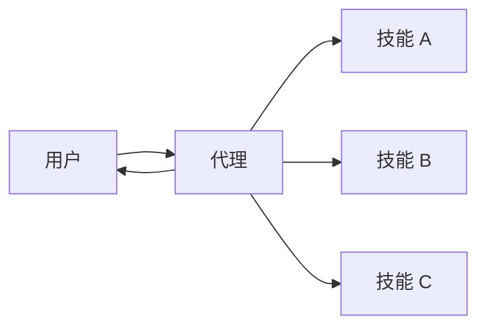

在**技能**架构中，专门的能力被打包为可调用的“技能”，以增强[代理](/oss/javascript/langchain/agents)的行为。技能主要是代理可以按需调用的提示驱动的专业化。
有关内置技能支持，请参阅 [Deep Agents](/oss/javascript/deepagents/skills)。

<Tip>
此模式在概念上与 [Agent Skills](https://agentskills.io/) 和 [llms.txt](https://llmstxt.org/)（由 Jeremy Howard 引入）相同，后者使用工具调用来渐进式披露文档。技能模式将渐进式披露应用于专门的提示和领域知识，而不仅仅是文档页面。
</Tip>



## 主要特征

* 提示驱动的专业化：技能主要由专门的提示定义
* 渐进式披露：技能根据上下文或用户需求变得可用
* 团队分发：不同的团队可以独立开发和维护技能
* 轻量级组合：技能比完整的子代理更简单
* 引用感知：技能可以引用脚本、模板和其他资源

## 何时使用

当您想要一个具有许多可能专业化的单一[代理](/oss/javascript/langchain/agents)，不需要在技能之间强制特定约束，或者不同的团队需要独立开发能力时，请使用技能模式。常见示例包括编码助手（不同语言或任务的技能）、知识库（不同领域的技能）和创意助手（不同格式的技能）。

## 基本实现


```typescript
import { tool, createAgent } from "langchain";
import * as z from "zod";

const loadSkill = tool(
  async ({ skillName }) => {
    // 从文件/数据库加载技能内容
    return "";
  },
  {
    name: "load_skill",
    description: `加载专门的技能。

可用技能：
- write_sql: SQL 查询编写专家
- review_legal_doc: 法律文档审查员

返回技能的提示和上下文。`,
    schema: z.object({
      skillName: z
        .string()
        .describe("要加载的技能名称")
    })
  }
);

const agent = createAgent({
  model: "gpt-4.1",
  tools: [loadSkill],
  systemPrompt: (
    "你是一个乐于助人的助手。" +
    "你可以访问两个技能：" +
    "write_sql 和 review_legal_doc。" +
    "使用 load_skill 访问它们。"
  ),
});
```


有关完整实现，请参阅下面的教程。

<Card
    title="教程：构建带按需技能的 SQL 助手"
    icon="wand"
    href="/oss/javascript/langchain/multi-agent/skills-sql-assistant"
    arrow cta="了解更多"
>
    了解如何通过渐进式披露实现技能，其中代理按需加载专门的提示和架构，而不是预先加载。
</Card>

## 扩展模式

编写自定义实现时，可以通过多种方式扩展基本技能模式：

- **动态工具注册**：将渐进式披露与状态管理结合，以便在加载技能时注册新[工具](/oss/javascript/langchain/tools)。例如，加载“database_admin”技能既可以添加专门的上下文，也可以注册特定于数据库的工具（备份、恢复、迁移）。这使用了跨多代理模式使用的相同工具和状态机制——工具更新状态以动态更改代理能力。

- **分层技能**：技能可以在树结构中定义其他技能，从而创建嵌套的专业化。例如，加载“data_science”技能可能会使“pandas_expert”、“visualization”和“statistical_analysis”等子技能可用。每个子技能都可以根据需要独立加载，从而允许对领域知识进行细粒度的渐进式披露。这种分层方法通过将能力组织成可以按需发现和加载的逻辑组，有助于管理大型知识库。

- **引用感知**：虽然每个技能只有一个提示，但此提示可以引用其他资产的位置，并提供有关代理何时应使用这些资产的信息。
当这些资产变得相关时，代理将知道这些文件存在，并根据需要将它们读入内存以完成任务。
这也遵循渐进式披露模式，并限制上下文窗口中的信息。

---

<div className="source-links">
<Callout icon="edit">
    [在 GitHub 上编辑此页面](https://github.com/langchain-ai/docs/edit/main/src/oss/langchain/multi-agent/skills.mdx) 或 [提交问题](https://github.com/langchain-ai/docs/issues/new/choose).
</Callout>
<Callout icon="terminal-2">
    [通过 MCP 将这些文档连接](/use-these-docs) 到 Claude、VSCode 等，以获取实时答案。
</Callout>
</div>
