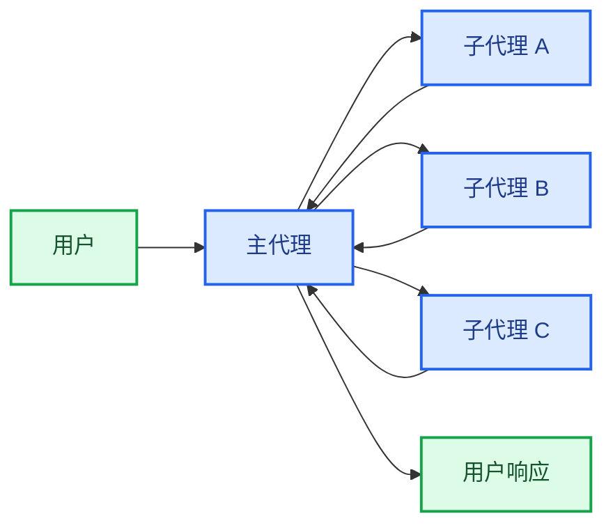
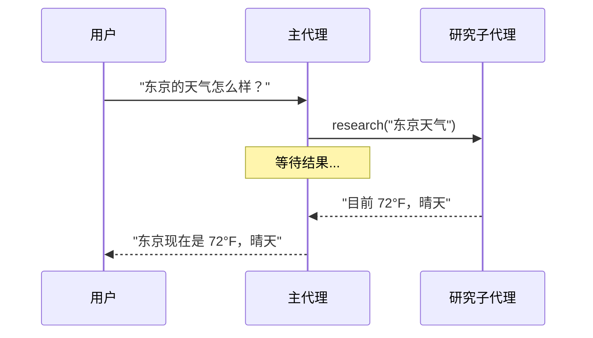
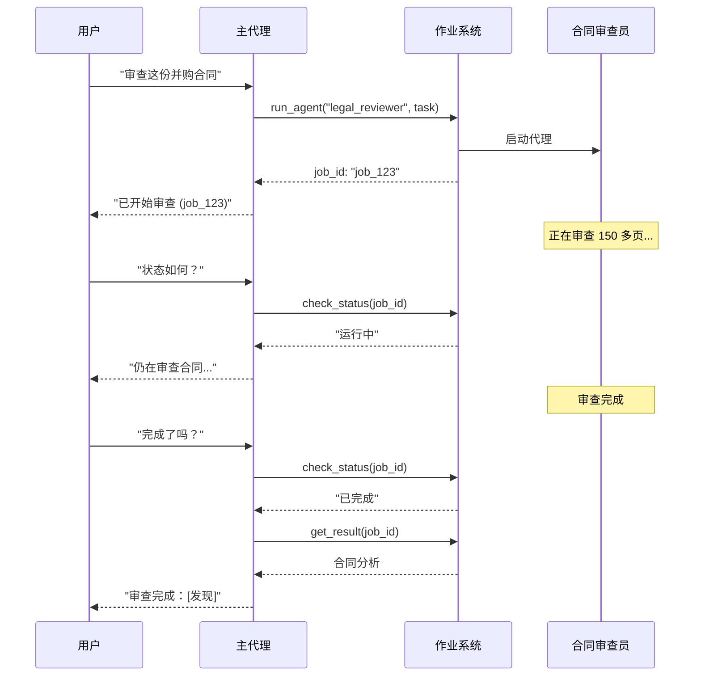
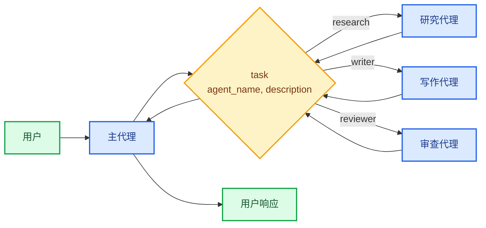

在**子代理**架构中，一个中央主[代理](/oss/javascript/langchain/agents)（通常称为**监督者**）通过将子代理作为[工具](/oss/javascript/langchain/tools)调用来协调它们。主代理决定调用哪个子代理、提供什么输入以及如何组合结果。子代理是无状态的——它们不记住过去的交互，所有对话记忆都由主代理维护。这提供了[上下文](/oss/javascript/langchain/context-engineering)隔离：每个子代理调用都在干净的上下文窗口中工作，防止主对话中上下文膨胀。



## 关键特性

*   **集中控制**：所有路由都通过主代理
*   **无直接用户交互**：子代理将结果返回给主代理，而不是用户（尽管您可以在子代理中使用[中断](/oss/javascript/langgraph/interrupts#pause-using-interrupt)来允许用户交互）
*   **通过工具调用子代理**：子代理通过工具调用
*   **并行执行**：主代理可以在单次交互中调用多个子代理

<Note>
**监督者 vs. 路由器**：监督者代理（此模式）与[路由器](/oss/javascript/langchain/multi-agent/router)不同。监督者是一个完整的代理，维护对话上下文并动态决定在多个回合中调用哪些子代理。路由器通常是一个单一的分类步骤，将任务分派给代理，而不维护持续的对话状态。
</Note>

## 何时使用

当您有多个不同的领域（例如，日历、电子邮件、CRM、数据库），子代理不需要直接与用户对话，或者您想要集中工作流控制时，使用子代理模式。对于只有几个[工具](/oss/javascript/langchain/tools)的简单情况，请使用[单代理](/oss/javascript/langchain/agents)。

<Tip>
**需要在子代理内进行用户交互？** 虽然子代理通常将结果返回给主代理，而不是直接与用户对话，但您可以在子代理中使用[中断](/oss/javascript/langgraph/interrupts#pause-using-interrupt)来暂停执行并收集用户输入。当子代理在继续之前需要澄清或批准时，这很有用。主代理仍然是编排者，但子代理可以在任务中途从用户那里收集信息。
</Tip>

## 基本实现

核心机制是将子代理包装成一个主代理可以调用的工具：

```typescript
import { createAgent, tool } from "langchain";
import { z } from "zod";

// 创建一个子代理
const subagent = createAgent({ model: "anthropic:claude-sonnet-4-20250514", tools: [...] });

// 将其包装为一个工具
const callResearchAgent = tool(
  async ({ query }) => {
    const result = await subagent.invoke({
      messages: [{ role: "user", content: query }]
    });
    return result.messages.at(-1)?.content;
  },
  {
    name: "research",
    description: "研究一个主题并返回发现",
    schema: z.object({ query: z.string() })
  }
);

// 主代理，将子代理作为工具
const mainAgent = createAgent({ model: "anthropic:claude-sonnet-4-20250514", tools: [callResearchAgent] });
```

<Card
    title="教程：使用子代理构建个人助手"
    icon="sitemap"
    href="/oss/javascript/langchain/multi-agent/subagents-personal-assistant"
    arrow cta="了解更多"
>
    学习如何使用子代理模式构建个人助手，其中中央主代理（监督者）协调专门的工作者代理。
</Card>

## 设计决策

在实现子代理模式时，您将做出几个关键的设计选择。此表总结了选项——每个选项将在以下部分详细说明。

| 决策 | 选项 |
|----------|---------|
| [**同步 vs. 异步**](#sync-vs-async) | 同步（阻塞） vs. 异步（后台） |
| [**工具模式**](#tool-patterns) | 每个代理一个工具 vs. 单一分派工具 |
| [**子代理规范**](#subagent-specs) | 系统提示 vs. 枚举约束 vs. 基于工具的发现（仅限单一分派工具） |
| [**子代理输入**](#subagent-inputs) | 仅查询 vs. 完整上下文 |
| [**子代理输出**](#subagent-outputs) | 子代理结果 vs. 完整对话历史 |

## 同步 vs. 异步

子代理执行可以是**同步**（阻塞）或**异步**（后台）。您的选择取决于主代理是否需要结果才能继续。

| 模式 | 主代理行为 | 最适合 | 权衡 |
|------|---------------------|----------|----------|
| **同步** | 等待子代理完成 | 主代理需要结果才能继续 | 简单，但会阻塞对话 |
| **异步** | 在子代理在后台运行时继续 | 独立任务，用户不应等待 | 响应迅速，但更复杂 |

<Tip>
不要与 Python 的 `async`/`await` 混淆。这里的“异步”意味着主代理启动一个后台作业（通常在单独的进程或服务中）并继续运行而不阻塞。
</Tip>

### 同步（默认）

默认情况下，子代理调用是**同步的**：主代理等待每个子代理完成后再继续。当主代理的下一个操作依赖于子代理的结果时，使用同步。



**何时使用同步：**
- 主代理需要子代理的结果来制定其响应
- 任务具有顺序依赖性（例如，获取数据 → 分析 → 响应）
- 子代理失败应阻止主代理的响应

**权衡：**
- 实现简单——只需调用并等待
- 用户在所有子代理完成之前看不到响应
- 长时间运行的任务会冻结对话

### 异步

当子代理的工作是独立的——主代理不需要结果就能继续与用户对话时，使用**异步执行**。主代理启动一个后台作业并保持响应。



**何时使用异步：**
- 子代理工作独立于主对话流程
- 用户应该能够在工作进行时继续聊天
- 您希望并行运行多个独立任务

**三工具模式：**
1.  **启动作业**：启动后台任务，返回作业 ID
2.  **检查状态**：返回当前状态（待处理、运行中、已完成、失败）
3.  **获取结果**：检索完成的结果

**处理作业完成**：当作业完成时，您的应用程序需要通知用户。一种方法是：显示一个通知，当点击时，发送一条 `HumanMessage`，如“检查 job_123 并总结结果”。

## 工具模式

有两种主要方式将子代理暴露为工具：

| 模式 | 最适合 | 权衡 |
|---------|----------|-----------|
| [**每个代理一个工具**](#tool-per-agent) | 对每个子代理的输入/输出进行细粒度控制 | 设置更多，但可定制性更强 |
| [**单一分派工具**](#single-dispatch-tool) | 多个代理、分布式团队、约定优于配置 | 组合更简单，每个代理的定制更少 |

### 每个代理一个工具


关键思想是将子代理包装成主代理可以调用的工具：

```typescript
import { createAgent, tool } from "langchain";
import * as z from "zod";

// 创建一个子代理
const subagent = createAgent({...});  // [!code highlight]

// 将其包装为一个工具  // [!code highlight]
const callSubagent = tool(  // [!code highlight]
  async ({ query }) => {  // [!code highlight]
    const result = await subagent.invoke({
      messages: [{ role: "user", content: query }]
    });
    return result.messages.at(-1)?.text;
  },
  {
    name: "subagent_name",
    description: "subagent_description",
    schema: z.object({
      query: z.string().describe("发送给子代理的查询")
    })
  }
);

// 主代理，将子代理作为工具  // [!code highlight]
const mainAgent = createAgent({ model, tools: [callSubagent] });  // [!code highlight]
```

主代理在决定任务与子代理的描述匹配时调用子代理工具，接收结果，并继续编排。有关细粒度控制，请参见[上下文工程](#context-engineering)。

### 单一分派工具

另一种方法使用单个参数化工具来调用用于独立任务的临时子代理。与[每个代理一个工具](#tool-per-agent)方法（其中每个子代理被包装为单独的工具）不同，此方法使用基于约定的方法，使用单个 `task` 工具：任务描述作为人类消息传递给子代理，子代理的最终消息作为工具结果返回。

当您希望在多个团队之间分发代理开发、需要将复杂任务隔离到单独的上下文窗口中、需要一种可扩展的方式来添加新代理而无需修改协调器，或者更喜欢约定优于定制时，请使用此方法。这种方法在上下文工程的灵活性与代理组合的简单性和强上下文隔离之间进行权衡。



**关键特性：**

*   **单一任务工具**：一个参数化工具，可以通过名称调用任何已注册的子代理
*   **基于约定的调用**：通过名称选择代理，任务作为人类消息传递，最终消息作为工具结果返回
*   **团队分发**：不同的团队可以独立开发和部署代理
*   **代理发现**：子代理可以通过系统提示（列出可用代理）或通过[渐进式披露](/oss/javascript/langchain/multi-agent/skills-sql-assistant)（通过工具按需加载代理信息）来发现

<Tip>
这种方法的一个有趣方面是，子代理可能具有与主代理完全相同的功能。在这种情况下，调用子代理的**主要原因实际上是上下文隔离**——允许复杂的多步骤任务在隔离的上下文窗口中运行，而不会使主代理的对话历史膨胀。子代理自主完成其工作，并仅返回一个简洁的摘要，使主线程保持专注和高效。
</Tip>

<Accordion title="带有任务分派器的代理注册表">

```typescript
import { tool, createAgent } from "langchain";
import * as z from "zod";

// 由不同团队开发的子代理
const researchAgent = createAgent({
  model: "gpt-4.1",
  prompt: "You are a research specialist...",
});

const writerAgent = createAgent({
  model: "gpt-4.1",
  prompt: "You are a writing specialist...",
});

// 可用子代理的注册表
const SUBAGENTS = {
  research: researchAgent,
  writer: writerAgent,
};

const task = tool(
  async ({ agentName, description }) => {
    const agent = SUBAGENTS[agentName];
    const result = await agent.invoke({
      messages: [
        { role: "user", content: description }
      ],
    });
    return result.messages.at(-1)?.content;
  },
  {
    name: "task",
    description: `启动一个临时子代理。

可用代理：
- research: 研究和事实查找
- writer: 内容创建和编辑`,
    schema: z.object({
      agentName: z
        .string()
        .describe("要调用的代理名称"),
      description: z
        .string()
        .describe("任务描述"),
    }),
  }
);

// 主协调代理
const mainAgent = createAgent({
  model: "gpt-4.1",
  tools: [task],
  prompt: (
    "您协调专门的子代理。 " +
    "可用：research（事实查找）、" +
    "writer（内容创建）。 " +
    "使用 task 工具委派工作。"
  ),
});
```

</Accordion>

## 上下文工程

控制上下文如何在主代理及其子代理之间流动：

| 类别 | 目的 | 影响 |
|----------|---------|---------|
| [**子代理规范**](#subagent-specs) | 确保在应该时调用子代理 | 主代理路由决策 |
| [**子代理输入**](#subagent-inputs) | 确保子代理可以使用优化的上下文执行良好 | 子代理性能 |
| [**子代理输出**](#subagent-outputs) | 确保监督者可以对子代理结果采取行动 | 主代理性能 |

另请参阅我们关于代理的[上下文工程](/oss/javascript/langchain/context-engineering)综合指南。

### 子代理规范

与子代理关联的**名称**和**描述**是主代理知道调用哪些子代理的主要方式。这些是提示杠杆——请谨慎选择。

*   **名称**：主代理引用子代理的方式。保持清晰且以行动为导向（例如，`research_agent`, `code_reviewer`）。
*   **描述**：主代理对子代理功能的了解。具体说明它处理哪些任务以及何时使用它。

对于[单一分派工具](#single-dispatch-tool)设计，您必须为主代理提供有关它可以调用的子代理的更多信息。
您可以根据代理数量以及您的注册表是静态还是动态，以不同方式提供此信息：

| 方法 | 最适合 | 权衡 |
|--------|----------|----------|
| **系统提示枚举** | 小型、静态代理列表（< 10 个代理） | 简单，但代理更改时需要更新提示 |
| **枚举约束** | 小型、静态代理列表（< 10 个代理） | 类型安全且明确，但代理更改时需要代码更改 |
| **基于工具的发现** | 大型或动态代理注册表 | 灵活且可扩展，但增加了复杂性 |

#### 系统提示枚举

直接在主代理的系统提示中列出可用代理。主代理会看到代理列表及其描述，作为其指令的一部分。

**何时使用：**
- 您有一个小型、固定的代理集（< 10 个）
- 代理注册表很少更改
- 您想要最简单的实现

**示例：**
```python
main_agent = create_agent(
    model="...",
    tools=[task],
    system_prompt=(
        "您协调专门的子代理。 "
        "可用代理：\n"
        "- research: 研究和事实查找\n"
        "- writer: 内容创建和编辑\n"
        "- reviewer: 代码和文档审查\n"
        "使用 task 工具委派工作。"
    ),
)
```

#### 分派工具上的枚举约束

在您的分派工具中为 `agent_name` 参数添加枚举约束。这提供了类型安全性，并使可用代理在工具模式中明确。

**何时使用：**
- 您有一个小型、固定的代理集（< 10 个）
- 您想要类型安全和明确的代理名称
- 您更喜欢基于模式的验证而不是基于提示的指导

**示例：**
```python
from enum import Enum

class AgentName(str, Enum):
    RESEARCH = "research"
    WRITER = "writer"
    REVIEWER = "reviewer"

@tool
def task(
    agent_name: AgentName,  # 枚举约束
    description: str
) -> str:
    """为任务启动一个临时子代理。"""
    # ...
```

#### 基于工具的发现

提供一个单独的工具（例如，`list_agents` 或 `search_agents`），主代理可以调用它来按需发现可用代理。这支持渐进式披露并支持动态注册表。

**何时使用：**
- 您有许多代理（> 10 个）或一个不断增长的注册表
- 代理注册表频繁更改或是动态的
- 您希望减少提示大小和令牌使用
- 不同的团队独立管理不同的代理

**示例：**
```python
@tool
def list_agents(query: str = "") -> str:
    """列出可用的子代理，可选择按查询过滤。"""
    agents = search_agent_registry(query)
    return format_agent_list(agents)

@tool
def task(agent_name: str, description: str) -> str:
    """为任务启动一个临时子代理。"""
    # ...

main_agent = create_agent(
    model="...",
    tools=[task, list_agents],
    system_prompt="使用 list_agents 发现可用的子代理，然后使用 task 调用它们。"
)
```

### 子代理输入

自定义子代理接收的上下文以执行其任务。通过从代理的状态中提取，添加在静态提示中不实用的输入——完整的消息历史、先前结果或任务元数据。

```typescript Subagent inputs example expandable
import { createAgent, tool, AgentState, ToolMessage } from "langchain";
import { Command } from "@langchain/langgraph";
import * as z from "zod";

// 通过状态将完整对话历史传递给子代理的示例。
const callSubagent1 = tool(
  async ({query}) => {
    const state = getCurrentTaskInput<AgentState>();
    // 应用任何需要的逻辑将消息转换为合适的输入
    const subAgentInput = someLogic(query, state.messages);
    const result = await subagent1.invoke({
      messages: subAgentInput,
      // 您也可以根据需要在此处传递其他状态键。
      // 确保在主代理和子代理的状态模式中都定义这些。
      exampleStateKey: state.exampleStateKey
    });
    return result.messages.at(-1)?.content;
  },
  {
    name: "subagent1_name",
    description: "subagent1_description",
  }
);
```

### 子代理输出

自定义主代理接收回来的内容，以便它可以做出正确的决策。两种策略：

1.  **提示子代理**：指定应返回的确切内容。一个常见的失败模式是子代理执行工具调用或推理，但未在其最终消息中包含结果——提醒它监督者只看到最终输出。
2.  **在代码中格式化**：在返回之前调整或丰富响应。例如，使用 [`Command`](/oss/javascript/langgraph/graph-api#command) 传回特定的状态键以及最终文本。

```typescript Subagent outputs example expandable
import { tool, ToolMessage } from "langchain";
import { Command } from "@langchain/langgraph";
import * as z from "zod";

const callSubagent1 = tool(
  async ({ query }, config) => {
    const result = await subagent1.invoke({
      messages: [{ role: "user", content: query }]
    });

    // 返回一个 Command 以更新多个状态键
    return new Command({
      update: {
        // 从子代理传回额外的状态
        exampleStateKey: result.exampleStateKey,
        messages: [
          new ToolMessage({
            content: result.messages.at(-1)?.text,
            tool_call_id: config.toolCall?.id!
          })
        ]
      }
    });
  },
  {
    name: "subagent1_name",
    description: "subagent1_description",
    schema: z.object({
      query: z.string().describe("发送给子代理1的查询")
    })
  }
);
```

## 检查点和状态检查

默认情况下，子代理使用**继承检查点**模式——每次调用都从新鲜状态开始，支持[中断](/oss/javascript/langgraph/interrupts#pause-using-interrupt)，并安全地并行运行。如果子代理需要在调用之间维护自己的持久对话历史，请使用 `checkpointer=True`（延续模式）编译它。有关模式的完整比较，请参见[子图持久性](/oss/javascript/langgraph/use-subgraphs#subgraph-persistence)。

由于子代理在工具函数内部调用，LangGraph 无法[静态发现](/oss/javascript/langgraph/use-subgraphs#view-subgraph-state)它们。这意味着带有 `subgraphs` 的 [`get_state`](/oss/javascript/langgraph/use-subgraphs#view-subgraph-state) 不会返回子代理状态。如果您需要读取嵌套图状态（例如，在[中断](/oss/javascript/langgraph/interrupts#pause-using-interrupt)期间），请从自定义图中的[节点函数](/oss/javascript/langgraph/use-subgraphs#call-a-subgraph-inside-a-node)调用子代理。有关每种模式如何影响状态可见性的详细信息，请参见[子图持久性](/oss/javascript/langgraph/use-subgraphs#subgraph-persistence)。

---

<div className="source-links">
<Callout icon="edit">
    [在 GitHub 上编辑此页面](https://github.com/langchain-ai/docs/edit/main/src/oss/langchain/multi-agent/subagents.mdx) 或 [提交问题](https://github.com/langchain-ai/docs/issues/new/choose)。
</Callout>
<Callout icon="terminal-2">
    [通过 MCP 将这些文档](/use-these-docs) 连接到 Claude、VSCode 等，以获取实时答案。
</Callout>
</div>