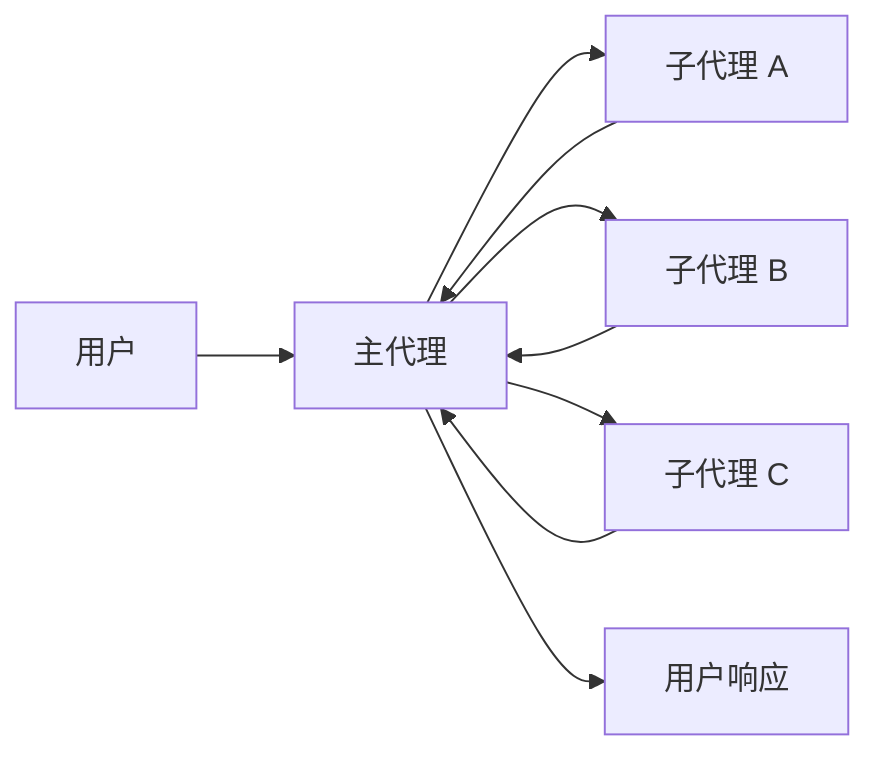
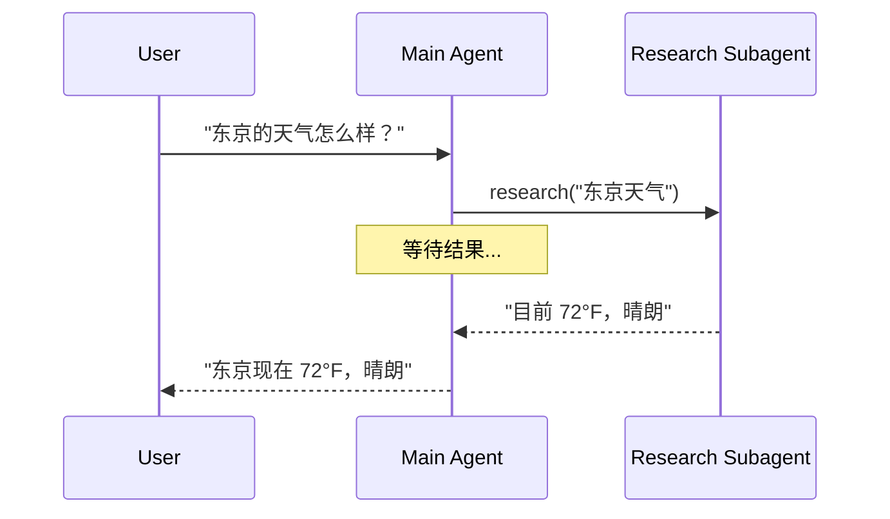
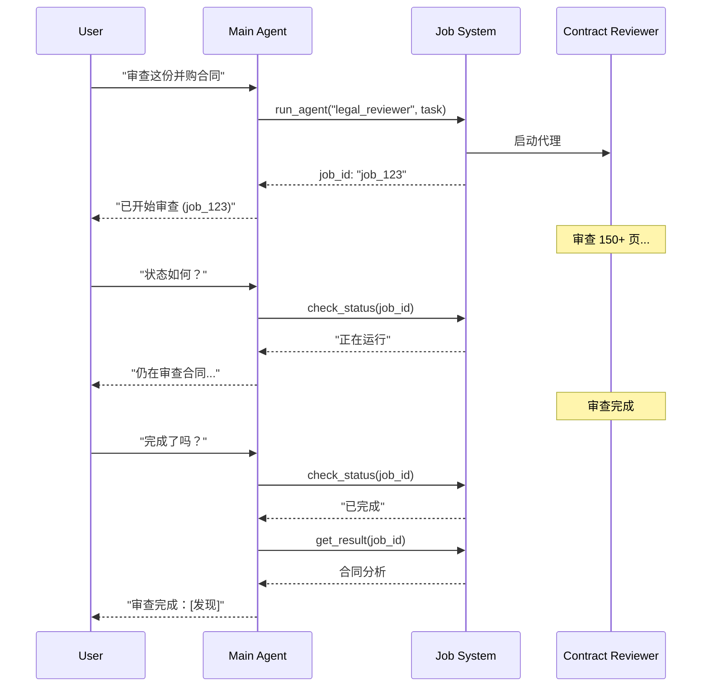
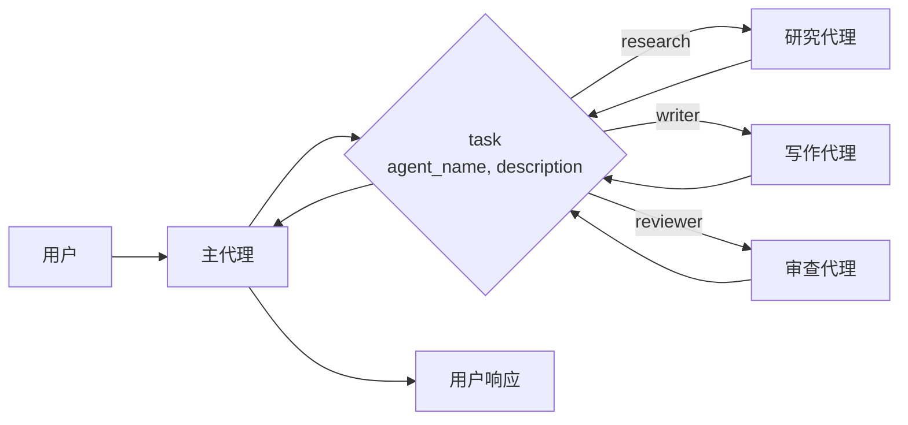

在**子代理**架构中，一个中央主[代理](/oss/javascript/langchain/agents)（通常称为**监督者**）通过将子代理作为[工具](/oss/javascript/langchain/tools)调用来协调它们。主代理决定调用哪个子代理、提供什么输入以及如何组合结果。子代理是无状态的——它们不记得过去的交互，所有对话记忆都由主代理维护。这提供了[上下文](/oss/javascript/langchain/context-engineering)隔离：每个子代理调用都在干净的上下文窗口中工作，防止主对话中的上下文臃肿。



## 主要特征

* 集中控制：所有路由都经过主代理
* 无直接用户交互：子代理将结果返回给主代理，而不是用户（尽管您可以在子代理内使用[中断](/oss/javascript/langgraph/interrupts#interrupt)来允许用户交互）
* 通过工具的子代理：子代理通过工具调用
* 并行执行：主代理可以在一轮中调用多个子代理

<Note>
**监督者与路由器**：监督者代理（此模式）与[路由器](/oss/javascript/langchain/multi-agent/router)不同。监督者是一个完整的代理，它维护对话上下文并动态决定在多个轮次中调用哪些子代理。路由器通常是一个单一的分类步骤，它分发给代理而不维护正在进行的对话状态。
</Note>

## 何时使用

当您有多个不同的领域（例如，日历、电子邮件、CRM、数据库），子代理不需要直接与用户交谈，或者您想要集中的工作流控制时，请使用子代理模式。对于只有几个[工具](/oss/javascript/langchain/tools)的简单情况，请使用[单个代理](/oss/javascript/langchain/agents)。

<Tip>
**需要在子代理内进行用户交互？** 虽然子代理通常将结果返回给主代理而不是直接与用户交谈，但您可以在子代理内使用[中断](/oss/javascript/langgraph/interrupts#interrupt)来暂停执行并收集用户输入。当子代理在继续之前需要澄清或批准时，这很有用。主代理仍然是编排者，但子代理可以在任务中途从用户那里收集信息。
</Tip>

## 基本实现

核心机制将子代理包装为主代理可以调用的工具：


```typescript
import { createAgent, tool } from "langchain";
import { z } from "zod";

// 创建一个子代理
const subagent = createAgent({ model: "anthropic:claude-sonnet-4-20250514", tools: [...] });

// 将其包装为工具
const callResearchAgent = tool(
  async ({ query }) => {
    const result = await subagent.invoke({
      messages: [{ role: "user", content: query }]
    });
    return result.messages.at(-1)?.content;
  },
  {
    name: "research",
    description: "研究一个主题并返回发现",
    schema: z.object({ query: z.string() })
  }
);

// 带有子代理作为工具的主代理
const mainAgent = createAgent({ model: "anthropic:claude-sonnet-4-20250514", tools: [callResearchAgent] });
```


<Card
    title="教程：构建带子代理的个人助手"
    icon="sitemap"
    href="/oss/javascript/langchain/multi-agent/subagents-personal-assistant"
    arrow cta="了解更多"
>
    了解如何使用子代理模式构建个人助手，其中中央主代理（监督者）协调专门的工作代理。
</Card>

## 设计决策

实现子代理模式时，您将做出几个关键的设计选择。此表总结了这些选项——每个选项都在下面的部分中详细介绍。

| 决策 | 选项 |
|----------|---------|
| [**同步与异步**](#sync-vs-async) | 同步（阻塞）与异步（后台） |
| [**工具模式**](#tool-patterns) | 每个代理一个工具与单个分发工具 |
| [**子代理规范**](#subagent-specs) | 系统提示与枚举约束与基于工具的发现（仅限单个分发工具） |
| [**子代理输入**](#subagent-inputs) | 仅查询与完整上下文 |
| [**子代理输出**](#subagent-outputs) | 子代理结果与完整对话历史 |

## 同步与异步

子代理执行可以是**同步**（阻塞）或**异步**（后台）。您的选择取决于主代理是否需要结果才能继续。

| 模式 | 主代理行为 | 最适合 | 权衡 |
|------|---------------------|----------|----------|
| **同步** | 等待子代理完成 | 主代理需要结果才能继续 | 简单，但阻塞对话 |
| **异步** | 在子代理在后台运行时继续 | 独立任务，用户不应等待 | 响应迅速，但更复杂 |

<Tip>
不要与 Python 的 `async`/`await` 混淆。在这里，“异步”意味着主代理启动后台作业（通常在单独的进程或服务中）并继续而不阻塞。
</Tip>

### 同步（默认）

默认情况下，子代理调用是**同步的**——主代理在继续之前等待每个子代理完成。当主代理的下一步操作取决于子代理的结果时，请使用同步。



**何时使用同步：**
- 主代理需要子代理的结果来制定其响应
- 任务有顺序依赖关系（例如，获取数据 → 分析 → 响应）
- 子代理故障应阻止主代理的响应

**权衡：**
- 实现简单——只需调用并等待
- 直到所有子代理完成，用户才看到响应
- 长时间运行的任务会冻结对话

### 异步

当子代理的工作是独立的——主代理不需要结果就可以继续与用户交谈时，使用**异步执行**。主代理启动后台作业并保持响应。



**何时使用异步：**
- 子代理工作独立于主对话流
- 用户应该能够在工作发生时继续聊天
- 您希望并行运行多个独立任务

**三工具模式：**
1. **启动作业**：启动后台任务，返回作业 ID
2. **检查状态**：返回当前状态（挂起、正在运行、已完成、失败）
3. **获取结果**：检索已完成的结果

**处理作业完成：** 当作业完成时，您的应用程序需要通知用户。一种方法：显示一个通知，单击该通知时会发送一条 `HumanMessage`，如“检查 job_123 并总结结果”。

## 工具模式

有两种主要方法可以将子代理作为工具公开：

| 模式 | 最适合 | 权衡 |
|---------|----------|-----------|
| [**每个代理一个工具**](#tool-per-agent) | 对每个子代理的输入/输出进行细粒度控制 | 设置更多，但定制更多 |
| [**单个分发工具**](#single-dispatch-tool) | 许多代理，分布式团队，约定优于配置 | 组合更简单，每个代理的定制更少 |

### 每个代理一个工具


核心思想是将子代理包装为主代理可以调用的工具：


```typescript
import { createAgent, tool } from "langchain";
import * as z from "zod";

// 创建一个子代理
const subagent = createAgent({...});  // [!code highlight]

// 将其包装为工具  // [!code highlight]
const callSubagent = tool(  // [!code highlight]
  async ({ query }) => {  // [!code highlight]
    const result = await subagent.invoke({
      messages: [{ role: "user", content: query }]
    });
    return result.messages.at(-1)?.text;
  },
  {
    name: "subagent_name",
    description: "子代理描述",
    schema: z.object({
      query: z.string().describe("发送给子代理的查询")
    })
  }
);

// 带有子代理作为工具的主代理  // [!code highlight]
const mainAgent = createAgent({ model, tools: [callSubagent] });  // [!code highlight]
```


主代理在决定任务与子代理的描述匹配时调用子代理工具，接收结果并继续编排。有关细粒度控制，请参阅[上下文工程](#context-engineering)。

### 单个分发工具

另一种方法使用单个参数化工具来调用临时子代理以执行独立任务。与[每个代理一个工具](#tool-per-agent)方法（其中每个子代理都被包装为单独的工具）不同，这使用基于约定的方法，即使用单个 `task` 工具：任务描述作为人类消息传递给子代理，子代理的最终消息作为工具结果返回。

当您希望跨多个团队分发代理开发，需要将复杂任务隔离到单独的上下文窗口中，需要一种可扩展的方式来添加新代理而无需修改协调器，或者更喜欢约定而不是定制时，请使用此方法。这种方法以牺牲上下文工程的灵活性为代价，换取代理组合的简单性和强大的上下文隔离。



**主要特征：**

* 单个任务工具：一个参数化工具，可以按名称调用任何已注册的子代理
* 基于约定的调用：按名称选择代理，任务作为人类消息传递，最终消息作为工具结果返回
* 团队分发：不同的团队可以独立开发和部署代理
* 代理发现：可以通过系统提示（列出可用代理）或通过[渐进式披露](/oss/javascript/langchain/multi-agent/skills-sql-assistant)（通过工具按需加载代理信息）发现子代理

<Tip>
这种方法的一个有趣的方面是，子代理可能具有与主代理完全相同的能力。在这种情况下，调用子代理**实际上是为了上下文隔离**作为主要原因——允许复杂的、多步骤的任务在隔离的上下文窗口中运行，而不会使主代理的对话历史变得臃肿。子代理自主完成工作并仅返回简洁的摘要，保持主线程专注和高效。
</Tip>

<Accordion title="带任务分发器的代理注册表">


```typescript
import { tool, createAgent } from "langchain";
import * as z from "zod";

// 由不同团队开发的子代理
const researchAgent = createAgent({
  model: "gpt-4.1",
  prompt: "你是一名研究专家...",
});

const writerAgent = createAgent({
  model: "gpt-4.1",
  prompt: "你是一名写作专家...",
});

// 可用子代理的注册表
const SUBAGENTS = {
  research: researchAgent,
  writer: writerAgent,
};

const task = tool(
  async ({ agentName, description }) => {
    const agent = SUBAGENTS[agentName];
    const result = await agent.invoke({
      messages: [
        { role: "user", content: description }
      ],
    });
    return result.messages.at(-1)?.content;
  },
  {
    name: "task",
    description: `启动临时子代理。

可用代理：
- research：研究和实况调查
- writer：内容创建和编辑`,
    schema: z.object({
      agentName: z
        .string()
        .describe("要调用的代理名称"),
      description: z
        .string()
        .describe("任务描述"),
    }),
  }
);

// 主协调代理
const mainAgent = createAgent({
  model: "gpt-4.1",
  tools: [task],
  prompt: (
    "你协调专门的子代理。" +
    "可用：research（实况调查），" +
    "writer（内容创建）。" +
    "使用 task 工具委托工作。"
  ),
});
```


</Accordion>

## 上下文工程

控制上下文如何在主代理与其子代理之间流动：

| 类别 | 目的 | 影响 |
|----------|---------|---------|
| [**子代理规范**](#subagent-specs) | 确保在应该调用子代理时调用它们 | 主代理路由决策 |
| [**子代理输入**](#subagent-inputs) | 确保子代理可以在优化上下文中良好执行 | 子代理性能 |
| [**子代理输出**](#subagent-outputs) | 确保监督者可以根据子代理结果采取行动 | 主代理性能 |

另请参阅我们关于代理的[上下文工程](/oss/javascript/langchain/context-engineering)的综合指南。

### 子代理规范

与子代理关联的**名称**和**描述**是主代理知道要调用哪些子代理的主要方式。这些是提示杠杆——请谨慎选择。

* **名称**：主代理如何引用子代理。保持清晰和面向行动（例如 `research_agent`, `code_reviewer`）。
* **描述**：主代理对子代理能力的了解。具体说明它处理什么任务以及何时使用它。

对于[单个分发工具](#single-dispatch-tool)设计，您必须另外为主代理提供有关它可以调用的子代理的信息。
您可以根据代理的数量以及注册表是静态还是动态的，以不同方式提供此信息：

| 方法 | 最适合 | 权衡 |
|--------|----------|----------|
| **系统提示枚举** | 小型、静态代理列表（< 10 个代理） | 简单，但在代理更改时需要更新提示 |
| **枚举约束** | 小型、静态代理列表（< 10 个代理） | 类型安全且显式，但在代理更改时需要更改代码 |
| **基于工具的发现** | 大型或动态代理注册表 | 灵活且可扩展，但增加了复杂性 |

#### 系统提示枚举

直接在主代理的系统提示中列出可用代理。主代理将代理列表及其描述视为其指令的一部分。

**何时使用：**
- 您有一组小的、固定的代理（< 10）
- 代理注册表很少更改
- 您想要最简单的实现

**示例：**
```python
main_agent = create_agent(
    model="...",
    tools=[task],
    system_prompt=(
        "你协调专门的子代理。"
        "可用代理：\n"
        "- research：研究和实况调查\n"
        "- writer：内容创建和编辑\n"
        "- reviewer：代码和文档审查\n"
        "使用 task 工具委托工作。"
    ),
)
```

#### 分发工具上的枚举约束

在分发工具的 `agent_name` 参数中添加枚举约束。这提供了类型安全性，并使可用代理在工具架构中显式可见。

**何时使用：**
- 您有一组小的、固定的代理（< 10）
- 您想要类型安全和显式的代理名称
- 您更喜欢基于架构的验证而不是基于提示的指导

**示例：**
```python
from enum import Enum

class AgentName(str, Enum):
    RESEARCH = "research"
    WRITER = "writer"
    REVIEWER = "reviewer"

@tool
def task(
    agent_name: AgentName,  # 枚举约束
    description: str
) -> str:
    """为任务启动临时子代理。"""
    # ...
```

#### 基于工具的发现

提供一个单独的工具（例如 `list_agents` 或 `search_agents`），主代理可以调用该工具来按需发现可用代理。这实现了渐进式披露并支持动态注册表。

**何时使用：**
- 您有许多代理（> 10）或不断增长的注册表
- 代理注册表频繁更改或者是动态的
- 您希望减少提示大小和 Token 使用量
- 不同的团队独立管理不同的代理

**示例：**
```python
@tool
def list_agents(query: str = "") -> str:
    """列出可用子代理，可选择按查询过滤。"""
    agents = search_agent_registry(query)
    return format_agent_list(agents)

@tool
def task(agent_name: str, description: str) -> str:
    """为任务启动临时子代理。"""
    # ...

main_agent = create_agent(
    model="...",
    tools=[task, list_agents],
    system_prompt="使用 list_agents 发现可用子代理，然后使用 task 调用它们。"
)
```

### 子代理输入

自定义子代理接收什么上下文来执行其任务。通过从代理状态中提取，添加无法在静态提示中捕获的输入——完整的消息历史、先前结果或任务元数据。


```typescript 子代理输入示例（可展开）
import { createAgent, tool, AgentState, ToolMessage } from "langchain";
import { Command } from "@langchain/langgraph";
import * as z from "zod";

// 通过状态将完整对话历史传递给子代理的示例。
const callSubagent1 = tool(
  async ({query}) => {
    const state = getCurrentTaskInput<AgentState>();
    // 应用将消息转换为合适输入所需的任何逻辑
    const subAgentInput = someLogic(query, state.messages);
    const result = await subagent1.invoke({
      messages: subAgentInput,
      // 您还可以根据需要在此处传递其他状态键。
      // 确保在主代理和子代理的
      // 状态架构中定义这些。
      exampleStateKey: state.exampleStateKey
    });
    return result.messages.at(-1)?.content;
  },
  {
    name: "subagent1_name",
    description: "subagent1_description",
  }
);
```


### 子代理输出

自定义主代理接收回的内容，以便它可以做出正确的决定。两种策略：

1. **提示子代理**：准确指定应返回的内容。一种常见的故障模式是子代理执行工具调用或推理，但未在其最终消息中包含结果——提醒它监督者只看到最终输出。
2. **在代码中格式化**：在返回之前调整或丰富响应。例如，使用 [`Command`](/oss/javascript/langgraph/graph-api#command) 除了返回最终文本外，还返回特定的状态键。


```typescript 子代理输出示例（可展开）
import { tool, ToolMessage } from "langchain";
import { Command } from "@langchain/langgraph";
import * as z from "zod";

const callSubagent1 = tool(
  async ({ query }, config) => {
    const result = await subagent1.invoke({
      messages: [{ role: "user", content: query }]
    });

    // 返回 Command 以更新多个状态键
    return new Command({
      update: {
        // 从子代理传回额外状态
        exampleStateKey: result.exampleStateKey,
        messages: [
          new ToolMessage({
            content: result.messages.at(-1)?.text,
            tool_call_id: config.toolCall?.id!
          })
        ]
      }
    });
  },
  {
    name: "subagent1_name",
    description: "subagent1_description",
    schema: z.object({
      query: z.string().describe("发送给 subagent1 的查询")
    })
  }
);
```


## 检查点和状态检查

默认情况下，子代理使用**继承检查点**模式——每次调用都以新状态开始，支持[中断](/oss/javascript/langgraph/interrupts#interrupt)，并安全地并行运行。如果您需要子代理跨调用维护其自己的持久对话历史，请使用 `checkpointer=True`（延续模式）进行编译。有关模式的完整比较，请参阅[子图持久性](/oss/javascript/langgraph/use-subgraphs#subgraph-persistence)。

由于子代理是在工具函数内部调用的，LangGraph 无法[静态发现](/oss/javascript/langgraph/use-subgraphs#view-subgraph-state)它们。这意味着 [`get_state` with `subgraphs`](/oss/javascript/langgraph/use-subgraphs#view-subgraph-state) 将不会返回子代理状态。如果您需要读取嵌套图状态（例如，在[中断](/oss/javascript/langgraph/interrupts#interrupt)期间），请改为在自定义图中从[节点函数](/oss/javascript/langgraph/use-subgraphs#call-a-subgraph-inside-a-node)调用子代理。有关每种模式如何影响状态可见性的详细信息，请参阅[子图持久性](/oss/javascript/langgraph/use-subgraphs#subgraph-persistence)。

---

<div className="source-links">
<Callout icon="edit">
    [在 GitHub 上编辑此页面](https://github.com/langchain-ai/docs/edit/main/src/oss/langchain/multi-agent/subagents.mdx) 或 [提交问题](https://github.com/langchain-ai/docs/issues/new/choose).
</Callout>
<Callout icon="terminal-2">
    [通过 MCP 将这些文档连接](/use-these-docs) 到 Claude、VSCode 等，以获取实时答案。
</Callout>
</div>
