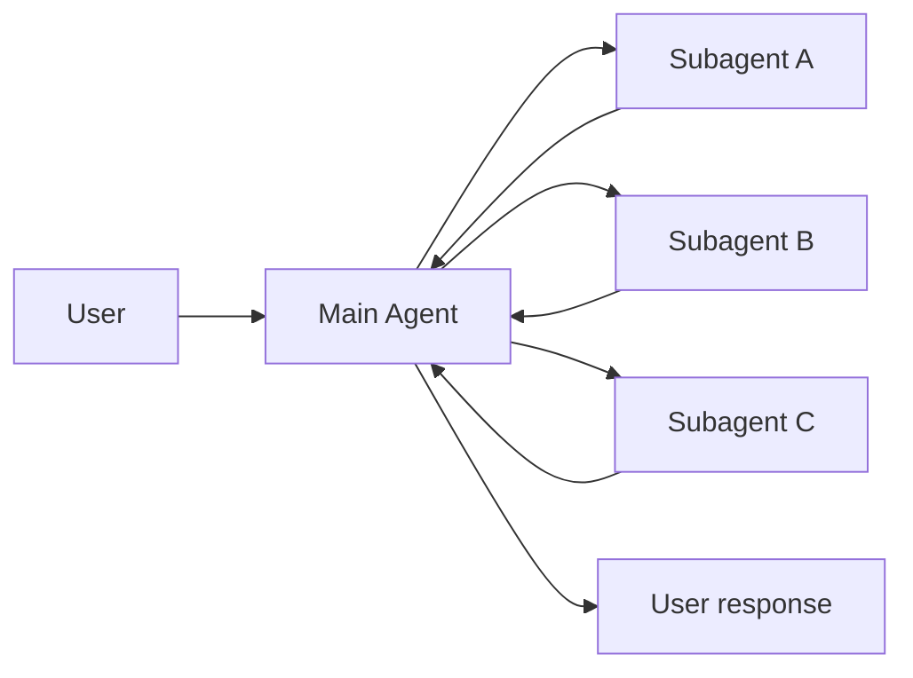
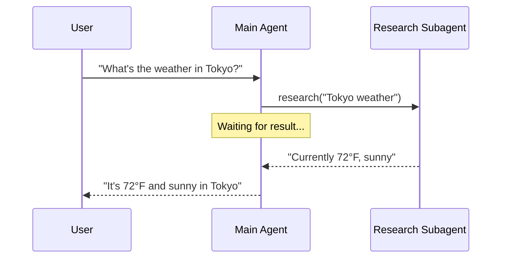
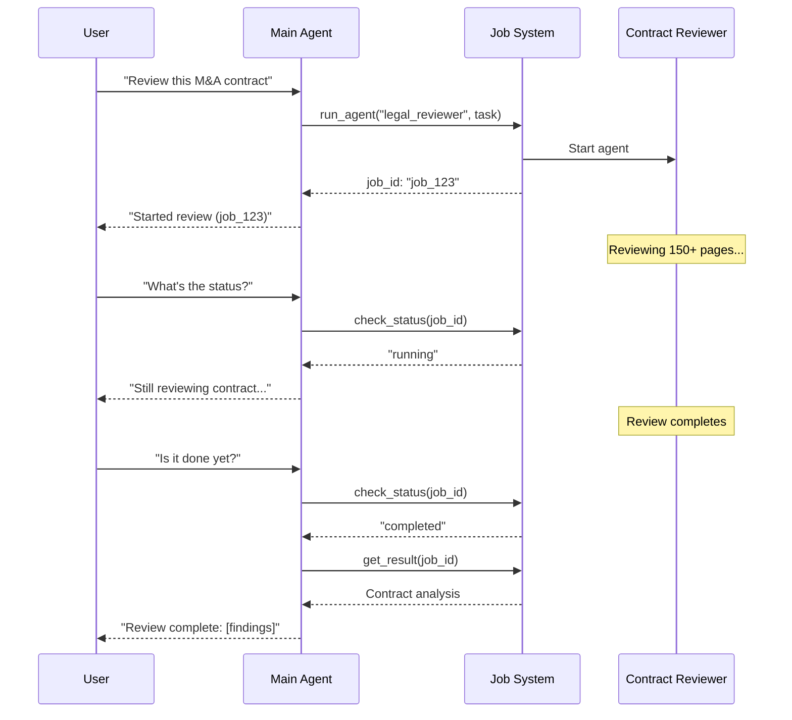
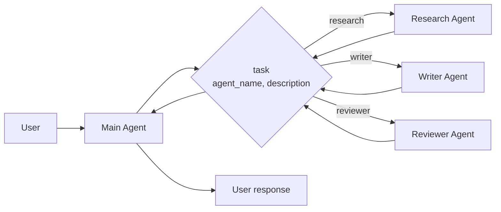

在 **subagents** 架构中，一个中央主 [agent](/oss/javascript/langchain/agents)（通常称为 **supervisor**）通过将子代理作为 [tools](/oss/javascript/langchain/tools) 调用来协调它们。主代理决定调用哪个子代理、提供什么输入以及如何组合结果。子代理是无状态的——它们不记住过去的交互，所有对话记忆由主代理维护。这提供了 [context](/oss/javascript/langchain/context-engineering) 隔离：每次子代理调用都在干净的上下文窗口中工作，防止主对话中的上下文膨胀。



## 关键特性

* 集中控制：所有路由都通过主代理
* 无直接用户交互：子代理将结果返回给主代理，而不是用户（但你可以在子代理中使用 [interrupts](/oss/javascript/langgraph/human-in-the-loop#interrupt) 来允许用户交互）
* 通过工具调用子代理：子代理通过工具调用
* 并行执行：主代理可以在单次轮次中调用多个子代理

<Note>
**Supervisor vs. Router**：supervisor agent（此模式）与 [router](/oss/javascript/langchain/multi-agent/router) 不同。supervisor 是一个完整的代理，它维护对话上下文并动态决定在多个轮次中调用哪些子代理。router 通常是一个单一的分类步骤，将任务分派给代理而不维护持续的对话状态。
</Note>

## 何时使用

当你有多个不同的领域（例如，日历、邮件、CRM、数据库），子代理不需要直接与用户对话，或者你想要集中的工作流控制时，使用 subagents 模式。对于只有少量 [tools](/oss/javascript/langchain/tools) 的简单情况，使用 [单个代理](/oss/javascript/langchain/agents)。

<Tip>
**需要在子代理中进行用户交互？** 虽然子代理通常将结果返回给主代理而不是直接与用户对话，但你可以在子代理中使用 [interrupts](/oss/javascript/langgraph/human-in-the-loop#interrupt) 来暂停执行并收集用户输入。当子代理在继续之前需要澄清或批准时，这很有用。主代理仍然是协调者，但子代理可以在任务中途从用户那里收集信息。
</Tip>

## 基本实现

核心机制是将子代理包装为主代理可以调用的工具：


```typescript
import { createAgent, tool } from "langchain";
import { z } from "zod";

// Create a subagent
const subagent = createAgent({ model: "anthropic:claude-sonnet-4-20250514", tools: [...] });

// Wrap it as a tool
const callResearchAgent = tool(
  async ({ query }) => {
    const result = await subagent.invoke({
      messages: [{ role: "user", content: query }]
    });
    return result.messages.at(-1)?.content;
  },
  {
    name: "research",
    description: "Research a topic and return findings",
    schema: z.object({ query: z.string() })
  }
);

// Main agent with subagent as a tool
const mainAgent = createAgent({ model: "anthropic:claude-sonnet-4-20250514", tools: [callResearchAgent] });
```


<Card
    title="教程：使用 subagents 构建个人助手"
    icon="sitemap"
    href="/oss/javascript/langchain/multi-agent/subagents-personal-assistant"
    arrow cta="了解更多"
>
    学习如何使用 subagents 模式构建个人助手，其中中央主代理（supervisor）协调专门的工作代理。
</Card>

## 设计决策

在实现 subagents 模式时，你将做出几个关键的设计选择。此表总结了这些选项——每个选项在下面的章节中都有详细介绍。

| 决策 | 选项 |
|----------|---------|
| [**同步 vs. 异步**](#sync-vs-async) | 同步（阻塞）vs. 异步（后台）|
| [**工具模式**](#tool-patterns) | 每个代理一个工具 vs. 单一调度工具 |
| [**子代理输入**](#subagent-inputs) | 仅查询 vs. 完整上下文 |
| [**子代理输出**](#subagent-outputs) | 子代理结果 vs. 完整对话历史 |

## 同步 vs. 异步

子代理执行可以是**同步**（阻塞）或**异步**（后台）。你的选择取决于主代理是否需要结果才能继续。

| 模式 | 主代理行为 | 最适合 | 权衡 |
|------|---------------------|----------|----------|
| **同步** | 等待子代理完成 | 主代理需要结果才能继续 | 简单，但会阻塞对话 |
| **异步** | 子代理在后台运行时继续 | 独立任务，用户不应等待 | 响应快，但更复杂 |

<Tip>
不要与 Python 的 `async`/`await` 混淆。这里的"异步"意味着主代理启动一个后台任务（通常在单独的进程或服务中）并继续而不阻塞。
</Tip>

### 同步（默认）

默认情况下，子代理调用是**同步的**——主代理等待每个子代理完成后再继续。当主代理的下一个动作依赖于子代理的结果时，使用同步。



**何时使用同步：**
- 主代理需要子代理的结果来制定其响应
- 任务有顺序依赖（例如，获取数据 → 分析 → 响应）
- 子代理失败应阻塞主代理的响应

**权衡：**
- 实现简单——只需调用并等待
- 用户在所有子代理完成之前看不到响应
- 长时间运行的任务会冻结对话

### 异步

当子代理的工作是独立的时，使用**异步执行**——主代理不需要结果即可继续与用户对话。主代理启动后台任务并保持响应。



**何时使用异步：**
- 子代理工作独立于主对话流
- 用户应该能够在工作进行时继续聊天
- 你想并行运行多个独立任务

**三工具模式：**
1. **启动任务**：启动后台任务，返回任务 ID
2. **检查状态**：返回当前状态（pending、running、completed、failed）
3. **获取结果**：检索已完成的结果

**处理任务完成：** 当任务完成时，你的应用程序需要通知用户。一种方法是：显示一个通知，当点击时，发送一个 `HumanMessage`，如"检查 job_123 并总结结果。"

## 工具模式

有两种主要方式将子代理暴露为工具：

| 模式 | 最适合 | 权衡 |
|---------|----------|-----------|
| [**每个代理一个工具**](#tool-per-agent) | 对每个子代理的输入/输出进行细粒度控制 | 设置更多，但自定义更多 |
| [**单一调度工具**](#single-dispatch-tool) | 多个代理，分布式团队，约定优于配置 | 组合更简单，每个代理的自定义更少 |

### 每个代理一个工具


关键思想是将子代理包装为主代理可以调用的工具：


```typescript
import { createAgent, tool } from "langchain";
import * as z from "zod";

// Create a sub-agent
const subagent = createAgent({...});  // [!code highlight]

// Wrap it as a tool  // [!code highlight]
const callSubagent = tool(  // [!code highlight]
  async ({ query }) => {  // [!code highlight]
    const result = await subagent.invoke({
      messages: [{ role: "user", content: query }]
    });
    return result.messages.at(-1)?.text;
  },
  {
    name: "subagent_name",
    description: "subagent_description",
    schema: z.object({
      query: z.string().describe("The query to send to subagent")
    })
  }
);

// Main agent with subagent as a tool  // [!code highlight]
const mainAgent = createAgent({ model, tools: [callSubagent] });  // [!code highlight]
```


当主代理决定任务与子代理的描述匹配时，它调用子代理工具，接收结果，并继续编排。有关细粒度控制，请参阅 [上下文工程](#context-engineering)。

### 单一调度工具

另一种方法使用单个参数化工具来为独立任务调用临时子代理。与 [每个代理一个工具](#tool-per-agent) 方法不同（其中每个子代理被包装为单独的工具），这种方法使用基于约定的方法，只有一个 `task` 工具：任务描述作为人类消息传递给子代理，子代理的最终消息作为工具结果返回。

当你想在多个团队之间分配代理开发、需要将复杂任务隔离到单独的上下文窗口、需要一种可扩展的方式来添加新代理而无需修改协调器，或者更喜欢约定而不是自定义时，使用这种方法。这种方法以上下文工程的灵活性换取代理组合的简单性和强大的上下文隔离。



**关键特性：**

* 单一任务工具：一个参数化工具，可以按名称调用任何注册的子代理
* 基于约定的调用：按名称选择代理，任务作为人类消息传递，最终消息作为工具结果返回
* 团队分布：不同团队可以独立开发和部署代理
* 代理发现：子代理可以通过系统提示（列出可用代理）或通过 [渐进式公开](/oss/javascript/langchain/multi-agent/skills-sql-assistant)（通过工具按需加载代理信息）来发现

<Tip>
这种方法的一个有趣方面是子代理可能具有与主代理完全相同的能力。在这种情况下，调用子代理**实际上主要是为了上下文隔离**——允许复杂的多步骤任务在隔离的上下文窗口中运行，而不会膨胀主代理的对话历史。子代理自主完成其工作并只返回简洁的摘要，保持主线程的专注和高效。
</Tip>

<Accordion title="带任务调度器的代理注册表">


```typescript
import { tool, createAgent } from "langchain";
import * as z from "zod";

// Sub-agents developed by different teams
const researchAgent = createAgent({
  model: "gpt-4o",
  prompt: "You are a research specialist...",
});

const writerAgent = createAgent({
  model: "gpt-4o",
  prompt: "You are a writing specialist...",
});

// Registry of available sub-agents
const SUBAGENTS = {
  research: researchAgent,
  writer: writerAgent,
};

const task = tool(
  async ({ agentName, description }) => {
    const agent = SUBAGENTS[agentName];
    const result = await agent.invoke({
      messages: [
        { role: "user", content: description }
      ],
    });
    return result.messages.at(-1)?.content;
  },
  {
    name: "task",
    description: `Launch an ephemeral subagent.

Available agents:
- research: Research and fact-finding
- writer: Content creation and editing`,
    schema: z.object({
      agentName: z
        .string()
        .describe("Name of agent to invoke"),
      description: z
        .string()
        .describe("Task description"),
    }),
  }
);

// Main coordinator agent
const mainAgent = createAgent({
  model: "gpt-4o",
  tools: [task],
  prompt: (
    "You coordinate specialized sub-agents. " +
    "Available: research (fact-finding), " +
    "writer (content creation). " +
    "Use the task tool to delegate work."
  ),
});
```


</Accordion>

## 上下文工程

控制上下文如何在主代理和其子代理之间流动：

| 类别 | 目的 | 影响 |
|----------|---------|---------|
| [**子代理规格**](#subagent-specs) | 确保子代理在应该调用时被调用 | 主代理路由决策 |
| [**子代理输入**](#subagent-inputs) | 确保子代理可以使用优化的上下文良好执行 | 子代理性能 |
| [**子代理输出**](#subagent-outputs) | 确保 supervisor 可以对子代理结果采取行动 | 主代理性能 |

另请参阅我们关于代理的 [上下文工程](/oss/javascript/langchain/context-engineering) 综合指南。

### 子代理规格

与子代理关联的**名称**和**描述**是主代理知道调用哪些子代理的主要方式。
这些是提示杠杆——请仔细选择它们。

* **名称**：主代理如何引用子代理。保持清晰和面向动作（例如，`research_agent`、`code_reviewer`）。
* **描述**：主代理对子代理能力的了解。具体说明它处理什么任务以及何时使用它。

对于 [单一调度工具](#single-dispatch-tool) 设计，主代理需要使用要调用的子代理名称调用 `task` 工具。可用工具可以通过以下方法之一提供给主代理：

- **系统提示枚举**：在系统提示中列出可用代理。
- **调度工具的枚举约束**：对于小型代理列表，向 `agent_name` 字段添加枚举。
- **基于工具的发现**：对于大型或动态代理注册表，提供一个单独的工具（例如，`list_agents` 或 `search_agents`）来返回可用代理。

### 子代理输入

自定义子代理接收的上下文以执行其任务。通过从代理的状态中提取，添加在静态提示中不实际捕获的输入——完整的消息历史、先前的结果或任务元数据。


```typescript Subagent inputs example expandable
import { createAgent, tool, AgentState, ToolMessage } from "langchain";
import { Command } from "@langchain/langgraph";
import * as z from "zod";

// Example of passing the full conversation history to the sub agent via the state.
const callSubagent1 = tool(
  async ({query}) => {
    const state = getCurrentTaskInput<AgentState>();
    // Apply any logic needed to transform the messages into a suitable input
    const subAgentInput = someLogic(query, state.messages);
    const result = await subagent1.invoke({
      messages: subAgentInput,
      // You could also pass other state keys here as needed.
      // Make sure to define these in both the main and subagent's
      // state schemas.
      exampleStateKey: state.exampleStateKey
    });
    return result.messages.at(-1)?.content;
  },
  {
    name: "subagent1_name",
    description: "subagent1_description",
  }
);
```


### 子代理输出

自定义主代理接收回的内容，以便它可以做出好的决策。两种策略：

1. **提示子代理**：精确指定应该返回什么。一个常见的失败模式是子代理执行工具调用或推理但不在其最终消息中包含结果——提醒它 supervisor 只能看到最终输出。
2. **在代码中格式化**：在返回之前调整或丰富响应。例如，除了最终文本外，还使用 [`Command`](/oss/javascript/langgraph/graph-api#command) 传递特定的状态键。


```typescript Subagent outputs example expandable
import { tool, ToolMessage } from "langchain";
import { Command } from "@langchain/langgraph";
import * as z from "zod";

const callSubagent1 = tool(
  async ({ query }, config) => {
    const result = await subagent1.invoke({
      messages: [{ role: "user", content: query }]
    });

    // Return a Command to update multiple state keys
    return new Command({
      update: {
        // Pass back additional state from the subagent
        exampleStateKey: result.exampleStateKey,
        messages: [
          new ToolMessage({
            content: result.messages.at(-1)?.text,
            tool_call_id: config.toolCall?.id!
          })
        ]
      }
    });
  },
  {
    name: "subagent1_name",
    description: "subagent1_description",
    schema: z.object({
      query: z.string().describe("The query to send to subagent1")
    })
  }
);
```

---

<Callout icon="pen-to-square" iconType="regular">
    [Edit this page on GitHub](https://github.com/langchain-ai/docs/edit/main/src/oss/langchain/multi-agent/subagents.mdx) or [file an issue](https://github.com/langchain-ai/docs/issues/new/choose).
</Callout>
<Tip icon="terminal" iconType="regular">
    [Connect these docs](/use-these-docs) to Claude, VSCode, and more via MCP for real-time answers.
</Tip>
<div class='fixed right-2 bg-white bottom-2'></div>