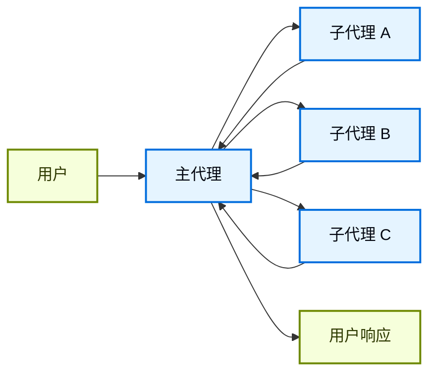
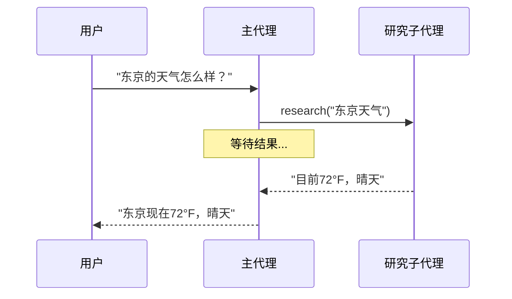
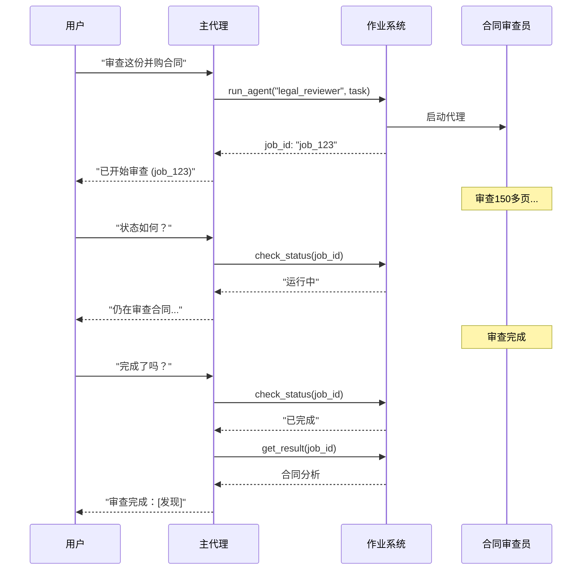
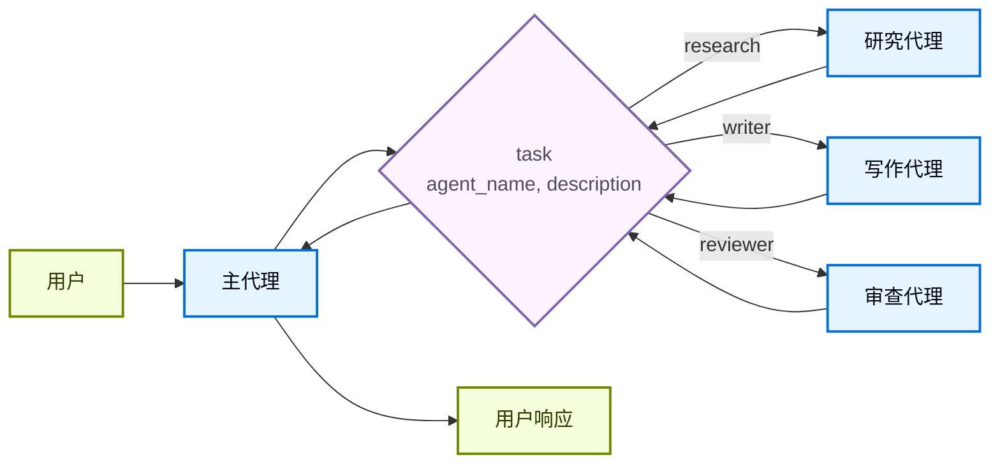

在**子代理**架构中，一个中央主[代理](/oss/javascript/langchain/agents)（通常称为**主管**）通过将子代理作为[工具](/oss/javascript/langchain/tools)来调用，从而协调它们。主代理决定调用哪个子代理、提供什么输入以及如何组合结果。子代理是无状态的——它们不记得过去的交互，所有对话记忆都由主代理维护。这提供了[上下文](/oss/javascript/langchain/context-engineering)隔离：每个子代理调用都在一个干净的上下文窗口中工作，防止主对话中的上下文膨胀。


```mermaid
graph LR
    A[用户] --> B[主代理]
    B --> C[子代理 A]
    B --> D[子代理 B]
    B --> E[子代理 C]
    C --> B
    D --> B
    E --> B
    B --> F[用户响应]

    classDef trigger fill:#F6FFDB,stroke:#6E8900,stroke-width:2px,color:#2E3900
    classDef process fill:#E5F4FF,stroke:#006DDD,stroke-width:2px,color:#030710

    class A,F trigger
    class B,C,D,E process
```

## 关键特性

*   集中控制：所有路由都通过主代理
*   无直接用户交互：子代理将结果返回给主代理，而不是用户（尽管你可以在子代理中使用[中断](/oss/javascript/langgraph/interrupts#pause-using-interrupt)来允许用户交互）
*   通过工具调用子代理：子代理通过工具被调用
*   并行执行：主代理可以在单个回合中调用多个子代理

<Note>
**主管 vs. 路由器**：主管代理（此模式）与[路由器](/oss/javascript/langchain/multi-agent/router)不同。主管是一个完整的代理，维护对话上下文，并在多个回合中动态决定调用哪些子代理。路由器通常是一个单一的分类步骤，它将任务分派给代理，而不维护持续的对话状态。
</Note>

## 何时使用

当你有多个不同的领域（例如，日历、电子邮件、CRM、数据库），子代理不需要直接与用户对话，或者你想要集中式的工作流控制时，可以使用子代理模式。对于只有几个[工具](/oss/javascript/langchain/tools)的更简单情况，请使用[单个代理](/oss/javascript/langchain/agents)。

<Tip>
**需要在子代理内进行用户交互？** 虽然子代理通常将结果返回给主代理，而不是直接与用户对话，但你可以在子代理中使用[中断](/oss/javascript/langgraph/interrupts#pause-using-interrupt)来暂停执行并收集用户输入。当子代理在继续之前需要澄清或批准时，这很有用。主代理仍然是协调者，但子代理可以在任务中途从用户那里收集信息。
</Tip>

## 基本实现

核心机制是将子代理包装成一个主代理可以调用的工具：

```typescript
import { createAgent, tool } from "langchain";
import { z } from "zod";

// 创建一个子代理
const subagent = createAgent({ model: "google_genai:gemini-3.1-pro-preview", tools: [...] });

// 将其包装为一个工具
const callResearchAgent = tool(
  async ({ query }) => {
    const result = await subagent.invoke({
      messages: [{ role: "user", content: query }]
    });
    return result.messages.at(-1)?.content;
  },
  {
    name: "research",
    description: "研究一个主题并返回发现",
    schema: z.object({ query: z.string() })
  }
);

// 主代理，将子代理作为工具
const mainAgent = createAgent({ model: "google_genai:gemini-3.1-pro-preview", tools: [callResearchAgent] });
```

<Card
    title="教程：使用子代理构建个人助手"
    icon="sitemap"
    href="/oss/javascript/langchain/multi-agent/subagents-personal-assistant"
    arrow cta="了解更多"
>
    了解如何使用子代理模式构建个人助手，其中中央主代理（主管）协调专门的工作者代理。
</Card>

## 设计决策

在实现子代理模式时，你将做出几个关键的设计选择。此表总结了选项——每个选项都在下面的章节中详细讨论。

| 决策 | 选项 |
|----------|---------|
| [**同步 vs. 异步**](#同步-vs-异步) | 同步（阻塞） vs. 异步（后台） |
| [**工具模式**](#工具模式) | 每个代理一个工具 vs. 单一分派工具 |
| [**子代理规格**](#子代理规格) | 系统提示 vs. 枚举约束 vs. 基于工具的发现（仅限单一分派工具） |
| [**子代理输入**](#子代理输入) | 仅查询 vs. 完整上下文 |
| [**子代理输出**](#子代理输出) | 子代理结果 vs. 完整对话历史 |

## 同步 vs. 异步

子代理执行可以是**同步的**（阻塞）或**异步的**（后台）。你的选择取决于主代理是否需要结果才能继续。

| 模式 | 主代理行为 | 最适合 | 权衡 |
|------|---------------------|----------|----------|
| **同步** | 等待子代理完成 | 主代理需要结果才能继续 | 简单，但会阻塞对话 |
| **异步** | 在子代理后台运行时继续 | 独立任务，用户不应等待 | 响应迅速，但更复杂 |

<Tip>
不要与 Python 的 `async`/`await` 混淆。这里的“异步”意味着主代理启动一个后台作业（通常在单独的进程或服务中）并继续而不阻塞。
</Tip>

### 同步（默认）

默认情况下，子代理调用是**同步的**：主代理等待每个子代理完成后再继续。当主代理的下一步操作依赖于子代理的结果时，请使用同步。


```mermaid
sequenceDiagram
    participant 用户
    participant 主代理
    participant 研究子代理

    用户->>主代理: "东京的天气怎么样？"
    主代理->>研究子代理: research("东京天气")
    Note over 主代理: 等待结果...
    研究子代理-->>主代理: "目前72°F，晴天"
    主代理-->>用户: "东京现在72°F，晴天"
```

**何时使用同步：**
- 主代理需要子代理的结果来制定其响应
- 任务具有顺序依赖性（例如，获取数据 → 分析 → 响应）
- 子代理失败应阻塞主代理的响应

**权衡：**
- 实现简单——只需调用并等待
- 在所有子代理完成之前，用户看不到任何响应
- 长时间运行的任务会冻结对话

### 异步

当子代理的工作是独立的——主代理不需要结果就可以继续与用户对话时，请使用**异步执行**。主代理启动一个后台作业并保持响应。


```mermaid
sequenceDiagram
    participant 用户
    participant 主代理
    participant 作业系统
    participant 合同审查员

    用户->>主代理: "审查这份并购合同"
    主代理->>作业系统: run_agent("legal_reviewer", task)
    作业系统->>合同审查员: 启动代理
    作业系统-->>主代理: job_id: "job_123"
    主代理-->>用户: "已开始审查 (job_123)"

    Note over 合同审查员: 审查150多页...

    用户->>主代理: "状态如何？"
    主代理->>作业系统: check_status(job_id)
    作业系统-->>主代理: "运行中"
    主代理-->>用户: "仍在审查合同..."

    Note over 合同审查员: 审查完成

    用户->>主代理: "完成了吗？"
    主代理->>作业系统: check_status(job_id)
    作业系统-->>主代理: "已完成"
    主代理->>作业系统: get_result(job_id)
    作业系统-->>主代理: 合同分析
    主代理-->>用户: "审查完成：[发现]"
```

**何时使用异步：**
- 子代理工作独立于主对话流
- 用户应该能够在工作进行时继续聊天
- 你想并行运行多个独立任务

**三工具模式：**
1.  **启动作业**：启动后台任务，返回一个作业 ID
2.  **检查状态**：返回当前状态（待处理、运行中、已完成、失败）
3.  **获取结果**：检索完成的结果

**处理作业完成：** 当作业完成时，你的应用程序需要通知用户。一种方法：显示一个通知，点击时发送一条 `HumanMessage`，如“检查 job_123 并总结结果。”

## 工有两种主要方式将子代理暴露为工具：

| 模式 | 最适合 | 权衡 |
|---------|----------|-----------|
| [**每个代理一个工具**](#每个代理一个工具) | 对每个子代理的输入/输出进行细粒度控制 | 设置更多，但定制性更强 |
| [**单一分派工具**](#单一分派工具) | 许多代理、分布式团队、约定优于配置 | 组合更简单，每个代理的定制性更少 |

### 每个代理一个工具


```mermaid
graph LR
    A[用户] --> B[主代理]
    B --> C[子代理 A]
    B --> D[子代理 B]
    B --> E[子代理 C]
    C --> B
    D --> B
    E --> B
    B --> F[用户响应]

    classDef trigger fill:#F6FFDB,stroke:#6E8900,stroke-width:2px,color:#2E3900
    classDef process fill:#E5F4FF,stroke:#006DDD,stroke-width:2px,color:#030710

    class A,F trigger
    class B,C,D,E process
```

关键思想是将子代理包装成主代理可以调用的工具：

```typescript
import { createAgent, tool } from "langchain";
import * as z from "zod";

// 创建一个子代理
const subagent = createAgent({...});  // [!code highlight]

// 将其包装为一个工具  // [!code highlight]
const callSubagent = tool(  // [!code highlight]
  async ({ query }) => {  // [!code highlight]
    const result = await subagent.invoke({
      messages: [{ role: "user", content: query }]
    });
    return result.messages.at(-1)?.text;
  },
  {
    name: "subagent_name",
    description: "subagent_description",
    schema: z.object({
      query: z.string().describe("发送给子代理的查询")
    })
  }
);

// 主代理，将子代理作为工具  // [!code highlight]
const mainAgent = createAgent({ model, tools: [callSubagent] });  // [!code highlight]
```

主代理在决定任务与子代理的描述匹配时调用子代理工具，接收结果，并继续协调。有关细粒度控制，请参阅[上下文工程](#上下文工程)。

### 单一分派工具

另一种方法使用单个参数化工具来为独立任务调用临时子代理。与[每个代理一个工具](#每个代理一个工具)方法（其中每个子代理被包装为单独的工具）不同，这种方法使用基于约定的单一 `task` 工具：任务描述作为人类消息传递给子代理，子代理的最终消息作为工具结果返回。

当你想将代理开发分配给多个团队、需要将复杂任务隔离到单独的上下文窗口中、需要一种可扩展的方式来添加新代理而无需修改协调器，或者更喜欢约定而非自定义时，请使用此方法。这种方法以牺牲上下文工程的灵活性为代价，换取了代理组合的简单性和强大的上下文隔离。


```mermaid
graph LR
    A[用户] --> B[主代理]
    B --> C{task<br/>agent_name, description}
    C -->|research| D[研究代理]
    C -->|writer| E[写作代理]
    C -->|reviewer| F[审查代理]
    D --> C
    E --> C
    F --> C
    C --> B
    B --> G[用户响应]

    classDef trigger fill:#F6FFDB,stroke:#6E8900,stroke-width:2px,color:#2E3900
    classDef process fill:#E5F4FF,stroke:#006DDD,stroke-width:2px,color:#030710
    classDef decision fill:#FDF3FF,stroke:#7E65AE,stroke-width:2px,color:#504B5F

    class A,G trigger
    class B,D,E,F process
    class C decision
```

**关键特性：**

*   单一任务工具：一个参数化工具，可以通过名称调用任何已注册的子代理
*   基于约定的调用：通过名称选择代理，任务作为人类消息传递，最终消息作为工具结果返回
*   团队分配：不同的团队可以独立开发和部署代理
*   代理发现：子代理可以通过系统提示（列出可用代理）或通过[渐进式披露](/oss/javascript/langchain/multi-agent/skills-sql-assistant)（通过工具按需加载代理信息）来发现

<Tip>
这种方法的一个有趣方面是，子代理可能具有与主代理完全相同的能力。在这种情况下，调用子代理**主要是为了上下文隔离**——允许复杂的多步骤任务在隔离的上下文窗口中运行，而不会使主代理的对话历史膨胀。子代理自主完成其工作，并仅返回简洁的摘要，使主线程保持专注和高效。
</Tip>

<Accordion title="带有任务分派器的代理注册表">

```typescript
import { tool, createAgent } from "langchain";
import * as z from "zod";

// 由不同团队开发的子代理
const researchAgent = createAgent({
  model: "gpt-5.4",
  prompt: "你是一个研究专家...",
});

const writerAgent = createAgent({
  model: "gpt-5.4",
  prompt: "你是一个写作专家...",
});

// 可用子代理的注册表
const SUBAGENTS = {
  research: researchAgent,
  writer: writerAgent,
};

const task = tool(
  async ({ agentName, description }) => {
    const agent = SUBAGENTS[agentName];
    const result = await agent.invoke({
      messages: [
        { role: "user", content: description }
      ],
    });
    return result.messages.at(-1)?.content;
  },
  {
    name: "task",
    description: `启动一个临时子代理。

可用代理：
- research: 研究和事实查找
- writer: 内容创建和编辑`,
    schema: z.object({
      agentName: z
        .string()
        .describe("要调用的代理名称"),
      description: z
        .string()
        .describe("任务描述"),
    }),
  }
);

// 主协调代理
const mainAgent = createAgent({
  model: "gpt-5.4",
  tools: [task],
  prompt: (
    "你协调专门的子代理。" +
    "可用：research（事实查找），" +
    "writer（内容创建）。" +
    "使用 task 工具来分配工作。"
  ),
});
```

</Accordion>

## 上下文工程

控制上下文在主代理及其子代理之间的流动：

| 类别 | 目的 | 影响 |
|----------|---------|---------|
| [**子代理规格**](#子代理规格) | 确保子代理在应该被调用时被调用 | 主代理路由决策 |
| [**子代理输入**](#子代理输入) | 确保子代理能够使用优化的上下文良好执行 | 子代理性能 |
| [**子代理输出**](#子代理输出) | 确保主管能够根据子代理结果采取行动 | 主代理性能 |

另请参阅我们关于代理[上下文工程](/oss/javascript/langchain/context-engineering)的综合指南。

### 子代理规格

与子代理关联的**名称**和**描述**是主代理知道调用哪些子代理的主要方式。这些是提示杠杆——请谨慎选择。

*   **名称**：主代理如何引用子代理。保持清晰且面向行动（例如，`research_agent`、`code_reviewer`）。
*   **描述**：主代理对子代理能力的了解。具体说明它处理哪些任务以及何时使用它。

对于[单一分派工具](#单一分派工具)设计，你必须额外向主代理提供有关它可以调用的子代理的信息。
你可以根据代理数量以及注册表是静态还是动态，以不同方式提供此信息：

| 方法 | 最适合 | 权衡 |
|--------|----------|----------|
| **系统提示枚举** | 小型、静态代理列表（< 10 个代理） | 简单，但代理更改时需要更新提示 |
| **枚举约束** | 小型、静态代理列表（< 10 个代理） | 类型安全且明确，但代理更改时需要代码更改 |
| **基于工具的发现** | 大型或动态代理注册表 | 灵活且可扩展，但增加了复杂性 |

#### 系统提示枚举

在主代理的系统提示中直接列出可用代理。主代理将代理列表及其描述视为其指令的一部分。

**何时使用：**
- 你有一个小型、固定的代理集（< 10）
- 代理注册表很少更改
- 你想要最简单的实现

**示例：**
```python
main_agent = create_agent(
    model="...",
    tools=[task],
    system_prompt=(
        "你协调专门的子代理。"
        "可用代理：\n"
        "- research: 研究和事实查找\n"
        "- writer: 内容创建和编辑\n"
        "- reviewer: 代码和文档审查\n"
        "使用 task 工具来分配工作。"
    ),
)
```

#### 分派工具上的枚举约束

在分派工具的 `agent_name` 参数上添加枚举约束。这提供了类型安全，并使可用代理在工具模式中明确。

**何时使用：**
- 你有一个小型、固定的代理集（< 10）
- 你想要类型安全和明确的代理名称
- 你更喜欢基于模式的验证而不是基于提示的指导

**示例：**
```python
from enum import Enum

class AgentName(str, Enum):
    RESEARCH = "research"
    WRITER = "writer"
    REVIEWER = "reviewer"

@tool
def task(
    agent_name: AgentName,  # 枚举约束
    description: str
) -> str:
    """为任务启动一个临时子代理。"""
    # ...
```

#### 基于工具的发现

提供一个单独的工具（例如，`list_agents` 或 `search_agents`），主代理可以调用它来按需发现可用代理。这支持渐进式披露并支持动态注册表。

**何时使用：**
- 你有许多代理（> 10）或一个不断增长的注册表
- 代理注册表经常更改或是动态的
- 你想减少提示大小和令牌使用量
- 不同的团队独立管理不同的代理

**示例：**
```python
@tool
def list_agents(query: str = "") -> str:
    """列出可用的子代理，可选择按查询过滤。"""
    agents = search_agent_registry(query)
    return format_agent_list(agents)

@tool
def task(agent_name: str, description: str) -> str:
    """为任务启动一个临时子代理。"""
    # ...

main_agent = create_agent(
    model="...",
    tools=[task, list_agents],
    system_prompt="使用 list_agents 来发现可用的子代理，然后使用 task 来调用它们。"
)
```

### 子代理输入

自定义子代理接收的上下文以执行其任务。通过从代理的状态中提取，添加在静态提示中不实用捕获的输入——完整的消息历史、先前结果或任务元数据。

```typescript 子代理输入示例 可展开
import { createAgent, tool, AgentState, ToolMessage } from "langchain";
import { Command } from "@langchain/langgraph";
import * as z from "zod";

// 通过状态将完整对话历史传递给子代理的示例。
const callSubagent1 = tool(
  async ({query}) => {
    const state = getCurrentTaskInput<AgentState>();
    // 应用任何需要的逻辑将消息转换为合适的输入
    const subAgentInput = someLogic(query, state.messages);
    const result = await subagent1.invoke({
      messages: subAgentInput,
      // 你也可以根据需要在此处传递其他状态键。
      // 确保在主代理和子代理的状态模式中都定义了这些。
      exampleStateKey: state.exampleStateKey
    });
    return result.messages.at(-1)?.content;
  },
  {
    name: "subagent1_name",
    description: "subagent1_description",
  }
);
```

### 子代理输出

自定义主代理接收回来的内容，以便它能做出好的决策。两种策略：

1.  **提示子代理**：指定应返回的确切内容。一个常见的失败模式是子代理执行工具调用或推理，但未在最终消息中包含结果——提醒它主管只看到最终输出。
2.  **在代码中格式化**：在返回之前调整或丰富响应。例如，使用 [`Command`](/oss/javascript/langgraph/graph-api#command) 除了最终文本外，还传回特定的状态键。

```typescript 子代理输出示例 可展开
import { tool, ToolMessage } from "langchain";
import { Command } from "@langchain/langgraph";
import * as z from "zod";

const callSubagent1 = tool(
  async ({ query }, config) => {
    const result = await subagent1.invoke({
      messages: [{ role: "user", content: query }]
    });

    // 返回一个 Command 以更新多个状态键
    return new Command({
      update: {
        // 从子代理传回额外的状态
        exampleStateKey: result.exampleStateKey,
        messages: [
          new ToolMessage({
            content: result.messages.at(-1)?.text,
            tool_call_id: config.toolCall?.id!
          })
        ]
      }
    });
  },
  {
    name: "subagent1_name",
    description: "subagent1_description",
    schema: z.object({
      query: z.string().describe("发送给 subagent1 的查询")
    })
  }
);
```

## 检查点和状态检查

默认情况下，子代理使用**继承的检查点**模式——每次调用都从全新状态开始，支持[中断](/oss/javascript/langgraph/interrupts#pause-using-interrupt)，并安全地并行运行。如果你需要一个子代理在调用之间维护自己的持久对话历史，请使用 `checkpointer=True`（延续模式）编译它。有关模式的完整比较，请参阅[子图持久性](/oss/javascript/langgraph/use-subgraphs#subgraph-persistence)。

因为子代理是在工具函数内部调用的，LangGraph 无法[静态发现](/oss/javascript/langgraph/use-subgraphs#view-subgraph-state)它们。这意味着带有 `subgraphs` 的 [`get_state`](/oss/javascript/langgraph/use-subgraphs#view-subgraph-state) 不会返回子代理状态。如果你需要读取嵌套图状态（例如，在[中断](/oss/javascript/langgraph/interrupts#pause-using-interrupt)期间），请改为在自定义图中的[节点函数](/oss/javascript/langgraph/use-subgraphs#call-a-subgraph-inside-a-node)中调用子代理。有关每种模式如何影响状态可见性的详细信息，请参阅[子图持久性](/oss/javascript/langgraph/use-subgraphs#subgraph-persistence)。

---

<div className="source-links">
<Callout icon="terminal-2">
    [将这些文档连接](/use-these-docs)到 Claude、VSCode 等，通过 MCP 获取实时答案。
</Callout>
<Callout icon="edit">
    [在 GitHub 上编辑此页面](https://github.com/langchain-ai/docs/edit/main/src/oss/langchain/multi-agent/subagents.mdx) 或 [提交问题](https://github.com/langchain-ai/docs/issues/new/choose)。
</Callout>
</div>