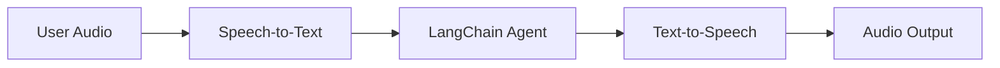
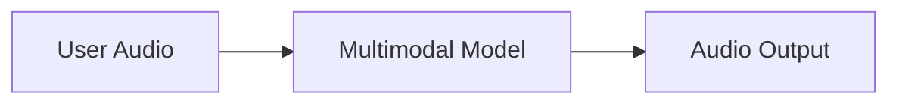

## 概述

聊天界面一直主导着我们与 AI 交互的方式，但多模态 AI 的最新突破正在开启令人兴奋的新可能性。高质量的生成模型和富有表现力的文本转语音 (TTS) 系统现在使得构建感觉不那么像工具而更像对话伙伴的代理成为可能。

语音代理就是这方面的一个例子。您可以不再依赖键盘和鼠标将输入输入到代理中，而是使用口语与之交互。这可能是一种更自然、更具吸引力的与 AI 交互的方式，对于某些上下文尤其有用。

### 什么是语音代理？

语音代理是可以与用户进行自然口语对话的 [代理](/oss/javascript/langchain/agents)。这些代理结合了语音识别、自然语言处理、生成式 AI 和文本转语音技术，以创建无缝、自然的对话。

它们适用于各种用例，包括：

- 客户支持
- 个人助理
- 免提界面
- 教练和培训

### 语音代理如何工作？

从宏观上看，每个语音代理都需要处理三个任务：

1. **听** - 捕获音频并将其转录
2. **想** - 解释意图、推理、计划
3. **说** - 生成音频并将其流回用户

区别在于这些步骤的排序和耦合方式。实际上，生产代理遵循两种主要架构之一：

#### 1. STT > Agent > TTS 架构（“三明治”）

三明治架构由三个不同的组件组成：语音转文本 (STT)、基于文本的 LangChain 代理和文本转语音 (TTS)。



**优点：**
- 完全控制每个组件（根据需要交换 STT/TTS 提供商）
- 访问现代文本模态模型的最新功能
- 透明的行为，组件之间界限清晰

**缺点：**
- 需要编排多个服务
- 管理管道的额外复杂性
- 从语音转换为文本会丢失信息（例如，语气、情感）

#### 2. 语音转语音架构 (S2S)

语音转语音使用多模态模型，该模型原生处理音频输入并生成音频输出。



**优点：**
- 架构更简单，移动部件更少
- 对于简单交互，通常延迟更低
- 直接音频处理可捕获语气和语音的其他细微差别

**缺点：**
- 模型选项有限，提供商锁定风险更大
- 功能可能落后于文本模态模型
- 音频处理方式的透明度较低
- 可控性和定制选项减少

本指南演示了 **三明治架构**，以平衡性能、可控性和对现代模型功能的访问。使用某些 STT 和 TTS 提供商，三明治架构可以实现低于 700 毫秒的延迟，同时保持对模块化组件的控制。

### 演示应用程序概述

我们将逐步构建一个使用三明治架构的语音代理。该代理将管理三明治店的订单。该应用程序将使用 [AssemblyAI](https://www.assemblyai.com/) 进行 STT 和 [Cartesia](https://cartesia.ai/) 进行 TTS 来演示三明治架构的所有三个组件（尽管可以为大多数提供商构建适配器）。

端到端参考应用程序可在 [voice-sandwich-demo](https://github.com/langchain-ai/voice-sandwich-demo) 存储库中找到。我们将在这里逐步介绍该应用程序。

该演示使用 WebSockets 在浏览器和服务器之间进行实时双向通信。相同的架构可以适用于其他传输，如电话系统（Twilio、Vonage）或 WebRTC 连接。

### 架构

该演示实现了一个流式管道，其中每个阶段异步处理数据：

**客户端（浏览器）**
- 捕获麦克风音频并将其编码为 PCM
- 建立到后端服务器的 WebSocket 连接
- 实时将音频块流式传输到服务器
- 接收并播放合成的语音音频


**服务器 (Node.js)**


- 接受来自客户端的 WebSocket 连接
- 编排三步管道：
  - [语音转文本 (STT)](#1-speech-to-text)：将音频转发给 STT 提供商（例如 AssemblyAI），接收转录事件
  - [代理](#2-langchain-agent)：使用 LangChain 代理处理转录，流式传输响应令牌
  - [文本转语音 (TTS)](#3-text-to-speech)：将代理响应发送给 TTS 提供商（例如 Cartesia），接收音频块

- 将合成音频返回给客户端进行播放


管道使用异步迭代器在每个阶段启用流式传输。这允许下游组件在上游阶段完成之前开始处理，从而最大限度地减少端到端延迟。


## 设置

有关详细的安装说明和设置，请参阅 [存储库 README](https://github.com/langchain-ai/voice-sandwich-demo#readme)。

## 1. 语音转文本

STT 阶段将传入的音频流转换为文本转录。该实现使用生产者-消费者模式来并发处理音频流和转录接收。

### 关键概念

**生产者-消费者模式**：音频块在接收转录事件的同时并发发送到 STT 服务。这允许转录在所有音频到达之前开始。

**事件类型**：
- `stt_chunk`：STT 服务处理音频时提供的部分转录
- `stt_output`：触发代理处理的最终格式化转录

**WebSocket 连接**：维护与 AssemblyAI 实时 STT API 的持久连接，配置为具有自动轮次格式化的 16kHz PCM 音频。

### 实现


```typescript
import { AssemblyAISTT } from "./assemblyai";
import type { VoiceAgentEvent } from "./types";

async function* sttStream(
  audioStream: AsyncIterable<Uint8Array>
): AsyncGenerator<VoiceAgentEvent> {
  const stt = new AssemblyAISTT({ sampleRate: 16000 });
  const passthrough = writableIterator<VoiceAgentEvent>();

  // Producer: pump audio chunks to AssemblyAI
  const producer = (async () => {
    try {
      for await (const audioChunk of audioStream) {
        await stt.sendAudio(audioChunk);
      }
    } finally {
      await stt.close();
    }
  })();

  // Consumer: receive transcription events
  const consumer = (async () => {
    for await (const event of stt.receiveEvents()) {
      passthrough.push(event);
    }
  })();

  try {
    // Yield events as they arrive
    yield* passthrough;
  } finally {
    // Wait for producer and consumer to complete
    await Promise.all([producer, consumer]);
  }
}
```


该应用程序实现了 AssemblyAI 客户端来管理 WebSocket 连接和消息解析。有关实现，请参见下文；可以为其他 STT 提供商构建类似的适配器。

<Accordion title="AssemblyAI Client">


```typescript
export class AssemblyAISTT {
  protected _bufferIterator = writableIterator<VoiceAgentEvent.STTEvent>();
  protected _connectionPromise: Promise<WebSocket> | null = null;

  async sendAudio(buffer: Uint8Array): Promise<void> {
    const conn = await this._connection;
    conn.send(buffer);
  }

  async *receiveEvents(): AsyncGenerator<VoiceAgentEvent.STTEvent> {
    yield* this._bufferIterator;
  }

  protected get _connection(): Promise<WebSocket> {
    if (this._connectionPromise) return this._connectionPromise;

    this._connectionPromise = new Promise((resolve, reject) => {
      const params = new URLSearchParams({
        sample_rate: this.sampleRate.toString(),
        format_turns: "true",
      });
      const url = `wss://streaming.assemblyai.com/v3/ws?${params}`;
      const ws = new WebSocket(url, {
        headers: { Authorization: this.apiKey },
      });

      ws.on("open", () => resolve(ws));

      ws.on("message", (data) => {
        const message = JSON.parse(data.toString());
        if (message.type === "Turn") {
          if (message.turn_is_formatted) {
            this._bufferIterator.push({
              type: "stt_output",
              transcript: message.transcript,
              ts: Date.now()
            });
          } else {
            this._bufferIterator.push({
              type: "stt_chunk",
              transcript: message.transcript,
              ts: Date.now()
            });
          }
        }
      });
    });

    return this._connectionPromise;
  }
}
```


</Accordion>

## 2. LangChain 代理

代理阶段通过 LangChain [代理](/oss/javascript/langchain/agents) 处理文本转录并流式传输响应令牌。在这种情况下，我们流式传输代理由生成的所有 [文本内容块](/oss/javascript/langchain/messages#textcontentblock)。

### 关键概念

**流式响应**：代理使用 [`stream_mode="messages"`](/oss/javascript/langchain/streaming#llm-tokens) 在生成响应令牌时发出它们，而不是等待完整的响应。这使得 TTS 阶段能够立即开始合成。

**对话记忆**：[检查点](/oss/javascript/langchain/short-term-memory) 使用唯一的线程 ID 跨轮次维护对话状态。这允许代理引用对话中的先前交换。

### 实现


```typescript
import { createAgent } from "langchain";
import { HumanMessage } from "@langchain/core/messages";
import { MemorySaver } from "@langchain/langgraph";
import { tool } from "@langchain/core/tools";
import { z } from "zod";
import { v4 as uuidv4 } from "uuid";

// Define agent tools
const addToOrder = tool(
  async ({ item, quantity }) => {
    return `Added ${quantity} x ${item} to the order.`;
  },
  {
    name: "add_to_order",
    description: "Add an item to the customer's sandwich order.",
    schema: z.object({
      item: z.string(),
      quantity: z.number(),
    }),
  }
);

const confirmOrder = tool(
  async ({ orderSummary }) => {
    return `Order confirmed: ${orderSummary}. Sending to kitchen.`;
  },
  {
    name: "confirm_order",
    description: "Confirm the final order with the customer.",
    schema: z.object({
      orderSummary: z.string().describe("Summary of the order"),
    }),
  }
);

// Create agent with tools and memory
const agent = createAgent({
  model: "claude-haiku-4-5",
  tools: [addToOrder, confirmOrder],
  checkpointer: new MemorySaver(),
  systemPrompt: `You are a helpful sandwich shop assistant.
Your goal is to take the user's order. Be concise and friendly.
Do NOT use emojis, special characters, or markdown.
Your responses will be read by a text-to-speech engine.`,
});

async function* agentStream(
  eventStream: AsyncIterable<VoiceAgentEvent>
): AsyncGenerator<VoiceAgentEvent> {
  // Generate unique thread ID for conversation memory
  const threadId = uuidv4();

  for await (const event of eventStream) {
    // Pass through all upstream events
    yield event;

    // Process final transcripts through the agent
    if (event.type === "stt_output") {
      const stream = await agent.stream(
        { messages: [new HumanMessage(event.transcript)] },
        {
          configurable: { thread_id: threadId },
          streamMode: "messages",
        }
      );

      // Yield agent response chunks as they arrive
      for await (const [message] of stream) {
        yield { type: "agent_chunk", text: message.text, ts: Date.now() };
      }
    }
  }
}
```


## 3. 文本转语音

TTS 阶段将代理响应文本合成为音频并将其流回客户端。与 STT 阶段一样，它使用生产者-消费者模式来处理并发文本发送和音频接收。

### 关键概念

**并发处理**：实现合并了两个异步流：
- **上游处理**：传递所有事件并将代理文本块发送给 TTS 提供商
- **音频接收**：从 TTS 提供商接收合成的音频块

**流式 TTS**：一些提供商（例如 [Cartesia](https://cartesia.ai/)）在收到文本后立即开始合成音频，从而使音频播放在代理完成生成其完整响应之前开始。

**事件传递**：所有上游事件均按原样流过，允许客户端或其他观察者跟踪完整的管道状态。

### 实现


```typescript
import { CartesiaTTS } from "./cartesia";

async function* ttsStream(
  eventStream: AsyncIterable<VoiceAgentEvent>
): AsyncGenerator<VoiceAgentEvent> {
  const tts = new CartesiaTTS();
  const passthrough = writableIterator<VoiceAgentEvent>();

  // Producer: read upstream events and send text to Cartesia
  const producer = (async () => {
    try {
      for await (const event of eventStream) {
        passthrough.push(event);
        if (event.type === "agent_chunk") {
          await tts.sendText(event.text);
        }
      }
    } finally {
      await tts.close();
    }
  })();

  // Consumer: receive audio from Cartesia
  const consumer = (async () => {
    for await (const event of tts.receiveEvents()) {
      passthrough.push(event);
    }
  })();

  try {
    // Yield events from both producer and consumer
    yield* passthrough;
  } finally {
    await Promise.all([producer, consumer]);
  }
}
```


该应用程序实现了 Cartesia 客户端来管理 WebSocket 连接和音频流。有关实现，请参见下文；可以为其他 TTS 提供商构建类似的适配器。

<Accordion title="Cartesia Client">


```typescript
export class CartesiaTTS {
  protected _bufferIterator = writableIterator<VoiceAgentEvent.TTSEvent>();
  protected _connectionPromise: Promise<WebSocket> | null = null;

  async sendText(text: string | null): Promise<void> {
    if (!text || !text.trim()) return;

    const conn = await this._connection;
    const payload = { text, try_trigger_generation: false };
    conn.send(JSON.stringify(payload));
  }

  async *receiveEvents(): AsyncGenerator<VoiceAgentEvent.TTSEvent> {
    yield* this._bufferIterator;
  }

  protected _generateContextId(): string {
    const timestamp = Date.now();
    const counter = this._contextCounter++;
    return `ctx_${timestamp}_${counter}`;
  }

  protected get _connection(): Promise<WebSocket> {
    if (this._connectionPromise) return this._connectionPromise;

    this._connectionPromise = new Promise((resolve, reject) => {
      const params = new URLSearchParams({
        api_key: this.apiKey,
        cartesia_version: this.cartesiaVersion,
      });
      const url = `wss://api.cartesia.ai/tts/websocket?${params.toString()}`;
      const ws = new WebSocket(url);

      ws.on("open", () => {
        resolve(ws);
      });

      ws.on("message", (data: WebSocket.RawData) => {
        const message: CartesiaTTSResponse = JSON.parse(data.toString());
        if (message.data) {
          this._bufferIterator.push({
            type: "tts_chunk",
            audio: message.data,
            ts: Date.now(),
          });
        } else if (message.error) {
          throw new Error(`Cartesia error: ${message.error}`);
        }
      });
    });

    return this._connectionPromise;
  }
}
```

</Accordion>

### LangSmith

您使用 LangChain 构建的许多应用程序将包含多个步骤，其中包含多次调用 LLM。随着这些应用程序变得越来越复杂，能够检查链或代理内部究竟发生了什么变得至关重要。最好的方法是使用 [LangSmith](https://smith.langchain.com)。

在上面的链接注册后，请确保设置环境变量以开始记录跟踪：

```shell
export LANGSMITH_TRACING="true"
export LANGSMITH_API_KEY="..."
```


## 总结

完整的管道将这三个阶段链接在一起：


```typescript
// using https://hono.dev/
app.get("/ws", upgradeWebSocket(async () => {
  const inputStream = writableIterator<Uint8Array>();

  // Chain the three stages
  const transcriptEventStream = sttStream(inputStream);
  const agentEventStream = agentStream(transcriptEventStream);
  const outputEventStream = ttsStream(agentEventStream);

  // Process pipeline and send TTS audio to client
  const flushPromise = (async () => {
    for await (const event of outputEventStream) {
      if (event.type === "tts_chunk") {
        currentSocket?.send(event.audio);
      }
    }
  })();

  return {
    onMessage(event) {
      // Push incoming audio into pipeline
      const data = event.data;
      if (Buffer.isBuffer(data)) {
        inputStream.push(new Uint8Array(data));
      }
    },
    async onClose() {
      inputStream.cancel();
      await flushPromise;
    },
  };
}));
```


每个阶段独立且并发地处理事件：音频到达后立即开始音频转录，转录可用后代理立即开始推理，生成代理文本后立即开始语音合成。这种架构可以实现低于 700 毫秒的延迟，以支持自然对话。

有关使用 LangChain 构建代理的更多信息，请参阅 [代理指南](/oss/javascript/langchain/agents)。

---

<div className="source-links">
<Callout icon="edit">
    [在 GitHub 上编辑此页面](https://github.com/langchain-ai/docs/edit/main/src/oss/langchain/voice-agent.mdx) 或 [提交 issue](https://github.com/langchain-ai/docs/issues/new/choose).
</Callout>
<Callout icon="terminal-2">
    [将这些文档连接](/use-these-docs) 到 Claude、VSCode 等，通过 MCP 获取实时解答。
</Callout>
</div>
