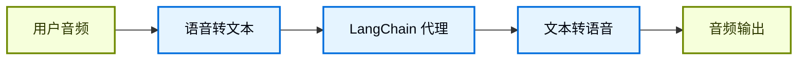
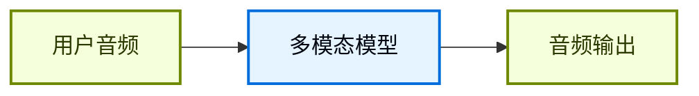

## 概述

聊天界面一直主导着我们与 AI 的交互方式，但多模态 AI 的最新突破正在开辟令人兴奋的新可能性。高质量的生成模型和富有表现力的文本转语音（TTS）系统现在使得构建感觉更像对话伙伴而非工具的代理成为可能。

语音代理就是其中一个例子。你无需依赖键盘和鼠标向代理输入内容，而是可以通过口语与之交互。这可以是一种更自然、更具吸引力的与 AI 交互的方式，并且在某些特定场景下尤其有用。

### 什么是语音代理？

语音代理是能够与用户进行自然口语对话的[代理](/oss/javascript/langchain/agents)。这些代理结合了语音识别、自然语言处理、生成式 AI 和文本转语音技术，以创造无缝、自然的对话体验。

它们适用于多种用例，包括：

- 客户支持
- 个人助理
- 免提界面
- 辅导与培训

### 语音代理如何工作？

从高层次来看，每个语音代理都需要处理三个任务：

1. **倾听** - 捕获音频并将其转录为文本
2. **思考** - 解释意图、推理、规划
3. **表达** - 生成音频并将其流式传输回用户

区别在于这些步骤如何排序和耦合。在实践中，生产环境中的代理遵循两种主要架构之一：

#### 1. STT > Agent > TTS 架构（“三明治”架构）

三明治架构由三个不同的组件构成：语音转文本（STT）、基于文本的 LangChain 代理和文本转语音（TTS）。


```mermaid
flowchart LR
    A[用户音频] --> B[语音转文本]
    B --> C[LangChain 代理]
    C --> D[文本转语音]
    D --> E[音频输出]

    classDef trigger fill:#F6FFDB,stroke:#6E8900,stroke-width:2px,color:#2E3900
    classDef process fill:#E5F4FF,stroke:#006DDD,stroke-width:2px,color:#030710

    class A,E trigger
    class B,C,D process
```

**优点：**
- 完全控制每个组件（可根据需要更换 STT/TTS 提供商）
- 可访问现代文本模态模型的最新功能
- 行为透明，组件之间界限清晰

**缺点：**
- 需要编排多个服务
- 管理管道的复杂性增加
- 从语音到文本的转换会丢失信息（例如，语调、情感）

#### 2. 语音到语音架构（S2S）

语音到语音使用多模态模型，该模型原生处理音频输入并生成音频输出。


```mermaid
flowchart LR
    A[用户音频] --> B[多模态模型]
    B --> C[音频输出]

    classDef trigger fill:#F6FFDB,stroke:#6E8900,stroke-width:2px,color:#2E3900
    classDef process fill:#E5F4FF,stroke:#006DDD,stroke-width:2px,color:#030710

    class A,C trigger
    class B process
```

**优点：**
- 架构更简单，活动组件更少
- 对于简单交互，通常延迟更低
- 直接音频处理能捕捉语调和其他语音细微差别

**缺点：**
- 模型选择有限，提供商锁定风险更大
- 功能可能落后于文本模态模型
- 音频处理过程的透明度较低
- 可控性和自定义选项减少

本指南演示了**三明治架构**，以平衡性能、可控性和对现代模型功能的访问。通过使用某些 STT 和 TTS 提供商，三明治架构可以实现低于 700 毫秒的延迟，同时保持对模块化组件的控制。

### 演示应用概述

我们将逐步讲解如何使用三明治架构构建一个基于语音的代理。该代理将管理一家三明治店的订单。该应用将演示三明治架构的所有三个组件，使用 [AssemblyAI](https://www.assemblyai.com/) 进行 STT，使用 [Cartesia](https://cartesia.ai/) 进行 TTS（尽管可以为大多数提供商构建适配器）。

端到端的参考应用可在 [voice-sandwich-demo](https://github.com/langchain-ai/voice-sandwich-demo) 仓库中找到。我们将在本文中逐步讲解该应用。

该演示使用 WebSockets 在浏览器和服务器之间进行实时双向通信。相同的架构可以适配其他传输方式，如电话系统（Twilio、Vonage）或 WebRTC 连接。

### 架构

该演示实现了一个流式管道，其中每个阶段异步处理数据：

**客户端（浏览器）**
- 捕获麦克风音频并将其编码为 PCM
- 与后端服务器建立 WebSocket 连接
- 实时将音频块流式传输到服务器
- 接收并播放合成的语音音频

**服务器（Node.js）**
- 接受来自客户端的 WebSocket 连接
- 编排三步管道：
  - [语音转文本（STT）](#1-语音转文本)：将音频转发给 STT 提供商（例如 AssemblyAI），接收转录事件
  - [代理](#2-langchain-代理)：使用 LangChain 代理处理转录文本，流式传输响应令牌
  - [文本转语音（TTS）](#3-文本转语音)：将代理响应发送给 TTS 提供商（例如 Cartesia），接收音频块
- 将合成的音频返回给客户端进行播放

该管道使用异步迭代器在每个阶段启用流式传输。这允许下游组件在上游阶段完成之前就开始处理，从而最小化端到端延迟。

## 设置

有关详细的安装说明和设置，请参阅[仓库 README](https://github.com/langchain-ai/voice-sandwich-demo#readme)。

## 1. 语音转文本

STT 阶段将传入的音频流转换为文本转录。该实现使用生产者-消费者模式来并发处理音频流和转录接收。

### 关键概念

**生产者-消费者模式**：音频块在发送到 STT 服务的同时接收转录事件。这允许在所有音频到达之前就开始转录。

**事件类型**：
- `stt_chunk`：STT 服务处理音频时提供的部分转录
- `stt_output`：触发代理处理的最终格式化转录

**WebSocket 连接**：维护与 AssemblyAI 实时 STT API 的持久连接，配置为 16kHz PCM 音频并启用自动轮次格式化。

### 实现

```typescript
import { AssemblyAISTT } from "./assemblyai";
import type { VoiceAgentEvent } from "./types";

async function* sttStream(
  audioStream: AsyncIterable<Uint8Array>
): AsyncGenerator<VoiceAgentEvent> {
  const stt = new AssemblyAISTT({ sampleRate: 16000 });
  const passthrough = writableIterator<VoiceAgentEvent>();

  // 生产者：将音频块泵送到 AssemblyAI
  const producer = (async () => {
    try {
      for await (const audioChunk of audioStream) {
        await stt.sendAudio(audioChunk);
      }
    } finally {
      await stt.close();
    }
  })();

  // 消费者：接收转录事件
  const consumer = (async () => {
    for await (const event of stt.receiveEvents()) {
      passthrough.push(event);
    }
  })();

  try {
    // 在事件到达时产出它们
    yield* passthrough;
  } finally {
    // 等待生产者和消费者完成
    await Promise.all([producer, consumer]);
  }
}
```

该应用实现了一个 AssemblyAI 客户端来管理 WebSocket 连接和消息解析。请参阅下方的实现；可以为其他 STT 提供商构建类似的适配器。

<Accordion title="AssemblyAI 客户端">

```typescript
export class AssemblyAISTT {
  protected _bufferIterator = writableIterator<VoiceAgentEvent.STTEvent>();
  protected _connectionPromise: Promise<WebSocket> | null = null;

  async sendAudio(buffer: Uint8Array): Promise<void> {
    const conn = await this._connection;
    conn.send(buffer);
  }

  async *receiveEvents(): AsyncGenerator<VoiceAgentEvent.STTEvent> {
    yield* this._bufferIterator;
  }

  protected get _connection(): Promise<WebSocket> {
    if (this._connectionPromise) return this._connectionPromise;

    this._connectionPromise = new Promise((resolve, reject) => {
      const params = new URLSearchParams({
        sample_rate: this.sampleRate.toString(),
        format_turns: "true",
      });
      const url = `wss://streaming.assemblyai.com/v3/ws?${params}`;
      const ws = new WebSocket(url, {
        headers: { Authorization: this.apiKey },
      });

      ws.on("open", () => resolve(ws));

      ws.on("message", (data) => {
        const message = JSON.parse(data.toString());
        if (message.type === "Turn") {
          if (message.turn_is_formatted) {
            this._bufferIterator.push({
              type: "stt_output",
              transcript: message.transcript,
              ts: Date.now()
            });
          } else {
            this._bufferIterator.push({
              type: "stt_chunk",
              transcript: message.transcript,
              ts: Date.now()
            });
          }
        }
      });
    });

    return this._connectionPromise;
  }
}
```

</Accordion>

## 2. LangChain 代理

代理阶段通过 LangChain [代理](/oss/javascript/langchain/agents)处理文本转录，并流式传输响应令牌。在这种情况下，我们流式传输代理生成的所有[文本内容块](/oss/javascript/langchain/messages#content-block-reference)。

### 关键概念

**流式响应**：代理使用 [`stream_mode="messages"`](/oss/javascript/langchain/streaming#llm-tokens) 在生成响应令牌时立即发出它们，而不是等待完整响应。这使得 TTS 阶段可以立即开始合成。

**对话记忆**：[检查点](/oss/javascript/langchain/short-term-memory)使用唯一的线程 ID 维护跨轮次的对话状态。这允许代理引用对话中的先前交流。

### 实现

```typescript
import { createAgent } from "langchain";
import { HumanMessage } from "@langchain/core/messages";
import { MemorySaver } from "@langchain/langgraph";
import { tool } from "@langchain/core/tools";
import { z } from "zod";
import { v7 as uuid7 } from "uuid";

// 定义代理工具
const addToOrder = tool(
  async ({ item, quantity }) => {
    return `已将 ${quantity} x ${item} 添加到订单中。`;
  },
  {
    name: "add_to_order",
    description: "将商品添加到客户的三明治订单中。",
    schema: z.object({
      item: z.string(),
      quantity: z.number(),
    }),
  }
);

const confirmOrder = tool(
  async ({ orderSummary }) => {
    return `订单已确认：${orderSummary}。正在发送至厨房。`;
  },
  {
    name: "confirm_order",
    description: "与客户确认最终订单。",
    schema: z.object({
      orderSummary: z.string().describe("订单摘要"),
    }),
  }
);

// 使用工具和记忆创建代理
const agent = createAgent({
  model: "claude-haiku-4-5",
  tools: [addToOrder, confirmOrder],
  checkpointer: new MemorySaver(),
  systemPrompt: `你是一个乐于助人的三明治店助手。
你的目标是接受用户的订单。请简洁友好。
不要使用表情符号、特殊字符或 Markdown。
你的回复将由文本转语音引擎朗读。`,
});

async function* agentStream(
  eventStream: AsyncIterable<VoiceAgentEvent>
): AsyncGenerator<VoiceAgentEvent> {
  // 为对话记忆生成唯一的线程 ID
  const threadId = uuidv4();

  for await (const event of eventStream) {
    // 传递所有上游事件
    yield event;

    // 通过代理处理最终转录
    if (event.type === "stt_output") {
      const stream = await agent.stream(
        { messages: [new HumanMessage(event.transcript)] },
        {
          configurable: { thread_id: threadId },
          streamMode: "messages",
        }
      );

      // 在代理响应块到达时产出它们
      for await (const [message] of stream) {
        yield { type: "agent_chunk", text: message.text, ts: Date.now() };
      }
    }
  }
}
```

## 3. 文本转语音

TTS 阶段将代理响应文本合成为音频，并将其流式传输回客户端。与 STT 阶段类似，它使用生产者-消费者模式来处理并发的文本发送和音频接收。

### 关键概念

**并发处理**：该实现合并了两个异步流：
- **上游处理**：传递所有事件，并将代理文本块发送给 TTS 提供商
- **音频接收**：从 TTS 提供商接收合成的音频块

**流式 TTS**：某些提供商（如 [Cartesia](https://cartesia.ai/)）在收到文本后立即开始合成音频，从而允许在代理完成生成完整响应之前就开始音频播放。

**事件透传**：所有上游事件原样传递，允许客户端或其他观察者跟踪完整的管道状态。

### 实现

```typescript
import { CartesiaTTS } from "./cartesia";

async function* ttsStream(
  eventStream: AsyncIterable<VoiceAgentEvent>
): AsyncGenerator<VoiceAgentEvent> {
  const tts = new CartesiaTTS();
  const passthrough = writableIterator<VoiceAgentEvent>();

  // 生产者：读取上游事件并将文本发送给 Cartesia
  const producer = (async () => {
    try {
      for await (const event of eventStream) {
        passthrough.push(event);
        if (event.type === "agent_chunk") {
          await tts.sendText(event.text);
        }
      }
    } finally {
      await tts.close();
    }
  })();

  // 消费者：从 Cartesia 接收音频
  const consumer = (async () => {
    for await (const event of tts.receiveEvents()) {
      passthrough.push(event);
    }
  })();

  try {
    // 产出来自生产者和消费者的事件
    yield* passthrough;
  } finally {
    await Promise.all([producer, consumer]);
  }
}
```

该应用实现了一个 Cartesia 客户端来管理 WebSocket 连接和音频流。请参阅下方的实现；可以为其他 TTS 提供商构建类似的适配器。

<Accordion title="Cartesia 客户端">

```typescript
export class CartesiaTTS {
  protected _bufferIterator = writableIterator<VoiceAgentEvent.TTSEvent>();
  protected _connectionPromise: Promise<WebSocket> | null = null;

  async sendText(text: string | null): Promise<void> {
    if (!text || !text.trim()) return;

    const conn = await this._connection;
    const payload = { text, try_trigger_generation: false };
    conn.send(JSON.stringify(payload));
  }

  async *receiveEvents(): AsyncGenerator<VoiceAgentEvent.TTSEvent> {
    yield* this._bufferIterator;
  }

  protected _generateContextId(): string {
    const timestamp = Date.now();
    const counter = this._contextCounter++;
    return `ctx_${timestamp}_${counter}`;
  }

  protected get _connection(): Promise<WebSocket> {
    if (this._connectionPromise) return this._connectionPromise;

    this._connectionPromise = new Promise((resolve, reject) => {
      const params = new URLSearchParams({
        api_key: this.apiKey,
        cartesia_version: this.cartesiaVersion,
      });
      const url = `wss://api.cartesia.ai/tts/websocket?${params.toString()}`;
      const ws = new WebSocket(url);

      ws.on("open", () => {
        resolve(ws);
      });

      ws.on("message", (data: WebSocket.RawData) => {
        const message: CartesiaTTSResponse = JSON.parse(data.toString());
        if (message.data) {
          this._bufferIterator.push({
            type: "tts_chunk",
            audio: message.data,
            ts: Date.now(),
          });
        } else if (message.error) {
          throw new Error(`Cartesia 错误：${message.error}`);
        }
      });
    });

    return this._connectionPromise;
  }
}
```

</Accordion>

### LangSmith

你使用 LangChain 构建的许多应用程序将包含多个步骤和多次 LLM 调用。随着这些应用程序变得越来越复杂，能够检查链或代理内部到底发生了什么变得至关重要。最好的方法是使用 [LangSmith](https://smith.langchain.com)。

在上面的链接注册后，请确保设置环境变量以开始记录跟踪：

```shell
export LANGSMITH_TRACING="true"
export LANGSMITH_API_KEY="..."
```

## 整合所有部分

完整的管道将三个阶段链接在一起：

```typescript
// 使用 https://hono.dev/
app.get("/ws", upgradeWebSocket(async () => {
  const inputStream = writableIterator<Uint8Array>();

  // 链接三个阶段
  const transcriptEventStream = sttStream(inputStream);
  const agentEventStream = agentStream(transcriptEventStream);
  const outputEventStream = ttsStream(agentEventStream);

  // 处理管道并将 TTS 音频发送给客户端
  const flushPromise = (async () => {
    for await (const event of outputEventStream) {
      if (event.type === "tts_chunk") {
        currentSocket?.send(event.audio);
      }
    }
  })();

  return {
    onMessage(event) {
      // 将传入的音频推送到管道中
      const data = event.data;
      if (Buffer.isBuffer(data)) {
        inputStream.push(new Uint8Array(data));
      }
    },
    async onClose() {
      inputStream.cancel();
      await flushPromise;
    },
  };
}));
```

每个阶段独立且并发地处理事件：音频转录在音频到达时立即开始，代理在转录文本可用时立即开始推理，语音合成在代理文本生成时立即开始。这种架构可以实现低于 700 毫秒的延迟，以支持自然对话。

有关使用 LangChain 构建代理的更多信息，请参阅[代理指南](/oss/javascript/langchain/agents)。

---

<div className="source-links">
<Callout icon="terminal-2">
    [将这些文档](/use-these-docs)通过 MCP 连接到 Claude、VSCode 等，以获取实时答案。
</Callout>
<Callout icon="edit">
    [在 GitHub 上编辑此页面](https://github.com/langchain-ai/docs/edit/main/src/oss/langchain/voice-agent.mdx) 或 [提交问题](https://github.com/langchain-ai/docs/issues/new/choose)。
</Callout>
</div>