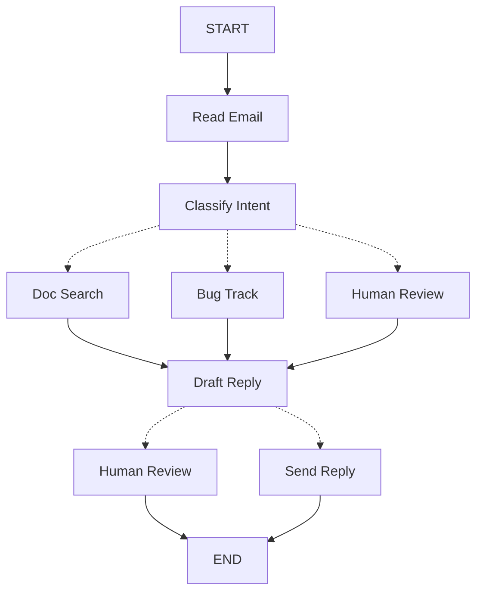

当您使用 LangGraph 构建代理时，首先要将其分解为称为 **节点 (nodes)** 的离散步骤。然后，您将描述节点之间的不同决策和转换。最后，您通过共享的 **状态 (state)** 将节点连接在一起，每个节点都可以从中读取和写入。

在本演练中，我们将引导您完成使用 LangGraph 构建客户支持电子邮件代理的思维过程。

## 从您想要自动化的流程开始

假设您需要构建一个 AI 代理来处理客户支持电子邮件。您的产品团队为您提供了以下需求：

```txt
代理应该：

- 读取传入的客户电子邮件
- 按紧急程度和主题对其进行分类
- 搜索相关文档以回答问题
- 起草适当的回复
- 将复杂问题升级给人工代理
- 需要时安排后续跟进

要处理的示例场景：

1. 简单的产品问题：“如何重置我的密码？”
2. 错误报告：“当我选择 PDF 格式时导出功能崩溃”
3. 紧急账单问题：“我的订阅被扣了两次费！”
4. 功能请求：“你们能在移动应用中添加深色模式吗？”
5. 复杂的技术问题：“我们的 API 集成间歇性失败，出现 504 错误”
```

要在 LangGraph 中实现代理，您通常遵循相同的五个步骤。

## 第 1 步：将您的工作流映射为离散步骤

首先识别流程中的不同步骤。每个步骤将成为一个 **节点**（执行特定操作的函数）。然后，草绘这些步骤如何相互连接。



此图中的箭头显示了可能的路径，但实际采取哪条路径的决定发生在每个节点内部。

现在我们已经确定了工作流中的组件，让我们了解每个节点需要做什么：

- `Read Email`：提取和解析电子邮件内容
- `Classify Intent`：使用 LLM 对紧急程度和主题进行分类，然后路由到适当的操作
- `Doc Search`：查询您的知识库以获取相关信息
- `Bug Track`：在跟踪系统中创建或更新问题
- `Draft Reply`：生成适当的回复
- `Human Review`：升级给人工代理以进行批准或处理
- `Send Reply`：发送电子邮件回复

<Tip>
请注意，有些节点决定下一步去哪里（`Classify Intent`, `Draft Reply`, `Human Review`），而其他节点总是通过相同的下一步（`Read Email` 总是去 `Classify Intent`，`Doc Search` 总是去 `Draft Reply`）。
</Tip>

## 第 2 步：确定每个步骤需要做什么

对于图中的每个节点，确定它代表什么类型的操作以及它正常工作需要什么上下文。

<CardGroup cols={2}>
    <Card title="LLM 步骤" icon="brain" href="#llm-steps">
        当您需要理解、分析、生成文本或做出推理决策时使用
    </Card>
    <Card title="数据步骤" icon="database" href="#data-steps">
        当您需要从外部来源检索信息时使用
    </Card>
    <Card title="操作步骤" icon="bolt" href="#action-steps">
        当您需要执行外部操作时使用
    </Card>
    <Card title="用户输入步骤" icon="user" href="#user-input-steps">
        当您需要人工干预时使用
    </Card>
</CardGroup>

### LLM 步骤

当步骤需要理解、分析、生成文本或做出推理决策时：

<AccordionGroup>
    <Accordion title="分类意图">
        - 静态上下文（提示）：分类类别、紧急程度定义、响应格式
        - 动态上下文（来自状态）：电子邮件内容、发件人信息
        - 期望结果：确定路由的结构化分类
    </Accordion>

    <Accordion title="起草回复">
        - 静态上下文（提示）：语气指南、公司政策、回复模板
        - 动态上下文（来自状态）：分类结果、搜索结果、客户历史记录
        - 期望结果：准备好进行审查的专业电子邮件回复
    </Accordion>
</AccordionGroup>

### 数据步骤

当步骤需要从外部来源检索信息时：

<AccordionGroup>
    <Accordion title="文档搜索">
        - 参数：根据意图和主题构建的查询
        - 重试策略：是的，对于瞬态故障使用指数退避
        - 缓存：可以缓存常见查询以减少 API 调用
    </Accordion>

    <Accordion title="客户历史记录查找">
        - 参数：来自状态的客户电子邮件或 ID
        - 重试策略：是的，但如果不可用则回退到基本信息
        - 缓存：是的，使用生存时间来平衡新鲜度和性能
    </Accordion>
</AccordionGroup>

### 操作步骤

当步骤需要执行外部操作时：

<AccordionGroup>
    <Accordion title="发送回复">
        - 何时执行节点：批准后（人工或自动）
        - 重试策略：是的，对于网络问题使用指数退避
        - 不应缓存：每次发送都是唯一的操作
    </Accordion>

    <Accordion title="Bug 跟踪">
        - 何时执行节点：当意图为“bug”时总是执行
        - 重试策略：是的，不丢失错误报告至关重要
        - 返回：包含在回复中的票证 ID
    </Accordion>
</AccordionGroup>

### 用户输入步骤

当步骤需要人工干预时：

<AccordionGroup>
    <Accordion title="人工审查节点">
        - 决策上下文：原始电子邮件、回复草稿、紧急程度、分类
        - 预期输入格式：批准布尔值加上可选的编辑后的回复
        - 何时触发：高紧急程度、复杂问题或质量问题
    </Accordion>
</AccordionGroup>

## 第 3 步：设计您的状态

状态是代理中所有节点都可以访问的共享 [内存](/oss/javascript/concepts/memory)。将其视为您的代理在处理流程时用来跟踪它学到的和决定的所有内容的笔记本。

### 什么属于状态？

关于每一部分数据，问自己这些问题：

<CardGroup cols={2}>
    <Card title="包含在状态中" icon="check">
        它需要在步骤之间持久化吗？如果是，它进入状态。
    </Card>

    <Card title="不存储" icon="code">
        您可以从其他数据派生它吗？如果是，请在需要时计算它，而不是将其存储在状态中。
    </Card>
</CardGroup>

对于我们的电子邮件代理，我们需要跟踪：

- 原始电子邮件和发件人信息（稍后无法重建这些）
- 分类结果（多个后续/下游节点需要）
- 搜索结果和客户数据（重新获取成本高昂）
- 回复草稿（需要在审查中持久化）
- 执行元数据（用于调试和恢复）

### 保持状态原始，按需格式化提示

<Tip>
    一个关键原则：您的状态应该存储原始数据，而不是格式化的文本。在需要时在节点内部格式化提示。
</Tip>

这种分离意味着：

- 不同的节点可以根据需要以不同方式格式化相同的数据
- 您可以更改提示模板而无需修改状态模式
- 调试更清晰——您可以确切地看到每个节点接收到的数据
- 您的代理可以演进而不破坏现有状态

让我们定义我们的状态：


```typescript
import { StateSchema } from "@langchain/langgraph";
import * as z from "zod";

// 定义电子邮件分类的结构
const EmailClassificationSchema = z.object({
  intent: z.enum(["question", "bug", "billing", "feature", "complex"]),
  urgency: z.enum(["low", "medium", "high", "critical"]),
  topic: z.string(),
  summary: z.string(),
});

const EmailAgentState = new StateSchema({
  // 原始电子邮件数据
  emailContent: z.string(),
  senderEmail: z.string(),
  emailId: z.string(),

  // 分类结果
  classification: EmailClassificationSchema.optional(),

  // 原始搜索/API 结果
  searchResults: z.array(z.string()).optional(),  // 原始文档块列表
  customerHistory: z.record(z.string(), z.any()).optional(),  // 来自 CRM 的原始客户数据

  // 生成的内容
  responseText: z.string().optional(),
});

type EmailClassificationType = z.infer<typeof EmailClassificationSchema>;
```


请注意，状态仅包含原始数据——没有提示模板，没有格式化的字符串，没有说明。分类输出直接作为单个字典从 LLM 存储。

## 第 4 步：构建您的节点


现在我们将每个步骤实现为一个函数。LangGraph 中的节点只是一个 JavaScript 函数，它接受当前状态并返回对其的更新。


### 适当处理错误

不同的错误需要不同的处理策略：

| 错误类型 | 谁修复它 | 策略 | 何时使用 |
|------------|--------------|----------|-------------|
| 瞬态错误（网络问题、速率限制） | 系统（自动） | 重试策略 | 通常重试即可解决的临时故障 |
| LLM 可恢复错误（工具故障、解析问题） | LLM | 将错误存储在状态中并循环回退 | LLM 可以看到错误并调整其方法 |
| 用户可修复错误（缺少信息、说明不清） | 人类 | 使用 `interrupt()` 暂停 | 需要用户输入才能继续 |
| 意外错误 | 开发人员 | 让它们冒泡 | 需要调试的未知问题 |

<Tabs>
    <Tab title="瞬态错误" icon="rotate">
        添加重试策略以自动重试网络问题和速率限制：


    ```typescript
    import type { RetryPolicy } from "@langchain/langgraph";

    workflow.addNode(
      "searchDocumentation",
      searchDocumentation,
      {
        retryPolicy: { maxAttempts: 3, initialInterval: 1.0 },
      },
    );
    ```


    </Tab>

    <Tab title="LLM 可恢复" icon="brain">
        将错误存储在状态中并循环回退，以便 LLM 可以看到出了什么问题并重试：


    ```typescript
    import { Command, GraphNode } from "@langchain/langgraph";

    const executeTool: GraphNode<typeof State> = async (state, config) => {
      try {
        const result = await runTool(state.toolCall);
        return new Command({
          update: { toolResult: result },
          goto: "agent",
        });
      } catch (error) {
        // 让 LLM 看到出了什么问题并重试
        return new Command({
          update: { toolResult: `Tool error: ${error}` },
          goto: "agent"
        });
      }
    }
    ```


    </Tab>

    <Tab title="用户可修复" icon="user">
        在需要时暂停并从用户那里收集信息（如帐户 ID、订单号或说明）：


    ```typescript
    import { Command, GraphNode, interrupt } from "@langchain/langgraph";

    const lookupCustomerHistory: GraphNode<typeof State> = async (state, config) => {
      if (!state.customerId) {
        const userInput = interrupt({
          message: "Customer ID needed",
          request: "Please provide the customer's account ID to look up their subscription history",
        });
        return new Command({
          update: { customerId: userInput.customerId },
          goto: "lookupCustomerHistory",
        });
      }
      // 现在继续查找
      const customerData = await fetchCustomerHistory(state.customerId);
      return new Command({
        update: { customerHistory: customerData },
        goto: "draftResponse",
      });
    }
    ```


    </Tab>

    <Tab title="意外" icon="alert-triangle">
        让它们冒泡以进行调试。不要捕获您无法处理的内容：


    ```typescript
    import { Command, GraphNode } from "@langchain/langgraph";

    const sendReply: GraphNode<typeof EmailAgentState> = async (state, config) => {
      try {
        await emailService.send(state.responseText);
      } catch (error) {
        throw error;  // 表面意外错误
      }
    }
    ```


    </Tab>
</Tabs>


### 实现我们的电子邮件代理节点

我们将把每个节点实现为一个简单的函数。请记住：节点接受状态，执行工作，并返回更新。

<AccordionGroup>
    <Accordion title="读取和分类节点" icon="brain">


    ```typescript
    import { StateGraph, START, END, GraphNode, Command } from "@langchain/langgraph";
    import { HumanMessage } from "@langchain/core/messages";
    import { ChatAnthropic } from "@langchain/anthropic";

    const llm = new ChatAnthropic({ model: "claude-sonnet-4-6" });

    const readEmail: GraphNode<typeof EmailAgentState> = async (state, config) => {
      // 提取和解析电子邮件内容
      // 在生产环境中，这将连接到您的电子邮件服务
      console.log(`Processing email: ${state.emailContent}`);
      return {};
    }

    const classifyIntent: GraphNode<typeof EmailAgentState> = async (state, config) => {
      // 使用 LLM 对电子邮件意图和紧急程度进行分类，然后相应地路由

      // 创建返回 EmailClassification 对象的结构化 LLM
      const structuredLlm = llm.withStructuredOutput(EmailClassificationSchema);

      // 按需格式化提示，不存储在状态中
      const classificationPrompt = `
      Analyze this customer email and classify it:

      Email: ${state.emailContent}
      From: ${state.senderEmail}

      Provide classification including intent, urgency, topic, and summary.
      `;

      // 直接以对象形式获取结构化响应
      const classification = await structuredLlm.invoke(classificationPrompt);

      // 根据分类确定下一个节点
      let nextNode: "searchDocumentation" | "humanReview" | "draftResponse" | "bugTracking";

      if (classification.intent === "billing" || classification.urgency === "critical") {
        nextNode = "humanReview";
      } else if (classification.intent === "question" || classification.intent === "feature") {
        nextNode = "searchDocumentation";
      } else if (classification.intent === "bug") {
        nextNode = "bugTracking";
      } else {
        nextNode = "draftResponse";
      }

      // 将分类作为单个对象存储在状态中
      return new Command({
        update: { classification },
        goto: nextNode,
      });
    }
    ```


    </Accordion>

    <Accordion title="搜索和跟踪节点" icon="database">


    ```typescript
    import { Command, GraphNode } from "@langchain/langgraph";

    const searchDocumentation: GraphNode<typeof EmailAgentState> = async (state, config) => {
      // 在知识库中搜索相关信息

      // 从分类构建搜索查询
      const classification = state.classification!;
      const query = `${classification.intent} ${classification.topic}`;

      let searchResults: string[];

      try {
        // 在此处实现您的搜索逻辑
        // 存储原始搜索结果，而不是格式化文本
        searchResults = [
          "Reset password via Settings > Security > Change Password",
          "Password must be at least 12 characters",
          "Include uppercase, lowercase, numbers, and symbols",
        ];
      } catch (error) {
        // 对于可恢复的搜索错误，存储错误并继续
        searchResults = [`Search temporarily unavailable: ${error}`];
      }

      return new Command({
        update: { searchResults },  // 存储原始结果或错误
        goto: "draftResponse",
      });
    }

    const bugTracking: GraphNode<typeof EmailAgentState> = async (state, config) => {
      // 创建或更新错误跟踪票证

      // 在您的错误跟踪系统中创建票证
      const ticketId = "BUG-12345";  // 将通过 API 创建
      
      return new Command({
        update: { searchResults: [`Bug ticket ${ticketId} created`] },
        goto: "draftResponse",
      });
    }
    ```

    </Accordion>

    <Accordion title="回复节点" icon="edit">


    ```typescript
    import { Command, interrupt } from "@langchain/langgraph";

    const draftResponse: GraphNode<typeof EmailAgentState> = async (state, config) => {
      // 使用上下文生成回复并根据质量进行路由

      const classification = state.classification!;

      // 按需从原始状态数据格式化上下文
      const contextSections: string[] = [];

      if (state.searchResults) {
        // 为提示格式化搜索结果
        const formattedDocs = state.searchResults.map(doc => `- ${doc}`).join("\n");
        contextSections.push(`Relevant documentation:\n${formattedDocs}`);
      }

      if (state.customerHistory) {
        // 为提示格式化客户数据
        contextSections.push(`Customer tier: ${state.customerHistory.tier ?? "standard"}`);
      }

      // 使用格式化的上下文构建提示
      const draftPrompt = `
      Draft a response to this customer email:
      ${state.emailContent}

      Email intent: ${classification.intent}
      Urgency level: ${classification.urgency}

      ${contextSections.join("\n\n")}

      Guidelines:
      - Be professional and helpful
      - Address their specific concern
      - Use the provided documentation when relevant
      `;

      const response = await llm.invoke([new HumanMessage(draftPrompt)]);

      // 根据紧急程度和意图确定是否需要人工审查
      const needsReview = (
        classification.urgency === "high" ||
        classification.urgency === "critical" ||
        classification.intent === "complex"
      );

      // 路由到适当的下一个节点
      const nextNode = needsReview ? "humanReview" : "sendReply";

      return new Command({
        update: { responseText: response.content.toString() },  // 仅存储原始回复
        goto: nextNode,
      });
    }

    const humanReview: GraphNode<typeof EmailAgentState> = async (state, config) => {
      // 使用 interrupt 暂停以进行人工审查，并根据决定进行路由
      const classification = state.classification!;

      // interrupt() 必须首先出现 - 它之前的任何代码在恢复时都会重新运行
      const humanDecision = interrupt({
        emailId: state.emailId,
        originalEmail: state.emailContent,
        draftResponse: state.responseText,
        urgency: classification.urgency,
        intent: classification.intent,
        action: "Please review and approve/edit this response",
      });

      // 现在处理人工的决定
      if (humanDecision.approved) {
        return new Command({
          update: { responseText: humanDecision.editedResponse || state.responseText },
          goto: "sendReply",
        });
      } else {
        // 拒绝意味着人工将直接处理
        return new Command({ update: {}, goto: END });
      }
    }

    const sendReply: GraphNode<typeof EmailAgentState> = async (state, config) => {
      // 发送电子邮件回复
      // 与电子邮件服务集成
      console.log(`Sending reply: ${state.responseText!.substring(0, 100)}...`);
      return {};
    }
    ```


    </Accordion>
</AccordionGroup>

## 第 5 步：将其连接起来

现在我们将节点连接成一个工作的图。由于我们的节点处理自己的路由决策，我们只需要几个基本的边。

要启用带有 `interrupt()` 的 [人机交互](/oss/javascript/langgraph/interrupts)，我们需要使用 [检查点器](/oss/javascript/langgraph/persistence) 进行编译，以在运行之间保存状态：

<Accordion title="图编译代码" icon="sitemap" defaultOpen={true}>


```typescript
import { MemorySaver, RetryPolicy } from "@langchain/langgraph";

// 创建图
const workflow = new StateGraph(EmailAgentState)
  // 添加具有适当错误处理的节点
  .addNode("readEmail", readEmail)
  .addNode("classifyIntent", classifyIntent)
  // 为可能出现瞬态故障的节点添加重试策略
  .addNode(
    "searchDocumentation",
    searchDocumentation,
    { retryPolicy: { maxAttempts: 3 } },
  )
  .addNode("bugTracking", bugTracking)
  .addNode("draftResponse", draftResponse)
  .addNode("humanReview", humanReview)
  .addNode("sendReply", sendReply)
  // 仅添加基本边
  .addEdge(START, "readEmail")
  .addEdge("readEmail", "classifyIntent")
  .addEdge("sendReply", END);

// 使用检查点器编译以实现持久性
const memory = new MemorySaver();
const app = workflow.compile({ checkpointer: memory });
```


</Accordion>


图结构很小，因为路由通过 `Command` 对象在节点内部发生。每个节点声明它可以去哪里，使流程明确且可追踪。


### 试用您的代理

让我们用一个需要人工审查的紧急账单问题来运行我们的代理：

<Accordion title="测试代理" icon="flask">


```typescript
// 使用紧急账单问题进行测试
const initialState: EmailAgentStateType = {
  emailContent: "I was charged twice for my subscription! This is urgent!",
  senderEmail: "customer@example.com",
  emailId: "email_123"
};

// 使用 thread_id 运行以实现持久性
const config = { configurable: { thread_id: "customer_123" } };
const result = await app.invoke(initialState, config);
// 图将在 human_review 处暂停
console.log(`Draft ready for review: ${result.responseText?.substring(0, 100)}...`);
```
```typescript
import { Command } from "@langchain/langgraph";

// 准备好后，提供人工输入以恢复
const humanResponse = new Command({
  resume: {
    approved: true,
    editedResponse: "We sincerely apologize for the double charge. I've initiated an immediate refund...",
  }
});

// 恢复执行
const finalResult = await app.invoke(humanResponse, config);
console.log("Email sent successfully!");
```


</Accordion>

当图遇到 `interrupt()` 时会暂停，将所有内容保存到检查点器，并等待。它可以在几天后恢复，从中断的确切位置继续。`thread_id` 确保此对话的所有状态都一起保存。

## 总结和后续步骤

### 关键见解

构建此电子邮件代理向我们展示了 LangGraph 的思维方式：

<CardGroup cols={2}>
    <Card title="分解为离散步骤" icon="sitemap" href="#step-1-map-out-your-workflow-as-discrete-steps">
        每个节点只做一件事。这种分解实现了流式进度更新、可以暂停和恢复的持久执行，以及清晰的调试，因为您可以检查步骤之间的状态。
    </Card>

    <Card title="状态是共享内存" icon="database" href="#step-3-design-your-state">
        存储原始数据，而不是格式化的文本。这让不同的节点以不同的方式使用相同的信息。
    </Card>

    <Card title="节点是函数" icon="code" href="#step-4-build-your-nodes">
        它们接受状态，执行工作，并返回更新。当它们需要做出路由决策时，它们指定状态更新和下一个目的地。
    </Card>

    <Card title="错误是流程的一部分" icon="alert-triangle" href="#handle-errors-appropriately">
        瞬态故障会重试，LLM 可恢复的错误会带着上下文循环回退，用户可修复的问题会暂停以等待输入，意外错误会冒泡以进行调试。
    </Card>

    <Card title="人工输入是一等公民" icon="user" href="/oss/javascript/langgraph/interrupts">
        `interrupt()` 函数无限期暂停执行，保存所有状态，并在您提供输入时从中断的确切位置恢复。当与节点中的其他操作结合使用时，它必须首先出现。
    </Card>

    <Card title="图结构自然涌现" icon="sitemap" href="#step-5-wire-it-together">
        您定义基本连接，您的节点处理它们自己的路由逻辑。这保持了控制流的明确和可追踪——您总是可以通过查看当前节点来了解您的代理下一步将做什么。
    </Card>
</CardGroup>

### 高级注意事项

<Accordion title="节点粒度权衡" icon="adjustments">
<Info>
本节探讨节点粒度设计的权衡。大多数应用程序可以跳过此部分并使用上面显示的模式。
</Info>

您可能会想：为什么不将 `Read Email` 和 `Classify Intent` 合并到一个节点中？

或者为什么将 Doc Search 与 Draft Reply 分开？

答案涉及弹性与可观测性之间的权衡。

**弹性考虑：** LangGraph 的 [持久执行](/oss/javascript/langgraph/durable-execution) 在节点边界创建检查点。当工作流在中断或失败后恢复时，它从停止执行的节点的开头开始。较小的节点意味着更频繁的检查点，这意味着如果出现问题，需要重复的工作更少。如果您将多个操作合并到一个大节点中，接近末尾的故障意味着重新执行该节点开始的所有内容。

我们为此电子邮件代理选择此细分的原因：

- **外部服务的隔离：** Doc Search 和 Bug Track 是单独的节点，因为它们调用外部 API。如果搜索服务缓慢或失败，我们要将其与 LLM 调用隔离开来。我们可以为这些特定节点添加重试策略，而不会影响其他节点。

- **中间可见性：** 将 `Classify Intent` 作为自己的节点让我们可以在采取行动之前检查 LLM 的决定。这对于调试和监控非常有价值——您可以确切地看到代理何时以及为何路由到人工审查。

- **不同的故障模式：** LLM 调用、数据库查找和电子邮件发送具有不同的重试策略。单独的节点让您可以独立配置这些策略。

- **可重用性和测试：** 较小的节点更容易隔离测试并在其他工作流中重用。

另一种有效的方法：您可以将 `Read Email` 和 `Classify Intent` 合并到一个节点中。您将失去在分类之前检查原始电子邮件的能力，并且在该节点出现任何故障时都会重复这两个操作。对于大多数应用程序，单独节点的可观测性和调试优势值得这种权衡。

应用程序级关注点：第 2 步中的缓存讨论（是否缓存搜索结果）是一个应用程序级决策，而不是 LangGraph 框架功能。您根据特定要求在节点函数内实现缓存——LangGraph 不对此进行规定。

性能注意事项：更多节点并不意味着执行速度变慢。LangGraph 默认在后台写入检查点（[异步持久性模式](/oss/javascript/langgraph/durable-execution#durability-modes)），因此您的图继续运行而无需等待检查点完成。这意味着您可以在对性能影响最小的情况下获得频繁的检查点。如果需要，您可以调整此行为——使用 `"exit"` 模式仅在完成时进行检查点，或使用 `"sync"` 模式阻止执行直到每个检查点写入完成。
</Accordion>

### 下一步去哪里

这是关于使用 LangGraph 构建代理的思维方式的介绍。您可以通过以下方式扩展此基础：

<CardGroup cols={2}>
    <Card title="人机交互模式" icon="user-check" href="/oss/javascript/langgraph/interrupts">
        了解如何在执行前添加工具批准、批量批准和其他模式
    </Card>

    <Card title="子图" icon="hierarchy" href="/oss/javascript/langgraph/use-subgraphs">
        为复杂的多步骤操作创建子图
    </Card>

    <Card title="流式传输" icon="broadcast" href="/oss/javascript/langgraph/streaming">
        添加流式传输以向用户显示实时进度
    </Card>

    <Card title="可观测性" icon="chart-line" href="/oss/javascript/langgraph/observability">
        使用 LangSmith 添加可观测性以进行调试和监控
    </Card>

    <Card title="工具集成" icon="tool" href="/oss/javascript/langchain/tools">
        集成更多用于网络搜索、数据库查询和 API 调用的工具
    </Card>

    <Card title="重试逻辑" icon="rotate" href="/oss/javascript/langgraph/use-graph-api#add-retry-policies">
        为失败的操作实现带有指数退避的重试逻辑
    </Card>
</CardGroup>

---

<div className="source-links">
<Callout icon="edit">
    [在 GitHub 上编辑此页面](https://github.com/langchain-ai/docs/edit/main/src/oss/langgraph/thinking-in-langgraph.mdx) 或 [提交问题](https://github.com/langchain-ai/docs/issues/new/choose)。
</Callout>
<Callout icon="terminal-2">
    通过 MCP [将这些文档连接](/use-these-docs) 到 Claude、VSCode 等以获取实时解答。
</Callout>
</div>
