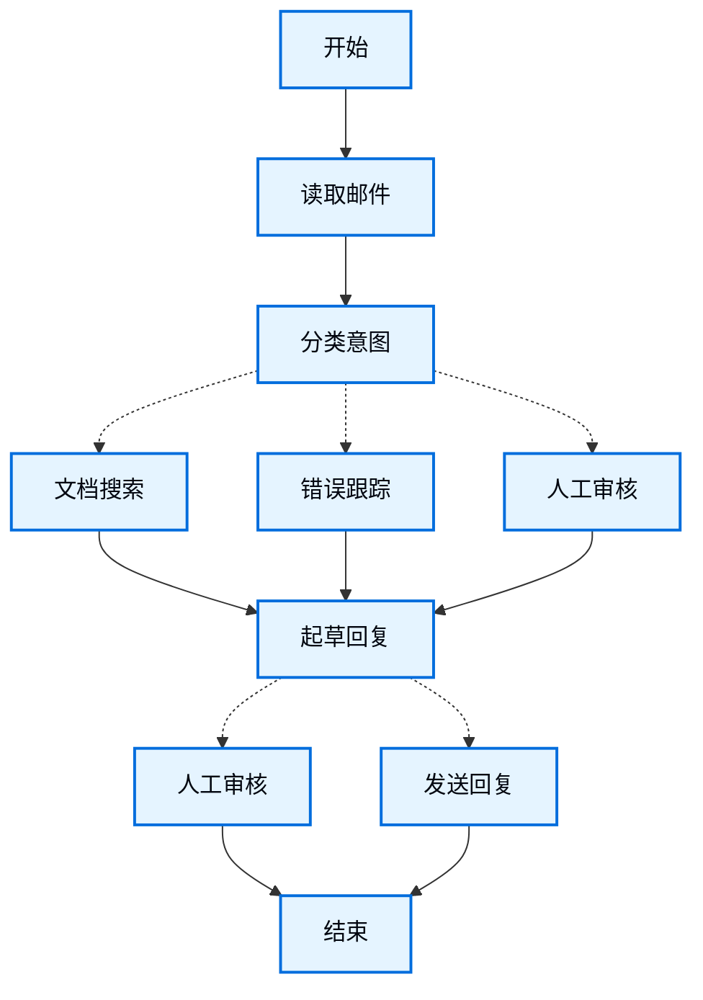

当你使用 LangGraph 构建代理时，首先会将其分解为称为**节点**的离散步骤。然后，你将描述每个节点的不同决策和转换。最后，你通过一个共享的**状态**将节点连接起来，每个节点都可以读取和写入该状态。

在本指南中，我们将引导你了解使用 LangGraph 构建客户支持邮件代理的思考过程。

## 从你想要自动化的过程开始

假设你需要构建一个处理客户支持邮件的 AI 代理。你的产品团队给出了以下要求：

```txt
代理应该：

- 读取传入的客户邮件
- 按紧急程度和主题对它们进行分类
- 搜索相关文档以回答问题
- 起草适当的回复
- 将复杂问题升级给人工代理
- 在需要时安排后续跟进

需要处理的示例场景：

1. 简单的产品问题：“我如何重置密码？”
2. 错误报告：“当我选择 PDF 格式时，导出功能会崩溃”
3. 紧急的计费问题：“我的订阅被重复扣费了！”
4. 功能请求：“你能为移动应用添加深色模式吗？”
5. 复杂的技术问题：“我们的 API 集成间歇性地出现 504 错误而失败”
```

要在 LangGraph 中实现一个代理，你通常会遵循相同的五个步骤。

## 步骤 1：将你的工作流映射为离散步骤

首先识别你流程中的不同步骤。每个步骤将成为一个**节点**（一个执行特定功能的函数）。然后，草拟这些步骤如何相互连接。


```mermaid
flowchart TD
    A[开始] --> B[读取邮件]
    B --> C[分类意图]

    C -.-> D[文档搜索]
    C -.-> E[错误跟踪]
    C -.-> F[人工审核]

    D --> G[起草回复]
    E --> G
    F --> G

    G -.-> H[人工审核]
    G -.-> I[发送回复]

    H --> J[结束]
    I --> J[结束]

    classDef process fill:#E5F4FF,stroke:#006DDD,stroke-width:2px,color:#030710
    class A,B,C,D,E,F,G,H,I,J process
```

此图中的箭头显示了可能的路径，但实际选择哪条路径的决策发生在每个节点内部。

现在我们已经识别了工作流中的组件，让我们了解每个节点需要做什么：

- `读取邮件`：提取和解析邮件内容
- `分类意图`：使用 LLM 对紧急程度和主题进行分类，然后路由到适当的操作
- `文档搜索`：查询你的知识库以获取相关信息
- `错误跟踪`：在跟踪系统中创建或更新问题
- `起草回复`：生成适当的回复
- `人工审核`：升级给人工代理以进行批准或处理
- `发送回复`：发送邮件回复

<Tip>
注意，一些节点决定下一步去哪里（`分类意图`、`起草回复`、`人工审核`），而其他节点总是进入相同的下一步（`读取邮件`总是进入`分类意图`，`文档搜索`总是进入`起草回复`）。
</Tip>

## 步骤 2：识别每个步骤需要做什么

对于图中的每个节点，确定它代表的操作类型以及它正常工作所需的上下文。

<CardGroup cols={2}>
    <Card title="LLM 步骤" icon="brain" href="#llm-steps">
        当你需要理解、分析、生成文本或进行推理决策时使用
    </Card>
    <Card title="数据步骤" icon="database" href="#data-steps">
        当你需要从外部源检索信息时使用
    </Card>
    <Card title="操作步骤" icon="bolt" href="#action-steps">
        当你需要执行外部操作时使用
    </Card>
    <Card title="用户输入步骤" icon="user" href="#user-input-steps">
        当你需要人工干预时使用
    </Card>
</CardGroup>

### LLM 步骤

当一个步骤需要理解、分析、生成文本或进行推理决策时：

<AccordionGroup>
    <Accordion title="分类意图">
        - 静态上下文（提示）：分类类别、紧急程度定义、回复格式
        - 动态上下文（来自状态）：邮件内容、发件人信息
        - 期望结果：决定路由的结构化分类
    </Accordion>

    <Accordion title="起草回复">
        - 静态上下文（提示）：语气指南、公司政策、回复模板
        - 动态上下文（来自状态）：分类结果、搜索结果、客户历史
        - 期望结果：可供审核的专业邮件回复
    </Accordion>
</AccordionGroup>

### 数据步骤

当一个步骤需要从外部源检索信息时：

<AccordionGroup>
    <Accordion title="文档搜索">
        - 参数：根据意图和主题构建的查询
        - 重试策略：是，对于瞬时故障使用指数退避
        - 缓存：可以缓存常见查询以减少 API 调用
    </Accordion>

    <Accordion title="客户历史查询">
        - 参数：来自状态的客户电子邮件或 ID
        - 重试策略：是，但如果不可用则回退到基本信息
        - 缓存：是，使用生存时间来平衡新鲜度和性能
    </Accordion>
</AccordionGroup>

### 操作步骤

当一个步骤需要执行外部操作时：

<AccordionGroup>
    <Accordion title="发送回复">
        - 何时执行节点：批准后（人工或自动）
        - 重试策略：是，对于网络问题使用指数退避
        - 不应缓存：每次发送都是一个独特的操作
    </Accordion>

    <Accordion title="错误跟踪">
        - 何时执行节点：当意图为“错误”时总是执行
        - 重试策略：是，关键在于不丢失错误报告
        - 返回：包含在回复中的工单 ID
    </Accordion>
</AccordionGroup>

### 用户输入步骤

当一个步骤需要人工干预时：

<AccordionGroup>
    <Accordion title="人工审核节点">
        - 决策上下文：原始邮件、草稿回复、紧急程度、分类
        - 期望输入格式：批准布尔值加上可选的编辑后回复
        - 何时触发：高紧急程度、复杂问题或质量问题
    </Accordion>
</AccordionGroup>

## 步骤 3：设计你的状态

状态是代理中所有节点可访问的共享[内存](/oss/javascript/concepts/memory)。可以将其视为你的代理用来跟踪其在处理过程中学习和决定的所有内容的笔记本。

### 什么应该属于状态？

对每条数据问自己这些问题：

<CardGroup cols={2}>
    <Card title="包含在状态中" icon="check">
        它需要跨步骤持久化吗？如果是，就放入状态中。
    </Card>

    <Card title="不要存储" icon="code">
        你能从其他数据推导出它吗？如果是，在需要时计算它，而不是存储在状态中。
    </Card>
</CardGroup>

对于我们的邮件代理，我们需要跟踪：

- 原始邮件和发件人信息（以后无法重建）
- 分类结果（多个后续/下游节点需要）
- 搜索结果和客户数据（重新获取成本高昂）
- 草稿回复（需要在审核过程中持久化）
- 执行元数据（用于调试和恢复）

### 保持状态原始，按需格式化提示

<Tip>
    一个关键原则：你的状态应该存储原始数据，而不是格式化的文本。在需要时在节点内格式化提示。
</Tip>

这种分离意味着：

- 不同的节点可以根据自己的需求以不同方式格式化相同的数据
- 你可以更改提示模板而无需修改状态模式
- 调试更清晰——你可以准确看到每个节点接收了什么数据
- 你的代理可以在不破坏现有状态的情况下演进

让我们定义我们的状态：

```typescript
import { StateSchema } from "@langchain/langgraph";
import * as z from "zod";

// 定义邮件分类的结构
const EmailClassificationSchema = z.object({
  intent: z.enum(["question", "bug", "billing", "feature", "complex"]),
  urgency: z.enum(["low", "medium", "high", "critical"]),
  topic: z.string(),
  summary: z.string(),
});

const EmailAgentState = new StateSchema({
  // 原始邮件数据
  emailContent: z.string(),
  senderEmail: z.string(),
  emailId: z.string(),

  // 分类结果
  classification: EmailClassificationSchema.optional(),

  // 原始搜索/API 结果
  searchResults: z.array(z.string()).optional(),  // 原始文档块列表
  customerHistory: z.record(z.string(), z.any()).optional(),  // 来自 CRM 的原始客户数据

  // 生成的内容
  responseText: z.string().optional(),
});

type EmailClassificationType = z.infer<typeof EmailClassificationSchema>;
```

注意状态只包含原始数据——没有提示模板、没有格式化的字符串、没有指令。分类输出作为单个字典存储，直接来自 LLM。

## 步骤 4：构建你的节点

现在我们将每个步骤实现为一个函数。LangGraph 中的节点只是一个 JavaScript 函数，它接受当前状态并返回对其的更新。

### 适当地处理错误

不同的错误需要不同的处理策略：

| 错误类型 | 谁来修复 | 策略 | 何时使用 |
|------------|--------------|----------|-------------|
| 瞬时错误（网络问题、速率限制） | 系统（自动） | 重试策略 | 通常重试后会解决的临时故障 |
| LLM 可恢复错误（工具故障、解析问题） | LLM | 将错误存储在状态中并循环回去 | LLM 可以看到错误并调整其方法 |
| 用户可修复错误（信息缺失、指令不清） | 人工 | 使用 `interrupt()` 暂停 | 需要用户输入才能继续 |
| 重试后可恢复的故障 | 开发者（声明式） | `error_handler` | 在重试耗尽后运行补偿/恢复分支 |
| 意外错误 | 开发者 | 让它们冒泡 | 需要调试的未知问题 |

<Tabs>
    <Tab title="瞬时错误" icon="rotate">
        添加重试策略以自动重试网络问题和速率限制。

    ```typescript
    import type { RetryPolicy } from "@langchain/langgraph";

    workflow.addNode(
      "searchDocumentation",
      searchDocumentation,
      {
        retryPolicy: { maxAttempts: 3, initialInterval: 1.0 },
      },
    );
    ```

    </Tab>

    <Tab title="LLM 可恢复" icon="brain">
        将错误存储在状态中并循环回去，以便 LLM 可以看到出了什么问题并重试：

    ```typescript
    import { Command, GraphNode } from "@langchain/langgraph";

    const executeTool: GraphNode<typeof State> = async (state, config) => {
      try {
        const result = await runTool(state.toolCall);
        return new Command({
          update: { toolResult: result },
          goto: "agent",
        });
      } catch (error) {
        // 让 LLM 看到出了什么问题并重试
        return new Command({
          update: { toolResult: `Tool error: ${error}` },
          goto: "agent"
        });
      }
    }
    ```

    </Tab>

    <Tab title="用户可修复" icon="user">
        在需要时暂停并从用户收集信息（如账户 ID、订单号或澄清）：

    ```typescript
    import { Command, GraphNode, interrupt } from "@langchain/langgraph";

    const lookupCustomerHistory: GraphNode<typeof State> = async (state, config) => {
      if (!state.customerId) {
        const userInput = interrupt({
          message: "Customer ID needed",
          request: "Please provide the customer's account ID to look up their subscription history",
        });
        return new Command({
          update: { customerId: userInput.customerId },
          goto: "lookupCustomerHistory",
        });
      }
      // 现在继续查询
      const customerData = await fetchCustomerHistory(state.customerId);
      return new Command({
        update: { customerHistory: customerData },
        goto: "draftResponse",
      });
    }
    ```

    </Tab>

    <Tab title="意外" icon="alert-triangle">
        让它们冒泡以便调试。不要捕获你无法处理的错误：

    ```typescript
    import { Command, GraphNode } from "@langchain/langgraph";

    const sendReply: GraphNode<typeof EmailAgentState> = async (state, config) => {
      try {
        await emailService.send(state.responseText);
      } catch (error) {
        throw error;  // 暴露意外错误
      }
    }
    ```

    </Tab>

    <Tab title="Saga / 补偿" icon="arrows-exchange">
        在重试耗尽后，运行一个恢复函数，更新状态并路由到补偿分支。

    </Tab>
</Tabs>

### 实现我们的邮件代理节点

我们将每个节点实现为一个简单的函数。记住：节点接受状态，执行工作，并返回更新。

<AccordionGroup>
    <Accordion title="读取和分类节点" icon="brain">

    ```typescript
    import { StateGraph, START, END, GraphNode, Command } from "@langchain/langgraph";
    import { HumanMessage } from "@langchain/core/messages";
    import { ChatAnthropic } from "@langchain/anthropic";

    const llm = new ChatAnthropic({ model: "claude-sonnet-4-6" });

    const readEmail: GraphNode<typeof EmailAgentState> = async (state, config) => {
      // 提取和解析邮件内容
      // 在生产环境中，这将连接到你的邮件服务
      console.log(`Processing email: ${state.emailContent}`);
      return {};
    }

    const classifyIntent: GraphNode<typeof EmailAgentState> = async (state, config) => {
      // 使用 LLM 对邮件意图和紧急程度进行分类，然后相应地路由

      // 创建返回 EmailClassification 对象的结构化 LLM
      const structuredLlm = llm.withStructuredOutput(EmailClassificationSchema);

      // 按需格式化提示，不存储在状态中
      const classificationPrompt = `
      分析这封客户邮件并对其进行分类：

      邮件：${state.emailContent}
      来自：${state.senderEmail}

      提供包括意图、紧急程度、主题和摘要在内的分类。
      `;

      // 直接作为对象获取结构化响应
      const classification = await structuredLlm.invoke(classificationPrompt);

      // 根据分类确定下一个节点
      let nextNode: "searchDocumentation" | "humanReview" | "draftResponse" | "bugTracking";

      if (classification.intent === "billing" || classification.urgency === "critical") {
        nextNode = "humanReview";
      } else if (classification.intent === "question" || classification.intent === "feature") {
        nextNode = "searchDocumentation";
      } else if (classification.intent === "bug") {
        nextNode = "bugTracking";
      } else {
        nextNode = "draftResponse";
      }

      // 将分类作为单个对象存储在状态中
      return new Command({
        update: { classification },
        goto: nextNode,
      });
    }
    ```

    </Accordion>

    <Accordion title="搜索和跟踪节点" icon="database">

    ```typescript
    import { Command, GraphNode } from "@langchain/langgraph";

    const searchDocumentation: GraphNode<typeof EmailAgentState> = async (state, config) => {
      // 搜索知识库以获取相关信息

      // 根据分类构建搜索查询
      const classification = state.classification!;
      const query = `${classification.intent} ${classification.topic}`;

      let searchResults: string[];

      try {
        // 在这里实现你的搜索逻辑
        // 存储原始搜索结果，而不是格式化的文本
        searchResults = [
          "通过设置 > 安全性 > 更改密码来重置密码",
          "密码必须至少 12 个字符",
          "包括大写字母、小写字母、数字和符号",
        ];
      } catch (error) {
        // 对于可恢复的搜索错误，存储错误并继续
        searchResults = [`Search temporarily unavailable: ${error}`];
      }

      return new Command({
        update: { searchResults },  // 存储原始结果或错误
        goto: "draftResponse",
      });
    }

    const bugTracking: GraphNode<typeof EmailAgentState> = async (state, config) => {
      // 创建或更新错误跟踪工单

      // 在你的错误跟踪系统中创建工单
      const ticketId = "BUG-12345";  // 将通过 API 创建

      return new Command({
        update: { searchResults: [`Bug ticket ${ticketId} created`] },
        goto: "draftResponse",
      });
    }
    ```

    </Accordion>

    <Accordion title="回复节点" icon="edit">

    ```typescript
    import { Command, interrupt } from "@langchain/langgraph";

    const draftResponse: GraphNode<typeof EmailAgentState> = async (state, config) => {
      // 使用上下文生成回复，并根据质量进行路由

      const classification = state.classification!;

      // 按需从原始状态数据格式化上下文
      const contextSections: string[] = [];

      if (state.searchResults) {
        // 为提示格式化搜索结果
        const formattedDocs = state.searchResults.map(doc => `- ${doc}`).join("\n");
        contextSections.push(`相关文档：\n${formattedDocs}`);
      }

      if (state.customerHistory) {
        // 为提示格式化客户数据
        contextSections.push(`客户等级：${state.customerHistory.tier ?? "standard"}`);
      }

      // 使用格式化的上下文构建提示
      const draftPrompt = `
      起草对这封客户邮件的回复：
      ${state.emailContent}

      邮件意图：${classification.intent}
      紧急程度：${classification.urgency}

      ${contextSections.join("\n\n")}

      指南：
      - 专业且乐于助人
      - 解决他们的具体问题
      - 在相关时使用提供的文档
      `;

      const response = await llm.invoke([new HumanMessage(draftPrompt)]);

      // 根据紧急程度和意图确定是否需要人工审核
      const needsReview = (
        classification.urgency === "high" ||
        classification.urgency === "critical" ||
        classification.intent === "complex"
      );

      // 路由到适当的下一个节点
      const nextNode = needsReview ? "humanReview" : "sendReply";

      return new Command({
        update: { responseText: response.content.toString() },  // 只存储原始回复
        goto: nextNode,
      });
    }

    const humanReview: GraphNode<typeof EmailAgentState> = async (state, config) => {
      // 使用 interrupt 暂停以进行人工审核，并根据决策进行路由
      const classification = state.classification!;

      // interrupt() 必须首先出现 - 它之前的任何代码在恢复时都会重新运行
      const humanDecision = interrupt({
        emailId: state.emailId,
        originalEmail: state.emailContent,
        draftResponse: state.responseText,
        urgency: classification.urgency,
        intent: classification.intent,
        action: "Please review and approve/edit this response",
      });

      // 现在处理人工决策
      if (humanDecision.approved) {
        return new Command({
          update: { responseText: humanDecision.editedResponse || state.responseText },
          goto: "sendReply",
        });
      } else {
        // 拒绝意味着人工将直接处理
        return new Command({ update: {}, goto: END });
      }
    }

    const sendReply: GraphNode<typeof EmailAgentState> = async (state, config) => {
      // 发送邮件回复
      // 与邮件服务集成
      console.log(`Sending reply: ${state.responseText!.substring(0, 100)}...`);
      return {};
    }
    ```

    </Accordion>
</AccordionGroup>

## 步骤 5：将它们连接在一起

现在我们将节点连接成一个工作图。由于我们的节点处理自己的路由决策，我们只需要一些基本的边。

要启用带有 `interrupt()` 的[人在环中](/oss/javascript/langgraph/interrupts)，我们需要使用[检查点](/oss/javascript/langgraph/persistence)进行编译，以在运行之间保存状态：

<Accordion title="图编译代码" icon="sitemap" defaultOpen={true}>

```typescript
import { MemorySaver, RetryPolicy } from "@langchain/langgraph";

// 创建图
const workflow = new StateGraph(EmailAgentState)
  // 添加具有适当错误处理的节点
  .addNode("readEmail", readEmail)
  .addNode("classifyIntent", classifyIntent)
  // 为可能有瞬时故障的节点添加重试策略
  .addNode(
    "searchDocumentation",
    searchDocumentation,
    { retryPolicy: { maxAttempts: 3 } },
  )
  .addNode("bugTracking", bugTracking)
  .addNode("draftResponse", draftResponse)
  .addNode("humanReview", humanReview)
  .addNode("sendReply", sendReply)
  // 只添加基本的边
  .addEdge(START, "readEmail")
  .addEdge("readEmail", "classifyIntent")
  .addEdge("sendReply", END);

// 使用检查点进行编译以实现持久化
const memory = new MemorySaver();
const app = workflow.compile({ checkpointer: memory });
```

</Accordion>

图结构是最小的，因为路由通过 `Command` 对象在节点内部发生。每个节点声明它可以去哪里，使流程明确且可追溯。

### 试用你的代理

让我们用一个需要人工审核的紧急计费问题来运行我们的代理：

<Accordion title="测试代理" icon="flask">

```typescript
// 用一个紧急的计费问题进行测试
const initialState: EmailAgentStateType = {
  emailContent: "I was charged twice for my subscription! This is urgent!",
  senderEmail: "customer@example.com",
  emailId: "email_123"
};

// 使用 thread_id 运行以实现持久化
const config = { configurable: { thread_id: "customer_123" } };
const result = await app.invoke(initialState, config);
// 图将在 human_review 处暂停
console.log(`Draft ready for review: ${result.responseText?.substring(0, 100)}...`);
```
```typescript
import { Command } from "@langchain/langgraph";

// 准备好后，提供人工输入以恢复
const humanResponse = new Command({
  resume: {
    approved: true,
    editedResponse: "We sincerely apologize for the double charge. I've initiated an immediate refund...",
  }
});

// 恢复执行
const finalResult = await app.invoke(humanResponse, config);
console.log("Email sent successfully!");
```

</Accordion>

图在遇到 `interrupt()` 时暂停，将所有内容保存到检查点，并等待。它可以在几天后恢复，准确地从它停止的地方继续。`thread_id` 确保此对话的所有状态都一起保存。

## 总结和后续步骤

### 关键见解

构建这个邮件代理向我们展示了 LangGraph 的思维方式：

<CardGroup cols={2}>
    <Card title="分解为离散步骤" icon="sitemap" href="#step-1-map-out-your-workflow-as-discrete-steps">
        每个节点都做好一件事。这种分解支持流式进度更新、可以暂停和恢复的持久执行，以及清晰的调试，因为你可以检查步骤之间的状态。
    </Card>

    <Card title="状态是共享内存" icon="database" href="#step-3-design-your-state">
        存储原始数据，而不是格式化的文本。这允许不同的节点以不同的方式使用相同的信息。
    </Card>

    <Card title="节点是函数" icon="code" href="#step-4-build-your-nodes">
        它们接受状态，执行工作，并返回更新。当它们需要做出路由决策时，它们会指定状态更新和下一个目的地。
    </Card>

    <Card title="错误是流程的一部分" icon="alert-triangle" href="#handle-errors-appropriately">
        瞬时故障获得重试，LLM 可恢复错误带着上下文循环回去，用户可修复问题暂停以获取输入，意外错误冒泡以便调试。
    </Card>

    <Card title="人工输入是一等公民" icon="user" href="/oss/javascript/langgraph/interrupts">
        `interrupt()` 函数无限期暂停执行，保存所有状态，并在你提供输入时准确地从它停止的地方恢复。当与节点中的其他操作结合使用时，它必须首先出现。
    </Card>

    <Card title="图结构自然涌现" icon="sitemap" href="#step-5-wire-it-together">
        你定义基本的连接，你的节点处理自己的路由逻辑。这使控制流明确且可追溯——你总是可以通过查看当前节点来理解你的代理下一步将做什么。
    </Card>
</CardGroup>

### 高级考虑因素

<Accordion title="节点粒度权衡" icon="adjustments">
<Info>
本节探讨节点粒度设计中的权衡。大多数应用程序可以跳过此部分并使用上面显示的模式。
</Info>

你可能会想：为什么不将 `读取邮件` 和 `分类意图` 合并为一个节点？

或者为什么将文档搜索与起草回复分开？

答案涉及弹性和可观察性之间的权衡。

**弹性考虑：** LangGraph 的[持久执行](/oss/javascript/langgraph/durable-execution)在节点边界创建检查点。当工作流在中断或故障后恢复时，它从执行停止的节点的开头开始。较小的节点意味着更频繁的检查点，这意味着如果出现问题需要重复的工作更少。如果你将多个操作合并到一个大节点中，接近末尾的故障意味着从该节点的开头重新执行所有内容。

为什么我们为邮件代理选择这种分解：

- **外部服务隔离：** 文档搜索和错误跟踪是单独的节点，因为它们调用外部 API。如果搜索服务缓慢或失败，我们希望将其与 LLM 调用隔离。我们可以为这些特定节点添加重试策略，而不影响其他节点。

- **中间可见性：** 将 `分类意图` 作为其自己的节点，让我们可以在采取行动之前检查 LLM 决定了什么。这对于调试和监控很有价值——你可以准确看到代理何时以及为何路由到人工审核。

- **不同的故障模式：** LLM 调用、数据库查询和邮件发送具有不同的重试策略。单独的节点允许你独立配置这些。

- **可重用性和测试：** 较小的节点更容易单独测试并在其他工作流中重用。

另一种有效的方法：你可以将 `读取邮件` 和 `分类意图` 合并为一个节点。你将失去在分类前检查原始邮件的能力，并且在该节点中的任何故障时都会重复这两个操作。对于大多数应用程序，单独节点的可观察性和调试好处值得这种权衡。

应用程序级别的考虑：步骤 2 中的缓存讨论（是否缓存搜索结果）是应用程序级别的决策，而不是 LangGraph 框架功能。你根据特定需求在节点函数内实现缓存——LangGraph 不规定这一点。

性能考虑：更多的节点并不意味着更慢的执行。LangGraph 默认在后台写入检查点（[异步持久性模式](/oss/javascript/langgraph/durable-execution#durability-modes)），因此你的图继续运行而无需等待检查点完成。这意味着你以最小的性能影响获得频繁的检查点。如果需要，你可以调整此行为——使用 `"exit"` 模式仅在完成时检查点，或使用 `"sync"` 模式在写入每个检查点之前阻止执行。
</Accordion>

### 从这里去哪里

这是关于如何思考使用 LangGraph 构建代理的介绍。你可以用以下内容扩展这个基础：

<CardGroup cols={2}>
    <Card title="人在环中模式" icon="user-check" href="/oss/javascript/langgraph/interrupts">
        学习如何在执行前添加工具批准、批量批准和其他模式
    </Card>

    <Card title="子图" icon="hierarchy" href="/oss/javascript/langgraph/use-subgraphs">
        为复杂的多步骤操作创建子图
    </Card>

    <Card title="流式传输" icon="broadcast" href="/oss/javascript/langgraph/streaming">
        添加流式传输以向用户显示实时进度
    </Card>

    <Card title="可观察性" icon="chart-line" href="/oss/javascript/langgraph/observability">
        使用 LangSmith 添加可观察性以进行调试和监控
    </Card>

    <Card title="工具集成" icon="tool" href="/oss/javascript/langchain/tools">
        集成更多工具以进行网络搜索、数据库查询和 API 调用
    </Card>

    <Card title="重试逻辑" icon="rotate" href="/oss/javascript/langgraph/use-graph-api#add-retry-policies">
        为失败的操作实现带有指数退避的重试逻辑
    </Card>
</CardGroup>

---

<div className="source-links">
<Callout icon="terminal-2">
    [将这些文档](/use-these-docs)通过 MCP 连接到 Claude、VSCode 等，以获取实时答案。
</Callout>
<Callout icon="edit">
    [在 GitHub 上编辑此页面](https://github.com/langchain-ai/docs/edit/main/src/oss/langgraph/thinking-in-langgraph.mdx) 或 [提交问题](https://github.com/langchain-ai/docs/issues/new/choose)。
</Callout>
</div>